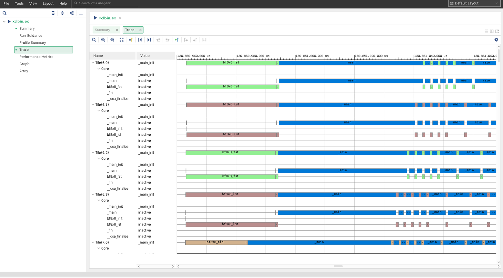

<table>
 <tr>
   <td align="center"><h1>System Project Debug Tutorial with Event Trace</h1>
   </td>
 </tr>
</table>


## Introduction

This tutorial targets the event trace feature running on the hardware board that allows you to understand how the design is executed on hardware. With support from Vitis™ analyzer, you can view the function calls, stalls (both execution and memory), and the flow of execution in the AI Engine. This information is helpful to improve the overall design performance. The steps within this tutorial introduce event trace compilation options, running the design on hardware to generate event trace with XSDB and XRT flows, collect generated event trace data, and launch Vitis_analyzer to review the design execution on hardware.

This tutorial targets the VCK190 ES board (see https://www.xilinx.com/products/boards-and-kits/vck190.html). This board is currently available via early access. If you have already purchased this board, download the necessary files from the lounge and ensure you have the correct licenses installed. If you do not have a board and ES license, contact your Xilinx sales contact.

## Overview

In this tutorial you will learn how to:

* Enable the event trace feature to compile your design.
* Execute the design on a board with XSDB or XRT flow to generate event trace data.
* Utilize Vitis_analyzer to post-process the generated event trace data to evaluate the AI Engine design.


[Event Trace Build Options, Generation and Visualization](#Event-trace-build-options-generation-and-visualization)

[Event Trace Considerations](#Event-trace-considerations)

[Event Trace Limitations](#Event-trace-limitations)


## Event Trace Build Options, Generation and Visualization

### Step 1. Download tutorial source code
Download the design from https://github.com/Xilinx/Vitis-Tutorials/. Go to ${DOWNLOAD_PATH}/AI_Engine_Development/Feature_Tutorials/09-debug-walkthrough to obtain source code of this tutorial.

### Step 2. Setup build environmental variables
Follow the instructions from the introduction section of https://github.com/Xilinx/Vitis-Tutorials/blob/master/AI_Engine_Development/Feature_Tutorials/09-debug-walkthrough/README.md for  build environmental variables setup.

### Step 3. Build the tutorial
After source code is downloaded, use the Makefile from this repository.
Type in "make" to build this event trace tutorial.

Note: Due to the size of this tutorial and build machine configuration, it may take several hours for the build to complete.

Event trace options in AI Engine Compiler. These options are enabled in the Makefile.
```bash
--event-trace=runtime
--num-trace-streams=8
--event-trace-port=gmio
--trace-plio-width=64
--broadcast-enable-core=true
--xlopt=0
```

Where
* --event-trace=runtime: Enables run-time event trace configuration. The supported values are functions, functions_partial_stalls, functions_all_stalls, and runtime.
* --num-trace-streams=8: Sets the number of trace streams to be 8 to collect generated event trace data per prior recommendation. (default:8).
* --event-trace-port=gmio: Sets the AI Engine event tracing port to be plio. (default: plio). Recommend GMIO to preserve PL resources and minimize chances with timing errors in build time.
* --trace-plio-width=64: Sets PLIO width in bit for trace streams (default: 64)
* --broadcast-enable-core=true: Enables all AI Engine cores associated with a graph using broadcast. This option reserves one broadcast channel in the array for core enabling purpose. (default: false)
* --xlopt=0: Disable aiecompiler optimization for debug purposes.

Issue the command `aiecompiler -h` to display AI Engine compiler options that include event trace.

Design with the `--event-trace=runtime` option in build that enables run-time events during compile time. This only needs to build the design once and allows different event trace levels to be generated during run time via XSDB or XRT flow.

### Step 4. Prepare hardware board

After the design is built, we are ready to run on the hardware board.
* Flash the SD card with the built sd_card.img.
* Plug the flashed SD card into the SD card slot of the vck190 board.
* Connect the USB type C cable to the board and computer that supports serial port connection.
* Set the serial port configuration with Speed=`115200`, Data=`8 bit`, Parity=`none`, Stop bits=`1 bit` and flow control=`none`.
* Power up the vck190 board to see boot messages from serial connection.

### Step 5. Event trace generation
There are two event trace generation flows to generate event trace data for your design, XSDB or XRT.

#### Step 5.1. Event trace with XSDB flow

Launch hw_server from host computer that has physical connection to vck190 board.

Launch xsdb from your host computer that built your design:
```bash
xsdb
%xsdb connect -url TCP:${COMPUTER NAME/IP}:3121
%xsdb ta
%xsdb ta 1
%xsdb source ${XILINX_VITIS}/scripts/vitis/util/aie_trace.tcl
%xsdb aietrace start -graphs dut -config-level functions_all_stalls -work-dir ./Work -link-summary ./bf_hw.xsa.link_summary -base-address 0x900000000 -depth 0x8000000
```
Note:
1. -base-address `0x900000000` is the address that needs to avoid collision with your design.
2. -depth `0x8000000` is the size of event trace file. Please adjust accordingly with your design size and amount of event trace data.
3. -config-level specifies functions, functions_partial_stalls, or functions_all_stalls.

#### Step 5.2. Event Trace with XRT flow
Create an `xrt.ini` file on SD card using the following lines.
```bash
[Debug]
aie_trace=true
aie_trace_buffer_size=100M
aie_trace_metrics = functions_all_stalls
```
Note: aie_trace_metrics specifies `functions`, `functions_partial_stalls`, or `functions_all_stalls`.

### Step 6 to Run Application after Petalinux Boots up on Board
```bash
cd /run/media/mmcblk0p1
./ps_app.exe a.xclbin
```

### Step 7. Collect Event Trace Files

After the design run completes on the hardware, the generated events and run_summary files need to be collected and ready to be examined.

#### Step 7.1. XSDB Flow
```bash
%xsdb aietrace stop
```
`aie_trace_N.txt` and `aie_trace_profile.run_summary` files are created and transferred to the host computer that launched XSDB. Make sure those files are at the same level as design's Work directory.

#### Step 7.2. XRT Flow
`aie_trace_N.txt`, `aie_event_runtime_config.json` and `xrt.run_summary` files are created on the SD card.
Transfer `aie_trace_N.txt`, `aie_event_runtime_config.json` and `xrt.run_summary` files from SD card back to where design is at same level as design's Work directory.

Note: Generated run summary file is named `xrt.run_summary` from XRT flow, and named `aie_trace_profile.run_summary` for XSDB flow.

### Step 8. Launch Vitis Analyzer to Examine Event Trace Files
```bash
vitis_analyzer aie_trace_profile.run.summary
OR
vitis_analyzer xrt.run.summary
```

Note: When run vitis_analyzer the first time to view the design, vitis_analyzer prompts asking the design's compile summary file, slect `Work/project.aiecompile_summary` file.

Select **Trace** from Vitis analyzer. Initially details of events are not shown.


Zoom in to see detailed information for each state of AI Engine tiles.


Now you know that all the steps of event trace running on hardware board.


## Event Trace Considerations

### Event Trace Choice Considerations
Based on the design, select GMIO if the design has limited PL resources left for event trace generation. Otherwise, select PLIO for event trace generation.

|           | Baremetal | Petalinux | Bandwidth                        | PL resources used |
| :---| :---: | :---: | :---: | :--- |
| PLIO/XSDB | O         | O         | pl clock-rate * trace-plio-width | Yes               |
| PLIO/XRT  |           | O         | pl clock-rate * trace-plio-width | Yes               |
| GMIO/XSDB | O         | O         |                                  | No                |
| GMIO/XRT  |           | O         |                                  | No                |

### Number of Event Trace Streams Methodology

| Number of cores | Recommended number of streams |
| :---| :---|
| Less than 10      | 1 |
| Between 10 and 20 | 2 |
| Between 20 and 40 | 4 |
| Between 40 and 80 | 8 |
| Larger than 80    | 16 |
| Intense debug     | 16 |
|                   | Not recommended to use more than 16 streams due to resource constraints |


## Event Trace Limitations
1. Due to limited resources, overruns can be seen from event trace. Follow [Number of event trace streams methodology](#Number-of-event-trace-streams-methodology) to configure number of trace streams minimize overruns issue.
2. It is required that the `--broadcast-enable-core` option is used to compile the design. This is to eliminate time sync issues where start time of each tile is off by ~100 ns or more.
3. Run forever applications are supported by XSDB flow only.

# Support

GitHub issues will be used for tracking requests and bugs. For questions go to [support.xilinx.com](https://support.xilinx.com/).

# License

Licensed under the Apache License, Version 2.0 (the "License");
you may not use this file except in compliance with the License.
You may obtain a copy of the License at

    http://www.apache.org/licenses/LICENSE-2.0


Unless required by applicable law or agreed to in writing, software
distributed under the License is distributed on an "AS IS" BASIS,
WITHOUT WARRANTIES OR CONDITIONS OF ANY KIND, either express or implied.
See the License for the specific language governing permissions and
limitations under the License.

<p align="center"><sup>XD054 | &copy; Copyright 2021 Xilinx, Inc.</sup></p>
