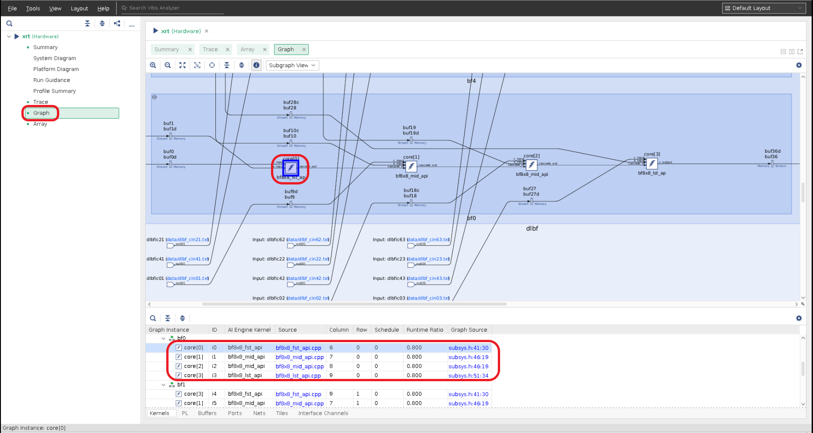
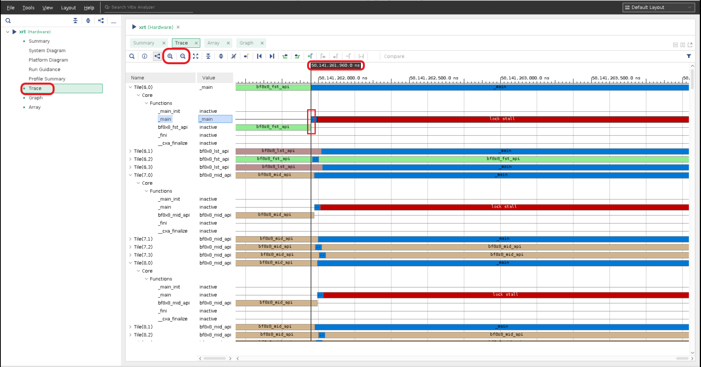
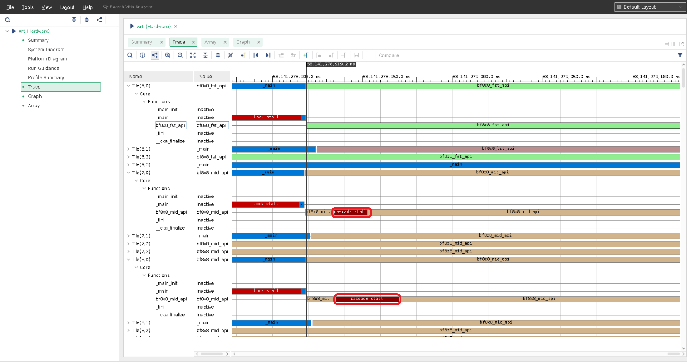

<table class="sphinxhide" width="100%">
 <tr>
   <td align="center"><h1>AI Engine Debug Walkthrough Tutorial - From Simulation to Hardware</h1>
   </td>
 </tr>
 <tr>
  <td align="center"><h2>System Project Debug Tutorial with Event Trace</h1>
   </td>
 </tr>
</table>

## Introduction

This tutorial targets the event trace feature running on the hardware board that allows you to understand how the design is executed on hardware. With support from the Vitis analyzer, you can view the function calls, stalls (both execution and memory), and the flow of execution in the AI Engine. This information is helpful to improve the overall design performance. The steps within this tutorial introduce event trace compilation options, running the design on hardware to generate event trace with XSDB and XRT flows, collect generated event trace data, and launch the Vitis_analyzer to review the design execution on hardware.

This tutorial targets the VCK190 ES board (see <https://www.xilinx.com/products/boards-and-kits/vck190.html>). This board is currently available via early access. If you have already purchased this board, download the necessary files from the lounge, and ensure you have the correct licenses installed. If you do not have a board and ES license, contact your AMD sales contact.

## Overview

In this tutorial you will learn how to:

* Enable the event trace feature to compile your design.
* Execute the design on a board with the XSDB or XRT flow to generate event trace data.
* Utilize the Vitis_analyzer to post-process the generated event trace data to evaluate the AI Engine design.

[Event Trace Build Options, Generation and Visualization](#event-trace-build-options-generation-and-visualization)

[Event Trace Considerations](#event-trace-considerations)

[Event Trace Limitations](#event-trace-limitations)

## Event Trace Build Options, Generation, and Visualization

### Step 1: Download the Tutorial Source Code

Download the design from <https://github.com/Xilinx/Vitis-Tutorials/>. Go to `${DOWNLOAD_PATH}/AI_Engine_Development/Feature_Tutorials/09-debug-walkthrough` to obtain source code of this tutorial.

### Step 2: Set Up the Build Environmental Variables

Follow the instructions from the introduction section of [09-debug-walkthrough](./README.md) for the build environmental variables setup.

### Step 3: Build the Tutorial

After the source code is downloaded, use the Makefile from this repository. Type `make` to build this event trace tutorial.

>**NOTE**: Due to the size of this tutorial and build machine configuration, it can take several hours for the build to complete.

Event trace options in the AI Engine Compiler. These options are enabled in the Makefile.

```bash
--event-trace=runtime
--num-trace-streams=8
--event-trace-port=gmio
--trace-plio-width=64
--broadcast-enable-core=true
--xlopt=0
```

Where:

* `--event-trace=runtime`: Enables the run-time event trace configuration. The supported values are `functions`, `functions_partial_stalls`, `functions_all_stalls`, and `runtime`.
* `--num-trace-streams=8`: Sets the number of trace streams to be eight to collect the generated event trace data per prior recommendation. (Default:`8`).
* `--event-trace-port=gmio`: Sets the AI Engine event tracing port to be gmio. (Default: `gmio`). Recommend GMIO to preserve PL resources and minimize chances with timing errors in the build time.
* `--trace-plio-width=64`: Sets PLIO width in bit for trace streams (Default: `64`). Valid only when event-trace-port is `plio`.
* `--broadcast-enable-core=true`: Enables all AI Engine cores associated with a graph using broadcast. This option reserves one broadcast channel in the array for core enabling purpose. (Default: `true`)
* `--xlopt=0`: Disable the aiecompiler optimization for debug purposes.

Issue the command `aiecompiler -h` to display the AI Engine compiler options that include event trace.

Design with the `--event-trace=runtime` option in the build that enables run-time events during the compile time. This only needs to build the design once and allows different event trace levels to be generated during run time via XSDB or XRT flow.

### Step 4: Prepare the Hardware Board

After the design is built, you are ready to run on the hardware board.

* Flash the SD card with the built `sd_card.img`.
* Plug the flashed SD card into the SD card slot of the VCK190 board.
* Connect the USB type C cable to the board and computer that supports the serial port connection.
* Set the serial port configuration with Speed=`115200`, Data=`8 bit`, Parity=`none`, Stop bits=`1 bit`, and flow control=`none`.
* Power up the VCK190 board to see boot messages from the serial connection.

### Step 5: Event Trace Generation

There are two event trace generation flows to generate event trace data for your design, XSDB or XRT.

#### Step 5.1: Event Trace with the XSDB Flow

Launch the hw_server from the host computer that has a physical connection to the VCK190 board.

Launch xsdb from your host computer that built your design:

```bash
xsdb
%xsdb connect -url TCP:${COMPUTER NAME/IP}:3121
%xsdb ta
%xsdb ta 1
%xsdb source ${XILINX_VITIS}/scripts/vitis/util/aie_trace.tcl
%xsdb aietrace start -graphs dut -config-level functions_all_stalls -work-dir ./Work -link-summary ./bf_hw.xsa.link_summary -base-address 0x900000000 -depth 0x8000000
```

>**NOTE:**
>
>1. `-base-address 0x900000000` is the address that needs to avoid collision with your design.
>2. `-depth 0x8000000` is the size of the event trace file. Adjust accordingly with your design size and amount of event trace data.
>3. `-config-level` specifies `functions`, `functions_partial_stalls`, or `functions_all_stalls`.

#### Step 5.2: Event Trace with the XRT Flow

Create an `xrt.ini` file on the SD card using the following lines.

```bash
[Debug]
aie_trace=true
aie_trace_buffer_size=100M
aie_trace_metrics = functions_all_stalls
```

>**NOTE:** `aie_trace_metrics` specifies `functions`, `functions_partial_stalls`, or `functions_all_stalls`.

### Step 6: Run the Application After Petalinux Boots Up on the Board

```bash
cd /run/media/mmcblk0p1
./ps_app.exe a.xclbin
```

### Step 7: Collect Event Trace Files

After the design run completes on the hardware, the generated events and run_summary files need to be collected and are ready to be examined.

#### Step 7.1: XSDB Flow

```bash
%xsdb aietrace stop
```

The `aie_trace_N.txt` and `aie_trace_profile.run_summary` files are created and transferred to the host computer that launched XSDB. Make sure those files are at the same level as the design's Work directory.

#### Step 7.2: XRT Flow

The `aie_trace_N.txt`, `aie_event_runtime_config.json`, and `xrt.run_summary` files are created on the SD card. Transfer the `aie_trace_N.txt`, `aie_event_runtime_config.json` and `xrt.run_summary` files from the SD card back to where design is at the same level as the design's Work directory.

>**NOTE**: The generated run summary file is named `xrt.run_summary` from the XRT flow and named `aie_trace_profile.run_summary` for the XSDB flow.

### Step 8: Launch Vitis Analyzer to Examine the Event Trace Files

```bash
vitis_analyzer aie_trace_profile.run_summary
OR
vitis_analyzer xrt.run_summary
```

>**NOTE:** When you run the vitis_analyzer for the first time to view the design, the vitis_analyzer prompts you for the design's compile summary file. Select the `Work/project.aiecompile_summary` file.

Select **Trace** from the Vitis analyzer. Initially, details of events are not shown.


Zoom in to see detailed information for each state of the AI Engine tiles.


Now you know that all the steps of the event trace running on the hardware board.

## Event Trace Data Explanation

* Select the  `Graph` view to examine design. Select `core[0]` at Column 6, Row 0 that runs `bf8x8_fst_api.cpp` as the first kernel.


* Select the `Trace` view. Adjust the Trace view to the right size with the `zoom in` or `zoom out` icons, and move marker to end of `bf8x8_fst_api`, or beginning of `_main`. This is considered the beginning of an iteration. A period of `lock stall` indicates data is sent from the PL to the AIE tile.


* Move the marker to beginning of `bf8x8_fst_api` when data is received from the PL to process data and then sends processed data to `Tile(7,0)` runs `bf8x8_mid_api.cpp` as the second kernel.
* `Tile(7,0)` receives data from the first kernel then sends the processed data to `Tile(8,0)` runs `bf8x8_mid_api.cpp` as the third kernel.
* `Tile(8,0)` receives data from the second kernel then sends the processed data to `Tile(9,0)` runs `bf8x8_lst_api.cpp` as the last kernel.
* Zoom in and inspect `Tile(7,0)` and `tile(8,0)` that runs the `bf8x8_mid_api` kernel, they can start earlier than the prior kernel which is normal; however there are `cascade stall` during within the execution timeline. This indicates tiles are running concurrently until they are blocked by available data from the cascade interface. This is because the design uses the cascade interface to send processed data between cores.


* Scroll down to inspect the `Tile(9,0)` execution timeline. At end of the `bf8x8_lst_api` execution, it is considered the end of an iteration.


* From the above event trace timeline view, you can calculate one iteration execution time from `tile(6,0)` to `tile(9,0)` from the above example is 58,141,279,628.0 ns - 58,141,261,960.0 ns = 17,668 ns.

>**NOTE:** Each iteration execution time varies; it isrecommended measuring multiple (ex. 10 or more) iterations execution time and average out the minor differences to determine one iteration execution time.

## Event Trace Considerations

### Event Trace Choice Considerations

Based on the design, select GMIO if the design has limited PL resources left for event trace generation.

|           | Bare-metal | Petalinux | Bandwidth                        | PL resources used |
| :---| :---: | :---: | :---: | :--- |
| PLIO/XSDB | O         | O         | pl clock-rate * trace-plio-width | Yes               |
| PLIO/XRT  |           | O         | pl clock-rate * trace-plio-width | Yes               |
| GMIO/XSDB | O         | O         |                                  | No                |
| GMIO/XRT  |           | O         |                                  | No                |

### Number of Event Trace Streams Methodology

| Number of cores | Recommended number of streams |
| :---| :---|
| Less than 10      | 1 |
| Between 10 and 20 | 2 |
| Between 20 and 40 | 4 |
| Between 40 and 80 | 8 |
| Larger than 80    | 16 |
| Intense debug     | 16 |
|                   | AMD recommends no more than 16 streams due to resource constraints |

## Event Trace Limitations

1. Because of limited resources, overruns can be seen from the event trace. Follow the [Number of event trace streams methodology](#number-of-event-trace-streams-methodology) to configure the number of trace streams to minimize overruns issues.
2. It is required that the `--broadcast-enable-core` option is used to compile the design. This is to eliminate time sync issues where the start time of each tile is off by ~100 ns or more.
3. Run forever applications are supported by the XSDB flow only.

# Support

GitHub issues will be used for tracking requests and bugs. For questions, go to [support.xilinx.com](https://support.xilinx.com/).

<p class="sphinxhide" align="center"><sub>Copyright © 2020–2023 Advanced Micro Devices, Inc</sub></p>

<p class="sphinxhide" align="center"><sup><a href="https://www.amd.com/en/corporate/copyright">Terms and Conditions</a></sup></p>
