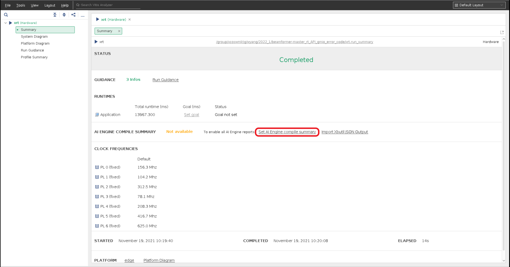
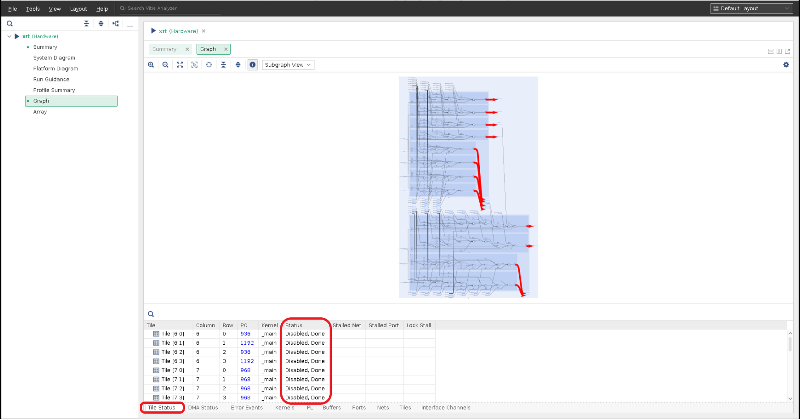
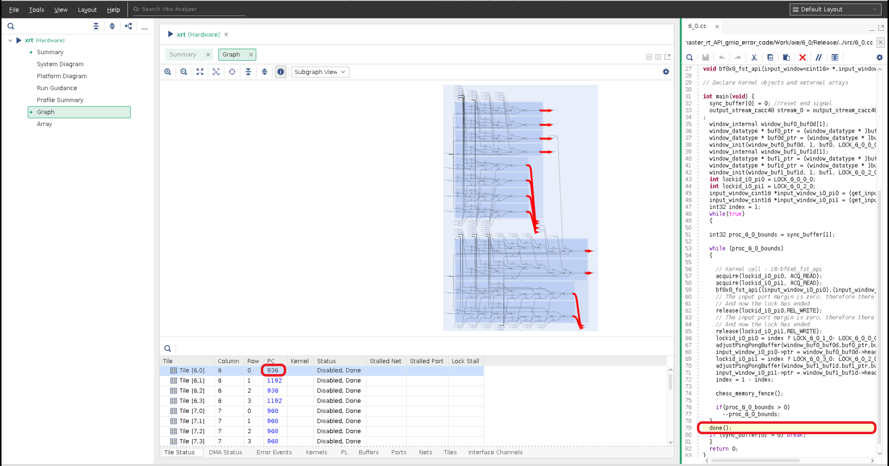
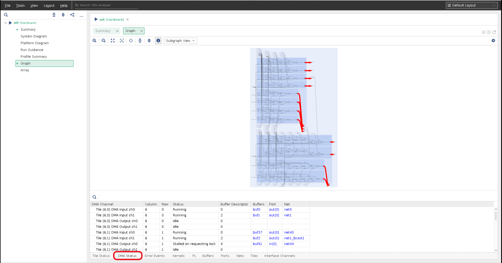
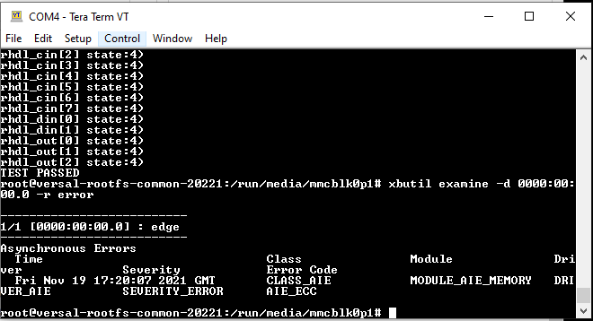

<table>
 <tr>
   <td align="center"><h1>AI Engine Debug Walkthrough Tutorial - From Simulation to Hardware</h1>
   </td>
 </tr>
  <tr>
 <td align="center"><h2>AI Engine/PL Kernel Debug with XRT Utilities on HW</h1>
 </td>
 </tr>
</table>

This section is useful when running the design in HW, and there is a stall/hang. First step is to examine the errors from XRT which in turn reflects the errors from the AIE driver. The steps below show you how to obtain this information running the tutorial design in HW.

# xbutil
The utility, `xbutil`, is supported for PL/AI Engine debug. It can be used to
* [report AI Engine running status](#Report-AI-Engine-Status).
* [report XRT errors](#Report-XRT-Errors).


# Report AI Engine Status

### Step 0 Prepare the boot image and boot the board
After the design is built correctly without error, we are ready to run on the hardware board.

* Flash the SD card with the built sd_card.img.
* Plug the flashed SD card into the SD card slot of the vck190 board.
* Connect the USB type C cable to the board and computer that supports serial port connection.
* Set the serial port configuration with Speed=115200, Data=8 bit, Parity=none, Stop bits=1 bit and flow control=none.
* Power up the vck190 board to see boot messages from serial connection.

### Step 1.1 Generate AI Engine status data
Create an xrt.ini file on SD card using the following lines.
```bash
[Debug]
aie_status=true
aie_status_interval_us=1000
```

### Step 1.2 to Run Application after Petalinux Boots up on Board
```bash
cd /run/media/mmcblk0p1
./host.exe a.xclbin
```

### Step 1.3 Collect AI Engine Status Files
After the design run completes on the hardware, the generated profiling files and run_summary files need to be collected and ready to be examined.

#### Step 1.3.1
Make sure `aie_status_edge.json`, `aieshim_status_edge.json`, `summary.csv` and `xrt.run_summary` files are generated on SD card.

#### Step 1.3.2
Power off the board and take out the sd_card from board and plug in the sd card to host's sd card reader.

#### Step 1.3.3
Copy `aie_status_edge.json`, `aieshim_status_edge.json`, `summary.csv` and `xrt.run_summary` files from SD card back to where the design is.
* `xrt.run_summary`: Run summary that contains list of files information that can be used by `vitis analyzer`.
* `aie_status_edge.json`: Status of AI Engine and AI Engine memory.
* `aieshim_status_edge.json`: AI Engine interface tiles status.
* `summary.csv`: Always created.

### Step 1.4 Launch Vitis Analyzer to Examine Status Files
```bash
vitis_analyzer xrt.run_summary
```
After above command issued, expect to see `vitis_analyzer` GUI is launched. Click on `Set AI Engine compile summary` in the summary view to set the AI Engine compile summary


## AI Engine Status Explanation
Click on `Graph` view then `Tile Status`.
* `Tile Status`: Shows all tiles completed execution and at `Disabled, Done` state.


* `PC`: Shows the current PC (program counter) value. It can be cross-probed with source code by clicking it.


* `Error Event`: Shows error events that have happened before the status was generated.
* `Buffers`: Shows buffer objects in the design with the current status.


Click on `DMA Status`. DMA status shows each tile's DMA input/output channel status.


Reference [UG1076, Analyzing AI Engine Status in Vitis Analyzer](https://docs.xilinx.com/r/en-US/ug1076-ai-engine-environment/Analyzing-AI-Engine-Status-in-Vitis-Analyzer) section for details.


# Report XRT Errors

Reference [xrt-error-api](https://xilinx.github.io/XRT/2022.1/html/xrt_native_apis.html#xrt-error-api) for detail information.

### Report Mechanism with XRT APIs
Asynchronous errors are cached in driver subsystems and can be accessed by user application through APIs. Asynchronous errors retrieved from the driver are shared between user space and kernel space.

Example using XRT APIs:
```bash
    dut.run(100);
    try {
        dut.wait();
    }
    catch (const std::system_error& ex) {
        if (ex.code().value() == ETIME) {
            xrt::error error(device, XRT_ERROR_CLASS_AIE);

            auto errCode = error.get_error_code();
            auto timestamp = error.get_timestamp();
            auto err_str = error.to_string();

            /* code to deal with this specific error */
            std::cout << timestamp << " error code:" << errCode << " Error:" << err_str << std::endl;
         } else {
         /* Something else */
         }
     }

```

### Step 2.1 Replace `host.cpp` with `host.cpp.error_code` that is available from this tutorial.
```bash
cp ${PROJECT_PATH}/sw/host.cpp.error_code ${PROJECT_PATH}/sw/host.cpp
cd ${PROJECT_PATH}
```

### Step 2.2 Compile the `host.cpp` code and package to `sd_card.img` by issuing the following commands.
```bash
make host.exe
make package
```

### Step 2.3 Follow step 0 Prepare the boot image and boot the board
[Step 0 Prepare the boot image and boot the board](#Step-0-Prepare-the-boot-image-and-boot-the-board)

### Step 2.4 After VCK190 is powered up and booted up complete, run the binaries.
```bash
cd /run/media/mmcblk0p1
./host.exe a.xclbin
```

### Step 2.5 Expected result is as follows.


### Step 2.6 Report Mechanism with xbutil
Issue command `xbutil examine -d 0000:00:00.0 -r error` to VCK190 console to get output from console.



# Support

GitHub issues will be used for tracking requests and bugs. For questions go to [support.xilinx.com](https://support.xilinx.com/).

# License

Licensed under the Apache License, Version 2.0 (the "License");
you may not use this file except in compliance with the License.
You may obtain a copy of the License at

    http://www.apache.org/licenses/LICENSE-2.0


Unless required by applicable law or agreed to in writing, software
distributed under the License is distributed on an "AS IS" BASIS,
WITHOUT WARRANTIES OR CONDITIONS OF ANY KIND, either express or implied.
See the License for the specific language governing permissions and
limitations under the License.

<p align="center"><sup>XD005 | &copy; Copyright 2021-2022 Xilinx, Inc.</sup></p>
