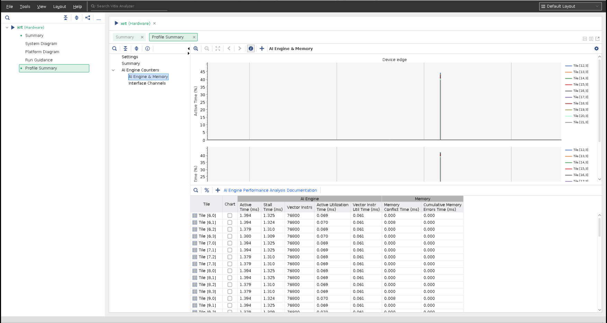
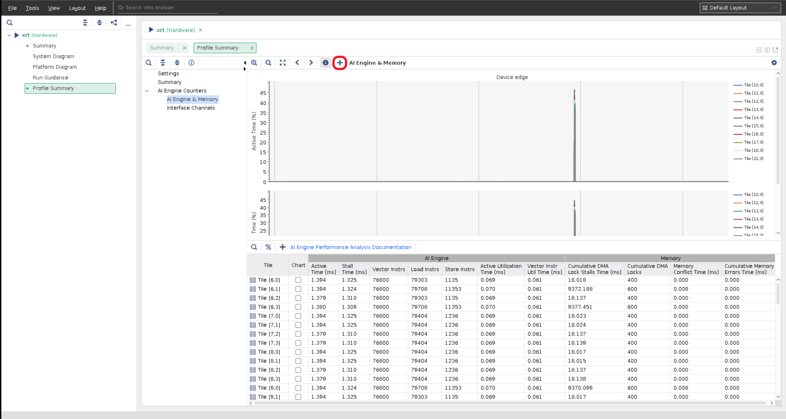

<table>
 <tr>
   <td align="center"><h1>AI Engine Debug Walkthrough Tutorial - From Simulation to Hardware</h1>
   </td>
 </tr>
 <tr>
 <td align="center"><h1>AI Engine Debug with Hardware Profiling Features</h1>
 </td>
 </tr>
</table>

## Overview

In this tutorial you will learn how to:

* Use hardware profiling features to inspect design.


## Hardware Profiling Features

Two flows, XSDB and XRT flow, are supported profiling features with AIE design. The profiling feature requires no design source code change to collect profiling data. No special options required to build the design. You can use [XRT Flow](#XRT-Flow) or [XSDB Flow](#XSDB-Flow) for this tutorial.

### XRT Flow

### Step 1.1 Prepare the boot image and boot the board
After the design is built correctly without error, we are ready to run on the hardware board.

* Flash the SD card with the built sd_card.img.
* Plug the flashed SD card into the SD card slot of the vck190 board.
* Connect the USB type C cable to the board and computer that supports serial port connection.
* Set the serial port configuration with Speed=115200, Data=8 bit, Parity=none, Stop bits=1 bit and flow control=none.
* Power up the vck190 board to see boot messages from serial connection.

### Step 1.2 Generate Profiling data
Create an `xrt.ini` file on SD card using the following lines.
```bash
[Debug]
aie_profile = true
aie_profile_interval_us = 1000
aie_profile_core_metrics = heat_map
aie_profile_memory_metrics = conflicts
aie_profile_interface_metrics = input_bandwidths:0
```
Supported predefined metrics can be found from UG1076, Profiling the AI Engine in Hardware section (https://docs.xilinx.com/r/en-US/ug1076-ai-engine-environment/Profiling-the-AI-Engine-in-Hardware).
<!--
Available predefined metrics:
1. Supported aie_profile_core_metrics: heap_map, stalls, execution, floating_point, stream_put_get, aie_trace, write_bandwidth, and read_bandwidth.
2. Supported aie_profile_memory_metrics: conflicts, dma_locks, dma_stalls_s2mm, dma_stalls_mm2s, write_bandwidths and read_bandwidths.
3. aie_profile_interface_metrics: input_bandwidths, output_bandwidths, input_stalls_idle and output_stalls_idle.
-->

### Step 1.3 to Run Application after Petalinux Boots up on Board
```bash
cd /run/media/mmcblk0p1
./host.exe a.xclbin
```

### Step 1.4 Collect Profiling Files
After the design run completes on the hardware, the generated profiling files and run_summary files need to be collected and ready to be examined.
#### Step 1.4.1
Make sure `aie_profile_edge_[core_metrics]_[memory_metrics]_[interface_metrics].csv`, `summary.csv` and `xrt.run_summary` files are created on the SD card.
#### Step 1.4.2
Power off the board and take out the sd_card from board and plug in the sd card to host's sd card reader.
#### Step 1.4.3
Copy `aie_profile_edge_[core_metrics]_[memory_metrics]_[interface_metrics].csv`, `summary.csv` and `xrt.run_summary` files from SD card back to where the design is.

### Step 1.5 Launch Vitis Analyzer to Examine Profiling Files
```bash
vitis_analyzer xrt.run.summary
```
After issuing above command, expect to see result from [Step 3 Expected Result with Vitis_Analyzer](#Step-3-Expected-Result-with-Vitis_Analyzer) and continue this tutorial.


### XSDB Flow

### Step 2.1 Prepare the boot image and boot the board
Same as step 1.1 of XRT flow.


### Step 2.2 Generate Profiling data

#### Step 2.2.1 Target Connection Setup

##### Run hardware server from computer that connects to target board
Launch hw_server from the computer that has JTAG connection to the VCK190 board.


#### Step 2.2.2 Connect XSDB to Board
Launch xsdb from your host computer at the same level of the design's Work directory:
Issue this commands from XSDB prompt,
```bash
xsdb
%xsdb connect -url TCP:${COMPUTER NAME/IP}:3121
%xsdb ta
%xsdb ta 1
%xsdb source ${XILINX_VITIS)/scripts/vitis/util/aie_profile.tcl
%xsdb aieprofile start -graphs dut -work-dir ./Work -core-metrics heat_map -memory-metrics conflicts -interface-metrics input_bandwidths:0 -interval 20 -samples 100
```
note:
1. -graph: The graph profile data to be captured.
2. -core-metrics: The core metrics to be captured.
3. -memory-metrics: The memory metrics to be captured.
4. -interface-metrics: The interface metrics to be captured.
5. -interval: The sample interval in milliseconds (default 20).
6. -samples: The number of counter samples (default 100).

**IMPORTANT: After above command issued, wait until Count: 10, Count: 20, ... is displayed from XSDB console. This indicates XSDB is ready to collect design profiling data.**

### Step 2.3 to Run Application after Petalinux Boots up on Board
```bash
cd /run/media/mmcblk0p1
./host.exe a.xclbin
```

### Step 2.4 Inspect generated Files
After XSDB complete, expect to see `aie_profile.csv`, `summary.csv` and `aie_trace_profile.run_summary` files are created on the host computer at the location where XSDB is launched.

### Step 2.5 Launch Vitis Analyzer to Examine Profiling Files
```bash
vitis_analyzer aie_trace_profile.run.summary
```
After issuing above command, expect to see result from [Step 3 Expected Result with Vitis_Analyzer](#Step-3-Expected-Result-with-Vitis_Analyzer) and continue this tutorial.

### Step 3 Expected Result with Vitis_Analyzer
Vitis_analyzer GUI is launched, select `Profile Summary` then `AI Engine & Memory` or `Interface Channels`.


### Step 4 Open Multiple Profiling Runs with Vitis_Analyzer
You can run the application as many times as you would like with your preferences. However, some of these metrics' sets are interconnected because some use group events and others use individual events. For example, the heat_map metric set contains a metric that groups all kinds of stall events in a single metric along with other metrics that group data transfer events (load/store, streams, cascade, etc.) and vector instructions. To get a better view of which stall type(s) are prevalent, re-run with the stalls metric set. To better understand execution, re-run with the execution metric set.
### Step 4.1 Generate First Profiling Data
Apply `heat_map` for `core-metrics`, `conflicts` for `memory-metrics`, and `input_bandwidths` for `interface-metrics` to collect first profiling data.
Follow step 1.1 to 1.4 if using XRT flow or follow step 2.1 to 2.4 if using XSDB flow. Save profiling data to a directory ex. `profile_0`.
### Step 4.2 Generate Second Profiling Data
Apply `execution` for `core-metrics`, `dma_locks` for `memory-metrics`, and `output_bandwidths` for `interface-metrics` to collect second profiling data.
Follow step 1.1 to 1.4 if using XRT flow or follow step 2.1 to 2.4 if using XSDB flow. Save profiling data to a directory ex. `profile_1`.
### Step 4.3 Open First Profiling Data
Follow step 1.5 for XRT flow or follow step 2.5 for XSDB flow to open first profiling run_summary file with vitis_analyzer.
### Step 4.4 Open Second Profiling Data
Click on `+` from GUI, highlighted in red square to browse and select second profiling run_summary file. Two runs of profiling data are combined.

This example combines first run with `heat_map`, `conflicts`, and `input_bandwidths` metrics and second run with `execution`, `dma_locks` and `output_bandwidth` metrics.

Click on `%` to toggle between absolute and percentage values of collected design metrics.


Click on column header to sort the data within those rows. Click once to display selected row data in ascending order. Click twice to display selected row data in descending order. Click three times to disable sorting function.


### Profiling Data Explanation
An easy way to know the definition of profile data category by moving mouse cursor to column title. For example, `Active Time (ms)` is "Amount of time (in ms) AI Engine was active when it was enabled."

#### AI Engine core profiling data
1. `Active Time (ms)` = `Stall Time (ms)` + `Active Utilization Time (ms)`.
2. Take tile(6,0) as an example, tile(6,0) is active for a period of 1.401 milliseconds, where 1.333 milliseconds is stalled and 0.069 milliseconds is actively executing instructions. During 0.069 milliseconds active period, 0.061 milliseconds is executing vector instructions. There are 0.008 milliseconds spent on other instructions such as load/store instructions.
3. There are 76800 `Vector instructions`, 79303 `Load Instructions` and 1135 `Store Instructions` during `Active Utilization Time (ms)`.
#### AI Engine memory profiling data
1. `Memory Conflict Time (ms)` indicates memory access conflicts time runing AI Engine execution. Recommend rerunning `aiesimulator` with `-enable-memory-check` option to check design memory access conflicts.
2. `Cumulative Memory Errors Time (ms)` indicates time taken due to ECC errors in any of the data memory banks as well as MM2S and S2MM DMAs.
#### Interface profiling data
Select `Profile Summary` then `Interface Channels`.

1. `PLIO Bandwidth` displays the design ran with PLIO bandwidth in unit of MB/s. This info is a good indication the design is I/O bound or compute bound design and provides guidance to optimize design performance.

### Profiling Data Analysis
1. From AI Engine core profiling data, tile(6,1), tile(6,3),... have much larger number of `Store Instructions`. An indication check tile source code if lowering number of `Store Instructions` can be done to improve performance.
2. From AI Engine Memory profiling data, tile(6,1), tile(9,0),... have non-zero `Memory Conflict Time` value. Suggest running AIE simulator to check for memory access violations and clear those violations if any.
3. From AI Engine Memory profiling data, tile(6,1), tile(6,3),... have longer `Cumulative DMA Lock Stalls Time`. This leads to check input/output PLIO area to see if PLIO frequency or PLIO width is implemented properly. Suggest using Integrated Logic Analyzer (ILA) to check PLIO input/output states during run time.
4. From AI Engine Interface profiling data, hardware profiling data shows design `PLIO Bandwidth`. Apply sorting function by click on `PLIO Bandwidth (MB/s)` to examine highest and lowest PLIO bandwidth. Highest is 289.741 MB/s vs. lowest 254.709 MB/s is over 13% difference. This difference suggests to check PLIO input/output implementation and use ILA checking PLIO input/output during run time.


# Support

GitHub issues will be used for tracking requests and bugs. For questions go to [support.xilinx.com](https://support.xilinx.com/).

# License

Licensed under the Apache License, Version 2.0 (the "License");
you may not use this file except in compliance with the License.
You may obtain a copy of the License at

    http://www.apache.org/licenses/LICENSE-2.0


Unless required by applicable law or agreed to in writing, software
distributed under the License is distributed on an "AS IS" BASIS,
WITHOUT WARRANTIES OR CONDITIONS OF ANY KIND, either express or implied.
See the License for the specific language governing permissions and
limitations under the License.

<p align="center"><sup>XD005 | &copy; Copyright 2021 Xilinx, Inc.</sup></p>
