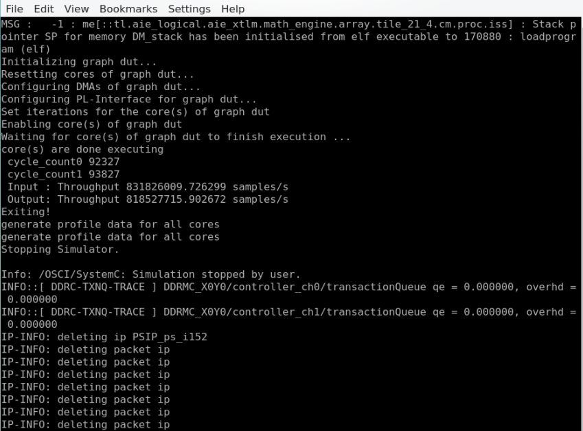
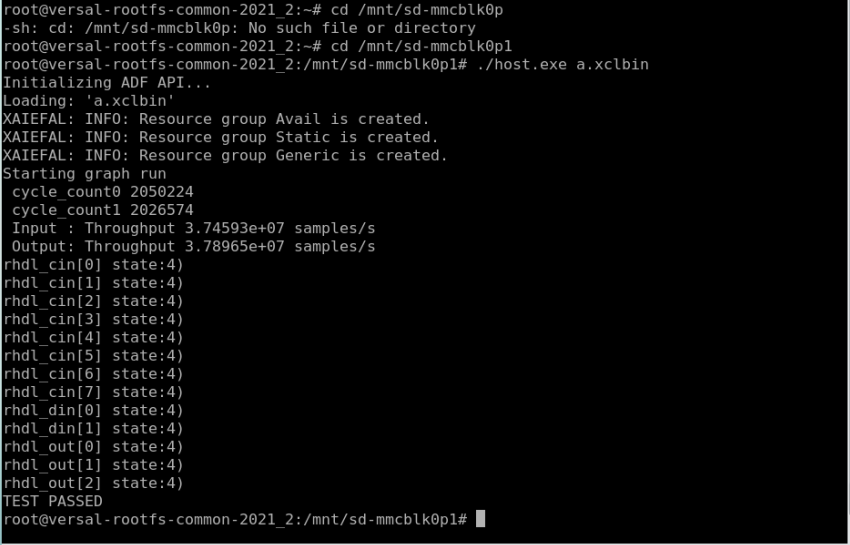
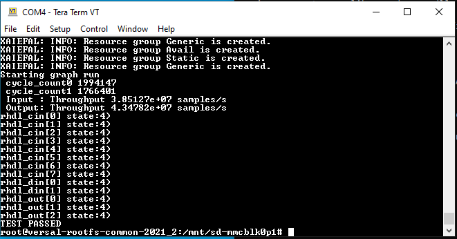
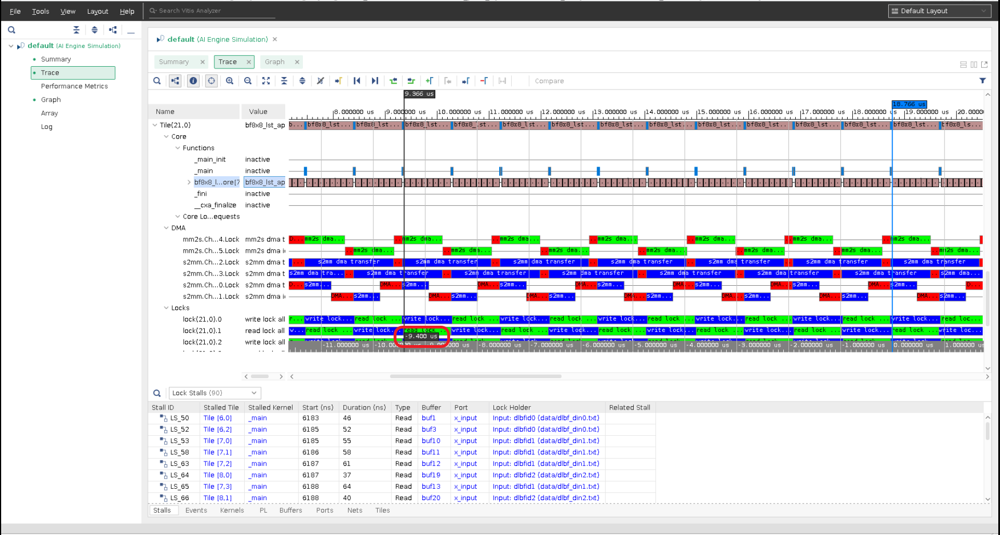

<table>
 <tr>
   <td align="center"><h1>AI Engine Debug Walkthrough Tutorial - From Simulation to Hardware</h1>
   </td>
 </tr>
 <tr>
 <td align="center"><h1>Profiling Graph Inputs and Outputs with Profiling APIs and profiling features</h1>
 </td>
 </tr>
</table>

## Overview

In this tutorial you will learn how to:

* Add profiling APIs in graph and PS code to calculate design performance.
* Generate VCD file to view design information.
* Cross check between calculated performance with profiling APIs and vitis_analyzer trace view.
* Use profiling features to inspect design.

## Profiling APIs
Start profiling API,
```bash
/// Start profiling and acquire resources needed for profiling. Should be called after graph::init().
/// @param io Plarform PLIO or GMIO object.
/// @param option io_profiling_option enum.
/// @param value Optional value for the specified option.
/// @return Return event::handle to be used by read_profiling and stop_profiling. Return event::invalid_handle for error conditions or unsupported use cases.
static handle start_profiling(IoAttr& io, io_profiling_option option, uint32 value = 0);
```
Read profiling API,
```bash
/// Read profiling.
/// @param h event::handle returned from start_profiling.
/// @return Profiling value.
static long long read_profiling(handle h);
```
Stop profiling API,
```bash
/// Stop profiling and release resources needed for profiling.
/// @param h event::handle returned from start_profiling.
static void stop_profiling(handle h);
```


[1. Profiling APIs with AIE Emulator](#1-Profiling-APIs-with-AIE-Emulator)

[2. Profiling APIs with HW Emulator](#2-Profile-APIs-with-HW-Emulator)

[3. Profiling APIs on HW](#3-Profile-APIs-on-HW)

[4. Cross Check I/O Performance values with VCD](#4-Cross-Check-I/O-Performance-values-with-VCD)

[5. Profiling Features](#5-Profiling-Features)


## 1. Profiling APIs with AIE Emulator

### Step 1.1 Download the Project
Clone the project source from git repository and unzip the zip file.

### Step 1.2 Prepare Profiling APIs applied graph code
Use this tutorial's graph.cpp.profile_api that contains AIE profiling APIs.
```bash
cd ${DOWNLOAD_PATH}/AI_Engine_Development/Feature_Tutorials/09-debug-walkthrough/aie
cp graph.cpp.profile_api graph.cpp
cd ..
cp Makefile.emu Makefile
make libadf.a
```

### Step 1.3 Run AIE Emulator
```bash
aiesimulator --pkg-dir=./Work --i=. --profile
```

### Step 1.4 Expected Result



```bash
vitis_analyzer ./aiesimulator_output/default.aierun_summary
```

## 2. Profiling APIs with HW Emulator

### Step 2.1 Prepare profiling APIs applied host code and Makefile
After step 1.1 completed.
Use this tutorial's host.cpp.profile_api that contains AIE profiling APIs and Makefile for HW Emulation.
```bash
cd ${DOWNLOAD_PATH}/AI_Engine_Development/Feature_Tutorials/09-debug-walkthrough/sw
cp host.cpp.profile_api host.cpp
cd ..
cp Makefile.emu Makefile
```

### Step 2.2 Build the Design
```bash
make
```

### Step 2.3 Run Hardware Emulator
```bash
./launch_hw_emu.sh
```

### Step 2.4 Run Application
After Petalinux boots up.
```bash
cd /run/media/mmcblk0p1
./host.exe a.xclbin
```



## 3. Profiling APIs on HW
### Step 3.1 Prepare HW Makefile
After step 1.1 completed.
Use this tutorial's Makefile for Hardware.
```bash
cd ${DOWNLOAD_PATH}/AI_Engine_Development/Feature_Tutorials/09-debug-walkthrough
cp Makefile.profile_hw Makefile
make
```

### Step 3.2 Flash SD card
Flash generated sd_card.img to SD card.

### Step 3.3 Boots up VCK190 board
Plug in flashed completed SD card to vck190 board's sd slot.
Power up the vck190 board.

### Step 3.4 Run the Application
After vck190 board boots up and ready to accepts commands with Linux prompt, issue these command from terminal.
```bash
cd /run/media/mmcblk0p1
./host.exe a.xclbin
```

### Step 3.5 Expected result


Note: Due to slower memory access, hardware and hardware emulation performance values are not optimized and less than AIE simulation.


## 4. Cross Check I/O Performance values with VCD
### Step 4.1 VCD generation
Command to generate AIE emulation VCD file.
```bash
aiesimulator --pkg-dir=./Work --i=. --dump-vcd=foo
```
Command to generate hardware emulation VCD file.
```bash
./launch_hw_emu.sh -add-env AIE_COMPILER_WORKDIR=${PROJECT_FULL_PATH}/Work -aie-sim-options ${PROJECT_FULL_PATH}/aiesim_options.txt
```
Where aiesim_options.txt content is
```bash
AIE_DUMP_VCD=foo
```
Follow step 2.4 to run application.

### Step 4.2 Launch vitis_analyzer to view trace
Launch vitis_analyser for AIE emulation.
```bash
vitis_analyzer ./aiesimulator_output/default.aierun_summary
```
Launch vitis_analyser for hardware emulation.
```bash
vitis_analyzer ./sim/behav_waveform/xsim/default.aierun_summary
```

Hardware event trace steps are available at https://gitenterprise.xilinx.com/swm/Vitis-Tutorials/blob/2022.1_next/AI_Engine_Development/Feature_Tutorials/09-debug-walkthrough/Debug4_et.md

### Step 4.3 Locate profiled interface
After default.aierun_summary file is opened with Vitis_analyzer, select `Graph` view, locate the output file `data/ublf_out0.txt` that associated with `attr_o_ulbfo0` PLIO from host.cpp.
```bash
PLIO *attr_o_ulbfo0  = new PLIO("ulbfo0",  plio_64_bits, "data/ulbf_out0.txt");
```
This PLIO is configured using profile API for output performance measurement. This can be found from host.cpp
```bash
    event::handle handle1 = event::start_profiling(*attr_o_ulbfo0,  event::io_stream_start_to_bytes_transferred_cycles, OUT_LEN*sizeof(cint16)*2);
...
    if (handle1 != event::invalid_handle)
    {   
        cycle_count1 = event::read_profiling(handle1);
    }
...
    if (cycle_count1)
    {
        double throughput1 = (double)OUT_LEN*2/(cycle_count1 * 1e-9); //samples per second
        printf(" Output: Throughput %f samples\n", throughput1);
    } else {
        printf("cycle_count1 is ZERO!\n");
    }
```

Select the tile links to the output file by moving cursor on top of the tile.

### Step 4.4 Locate tile
Switch to `Trace` view, Locate tile(21,0).

### Step 4.5 Use tool to measure execution time
Move marker to beginning of kernel execution from an iteration. Add second marker and move the second marker to beginning of another iteration.



### Step 4.6 Performance Calculation
Above example indicates 9.400 microseconds (us) is used for 10 iterations execution time. Each iteration execution time is 0.94 us or 940 nanoseconds (ns) in average.

Per output file `ulbf_out0.txt`, 38400 lines for 100 iterations. Each iteration processes and outputs 384 lines. Each line has 2 cint16 samples.

Performance calculation:

1,000,000,000(AI engine frequency in HZ) / 940(clock cycles each iteration) x 384(lines each iteration) x 2(samples per line) = 817,021,276.59(samples/second). This number is close to profiling API reported, 818,527,715.90 samples/s.


## 5. Profiling Features

Two flows, XSDB and XRT flow, are supported profiling features with AIE design. The profiling feature requires no design source code change to collect profile data. No special options required to build the design.

### Step 5.1
After the design is built correctly without error, we are ready to run on the hardware board.

* Flash the SD card with the built sd_card.img.
* Plug the flashed SD card into the SD card slot of the vck190 board.
* Connect the USB type C cable to the board and computer that supports serial port connection.
* Set the serial port configuration with Speed=115200, Data=8 bit, Parity=none, Stop bits=1 bit and flow control=none.
* Power up the vck190 board to see boot messages from serial connection.

### Step 5.2 Generate Profiling data

#### Step 5.2.1 XSDB floe
XSDB flow to collect profile data is similar to Event Trace flow.

Launch hw_server from host computer that has physical connection to vck190 board.

Launch xsdb from your host computer that built your design:
```bash
xsdb
%xsdb connect -url TCP:${COMPUTER NAME/IP}:3121
%xsdb ta
%xsdb ta 1
%xsdb source ${XILINX_VITIS_INSTALL_PATH}/installs/lin64/Vitis/2021.2/scripts/vitis/util/aie_profile.tcl
%xsdb aieprofile start -graphs dut -work-dir ./Work -core-metrics heat_map -memory-metrics write_bandwidths -interval 20 -samples 100
```
note:
1. -graph: The graph profile data to be captured.
2. -core-metrics: The core metrics to be captured.
3. -memory-metrics: The memory metrics to be captured.
4. -interval: The sample interval in milliseconds (default 20).
5. -samples: The number of counter samples (default 100).

**IMPORTANT: After above command issued, wait until Count: 10, Count: 20, ... is displayed from XSDB console. This indicates XSDB is ready to colloect design profile data.**

Note:
1. Supported aie_profile_core_metrics: heap_map, stalls, execution, floating_point, stream_put_get, aie_trace, write_bandwidth, and read_bandwidth.
2. Supported aie_profile_memory_metrics: conflicts, dma_locks, dma_stalls_s2mm, dma_stalls_mm2s, write_bandwidths and read_bandwidths.
3. aie_profile_interface_metrics: input_bandwidths, output_bandwidths, input_stalls_idle and output_stalls_idle.

### Step 5.2.2 XRT FLow
Create an `xrt.ini` file on SD card using the following lines.
```bash
[Debug]
aie_profile = true
aie_profile_interval_us = 1000
aie_profile_core_metrics = heat_map
aie_profile_memory_metrics = write_bandwidths
aie_profile_interface_metrics = input_bandwidths:0
```

### Step 5.3 to Run Application after Petalinux Boots up on Board
```bash
cd /run/media/mmcblk0p1
export XILINX_XRT=/usr
./ps_app.exe a.xclbin
```

### Step 5.4 Collect Profiling Files
After the design run completes on the hardware, the generated profiling files and run_summary files need to be collected and ready to be examined.

#### Step 5.4.1 XSDB Flow
After XSDB complete, expect to see `aie_profile.csv`, `summary.csv` and `aie_trace_profile.run_summary` files are created and transferred to the host computer that launched XSDB. Make sure those files are at the same level as design's `Work` directory.

#### Step 5.4.2 XRT Flow
`aie_profile_edge_[core_metrics]_[memory_metrics]_[interface_metrics].csv`, `summary.csv` and `xrt.run_summary` files are created on the SD card.
Transfer `aie_profile_edge_[core_metrics]_[memory_metrics]_[interface_metrics].csv`, `summary.csv` and `xrt.run_summary` files from SD card back to where design is at same level as design's Work directory.

Note: Generated run summary file is named `xrt.run_summary` from XRT flow, and named `aie_trace_profile.run_summary` for XSDB flow.

### Step 5.5 Launch Vitis Analyzer to Examine Profiling Files
```bash
vitis_analyzer aie_trace_profile.run.summary
OR
vitis_analyzer xrt.run.summary
```

### Step 5.6 Expected Result
Vitis_analyzer GUI is launched, select `Profile Summary` then `AI Engine & Memory` or `Interface Channels`.


### Step 5.7 Open Multiple Profiling Runs
You can run the application as many times as you would like with your preferences. However, some of these metrics sets are interconnected because some use group events and others use individual events. For example, the heat_map metric set contains a metric that groups all kinds of stall events in a single metric along with other metrics that group data transfer events (load/store, streams, cascade, etc,) and vector instructions. To get a better view of which stall type(s) are prevalent, re-run with the stalls metric set. To better understand execution, re-run with the execution metric set.

Above example combines first run with `heat_map`, `conflicts`, and `input_bandwidths` metrics and second run with `execution`, `dma_locks` and `output_bandwidth` metrics.
From above example we can get better picture about the design active time vs stall time in terms duration for example. Click on `%` to convert profiling data to percentage if preferred.


## Limitations
Due to limited AIE performance counters, calling AIE profiling APIs may return errors. Host code is required to check profiling APIs' return code to ensure correctness of profiling APIs.

# Support

GitHub issues will be used for tracking requests and bugs. For questions go to [support.xilinx.com](https://support.xilinx.com/).

# License

Licensed under the Apache License, Version 2.0 (the "License");
you may not use this file except in compliance with the License.
You may obtain a copy of the License at

    http://www.apache.org/licenses/LICENSE-2.0


Unless required by applicable law or agreed to in writing, software
distributed under the License is distributed on an "AS IS" BASIS,
WITHOUT WARRANTIES OR CONDITIONS OF ANY KIND, either express or implied.
See the License for the specific language governing permissions and
limitations under the License.

<p align="center"><sup>XD005 | &copy; Copyright 2021 Xilinx, Inc.</sup></p>
