<table class="sphinxhide" width="100%">
 <tr>
   <td align="center"><h1>AI Engine Debug Walkthrough Tutorial - From Simulation to Hardware</h1>
   </td>
 </tr>
 <tr>
 <td align="center"><h2>AI Engine Debug with Integrated Logic Analyzer (ILA)</h1>
 </td>
 </tr>
</table>

[AI Engine Debug with Integrated Logic Analyzer](#ai-engine-debug-with-integrated-logic-analyzer)

## AI Engine Debug with Integrated Logic Analyzer

Adding ChipScope helps debugging AIE PL interfaces in the design running on hardware including checking for AXI protocol violations, hardware kernel issues, data integrity, and performance issues of the design. To debug using integrated logic analyzers (ILAs), the design is required to enable ILA in the hardware build.

## Enable ILA in the Design

This tutorial uses the `v++ --debug` option to enable the ILA IP core insertion to the design.
Syntax:

```
--debug.chipscope <cu_name>[:<interface_name>]
```

Example:

```
v++ -g -l --platform ${PLATFORM} ${XOS} ${LIBADF} \
       --debug.chipscope s2mm_v4_1:s0 \
       --debug.chipscope mm2s_v4_1:s0 \
       -t ${TARGET} ${VPP_FLAGS} -o $@
```

>**NOTE:** v++ allows multiple `--debug.chipscope` lines to meet design debug needs.

### Step 1: Prepare the ILA-enabled Makefile

Use the provided `Makefile.ILA` from this tutorial's root directory. Rename `Makefile.ILA` to `Makefile`.

```bash
cd ${DOWNLOAD_PATH}/AI_Engine_Development/Feature_Tutorials/09-debug-walkthrough
cp Makefile.ILA Makefile
```

### Step 2: Build the ILA-enabled Design

```bash
make clean; make
```

After the design is built, inspect the ILA insertion with `mm2s_v4_1:s0` and `s2mm_v4_1:s0` interfaces.
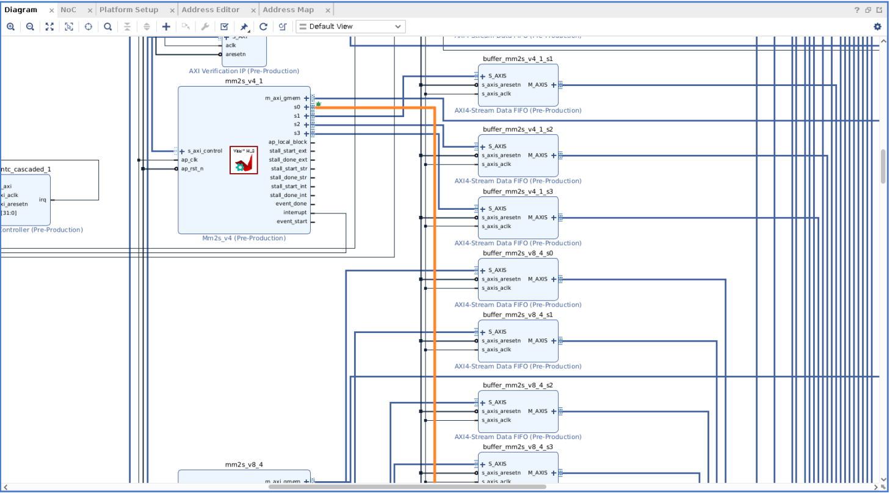
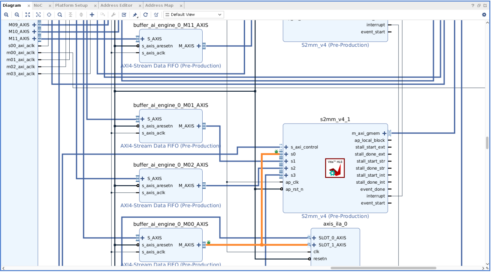

### Step 3: Boot Up the Design

Flash the SD card with the ILA-enabled design, plug in the flashed SD card to VCK190 SD card slot, and boot up the board.

## Set Up the Connection with Vivado

### Step 4: Set Up the Connection to the Hardware Board

#### Step 4.1. Target Connection Setup

Run the hardware server from the computer that connects to the target board. To do so, launch hw_server from the computer that has the JTAG connection to the VCK190 board.


#### Step 4.2: Launch Vivado

Launch the AMD Vivado™ Design Suite from where the to be debugged project is by issuing the command, `vivado`.  

#### Step 4.3: Set Up the Vivado Hardware Manager

After Vivado is up, click th highlighted icon.
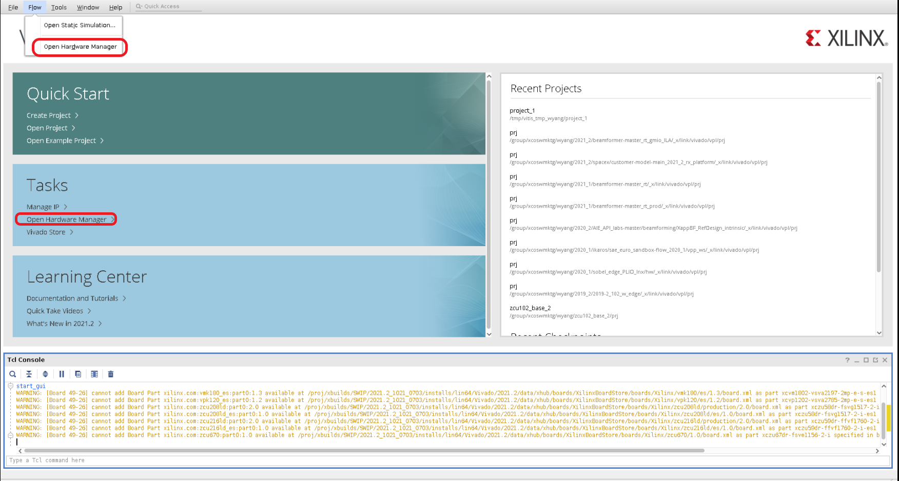

#### Step 4.4: Set Up the Hardware Target

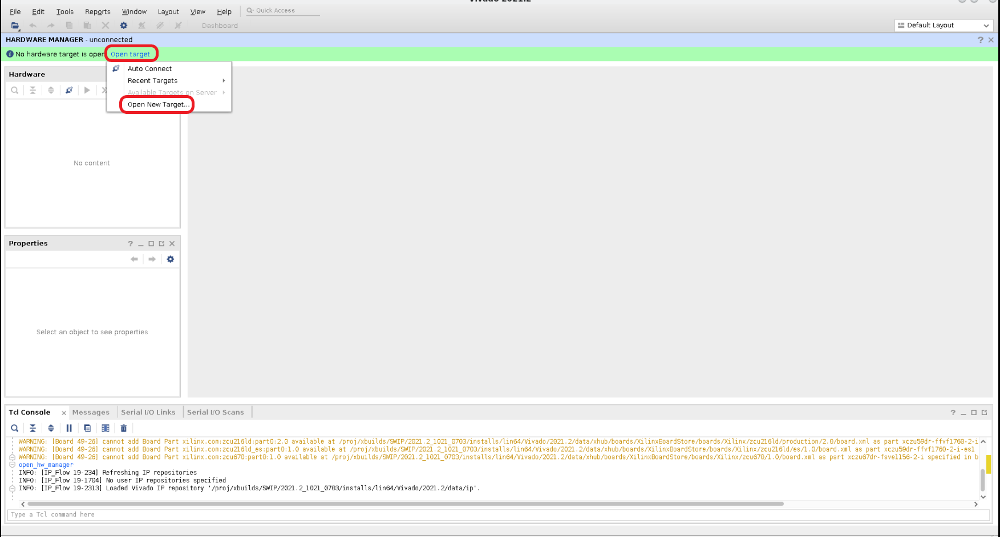

#### Step 4.5: Input the Hardware Target

Enter the hardware server's IP address or hostname to the highlighted area, and click **Next**.
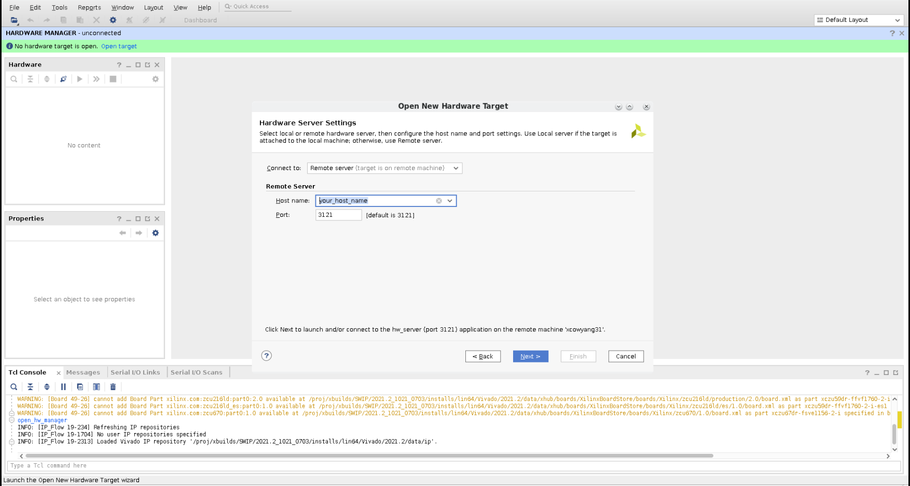

#### Step 4.6: Check the Hardware Target

Confirm the target's information from the JTAG chain, then click **Next**.
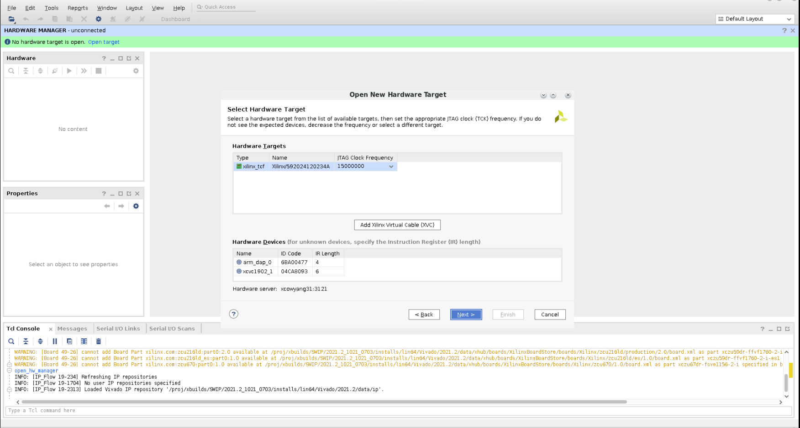

#### Step 4.7: Select the Probe File

Click the ellipsis (**...**) to select the generated probe file, `${PROJECT_PATH}/bf_hw.ltx` or `${PROJECT_PATH}/_x/link/int/bf_hw.ltx` from this design.

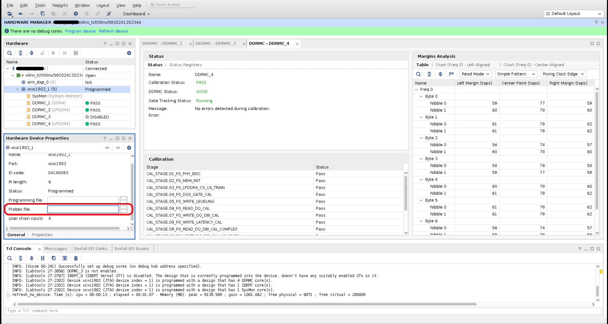

#### Step 4.8: Select the ILA to Be Examined

Click `hw_ila_1` to examine the design.
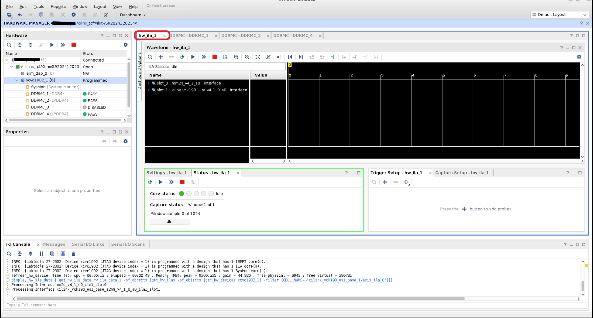

#### Step 4.9: Set Up the Design's Signals to be Debugged

Click `+` to configure the desired signals and their values during run time.
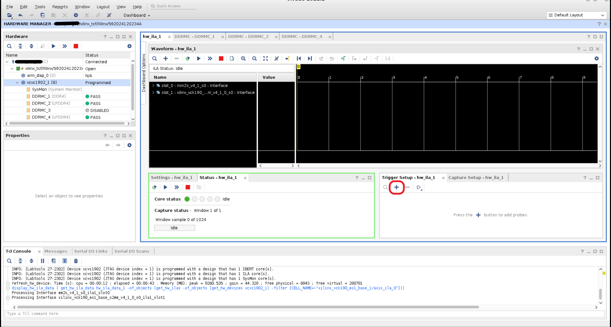

The following example selects the `TVALID` signal from the `mm2s_v4_1_s0` and `vitis_design_s2mm_v4_1_0_so` interfaces that capture valid transfers are driven from the master. Set the value to `B (both transition` so the transitions of the valid data signals can be captured.

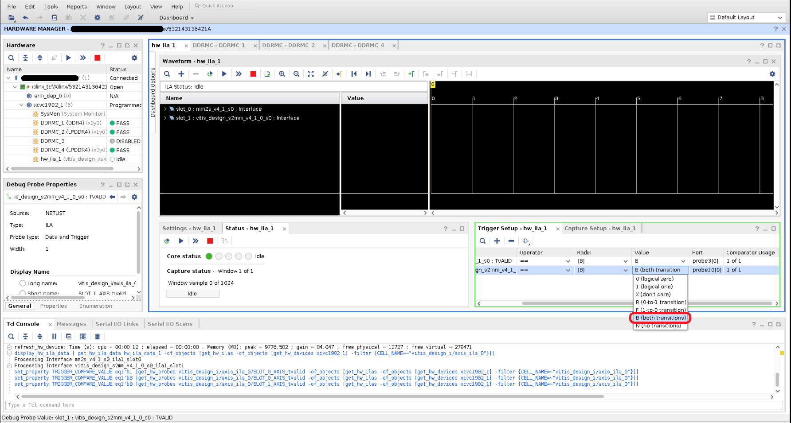

#### Step 4.10: Enable ILA to Capture the Configured Signals to Debug

Click one of highlighted icons to capture the configured signals.
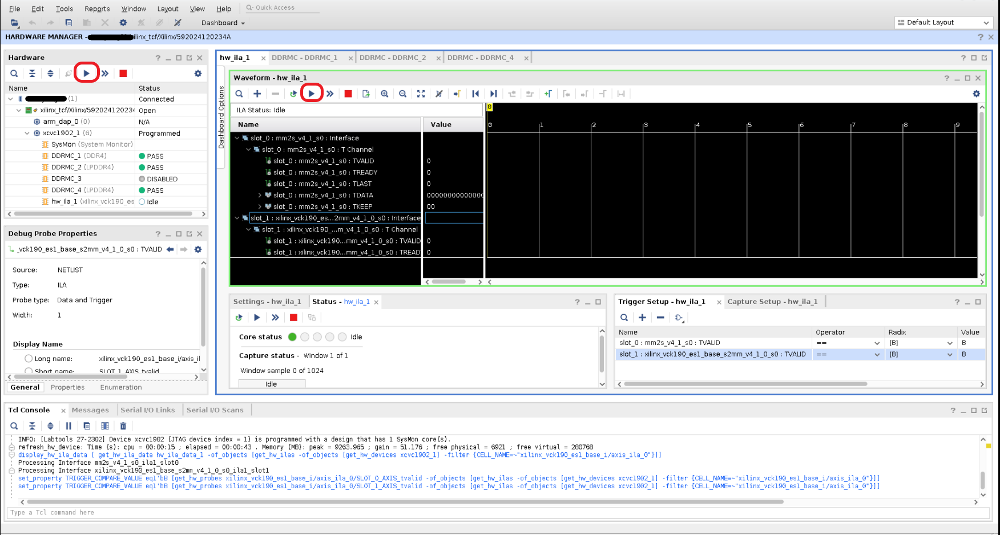

Wait for ILA to be ready to capture signals. Run the application from VCK190 board.

#### Step 4.11: Expected Result

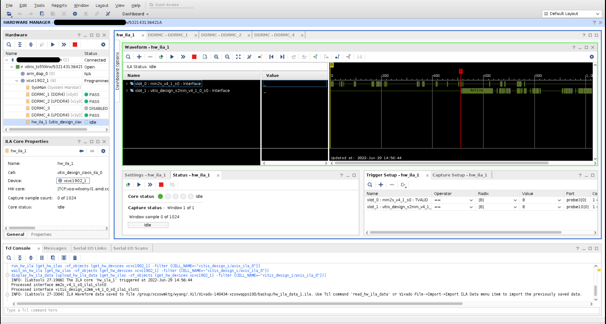

After completing above steps, you are able to see the captured, related AXI signals and data are shown in the waveform with timing information from Vivado.

#### Step 5: Examine Captured Results

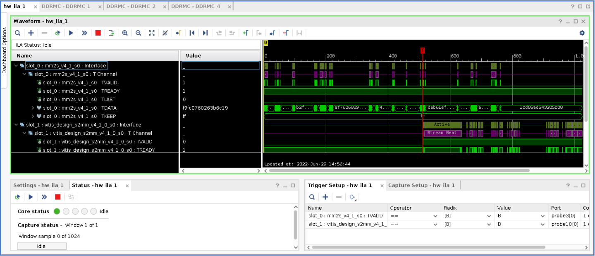

Expand `slot_0:mm2s_v4_1_s0:Interface` and `slot_1:vitis_design_s2mm_v4_1_0_s0:Interface` by clicking the `>` icon. Review the above captured result. `mm2s_v4_1_s0:TVALID` shows '1' which indicates a valid data is available at the time marker pointed. Moving the time marker across time line, changes of AIX protocol values indicate values changed at what time shown below. For example, at clock cycle 4, `TVALID` is 1 where `TDATA` is `57f8a5855ea25c52`. This is how to determine when and what a valid data is sent/received.
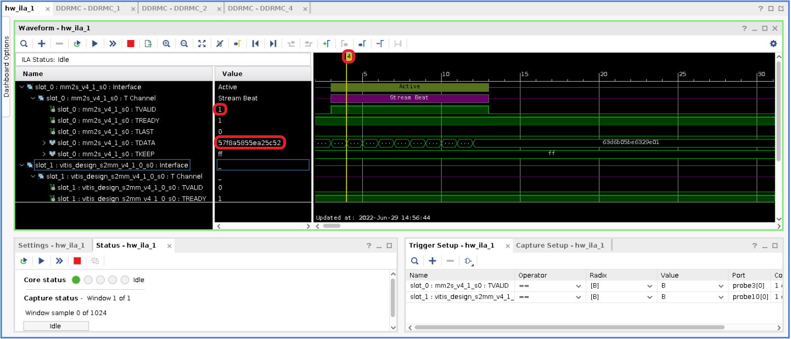

# Support

GitHub issues will be used for tracking requests and bugs. For questions, go to [support.xilinx.com](https://support.xilinx.com/).

<p class="sphinxhide" align="center"><sub>Copyright © 2020–2023 Advanced Micro Devices, Inc</sub></p>

<p class="sphinxhide" align="center"><sup><a href="https://www.amd.com/en/corporate/copyright">Terms and Conditions</a></sup></p>
