<table class="sphinxhide" width="100%">
 <tr width="100%">
    <td align="center"><h1>AI Engine Development</h1>
    <a href="https://www.xilinx.com/products/design-tools/vitis.html">See Vitis™ Development Environment on xilinx.com</br></a>
    <a href="https://www.xilinx.com/products/design-tools/vitis/vitis-ai.html">See Vitis™ AI Development Environment on xilinx.com</a>
    </td>
 </tr>
</table>

## Hardware-Emulation Debug Walkthrough 

## Introduction

To simulate the entire system, including AI Engine graph and PL logic along with XRT-based host application to control the AI Engine and PL, for a specific board and platform, you must use the hardware emulation flow. This flow includes the SystemC model of the AI Engine, transaction-level SystemC models for the NoC, DDR memory, PL Kernels (RTL), and PS (running on QEMU). This can be used in analyzing the data which helps you gauge the efficiency of the kernels, the stall and active times associated with each AI Engine, and pinpoint the AI Engine kernel whose performance might not be optimal.

Below are some of the features of the hardware emulation that are covered in this section of the tutorial.

## Features

<table style="width:100%">

<tr>
<td>
<a href="./README.md#Build-for-Hardware-Emulation-using-Vitis-IDE">Build for Hardware Emulation using Vitis IDE</a>
</td>
<td>
Explains how to create system project,build for Hardware emulation and run.
</td>
</tr> 

<tr>
<td>
<a href="./README.md#Debug-PL-kernels-using-the-Vivado-Logic-Simulator">Debug PL kernels using the Vivado Logic Simulator</a>
</td>
<td>
Explains how to use Vivado XSIM to debug the PL kernels.
</td>
</tr>
 
<tr>
<td>
<a href="./README.md#Performance-of-the-AI-Engine-using-hardware-emulation-results">Performance of the AI Engine using hardware emulation results</a>
</td>
<td>
This section profiles the system for hardware emulation and compares the througput of the AI Engine design in hardware emulation with the througput in AI Engine simulation.
</td>
</tr>
 
<tr>
<td>
<a href="./README.md#Command-line-project-source-code-debug-with-Vitis-IDE">Command line project source code debug with Vitis IDE</a>
</td>
<td>
This section helps you debug your command-line project by using the features of Vitis IDE debugger without porting your system design to IDE.
</td>
</tr>

</table>

### Section-1
## Build for Hardware Emulation using Vitis IDE

Before getting into this section, it is expected that you created AI Engine application in Vitis IDE and ran x86simulation [Build and Simulate in Vitis IDE](../AIE_Simulation/README.md#Build-and-simulate-in-Vitis-IDE)

Create a system project manually using the steps mentioned in [Port command line project to Vitis IDE system project](../CreateIDESystemProj.md) and download the Vitis IDE exported project - [Download Vitis IDE project](../README.md#Download-Vitis-IDE-project). 

Besides referring to the link provided above to create a system project, make sure to follow below points to avoid unnecessary issue during emulation process. 

* While creating a HW-link project, Vitis IDE tool by default creates binary_container_1-link.cfg file under `{$PROJECT}/Emulation-HW/` directory that contains the connectivity as shown below.

```
[connectivity]
nk=mm2s:1:mm2s_1
nk=s2mm:2:s2mm_1.s2mm_2
```
If you are porting a command line project to a Vitis IDE environment, please make sure to remove above connectivity statements that starts with `nk` in your `system.cfg` file and add as a source to your HW-Link project.

* As the AI Engine graph is being loaded by the host PS application, we can defer the running of the graph after the graph has been loaded using the `xrt::graph` API. By default, the AMD platform management controller (PMC) loads and runs the graph. However the v++ `--package.defer_aie_run` option will let you defer the graph run until after the graph has been loaded using the `xrt::graph` API.

>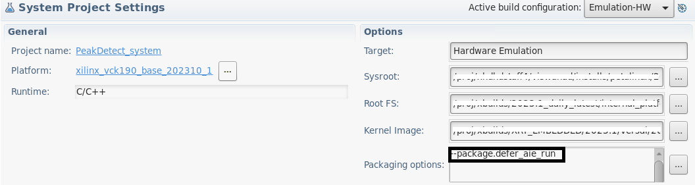

1) Now, to build the system project, right-click on the **PeakDetect_System** and select **Build Project**. The top-level project uses an incremental build approach that recognizes the state of the sub-projects and only re-builds projects that need to be updated.<br />
2) Once the build completes, right-click on the **PeakDetect_System** and select **Run As** -> **Run Configurations** and add the environment variables as shown below and hit **Apply** -> **Run**. <br />

>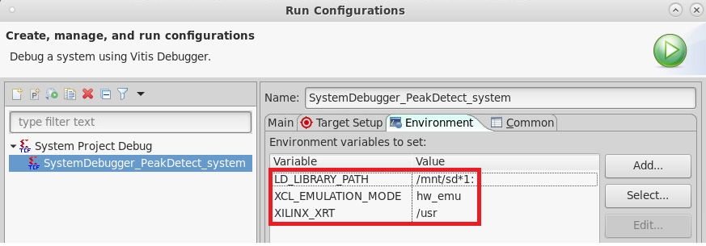

3) In the **Launch on Emulator** window, click **Start Emulator and Run** button. This starts the QEMU emulation environment and boots linux. The Emulation console shows a transcript of the QEMU launch and Linux boot process. <br />

Alternatively, you can also start emulation by **Vitis -> Start/Stop Emulator** option. One advantage with this is, you can specify the emulator arguments. For example, you can specify options for the AI Engine simulator and run the graph application manually after linux boot.<br />.

`-aie-sim-options ${FULL_PATH}/aiesimulator_output/aiesim_options.txt`

>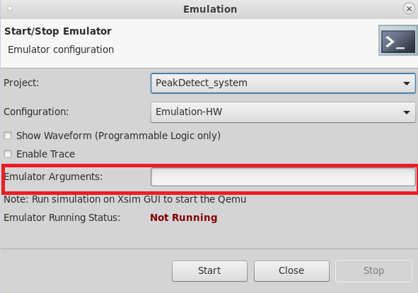

4) You can observe the linux boot and application run message in the console as shown below.<br />

>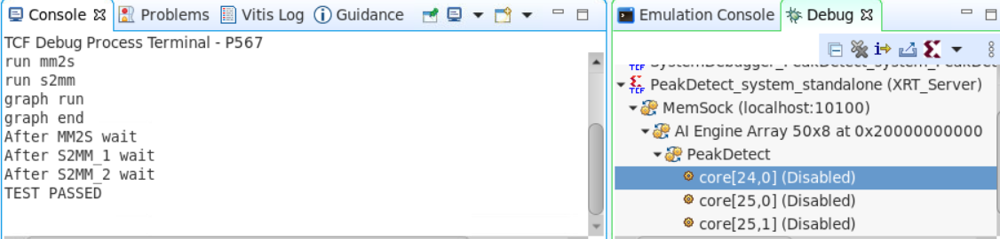

5) You can stop emulation by clicking **Vitis -> Start/Stop Emulator** option and hit **Stop**. <br />

### Section - 2
## Debug PL kernels using the Vivado Logic Simulator

This section walks you through debugging PL kernels in Vivado logic simulator. 

1) In the Vitis IDE, launch the hardware emulation using the **Vitis** -> **Start/Stop Emulator**.<br />
2) Enable the **Show Waveform** option and select **Start**. <br />
3) This invokes the Vivado XSIM in standalone mode. Parallelly you can observe the messages in the Vitis IDE **Emulation Console**.<br />
4) Hit **Run** button in the Vivado XSIM GUI task bar and observe the linux boot-up in the Vitis IDE **Emulation Console**. <br />
5) Once the boot completes in Vitis IDE, Run application using **Run Configurations** -> **Launch HW Emulator** on system project.<br />
6) Observe the data coming up in the XSIM and parallelly the **Emulation Console** messages gets updated in Vitis IDE GUI.<br />
7)  After processing all the data, you can see below messages in the Vivado XSIM TCL Console.<br />
```
Info: (I804) /IEEE_Std_1666/deprecated: the notify() function is deprecated use sc_event::notify()
// Interrupt Monitor : interrupt for ap_done detected @ "117153000"
// Interrupt Monitor : interrupt for ap_ready detected @ "117153000"
// Interrupt Monitor : interrupt for ap_done detected @ "118292000"
// Interrupt Monitor : interrupt for ap_ready detected @ "118292000"
// Interrupt Monitor : interrupt for ap_done detected @ "118478000"
// Interrupt Monitor : interrupt for ap_ready detected @ "118478000"
$stop called at time : 157304 ns
run: Time (s): cpu = 00:00:36 ; elapsed = 00:03:57 . Memory (MB): peak = 13910.660 ; gain = 135.137 ; free physical = 23585 ; free virtual = 54027

```
You can also notice below messages in the Vitis IDE **Emulation Console**.

```
XAIEFAL: INFO: Resource group Avail is created.
XAIEFAL: INFO: Resource group Static is created.
XAIEFAL: INFO: Resource group Generic is created.
Input memory virtual addr 0x0xffff7fb56000x
Output memory virtual addr 0x0xffff7fb55000x
Output memory virtual addr 0x0xffff7fb54000x
run mm2s
run s2mm
graph run
graph end
After MM2S wait
After S2MM_1 wait
After S2MM_2 wait
TEST PASSED
```
8) Now observe the waveform in Vivado XSIM GUI. The system contains 1 `mm2s` compute unit and 2 `s2mm` compute units. You can notice them in waveform viewer as shown below.

>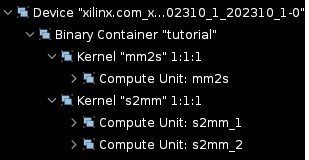

9) You can form of group of signals by Right-clicking any where in the **Name** column and select **New Group**. Add all the MM2S and S2MM related signals to this group by dragging them correspondingly.

>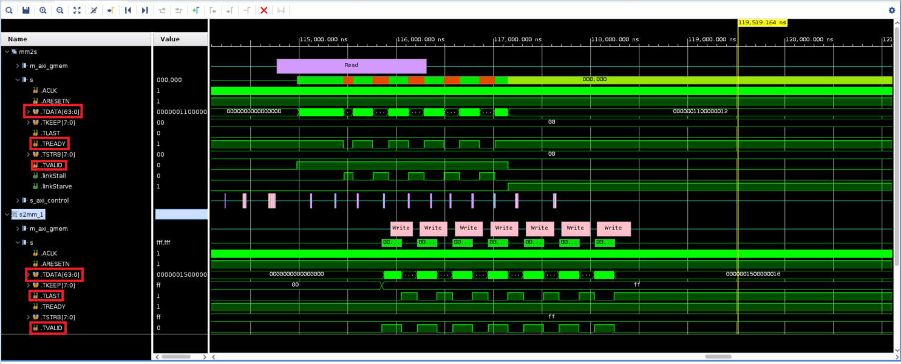

10) Zoom-in to the waveform window to locate the transactions clearly.
11) The `m_axi_gmem` is the transaction level signal which indicates `Read` transaction in `mm2s` and `write` transaction in `s2mm`.
12) The `TDATA` in `mm2s` shows the data that is being read into the AI Engine module. To correlate with the number of iterations(7) you specified in the graph, observe the `TREADY` signal which goes high when AI Engine module is ready to read and the `TVALID` signal goes high for all the Read transaction.
13) Similarly you can notice in `s2mm_1` the `TVALID` is high indicating the valid data and the `TLAST` goes high at the end of every iteration, goes low during start of next iteration.

This way you should be able to identify whether a data is being sent/received, to/from AI Engine module correctly or not.

### Section - 3
### Performance of the AI Engine using hardware emulation results

This section walks you through profiling the AI Engine as part of running the hardware emulation and calculate the througput of the design considering the system as a whole. i.e, when MM2S module is transferring data to the AI Engine, AI Engine computes the output and transferrs data to S2MM module. Also note, in this case PS is controlling both PL and AI Engine. Compare the througput of the design with the AI Engine as a standalone module(aiesimulation results).

1) In the Vitis IDE, go to **Vitis** -> **Start/Stop Emulation** <br />
2) Add the `-aie-sim-options {PROJECT_PATH}/Emulation-AIE/aiesimulator_output/aiesim_options.txt` in the **Emulator Arguments** option and click **Start**.<br />
3) Now the hardware emulation launches and starts the QEMU emulation environment. The Emulation console shows a transcript of the QEMU launch and Linux boot process.<br />
4) Once the boot completes in Vitis IDE, Run application using **Run Configurations** -> **Launch HW Emulator** on system project.<br />
5) This runs the application and shows **TEST PASSED** in the output console.<br />
6) Now, double-click on the `default.aierun_summary` file from `{PROJECT_PATH}/PeakDetect_system/Emulation-HW/package/sim/behav_waveform/xsim/` path. This open the summary file in Vitis Analyzer. <br />
7) As you observe, it carry forwards the aiesimulator options that we specified in `aiesimulator_output/aiesim_options` and provides the results.<br /> 

#### Calculating kernel latency

From the Profile information in the Vitis Analyzer, analyze the function time of kernels as explained in [Section-9](../AIE_Simulation/README.md#Design-performance-debug) in AIE Simulation.

For example compare the function time of the `data_shuffle` kernel with the standalone AIE Simulation result and calculate the kernel latency.

>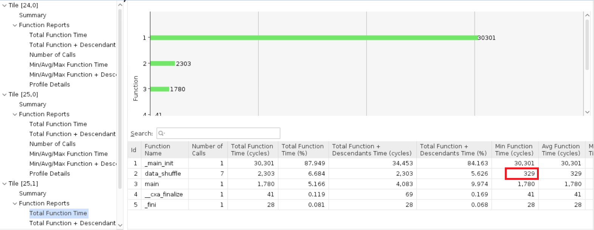

From the trace information, you can  calculate the kernel latency as explained below

8) Click on the `Trace` in the AI Engine simulation run summary and navigate to the any function to calculate the latency. For example, consider the `data_shuffle` function.
9) You can notice the function `data_shuffle` ran for 7 iterations. Zoom-in to the period of one iteration(between two main() function calls as shown below) and add a marker and drag it till end of the kernel function as shown below.<br />

>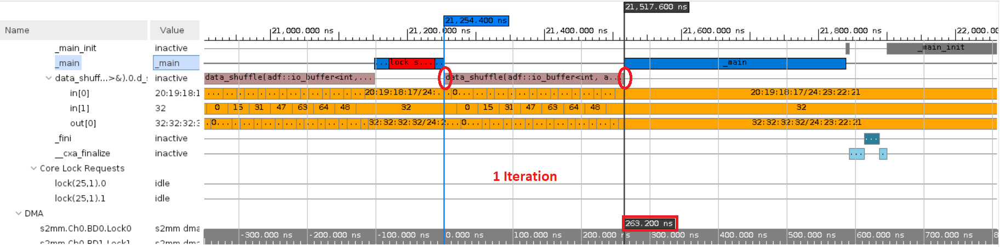

Notice the difference of `263.2ns` as highlighted above. This is the time the kernel took to complete one iteration.<br />

If you click on the AI Engine Simulation Summary, you can notice the AI Engine Frequency as 1250 MHz i.e 0.8ns. i.e 1 cycle = 0.8ns Now, the data_shuffle function took 263.2ns` for 1 iteration. i.e 263.2 / 0.8 ~= 329 cycles.<br />

Compare this with the latency we got during `aiesimulation` where the AI Engine is a standalone module- [Section-9](../AIE_Simulation/README.md#Design-performance-debug) in AIE Simulation. <br />

#### Calculating Graph throughput using Graph output 

10) From the trace information in the run_summary in Vitis Analyzer, navigate to the output port for which you want to calculate the througput(Upscale kernel in this case). Add a marker at the starting of the first output sample as highlighted below. Then click on the Go to last time icon and observe the cursor moves to the end of the last iteration. Now, click on the previous transition icon to go the starting of the last iteration. Add one more marker at the end and observe the time difference as `2244.8ns`.

>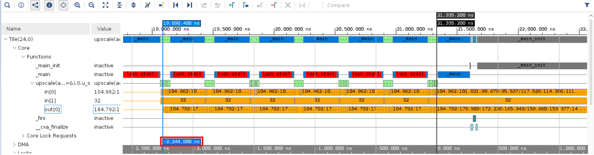

11) Number of bytes transferred is, `128` samples * `4` Bytes * `7` iterations = `3584` bytes. Throughput = `3584/2244 * e-9 ~= 1.5GBPS`. 

Compare the througput with the one we got during `aiesimulation` where the AI Engine is a standalone module- [Section-9](../AIE_Simulation/README.md#Calculating-Graph-throughput-using-Graph-output) in AIE Simulation.

### Section-4
## Command line project source code debug with Vitis IDE

This section uses the command-line flow to build for hardware emulation. 
Before starting this tutorial, 
* It is expected that you cloned the Git repository and the design files are ready to build.
* It is expected that you have run the steps to set the environment variables as described in [Introduction](../README.md#Introduction)

1) Navigate to the tutorial directory `cmd_src/` and open the Makefile.
2) To be able to debug the project, it is required to add the `--pakcage.enable_aie_debug` option in the packaging step as shown below.

```
package: guard-PLATFORM_REPO_PATHS guard-IMAGE guard-ROOTFS
	cd ./sw
	v++ -p -t ${TARGET} \
		-f ${BASE_PLATFORM} \
		--package.rootfs=${ROOTFS} \
		--package.image_format=ext4 \
		--package.boot_mode=sd \
		--package.kernel_image=${IMAGE} \
		--package.defer_aie_run \
		--package.sd_file embedded_exec.sh --package.enable_aie_debug \
		--package.sd_file host.exe ../tutorial.xsa ../libadf.a
	
 ```
 3) Do `make all TARGET=hw_emu`.<br />
   This step
        * Compiles the AI Engine kernels and generates `libadf.a`.<br />
  	     * Compiles the PL kenrels `s2mm`,`mm2s` and generates `.xo`.<br />
 	      * Hardware linking step to link AI Engine kernels and PL kernels using the `system.cfg` file. This generates the `.xsa` file.<br />
  	     * Compiles the host application and generates the executable file `host.exe`.<br \>
 	      * Packages `libadf.a`,`.xsa`,`host.exe` files.<br />
 
 4) To debug the source code in Vitis IDE, you need three linux terminals.<br />
 5) From terminal-1, set the tool path properly and issue the command to launch hardware emulator and boot up petalinux.<br />
    ```
    ./launch_hw_emu.sh -add-env ENABLE_RDWR_DEBUG=true -add-env RDWR_DEBUG_PORT=10100 -pid-file emulation.pid -no-reboot -forward-port 1440 1534
    ```
 **Command option explanation**
 * `-add-env RDWR_DEBUG_PORT=${aie_mem_sock_port}` : Defines the port for communicating with the AI Engine domain. In the previous example, it is 10100.
 * `-forward-port ${linux_tcf_agent_port} 1534` : Defines the port for the Linux TCF agent. In the previous example, it is 1440, which is the default.

**Note**
* launch_hw_emu.sh is generated properly when the project under debug is built and packaged with hardware emulator correctly. <br />
* Previous command takes a few minutes to complete due to both hardware emulator and Petalinux are required to boot up properly.<br />
* Wait until both hardware server and Petalinux boot up BEFORE moving to next steps.<br />
 
 6) From terminal-2, setup the tool path properly issue below command to launch XRT server.<br />

    ```
    xrt_server -I30000 -S -s tcp::4352
    ```
    **Command-line options explaination:**
    
    * `-I30000`: Defines an idle timeout in seconds, in which the server will quit if there is no response.<br />
    * `-S`: Specifies print server properties in JSON format to stdout.<br />
    * `-s tcp::${xrt_server_port}`: Defines the agent listening protocol and port. it is 4352 in example, but can be any free port.<br />
 
7) From terminal-3, navigate to the `sw/` directory where the `host.exe` and `a.xclbin` got generated and issue below command to launch Vitis IDE after setting the tool path properly.<br />
    
    ```
    vitis -debug -flow embedded_accel -target hw_emu -exe ./host.exe -program-args a.xclbin -port 1440
    ```
    **Command-line options explaination:**
    
    * `vitis -debug`: Launches the Vitis IDE in stand-alone debug mode.<br />
    * `-flow embedded_accel`: Specifies the embedded processor application acceleration flow.<br />
    * `-target hw_emu`: Indicates the target build being debugged.<br />
    * `-exe ./host.exe`: Indicates the PS application to run and debug.<br />
    * `-program-args a.xclbin`: Refers to the location of the xclbin file to be loaded as an argument to the executable.<br />
    * `-port 1440`: Specifies the ${linux_tcf_agent_port} as discussed previously.<br />

8) The above command invokes the Vitis IDE in debug mode as shown below waiting in `main` function in `host.cpp`.<br />

   >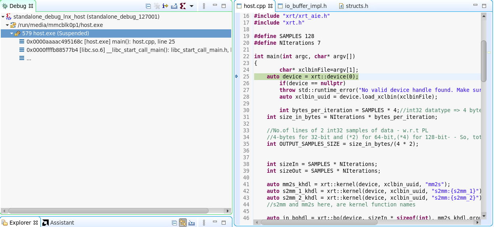

9) Now, open the debug configurations as shown below. <br />
   >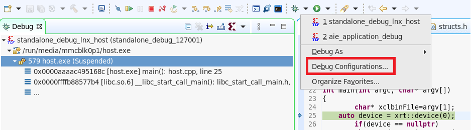

   * Create a new Debug configuration by double-clicking on the **Single Application Debug** .<br />
   * Add the Debug type name **aie_application_debug** and **Debug Type** as **Attach to running target**. <br />

   >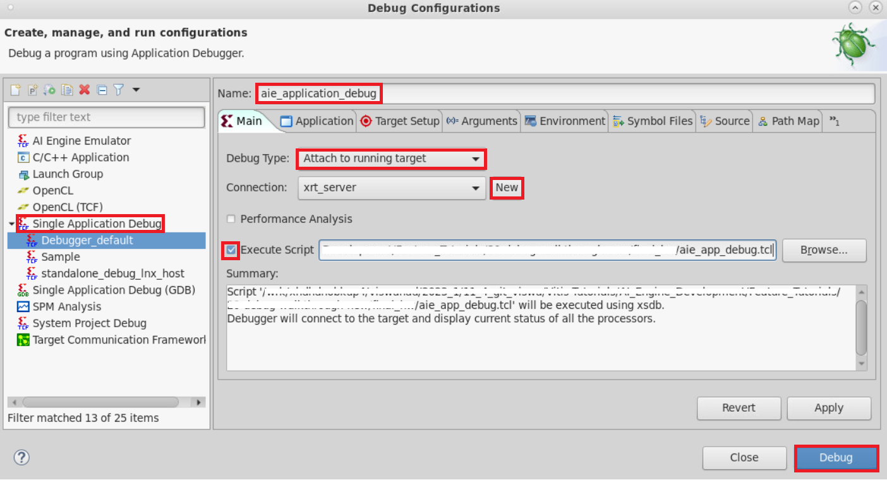

   * Create a new target connection with **Target Name**, **Host** and **Port** details as shown below and hit **OK**.<br />

   >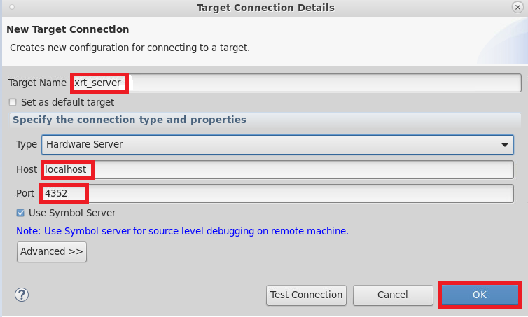

   * Now, again in the **Debug Configurations** window, Setup the execute script(`aie_app_debug_em.tcl` - Check the **Note** below) for newly created debug type by clicking on `Browse` button as highlighted above.<br />

      **Note:** The script, **aie_app_debug_em.tcl** is provided in this tutorial(Under HW_Emulation/ directory) and needs to be updated to match your environment settings. For example, the `${PROJECT_PATH}` variable should be the `Work/` folder inside this lab and similarly the `${XILINX_VITIS_PATH}/` variable should be pointing to your Vitis installation path. <br />

10) Now click on **Debug** in **Debug Configurations** window and wait for the **aie_application_debug(xrt_server)** to load in stack trace and click on **Continue/Resume** button to run the `<Process ID>host.exe (Suspended)` thread. <br />

    >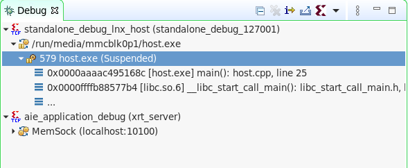

11) This executes the host code before the AI Engine graph execution and waits at the automatic break-point in the AI Engine core `main()` function as shown below.<br />
    >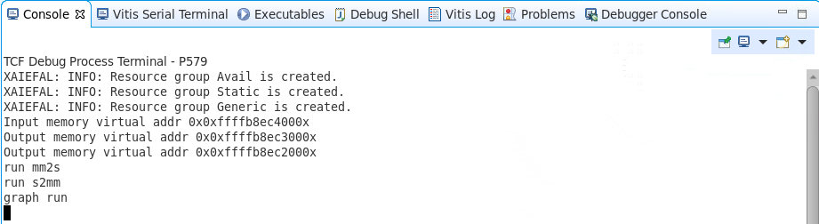

    You can try adding add break-points in the host code and observe the values in the **Variable** window by doing **step-in** or **step-over**. <br />

    >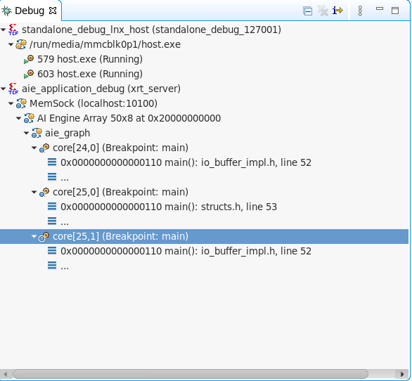

12) Now, click on each AI Engine core and do **Step-over** to enter the compiler generated AI Engine source code which inturn calls the actual user source code. <br />

    >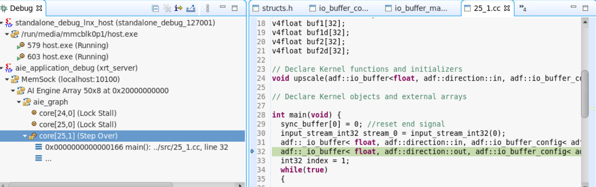

    You can add the break points in this source file and observe the intermediate values. Once done, you can just hit **Continue** button to run the complete core.<br />

    >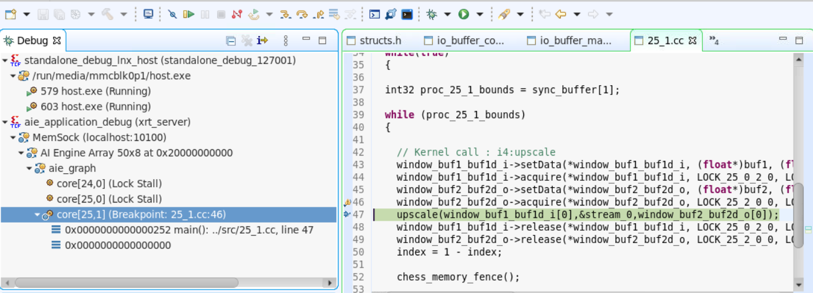

13) Similarly, you can select all other cores to debug and **Continue**. <br />
14) Once all cores are done running, you can see all the AI Engine cores in **Disabled** state and **Test Passed** in the Console. Now select the `<Process ID>host.exe (Signal 10; User-defined signal 1)` thread and hit **Continue**. This completes the execution of the host code and you can terminate the debug and disconnect. <br /> 

## Support

GitHub issues will be used for tracking requests and bugs. For questions go to [support.xilinx.com](https://support.xilinx.com/).


<p class="sphinxhide" align="center"><sub>Copyright © 2020–2023 Advanced Micro Devices, Inc</sub></p>

<p class="sphinxhide" align="center"><sup><a href="https://www.amd.com/en/corporate/copyright">Terms and Conditions</a></sup></p>
