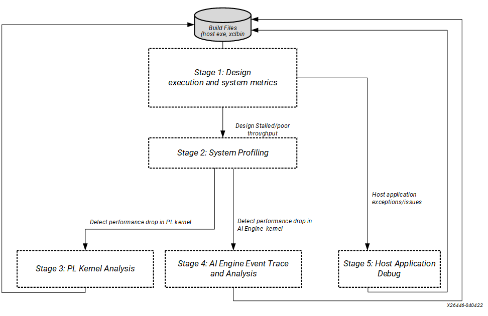
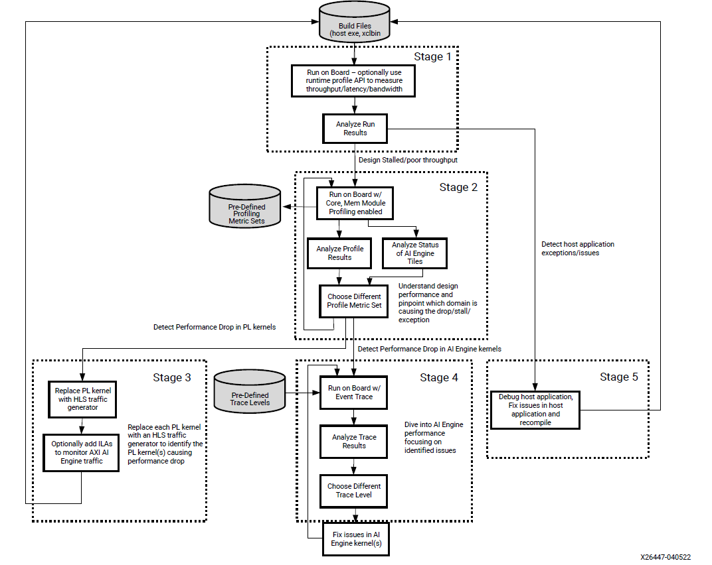

<table class="sphinxhide" width="100%">
 <tr width="100%">
    <td align="center"><h1>AI Engine Development</h1>
    <a href="https://www.xilinx.com/products/design-tools/vitis.html">See Vitis™ Development Environment on xilinx.com </a>
    <a href="https://www.xilinx.com/products/design-tools/vitis/vitis-ai.html">See Vitis™ AI Development Environment on xilinx.com</a>
    </td>
 </tr>
</table>

# Hardware Debug Walkthrough 

**Getting Started**

To excercise and walk through different hardware debug methodologies, it is required to clone the git repository and get the design files ready to build and generate the hardware image file(sd_card.img).

Make sure you set the environment variables as explained in this [link](../README.md#Introduction)

## Introduction

Designs running on Versal® AI Engine devices can target the AI Engine, PL, and Arm® host. To ensure a design targeting such multi-domain devices is functionally correct and meets the design performance specification, Xilinx® recommends a five-stage profile and debug methodology in hardware.

The stages are as follows:

* Design Execution and System Metrics.  
* System Profiling.  
* PL Kernel Analysis.  
* AI Engine Event Trace and Analysis.  
* Host Application Debug.  

>

## [Design Execution and System Metrics](./Stage_1.md)

This stage helps you determine,

* If the design and host application can run successfully in hardware.
* How to use APIs in your host application to profile the design as it is running on hardware.
* Error reporting API's to retrieve the asynchronous errors into the user-space host code. 
* If the design meets throughput, latency and bandwidth goals. 
* In addition, you can troubleshoot AI Engine stalls and deadlocks using reports generated when running the design in hardware.

## [System Profiling](./Stage_2.md)

In this stage you can profile the AI Engine Core, Interface, and Memory modules in XRT or XSDB flows. It is a non-intrusive feature which can be enabled at runtime using the XRT.ini file or running scripts in XSDB. The feature uses performance counters available in the AI Engine array to gather profile data. The amount and type of data gathered is limited by the number of performance counters available.

## [PL Kernel Analysis](./Stage_3.md)

The goal of this stage is to determine the exact PL kernel causing a throughput drop by

* Inserting one or more ILAS to mointor specific PL AXI interaces to help identify exactly where and when a thorughput drop occurs. 
* Replacing the PL kernels. 
* Profiling using PL profile monitors. 

## [AI Engine Event Trace and Analysis](./Stage_4.md) 

This stage helps you determine the AI Engine kernel or graph construct causing design performance drop or stall, or causing a deadlock by

* Running and analyzing runtime trace data using AI Engine Event trace flow.
* Profiling Intra-kernel performance.
* Using Vitis IDE debugger to debug kernel source code.

## [Host Application Debug](./Stage_4.md#Debug-host-code-and-kernel-source-code-using-Vitis-IDE)

The goal of this stage is to debug the host application, and address application exceptions or crashes, if any exist using the printf() or Vitis IDE debugger. 

&nbsp;

**Complete hardware profile and debug methodology**

>

## Support

GitHub issues will be used for tracking requests and bugs. For questions go to [support.xilinx.com](https://support.xilinx.com/).

Copyright © 2020–2023 Advanced Micro Devices, Inc

<a href="https://www.amd.com/en/corporate/copyright">Terms and Conditions</a>

