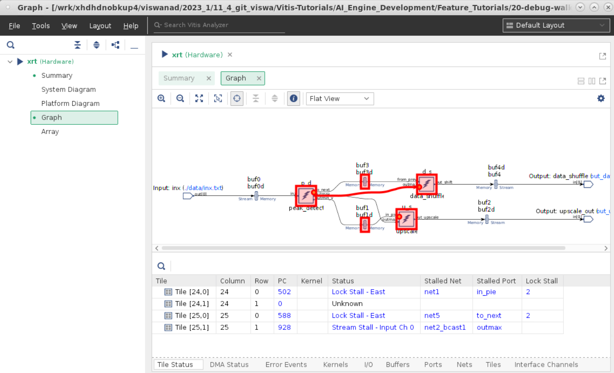
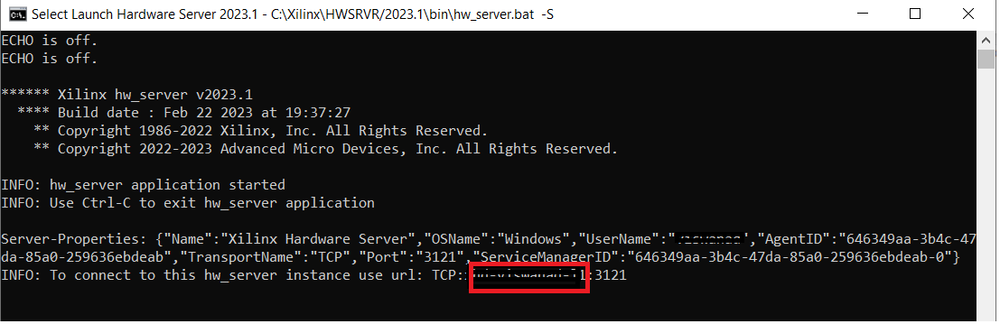
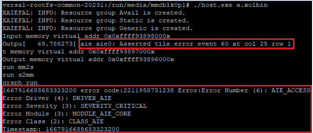
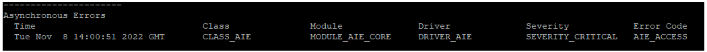

<table class="sphinxhide" width="100%">
 <tr width="100%">
    <td align="center"><h1>AI Engine Development</h1>
    <a href="https://www.xilinx.com/products/design-tools/vitis.html">See Vitis™ Development Environment on xilinx.com</br></a>
    <a href="https://www.xilinx.com/products/design-tools/vitis/vitis-ai.html">See Vitis™ AI Development Environment on xilinx.com</a>
    </td>
 </tr>
</table>

# Design Execution and System Metrics

This stage helps you determine:

* If the design and host application can run successfully in hardware.
* How to use APIs in your host application to profile the design as it is running on hardware.
* If the design meets throughput, latency, and bandwidth goals.
* In addition, you can troubleshoot AI Engine stalls and deadlocks using the reports generated when running the design in hardware.

## Features

<table style="width:100%">

<tr>
<td>
<a href="./Stage_1.md#Running-the-design-on-hardware">Running the Design on Hardware</a>
</td>
<td>
Explains how to determine the functional correctness of the design by running on hardware.
</td>
</tr>
 
<tr>
<td>
<a href="./Stage_1.md#Error-Handling-and-Reporting-in-Host-Application">Error Handling and Reporting in the Host Application</a>
</td>
<td>
Explains how to use error reporting APIs to handle errors in the host code.<br />
 <a href="./Stage_1.md#XRT-error-handling-APIs">&nbsp; &nbsp; &nbsp; *XRT error handling APIs</a> - This method reports errors that can be detected during the XRT runtime function call or underneath the driver, system, hardware, etc.<br />
<a href="./Stage_1.md#Using-XBUtil">&nbsp; &nbsp; &nbsp;* Using XBUtil</a> - XButil error reporting can accumulate all the errors from various classes and sorts them by timestamp.<br />
</td>
</tr>

<tr>
<td>
<a href="./Stage_1.md#Analyzing-Run-results">Analyzing Run Results</a>
</td>
<td>
Explains different techniques (XRT, XBUtil, and XSDB) to analyze the design by running on hardware and helps to choose from the following methodologies:<br />
 <a href="./Stage_1.md#AI-Engine-status-using-XRT"> &nbsp; &nbsp; &nbsp; *AI Engine status using XRT</a> - Using XRT is fast and host executable can automatically reads the `xrt.ini` file to configure the runtime. - <br />
<a href="./Stage_1.md#Manual-AI-Engine-status-using-XBUtil-utility">&nbsp; &nbsp; &nbsp;* Manual AI Engine status using XBUtil utility</a> - XBUtil is a standalone command utility included with XRT and does not require any special file to handle. You can directly use XBUtil commands on the console after boot.<br />
 <a href="./Stage_1.md#Deadlock-detection-using-XSDB">&nbsp; &nbsp; &nbsp; * Deadlock detection using XSDB</a> - XSDB runs independent of XRT and can analyze the results before, during, or after design runs. Also, you can use the XSDB for baremetal applications in addition to the Linux-based applications.<br />
</td>
</tr>

<tr>
<td>
<a href="./Stage_1.md#Using-APIs-in-host-application">Using APIs in the Host Application</a>
</td>
<td>
Explains how to modify the host code to add APIs in the host application that helps profiling the design for getting througput, latency, and bandwidth.<br />
 <a href="./Stage_1.md#Profiling-Graph-throughput">&nbsp; &nbsp; &nbsp; *Profiling Graph throughput</a> - Provides insight on how to modify the host code for profiling the number of samples sent and received.<br />
<a href="./Stage_1.md#Profiling-to-count-Samples-sent-and-received">&nbsp; &nbsp; &nbsp;* Profiling to count the samples sent and received (Exercise Step)</a> - Provides insight on how to modify the host code for profiling the number of samples sent and received.<br />
</td>
</tr>
</table>

## Running the Design on Hardware

>**NOTE:** Run this step only if you are interested to learn how to run the design and observe `TEST PASSED` in hardware. You can skip to the steps [Analyzing Run Results](./Stage_1.md#Analyzing-run-results) and [Error Handling and Reporting in the Host Application](./Stage_1.md#Error-Handling-and-Reporting-in-Host-Application), where it is required do some code changes, regenerate the hardware image, and run on hardware.

Before starting this tutorial:

* It is expected that you cloned the git repository, and the design files are ready to build.
* It is expected that you have run the steps to set the environment variables as described in [Introduction](../README.md#Introduction).

1. Navigate to the tutorial directory `cmd_src/`, and do `make all TAERGET=hw`.

   This step:

   * Compiles the AI Engine kernels and generates `libadf.a`.
   * Compiles the PL kernels, `s2mm` and `mm2s` and generates `.xo`.
   * Hardware linking step to link AI Engine kernels and PL kernels using the `system.cfg` file. This generates the `.xsa` file.
   * Compiles the host application and generates the executable file, `host.exe`.
   * Packages `libadf.a`,`.xsa`, and`host.exe` files.

2. Observe the hardware image file (`sd_card.img`) generated in the `sw/` directory.
3. Once the image is generated, you are ready to run the hardware image on board. The following are some steps to run on the board:

   * Flash the SD card with the built `sd_card.img`.
   * Plug the flashed SD card into the SD card slot of the VCK190 board.
   * Connect the USB type C cable to the board and computer that supports serial port connection.
   * Set the serial port configuration with Speed=115200, Data=8 bit, Parity=none, Stop bits=1 bit, and flow control=none.
   * Power up the VCK190 board to see the boot messages from the serial connection.

4. In the console, run the application by:

   ```
   cd /run/media/mmcblk0p1
   ./host.exe a.xclbin
   ```

5. Observe the `TEST PASSED` message in the Linux console.

## Analyzing Run Results

It is necessary to analyze the run results to handle the design stalls by tracking the status of the AI Engine design using:

* Periodic AI Engine status output using XRT.
* Manual AI Engine status - XBUtil utility.
* AI Engine status using XSDB.

>**NOTE:**
>
>* To understand practically how to analyze the results when the design stalls, a bug in the kernel source code is introduced and the sd_card image is regenerated. In the interest of time, if you like to use the already generated image file, skip directly to step 7. But you might not see the exactly same results shown below.
>* Here, different methodologies that are available to get the AI Engine status are provided to exercise. But, in your development cycle, you can choose any one based on the need.

1. Open the `aie/kernels/data_shuffle.cc` kernel file, and comment out the line `if(remainder == 0)`, and regenerate the `sd_card.img` file (do `make all TARGET=hw`).

### AI Engine Status Using XRT

1. Now program the hardware image on to the VCK190 device, and create an `xrt.ini` file as follows:

	```
	//xrt.ini

	[Debug]
	aie_status=true
	aie_status_interval_us=1000
	```

2. Run the application, `host.exe a.xclbin`.
3. When the host program is running, the AI Engine status is copied to the `xrt.run_summary` file. A summary of the output files are:

	`xrt.run_summary`: Run summary that contains list of files information that can be used by the Vitis Analyzer.
	`aie_status_edge.json`: Status of AI Engine and AI Engine memory.
	`aieshim_status_edge.json`: AI Engine interface tiles status.
	`summary.csv`: Always created.

	You can also see the following messages in the console indicating the actual deadlock:

	```
	HOST:
	EXE: /run/media/mmcblk0p1/host.exe
	[XRT] WARNING: Potential deadlock/hang found in AI Engines. Graph : mygraph
	[XRT] WARNING: Potential stuck cores found in AI Engines. Graph : mygraph Tile :       (25,1) Status 0x401 : Enable,Stream_Stall_SS0
	```

4. Observe the hang, and kill the application by pressing `Ctrl+c` or suspend using `Ctrl+z`.
5. Copy all these files back to the local workspace where the AI Enigne compile `Work/` directory is present, and open the `xrt.run_summary` file in the Vitis Analyzer.

	```
	vitis_analyzer --classic xrt.run_summary`
	```

6. Click **Set AI Engine Compile Summary**, point to the `Work/directory` manually, and observe the `graph` view to identify the stalls.


	The highlighted path in the graph indicates the stalls in the design. You can also look at the following **Tile Status** table to get status of each tile, stalled port, etc.
Clicking each stall highlights the corresponding path in the graph view.

	* `Tile Status - Status column`: Shows the Tiles (24,0),(25,0) are in lock stall and the tile (25,1) is in stream stall. If there are no stalls, you can see the `Disabled/Done` state.
	* `Tile Status - Stalled Net/Port`: Shows the corresponding Nets/Ports where the stall happened. Observe the small bubble at the stream port of the peak_detect kernel in the graph view.
	* `Tile Status - PC`: Shows the current Program Counter value. It can be crossprobed with the  compiler generated source code by clicking on it.
	* `DMA Status`: Shows each tile's DMA input/output channel status.

	For more information, refer to [Analyzing AI Engine Status in Vitis Analyzer](https://docs.xilinx.com/r/en-US/ug1076-ai-engine-environment/Analyzing-AI-Engine-Status-in-Vitis-Analyzer) in *AI Engine Tools and Flows User Guide* (UG1076).

### Manual AI Engine status Using the XBUtil Utility

>**NOTE:** This is of user interest to exercise different methodologies to detect the AI Engine status. If you have already exercised the `AI Engine status using XRT` step, you need to reboot the VCK190 board.

1. In Linux, run the application:

	```
	host.exe a.xclbin
	```

2. Observe the hang and after some time, kill the application by pressing `Ctrl+c` or suspend by `Ctrl+z`.

3. Issue the following `xbutil` command:

	```
	xbutil examine -r aie -d 0 -f json -o xbutil_status.json
	```

	* `xbutil examine`: Command used to find the details of the specific device.
	* `-r aie`: Switch to view reports of the AIE kernels metadata from .xclbin.
	* `-d`: Specifies the target device to examine.
	* `-f`: Specifies the report format.
	* `-o`: Specifies the output file to direct the output.

	For more information, refer to [xbutil Examine](https://xilinx.github.io/XRT/master/html/xbutil.html#xbutil-examine).

4. Copy the `JSON` to a local workspace for further analysis, open the file in the Vitis Analyzer using the option **Import XSDB/XBUtil JSON output**, and point to the `JSON`, AI Engine compile summary.
5. A new file, `aiestatus.run_summary`, gets created which can be used for further analysis.
6. The analysis in the Vitis Analyzer is similar to *AI Engine status using XRT*.

### Deadlock Detection Using XSDB

It is also possible to examine the status of the AI Engine using XSDB both on Linux and baremetal operating systems. This feature allows you to debug applications and detect the status of the AI Engine in situations where the board is in a deadlock or hung state. Unlike the xbutil command which requires XRT, the XSDB command runs independent of XRT.

1. Run the hardware server from the computer that connects to the target board. To do so, launch the hw_server from the computer that has a JTAG connection to the VCK190 board.


2. Go to the directory where the AI Engine compile `Work/directory` was generated, and launch XSDB.
3. From the XSDB terminal, issue the following commands from the XSDB prompt:

	```
	xsdb
	%xsdb connect -url TCP:${COMPUTER NAME/IP}:3121
	%xsdb ta
	%xsdb ta 1
	%xsdb source $::env(XILINX_VITIS)/scripts/vitis/util/aie_status.tcl
	```

4. Issue the following command to generate the AI Engine status in XSDB:

	```
	aiestatus examine -work-dir ./Work -graphs mygraph
	```
	
	The output of the command is as follows:

	```
	xsdb% aiestatus examine -work-dir ./Work -graphs mygraph
	Reading status registers for AI Engine tiles in graph mygraph...
	AIE Tiles: 24,1 25,1 25,2 25,3
	```

5. A new `JSON` file, `aie_status_<date_time>.json`, gets created in the current working directory. Open the file in the Vitis Analyzer using the option, **Import XSDB/XBUtil JSON output**, point to the `JSON`, AI Engine compile summary, and output the `aiestatus.run_summary` file.

	The analysis in the Vitis Analyzer is similar to *AI Engine Status Using XRT*.

	Revert back all the changes in the source code to exercise other features in this tutorial.

## Error Handling and Reporting in the Host Application

### XRT Error Handling APIs

XRT provides an `xrt::error` class and its member functions to retrieve the asynchronous errors into the user-space host code. In this section, you will walk through a methodology to handle errors from underneath driver, system, hardware, etc.

To better understand the usage of error handling XRT APIs, an out of bound access in the kernel code is introduced which in turn causes issue executing the AI Engine graph controlled from the host code.

1. Add a memory read violation to the kernel code by opening `cmd_src/aie/kernels/peak_detect.cc`, and change the line 26 to v_in = *(InIter+8500000500).
2. Replace the `cmd_src/sw/host.cpp` file with the `Hardware/host_xrtErrorAPI.cpp`. Make sure to take the back up of the original file.
3. Observe lines 87-93.

	* xrt::error ->  Class to retrieve the asynchronous errors in the host code.
	* get_error_code() -> Member function to get the timestamp of the last error.
	* to_string() -> Member function to get the description string of a given error code.

4. Do `make all TARGET=hw` to build the AI Engine kernels, s2mm and mm2s, host application, link, and package steps to generate the SD card image.
5. Repeat the steps 3 and 4 from [Running the Design on Hardware](./Stage_1.md#Running-the-design-on-hardware) to run design on hardware.
6. Observe the output from the Linux console.


	```
	aie aie0: Asserted tile error event 60 at col 25 row 1
	```

	* Above is the error propogated from the AI Engine array and is used to debug the application specific errors. For the list of error events, refer to the topic [AI Engine Error Events](https://docs.xilinx.com/r/en-US/ug1076-ai-engine-environment/AI-Engine-Error-Events). Notice the `error event 60` above which represents the **DM address out of range**, and the address out of range is happening in `col 25 row 1`.

	* You can open the graph compile summary in Vitis Analyzer and identify the kernel corresponding to the tile which is `peak_detect` in this case.
	* You can debug this out of bound access at AI Engine simulation level - Refer to [Debugging memory access violations](../AIE_Simulation/README.md#Debugging-memory-access-violations) for more information.

	The other message in the console represents an asynchronous error ouput.

	```
	Error Driver (4): DRIVER_AIE
	Error Severity (3): SEVERITY_CRITICAL
	Error Module (3): MODULE_AIE_CORE
	Error Class (2): CLASS_AIE
	Timestamp: 1667916688683323200
	```

	* XRT maintains the latest error for each class and an associated timestamp for when the error was generated. The information of error can be interpreted from [xrt_error_code.h](https://github.com/Xilinx/XRT/blob/master/src/runtime_src/core/include/xrt_error_code.h).

	For example, `Error Module (3): MODULE_AIE_CORE` corresponds to `XRT_ERROR_MODULE_AIE_CORE` in enumeration `xrtErrorModule`.

7. Press `ctrl+z` to suspend the execution.

### Using XBUtil

It is also possible to report an error using `xbutil`. The error report accumulates all the errors from the various classes and sorts them by timestamp.

1. Issue the command, `xbutil examine -r error -d 0`, in the hardware Linux console, and observe the error report as follows.


	A similar description follows for the output, as explained in XRT error handling APIs.

2. Revert back all the changes in source code to exercise other features in this tutorial.

## Using APIs in the Host Application

In this topic, you will walk through using the APIs in the host code to profile the design to get some performance parameters. For more information on different performance metrics and details about the host APIs, refer to [Event Profile APIs for Graph Inputs and Outputs](https://docs.xilinx.com/r/en-US/ug1076-ai-engine-environment/Event-Profile-APIs-for-Graph-Inputs-and-Outputs) in ** (UG1076).AI Engine Tools and Flows User Guide

### Profiling Graph Throughput

It can be defined as the average number of bytes produced (or consumed) per second:

1. To profile the design and calculate the port throughput, you should add the APIs in the host code.

2. The code changes to profile the design for port throughput calculation are available in `Hardware/src/host_PortTP.cpp`. You can either do changes in `sw/host.cpp` manually by referring to `Hardware/src/host_PortTP.cpp`, or replace the `sw/host.cpp`. Make sure to take the backup of the file before replacing.

3. In the `Hardware/src/host_PortTP.cpp`, the changes to profile the design are summarized as follows:

	a. Notice in the `host.cpp`, it contains only Native XRT APIs and no ADF APIs are used. For example, a graph handle is created using the `uuid` of `xclbin` and extracted the graph details using the `xrt::graph` API.

	```
	auto cghdl = xrt::graph(device,xclbin_uuid,"mygraph");
	```

	b. Also note the graph run and end commands uses graph handle.

	```
	cghdl.run(NIterations);
	cghdl.end();
	```

	c. The `Hardware/src/host_PortTP.cpp` file contains the ADF APIs. This change from native XRT APIs to ADF APIs is required to profile the AI Engine design.

	```
	adf::registerXRT(dhdl, xclbin_uuid.get());
	std::cout<<"Register XRT"<<std::endl;
	
	const int buffer_sizeIn_bytes = 512;
	event::handle handle = event::start_profiling(mygraph.out0,event::io_stream_start_to_bytes_transferred_cycles,buffer_sizeIn_bytes*NIterations);
	if(handle==event::invalid_handle){
	printf("ERROR:Invalid handle. Only two performance counter in a AIE-PL interface tile\n");
	return 1;
	}
	mygraph.run(NIterations);
	mygraph.end();
	...
	...
	s2mm_1_rhdl.wait();
	
	long long cycle_count = event::read_profiling(handle);
	std::cout<<"cycle count:"<<cycle_count<<std::endl;
	event::stop_profiling(handle);//Performance counter is released and cleared
	double throughput = (double)buffer_sizeIn_bytes*NIterations / (cycle_count * 0.8* 1e-3); //bytes per second 
	std::cout<<"Throughput of the graph: "<<throughput<<" MB/s"<<std::endl;
	```

	4. Also, do the necessary changes to the `Makefile`, so that the compilation and linking of the host code is successful considering the ADF APIs are included. Recommend to replace the `Makefile` with the `Makefile.host_profile`. Make sure to take a backup of the original file before replacing.
	5. Do `make host` and `make package TARGET=hw` to generate the modified hardware, `sd_card.img`.
	6. Program the device with the new hardware image, and observe the following message in the Linux console that prints the througput of the port `out0`:

		```
		run mm2s
		run s2mm
		Register XRT
		graph run
		graph end
		After MM2S wait
		After S2MM_1 wait
		cycle count:2965
		Throughput of the graph: 1510.96 MB/s
		```

	Note that the throughput value you got above matches with the value you got during [AIE Simulation](../AIE_Simulation/README.md#Calculating-Graph-throughput-using-Graph-output) and [Hardware Emulation](../HW_Emulation/README.md#Calculating-Graph-throughput-using-Graph-output)

### Exercise Step

#### Profiling to Count Samples Sent and Received

This method can be used to count the number of samples sent or received prior to the graph stall. Replace the contents of the `host.cpp` with `Hardware/sw/host_CountSamples.cpp`, and repeat steps 4-6.

Revert back all the changes in source code to exercise other features in this tutorial.

## Support

GitHub issues will be used for tracking requests and bugs. For questions, go to [support.xilinx.com](https://support.xilinx.com/).

<p class="sphinxhide" align="center"><sub>Copyright © 2020–2023 Advanced Micro Devices, Inc</sub></p>

<p class="sphinxhide" align="center"><sup><a href="https://www.amd.com/en/corporate/copyright">Terms and Conditions</a></sup></p>
