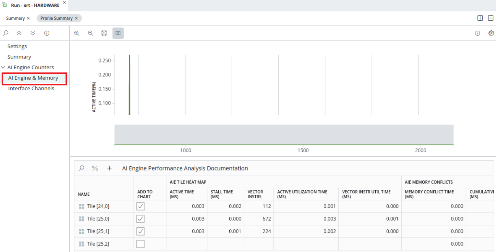
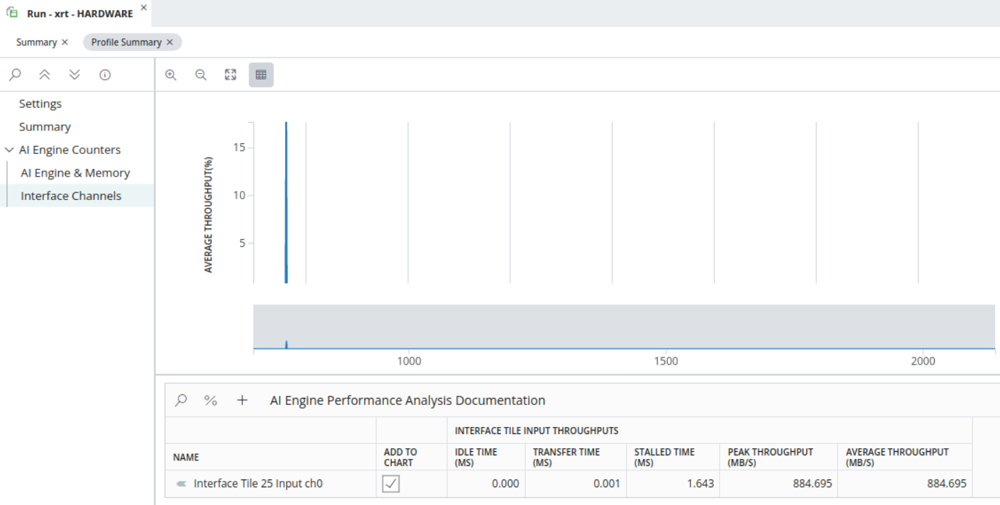
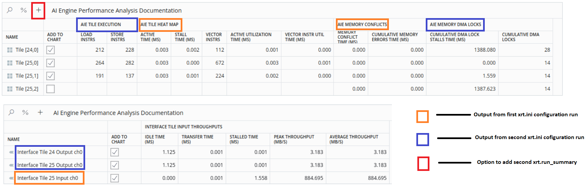
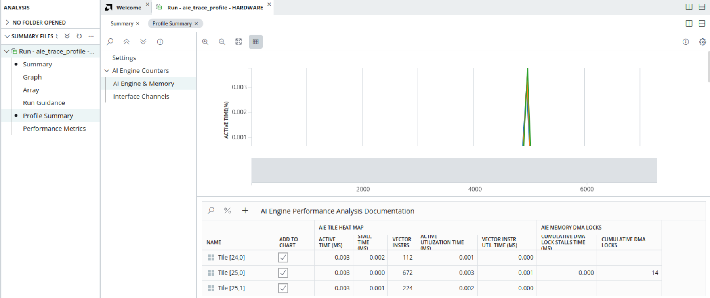

<table class="sphinxhide" width="100%">
 <tr width="100%">
    <td align="center"><h1>AI Engine Development</h1>
    <a href="https://www.xilinx.com/products/design-tools/vitis.html">See Vitis™ Development Environment on xilinx.com</br></a>
    <a href="https://www.xilinx.com/products/design-tools/vitis/vitis-ai.html">See Vitis™ AI Development Environment on xilinx.com</a>
    </td>
 </tr>
</table>

# System Profiling

In this stage you can profile the AI Engine Core, Interface, and Memory modules in XRT or XSDB flows. It is a non-intrusive feature which can be enabled at runtime using the XRT.ini file or running scripts in XSDB. The feature uses performance counters available in the AI Engine array to gather profile data. The amount and type of data gathered is limited by the number of performance counters available.

## Features

<table style="width:100%">

<tr>
<td>
<a href="./Stage_2.md#XRT-Flow"> Hardware Profiling feature - XRT flow</a>
</td>
<td>
Explains how to setup configuration file `xrt.ini` and run hardware design to generate profile data using XRT flow.<br />
<a href="./Stage_2.md#Open-multiple-profile-runs-in-Vitis-Analyzer">&nbsp; &nbsp; &nbsp; * Open multiple profile runs in Vitis Analyzer</a> - This exercise helps you Understand how to open different profile summaries(two different runs) in a single Vitis Analyzer view.<br />
<a href="./Stage_2.md#Profiling-Data-Explaination">&nbsp; &nbsp; &nbsp; * Profiling Data Explaination</a> - This explains how to analyze AI Engine core,memory and interface profiling data. Also discusses what action should be taken based on the stall time and DMA lock time.<br />
</td>
</tr>
	
<tr>
<td>
<a href="./Stage_2.md#XSDB-Flow"> Hardware Profiling feature - XSDB flow</a>
</td>
<td>
This method explains how to use XSDB based flow to profile for both baremetal and Linux operating systems.<br />
</td>
</tr>
 	
</table>

## Generating the hardware image

It is expected that you already generated the hardware image from Stage-1. If not, please follow the steps 1-3 from [Stage-1 :- Running design on hardware](../Stage_1.md#Running-the-design-on-hardware)

## Hardware profiing features

In this tutorial you will learn how to use hardware profiling features to inspect design. Two flows, XSDB and XRT flow, are supported to profile the AI Engine design. The profiling feature requires no design source code change to collect profiling data. No special options required to build the design.

### XRT Flow

1) Once the board is power up and you see the linux console after petalinux boots up, create a `xrt.ini` file on SD Card using the following lines

```
[Debug]

aie_profile = true

[AIE_profile_settings]

interval_us = 1000
graph_based_aie_metrics = all:all:heat_map
tile_based_aie_memory_metrics = all:conflicts
tile_based_interface_tile_metrics = all:input_throughputs:0

```
For more information on these profile settings refer to [UG1076](https://docs.xilinx.com/r/en-US/ug1076-ai-engine-environment/XRT-Flow). <br />
2) Save the xrt.ini file and it is safe to do power-cycle on device, whenever you add/edit the xrt.ini file to avoid seeing any abnormal results. 

```
cd /run/media/mmcblk0p1
./host.exe a.xclbin`
```
3) Observe the files generated in the SD_card and copy them back to the local workspace where the design exists.
* aie_profile_edge_* .csv
* summary.csv
* xrt.run_summary

4) Open the xrt.run_summary using `vitis_analyzer xrt.run_summary` and click on **Set Compile Directory** under AI Engine Compile Directory in **Summary** view and point to the `Work/graph.aiecompile_summary` file.
5) This opens the Vitis Analyzer window. Click on the **Profile_Summary** and Navigate to **AI Engine & Memory** as shown below.

>

6) Observe below metrics for Tile (24,0)
* AIE TILE HEAT MAP : ACTIVE TIME = 0.003ms
* AIE TILE HEAT MAP : STALL TIME = 0.002ms
* AIE TILE HEAT MAP : VECTOR INSTRS = 112
* AIE TILE HEAT MAP : ACTIVE UTILIZATION TIME = 0.003ms

Similarly for AIE MEMORY CONFLICTS and other Tiles. You can hover you mouse on the parameter(Say, `ACTIVE TIME(MS)` to get more details. <br />

7) Now click on **Interface Channels** as shown below.

>

In the `xrt.ini` the metric we requested is `input_througputs` and observe the `PEAK THROUGHTPUT(MB/S)` and `AVERAGE THROUGHTPUT(MB/S)`. <br />

Close the Vitis Analyzer window.

## Open multiple profile runs in Vitis Analyzer

In this section let us try to use different set of metrics in `xrt.ini` file and generate another `xrt.run_summary` file. Open the second run_summary on top of the first summary. <br />
8) Save the profile data obtained from first run(Step 1-3) to a directory `profile_0` in your local workspace.<br />
9) Edit the `xrt.ini` file in SD_card with the content below re-boot the board.<br />

```
[Debug]

aie_profile = true

[AIE_profile_settings]

interval_us = 1000
graph_based_aie_metrics = all:all:execution
tile_based_aie_memory_metrics = all:dma_locks
tile_based_interface_tile_metrics = all:output_throughputs:0
```

10) Move the obtained profile data in directory `profile_2` in local workspace.<br />
11) Open the first profile run summary file in Vitis Analyzer as explained in Step-4. <br />
12) Add the second profile run summary file to the existing `run_summary` file using the `+` option as shown below. Observe the combined metrics of first run with `heat_map`, `conflicts` and `input_throughputs` metrics and second run with `execution`, `dma_locks` and `output_bandwidth` metrics in Vitis Analyzer. <br />

>

13) Click on `%` to toggle between absolute and percentage values of collected design metrics.<br />
14) Click the column header to sort the data within those rows. Click once to display selected row data in ascending order. Click twice to display selected row data in descending order. Click three times to disable sorting function.<br />

### Profiling Data Explaination

An easy way to know the definition of profile data category by moving mouse cursor to column title. For example, `Active Time (ms)` is "Amount of time (in ms) AI Engine was active when it was enabled."<br />

**AI Engine core profiling data**

* `Active Time (ms)` = `Stall Time (ms)` + `Active Utilization Time (ms)`.<br />
* Take tile(25,0) as an example, tile(25,0) is active for a period of 0.003 ms, where 0.000 ms is stalled(=> Not stalled) and 0.003 ms is actively executing instructions. During 0.003 ms active period, 0.001 milliseconds is executing vector instructions. There are 0.002 milliseconds spent on other instructions such as load/store instructions.<br />
* There are total 672 Vector instructions, 264 Load Instructions and 282 Store Instructions during Active Utilization Time (ms).<br />

**AI Engine memory profiling data**

Memory Conflict Time (ms) indicates memory access conflicts time runing AI Engine execution. AMD recommends re-running aiesimulator with -enable-memory-check option to check design memory access conflicts.
Cumulative Memory Errors Time (ms) indicates time taken due to ECC errors in any of the data memory banks as well as MM2S and S2MM DMAs.

**Interface profiling data**

From **Profile_summary** -> **Interface Channels** notice the interface tile throughput values for input and output channel.
Note : Because of bug, under the heading of **Interface tile input throughput** you see both the output channel and input channel related information.  

**Profiling Data Analysis**

* From AI Engine core profiling data, tile(25,0) have much larger number of Store Instructions. An indication check, tile source code if lowering number of Store Instructions can be done to improve performance.
* From AI Engine Memory profiling data, there are no Memory Conflict Time value. i.e there are no memory violations in source code. If there are any, it is suggested to run AIE simulator and check for memory access violations and clear those violations.
* From AI Engine Memory profiling data, tile(24,0), have longer Cumulative DMA Lock Stalls Time. This leads to check input/output PLIO area to see if PLIO frequency or PLIO width is implemented properly. Suggest using Integrated Logic Analyzer (ILA) to check PLIO input/output states during run time.

### XSDB Flow

It is also possible to profile the AI Engine using XSDB both on Linux and Bare metal operating systems.<br />
15) Program the device using sd_card image and remove any xrt.ini files in the sd_card to avoid any collision with XSDB commands.<br />
16) Target connection setup - Run the hardware server from computer that connects to target board. To do so, launch hw_server from the computer that has JTAG connection to the vck190 board. 

>

17) Go to the directory where AI Engine compile Work/ directory is present and launch XSDB.
18) From the XSDB terminal, issue below commands below from the XSDB prompt.

```
xsdb
%xsdb connect -url TCP:${COMPUTER NAME/IP}:3121
%xsdb ta
%xsdb ta 1
%xsdb source $::env(XILINX_VITIS)/scripts/vitis/util/aie_profile.tcl
%xsdb aieprofile start -graphs mygraph -work-dir ./Work -graph-based-aie-metrics "mygraph:all:heat_map" -tile-based-aie-memory-metrics "{25,0}:dma_locks" -tile-based-interface-tile-metrics "all:input_throughputs" -interval 20 -samples 100

```
19) After the above `aieprofile` command is run, wait until Count: 10, Count: 20, ... is displayed from XSDB console. This indicates XSDB is ready to collect design profiling data. 
20) Switch to the Linux console of hardware and run application

```
cd /run/media/mmcblk0p1
./host.exe a.xclbin
```
21) Inspect the generated files `aie_profile.csv`, `summary.csv` and `aie_trace_profile.run_summary` in your local workspace where XSDB is launched.
22) Open the `aie_trace_profile.run_summary` file in Vitis Analyzer and expect to see the result as shown below.

>

A similar profile data analysis is applicable for XSDB generated profile summary as explained in XRT flow.


## Support

GitHub issues will be used for tracking requests and bugs. For questions go to [support.xilinx.com](https://support.xilinx.com/).


<p class="sphinxhide" align="center"><sub>Copyright © 2020–2023 Advanced Micro Devices, Inc</sub></p>

<p class="sphinxhide" align="center"><sup><a href="https://www.amd.com/en/corporate/copyright">Terms and Conditions</a></sup></p>
