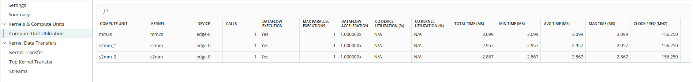
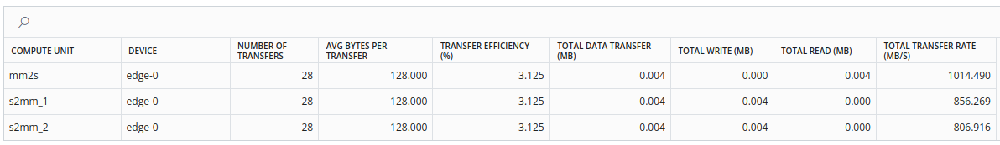
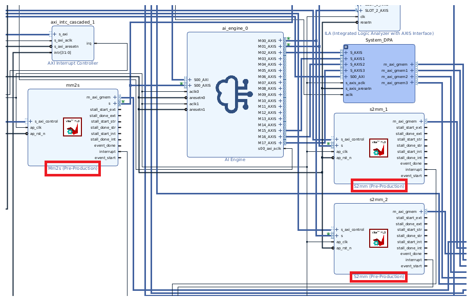
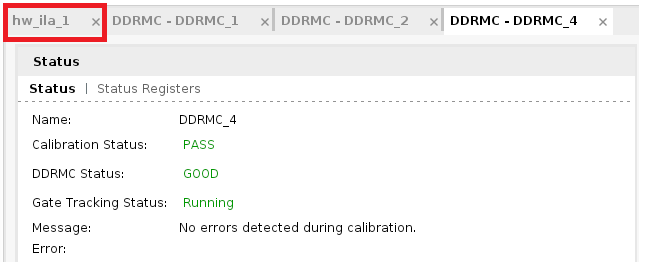
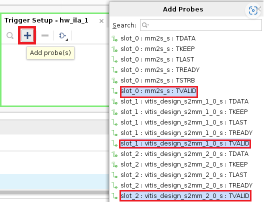
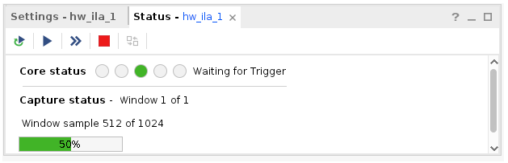
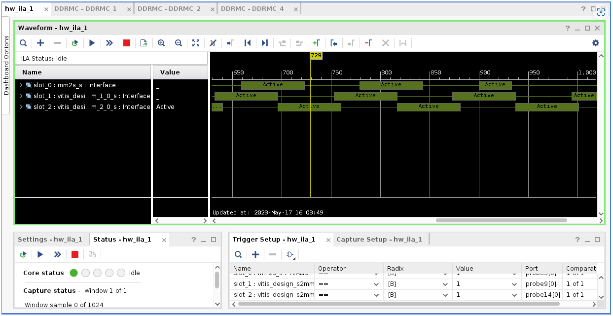
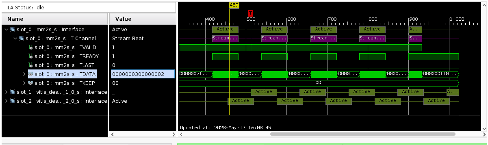

<table class="sphinxhide" width="100%">
 <tr width="100%">
    <td align="center"><h1>AI Engine Development</h1>
    <a href="https://www.xilinx.com/products/design-tools/vitis.html">See Vitis™ Development Environment on xilinx.com</br></a>
    <a href="https://www.xilinx.com/products/design-tools/vitis/vitis-ai.html">See Vitis™ AI Development Environment on xilinx.com</a>
    </td>
 </tr>
</table>

# PL Kernel Analysis

The goal of this stage is to determine the exact PL kernel causing a throughput drop by adding PL profile monitors and debugging AI Engine with Integrated Logic Analyzer

## Features

<table style="width:100%">

<tr>
<td>
<a href="./Stage_3.md#Profiling-Using-PL-Profile-Monitors">Profiling Using PL Profile Monitors</a>
</td>
<td>
Explains how to insert PL profile monitors in v++link command. This helps identify specific PL kernels(s) causing a performance drop.
</td>
</tr>
 
<tr>
<td>
<a href="./Stage_3.md#Inserting-ILAs-to-Monitor-Specific-AXI-Interfaces">Inserting ILA(s) to Monitor Specific AXI Interfaces</a>
</td>
<td>
Explains how to insert one or more ILAs to monitor specific PL AXI interfaces to help identify exactly where and when a throughput drop occurs. Also helps in identifying whether data is sent correctly to AI Engine from PL compenents and received correctly from AI Engine to PL.
</td>
</tr>
	
 </table>
 
**Getting the design files ready**

Clone the git repository and get the design files to walk through this section of tutorial. Navigate to the `cmd_src/` directory.

## Profiling Using PL Profile Monitors

In this section you will walk through the process of insering PL profile monitors to identify specific PL kernels that causes the potential drop in performance.

This is a three step process.

* Add PL profile monitors in V++ link command and generate SD Card image.
* Prepare the `xrt.ini` file and run design on hardware
* Observe the output in Vitis Analyzer and analyze the performance.

1) Open the `Makefile` from `cmd_src/` directory.<br />
2) Locate the `VPP_LINK_FLAGS` and add `--profile.data all:all:all` as shown below.<br />
```
VPP_LINK_FLAGS := -l -t $(TARGET) --platform $(BASE_PLATFORM) $(KERNEL_XO) $(GRAPH_O) --profile.data all:all:all --save-temps -g --config $(CONFIG_FILE) -o $(PFM).xsa
```
The `--profile.data:<arg>` option enables the monitoring of data ports through monitor IP that are added into the design. In this example, `<arg>` is set to `all:all:all`. i.e, assign the data profile to all CUs - *you can find names from `system.cfg` file as `s2mm_1`,`s2mm_2` and `mm2s`* and interfaces of all kernels - *s2mm and mm2s*.<br />

3) Do `make all TARGET=hw` and a hardware image `sd_card.img` gets generated inside `sw/` directory.<br />
4) Flash the `sd_card.img` file to SD card. You can follow step-3 in [Running the design on hardware](../Stage-1#Running-the-design-on-hardware) section.<br />
5) Create a `xrt.ini` file with content as shown below. <br />
```
[Debug]
device_trace = fine

[profile]
data=all:all:all
```
Here, 
   * The `[Debug]` switch key option is used to enable profiling of the application during runtime.
   * The `[profile]` section head contains the `data=all:all:all` to monitor data on all kernels and CUs

6) In the console, run the application by
```
cd /run/media/mmcblk0p1
./host.exe a.xclbin
```
Observe the `TEST PASSED`.<br />

7) Observe the files `xrt.run_summary`,`summary.csv` and `device_trace_*.csv`. Copy back the files to the local workspace and open the `xrt.run_summary` file in Vitis Analyzer using the below command.<br />
```
vitis_analyzer xrt.run_summary
```
8) Once the Vitis Analyzer opens, click on the `Profile Summary` in the left side pane and navigate to the **Compute Unit Utilization**. Observe the compute units and kernels. Also note the time and clock frequency as shwown below.<br />

>

9) You can get the data transfer for each compute unit and total Read/write in Mega Bytes by navigating to **Kernrel Data Transfers** -> **Top Kernel Transfer** as shwon below.<br />

>

10) From **kernel Data Transfers** -> **Kernel Transfer** tab, you can get the transfer rate, througput utilization(%) and latency details.<br />


## Inserting ILAs to Monitor Specific AXI Interfaces

Adding ChipScope helps debugging AIE PL interfaces in the design running on hardware including checking for AXI protocol violations, hardware kernel issues, data integrity, and performance issues of the design. To debug using ILAs, the design is required to enable ILA in hardware build.

**Enable ILA in design**

The v++ `--debug` opiton is used to enable ILA IP core and insert in the design. This need to specified during the linking stage in the design cycle.

1) Open the `Makefile` and locate the `VPP_LINK_FLAGS` and add below options to the existing ones.

```
--debug.chipscope s2mm_1:s --debug.chipscope s2mm_2:s --debug.chipscope mm2s:s
```
Notice here the `s2mm_1:s`,`s2mm_2:s` and `mm2s:s`. The syntax is `<Compute Unit name>:<Interface name>`. 

Make sure the compute unit name matches with the one specified in `system.cfg` file. In this exercise, let us monitor the stream _output from `mm2s` module_ -> going to AI Engine -> _going to `s2mm` module_. 

**Note** : V++ allows multiple `--debug.chipscope` lines to meet design debug needs.

2) Build the design. Especially, if you have already compiled the AI Engine design and PL modules, it is required to run the linking step in the `Makefile` and re-package to generate the SD Card image.<br />

```
make clean
make all
```
3) Inspect the ILA insertion by opening the vivado and click on **Open Block Design** in **IP INTEGRATOR**.
```
vivado _x/link/vivado/vpl/prj/prj.xpr`
```
>

4) Now, flash the SD card with ILA enabled design, plug in the flashed SD card on to `VCK190` SD card slot and boot up the board.

**Setup the Connection in Vivado**

5) Run the hardware server from computer that connects to target board. To do so, launch hardware server from the computer that has JTAG connection to the vck190 board. 

>

6) Launch vivado by issuing the command `vivado`.<br />
7) Setup Vivado Hardware Manager by clicking on **Flow** -> **Hardware Manager** and click on **Open target**.<br />
8) Select **Open New Target** and click **Next**.<br />
9) Add `Host Name` as you see in step-5 and click **Next**.<br />
10) After successful connection to your host, you can verify the hardware devices `arm_dap_0`,`xcvc1902_1` and click **Next**.<br />
11) Click **Finish**.<br />
12) Under **Hardware Device Properties** window, click on the ellipsis (...) to select the generated probe file from `${PROJECT_PATH}/tutorial.ltx`.<br />
13) After the hardware device got refreshed, you can observe below messages in teh TCL console.<br />
```
Processed interface mm2s_s_ila1_slot0
Processed interface vitis_design_s2mm_1_0_s_ila1_slot1
Processed interface vitis_design_s2mm_2_0_s_ila1_slot2
```
14) Click on the `hw_ila_1` as shown below.<br />
>
15) Select the `+` button from the **Trigger Setup - hw_ila_1** window and select the `TVALID` signal probes as shown below and click **OK**.<br />
>
16) Once the probes are added, select `1 (logical one)` from the drop down in `Value` column, for all 3 probes. This is required to capture the signals when TVALID is high.<br />
17)  Observe the **Core status** as `IDLE` in **Settings-hw_ila_1** window. Now, hit the `>(Play)` button at the top, to capture the configured signals and observe the status changes to `Waiting for Trigger` as shown below.<br />
>
18) Wait for ILA is ready to capture signals and run the application on `VCK190` board.<br />
```
./host.exe a.xclbin
```
19) Expect to see the result as shown below.<br />
>
After completing above steps, we are able to see the captured, related AXI signals and data are shown in waveform with timing information from Vivado.<br />

**Examine captured results**
>

20) Expand the `slot_0 : mm2s_s : Interface`. The `mm2s_s : TVALID` shows `1` which indicates a valid data is available at the time marker pointed. Moving time marker across time line, changes the AXI protocol values indicating value changes at that particular time.

This is the method to determine when/what valid data is sent/received.

**Note** : The default buffer size allocated while creating a BD design in Vivado may not be sufficient enough to capture the data of all iterations. For more information on viewing ILA probe data, you can refer to the [Viewing ILA Probe Data in the Waveform Viewer](https://docs.xilinx.com/r/en-US/ug908-vivado-programming-debugging/Viewing-ILA-Probe-Data-in-the-Waveform-Viewer)

## Support

GitHub issues will be used for tracking requests and bugs. For questions go to [support.xilinx.com](https://support.xilinx.com/).


<p class="sphinxhide" align="center"><sub>Copyright © 2020–2023 Advanced Micro Devices, Inc</sub></p>

<p class="sphinxhide" align="center"><sup><a href="https://www.amd.com/en/corporate/copyright">Terms and Conditions</a></sup></p>
