<table class="sphinxhide" width="100%">
 <tr width="100%">
    <td align="center"><h1>AI Engine Development</h1>
    <a href="https://www.xilinx.com/products/design-tools/vitis.html">See Vitis™ Development Environment on xilinx.com</br></a>
    <a href="https://www.xilinx.com/products/design-tools/vitis/vitis-ai.html">See Vitis™ AI Development Environment on xilinx.com</a>
    </td>
 </tr>
</table>

# AI Engine Event Trace and Analysis

This stage helps you determine the AI Engine kernel or graph construct causing design performance drop or stall or causing a deadlock by:

   * Running and analyzing runtime trace data using the AI Engine Event trace flow.
   * Profiling Intra-kernel performance.
   * Using the AMD Vitis&trade; IDE debugger to debug kernel source code.

<table style="width:100%">

<tr>
<td>
<a href="./Stage_4.md#Build-the-design"> Build the Design for Event Trace Analysis</a>
</td>
<td>
Explains how to use the different event trace options for compiling and its significance. Also walks through the steps to generate a hardware image.<br />
<a href="./Stage_4.md#Prepare-for-hardware-run">&nbsp; &nbsp; &nbsp; * Prepare for hardware run</a>
</td>
</tr>

<tr>
<td>
<a href="./Stage_4.md#XRT-Flow"> Event Trace Analysis - XRT Flow</a>
</td>
<td>
Explains how to do an AI Engine event trace and analysis by setting up the configuration file `xrt.ini`, and run the hardware design to generate the trace data using the XRT flow.<br />
<a href="./Stage_4.md#Launch-Vitis-Analyzer-to-Examine-Event-Trace-Files">&nbsp; &nbsp; &nbsp; * Launch Vitis Analyzer to Examine Event Trace Files</a> <br />
<a href="./Stage_4.md#Details-of-the-Event-Trace-data">&nbsp; &nbsp; &nbsp; * Details of the Event Trace data</a> <br />
</td>
</tr>
	
<tr>
<td>
<a href="./Stage_4.md#XSDB-Flow"> Event Trace Analysis - XSDB Flow</a>
</td>
<td>
This method explains how to use the SXSDB-based flow to perform event trace analysis on an AI Engine design.<br />
</td>
</tr>
	
<tr>
<td>
<a href="./Stage_4.md#Event-trace-considerations"> Event Trace Considerations</a>
</td>
<td>
This method explains how to use the XSDB-based flow to perform event trace analysis on an AI Engine design.<br />
<a href="./Stage_4.md#Event-Trace-Choice-Considerations">&nbsp; &nbsp; &nbsp; * Event Trace Choice Considerations</a> <br />
<a href="./Stage_4.md#Number-of-Event-Trace-Streams-Methodology">&nbsp; &nbsp; &nbsp; * Number of Event Trace Streams Methodology</a> <br />
<a href="./Stage_4.md#Event-Trace-Limitations">&nbsp; &nbsp; &nbsp; * Event Trace Limitations</a> <br />
</td>
</tr>
	
<tr>
<td>
<a href="./Stage_4.md#Debug-host-code-and-kernel-source-code-using-Vitis-IDE"> Debug the Host/Kernel Source Code Using the Vitis IDE</a>
</td>
<td>
Explains how to set up the target connection for hardware in the Vitis IDE and debug the host code and kernel source code in the Vitis IDE debugger.<br />
</td>
</tr>
</table>

## Event Trace Analysis Features

This tutorial targets the event trace feature running on the hardware board that allows you to understand how the design is executed on hardware. With support from the Vitis analyzer, you can view the function calls, stalls (both execution and memory), and the flow of execution in the AI Engine. This information is helpful to improve the overall design performance. The steps within this tutorial introduce the event trace compilation options, running the design on hardware to generate event trace with XSDB and XRT flows, collect the generated event trace data, and launch the Vitis_analyzer to review the design execution on hardware.

Before starting this tutorial:

* It is expected that you cloned the Git repository, and the design files are ready to build.
* It is expected that you have run the steps to set the environment variables as described in [Introduction](../README.md#Introduction).

### Build the Design

To run the event trace on hardware, it is required to compile the AI Engine graph with `--event-trace` and other appropriate flags. The flags are categorized based on the way the trace data needs to be captured.

* Using the `runtime` as an argument, you can compile the AI Engine graph to be set up for event trace, and specify the type of profile data to capture at runtime.
* The other way is to specify one of the `functions`, `functions_partial_stalls`, or `functions_all_stalls` as a type of profile data during compile time, and recompile the design to capture a different type of data during runtime.

For more information on different event trace options for AI Engine compilation, refer to [Event Trace Options](https://docs.xilinx.com/r/en-US/ug1076-ai-engine-environment/AI-Engine-Compiler-Options) in *AI Engine Tools and Flows User Guide* (UG1076).

This tutorial uses the `--event-trace=runtime`, `--event-trace-port=plio`, `--num-trace-streams=8`, and `--xlopt=0` options.

* `--event-trace=runtime` option enables runtime event trace configuration.
* `--event-trace-port=plio` option sets the AI Engine event tracing port to be `plio`. Default is `gmio`.
* `--num-trace-streams=8` option sets the number of trace streams to be 8 to collect the generated event trace data.
* `--xlopt=0` option disables the aiecompiler optimization for debug purposes.

Design with the `--event-trace=runtime` option in the build that enables runtime events during compile time. This only needs to build the design once and allows different event trace levels to be generated during runtime via the XSDB or XRT flow.

1. Navigate to the `cmd_src/` directory, and open the `Makefile`.
2. Search for `AIE_INCLUDE_FLAGS`, and add the `--event-trace=runtime --event-trace-port=plio --num-trace-streams=8 --xlopt=0` options at the end. This flag is passed to the `aiecompiler` command during compilation
3. Do `make all TARGET=hw`.
4. Make sure the package step is completed by checking the `sd_card.img` inside the `sw/` directory.

### Prepare for the Hardware Run

After the design is built, you are ready to run on the hardware board.

* Flash the SD card with the built `sd_card.img`.
* Plug the flashed SD card into the SD card slot of the VCK190 board.
* Connect the USB type C cable to the board and computer that supports the serial port connection.
* Set the serial port configuration with Speed=115200, Data=8 bit, Parity=none, Stop bits=1 bit, and flow control=none.
* Power up the VCK190 board to see boot messages from the serial connection.

### XRT Flow

1. In the hardware Linux console, create the `xrt.ini` file on the `SD card` using the following lines:

   ```
   #xrt.ini
   [Debug]
      aie_trace = true
      
   [AIE_trace_settings]
      reuse_buffer = true
      periodic_offload = true
      buffer_offload_interval_us = 100
      buffer_size = 16M
      graph_based_aie_tile_metrics = all:all:functions_all_stalls
   ```

   More details about these settings are explained in [XRT Trace Options](https://docs.xilinx.com/r/en-US/ug1076-ai-engine-environment/XRT-Flow) in the *AI Engine Tools and Flows User Guide* (UG1076).

2. Run the application.

   ```
   cd /run/media/mmcblk0p1
   ./ps_app.exe a.xclbin
   ```

3. After a successful run, the files created on the SD card are:

   * `aie_trace_N.txt`
   * `aie_event_runtime_config.json`
   * `xrt.run_summary`

4. Copy these files back to the work space at same level as the design's `Work/` directory.

#### Launch the Vitis Analyzer to Examine the Event Trace Files

1. Open the Vitis Analyzer using the `vitis_analyzer xrt.run_summary` command.
2. It is required to set the design's compile summary file when you run the Vitis Analyzer for first time on the design.
3. Select **Trace** from the left pane of the Vitis Analyzer. Initially, details of the event are not shown.


4. Zoom in to see the detailed information for each state of the AI Engine tiles.


#### Details of the Event Trace Data

1. Select the `Graph` view to examine the design. Select `p_d` to identify the tile as (25,0).
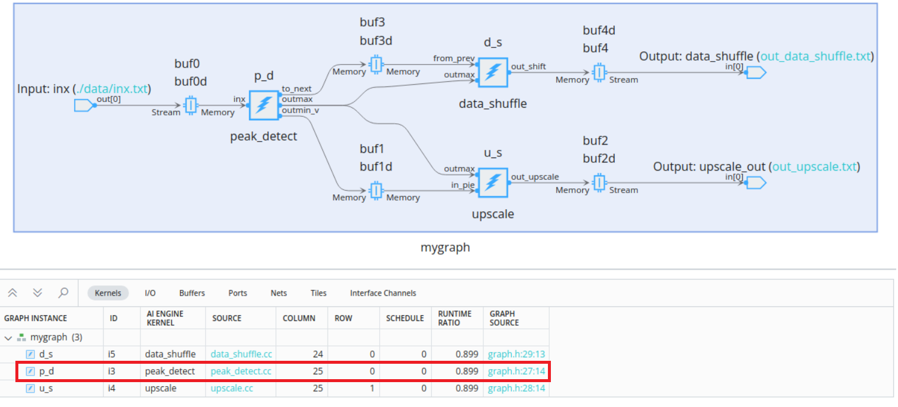

2. Adjust the trace view to the correct size with the zoom in or zoom out icons, and move the marker to the end of `peak_detect` or the beginning of `_main`. This is considered as the beginning of an iteration. A period of lock stall indicates data is sent from the PL to AIE tile.
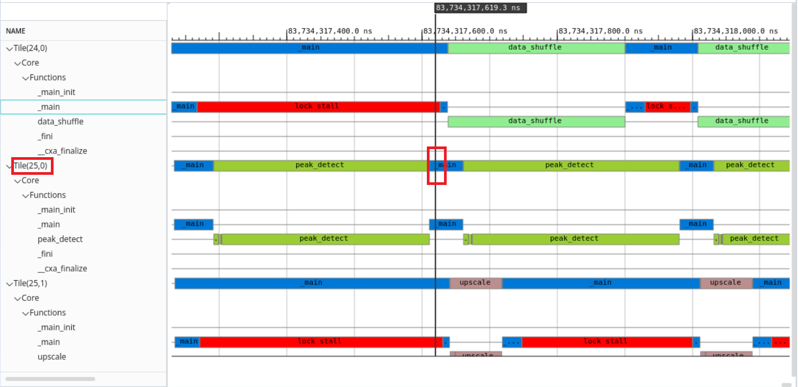

3. Observe the end of the `peak_detect` kernel corresponding to the core(25,0) and start of the core(24,0) and core(25,1). If you observe the graph view, you can notice that the kernel `peak_detect` sends data to both the `upscale` and `data_shuffle` kernels. The same behavior can be observed in the trace view as well.
4. You can calculate the execution time of one iteration as follows. Place the marker at start and end of the iteration and (1) - (2) gives 262.2 ns which is ~= 329 cycles. This matches with the `Function time` in the profile data from both the AI Engine simulation and hardware emulation.
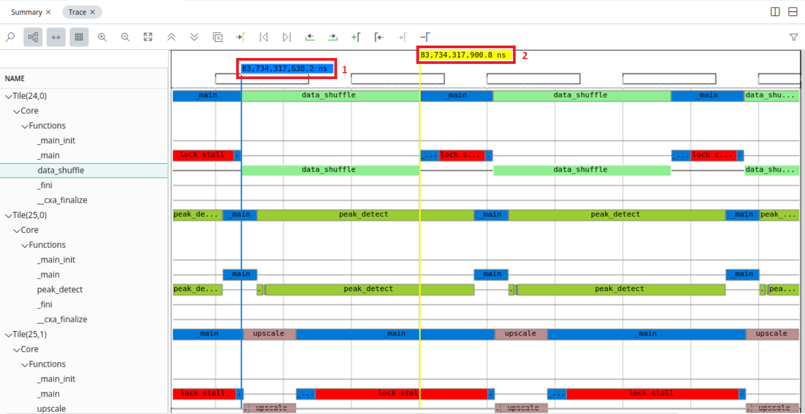

### XSDB Flow

1. Program the device using the sd_card image, and remove any `xrt.ini` files in the sd_card to avoid misbehavior with the XSDB commands.
2. _Target connection setup_: Run the hardware server from the computer that connects to the target board. To do so, launch the hardware server from the computer that has a JTAG connection to the VCK190 board.

3. Go to the directory where the AI Engine compile `Work/directory` is present, and launch XSDB.
4. From the XSDB terminal, issue the following commands from the XSDB prompt:

   ```
   xsdb
   %xsdb connect -url TCP:${COMPUTER NAME/IP}:3121
   %xsdb ta
   %xsdb ta 1
   %xsdb source $::env(XILINX_VITIS)/scripts/vitis/util/aie_trace.tcl
   %xsdb aietrace start -graphs mygraph -link-summary ./tutorial.xsa.link_summary -base-address 0x900000000 -depth 0x800000 -graph-based-aie-tile-metrics "all:all:functions_all_stalls"
   ```

   * `-base-address 0x900000000` is the address that needs to avoid collision with your design.
   * `-depth 0x8000000` is the size of the event trace file. Adjust accordingly with your design size and amount of the event trace data.

5. After the above `aietrace` start command is run, switch to the hardware Linux console, and run the application.

   ```
   cd /run/media/mmcblk0p1
   ./host.exe a.xclbin
   ```

6. After the design run completes on the hardware, stop the trace using `aietrace stop`. The generated events and run_summary files need to be collected and are ready to be examined.
7. Inspect the generated events and run_summary files.(`aie_trace_N.txt` and `aie_trace_profile.run_summary`) in your local workspace where XSDB is launched.
8. Open the `aie_trace_profile.run_summary` file in the Vitis Analyzer, and observe the results as explained in the XRT flow.

### Event Trace Considerations

#### Event Trace Choice Considerations

Based on the design, select GMIO if the design has limited PL resources left for event trace generation.

|           | Baremetal | PetaLinux | Bandwidth                        | PL Resources Used |
| :---| :---: | :---: | :---: | :--- |
| PLIO/XSDB | O         | O         | pl clock-rate * trace-plio-width | Yes               |
| PLIO/XRT  |           | O         | pl clock-rate * trace-plio-width | Yes               |
| GMIO/XSDB | O         | O         |                                  | No                |
| GMIO/XRT  |           | O         |                                  | No                |

#### Number of Event Trace Streams Methodology

| Number of Cores | Recommended Number of Streams |
| :---| :---|
| Less than 10      | 1 |
| Between 10 and 20 | 2 |
| Between 20 and 40 | 4 |
| Between 40 and 80 | 8 |
| Larger than 80    | 16 |
| Intense debug     | 16 |
|                   | AMD recommends no more than 16 streams due to resource constraints |

#### Event Trace Limitations

1. Due to limited resources, overruns can be seen from the event trace. Follow [Number of Event Trace Streams Methodology](#Number-of-Event-Trace-Streams-Methodology) to configure the number of trace streams to minimize the overruns issue.
2. It is required that the `--broadcast-enable-core` option is used to compile the design. This is to eliminate time sync issues where the start time of each tile is off by ~100 ns or more.
3. Run forever applications are supported by the XSDB flow only.

## Debug the Host Code and Kernel Source Code using the Vitis IDE

This section uses the system project built using the Vitis IDE and launch the IDE debugger to debug the host code and AI Engine kernel source code. Unlike debugging at simulation level, this topic walks you through connecting the harware to the IDE debugger, placing breakpoints in the host code and kernel source code, and observing intermittent values in the Varibale view, register view, and memory inspector.

1. Download the Vitis IDE project from [Download the Vitis IDE project](../README.md#Download-Vitis-IDE-project) and import in Vitis IDE.

2. Invoke the Vitis IDE, and select **File** -> **Import** -> **Vitis project exported zip file**.
3. Browse to the `PeakDetect.ide.zip`, enable the **System Projects** checkbox , and click **Finish**.
4. Click the arrow button next to the **Manage configurations to the current project** icon in the taskbar, and select **Hardware**.
5. Right-click the **PeakDetect_system**, and select the **Build Project**. It takes 20-25 minutes to completely build for the hardware target.
6. Prepare the target hardware by flashing the `sd_card.img` on to the VCK190. (Refer to the following note).

   >**NOTE:** The `sd_card.img` at the `{Project}/Hardware/package` directory is for regular use, and the `sd_card.img` at the `{Project}/Hardware/package_aie_debug` directory is for the debug run on the board.

7. Plug in the sd_card into the SD card slot, and power up the board.
8. Once the boot completes, type `ifconfig` in the hardware console. This is required to set up the Linux TCF agent to connect with the host.

   ```
   versal-rootfs-common-20231:/run/media/mmcblk0p1# ifconfig
   eth0      Link encap:Ethernet  HWaddr 72:5D:6F:74:88:C9
            UP BROADCAST MULTICAST  MTU:1500  Metric:1
            RX packets:0 errors:0 dropped:0 overruns:0 frame:0
            TX packets:0 errors:0 dropped:0 overruns:0 carrier:0
            collisions:0 txqueuelen:1000
            RX bytes:0 (0.0 B)  TX bytes:0 (0.0 B)
            Interrupt:34

   eth1      Link encap:Ethernet  HWaddr F6:94:91:C7:19:B0
            inet addr:10.140.179.228  Bcast:10.140.179.255  Mask:255.255.252.0
            inet6 addr: fe80::f494:91ff:fec7:19b0/64 Scope:Link
            UP BROADCAST RUNNING MULTICAST  MTU:1500  Metric:1
            RX packets:1325 errors:0 dropped:6 overruns:0 frame:0
            TX packets:565 errors:0 dropped:0 overruns:0 carrier:0
            collisions:0 txqueuelen:1000
            RX bytes:103454 (101.0 KiB)  TX bytes:94168 (91.9 KiB)
            Interrupt:35

   lo        Link encap:Local Loopback
            inet addr:127.0.0.1  Mask:255.0.0.0
            inet6 addr: ::1/128 Scope:Host
            UP LOOPBACK RUNNING  MTU:65536  Metric:1
            RX packets:2 errors:0 dropped:0 overruns:0 frame:0
            TX packets:2 errors:0 dropped:0 overruns:0 carrier:0
            collisions:0 txqueuelen:1000
            RX bytes:140 (140.0 B)  TX bytes:140 (140.0 B)
   ```

   >**NOTE:** It is required to connect the VCK190 board to the Ethernet cable to get the ethernet address.

9. Set up the connnection to the target hardware board.
	* Run the hardware server from the computer that connects to the target board. To do so, launch the hw_server from the computer that has the JTAG connection to the VCK190 board.
	
	* Create the debug target connection from the Vitis IDE by right-clicking the **PeakDetect_system**, and select the **Debug** -> **Debug configuraions**.
	* Under the **Main** tab -> **Target** section -> **Hardware server** option -> **Local target** -> **New** as follows.
	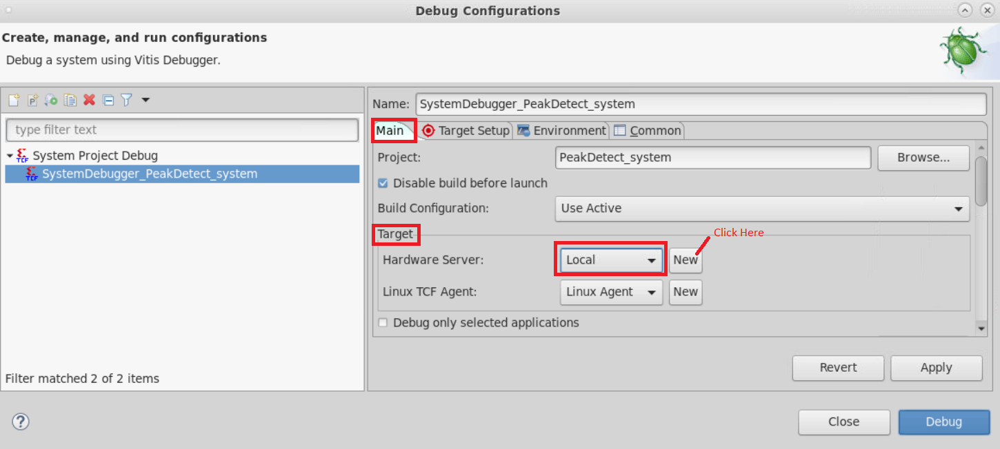
	* In the **Target Connection Details** window, enter the **Target name** and **Host**. The Host name should match with what you see in the launch hardware server window, and hit **Test Connection**.
	* You should see the following **Connection Successful!** message:
	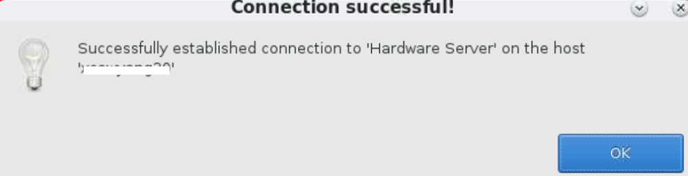

	* You can also click the **>>Advanced** button to view the details of the VCK190 as follows.
	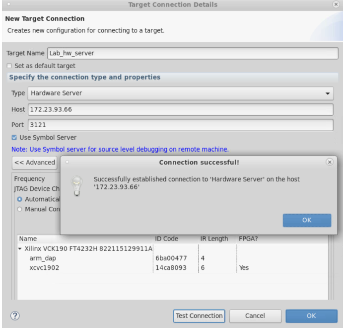
10. Similarly, set up the Linux TCF Agent. Under the **Main** tab -> **Target** section -> **Linux TCF Agent** option, select **New** and enter the **Target** and **Host** details. Enter the `inet addr` address you see after issuing the `ifconfig` command in the hardware Linux console in the **Host** field. Click **Test Connection**. You see **Connection Successful** message as shown above.

11. Now, in the Vitis IDE, right-click the **PeakDetect_system**, and select the **Debug As** -> **Launch Hardware**.
12. The Vitis IDE switches automatically to the debug mode, and the debugger suspends the host application at an automatic breakpoint in the `host.cpp` as follows.
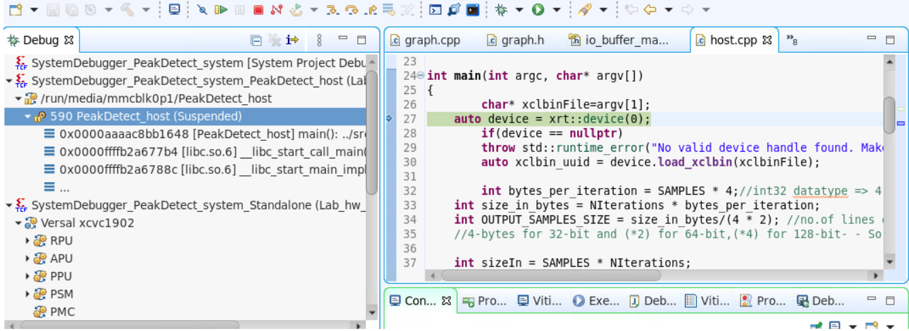

13. NPlace a breakpoint at line 38 in the `host.cpp`, and click **resume**. Observe the following values of different variables in the **Variables view**:
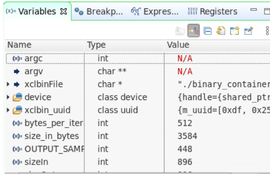

      This way you can debug the host code.

14. You can also debug the AI Engine cores by placing the breakpoints in the kernel source code. Open the `src/kernels/peak_detect.cc` kernel, and place a breakpoint at line 33. Click the  **resume** button, and observe the following values in the register view and variable view.
15. You can hover your mouse over variables in the editor window and get the memory address. Add that address in the memory inspector, and observe the corresponding values. For more details, refer to the [Debug Using Vitis IDE debugger](../AIE_Simulation/README.md#Debug-using-Vitis-IDE-debugger).
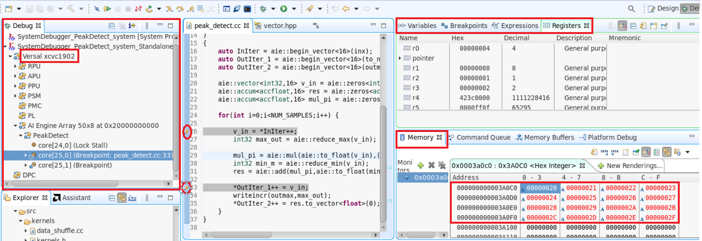
16. You can select each individual core in the AI Engine and debug using the 'step-in','step-over' options, or remove all breakpoints, select the **PeakDetect**, and click the **resume** button to run all the cores. When all cores are completed, you can see status as **Disabled** for all the cores.
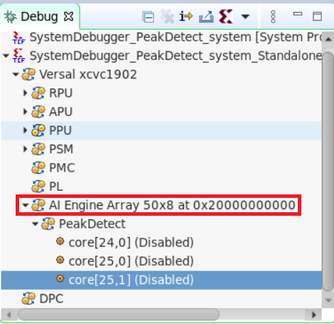
17. When the application run completes in hardware, you can observe the following **TEST PASSED** in the console .
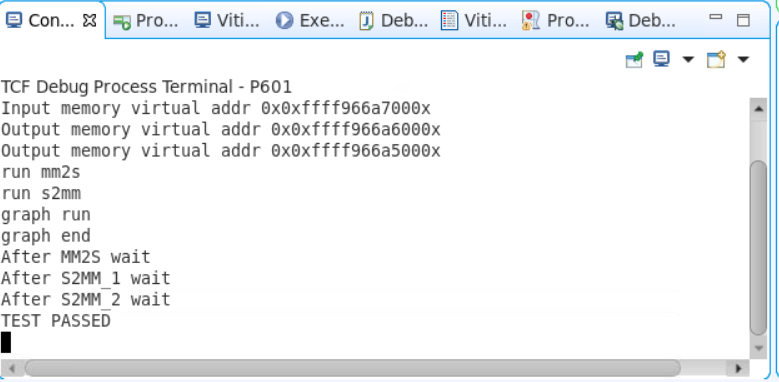

### Limitations of the Source Code Debug on Hardware

* There are maximum of four breakpoints available for each tile. One of these four breakpoints is assigned to first line of `main()` function by default and can be cleared and then assigned to other lines during debug.
* Due to the compiler, the `-O0` option is not supported; non-sequential execution when stepping through the source code is expected.
* If an individual kernel is highlighted, select the **resume** button to continue execution until the next breakpoint or blocked to wait for I/O. If the PeakDetect design is highlighted, select the **resume** button to resume all kernels execution until meet each kernel's breakpoint or blocked waiting for each kernel's I/O operation.
Due to compiler optimization, some variables' values are stored in registers. "N/A" is shown in the variables view for those optimized variables' values.
* `printf()` is not supported in hardware debug.

## Support

GitHub issues will be used for tracking requests and bugs. For questions, go to [support.xilinx.com](https://support.xilinx.com/).

<p class="sphinxhide" align="center"><sub>Copyright © 2020–2023 Advanced Micro Devices, Inc</sub></p>

<p class="sphinxhide" align="center"><sup><a href="https://www.amd.com/en/corporate/copyright">Terms and Conditions</a></sup></p>
