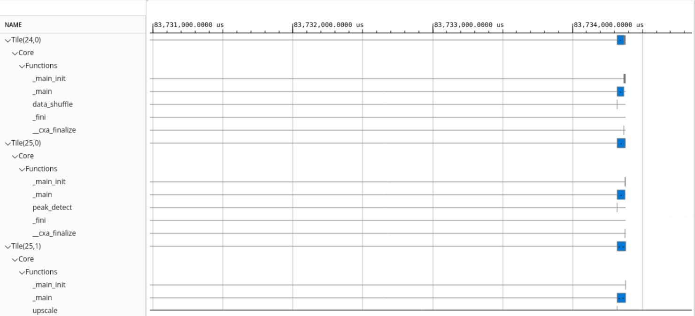
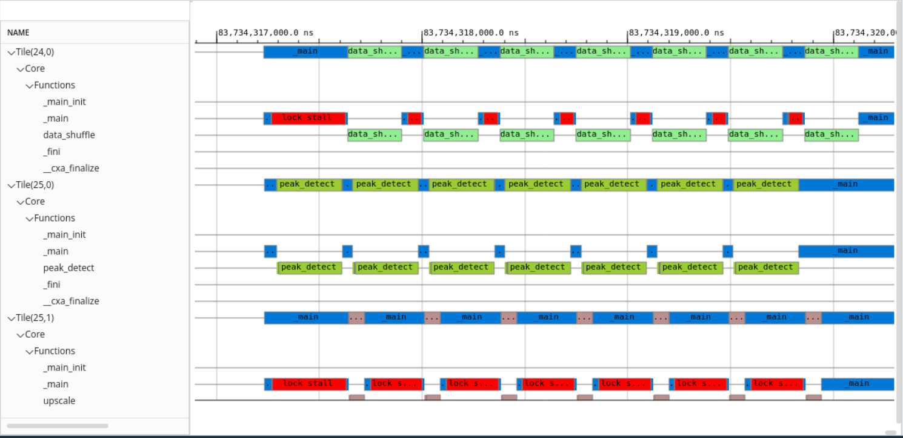

<table class="sphinxhide" width="100%">
 <tr width="100%">
    <td align="center"><h1>AI Engine Development</h1>
    <a href="https://www.xilinx.com/products/design-tools/vitis.html">See Vitis™ Development Environment on xilinx.com</br></a>
    <a href="https://www.xilinx.com/products/design-tools/vitis/vitis-ai.html">See Vitis™ AI Development Environment on xilinx.com</a>
    </td>
 </tr>
</table>

# AI Engine Event Trace and Analysis

This stage helps you determine the AI Engine kernel or graph construct causing design performance drop or stall, or causing a deadlock by

* Running and analyzing runtime trace data using AI Engine Event trace flow.
* Profiling Intra-kernel performance.
* Using Vitis IDE debugger to debug kernel source code.

<table style="width:100%">

<tr>
<td>
<a href="./Stage_4.md#Build-the-design"> Build the design for Event trace Analysis</a>
</td>
<td>
Explains how to use different event trace options for compiling and its significance. Also walks through the steps to generate hardware image.<br />
<a href="./Stage_4.md#Prepare-for-hardware-run">&nbsp; &nbsp; &nbsp; * Prepare for hardware run</a>
</td>
</tr>

<tr>
<td>
<a href="./Stage_4.md#XRT-Flow"> Event Trace analysis - XRT flow</a>
</td>
<td>
Explains how to do AI Engine event trace and analysis by setting up the configuration file `xrt.ini` and run hardware design to generate trace data using XRT flow.<br />
<a href="./Stage_4.md#Launch-Vitis-Analyzer-to-Examine-Event-Trace-Files">&nbsp; &nbsp; &nbsp; * Launch Vitis Analyzer to Examine Event Trace Files</a> <br />
<a href="./Stage_4.md#Details-of-the-Event-Trace-data">&nbsp; &nbsp; &nbsp; * Details of the Event Trace data</a> <br />
</td>
</tr>
	
<tr>
<td>
<a href="./Stage_4.md#XSDB-Flow"> Event Trace Analysis - XSDB flow</a>
</td>
<td>
This method explains how to use XSDB based flow to perform event trace analysis on AI Engine design.<br />
</td>
</tr>
	
<tr>
<td>
<a href="./Stage_4.md#Event-trace-considerations"> Event trace considerations</a>
</td>
<td>
This method explains how to use XSDB based flow to perform event trace analysis on AI Engine design.<br />
<a href="./Stage_4.md#Event-Trace-Choice-Considerations">&nbsp; &nbsp; &nbsp; * Event Trace Choice Considerations</a> <br />
<a href="./Stage_4.md#Number-of-Event-Trace-Streams-Methodology">&nbsp; &nbsp; &nbsp; * Number of Event Trace Streams Methodology</a> <br />
<a href="./Stage_4.md#Event-Trace-Limitations">&nbsp; &nbsp; &nbsp; * Event Trace Limitations</a> <br />
</td>
</tr>
	
<tr>
<td>
<a href="./Stage_4.md#Debug-host-code-and-kernel-source-code-using-Vitis-IDE"> Debug host/kernel source code using VitisIDE</a>
</td>
<td>
Explains how to setup target connection for hardware in Vitis IDE and debug the host code and kernel source code in vitis IDE debugger.<br />
</td>
</tr>
 	
</table>

## Event Trace Analysis Features

This tutorial targets the event trace feature running on the hardware board that allows you to understand how the design is executed on hardware. With support from Vitis™ analyzer, you can view the function calls, stalls (both execution and memory), and the flow of execution in the AI Engine. This information is helpful to improve the overall design performance. The steps within this tutorial introduce event trace compilation options, running the design on hardware to generate event trace with XSDB and XRT flows, collect generated event trace data, and launch Vitis_analyzer to review the design execution on hardware.

Before starting this tutorial, 
* It is expected that you cloned the Git repository and the design files are ready to build.
* It is expected that you have run the steps to set the environment variables as described in [Introduction](../README.md#Introduction)

### Build the design

To run event trace on hardware, it is required to compile the AI Engine graph with `--event-trace` and other appropriate flags. The flags are categorized based on the way the trace data need to be captured. 

* Using the `runtime` as an argument, you can compile the AI Engine graph to be set up for event trace, and specify the type of profile data to capture at run-time. 
* The other way is to specify one of the `functions`, `functions_partial_stalls`, or `functions_all_stalls` as a type of profile data during compile time and recompile the design to capture a different type of data during runtime.

For more information on different event trace options for AI Engine compilation, refer to [Event Trace Options](https://docs.xilinx.com/r/en-US/ug1076-ai-engine-environment/AI-Engine-Compiler-Options)

This tutorial uses `--event-trace=runtime`, `--event-trace-port=plio`, `--num-trace-streams=8` and `--xlopt=0` options.
* `--event-trace=runtime` option enables run-time event trace configuration.<br />
* `--event-trace-port=plio` option sets the AI Engine event tracing port to be `plio`. Default is `gmio`.<br />
* `--num-trace-streams=8` option sets the number of trace streams to be 8 to collect generated event trace data.
* `--xlopt=0` disables aiecompiler optimization for debug purposes.

Design with the --event-trace=runtime option in build that enables run-time events during compile time. This only needs to build the design once and allows different event trace levels to be generated during run time via XSDB or XRT flow.

1) Navigate to `cmd_src/` directory and open `Makefile`.<br />
2) Search for `AIE_INCLUDE_FLAGS` and add `--event-trace=runtime --event-trace-port=plio --num-trace-streams=8 --xlopt=0` options at the end. This flag is passed to the `aiecompiler` command during compilation.<br />
3) Do `make all TARGET=hw`.<br />
4) Make sure package step completed, by checking the `sd_card.img` inside `sw/` directory.

### Prepare for hardware run

After the design is built, we are ready to run on the hardware board.

* Flash the SD card with the built sd_card.img.<br />
* Plug the flashed SD card into the SD card slot of the vck190 board.<br />
* Connect the USB type C cable to the board and computer that supports serial port connection.<br />
* Set the serial port configuration with Speed=115200, Data=8 bit, Parity=none, Stop bits=1 bit and flow control=none.<br />
* Power up the vck190 board to see boot messages from serial connection.<br />

### XRT Flow

1) In the hardware linux console, create `xrt.ini` file on `SD card` using the following lines.

```
#xrt.ini
[Debug]
	aie_trace = true
	
[AIE_trace_settings]
	reuse_buffer = true
	periodic_offload = true
	buffer_offload_interval_us = 100
	buffer_size = 16M
	graph_based_aie_tile_metrics = all:all:functions_all_stalls
```
More details about these settings are explained in [XRT Trace options](https://docs.xilinx.com/r/en-US/ug1076-ai-engine-environment/XRT-Flow)

2) Run the application.

```
cd /run/media/mmcblk0p1
./ps_app.exe a.xclbin
```
3) After successful run, the files created on the SD card are
* `aie_trace_N.txt` 
* `aie_event_runtime_config.json`
* `xrt.run_summary`

4) Copy these files back to the work space, same level as design's `Work/` directory.<br />

#### Launch Vitis Analyzer to Examine Event Trace Files

5) Open Vitis Analyzer using `vitis_analyzer xrt.run_summary` command.<br />
6) It is required to set the design's compile summary file when you run Vitis Analyzer for first time on the design. <br />
7) Select **Trace** from the left pane of Vitis Analyzer. Initially details of the event are not shown.<br />

>

9) Zoom-in to see detailed information for each state of AI Engine tiles.<br />

>

#### Details of the Event Trace data 
10) select the `Graph` view to examine design. select the `p_d` to identify the tile as (25,0).<br />
>
11) Now, Adjust the trace view to correct size with zoom in or zoom out icons and move marker to end of `peak_detect`, or beginning of `_main`. This is considered as the beginning of an iteration. A period of lock stall indicates data is sent from PL to AIE tile.<br />
>
12) Observe the end of the `peak_detect` kernel corresponding to the core(25,0) and start of the core(24,0) and core(25,1). If you observe the graph view, you can notice that the kernel `peak_detect` sends data to both `upscale` and `data_shuffle` kernels. The same behavior can be observed in trace view as well.
13) We can calculate the execution time of one iteration as shown below. Place the marker at start and end of the iteration and (1) - (2) gives 262.2 ns which is ~= 329 cycles. This matches with the `Function time` in profile data from both AI Engine simulation and hardware emulation.

>


### XSDB Flow

15) Program the device using sd_card image and remove any xrt.ini files in the sd_card to avoid misbehavior with XSDB commands.<br />
16) _Target connection setup_ - Run the hardware server from computer that connects to target board. To do so, launch hardware server from the computer that has JTAG connection to the vck190 board. 

>

17) Go to the directory where AI Engine compile Work/ directory is present and launch XSDB.
18) From the XSDB terminal, issue below commands below from the XSDB prompt.

```
xsdb
%xsdb connect -url TCP:${COMPUTER NAME/IP}:3121
%xsdb ta
%xsdb ta 1
%xsdb source $::env(XILINX_VITIS)/scripts/vitis/util/aie_trace.tcl
%xsdb aietrace start -graphs mygraph -link-summary ./tutorial.xsa.link_summary -base-address 0x900000000 -depth 0x800000 -graph-based-aie-tile-metrics "all:all:functions_all_stalls"

```
* `-base-address 0x900000000` is the address that needs to avoid collision with your design.
* `-depth 0x8000000` is the size of event trace file. Please adjust accordingly with your design size and amount of event trace data.

19) After the above `aietrace` start command is run, switch to the hardware linux console and run the application. <br />

```
cd /run/media/mmcblk0p1
./host.exe a.xclbin
```
20) After the design run completes on the hardware, stop the trace using `aietrace stop`. the generated events and run_summary files need to be collected and ready to be examined.
21) Inspect the generated events and run_summary files.(`aie_trace_N.txt` and `aie_trace_profile.run_summary`) in your local workspace where XSDB is launched.
22) Open the `aie_trace_profile.run_summary` file in Vitis Analyzer and observe the results as explained in the XRT flow..

### Event trace considerations

#### Event Trace Choice Considerations

Based on the design, select GMIO if the design has limited PL resources left for event trace generation.

|           | Baremetal | Petalinux | Bandwidth                        | PL resources used |
| :---| :---: | :---: | :---: | :--- |
| PLIO/XSDB | O         | O         | pl clock-rate * trace-plio-width | Yes               |
| PLIO/XRT  |           | O         | pl clock-rate * trace-plio-width | Yes               |
| GMIO/XSDB | O         | O         |                                  | No                |
| GMIO/XRT  |           | O         |                                  | No                |

#### Number of Event Trace Streams Methodology

| Number of cores | Recommended number of streams |
| :---| :---|
| Less than 10      | 1 |
| Between 10 and 20 | 2 |
| Between 20 and 40 | 4 |
| Between 40 and 80 | 8 |
| Larger than 80    | 16 |
| Intense debug     | 16 |
|                   | Xilinx recommends no more than 16 streams due to resource constraints |

#### Event Trace Limitations
1. Due to limited resources, overruns can be seen from event trace. Follow [Number of event trace streams methodology](#Number-of-event-trace-streams-methodology) to configure number of trace streams minimize overruns issue.
2. It is required that the `--broadcast-enable-core` option is used to compile the design. This is to eliminate time sync issues where start time of each tile is off by ~100 ns or more.
3. Run forever applications are supported by the XSDB flow only.

## Debug host code and kernel source code using Vitis IDE

This section uses the system project built using Vitis IDE and launch IDE debugger to debug the host code and AI Engine kernel source code. Unlike debugging at simulation level, this topic walks you through connecting the harware to the IDE debugger, place break points in host code, kernel source code and observe intermittent values in Varibale view, register view and memory inspector.

1) Download the Vitis IDE project from [Download Vitis IDE project](../README.md#Download-Vitis-IDE-project) and import in Vitis IDE.<br />
2) Invoke the Vitis IDE and **File** -> **Import** -> **Vitis project exported zip file**.<br />
3) Browse to the `PeakDetect.ide.zip` and enable the checkbox **System Projects** and click **Finish** .<br />
4) Click on the arrow button next to the **Manage configurations to the current project** icon in the task bar and select **Hardware**.<br />
5) Now right-click on the **PeakDetect_system** and select the **Build Project**. It takes 20-25 min to completely build for hardware target.<br />
6) Prepare the target hardware by flashing the `sd_card.img` on to the VCK190.(Refer to the note below).<br />
**Note**: The `sd_card.img` at `{Project}/Hardware/package` directory is for regular use and the `sd_card.img` at `{Project}/Hardware/package_aie_debug` directory is for debug run on board.<br />
7) Plug-in sd_card into SD card slot and power up the board. <br />
8) Once the boot completes, type `ifconfig` in the hardware console. This is required to setup the Linux TCF agent to connect with host.

```
versal-rootfs-common-20231:/run/media/mmcblk0p1# ifconfig
eth0      Link encap:Ethernet  HWaddr 72:5D:6F:74:88:C9
          UP BROADCAST MULTICAST  MTU:1500  Metric:1
          RX packets:0 errors:0 dropped:0 overruns:0 frame:0
          TX packets:0 errors:0 dropped:0 overruns:0 carrier:0
          collisions:0 txqueuelen:1000
          RX bytes:0 (0.0 B)  TX bytes:0 (0.0 B)
          Interrupt:34

eth1      Link encap:Ethernet  HWaddr F6:94:91:C7:19:B0
          inet addr:10.140.179.228  Bcast:10.140.179.255  Mask:255.255.252.0
          inet6 addr: fe80::f494:91ff:fec7:19b0/64 Scope:Link
          UP BROADCAST RUNNING MULTICAST  MTU:1500  Metric:1
          RX packets:1325 errors:0 dropped:6 overruns:0 frame:0
          TX packets:565 errors:0 dropped:0 overruns:0 carrier:0
          collisions:0 txqueuelen:1000
          RX bytes:103454 (101.0 KiB)  TX bytes:94168 (91.9 KiB)
          Interrupt:35

lo        Link encap:Local Loopback
          inet addr:127.0.0.1  Mask:255.0.0.0
          inet6 addr: ::1/128 Scope:Host
          UP LOOPBACK RUNNING  MTU:65536  Metric:1
          RX packets:2 errors:0 dropped:0 overruns:0 frame:0
          TX packets:2 errors:0 dropped:0 overruns:0 carrier:0
          collisions:0 txqueuelen:1000
          RX bytes:140 (140.0 B)  TX bytes:140 (140.0 B)
```

**Note**: It is required to connect VCK190 board to the Ethernet cable to get the ethernet address.

9) Now, setup the connnection to the target hardware board.<br /> 
	* Run the hardware server from computer that connects to target board. To do so, launch hw_server from the computer that has JTAG connection to the vck190 board.<br />
	>
	* Create debug target connection from Vitis IDE by right-click on the **PeakDetect_system** and select the **Debug** -> **Debug configuraions**.<br />
	* Under **Main** tab -> **Target** section -> **Hardware server** option -> **Local target** -> **New** as shown below.<br />
	>
	* In the **Target Connection Details** window -> Enter the **Target name** and **Host**. The Host name should match with what you see in launch hardware server window and hit **Test Connection**. <br />
	* You should see **Connection Successful!** message as shown below.<br />
	
	>

	* You can also click on **>>Advanced** button to view the details of the VCK190 as shown below.
	>
10) Similarly, setup the Linux TCF Agent. Under **Main** tab -> **Target** section -> **Linux TCF Agent** option -> Select **New** and enter **Target**, **Host** details. Enter the `inet addr` address you see after issuing `ifconfig` command in hardware linux console in the **Host** field. Click on **Test Connection**. You see **Connection Successful** message as shown above. <br />

11) Now, in Vitis IDE, right-click on the **PeakDetect_system** and select the **Debug As** -> **Launch Hardware**.<br />
12) The Vitis IDE switches automatically to the debug mode and the debugger suspends the host application at an automatic breakpoint in the `host.cpp` as shown below. <br />
>

13) Now place a breakpoint at line-38 in `host.cpp` and click on resume. Observe the values of different variables in the **Variables view** as shwown below.<br />

>

This way you can debug the host code.

14) You can also debug the AI Engine cores, by placing the break-points in the kernel source code. Open the `src/kernels/peak_detect.cc` kernel and place a break point at line-33. Click on resume button and observe the values in register view, variable view as shown below.<br />
15) You can hover your mouse over variables in editor window and get the memory address. Add that address in the memory inspector and observe the corresponding values. For more details refer to the [Debug using Vitis IDE debugger](../AIE_Simulation/README.md#Debug-using-Vitis-IDE-debugger).<br />
>
16) You can select each individual core in the AI Engine and debug using 'step-in','step-over' options or remove all breakpoints and select the **PeakDetect**, click resume button to run all the cores. When all cores are completed, you can see status as **Disabled** for all the cores.<br />
> 
17) When the application run completes in hardware and you can observe the **TEST PASSED** in the console as shown below.<br />
>

### Limitations of Source Code Debug on Hardware

* There are maximum four breakpoints available for each tile. One of these four breakpoints is assigned to first line of main() by default and can be cleared and then assigned to other lines during debug.
* Due to compiler, -O0 option is not supported, non-sequential execution when stepping through source code is expected.
* If an individual kernel is highlighted, select resume button to continue execution until next breakpoint or blocked to wait for I/O. If the PeakDetect design is highlighted, select resume button to resume all kernels execution until meet each kernel's breakpoint or blocked waiting for each kernel's I/O operation.
Due to compiler optimization, some variables' values are stored in registers. "N/A" is shown in the variables view for those optimized variables' values. 
* printf() is not supported in hardware debug.

## Support

GitHub issues will be used for tracking requests and bugs. For questions go to [support.xilinx.com](https://support.xilinx.com/).


<p class="sphinxhide" align="center"><sub>Copyright © 2020–2023 Advanced Micro Devices, Inc</sub></p>

<p class="sphinxhide" align="center"><sup><a href="https://www.amd.com/en/corporate/copyright">Terms and Conditions</a></sup></p>
