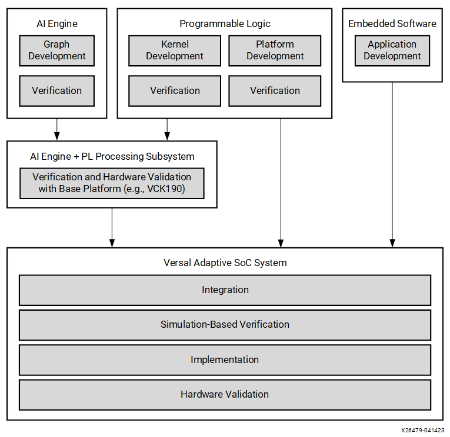
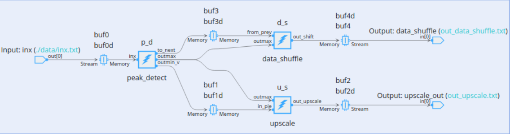

<table class="sphinxhide" width="100%">
 <tr width="100%">
    <td align="center"><h1>AI Engine Development</h1>
    <a href="https://www.xilinx.com/products/design-tools/vitis.html">See Vitis™ Development Environment on xilinx.com </a>
    <a href="https://www.xilinx.com/products/design-tools/vitis/vitis-ai.html">See Vitis™ AI Development Environment on xilinx.com</a>
    </td>
 </tr>
</table>

# AI Engine Debug Walkthrough Tutorial - From Simulation to Hardware

***Version: Vitis 2023.1***

## Introduction

The Vitis environment development methodology reflects the heterogeneous nature of AMD Versal&trade; adapative SoC systems, which typically consist of a processing system (PS), programmable logic (PL), and AI Engine (AIE) functionality. Using the Vitis tools, you can develop and verify these components independently and gradually integrate them to form the final system.

The Vitis environment design flow is an iterative process that might loop through each step multiple times, adding layers or elements to the adaptable system through subsequent iterations. Teams can iterate through the early steps more quickly and take more time with later steps, which provide more detailed performance data.

A system-level debug of AI Engine designs that could use up to 400 tiles in the AI Engine domain, PL interfaces and kernels, and PS application can be done at several stages in the design flow. The system-level debug of AI Engine designs can be categorized as follows:

1. Functional debug that involves techniques to uncover bugs in the AI Engine kernel source code.
2. Performance level debug that involves debug techniques to uncover reasons for the throughput drop or reasons for larger latencies when the AI Engine graph is run either in simulation or in hardware.

Techniques to uncover both functional and performance level bugs are described in the following sections.  

Source level debug includes visibility into the register contents view, variable values view, breakpoints view, and hence, necessitates a GUI. The Vitis integrated design environment (IDE) is the tool that supports these debug requirements. This tutorial demonstrates how to use the Vitis IDE to manage these challenges and additional tools and methodologies to assist with your design debug.

>**IMPORTANT**: Before beginning the tutorial, make sure you have installed the Vitis 2023.1 software. The Vitis release includes all the embedded base platforms including the VCK190 base platform that is used in this tutorial. In addition, ensure you have downloaded the Common Images for Embedded Vitis Platforms from this link: <https://www.xilinx.com/support/download/index.html/content/xilinx/en/downloadNav/embedded-platforms/2023-1.html>.

The `common image` package contains a prebuilt Linux kernel and root file system that can be used with a Versal board for embedded design development using Vitis. Before starting this tutorial run the following steps:

1. Go to the directory where you have unzipped the Versal Common Image package.
2. In a Bash shell, run `/Common Images Dir/xilinx-versal-common-v2023.1/environment-setup-cortexa72-cortexa53-xilinx-linux script`. This script sets up the `SDKTARGETSYSROOT` and `CXX` variables. If the script is not present, you must run `/Common Images Dir/xilinx-versal-common-v2023.1/sdk.sh`.
3. Set up your `ROOTFS` and `IMAGE` to point to the `rootfs.ext4` and `Image` files located in the `/Common Images Dir/xilinx-versal-common-v2023.1` directory.
4. Set up your PLATFORM_REPO_PATHS environment variable to `$XILINX_VITIS/lin64/Vitis/2023.1/base_platforms`.

This tutorial targets a 2023.1 VCK190 production board.

## Example Design: Peak Detector

The architecture of the Peak detector consists of three kernels. A **peak_detect** kernel and two postprocessing kernels, **data_shuffle** and **upscale**. The `peak_detect` kernel takes the vector input data of type `int32` and size `16` for every iteration and computes, 1) max(16-lane input) 2) an expression on minimum value using APIs and sends it over stream and buffer respectively. The stream output is broadcasted to the two kernels, `data_shuffle` and `upscale`, for postprocessing.

The complete design is shown in the Vitis analyzer.

## Methods

There are several ways to debug a system design that include the PS, PL, and AI Engine or an AI Engine only design. Each method has the intended goal to help debug practice. The following are some debug methodlogies that helps analyzing the design and take decisions to improve.

## Download the Vitis IDE Project

[PeakDetect.ide.zip](https://www.xilinx.com/bin/public/openDownload?filename=PeakDetect.ide.zip)

## Debug Methodologies

<table style="width:100%">

<tr>
  <td align="center" colspan="2" style="bold" ><b><a href="./X86_Simulation/README.md#X86-Simulation-Debug-Walkthrough">X86 Simulation - Vitis IDE Flow</a></b>
</tr>

<tr>
<td>
 <a href="./X86_Simulation/README.md#Build-and-simulate-in-Vitis-IDE">Build and Simulate in the Vitis IDE</a>
</td>
<td>
Demonstrates how to use the Vitis IDE to build and simulate the AI Engine design.
</td>
</tr>

<tr>
<td>
<a href="./X86_Simulation/README.md#Debug-using-printf">Debug Using printf()</a>
</td>
<td>
Demonstrates how to add the formatted `printf()` to print debug messages.
</td>
</tr>

<tr>
<td>
<a href="./X86_Simulation/README.md#Debug-using-printf-with-Vector-datatypes">Debug Using printf() with Vector Data Types</a>
</td>
<td>
Demonstrates how to print vector output data value via `printf()`.
</td>
</tr>

<tr>
<td>
<a href="./X86_Simulation/README.md#Debug-using-Vitis-IDE-debugger">Debug Using the Vitis IDE Debugger</a>
</td>
<td>
Demonstrates how to use the Vitis IDE debugger to debug an AI Engine design.
</td>
</tr>

<tr>
<td>
<a href="./X86_Simulation/README.md#x86simulator-options-for-debugging">x86simulator Options for Debugging</a>
</td>
<td>
Demonstrates how to use the x86simulator options file for debugging.
</td>
</tr>

<tr>
<td>
<a href="./X86_Simulation/README.md#Data-dump">Data Dump</a>
</td>
<td>
Demonstrates how to use the data dump feature with a practical scenario.
</td>
</tr>
 
<tr>
<td>
<a href="./X86_Simulation/README.md#Deadlock-detection">Deadlock Detection</a>
</td>
<td>
Demonstrates how to debug deadlock scenarios in an x86simulation.
</td>
</tr>

<tr>
<td>
<a href="./X86_Simulation/README.md#Trace-report-in-file">Trace Report in the File</a>
</td>
<td>
Demonstrates how to visualize the trace report in the file.
</td>
</tr>

<tr>
<td>
<a href="./X86_Simulation/README.md#Trace-report-in-output-console">Trace Report in the Output Console</a>
</td>
<td>
Demonstrates how to visualize the trace report in the output console during runtime.
</td>
</tr>

<tr>
<td>
<a href="./X86_Simulation/README.md#Memory-access-violation-and-valgrind-support">Memory Access Violation and Valgrind Support</a>
</td>
<td>
Demonstrates how to debug memory access violations in an AI Enigne design using Valgrind support.
</td>
</tr>

<tr>
<td>
<a href="./X86_Simulation/README.md#Using-GDB-debugger-in-command-line">Using the GDB in the Command Line</a>
</td>
<td>
Demonstrates about debugging in command line using the GNU Debugger (GDB).
</td>
</tr>

<tr>
<td>
<a href="./X86_Simulation/README.md#x86simulation-on-command-line">x86simulation on the Command Line</a>
</td>
<td>
Demosntrates how to run x86simulation on the command line.
</td>
</tr>
 
<tr>
<td>
<a href="./X86_Simulation/README.md#x86simulation-with-GDB">x86simulation with the GDB</a>
</td>
<td>
Demonstrates how to use the GDB during x86simulation.
</td>
</tr>
 
<tr>
<td>
<a href="./X86_Simulation/README.md#x86simulator-Using-GDB-server">x86simulator Using a GDB Server</a>
</td>
<td>
Demonstrates how to use a GDB server to debug the design.
</td>
</tr>

 <tr>
  <td align="center" colspan="2" style="bold" ><b><a href="./AIE_Simulation/README.md#AIE-Simulation-Debug-Walkthrough">AIE Simulation - Vitis IDE Flow</a></b>
</tr>

<tr>
<td>
 <a href="./AIE_Simulation/README.md#Build-and-simulate-in-Vitis-IDE">Build and Simulate in the Vitis IDE</a>
</td>
<td>
Demonstrates how to use Vitis IDE to build and simulate an AI Engine design.
</td>
</tr>
	
<tr>
<td>
<a href="./AIE_Simulation/README.md#Debug-using-printf">Debug Using printf</a>
</td>
<td>
Explains how to add a `printf() `statement, and view the output in the console.
</td>
</tr>

<tr>
<td>
<a href="./AIE_Simulation/README.md#Debug-using-Vitis-IDE-debugger">Debug Using the Vitis IDE Debugger</a>
</td>
<td>
Explores different debugging techniques that uses the Vitis IDE debugger.
</td>
</tr>

<tr>
<td>
<a href="./AIE_Simulation/README.md#Enabling-profile-and-trace-options">Enabling Profile and Trace Options</a>
</td>
<td>
Explains how to enable profile and trace options in the Vitis IDE. Explores different event trace dump options like VCD and WDB.
</td>
</tr>

<tr>
<td>
<a href="./AIE_Simulation/README.md#Deadlock-detection">Deadlock Detection</a>
</td>
<td>
Shows a practical deadlock scenario and some simulator options to identify the deadlock.
</td>
</tr>

<tr>
<td>
<a href="./AIE_Simulation/README.md#Visualizing-deadlock-in-Vitis-Analyzer">Visualizing Deadlock in the Vitis Analyzer</a>
</td>
<td>
Explains how to visualize deadlock using trace information in the Vitis Analyzer, and identify the root cause.
</td>
</tr>

<tr>
<td>
<a href="./AIE_Simulation/README.md#Debugging-memory-access-violations">Debugging Memory Access Violations</a>
</td>
<td>
Introduces an out of bound read access, and explains how to identify the violations using AI Engine simulator options.
</td>
</tr>

<tr>
<td>
<a href="./AIE_Simulation/README.md#Single-kernel-debug">Single Kernel Debug</a>
</td>
<td>
Explains how to debug a single kernel design usign a pipeline view in the Vitis IDE.
</td>
</tr>

<tr>
<td>
<a href="./AIE_Simulation/README.md#Design-performance-debug">Design Performance Debug</a>
</td>
<td>
Shows how to calculate kernel latency and throughput using profile information.
</td>
</tr>

<tr>
  <td align="center" colspan="2" style="bold" ><b><a href="./SW_Emulation/README.md#Software-Emulation-Debug-Walkthrough">Software Emulation - Vitis IDE Flow</a></b>
</tr>

<table style="width:100%">

<tr>
<td>
<a href="./SW_Emulation/README.md#Build-for-Software-Emulation-using-Vitis-IDE">Build for Software Emulation Using the Vitis IDE</a>
</td>
<td>
Explains how to create a system project, build for sofware emulation, and run.
</td>
</tr>

<tr>
<td>
<a href="./SW_Emulation/README.md#Using-Vitis-IDE-for-software-emulation-debug">Using the Vitis IDE for Software Emulation Debug</a>
</td>
<td>
Explains how to debug for software emulation using the Vitis IDE.
</td>
</tr> 

<tr>
<td>
<a href="./SW_Emulation/README.md#Debug-in-command-line">Debug in the Command Line</a>
</td>
<td>
Explains how to use the GDB to debug in the command line using the option, `-kernel-dbg true`.
</td>
</tr>

<tr>
  <td align="center" colspan="2" style="bold" ><b><a href="./HW_Emulation/README.md#Hardware-Emulation-Debug-Walkthrough">Hardware Emulation - Vitis IDE Flow</a></b>
</tr>

<tr>
<td>
<a href="./HW_Emulation/README.md#Build-for-Hardware-Emulation-using-Vitis-IDE">Build for Hardware Emulation Using the Vitis IDE</a>
</td>
<td>
Explains how to create a system project, build for hardware emulation, and run.
</td>
</tr> 

<tr>
<td>
<a href="./HW_Emulation/README.md#Debug-PL-kernels-using-the-Vivado-Logic-Simulator">Debug PL Kernels Using the Vivado Logic Simulator</a>
</td>
<td>
Explains how to use Vivado XSIM to debug the PL kernels.
</td>
</tr>
 
<tr>
<td>
<a href="./HW_Emulation/README.md#Performance-of-the-AI-Engine-using-hardware-emulation-results">Performance of the AI Engine Using Hardware Emulation Results</a>
</td>
<td>
This section profiles the system for hardware emulation and compares the throughput of the AI Engine design in hardware emulation with the throughput in AI Engine simulation.
</td>
</tr>
	
<tr>
<td>
<a href="./HW_Emulation/README.md#Command-line-project-source-code-debug-with-Vitis-IDE">Command Line Project Source Code Debug with the Vitis IDE</a>
</td>
<td>
This section helps you debug your command line project using the features of the Vitis IDE debugger without porting your system design to the IDE.
</td>
</tr>

<tr>
  <td align="center" colspan="2" style="bold" ><b><a href="./Hardware/README.md#Hardware-Debug-Walkthrough">Hardware - Command Line Flow</a></b>
</tr>

<tr>
<td>
<a href="./Hardware/Stage_1.md#Running-the-design-on-hardware">Running the Design on Hardware</a>
</td>
<td>
Explains how to determine the functional correctness of the design by running on hardware.
</td>
</tr>
	
<tr>
<td>
<a href="./Hardware/Stage_1.md#Error-Handling-and-Reporting-in-Host-Application">Error Handling and Reporting in the Host Application</a>
</td>
<td>
Explains how to use error reporting APIs to handle errors in the host code. 
 <a href="./Hardware/Stage_1.md#XRT-error-handling-APIs">&nbsp; &nbsp; &nbsp; *Xilinx Runtime (XRT) error handling APIs</a> - This method reports errors that can be detected during the XRT runtime function call or underneath driver, system, hardware, etc. 
 <a href="./Hardware/Stage_1.md#Using-XBUtil">&nbsp; &nbsp; &nbsp; * Using XBUtil</a> - XButil error reporting can accumulate all the errors from various classes and sorts them by timestamp. 
</td>
</tr>
	
<tr>
<td>
<a href="./Hardware/Stage_1.md#Analyzing-Run-results">Analyzing Run Results</a>
</td>
<td>
Explains different techniques (XRT, XBUtil and XSDB) to analyze the design by running on hardware and helps to choose from the following methodologies. 
 <a href="./Hardware/Stage_1.md#AI-Engine-status-using-XRT"> &nbsp; &nbsp; &nbsp; * AI Engine status using XRT</a> - Using XRT is fast and host executable can automatically reads the `xrt.ini` file to configure the runtime. -  
 <a href="./Hardware/Stage_1.md#Manual-AI-Engine-status-using-XBUtil-utility">&nbsp; &nbsp; &nbsp; * Manual AI Engine status using XBUtil utility</a> - XBUtil is a standalone command utility included with XRT and does not require any special file to handle. You can directly use XBUtil commands on the console after boot. 
 <a href="./Hardware/Stage_1.md#Deadlock-detection-using-XSDB">&nbsp; &nbsp; &nbsp; * Deadlock detection using XSDB</a> - XSDB runs independent of XRT and can analyze the results before, during, or after design runs. Also, you can use the XSDB for baremetal applications in addition to the Linux-based applications. 
</td>
</tr>
	
<tr>
<td>
<a href="./Hardware/Stage_1.md#Using-APIs-in-host-application">Using APIs in the Host Application</a>
</td>
<td>
Explains how to modify the host code to add APIs in the host application that helps profiling the design for getting throughput, latency, and bandwidth. 
 <a href="./Hardware/Stage_1.md#Profiling-Graph-throughput">&nbsp; &nbsp; &nbsp; * Profiling Graph throughput</a> - Provides insight on how to modify the host code for profiling the number of samples sent and received. 
 <a href="./Hardware/Stage_1.md#Profiling-to-count-Samples-sent-and-received">&nbsp; &nbsp; &nbsp; * Profiling to count Samples sent and received (Exercise Step)</a> - Provides insight on how to modify the host code for profiling the number of samples sent and received. 
</td>
</tr>
 	
<tr>
<td>
<a href="./Hardware/Stage_2.md#XRT-Flow"> Hardware Profiling Feature - XRT Flow</a>
</td>
<td>
Explains how to set up the configuration file `xrt.ini` and run the hardware design to generate profile data using the XRT flow. 
<a href="./Hardware/Stage_2.md#Open-multiple-profile-runs-in-Vitis-Analyzer">&nbsp; &nbsp; &nbsp; * Open multiple profile runs in Vitis Analyzer</a> - This exercise helps you understand how to open different profile summaries (two different runs) in a single Vitis Analyzer view. 
<a href="./Hardware/Stage_2.md#Profiling-Data-Explaination">&nbsp; &nbsp; &nbsp; * Profiling Data Explaination</a> - This explains how to analyze AI Engine core,memory and interface profiling data. Also discusses what action should be taken based on the stall time and DMA lock time. 
</td>
</tr>
	
<tr>
<td>
<a href="./Hardware/Stage_2.md#XSDB-Flow"> Hardware Profiling Feature - XSDB Flow</a>
</td>
<td>
This method explains how to use the XSDB-based flow to profile for both baremetal and Linux operating systems. 
</td>
</tr>
	
<tr>
<td>
<a href="./Hardware/Stage_3.md#Profiling-Using-PL-Profile-Monitors">Profiling Using PL Profile Monitors</a>
</td>
<td>
Explains how to insert PL profile monitors in the v++link command. This helps identify specific PL kernels(s) causing a performance drop.
</td>
</tr>
 
<tr>
<td>
<a href="./Hardware/Stage_3.md#Inserting-ILAs-to-Monitor-Specific-AXI-Interfaces">Inserting ILA(s) to Monitor Specific AXI Interfaces</a>
</td>
<td>
Explains how to insert one or more integrated logic analyzers (ILAs) to monitor specific PL AXI interfaces to help identify exactly where and when a throughput drop occurs. Also helps in identifying whether data is sent correctly to the AI Engine from the PL compenents and received correctly from the AI Engine to the PL.
</td>
</tr>
	
<tr>
<td>
<a href="./Hardware/Stage_4.md#Build-the-design"> Build the Design for Event Trace Analysis</a>
</td>
<td>
Explains how to use different event trace options for compiling and its significance. Also walks through the steps to generate the hardware image. 
<a href="./Hardware/Stage_4.md#Prepare-for-hardware-run">&nbsp; &nbsp; &nbsp; * Prepare for the hardware run</a>
</td>
</tr>

<tr>
<td>
<a href="./Hardware/Stage_4.md#XRT-Flow"> Event Trace Analysis - XRT Flow</a>
</td>
<td>
Explains how to do an AI Engine event trace and analysis by setting up the configuration file `xrt.ini` and run the hardware design to generate trace data using the  XRT flow. 
<a href="./Hardware/Stage_4.md#Launch-Vitis-Analyzer-to-Examine-Event-Trace-Files">&nbsp; &nbsp; &nbsp; * Launch Vitis Analyzer to Examine Event Trace Files</a>  
<a href="./Hardware/Stage_4.md#Details-of-the-Event-Trace-data">&nbsp; &nbsp; &nbsp; * Details of the Event Trace data</a>  
</td>
</tr>
	
<tr>
<td>
<a href="./Hardware/Stage_4.md#XSDB-Flow"> Event Trace Analysis - XSDB Flow</a>
</td>
<td>
This method explains how to use the XSDB-based flow to perform event trace analysis on an AI Engine design. 
</td>
</tr>
	
<tr>
<td>
<a href="./Hardware/Stage_4.md#Event-trace-considerations"> Event Trace Considerations</a>
</td>
<td>
This method explains how to use the XSDB-based flow to perform event trace analysis on anAI Engine design. 
<a href="./Hardware/Stage_4.md#Event-Trace-Choice-Considerations">&nbsp; &nbsp; &nbsp; * Event Trace Choice Considerations</a>  
<a href="./Hardware/Stage_4.md#Number-of-Event-Trace-Streams-Methodology">&nbsp; &nbsp; &nbsp; * Number of Event Trace Streams Methodology</a>  
<a href="./Hardware/Stage_4.md#Event-Trace-Limitations">&nbsp; &nbsp; &nbsp; * Event Trace Limitations</a>  
</td>
</tr>

<tr>
<td>
<a href="./Hardware/Stage_4.md#Debug-host-code-and-kernel-source-code-using-Vitis-IDE"> Debug the Host/Kernel Source Code Using the Vitis IDE</a>
</td>
<td>
Explains how to set up the target connection for hardware in the Vitis IDE and debug the host code and kernel source code in the Vitis IDE debugger. 
</td>
</tr>

</table>

## Best Practices

The foundation of the Vitis environment design methodology is an iterative approach and parallel development. As a result, AMD strongly recommends the following best practices:

* Develop the adaptable subsystem and the custom platform in parallel.
* A well-partitioned system means that these two elements can be developed and verified independently, saving time and effort. Debug and verify the AI Engine graph and each of the PL kernels individually before proceeding with integration.
* Taking this approach maximizes the chances of rapid convergence during the integration phase. It is much easier to debug integration issues when all components are known to be correct.
* Use a standard AMD platform (such as the VCK190) to integrate, and verify the adaptable subsystem comprised of the AI Engine graph and PL kernels before targeting the custom platform.
* AMD platforms are preverified and ready to be deployed on hardware. By using a standard AMD platform, developers of AI Engine graphs and PL kernels can verify the adaptable subsystem using simulation or hardware boards without the uncertainties and the complexities of the custom platform.
* Ensure performance goals are met at each stage of the flow.
* Performance results do not improve when running the full system in hardware versus simulating individual components in isolation. Therefore, it is essential to thoroughly check for and debug any performance issues as early as possible in the flow. Ensuring that performance goals are met at the component level is easier than in the context of a complex system that includes interactions between all of the components.

## Support

GitHub issues will be used for tracking requests and bugs. For questions, go to [support.xilinx.com](https://support.xilinx.com/).

Copyright © 2020–2023 Advanced Micro Devices, Inc

<a href="https://www.amd.com/en/corporate/copyright">Terms and Conditions</a>

