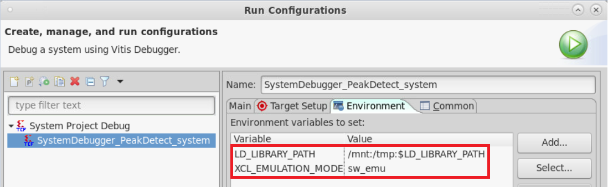
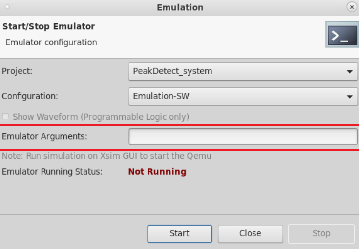
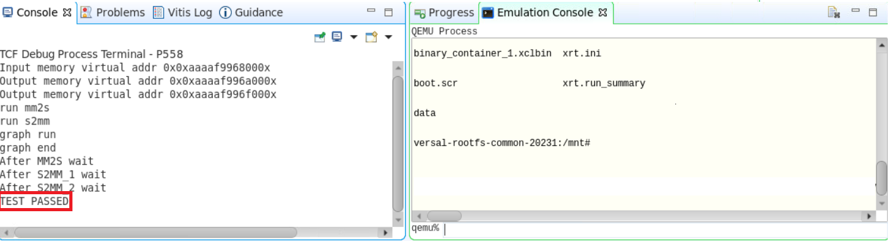
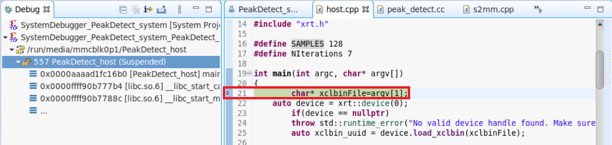
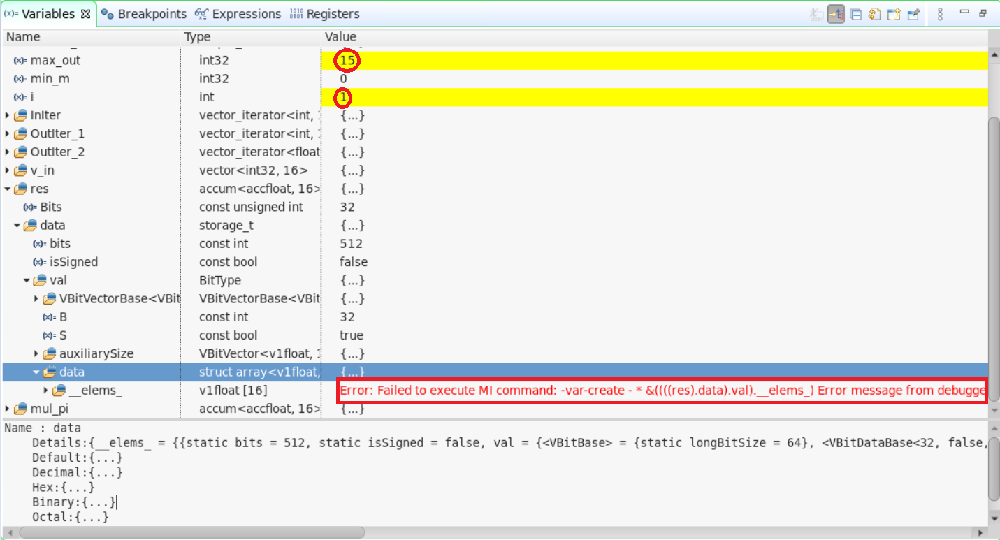
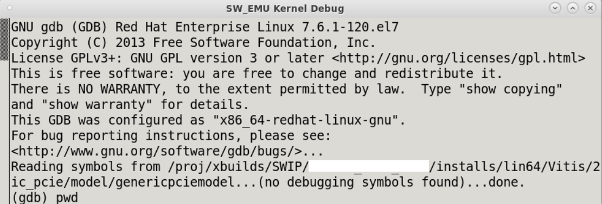

<table class="sphinxhide" width="100%">
 <tr width="100%">
    <td align="center"><h1>AI Engine Development</h1>
    <a href="https://www.xilinx.com/products/design-tools/vitis.html">See Vitis™ Development Environment on xilinx.com</br></a>
    <a href="https://www.xilinx.com/products/design-tools/vitis/vitis-ai.html">See Vitis™ AI Development Environment on xilinx.com</a>
    </td>
 </tr>
</table>

## Software-Emulation Debug Walkthrough 

## Introduction

Generally, software emulation is the first step to building and testing the system in a functional process through the custom host code you create rather than the simulator test host code.

Software emulation for a system with the AI Engine can be useful in:
* Checking initial system behavior with a limited known data set
* Functional integration and debugging of PS, PL, and ADF graph using GDB
* Testing the system with external traffic generator using Python, or C++
* Running system with C-based models for RTL kernels
* Applying AI Engine simulation options through the x86 options file in Work/options

## Features
Below are some of the Software Emulation features this section covers.

<table style="width:100%">

<tr>
<td>
<a href="./README.md#Build-for-Software-Emulation-using-Vitis-IDE">Build for Software Emulation using Vitis IDE</a>
</td>
<td>
Explains how to create system project,build for sofware emulation and run.
</td>
</tr> 

<tr>
<td>
<a href="./README.md#Using-Vitis-IDE-for-software-emulation-debug">Using Vitis IDE for software emulation debug</a>
</td>
<td>
Explains how to debug for software emulation using Vitis IDE.
</td>
</tr> 

<tr>
<td>
<a href="./README.md#Debug-in-command-line">Debug in command line</a>
</td>
<td>
Explains how to use GDB debugger to debug in command line using option -kernel-dbg true.
</td>
</tr>

</table>

### Section-1
## Build for Software Emulation using Vitis IDE

Before getting into this section, it is expected that you created AI Engine application in Vitis IDE and ran x86simulation [Build and Simulate in Vitis IDE](../X86_Simulation/README.md#Build-and-simulate-in-Vitis-IDE)

Create a system project manually using the steps mentioned in [Port command line project to Vitis IDE system project](../CreateIDESystemProj.md) and download the Vitis IDE exported project - [Download Vitis IDE project](../README.md#Download-Vitis-IDE-project).  

If you are using the `PeakDetect.ide.zip` package, please make sure to open the system project settings by double-clicking on **PeakDetect_system -> PeakDetect_system.sprj** and set the `sysroot`,`Root FS` and `Kenrel Image` path. For more information refer to [System Project settings](../CreateIDESystemProj.md#System-Project-settings). <br /> 

1) Now, to build the system project, right-click on the **PeakDetect_System** and select **Build Project**. The top-level project uses an incremental build approach that recognizes the state of the sub-projects and only re-builds projects that need to be updated.<br />
2) Once the build completes, right-click on the **PeakDetect_System** and select **Run As** -> **Run Configurations** and add the environment variables as shown below and hit **Apply** -> **Run**. <br />

>

3) In the **Launch on Emulator** window, click **Start Emulator and Run** button. This starts the QEMU emulation environment and boots linux. The Emulation console shows a transcript of the QEMU launch and Linux boot process. <br />

Alternatively, you can also start emulation by **Vitis -> Start/Stop Emulator** option. One advantage with this is, you can specify the emulator arguments. For example, you can specify options for the AI Engine simulator that runs the graph application as shown below.<br />

`-x86-sim-options ${FULL_PATH}/x86sim.options`

>

4) You can observe the linux boot and application run message in the console as shown below.<br />

>

5) You can stop emulation by clicking **Vitis -> Start/Stop Emulator** option and hit **Stop**. <br /> 

### Section-2
## Using Vitis IDE for software emulation debug

This section walks you through debugging the Vitis IDE for software emulation. Before going through this section, it is expected to complete the [Debug using Vitis IDE debugger](../X86_Simulation/README.md#Debug-using-Vitis-IDE-debugger) section which gives quick idea on how to use Vitis IDE debugger.

1) Once the build completes, you can right-click on the system project **PeakDetect_system** and **Debug As** -> **Launch SW Emulator**.<br />
2) In the "Launch on Emulator" window, select **Start Emulator and Debug**.<br />
3) You can observe the linux boot and application run messages in the console. Once the boot completes and application run starts, the debugger stops after main() function as shown below.<br />

>

4) Also observe in the **Breakpoints** view, two other breakpoints that tool automatically add on `mm2s` and `s2mm` kernels.<br />
5) Now let us place some break points in our AI Engine source code and try to observe the intermediate values. Open the src/kernels/peak_detect.cc at Line-31. <br />
6) Click **Resume** button and now the debugger waits at the breakpoint in `mm2s`. Optionally you can also try placing breakpoint in `mm2s` function.<br />
7) Click **Resume** again and observe debugger and console output, waiting at `s2mm` kernel. Continue clicking on **Resume** untill the breakpoint in `peak_detect.cc` hits. Now, do **step-over** and observe values in variables view as shown below.<br />

>

Also a note an error message, if you try to access vector variable values. This is not fully supported in software emulation and recommened to use `x86simulator` to inspect the variable values. <br />
8) After your debug, remove all breakpoints and Click **Resume** to complete the run and stop emulation.

**Note** : All the limitations from `x86simulator` are applicable in Software Emulation.

## Debug in command line

This sections walk you through debugging for software emulation using GDB debugger in command line. 

1) Clone the git repository and locate the `Makefile` to build the system for software emulation.<br />
2) Set the environment variables as described in [Introduction](../README.md#Introduction).<br />
3) Do `make all` or `make aie`,`make kernels`,`make xsa`,`make host`,`make package` one after the other to complete the build for software emulation.<br />

Note : Make sure to compile the host application using the option `-g` to debug using GDB debugger.

4) Now, to debug using GDB debugger, invoke the lauch emulation script using the option `-kernel-dbg true`.<br />

```
./sw/launch_sw_emu.sh -kernel-dbg true
```
The option `-kernel-dbg true` will setup the emulator to run `gdb` at the execution of the application.

5) Observe the QEMU emulation environment and linux boot. <br />
6) Run the following commands in the `QEMU` shell.<br />

```
export LD_LIBRARY_PATH=/mnt/sd*1:/tmp:$LD_LIBRARY_PATH
export XCL_EMULATION_MODE=sw_emu
export XILINX_XRT=/usr
```
7) Run the PS application using

`./host.exe a.xclbin`

This will start running the host application and launch gdb in a separate terminal as shown below.

>

8) Place break points in s2mm,mm2s,peak_detect functions as shown below and run the application.<br /> 
```
(gdb) b s2mm
Function "s2mm" not defined.
Make breakpoint pending on future shared library load? (y or [n]) y
Breakpoint 1 (s2mm) pending.
(gdb) b mm2s
Function "mm2s" not defined.
Make breakpoint pending on future shared library load? (y or [n]) y
Breakpoint 2 (mm2s) pending.
(gdb) b peak_detect:24
No symbol table is loaded.  Use the "file" command.
Make breakpoint pending on future shared library load? (y or [n]) y
Breakpoint 3 (peak_detect:24) pending.
```
9) Now type `r` to run the program and observe it stops at the breakpoint in mm2s.<br />
```
[Switching to Thread 0x7fffef7fe700 (LWP 45539)]

Breakpoint 2, mm2s (mem=0x7ffff0007000, s=..., size=448)
    at /wrk/xhdhdnobkup4/viswanad/2023_1/11_4_git_viswa/Vitis-Tutorials/AI_Engine_Development/Feature_Tutorials/20-debug-walkthrough-new/2_cmd/_x/link/int/xo/mm2s/mm2s/cpu_sources/mm2s.cpp:34
34              for(int i = 0; i < size; i++) {
(gdb) 
```
10) You can press `Ctrl`+`XA` in the gdb console, which opens the source code where the debugger stopped. Toggle using the same keyboard shortcut to come back to original console.<br />
11) Now type `c` to continue execution and observe it stops at `s2mm` function now.<br />
12) Type `c` again and observe the break point now hits at `peak_detect` function.<br />
13) Type `next` to debug line by line and observe variable values e.g max_out using `print max_out`.<br />
14) Use all the `gdb debug` options and debug as mentioned in [x86simulation with GDB](../X86_Simulation/README.md#x86simulation-with-GDB) section.<br />
15) Type `d` to delete all break-points and `r` to complete the run.<br /> 
16) Observe `Test Passed` in the Linux console.<br /> 

## Support

GitHub issues will be used for tracking requests and bugs. For questions go to [support.xilinx.com](https://support.xilinx.com/).


<p class="sphinxhide" align="center"><sub>Copyright © 2020–2023 Advanced Micro Devices, Inc</sub></p>

<p class="sphinxhide" align="center"><sup><a href="https://www.amd.com/en/corporate/copyright">Terms and Conditions</a></sup></p>
