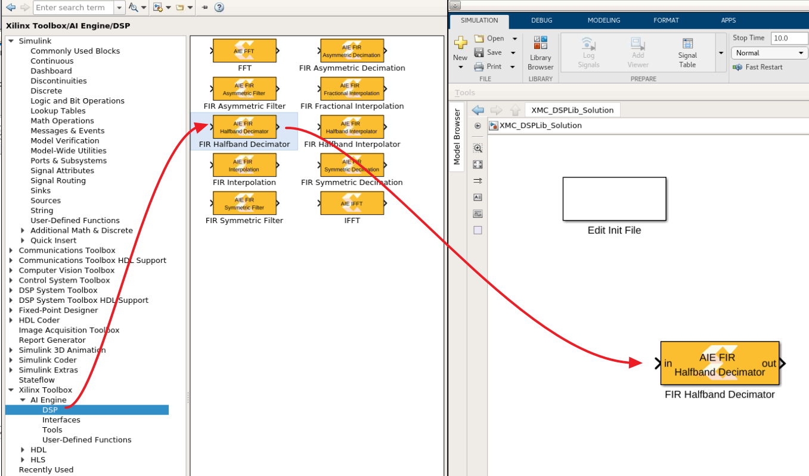
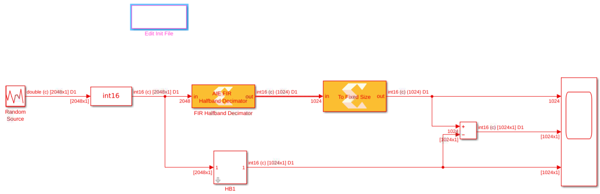
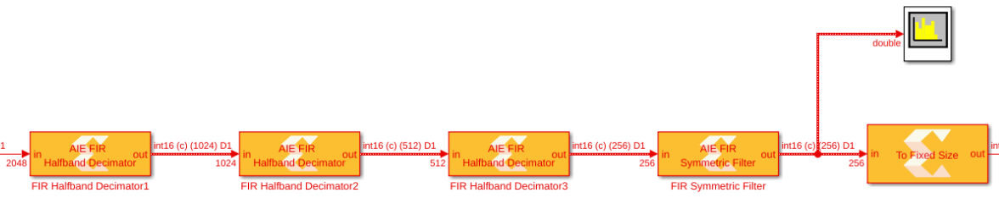
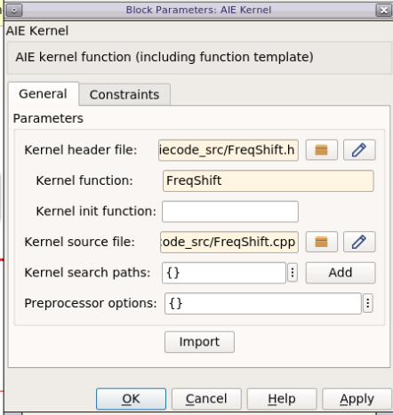
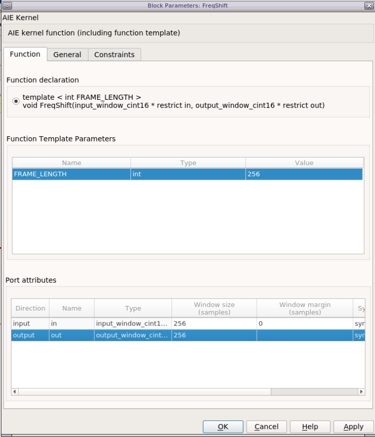

<table>
 <tr>
   <td align="center">
   <h1>Designing with the AI Engine DSPLib and Model Composer</h1>
   </td>
 </tr>
</table>

# Introduction

The purpose of this tutorial is to provide hands-on experience for designing AI Engine applications using Model Composer. This tool is a set of blocksets for Simulink that makes it easy to develop applications for Xilinx devices, integrating RTL/HLS blocks for the Programmable Logic, as well as AI Engine blocks for the AI Engine array.
Model Composer can be used to create complex systems targeting the PL (RTL and HLS blocksets) and the AI Engine array (AIE blockset) at the same time. The complete system can be simulated in Simulink, and the code generated (RTL for the PL and C++ graph for the AI Engine array).


# Before You Begin

See [Model Composer and SystemGenerator User Guide (UG1483)](https://www.xilinx.com/support/documentation/sw_manuals/xilinx2020_2/ug1483-model-composer-sys-gen-user-guide.pdf) and verify that a supported OS is being used.

* Windows 10 Pro and Enterprise: 10.0 1809 Update; 10.0 1903 Update; 10.0 1909 Update;10.0 2004 Update
* Red Hat Enterprise Workstation/Server 7: 7.4 (MATLAB R2019b only); 7.5; 7.6; 7.7; 7.8
* Ubuntu Linux: 16.04.5 LTS; 16.04.6 LTS; 18.04.1 LTS; 18.04.2 LTS; 18.04.3 LTS; 18.04.4

Install the tools:

* Get and install [MATLAB and Simulink 2019b or 2020a](https://www.mathworks.com/products/get-matlab.html?s_tid=gn_getml).
  - Do not forget to also install the DSP System Toolbox (necessary for this tutorial).
* Get and install [Xilinx Vitis 2020.2](https://www.xilinx.com/support/download.html).


# Overview

 The goal of this tutorial is to implement the Decimation Filter Chain depicted below:


1. Move to the location of this directory `cd ${PATH_TO}/10-aie-dsp-lib-model-composer`
2. Setup the environment by typing `source ${PATH_TO_MODEL_COMPOSER}/settings64.sh` on a terminal.
3. Open MATLAB by typing `xmc_sysgen` on a terminal. The path to the various Model Composer blocksets are automatically added.
4. Initialize the tutorial environment by typing `setupLab` at the **MATLAB** command prompt.

This script includes the directory ``LabUtils`` in the search path and runs the `CreateFilter` script to initialize the filter coefficients. The output in the MATLAB command window is:

```
>> setupLab
HB1
  Center Tap: 16384
Phase 1 Norm: 16384
 Max Phase 1: 9647

HB2
  Center Tap: 16384
Phase 1 Norm: 16384
 Max Phase 1: 9935

HB3
  Center Tap: 16384
Phase 1 Norm: 16384
 Max Phase 1: 10373

CF
Channel Filter Norm: 32768
           Max Coef: 28004

>>
```

The variables created by the `CreateFilter` script may be examined in the workspace window:
- ``hb1``, ``hb2``, ``hb3``, ``cfi``: Coefficients of the filters which are used in the Simulink model.
- ``hb1_aie``, ``hb2_aie``, ``hb3_aie``, ``cfi_aie``: Coefficients vectors which are used in the AI Engine design:
  - For half-band filters, this vector contains only the left-hand side non-null taps including the centre tap.
  - For symmetric filters, this vector contains only the left-hand side taps, including the center tap if the filter length is odd.
- Shift1, Shift2, Shift3, ShiftCF: The number of bits by which the result has to be shifted before the result is sent to the ouput port.


# Stage 1: Create and Simulate the Design

1. On the MATLAB GUI, select the **Home Tab** and click **Simulink**.


2. Select **Blank Model** to create a new canvas on which to design the Decimation Chain.


Perform the next two steps to enhance the User Experience. This allows you to have an instant access to the initialization file and to automatically call it when opening the design or when you update it.

3. Right-click in the canvas and select **Model Properties**:
    - Click the **Callbacks** tab.
    - Click **PreLoadFcn** and type `setupLab;` in the edit window on the right. This will automatically run the `setupLab` script when the model is opened.
    - Click **Apply**, then **OK**.


4. Click on the canvas and type `subsys`. Select the first **Subsystem** displayed in the list (Subsystem, Simulink/Ports & Subsystems).


   - Double-click the new block and remove all blocks inside (**CTRL-A** and **Del**).
   - Go back to the top level by clicking on the Up-arrow.
   


  - Right-click the **Subsystem** and select **Properties**.
  - Click the **Callbacks** tab.
  - Select **OpenFcn** in the **Callback function list**.
  - Type `open('CreateFilter.m');` in the edit window on the right.
  - Click **Apply**, then **OK**.

Double-clicking on this block will open the initialization script (_CreateFilter.m_) in the MATLAB editor. Save the model **CTRL+S** with the name **XMC_DSPLib**.

5. In the Simulink window, click on the **Library Browser** icon.


Near the end of the list of the Library Browser, you will find the **Xilinx Toolbox**. This contains three sub-libraries:
- AI Engine
- HDL
- HLS

Click the **AI Engine** section. This reveals see four subsections:

- DSP
- Interfaces
- Tools
- User-Defined functions

6. Click the **DSP** sub-section and drag-and-drop  the **AIE FIR Filter** block in the canvas as shown in the following figure.




7. Double-click on the **AIE FIR Filter** block to open the GUI. Populate the GUI with the following parameters and click **OK**:
    - **Filter type**: Halfband Decimator
    - **Filter length**: length(hb1)
    - **Filter coefficients**: hb1_aie
    - **Filter coefficients data type**: int16
    - **Input/output data type**: cint16
    - **Input Window size (Number of samples)**: 2048
    - **Input sampling rate (MSPS)**: 1000
    - **Scale output down by 2^: Shift1
    - **Rounding mode**: Floor


Now create a signal source to feed this filter.

8. Create the following two blocks by double-clicking on the canvas and typing the beginning of the name of the block. Double-click on the block to set the parameters:

| Name to Type | Block Name to Select | Parameters |
| :--- | :--- | :--- |
| random   | Random Source  |  Source Type: Uniform <br> Minimum: -30000  <br> Maximum: 30000  <br>  Sample time: 1   <br> Samples per frame: 2048   <br> Complexity: complex|
| cast  | Cast  | Output data type: int16  |

9. Cascade the three blocks: **Random Source**, **Cast**, **AIE FIR Filter**.

10. The file ``ReferenceChain.slx`` contains the decimation chain using Simulink blocks. **Open** the file **ReferenceChain.slx**. Copy the block **HB1** over to your design.
11. Copy the small set of blocks (**To Fixed Size**, **Subtract**, **Scope**) to create the following design:


12. Ensure that the parameter **Output Size** of the block **To Fixed Size** is set to 1024.

13. Set the simulation **Stop Time** to ``5000``, save, then run the simulation by clicking on the **Run** icon. The FIR filter is compiled and the design is run. The scope should show a completely null difference. If the scope plot is not shown, double-click on the scope block. The top plot shows the result of the AIE FIR filter; the middle plot shows the difference; and the bottom plot shows the result of the native Simulink block. The plots will show 2 colors: one for the real part, and another for the imaginary part.

14. To gain more information about the signals traveling through the wires, update the following display parameters:
    - Right-click the canvas and select **Other Displays --> Signals and Ports --> Signal Dimensions**.
    - Right-click the canvas and select **Other Displays --> Signals and Ports --> Port Data Types**.
    - Right-click the canvas and select **Sample Time Display --> all**.

After updating the design with **CTRL-D**, the display should look as follows:



Notice that the vector length before the Decimation Filters was ``2048``, but reduced to ``1024`` at the output.

15. Update the design with the other three filters using the following parameters:


| Parameter |HB1 |	HB2	| HB3	| Channel Filter |
| :--- | :--- |  :--- | :--- | :--- |
| Filter Type	| HalfBand Decimator	| HalfBand Decimator	| HalfBand Decimator	| Single Rate Filter |
| Symmetric Filter	| N/A	| N/A | 	N/A	| Check |
| Filter Length	| length(hb1)	| length(hb2)	| length(hb3)	| length(cfi) |
| Filter Coefficients	| hb1_aie	| hb2_aie	| hb3_aie	| cfi_aie |
| Filter Coefficients Data Type	| int16	| int16	| int16	| int16 |
| Input Output data type	| cint16	| cint16	| cint16	| cint16 |
| Input window size (Number of samples)	| 2048	| 1024	| 512	| 256 |
| Input sampling rate (MSPS)	| 1000	| 500	| 250	| 125 |
| Number of Cascade stages	| N/A	| N/A	| N/A	| 1 |
| Scale output down by 2^	| Shift1	| Shift2	| Shift3	| ShiftCF |
| Rounding mode	floor	| floor	| floor	| floor | floor |

16. Update the **Output Size** parameter of the **To Fixed Size** block to ``256``. The design should look like as follows:


17. Run the design. The added filters are compiled and the design is run through the 5000 samples. The difference between the output should still be 0.


# Stage 2: Further Analysis of the Design

When creating a DSP design, one important characteristic to consider is the power spectrum. In Simulink the spectrum can be easily displayed using a spectrum analyzer.

1. Double-click on the canvas and type ``spectrum``. Select **Spectrum Analyzer**. Double-click on the spectrum analyzer block and set the following parameters (click the left-most button of the icon bar to display the Spectrum Settings GUI).
    - **Overlap**: 50%
    - **Average**: 16
2. Set the Stop Time of the simulation to **inf**.
3. Connect the spectrum scope at the output of the last filter (the Channel Filter):



Run the simulation. The spectrum scope should display similar to the following:


Now add a block coming from a standard templated C++ kernel which source is in the directory ``aiecode_src``. This function will be a frequency shift operation that will be placed after the downsampling chain.

4. Select the block from the **User-defined Functions** section of the AI Engine Library and place it in the canvas:


5. **Double-click** the block, a GUI will display. Populate it with the following data:
- **Kernel header file**: ``aiecode_src / FreqShift.h``
- **Kernel function**: ``FreqShift``
- **Kernel source file**: ``aiecode_src / FreqShift.cpp``



6. Click **Import**. A new GUI displays. **FRAME_LENGTH** is the template parameter. Its value is ``256`` because at this stage this is the size of the data frames. The input and output ports have also the same size: ``256`` samples. Click **OK**.



7. Place this new block between the **'AIE FIR Channel'** and **'To Fixed Size'** blocks. Grab the **'FreqShift'** block from the **Reference Chain** Simulink design and place it after the **ChannelFilter** Simulink block. Your design should now look as follows:


8. Click **Run**. The new filter will get compiled and a new spectrum will be displayed:


9. Switch the **Stop Time** back to ``5000``, rerun the simulation and verify that the difference is still 0.

Developing an AI Engine graph in Model Composer is relatively straightforward. What you have learned here is that you can easily place a spectrum analyzer within the design at the output of a block, but actually it could be placed anywhere in between two blocks without modifying anything in the kernels or the graph. Furthermore, Simulink has a many blocks that can be used to generate test vectors, create a reference model, and compare the signals at any point in the design.

If you want to save some data in a workspace variable for some more complex analysis. This can be done using the **Variable Size Signal** to Workspace block within the **Xilinx Toolbox --> AI Engine --> Tools  blockset**:


All the simulations that occur in Simulink use the 'Emulation-SW' mode. This mode is bit-exact, but they do not provide any information about timing.

# Stage 3: Generate the Code and Perform Emulation-AI Engine

In this stage you will generate the graph code of this design and perform bit-true and cycle-accurate simulations with the AI Engine Simulator.

1. Select the four AIE FIR Filters and the Frequency shifting block and type **CTRL+G** to group them in a subsystem. Assign a new name: **FIRchain**.
2. Double-click on the canvas and type ``model co``. Select the block **Model Composer Hub** and set the following parameters:
    - **Subsystem name**: ``FIRchain``
    - Check **Create testbench**
    - Check **Run cycle-accurate SystemC simulator**
    - Check **Launch Vitis Analyzer**
3. Click **Apply**, then **Generate and Run**.

The simulink design is run to generate the testbench, then the graph code is generated and compiled. The source code can be viewed in ``./code/src_aie/FIRchain.h``:

```C++
#ifndef __XMC_FIRCHAIN_H__
#define __XMC_FIRCHAIN_H__

#include <adf.h>
#include "./AIE_FIR_Filter_ddde/AIE_FIR_Filter_ddde.h"
#include "./AIE_FIR_Filter2_8ddc/AIE_FIR_Filter2_8ddc.h"
#include "./AIE_FIR_Filter3_4d1d/AIE_FIR_Filter3_4d1d.h"
#include "./AIE_FIR_Channel_4f5d/AIE_FIR_Channel_4f5d.h"
#include "aiecode_src/FreqShift.h"

class FIRchain : public adf::graph {
private:
   AIE_FIR_Filter_ddde AIE_FIR_Filter;
   AIE_FIR_Filter2_8ddc AIE_FIR_Filter2;
   AIE_FIR_Filter3_4d1d AIE_FIR_Filter3;
   AIE_FIR_Channel_4f5d AIE_FIR_Channel;
   adf::kernel AIE_Template_Kernel;

public:
   adf::input_port In1;
   adf::output_port Out1;

   FIRchain() {
      // create kernel AIE_Template_Kernel
      AIE_Template_Kernel = adf::kernel::create(FreqShift<256>);
      adf::source(AIE_Template_Kernel) = "aiecode_src/FreqShift.cpp";
      adf::runtime<ratio>(AIE_Template_Kernel) = 0.9;

      // create nets to specify connections
      adf::connect<  > net0 (In1, AIE_FIR_Filter.in);
      adf::connect<  > net1 (AIE_FIR_Filter.out, AIE_FIR_Filter2.in);
      adf::connect<  > net2 (AIE_FIR_Filter2.out, AIE_FIR_Filter3.in);
      adf::connect<  > net3 (AIE_FIR_Filter3.out, AIE_FIR_Channel.in);
      adf::connect< adf::window<1024> > net4 (AIE_FIR_Channel.out, AIE_Template_Kernel.in[0]);
      adf::connect< adf::window<1024> > net5 (AIE_Template_Kernel.out[0], Out1);
   }
};

#endif // __XMC_FIRCHAIN_H__
```

Finally, the bit-exact simulation (Emulation-AIE) is performed and the result compared to the Simulink simulation:


Vitis Analyzer is then launched. From here you can see the **Graph View**, the **Array View**, the **Timeline**, and the **Profile** information. Vitis Analyzer may also be launched manually from the terminal:

```
$ cd code
$ vitis_analyzer ./system.wdb ./data/aiesimulator_output/default.aierun_summary
```


# Conclusion

Model Composer is a very efficient way to create graphs either using your own kernels or using the DSPLib FIR Filter (other blocks will be available in subsequent releases).

This tool shows its incredible flexibility when it comes to displaying signal spectrum or saving data at any stage of the graph. All the source and sink blocks can be used anywhere, allowing you to efficiently debug your design in all corner cases.

---

&copy; Copyright 2021 Xilinx, Inc.

Licensed under the Apache License, Version 2.0 (the "License");
you may not use this file except in compliance with the License.
You may obtain a copy of the License at

```
    http://www.apache.org/licenses/LICENSE-2.0
```

Unless required by applicable law or agreed to in writing, software
distributed under the License is distributed on an "AS IS" BASIS,
WITHOUT WARRANTIES OR CONDITIONS OF ANY KIND, either express or implied.
See the License for the specific language governing permissions and
limitations under the License.

<p align="center"><sup>XD058 | &copy; Copyright 2021 Xilinx, Inc.</sup></p>
