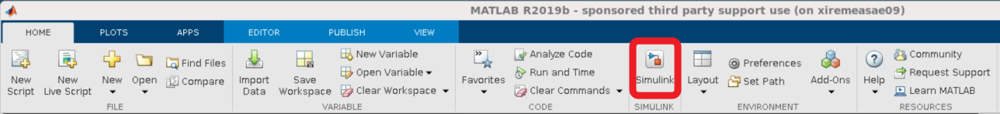
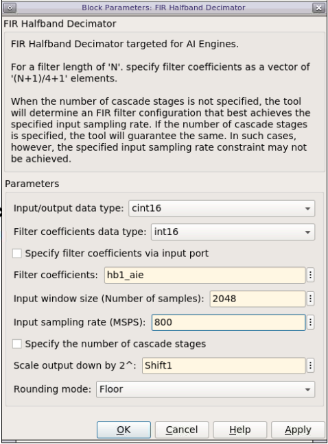
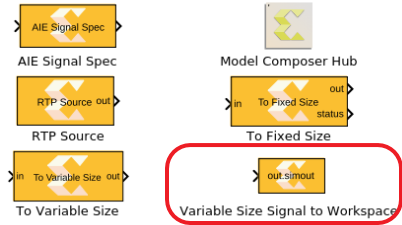
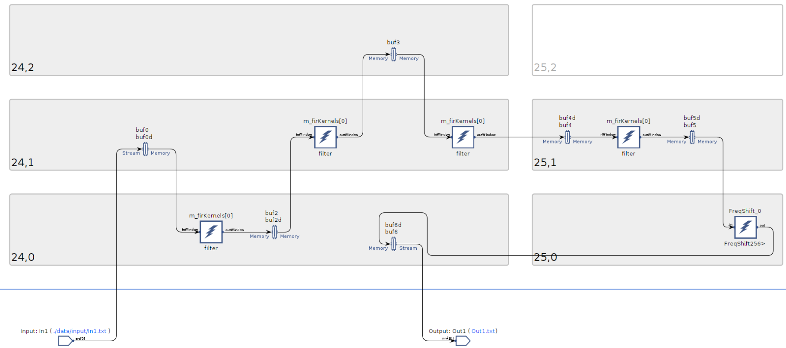
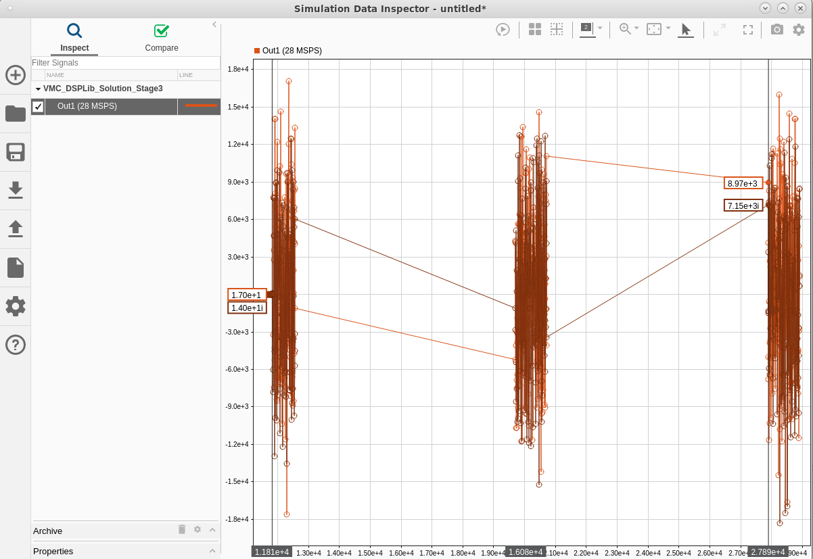
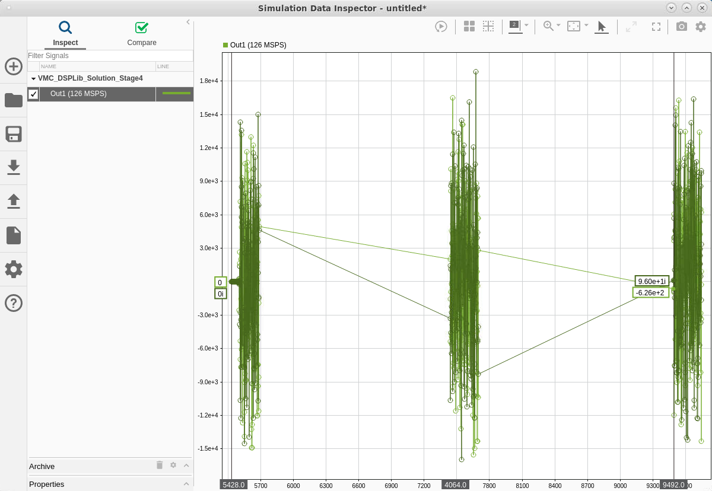

<table class="sphinxhide" width="100%">
 <tr width="100%">
    <td align="center"><h1>AI Engine Development</h1>
    <a href="https://www.xilinx.com/products/design-tools/vitis.html">See Vitis™ Development Environment on xilinx.com</br></a>
    <a href="https://www.xilinx.com/products/design-tools/vitis/vitis-ai.html">See Vitis™ AI Development Environment on xilinx.com</a>
    </td>
 </tr>
</table>

# Designing with the AI Engine DSPLib and Vitis Model Composer

***Version: Vitis 2023.1***

## Introduction

The purpose of this tutorial is to provide hands-on experience for designing AI Engine applications using Model Composer. This tool is a set of blocksets for Simulink that makes it easy to develop applications for AMD devices, integrating RTL/HLS blocks for the programmable logic (PL), as well as AI Engine blocks for the AI Engine array. Vitis Model Composer can be used to create complex systems targeting the PL (RTL and HLS blocksets) and the AI Engine array (AIE blockset) at the same time. The complete system can be simulated in Simulink, and the code generated (RTL for the PL and C++ graph for the AI Engine array).

## Before You Begin

Install the tools:

* Get and install [MATLAB and Simulink 2021a or 2021b](https://www.mathworks.com/products/get-matlab.html?s_tid=gn_getml).
  * Do not forget to also install the DSP System Toolbox (necessary for this tutorial).
* Get and install [AMD Vitis 2023.1](https://www.xilinx.com/support/download.html).

>**IMPORTANT**: Before beginning the tutorial, make sure you have read and followed the *Vitis Software Platform Release Notes* (v2023.1) for setting up software and installing the VCK190 base platform.

## Overview

 The goal of this tutorial is to implement the Decimation Filter Chain depicted in the following figure:


1. Open MATLAB by typing `model_composer`. The path to the various blocksets of Model Composer are automatically added.
2. In order to initialize the tutorial environment, type `setupLab` in the **MATLAB** command window.

This function includes the directory ``LabUtils`` in the search path, and runs the filter coefficients initialization. The output in the MATLAB command window is:

```
>> setupLab
HB1
  Center Tap: 16384
Phase 1 Norm: 16384
 Max Phase 1: 9647

HB2
  Center Tap: 16384
Phase 1 Norm: 16384
 Max Phase 1: 9935

HB3
  Center Tap: 16384
Phase 1 Norm: 16384
 Max Phase 1: 10373

CF
Channel Filter Norm: 32768
           Max Coef: 28004

>>
```

In the workspace sub-window, you can see that a number of variables that are defined:

* ``hb1``, ``hb2``, ``hb3``, ``cfi``: Coefficients of the filters which are used in the Simulink model.
* ``hb1_aie``, ``hb2_aie``, ``hb3_aie``, ``cfi_aie``: Coefficients vectors which are used in the AI Engine design:
  * For half-band filters, this vector contains only the lefthand side non-null taps including the centre tap.
  * For symmetric filters, this vector contains only the lefthand side taps, including the center tap if the filter length is odd.
* Shift1, Shift2, Shift3, ShiftCF: The number of bits bits by which the result has to be shifted before the result is sent to the ouput port.


There are 4 additional files:

* `VMC_DSPLib_Solution_Stage1.slx`
* `VMC_DSPLib_Solution_Stage2.slx`
* `VMC_DSPLib_Solution_Stage3.slx`
* `VMC_DSPLib_Solution_Stage4.slx`

These are there to help you if you cannot complete any of the four stages.

## Stage 1: Create and Simulate the Design

1. On the MATLAB GUI, select the **Home Tab**, and click **Simulink**.

      

2. Select **Blank Model** to create a new canvas on which to design the Decimation Chain.

      

      Perform the next two steps to enhance the User Experience. This allows you to have an instant access to the initialization file and to automatically call it when opening the design or when you update it.

3. Right-click in the canvas, and select **Model Properties**:
    * Click the **Callbacks** tab.
    * Click **PreLoadFcn**, and type `CreateFilter;` in the edit window on the right.
    * Click **InitFcn**, and type `CreateFilter;` in the edit window on the right.
    * Click **Apply**.

      

4. Click on the canvas, and type `subsys`. Select the first **Subsystem** displayed in the list (Subsystem, Simulink/Ports & Subsystem).

   

   * Double-click the new block, and remove all blocks inside (**CTRL-A** and **Del**).
   * Go back to the top level by clicking on the Up-arrow.

   

   * Right-click the **Subsystem**, and select **Properties**.
   * Click the **Callbacks** tab.
   * Select **OpenFcn** in the **Callback function list**.
   * Type `open('CreateFilter.m');` in the edit window on the right.
   * Click **Apply** and **OK**.

   Now when you double-click this block, you will open the initialization matlab function (`CreateFilter.m`) in the MATLAB editor. Save the model **CTRL+S**, and assign the name **VMC_DSPLib**.

5. Click the **Library Browser** icon.

   

   In the list of libraries, you will find the **AMD Toolbox**. This contains four sub-libraries:

   * AI Engine
   * HDL
   * HLS
   * Utilities

   Click the **AI Engine** section. This reveals seven subsections:

   * DSP
   * Interfaces
   * Signal Routing
   * Sinks
   * Sources
   * Tools
   * User-Defined functions

6. Click the **DSP** sub-section. There are two sub-menu entries:

   - Buffer IO: which contains filter implementations using frame-based input and output.
   - Stream IO : which contains filter implementations using streaming input and output.

7. Click the **Buffer IO** sub-section and place the **FIR Halfband Decimator** block in the canvas as shown in the following figure.

   

8. Double-click the **FIR Halfband Decimator** block to open the GUI. Populate the GUI with the following parameters :
    * **Input/output data type**: cint16
    * **Filter coefficients data type**: int16
    * **Filter coefficients**: hb1_aie
    * **Input Window size (Number of samples)**: 2048
    * **Scale output down by 2**: Shift1
    * **Rounding mode**: Floor

    Click **Apply** and **OK**.

   

   Now create a data source to feed this filter.

9. Create the following two blocks by clicking the canvas and typing the beginning of the name of the block. Then enter the given parameters:

   | Name to Type | Block Name to Select | Parameters |
   | :--- | :--- | :--- |
   | random   | Random Source  |  Source Type: Uniform <br> Minimum: -30000  <br> Maximum: 30000  <br>  Sample time: 1   <br> Samples per frame: 2048   <br> Complexity: complex|
   | cast  | Cast  | Output data type: int16  |

10. Cascade the three blocks: **Random Source**, **Cast**, **AIE FIR Filter**.

11. The file ``ReferenceChain.slx`` contains the decimation chain using Simulink blocks. **Open** `ReferenceChain.slx`. Copy the block **HB1** over to your design.
12. Copy the small set of blocks (**To Fixed Size**, **Subtract**, **Scope**) to create the following design:

      

13. Ensure that the parameter **Output Size** of the block **To Fixed Size** is set to 1024.

14. Set the **Stop Time** to ``5000``, and run the design. The FIR filter is compiled and the design is run. The scope should show a completely null difference.

15. To gain more information about the signals traveling through the wires, update the following display parameters:
    * Right-click the canvas, and select **Other Displays --> Signals and Ports --> Signal Dimensions**.
    * Right-click the canvas, and select **Other Displays --> Signals and Ports --> Port Data Types**.
    * Right-click the canvas, and select **Sample Time Display --> all**.

      After updating the design with **CTRL-D**, the display should look as follows:

      

      Notice that before the implementing the Decimation Filter the vector length was ``2048``, but after implementation this was reduced to ``1024``.

16. Update the design with the other three filters using the following parameters:

      | Parameter |HB1 |	HB2	| HB3	| Channel Filter |
      | :--- | :--- |  :--- | :--- | :--- |
      | Filter Block	| FIR Halfband Decimator | FIR Halfband Decimator	| FIR Halfband Decimator	| FIR Symmetric Filter |
      | Input Output data type	| cint16	| cint16	| cint16	| cint16 |
      | Filter Coefficients Data Type	| int16	| int16	| int16	| int16 |
      | Filter Coefficients	| hb1_aie	| hb2_aie	| hb3_aie	| cfi_aie |
      | Filter Length	| N/A | N/A	| N/A | length(cfi) |
      | Input window size (Number of samples)	| 2048	| 1024	| 512	| 256 |
      | Scale output down by 2^	| Shift1	| Shift2	| Shift3	| ShiftCF |
      | Rounding mode	floor	| floor	| floor	| floor | floor |

17. Update the **Output Size** parameter of the **To Fixed Size** block to ``256``. The design should display like as follows:

      

18. Run the design. The added filters are compiled, and the design is run through the 5000 samples. The difference between the output should still be 0.

## Stage 2: Further Analysis of the Design

When creating a DSP design, one of the most important parameters to consider is the spectrum. In Simulink, the spectrum can be easily displayed using a spectrum scope.

1. Left-click the canvas and type ``spectrum``.
2. Connect the spectrum scope at the output of the last filter (the Channel Filter):
3. Set the Stop Time of the simulation to **inf**.

   

   Run the simulation. The spectrum scope should display similar to the following:

   


   Now add a block coming from a standard templated C++ kernel which source is in the directory ``aiecode_src``. This function will be a frequency shift operation that will be placed after the downsampling chain.

4. Select the block **AIE Kernel** from the **User-defined Functions** section of the AI Engine Library and place it in the canvas:

   

5. **Double-click** the block; a GUI will display. Populate it with the following data:

   * **Kernel header file**: ``aiecode_src/FreqShift.h``
   * **Kernel function**: ``FreqShift``
   * **Kernel source file**: ``aiecode_src/FreqShift.cpp``

      

6. Click **Import**. A new GUI displays. **FRAME_LENGTH** is the template parameter. Its value is ``256`` because at this stage this is the size of the data frames. The input and output ports have also the same size: ``256`` samples. Click **OK**.

   

7. Place this new block between the **'AIE FIR Channel'** and **'To Fixed Size'** blocks. Grab the **'FreqShift'** block from the **Reference Chain** Simulink design, and place it after the **ChannelFilter** Simulink block. Your design should now look as follows:

   

8. Click **Run**. The new filter will get compiled and a new spectrum will be displayed:

   

9. Switch the **Stop Time** back to ``5000`` and verify that the difference is still 0.

   Developing an AI Engine graph in Model Composer is relatively straightforward. What you have learned here is that you can easily place a spectrum scope within the design at the output of a design, but actually it could be placed anywhere in between two blocks without modifying anything in the kernels and the graph. Furthermore, Simulink has a lot of specific blocksets that can be used to generate test vectors, create a reference model, and compare the signals at any point in the design.

   If you want to save some data in a workspace variable for some more complex analysis. This can be done using the **Variable Size Signal** to Workspace block within the **AMD Toolbox --> AI Engine --> Tools  blockset**:

   

   All the simulations that occur in Simulink are the so-called 'Emulation-SW'. These types of simulation are bit-exact, but they do not provide any information about timing.

## Stage 3: Generate the Code and Perform Emulation-AI Engine

In this stage, you will generate the graph code of this design and perform bit-true and cycle true simulations with the AI Engine Simulator.

1. Select the four AIE FIR Filters and the Frequency shifting block, and type **CTRL+G** to group them in a subsystem. Assign a new name: **FIRchain**.
2. Click the canvas, and type ``model co``. Select the **Vitis Model Composer Hub** block.
3. Double-click the block **Model Composer Hub**, select the **FIRchain** subsystem, and set the following parameters on the **AIE Settings** tab:
    * Check **Create testbench**.
    * Check **Run cycle approximate AIE Simulation after code generation**.
    * Check **Plot AIE Simulation Output and Estimate Throughput**.
    * Check **Collect Data for Vitis Analyzer**.
4. Click **Apply**.
5. Click **Generate**.

The Simulink design is run to generate the testbench, then the graph code is generated and compiled. The source code can be viewed in ``./code/src_aie/FIRchain.h``:

```C++
#ifndef __XMC_FIRCHAIN_H__
#define __XMC_FIRCHAIN_H__

#include <adf.h>
#include "./FIR_Halfband_Decimator_b6bb9f39/FIR_Halfband_Decimator_b6bb9f39.h"
#include "./FIR_Halfband_Decimator_c797d059/FIR_Halfband_Decimator_c797d059.h"
#include "./FIR_Halfband_Decimator_714ce49a/FIR_Halfband_Decimator_714ce49a.h"
#include "./FIR_Symmetric_00c44acd/FIR_Symmetric_00c44acd.h"
#include "aiecode_src/FreqShift.h"

class FIRchain_base : public adf::graph {
public:
   FIR_Halfband_Decimator_b6bb9f39 FIR_Halfband_Decimator;
   FIR_Halfband_Decimator_c797d059 FIR_Halfband_Decimator1;
   FIR_Halfband_Decimator_714ce49a FIR_Halfband_Decimator2;
   FIR_Symmetric_00c44acd FIR_Symmetric;
   adf::kernel FreqShift_0;

public:
   adf::input_port In1;
   adf::output_port Out1;

   FIRchain_base() {
      // create kernel FreqShift_0
      FreqShift_0 = adf::kernel::create(FreqShift<256>);
      adf::source(FreqShift_0) = "aiecode_src/FreqShift.cpp";

      // create kernel constraints FreqShift_0
      adf::runtime<ratio>( FreqShift_0 ) = 0.9;

      // create nets to specify connections
      adf::connect<  > net0 (In1, FIR_Halfband_Decimator.in);
      adf::connect<  > net1 (FIR_Halfband_Decimator.out, FIR_Halfband_Decimator1.in);
      adf::connect<  > net2 (FIR_Halfband_Decimator1.out, FIR_Halfband_Decimator2.in);
      adf::connect<  > net3 (FIR_Halfband_Decimator2.out, FIR_Symmetric.in);
      adf::connect< adf::window<1024> > net4 (FIR_Symmetric.out, FreqShift_0.in[0]);
      adf::connect< adf::window<1024> > net5 (FreqShift_0.out[0], Out1);
   }
};

class FIRchain : public adf::graph {
public:
   FIRchain_base mygraph;

public:
   adf::input_plio In1;
   adf::output_plio Out1;

   FIRchain() {
      In1 = adf::input_plio::create("In1",
            adf::plio_32_bits,
            "./data/input/In1.txt");

      Out1 = adf::output_plio::create("Out1",
            adf::plio_32_bits,
            "Out1.txt");

      adf::connect< > (In1.out[0], mygraph.In1);
      adf::connect< > (mygraph.Out1, Out1.in[0]);
   }
};

#endif // __XMC_FIRCHAIN_H__
```

Finally, the bit-exact simulation (Emulation-AIE) is performed and the result compared to the Simulink simulation:


Vitis Analyzer is then launched. From here you can see the **Graph View**, the **Array View**, the **Timeline**, and the **Profile** information.




The Simulation Data Inspector opens and shows the output of the AI Engine. The AI Engine's throughput is calculated by counting the number of output data points and dividing by the time. In this case, three frames are received, but only two interframe idle time are taken into account. To obtain a more accurate throughput estimate, you can use data cursors to select a specific time region over which to calculate throughput:

1. Select the `Out1` signal from the list on the left.
2. Right-click on the plot, and select **Data Cursors**->**Two**.
3. Position the cursors at the beginning of the first and third signal frames, as shown below. 

   

Here the estimated throughput is 28 MSPS instead of the expected 125 MSPS. You can use Vitis Analyzer to track the reason of this throughput reduction. Here it is very easy to see that the input stream feeds the data @250 MSPS instead of the 1000 MSPS that were expected in the design. The reason is that the input bitwidth is 32 bits at a rate of 250MHz (default value) as can be seen at the end of the FIRchain.h file.

## Stage 4: Increasing the PLIO Bitwidth and Re-generate

Solving this problem is fairly easy. Navigate inside the **FIRchain** sub-system. Get the **PLIO** block from **AMD Toolbox / AI Engine / Interface**, or just type **plio** in the canvas. Double-click on the new block and specify:

* **PLIO width (bits)**: 128
* Check **Specify PLIO frequency**
* **PLIO frequency (MHz)** : 250

Click **OK**. Place the block just after the input port, and a copy of this block just before the output port:


Re-open the **Model Composer Hub** block, and click **Generate** to re-compile and re-simulate the design.

After the AI Engine simulation, the estimated throughput is 126 MSPS. This is computed from the following timestamped (green) output data, calculated for two full frame periods:



This gives around 125 MSPS which is 1/8th of the input sample rate (1 GSPS). This means that the design meets specification.

## Conclusion

Model Composer is a very efficient way to create graphs either using your own kernels or using the DSPLib FIR Filter (other blocks will be available in subsequent releases).

This tool shows its incredible flexibility when it comes to display spectrum or save data at any stage of the graph. All the source and sink blocks can be used anywhere, allowing you to efficiently debug your design in all corner cases.

<p class="sphinxhide" align="center"><sub>Copyright © 2020–2023 Advanced Micro Devices, Inc</sub></p>

<p class="sphinxhide" align="center"><sup><a href="https://www.amd.com/en/corporate/copyright">Terms and Conditions</a></sup></p>
