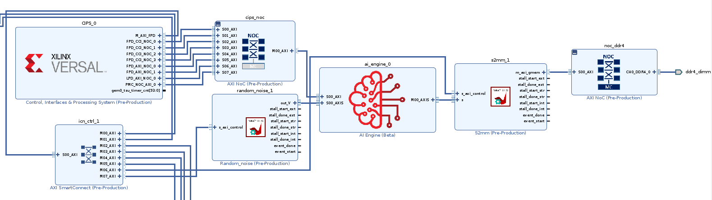
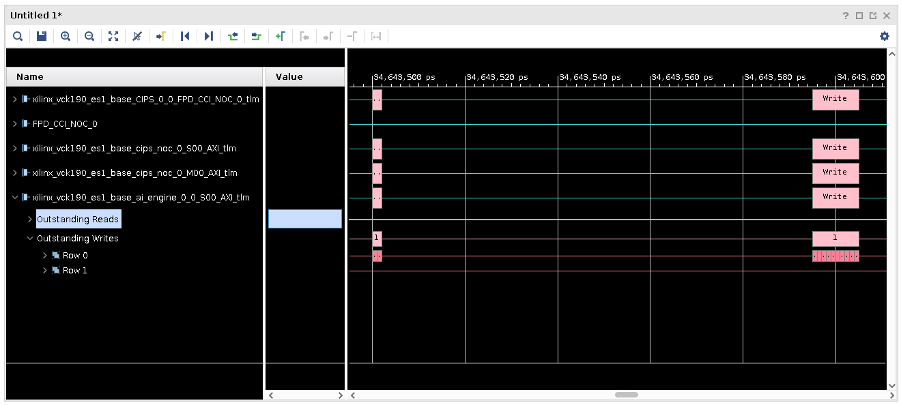
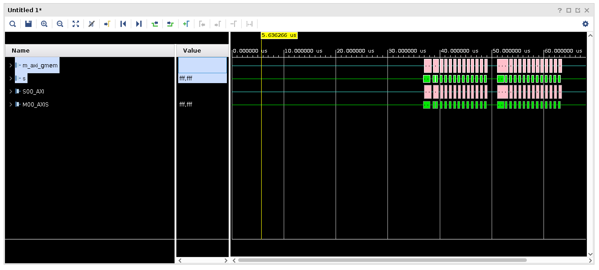
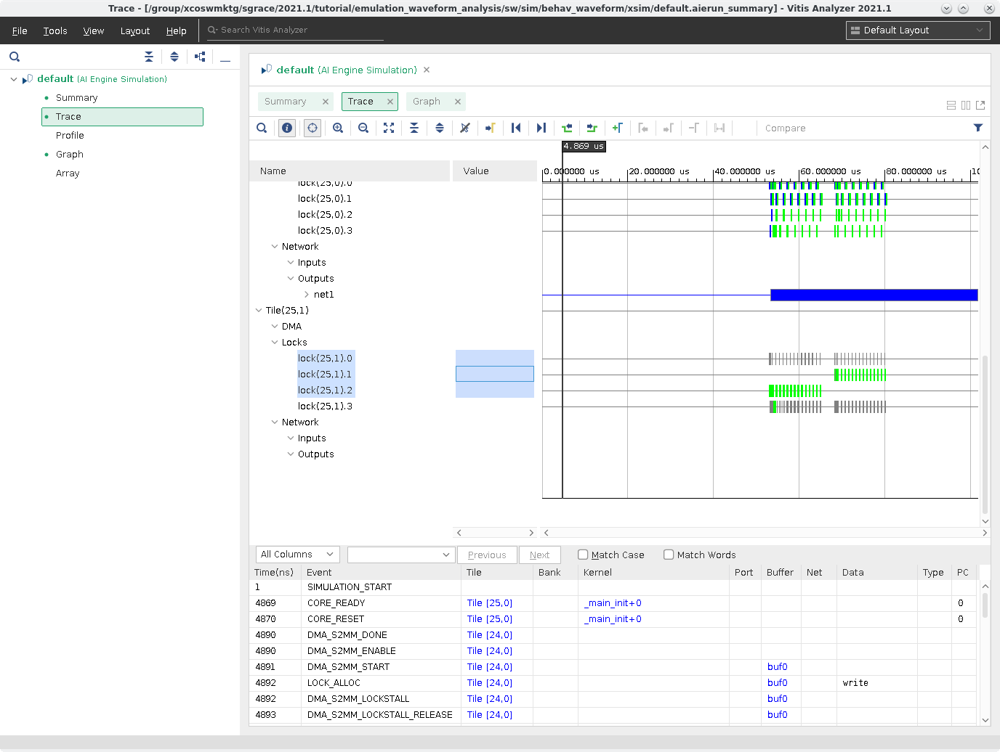

<table>
 <tr>
   <td align="center"><h1>AI Engine Versal Emulation Waveform Analysis</h1>
   </td>
 </tr>
 <tr>
 </td>
 </tr>
</table>

# Introduction
Simulating a complete system in Vitis allows for a near-hardware run of a design without the hardware, and has added benefit of detailed waveform analysis during hardware emulation to identify issues in the programmable logic, AI Engine interfaces, and memory read/writes that could be harder to figure out on hardware.

This tutorial will demonstrate how you can use XSIM waveform GUI, and Vitis Analyzer to debug and analyze your design for a Versal ACAP device. It will step through the process of building a design for hardware emulation, launching emulation with waveform viewing, and detailed information on how to read the waveforms, as well as, using Vitis Analyzer to continue the analysis with generated trace output waveforms and data. 
 
It is strongly recommended to go through the **Versal Integration Tutorial** and the **Advanced Versal Clocking Tutorial** before running this tutorial.

**IMPORTANT**: Before beginning the tutorial make sure you have read and followed the *Vitis Software Platform Release Notes* (v2021.1) for setting up software and installing the VCK190 base platform. 

Before starting this tutorial run the steps below:

1. Set up your platform by running the `xilinx-versal-common-v2021.1/environment-setup-aarch64-xilinx-linux` script as provided in the platform download. This script sets up the `SDKTARGETSYSROOT` and `CXX` variables. If the script is not present, you **must** run the `xilinx-versal-common-v2021.1/sdk.sh`.
2. Set up your `ROOTFS`, and `IMAGE` to point to the `xilinx-versal-common-v2021.1` directory.
3. Set up your `PLATFORM_REPO_PATHS` environment variable based upon where you downloaded the platform.

# Objectives
After completing this tutorial you should be able to:
* Use XSIM as a live waveform viewer to view signals to and from the AI Engine including stream data and RTP (Runtime Parameter)
* Read/understand Transaction Level Modeling (TLM) information in a waveform
* Utilize Vitis Analyzer to read trace and profile data
# Tutorial Overview

## Design Overview
The design is a simple FIR filter that will take in random noise generated by the programmable logic (PL) kernel **random_noise**, and have Run Time Parameter (RTP) updates asynchronously to the AI Engine to update the FIR filter coefficients. To confirm the coefficients are applied, the host code will read back the coefficients.


## TLM (Transaction Level Modeling)
This is modeling CIPS, NoC, and AI Engine blocks, using SystemC, to show transaction level communication in the waveform. It is cycle approximate modeling. It can provide high-level information, like the address, and data of the transactions like DDR or specific PL Kernel.

In the diagram below, the CIPS, NoC, and AI Engine are modeled in SystemC.



# Steps

**Step 1**: Building the Design

**Step 2**: Launching Emulation with XSIM Waveform GUI

**Step 3**: Using XSIM Waveform GUI & QEMU

**Step 4**: Using Vitis Analyzer

## Step 1: Build Design
To build the design, 

1. To build the design you'll run the following commands:

    ```bash
    make aie
    ```

After the ADF Graph is compiled, you'll run the `aiesimulator` to get additional profile data. This ensures the design is simulating correctly, and to generate extra profile information for performance analysis and optimizing the kernels.

1. To do this run:

    ```bash
    make aiesim
    ```

After running emulation a new directory, `aiesimulator_output`, is created and has a file `aiesim-options.txt` generated in it.

1. Open the `aiesim-options.txt` and you should see content like this:

  ```
  AIE_PKG_DIR=/path/to/<tutorial>/./Work
  AIE_DUMP_VCD=tutorial
  AIE_PROFILE=All
  ```

  Close the text file.

  **NOTE**: To view all the `aiesim_option.txt` values, see [Simulator Options for Hardware Emulation](https://www.xilinx.com/html_docs/xilinx2021_1/vitis_doc/simulate_graph_application.html#ilk1591226013297).

2. Run the rest of the build process running the following commands:

  ```bash
  make kernels
  make xclbin
  make host
  make package
  ```

## Step 2: Launching Emulation with XSIM Waveform GUI
After building and packaging of the design is complete you'll be able to run hardware emulation on your design. If you navigate into the `sw` directory and do an `ls launch_hw_emu.sh` and you'll see that it exists. To use the

1. To launch emulation with the XSIM Waveform GUI you'll run this command:

  ```bash
  ./launch_hw_emu.sh -g -aie-sim-options ../aiesimulator_output/aiesim_options.txt
  ```

  OR

  ```bash
  make run_emu
  ```

  In the terminal you'll see:

  ```log
  Starting QEMU
  - Press <Ctrl-a h> for help 
  Waiting for QEMU to start. 
  running directly on console
  QEMU started. qemu_pid=3208
  Waiting for PMU to start. 
  qemu-system-aarch64: -chardev socket,path=./qemu-rport-_pmc@0,server,id=ps-pmc-rp: info: QEMU waiting for connection on: disconnected:unix:./qemu-rport-_pmc@0,server
  PMC started. pmc_pid=3243
  qemu-system-aarch64: -chardev socket,id=pl-rp,host=127.0.0.1,port=7043,server: info: QEMU waiting for connection on: disconnected:tcp:127.0.0.1:7043,server
  XSIM started. xsim_pid=3300
  ```

  This is QEMU starting and launching XSIM. Take note that QEMU and XSIM are linked together, meaning closing one will close the other. Since the `-g` flag is used, it'll open up the XSIM Waveform GUI as shown below:

  

  Here you can select what signals you want to watch from the **Scope** and **Objects** views. 

2. This file will remove any default signals provided by the simulation environment, and add in all the signals you want to view. There are some signals that are important to have such as: NoC, DDR, PL Kernel, and CIPS signals. Your design interacts with these components, and being able to trace signal changes from CIPS to the NoC to/from DDR, and then to your design can prove helpful in debugging any potential issue with data transfers. In the **Tcl Console** at the bottom of the view, run the following command:

  ```Tcl
  source ../../../../tcl/add_waveforms.tcl
  ```

  This file contains the following:

  ```Tcl
  # Remove all waveforms before adding new ones
  remove_wave -of [get_wave_config] [get_waves -of [get_wave_config] -regexp ".*"]

  # Set the appropriate paths based upon the platform being used
  set scope_path "/xilinx_vck190_base_wrapper_sim_wrapper/xilinx_vck190_base_wrapper_i/xilinx_vck190_base_i"

  # Create a wave group called CIPS and add all signals for the CIPS_0 to it
  set CIPS [add_wave_group CIPS]
  set cips_intf [get_objects -r $scope_path/CIPS_0/* -filter {type==proto_inst}]
  add_wave -into $CIPS $cips_intf

  # Create a wave group called NOISE and add all signals of the random_noise_1 to it
  set NOISE [add_wave_group NOISE]
  set noise_intf [get_objects -r $scope_path/random_noise_1/* -filter {type==proto_inst}]
  add_wave -into $NOISE $noise_intf

  # Create a wave group called S2MM and add all signals of the S2MM kernel to it
  set S2MM [add_wave_group S2MM]
  set s2mm_intf [get_objects -r $scope_path/s2mm_1/* -filter {type==proto_inst}]
  add_wave -into $S2MM $s2mm_intf

  # Create a wave group called CIPS_NOC and all signals of the CIPS NoC to it
  set CIPS_NOC [add_wave_group CIPS_NOC]
  set cips_intf [get_objects -r $scope_path/cips_noc/* -filter {type==proto_inst}]
  add_wave -into $CIPS_NOC $cips_intf

  # Create a wave group called DDR4 and all signals to/from DDR4
  set DDR4 [add_wave_group DDR4]
  set ddr4_intf [get_objects -r $scope_path/noc_ddr4/* -filter {type==proto_inst}]
  add_wave -into $DDR4 $ddr4_intf

  # Create a wave group called AIENGINE and all signals of the AI Engine block to it
  set AIENGINE [add_wave_group AIENGINE]
  set aie_intf [get_objects -r $scope_path/ai_engine_0/* -filter {type==proto_inst}]
  add_wave -into $AIENGINE $aie_intf
  ```

  **NOTE**: This file can be executed automatically from the `launch_hw_emu.sh` command by using the `-user-pre-sim-script add_waveforms.tcl`.

  **IMPORTANT**: Add all the signals you need before starting emulation. Starting emulation, and pausing it to add more signals will not yield any data for the new signals, and you will have to restart emulation.

  You will see a waveform view as follows:

  

3. Expand the all signal groups in the view to get a view like this:

  

4. The tutorial design runs very fast and you won't be able to see anything meaningful with the scale this small. Adjust the scale to 100us:
   
   

   **TIP**: The scale can be adjusted when emulation is running to fit your needs.

**NOTE**: For more information about this simulator view and how to use it, read [UG900 Vivado Design Suite User Guide: Logic Simulation](https://www.xilinx.com/support/documentation/sw_manuals/xilinx2021_1/ug900-vivado-logic-simulation.pdf)

## Step 3: Using XSIM Waveform GUI & QEMU
A great benefit of having a waveform viewer showing live data is so you can see how the signals will interact with each other. This includes the programming of the AI Engine and device, traffic to/from the DDR, traffic to/from PL kernels, as well as seeing Real-Time Parameters (RTP) being written to the AI Engine.

1. Click the **Run All** button (). 

1. Click back to the terminal where **./launch_hw_emu.sh** was launched. You will notice that the QEMU instance has begun booting and when you see the following messages QEMU will have finished launching.

  ```text
  root@versal-rootfs-common-2021_1:~# Enabling notebook extension jupyter-js-widgets/extension...
      - Validating: OK
  xinit: giving up
  xinit: unable to connect to X server: Connection refused
  xinit: server error
  [C 17:53:36.686 NotebookApp] Bad config encountered during initialization: No such notebook dir: ''/usr/share/example-notebooks''
  ```
  **IMPORTANT**: Ignore the messages above.

5. Hit **Enter** a few times to clear these messages and you should see this prompt:

  ```bash
  root@versal-rootfs-common-2021_1:~#
  ```

6. Type in the following commands to launch the tutorial application:

  ```bash
  export XILINX_XRT=/usr
  cd /mnt/sd*1
  ./host.exe a.xclbin
  ```

  **NOTE**: This may take some time to complete since hardware emulation is collecting profiling data as well as VCD data.

7. Navigate back to the XSIM Waveform GUI and you should start noticing signals are toggling. Scroll up and down to see all the signals that are starting to display data.

8. Pause the execution of the design when you see all signals in the view stop toggling. 

### Exploring the waveforms
One of the things the waveform viewer can help with is figuring out the order in which data is transferred from a source to a destination. In the sections below you'll explore the various waveforms specific to certain communication/data transfer.

**NOTE**: If AI Engine kernels contain `printf` statements, the output will show up in the XSIM Waveform GUI in the **Tcl Console** and will be written to the `simulate.log` file after emulation is closed.

#### **Checking Proper Boot-up via PMC**
The first key step to making sure emulation is operating correctly is making sure that the PS is able to program the platform management controller (PMC). This system is responsible for booting and configuring the device. Seeing the signal through the CIPS, NoC, and AI Engine is a sign that things are operating normally. 

1. To see this signal only run the following Tcl script:

  ```tcl
  source ../../../../tcl/bootup_signals.tcl
  ```

  

2. Zoom in to the first transactions by clicking and dragging the mouse from the upper left to the bottom right. You should see something like the following:

    

    Expand these signals and notice that the NoC and the CIPS signals are all matched. This is showing that the CIPS is transferring configuration information to the PMC. These signals are TLM, because the blocks of the device they are targeting are modeled in SystemC. Another thing to remember is, a wide colored block may not be one transaction (remember, you're in a ***us*** timescale), so zoom in and notice there are more transactions occurring is such a short amount of time. 
    
    Looking at the last interface, **xilinx_vck190_base_ai_engine_0_0_S00_AXI_tlm**, the majority of these transactions are writes, and are configuring the AI Engine to the graph created in **Step 1**. These writes are specific to the Configuration Data Objects (CDOs) that are commands that are passed to the PLM to configure the device, and in this interface, the AI Engine.

3. Zoom the window to full by clicking the mouse on the lower right side, and drag to the upper left.

#### **PL to AIE**
After bootup and the device is configured, the application can begin to run. In this design, there's a PL Kernel called ***random noise*** that is generating data that is being fed directly into the AI Engine. The key here is looking at the ***s_axi_control*** interface to see when the PS will send the "run" signal.

10. To view the specific signals controlling the PL kernel, run:

  ```tcl
  source ../../../../tcl/pl_to_aie.tcl
  ```

  Expand the **CIPS** group down to the **Row 0**. You will need to zoom into a specific region. In the screenshot below the red area is the zoom region.

  

  After that zoom in, you should see something similar to this:

  

  Here you can see the PS is using the ***FPD*** (Full Power Domain) interface to send the AXI signal to turn on. Notice that there's two blocks shown. This is the PS telling the ***random_noise*** and ***s2mm*** kernels to start running.

  If you zoom in more, you can see more specifics of the transactions.

  

  Notice that the **s_axi_control** has a read transaction slightly after the second transaction has started of the ***FPD*** interface.

11. Make sure to expand the ***xilinx_vck190_base_CIPS_0_0_M_AXI_FPD_tlm*** interface and the ***Outstanding Reads*** and you will see a ***Row 0***. If you move the mouse over the **#3** or **#4** a context help menu will show up to show you some signal information of where data is being transfer. Notice the **ARADDR** value of 0xa4060000 and for **#3** and 0xa4050000 for **#4**, and understand that this is the address to the PL kernels that `v++` auto-assigns it during linking. From the host code, you can determine that these kernels are activated before the AI Engine, and soon after the application starts, so it is safe to say these signals are used to start them. Do remember that these kernels are far more simple than others, and more complex kernels may see different transactions happen.

12. Zoom to fit when done by clicking the **Zoom Fit** button (). And expand the **NOISE** group and expand **Out_V**.

    

13. Notice after the **random_noise** kernel starts, you see the large green-line. This is a series of many transactions of the PL kernel transferring data to the AI Engine. There is a few red sections in the waveform. This is a link stall, or where the kernel has been stalled and is caused by the AI Engine.

14. Zoom to fit when done by clicking the **Zoom Fit** button.
    
#### **AIE RTP Signals**
As mentioned in the **Overview** this design is sending RTP values to the AI Engine through `graph.update()` host application. From the host code, you can see that there are two updates being done with both being an array size of 12. Since these only apply to the AI Engine kernel, these will write signals to the **AIENGINE/S00_AXI** interface. However, there are other signals that show the same values because these are the interfaces the data traverses to the destination.

1.   Run the following Tcl script to see only the AI Engine signal:
    
    source ../../../../tcl/rtp_signals.tcl


2.  Expand the **AIENGINE** group, **xilinx_vck190_base_ai_engine_0_0_S00_AXI** interface, and expand the **Outstanding Writes**. You will see a bunch of write transactions, and go to the second visible instance shown below:
  
    

3.  Zoom into the transaction of writes until you can see something like the screenshot below.  
    
    

    **NOTE**: Depending on the time the host application runs you will not see the times happening at exact time.
    
    Here you can see that there are 12 writes that are being sent to the AI Engine which are the RTP coefficients that are to be updated in the design.

    Expand **Row 0** and hover the mouse over **#262** where it says **Data** and you will see a pop-up showing like this:

    

    You can see that there's data presented here. It is in the radix of hexidecimal, and reads ***0xB4***. Converting this to decimal is **180**, which is the first coefficent in the area for updates. 

    **TIP**: There are two RTP updates occurring. If you follow the same write signal, you will find the write transactions for the second update.

4.  Click the **Zoom to Fit** button when done.

#### **AIE to PL to DDR**
After the RTP update has been sent, you can start to see output data being written to DDR. In this design, the AI Engine is sending data from the **S00_AXIS** interface and getting it to the ***s2mm*** kernel. This kernel is a FIFO written in HLS and is used to write the output to DDR.

17.  To view these signals run: 

    source ../../../../tcl/aie_to_ddr.tcl

  You should see something like this:

  

  As you can see, the transactions in green are slightly ahead of the tan. This means those signals are going first. The data path is the AI Engine Kernel, to the shim, then to the **AIENGINE/M00_AXIS** interface. Notice how **AIENGINE/M00_AXIS** and **S2MM/s** interfaces are matched, meaning they are connected together. Same with the **S2MM/m_axi_gmem** and the **DDR4/S00_AXI** interfaces on the **noc_ddr4** IP. 

After the data is stored into DDR, the host application will then be able to access it.

1.  Expand the **CIPS_NOC** group. Notice that the last transactions on the **cips_noc_0_M00_AXI_tlm** and the **cips_noc_0_S00_AXI_tlm** interfaces and zoom in. This is the host application reading the data that was stored by the **s2mm** kernel. 

    

2.   Once emulation is done, you can close the XSIM GUI, which will close QEMU and the emulation. Discard the waveform when the pop-up occurs.
3.   Navigate back to the terminal that launched emulation.

#### **Limitations**
A few limitations to the waveform viewer:
- Signals internal to the AI Engine can be viewed using VCD. They are not integrated in the general XSIM Waveform GUI.
- CIPS (QEMU model) which executes the software program is purely a functional model with no accuracy for timing. The NoC, DDR, and AI Engine are cycle approximate models.
- Bandwidth and latency estimation are approximate based on the accuracy of the individual IP models.

## Step 4: Using Vitis Analyzer
After emulation is complete, you can look at the profiling and VCD Trace data that was also being generated at the same time. Do note, if profiling and VCD signal features are not used, emulation will run faster.

Using the XSIM Waveform GUI to view waveforms is powerful in allowing you to see the data path and flow of the design, as well as debug potential issues like a hang. However, this will only show the programmable logic side of the system. To investigate the AI Engine signals, you'll need to use the VCD Trace of Vitis Analyzer. To use Vitis Analyzer, you will need to open up a `.aierun_summary` file.

1. Open the run summary of the design by running the following command:

   ```bash
   vitis_analyzer sw/sim/behav_waveform/xsim/default.aierun_summary &
   ```
  
    Once the summary is open, you should see something similar to this screenshot:

    

2. Here you will see various reports: **Summary**, **Trace**, **Profile**, **Graph**, **Array**. Click on **Trace** to open up the VCD data that was collected during hardware emulation.
   
   

Here you can see the inner traces of the graph through a tile hierarchy. Selecting a net, tile, function, or any object in this view will cross-select to various views. This can help with identifying certain nets and functions. 

1. Open the **Graph** view and click on the **Buffers** tab.
2. To find the RTP buffers, click on the search button () and type in `coeffs`.

    You should see a window like the following:
    
    

3. Select the 3 `coeffs` buffers, and click on the **Trace** view again, and see that the lock signals are highlighted.

    

4. If you scroll up you can see that the FIR filter kernel begins to process data soon after the RTP is read. 

  

6. Open up the **Profile** report and see specific information about the kernel and the tile it is placed in.

    

7. Click on **Total Function Time** and see the following:

    

    Having this information is useful since it help determine how long the kernel runs and can be used with the **Trace** to help determine if kernels are running optimally, or if there are stalls.
    
8. Close Vitis Analyzer.
# Summary
Over the course of this tutorial you have learned:
- To read the waveform viewer to follow data flow pathing for a simple Versal design
- To add/remove signals to the XSIM to look at specific signals like: NoC, DDR, PS, AI Engine
- View TLM signals and how they interact with the AI Engine and Versal blocks
- Open and view Trace and Profile info in Vitis Analyzer

© Copyright 2021 Xilinx, Inc.

Licensed under the Apache License, Version 2.0 (the "License");
you may not use this file except in compliance with the License.
You may obtain a copy of the License at

    http://www.apache.org/licenses/LICENSE-2.0

Unless required by applicable law or agreed to in writing, software
distributed under the License is distributed on an "AS IS" BASIS,
WITHOUT WARRANTIES OR CONDITIONS OF ANY KIND, either express or implied.
See the License for the specific language governing permissions and
limitations under the License.

<p align="center"><sup>XD067</sup></p>