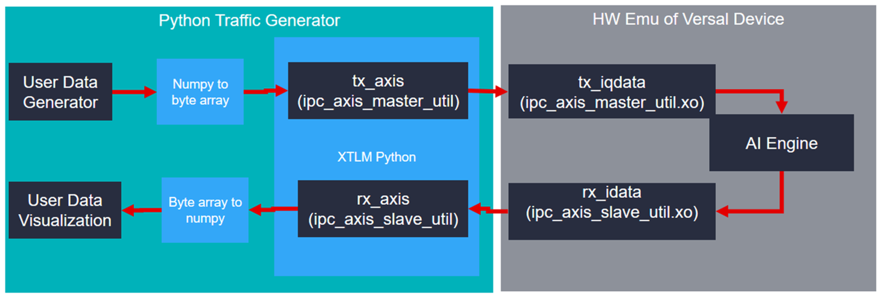
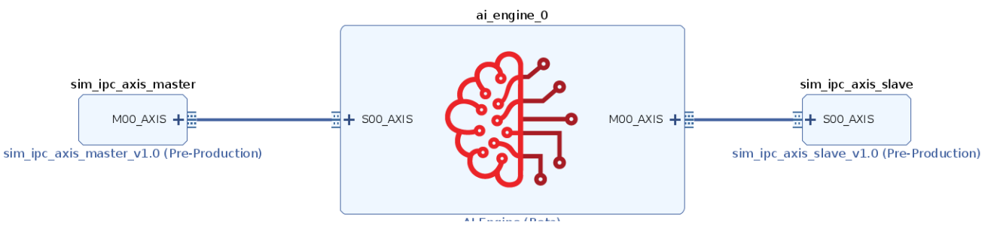
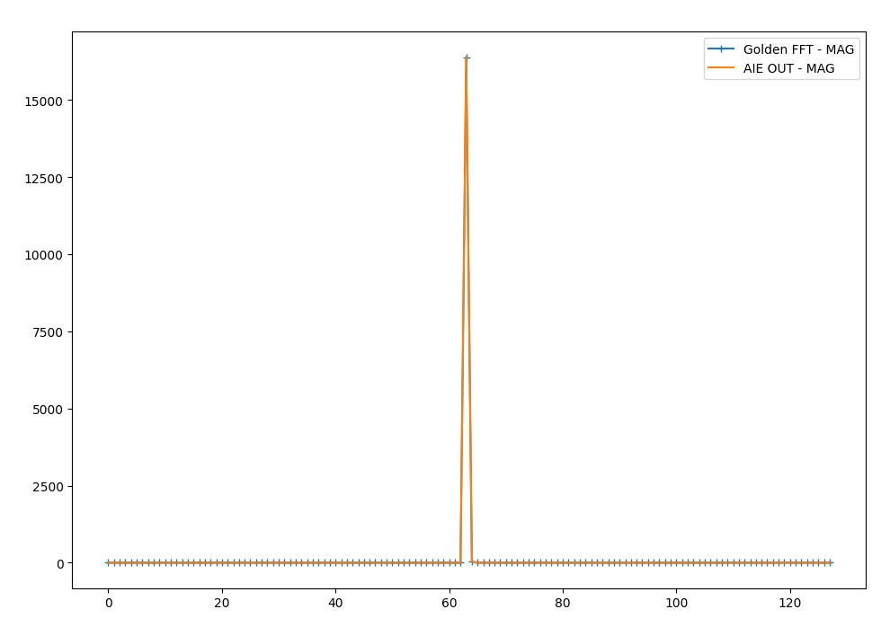

<table class="sphinxhide" width="100%">
 <tr>
   <td align="center"><h1>2023.1 Versal® AI Engine</h1>
   </td>
 </tr>
 <tr>
 <td align="center"><h1>AXIS External Traffic Generator Feature Tutorial</h1>
 </td>
</table>
<table class="sphinxhide" width="100%">
 <tr width="100%">
    <td align="center"><h1>AI Engine Development</h1>
    <a href="https://www.xilinx.com/products/design-tools/vitis.html">See Vitis™ Development Environment on xilinx.com</br></a>
    <a href="https://www.xilinx.com/products/design-tools/vitis/vitis-ai.html">See Vitis™ AI Development Environment on xilinx.com</a>
    </td>
 </tr>
</table>

# AXIS External Traffic Generator Feature Tutorial

## Table of Contents

* [Introduction](#introduction)

* [Before You Begin](#before-you-begin)

* [System View](#system-view)

* [Running Hardware Emulation](#running-hardware-emulation)

* [References](#references)


## Introduction

The Xilinx® Versal® adaptive compute acceleration platform (ACAP) is a fully software-programmable, heterogeneous compute platform that combines the processing system (PS) (Scalar Engines that include Arm® processors), Programmable Logic (PL) (Adaptable Engines that include the programmable logic), and AI Engines which belong in the Intelligent Engine category.

This tutorial shows how to use AXI Traffic Generators to provide input and capture output from an AI Engine kernel in hardware emulation.

**IMPORTANT**: Before beginning the tutorial make sure you have read and followed the *Vitis Software Platform Release Notes* (v2023.1) for setting up software and installing the VCK190 base platform.

Before starting this tutorial, complete the following steps:

1. Set up your platform by running the `xilinx-versal-common-v2023.1/environment-setup-cortexa72-cortexa53-xilinx-linux` script as provided in the platform download. This script sets up the `SDKTARGETSYSROOT` and `CXX` variables. If the script is not present, you **must** run the `xilinx-versal-common-v2023.1/sdk.sh`.
2. Set up your `ROOTFS` and `IMAGE` to point to the `xilinx-versal-common-v2023.1` directory.
3. Set up your `PLATFORM_REPO_PATHS` environment variable based upon where you downloaded the platform.

### Objectives

After completing the tutorial, you should be able to:

* Connect two simulation-only traffic master/slave IP cores to the AI Engine array via Vitis&trade;.
* Build and run HW emulation (QEMU + SystemC model of AI Engine).
* Pass data from python to the AI Engine via the simulation traffic generators.
* Configure the design for different PLIO widths.
* Capture the AI Engine output in python.
* Plot/Graph the data in python and compare against a golden reference model.

### Prerequisites

To demonstrate this feature in a meaningful way you'll also make use of a DSPLibrary function - the "Fast Fourier Transform" or FFT. The DSP Library tutorial provides detailed instructions on how to setup your environment to compile DSPLIB. Please complete that tutorial before continuing.

* https://github.com/Xilinx/Vitis-Tutorials/tree/master/AI_Engine_Development/Feature_Tutorials/08-dsp-library

### Tutorial Overview

The following figure gives an overview of how the data will flow through this example design.


One way this flow enhances simulation coverage is by emulating the PLIO interface and the XRT Host interactions.

Additionally, this allows the same input data to be run through hardware emulation and python (or other language) model of your computation. This can be helpful for verifying correctness, understanding numerical precision, and regression testing mathematical algorithms. This tutorial will demonstrate an FFT running in the AI Engine array and compare its output to a Numpy FFT.  

### Directory Structure

```
traffic_generator_install
├───images        images for this README
├───aie           graph definition
│   └───kernels   individual kernels
└───sw            host XRT code
    └───pysrc     python traffic generator
```

## Before You Begin

### *Documentation*: Explore AI Engine Architecture

* [Versal ACAP AI Engines for Dummies](https://forums.xilinx.com/t5/Design-and-Debug-Techniques-Blog/Versal-ACAP-AI-Engines-for-Dummies/ba-p/1132493)

* [AM009 AI Engine Architecture Manual](https://www.xilinx.com/support/documentation/architecture-manuals/am009-versal-ai-engine.pdf)

### *Tools*: Installing the Tools

Tools Documentation:

* [AI Engine Tools lounge](https://www.xilinx.com/member/versal_ai_tools_ea.html)

* [UG1076 Versal ACAP AI Engine Programming Environment](https://www.xilinx.com/member/versal_ai_core_docs_ea.html)

* [UG1295 Digital Signal Processing Library for AI Engine](https://www.xilinx.com/member/versal_ai_engines.html#documentation)

To run through this tutorial, you will need to download and install the following tools:

* Install the [Vitis Software Platform 2023.1](https://www.xilinx.com/support/download/index.html/content/xilinx/en/downloadNav/vitis.html)

* Install the [Vitis Software Platform 2023.1](https://www.xilinx.com/support/download/index.html/content/xilinx/en/downloadNav/vitis.html)

* Obtain licenses for the AI Engine tools

* Download and setup the [Xilinx DSP Library (DSPLib) 2023.1](https://www.xilinx.com/member/versal_ai_tools_ea.html#platforms)

* Download and setup the [VCK190 Vitis Platform for 2023.1](https://www.xilinx.com/member/versal_ai_tools_ea.html#platforms)

### *Environment*: Setting Up Your Target Platform Environment

When the elements of the Vitis&trade; software platform are installed, update the target platform environment script.

Create a script file named `env_setup_2023.sh` in your favorite text editor. Replace the placeholders with the appropriate paths:

```bash
export DSPLIB_ROOT=<YOUR-DSPLIB-DIRECTORY>
export PLATFORM_REPO_PATHS=<YOUR-PLATFORM-DIRECTORY>
export PYTHON_INSTALL=<YOUR-PYTHON_INSTALL_PATH>

source <XILINX-INSTALL-LOCATION>/Vitis/2023.1/settings64.sh
```

Then source the environment script:

```bash
source env_setup_2023.sh

## *Validation*: Confirming Tool Installation

Ensure that you are using the 2023.1 version of Xilinx&reg; tools.

```bash
which vitis
which aiecompiler
echo $DSPLIB_ROOT
```

### *Validation*: Python Environment

A python 3.6 or newer environment is required for this tutorial. Struct, numpy, and matplotlib packages are also required. To confirm the installation, open a terminal and type this command:

```bash
python3 -c 'import numpy, matplotlib, struct'
```

If this returns without error, you have the libraries required to proceed.

### *Other Tutorials*: Learn Basic Vitis Compiler and AI Engine Concepts

For novice users, following link provides tutorials to understand the basic Vitis&trade; compiler concepts and building simple AI Engine designs:

* https://github.com/Xilinx/Vitis-Tutorials

## System View



In the previous figure the AXIS traffic generator provides a path to the AI Engine input via a sim_ipc IP core. You will see this IP core on the BD in a later step. The AI Engine array has multiple AXI streaming inputs but for this tutorial you will use just one. Different application requirements such as precision and throughput will use different data types and PLIO widths. For example, the cint16 datatype often maximizes AI Engine compute capabilities while floating point datatypes provide the most dynamic range. The traffic generator XO files see all data as byte arrays of different widths based on the PLIO width and the corresponding XO file linked with `v++`. For this tutorial, you will send an array of complex 16-bit integers into the AI Engine array and perform a Fast Fourier Transform (FFT) using the DSP Library for AI Engine.

### Connecting the AXI Traffic XOs



1. To integrate the appropriate sim_ipc_axis you need to tell the linker how you want to connect them together. These connections are described in a configuration file: `system.cfg` in this tutorial.

    ```ini
    [connectivity]
    nk=sim_ipc_axis_master:1:tx_iqdata
    nk=sim_ipc_axis_slave:1:rx_iqdata
    stream_connect=tx_iqdata.M00_AXIS:ai_engine_0.DataIn
    stream_connect=ai_engine_0.DataOut:rx_iqdata.S00_AXIS
    ```

2. Link the XO files using the `v++` link command. The makefile handles this by bringing in the correct width of XO based on the PLIO_WIDTH makefile command.

    ```bash
    PLIO_WIDTH := 64
    KERNEL_XO := pl_kernels/sim_ipc_axis_master_${PLIO_WIDTH}.xo pl_kernels/sim_ipc_axis_slave_${PLIO_WIDTH}.xo
    ...
    VPP_LINK_FLAGS := -l --platform $(BASE_PLATFORM) $(KERNEL_XO) $(GRAPH_O) -t $(TARGET) --save-temps -g --config $(CONFIG_FILE) -o $(PFM).xsa
    ```

### Understanding Python

The following diagram illustrates the connections between the several steps required to interact with the traffic generators.

1. For this tutorial, the user data generator will be a complex sine wave.
2. You will convert it to a byte array.
3. Handle the AXI transactions.
4. Pass the data to the XTLM python
    1. XTLM will pass data to the AIE array
    2. XTLM AXIS Slave will capture the output data
    3. Capture the data in the rx_from_aie thread()
    4. Pass the data to the parent thread via a pipe
5. Convert to byte to array numpy.
6. Plot the data.


Regardless of the PLIO width the AXI Traffic Master and Slave both operate on a python bytes-like object. Numpy arrays can be either real or complex valued and have a convenient built-in method called "tobytes()" that makes interacting with the ipc_axis_master_util/slave_util very straightforward.

#### Creating a Sine Wave Data Vector

```python
n = np.arange(0,Nsamps)
Fs = 245.76e6
ft = 30.72e6/16
cplxt =  1.0* np.exp(-2*1j*np.pi*ft/Fs*n)

Nbits =  16    
#Quantize to NBits
mx = np.max(np.abs(cplxt))
cscaled = np.round(cplxt/mx  * 2**(Nbits-1)-1)

return cscaled
```

#### Convert Numpy to Byte Array

Following is an example of python code showing the axis_master side for cint16 data types.

```python
#Convert numpy complex vector into two columns of int16s
rVec = np.real(data).astype(np.int16)
iVec = np.imag(data).astype(np.int16)

out2column = np.zeros((L,2)).astype(np.int16)
out2column[:,0] = rVec
out2column[:,1] = iVec

#Convert numpy 2d array into bytes
payload = out2column.tobytes()
#Send the bytes to the AXI Traffic Generator
b_transport(payload)
```

See the provided python file for examples of floats and cfloat data types.

#### Generate AXI Transactions

Next you will examine the AXI Streaming transactions required to interact with the traffic generators. The provided python script performs these steps for you if you would like to provide only a numpy array. Having a better understanding of the underlying transactions can be helpful and that is what will be explained in detail now.

In the code snippet below on lines 1 to 5 the byte array to be sent needs to be broken into pieces equal to the width of the PLIO interface. Because the PLIO interface width is commonly identified with units of bits (PLIO32/64/128 are 32, 64, and 128 bits wide) the width of the transaction in bytes is divided by 8.

```
    1 #Determine number of transactions based on
    2 ## packet length and PLIO WIDTH
    3 NumBytesToSend = len(iq_data_as_bytes)
    4 NumBytesPerBeat = self.plio_width//8
    5 NumTrans = NumBytesToSend//NumBytesPerBeat
```

On line 5 you see that by dividing the PLIO width in bytes by the total number of bytes you can compute how many "TVALID" transactions.

```
    7 for i in range(NumTrans):
    8     
    9     payload = xtlm_ipc.axi_stream_packet()    
    10
    11     data2send = iq_data_as_bytes[(i*NumBytesPerBeat):(i*NumBytesPerBeat)+NumBytesPerBeat]
    12     #Grab a "chunk" of the byte array of size PLIO
    13
    14     payload.data_length = NumBytesPerBeat
    15     payload.data  =data2send
```

Here you see lines 7-15 containing a for loop construction. Each iteration of the loop creates an axi_stream packet object and populates all of its elements. The data is broken into appropriately sized chunks of NumBytesPerBeat.

```
    19     if(i == NumTrans-1):
    20         payload.tlast = True
    21     else:
    22         payload.tlast = False
    23         
    24
    25     self.in0_util.b_transport(payload)
```

Finally, lines 19-25 contain the handling of the TLast as well as the actual transmission of the full payload object using the `b_transport()` method.

<!--
[//]: #Lines 17-22
[//]: #For each transaction of PLIOWIDTH a single bit representing a byte-enable flag must be set. For PLIO32, which is 4 bytes, those 4 enable flags can be encoded as 0b1111 or 0xF. Similarly, PLIO64 is 0xFF and PLIO128 is 0xFFFF.
 -->

For more information see: [UG761 AXI Reference Guide](https://www.xilinx.com/support/documentation/ip_documentation/ug761_axi_reference_guide.pdf).

#### Receive AI Engine Array Output

```python
#Receive byte array from AXI traffic generator slave
payload = self.out0_util.sample_transaction()
#Note: this is a blocking call

formatString = "<"+str(len(payload.data)//2)+"h"
#"h" corresponds to a signed short which is 2 bytes in size. len() returns units of bytes.

upack = struct.unpack(formatString, payload.data)

#take the even numbered samples for real
rvec = upack[0:len(upack):2]
#take the odd numbered samples for imaginary
ivec = upack[1:len(upack):2]

#Reassemble into a complex numpy array
cVec = np.array(rvec) + 1j*np.array(ivec)
```

#### Convert Byte Array to Numpy

This section briefly covers how to capture data from the AI Engine array. For full details please see the python function `convert_bytes_to_numpy()`. The `sample_transaction()` method blocks and returns a full AXI payload consisting of all the data received from the AI Engine array. This is different than the transmitting AXI side because the data is captured as an array of bytes with TLAST forming the packet boundary. The format string variable is important for interpreting the byte array appropriately. For this tutorial a cint16 window type was used as the output. The `unpack()` method interprets the output as an array of int16s (2 bytes each) and then takes the even samples to form the real and imaginary components of the complex vector. These are packed into a single complex data vector.

```python
#Receive byte array from AXI traffic generator slave
payload = self.out0_util.sample_transaction()
#Note: this is a blocking call

formatString = "<"+str(len(payload.data)//2)+"h"
#"h" corresponds to a signed short which is 2 bytes in size. len() returns units of bytes.

upack = struct.unpack(formatString, payload.data)

#take the even numbered samples for real
rvec = upack[0:len(upack):2]
#take the odd numbered samples for imaginary
ivec = upack[1:len(upack):2]

#Reassemble into a complex numpy array
cVec = np.array(rvec) + 1j*np.array(ivec)
```

#### Plot the results

Matplotlib is a helpful python library that mimics other plotting tools. In this tutorial the traffic generator output data will be plotted or saved as a PNG image. A visual inspection can be helpful for iterative debugging prior to developing self-checking test benches or golden data vectors.

The python function "plot results" displays several graphs of the output data with different colors defined in a legend.

See www.matplotlib.org for more information on Matplotlib's features.

```python
plt.plot( list(range(0,len(aie_out))),np.real(aie_out),label ="aie_out R")
plt.plot( list(range(0,len(aie_out))),np.imag(aie_out),label  ="aie_out I ")   
```

## Running Hardware Emulation

### AI Engine and Versal Integration

The process of linking XO files via `v++` and the `system.cfg` is covered in depth in the following two tutorials. For this tutorial these steps are handled by the provided makefile and you will review only the highlights.

https://github.com/Xilinx/Vitis-Tutorials/tree/master/AI_Engine_Development/Feature_Tutorials/05-AI-engine-versal-integration

https://github.com/Xilinx/Vitis-Tutorials/tree/master/AI_Engine_Development/Design_Tutorials/03-beamforming/Module_04_AI_Engine_and_PL_Integration

### Section 1: Compile Kernels and AI Engine Graph

The first step is to take any v++ kernels (HLS C) and your AI Engine kernels and graph and compile them into their respective `.xo` and `.o` files. You can compile the kernels and graph in parallel because they do not rely on each other at this stage.

#### Compiling the kernel Files Using v++

To work with externel traffic generators in hardware emulation,introduce hooks in the PL. For that purpose, Xilinx provides a complete set of  XO files with various bitwidths in $XILINX_VITIS/data/emulation/XO :

    sim_ipc_axis_master_NNN.xo with NNN in 8,16,32,64,128,256,512
    sim_ipc_axis_slave_NNN.xo with NNN in 8,16,32,64,128,256,512

In this tutorial, 64 bit interfaces are required.    

#### Compiling an AI Engine ADF Graph for V++ Flow

An ADF Graph can be connected to an extensible Vitis&trade; platform. That is, the graph I/Os can be connected either to platform ports or to ports on Vitis kernels through the `v++` connectivity directives. Note the following:

* An AI Engine ADF C++ graph contains AI Engine kernels only.
* All interconnections between AI Engine kernels are defined in the C++ graph (`graph.h`).
* All interconnections to external I/Os are fully specified in the C++ simulation testbench (`graph.cpp`) that instantiates the C++ ADF graph object (this is strictly only used in `aiesimulator` which is covered in a separate tutorial). All platform connections from the graph to the "PLIO" map onto ports on the AI Engine subsystem graph that are connected via v++ connectivity directives.
* No dangling ports or implicit "connections" are allowed by `v++`.
* Stream connections are specified through the `v++ --sc` option, including employment of PL-based data movers, either in the platform or defined outside the ADF graph as Vitis PL kernels.

To compile the graph type to be used in hardware emulation, use:

```bash
make aie
```

This may take a few minutes.

#### Connecting the traffic generators with V++

`v++` lets you integrate your AI Engine, HLS, and RTL kernels into an existing extensible platform. This step is where the platform chosen is provided by the hardware designer (or you can opt to use one of the many extensible base platforms provided by Xilinx) and `v++` builds the hardware design for you in addition to integrating the AI Engine and PL kernels in the design.

You have a number of kernels at your disposal, but you need to tell the linker how you want to connect them together (from the AI Engine array to PL and vice versa). These connections are described in a configuration file: `system.cfg` in this tutorial.

```ini
[connectivity]
nk=sim_ipc_axis_master_64:1:tx_iqdata
nk=sim_ipc_axis_slave_64:1:rx_iqdata
stream_connect=tx_iqdata.M00_AXIS:ai_engine_0.DataIn
stream_connect=ai_engine_0.DataOut:rx_iqdata.S00_AXIS
```

If additional master and slave traffic generator interfaces are required, change the "1" (between the sim_ipc_axis and the instance name) instead of instantiating more new kernels with the `nk` command.

For `ai_engine_0` the names are provided in the `graph.cpp` when instantiating a `PLIO` object. For this design, as an example, this line `PLIO *in0 = new PLIO("DataIn1", adf::plio_32_bits,"data/input.txt");` has the name **DataIn1** which is the interface name.

You can see the `v++` switches in more detail in the [Vitis Unified Software Platform Documentation](https://docs.xilinx.com/r/en-US/ug1393-vitis-application-acceleration).


To build the design, run the following command:

```bash
make xclbin
```

This will likely take more than 5 or 10 minutes.

### Section 3: Compile the A72 Host Application

After all the new AI Engine outputs are created, you can compile your host application by following the typical cross-compilation flow for the Cortex-A72. As you might notice, the host code is using [XRT](http://www.github.com/Xilinx/XRT) (Xilinx Run Time) as an API to talk to the AI Engine and PL kernels. Notice that in the linker that it is using the libraries: `-ladf_api_xrt -lxrt_coreutil`.

1. Open `sw/main.cpp` and familiarize yourself with the contents. A benefit of the AXI Traffic Generators is the host code required is quite simple.

    ```bash
    mygraph_float<WIN_SAMPS>  graph_top;
    graph_top.init();
    graph_top.run(1);
    graph_top.end();
    ```

   **Note:** [XRT](https://xilinx.github.io/XRT/2023.1/html/index.html) is used in the host application. This API layer is used to communicate with the programmable logic, specifically the PLIO kernels for reading and writing data. To understand how to use this API in an AI Engine application refer to the "Programming the PS Host Application".

2. Close the main.cpp, and run the command.

	```bash
	make host
	```

This won't take very long.

### Section 4: Package the Design
With all the AI Engine outputs and the new platform created, you can now generate the Programmable Device Image (PDI) and a package to be used in the hardware emulated SD card. The PDI contains all executables, bitstreams, and configurations of every element of the device, and the packaged SD card directory contains everything to boot Linux and have your generated application and `.xclbin`.

To package the design, run the following command.

```bash
make package
```

### Section 5: Run Hardware Emulation

After packaging, everything is set to run emulation or hardware.

1. To run emulation use the following command.

   ```bash
   make run_emu SHOW_PLOT=True
   ```

   Or

   ```bash
   cd ./sw
   ./launch_hw_emu.sh
   cd ..
   ```

   This will take between 5 and 10 minutes to fully launch QEMU.

   When launched, use the Linux prompt presented to run the design.

2. Execute the following command when the emulated Linux prompt displays:

   ```bash
   cd /run/media/mmcblk0p1
   export XILINX_XRT=/usr
   ```

   This will set up the design to run emulation. Run the design using the following command:

   ```bash
   ./host.exe a.xclbin
   ```

   The host and graph are now running waiting for input from the traffic generators. Your QEMU terminal should look as follows:

   

3. In a new terminal execute `run_traffic_generators.py` with the following command.

   ```bash
   export PYTHONPATH="$XILINX_VIVADO/data/emulation/hw_em/lib/python:$XILINX_VIVADO/data/emulation/python/xtlm_ipc:$XILINX_VIVADO/data/emulation/ip_utils/xtlm_ipc/xtlm_ipc_v1_0/python/:${PYTHONPATH}"
   make run_tgen SHOW_PLOT=True
   ```

   In the makefile run_tgen task simply executes the python script.

   For 128 samples (the default amount for this tutorial) - this step will take 1 or 2 minutes to run.

   The default settings for this tutorial is only 128 samples which will execute in the hardware emulation environment quite quickly. A matplotlib window will appear that looks as follows:

   

   As you can see in the figure, the output of the DSPLib FFT module matches the expected output.

   When this is shown, run the keyboard command: `Ctrl+A x` to end the QEMU instance.

**IMPORTANT**: To rerun the application you need to restart QEMU from scratch.

### Summary

In this tutorial you learned how to:

* Connect two simulation-only traffic master/slave IP cores to the AI Engine array via Vitis&trade;.
* Build and run HW emulation (QEMU + SystemC model of AI Engine).
* Pass data from python to the AI Engine via the simulation traffic generators.
* Configure the design for different PLIO widths.
* Capture the AI Engine output in python.
* Plot/Graph the data in python and compare against a golden reference model.

To read more about the use of Vitis in the AI Engine flow see: *UG1076: Versal ACAP AI Engine Programming Environment Chapter 13: Running Hardware Emulation & Traffic Generators*.

## Support

GitHub issues will be used for tracking requests and bugs. For questions go to [forums.xilinx.com](http://forums.xilinx.com/).


<p class="sphinxhide" align="center"><sub>Copyright © 2020–2023 Advanced Micro Devices, Inc</sub></p>

<p class="sphinxhide" align="center"><sup><a href="https://www.amd.com/en/corporate/copyright">Terms and Conditions</a></sup></p>
