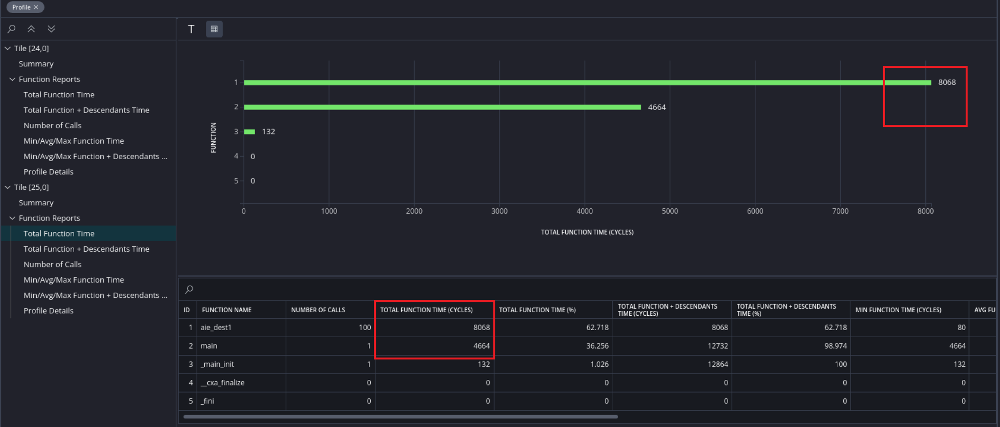

</table>
<table class="sphinxhide" width="100%">
 <tr width="100%">
    <td align="center"><h1>AI Engine Development</h1>
    <a href="https://www.xilinx.com/products/design-tools/vitis.html">See Vitis™ Development Environment on xilinx.com</br></a>
    <a href="https://www.xilinx.com/products/design-tools/vitis/vitis-ai.html">See Vitis™ AI Development Environment on xilinx.com</a>
    </td>
 </tr>
</table>

# AI Engine Graph Execution and Measurement

***Version: Vitis 2023.1***

AI Engine graph execution uses locks for memory synchronization. The stream interfaces have inherent data synchronization through backward or forward pressure.

This example introduces the Trace view to show how kernels with buffers and streams are executed and synchronized. Performance measurement methods are also introduced to help you identify the performance bottlenecks in the design. An optimized version of the design is then introduced. 

**Note:** The default working directory in this step is `testcase_ssfifo`, unless explicitly stated otherwise.

## Graph and Kernel Code

1. Run the following `make` command to compile the design:

    ```
    make aie
    ```

2. Open the compile result in Vitis Analyzer. It can be found in the following directory:

    ```
    vitis_analyzer Work/graph.aiecompile_summary
    ```

3. Examine the graph view in Vitis Analyzer.

    

There are two kernels, `aie_dest1` and `aie_dest2`, in the design. These two kernels are connected through a stream connection and a buffer connection (ping-pong buffers `buf1` and `buf1d`). The stream connection contains two stream switch FIFOs: `Fifo0(24,0)` and `Fifo1(24,0)`. These hardened FIFOs are in the stream switch of AI Engine array tile 24_0. These FIFOs are inserted to prevent deadlock in the design (see [AI Engine Hang Analysis](./aie_hang_analysis.md)). 

The input from the PL is connected to the ping-pong buffers `buf0` and `buf0d`, which are read by kernel `aie_dest1`. The output of kernel `aie_dest2` is connected to the PL through a stream connection.

The code for `aie_dest1` is as follows:
    
    ```
	using namespace adf;
	__attribute__ ((noinline)) void aie_dest1(input_buffer<int32,extents<32>> &in, 
        output_stream<int32> *out, output_buffer<int32,extents<32>> &outm){
		auto inIter=aie::begin_vector<4>(in);
		auto outmIter=aie::begin_vector<4>(outm);
		aie::vector<int32,4> tmp;
		for(int i=0;i<8;i++)
		chess_prepare_for_pipelining
		{
			tmp=*inIter++;
			writeincr(out,tmp);
			*outmIter++=tmp;
		}
	}
    ```

It reads 32 `int` values from the input buffer and writes them to the stream and buffer output. The `__attribute__ ((noinline))` command instructs the tool the keep the hierarchy of the kernel function.

The code for `aie_dest2` is as follows:

    ```
	using namespace adf;
	__attribute__ ((noinline)) void aie_dest2(input_stream<int32> *in, input_buffer<int32,extents<32>> &inm, 
        output_stream<int32> *outm){
		auto inmIter=aie::begin_vector<4>(inm);
		aie::vector<int32,4> tmp;
		aie::vector<int32,4> tmp2;
		for(int i=0;i<8;i++)
		chess_prepare_for_pipelining
		{
			tmp=readincr_v<4>(in);
			tmp2=*inmIter++;
			writeincr(outm,tmp+tmp2);
		}
	}
    ```

It reads from the stream input and the buffer, and writes to the stream output.

## Graph Execution Model

1. Use the following command to run AI Engine simulator:
  
    ```
    make aiesim
    ```
    
2. Open the running result by accessing the following directory:

    ```
    vitis_analyzer aiesimulator_output/default.aierun_summary
    ```
    
    **Note:** The `--dump-vcd` option is used by `aiesimulator` to dump the VCD file for trace.

3. Click **Trace** view in Vitis Analyzer. Zoom in to view the first few runs of the design:

    

    This figure lists the following events and their dependencies:

    **1:** Tile 24_0 DMA s2mm channel 0 (`s2mm.Ch0.BD0.lock0`) starts. It acquires the lock of ping of input buffer (`buf0`) to `aie_dest1` and transfers data from the PL to `buf0`. Refer to [Graph View](./images/figure1.PNG) for the position of the buffer in the graph.


    **2:** After DMA s2mm channel 0 BD 0 completes, DMA s2mm channel 0 BD 1 (`s2mm.CH0.BD1.lock1`) starts. It acquires the lock of pong of input buffer (`buf0d`) and transfers data from the PL to `buf0d`.

    **3a:** The `aie_dest1` kernel (in tile 25_0) acquires the lock of `buf0` (shown as `read lock allocated`). 

    **3b:** `aie_dest1` acquires the lock of ping of output buffer (`buf1`) as well.

    **4a:** After `aie_dest1` acquires the locks of its input buffer (`buf0`) and output buffer (`buf1`), it starts. If any lock cannot be acquired, it will run into lock stall.

    **4b:** After tile 24_0 DMA s2mm channel 0 BD 1 (`s2mm.CH0.BD1.lock1`) completes, it switches back to DMA s2mm channel 0 BD 0 (`s2mm.CH0.BD1.lock0`). At first, `buf0` is still read by `aie_dest1` (`read lock allocated`), so it sticks at `DMA lock req` in red. After the read lock of the buffer is released, it can acquire lock and start data transfer from PL.

    **5:** After `aie_dest1` completes, it releases the output buffer (`buf1`). The kernel `aie_dest2` acquires the lock of `buf1` (`read lock allocated`). 

    **6a:** After the lock of `buf1` is acquired, `aie_dest2` starts.

    **6b:**. `aie_dest1` acquires the lock of `buf0d` (`read lock allocated`).

    **6c:** `aie_dest1` acquires the lock of `buf1d` (`write lock allocated`).

    **7:** After `aie_dest1` acquires the locks of its input buffer (`buf0d`) and output buffer (`buf1d`), it starts.

    **8:** After `aie_dest1` completes, it releases the output buffer (`buf1d`). Kernel `aie_dest2` acquires the lock of `buf1d` (`read lock allocated`). 

    **9:** After the lock of `buf1d` is acquired, `aie_dest2` starts.

    **Note:** The stream interface does not need to acquire lock; it has inherent backward and forward pressure for data synchronization. Every lock acquire and release event has some cycles of overhead. 

## Graph Performance Measurement

There are multiple ways to measure performance:

1. The AI Engine simulator output contains a timestamp for each piece of output data. It is possible to make performance calculations both manually and by using scripts. For example, the output of the example (`aiesimulator_output/data/output.txt`) looks like the following:


    ```
    T 662400 ns
    2 
    ......
    T 10899200 ns
    30 
    ```

    The first samples come out in `662400 ps`, and the last samples come out in `10899200 ps`. The throughput therefore can be calculated as follows:

        Total time = 10899200 - 662400 = 10236800 ps
        Total bytes = 128 * 100 = 12800 bytes
        Throughput = 12800/(10236800*1e-6) = 1250.3 MB/s
        
    This method does _not_ measure the latency of the first kernel execution to produce the output data: make sure that the graph runs a number large enough that this overhead can be neglected. 

2. Xilinx provides event APIs for performance profiling purposes. These APIs use performance counters in shim tiles to do profiling. The following enumeration usages are introduced in this tutorial:

    - **event::io_stream_start_to_bytes_transferred_cycles:** This records the start of a running event with a performance counter, and records the event that a specific amount of data is transferred with another performance counter. The return number with this enumeration is therefore the total cycles required to receive that amount of data. The profiled stream should be stopped after this amount of data has been transferred.
    
    - **event::io_stream_running_event_count:** This counts how many running events have occurred between `start_profiling` and `read_profiling`. It can be used to count how much data has been transferred, whether the graph is running infinitely or not.

    Take a look at `aie/graph.cpp`. The code to perform profiling is as follows:

    ```
    int iterations=100;
    int bytes_per_iteration=128;
    int total_bytes=bytes_per_iteration * iterations;
    event::handle handle = event::start_profiling(*dout, event::io_stream_start_to_bytes_transferred_cycles, total_bytes);
    if(handle==event::invalid_handle){
     printf("ERROR:Invalid handle. Only two performance counter in a AIE-PL interface tile\n");
     return 1;
    }
    gr.run(100);
    gr.wait();
    long long cycle_count = event::read_profiling(handle);
    std::cout<<"cycle count:"<<cycle_count<<std::endl;
    event::stop_profiling(handle);
    double throughput = (double)total_bytes / (cycle_count *0.8 * 1e-3); //Every AIE cycle is 0.8ns in production board
    printf("Throughput of the graph: %f MB/s\n",throughput);
    ```

    The output of AI Engine simulator looks like the following:

    ```
    cycle count:12648
    Throughput of the graph: 1265.022138 MB/s
    ```

    The event API can be applied in AI Engine simulator, hardware emulation, and hardware flows.

3. The performance result can also be found in the AI Engine simulator profile report. Add the `--profile` option to `aiesimulator`, open Vitis Analyzer, and open the **Profile** view. The profile result can be viewed as shown in the following figure:

    

    Kernel `aie_dest1` takes 8068 cycles for 100 iterations. The `main` function takes 4664 cycles for 100 iterations of the graph. This is around 47 cycles of overhead for each iteration of the graph. This overhead includes the lock acquires of the buffers and the overhead of API calls.

    The performance of `aie_dest1` is bounded by the stream interface throughput. The theoretical limit is up to 4 bytes a cycle (5 GB/s), and there are 128 bytes of input for one run. This means that it at least has 32 cycles for the main loop, although in actuality it takes 80 cycles. This indicates that the loop is not well pipelined.

4. You can check performance-related events to see if they match expectations. For example, check the event `PL_TO_SHIM` to see if the PL can send data at the best achievable performance for a single stream interface. Look for the `PL_TO_SHIM` event in **Trace** view in Vitis Analyzer:

    

    Search it for multiple times. When it is stable, it can be seen that every eight cycles, it happens once. This is because the frequency of the PL has been set at 312.5 MHz by the option `--pl-freq=312.5` for the AI Engine compiler and AI Engine-PL interface is 32-bit width, which is one-fourth of the best achievable performance. 

    From a best performance and best resource perspective, you might select a 64-bit interface at 625 MHz if timing allows. If not, it is possible to have the PL running at 312.5 MHz with a 128-bit width interface. 
    
5. The following methods are introduced in [AI Engine Performance Profile](https://github.com/Xilinx/Vitis-Tutorials/blob/master/AI_Engine_Development/Feature_Tutorials/02-using-gmio/perf_profile_aie_gmio.md): 

    * Profiling by C++ class API
    * Profiling by AI Engine cycles from AI Engine kernels
    * Profiling by event API

## Design Optimization Considerations

In this section, the reference design is in `testcase_dmafifo_opt`. From performing the above analysis, it can be seen that the bottleneck of this design contains the following issues:

- The interface bandwidth is not optimal. The design uses a PLIO width of 32 bits running at 312.5 MHz. Change it to 128 bits running at 312.5 MHz. The relevant code is in `aie/graph.h`:
 
    ```
	in=input_plio::create("Datain0", plio_128_bits,  "data/input.txt");
	dataout=output_plio::create("Dataout0", plio_128_bits,  "data/output.txt");
    ```
 
- The overhead of the graph iterations is too large. The hierarchy of the design should not be touched. Increase the buffer size from 128 bits to 4096 bits. To avoid deadlock, the FIFO size also needs to be increased. The relevant code is in `aie/graph.h`:

    ```
    connect< >net0(in, k[0].in[0]);
    connect< stream >net1(k[0].out[0], k[1].in[0]);
    connect< >net2(k[0].out[1], k[1].in[1]);
    connect< stream >net3(k[1].out[0], dataout);
    fifo_depth(net1)=1024;
    ```

    **Note:** When the FIFO depth is large, the DMA FIFO is used. _Do not_ set the FIFO depth to larger than (_or equal to_) 8192 for a single DMA FIFO.

- The kernel is not well pipelined. As well as increasing the loop count to deal with more data, more instructions should be added in the loop body and a `__restrict` keyword should be added to the ports to make the tool schedule instructions more freely. The optimized code for `aie_dest1` is as follows:

    ```
	using namespace adf;
	__attribute__ ((noinline)) void aie_dest1(input_buffer<int32,extents<1024>> & __restrict in, 
        output_stream<int32> * __restrict out, output_buffer<int32,extents<1024>> & __restrict outm){
		auto inIter=aie::begin_vector<4>(in);
		auto outmIter=aie::begin_vector<4>(outm);
		aie::vector<int32,4> tmp;
		for(int i=0;i<128;i++)
		chess_prepare_for_pipelining
		{
			tmp=*inIter++;
			writeincr(out,tmp);
			*outmIter++=tmp;
			tmp=*inIter++;
			writeincr(out,tmp);
			*outmIter++=tmp;
		}
	}
    ```

    Similar optimization is done for `aie_dest2`. For more information about loop analysis and optimization, refer to the _AI Engine Kernel Coding Best Practices Guide_.

After making these optimizations, run the following command:

    
    ```
    make aiesim
    ```
    
    
It can be seen that the design performance can be increased from around 828 MB/s to around 3748 MB/s. This is approaching the theoretical limit of the design (4 GB/s). 

Next, run the design in hardware emulation:

    
    ```
    make run_hw_emu
    ```
    
    
In QEMU, run the following commands:

    
    ```
	mount /dev/mmcblk0p1 /mnt
	cd /mnt
    ./host.exe a.xclbin
    ```
    

Build the design for hardware:

    
    ```
    make package TARGET=hw
    ```
    
    
The performance in hardware is similar:

    
    ```
    cycle count:110610
    Throughput of the graph: 4628.88 MB/s
    ```
    

### Conclusion

This example has shown a number of different ways to do performance analysis and profiling. Some optimization skills have also been introduced. In the next section, take a look at how deadlocks might occur, and how to analyze them: see [AI Engine Deadlock Analysis](./aie_hang_analysis.md).

#### Support

GitHub issues will be used for tracking requests and bugs. For questions go to [forums.xilinx.com](http://forums.xilinx.com/).


<p class="sphinxhide" align="center"><sub>Copyright © 2020–2023 Advanced Micro Devices, Inc</sub></p>

<p class="sphinxhide" align="center"><sup><a href="https://www.amd.com/en/corporate/copyright">Terms and Conditions</a></sup></p>
