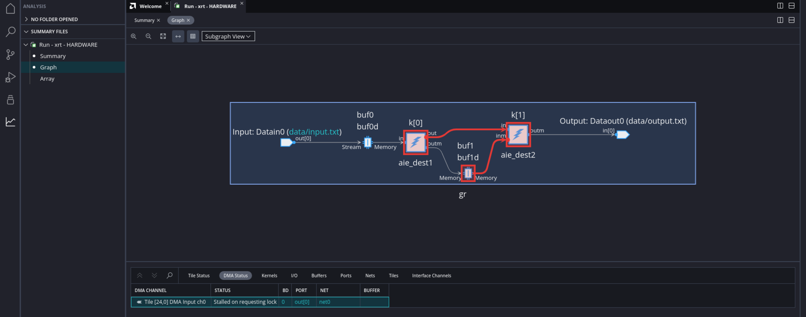
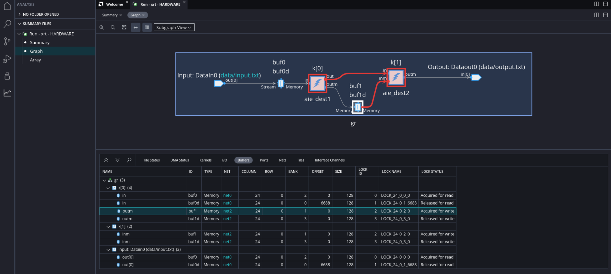
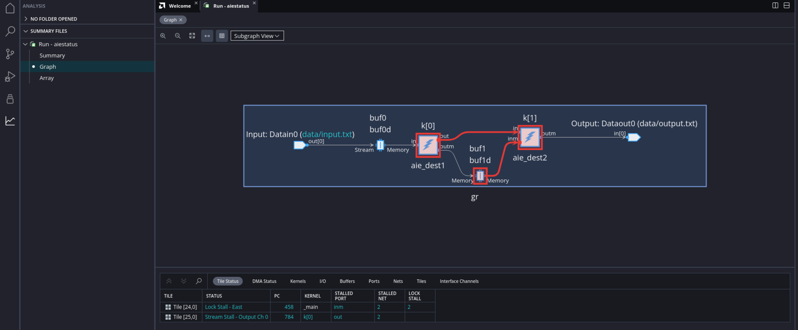

</table>
<table class="sphinxhide" width="100%">
 <tr width="100%">
    <td align="center"><h1>AI Engine Development</h1>
    <a href="https://www.xilinx.com/products/design-tools/vitis.html">See Vitis™ Development Environment on xilinx.com</br></a>
    <a href="https://www.xilinx.com/products/design-tools/vitis/vitis-ai.html">See Vitis™ AI Development Environment on xilinx.com</a>
    </td>
 </tr>
</table>

# AI Engine Status Analysis

***Version: Vitis 2022.1***

This tutorial introduces you ways to output a summary of AI Engine status, which can be further analyzed in Vitis Analyzer. There are two ways to output AI Engine status:

1. **Automated and periodic AI Engine status output:** After initial setup in `xrt.ini`, this method requires minimal user intervention, because the tool will output periodic status at specified time intervals.

2. **Manual output the AI Engine status:** You must run a command each time you want a status output report.

You can then open the status output in Vitis Analyzer for further analysis.

**Note:** The default working directory in this step is `testcase_nofifo_hang`, unless explicitly stated otherwise.

**Note:** The description is based on HW flow. But the methods decribed in this tutorial also apply for HW Emulation flow.

## **Design Setup and Run**

Change directory to `testcase_nofifo_hang`. Modify host code (`sw/host.cpp`) to call `gr.end();`, which will cause the design to hang forever. Then build HW package. The commands can be:

	cd testcase_nofifo_hang
	sed -i 's/gr.end(.*);/gr.end();/' sw/host.cpp
	make package TARGET=hw

Boot from sd card. In Linux, change working directory to `/run/media/mmcblk0p1`:

	cd /run/media/mmcblk0p1

Then choose one of two following options to dump AI Engine status.

## **Option 1: Automated and periodic AI Engine status output**

In the working directory `/run/media/mmcblk0p1`, create file `xrt.ini`, and put following contents to it:

	[Debug]
	aie_status=true

Or, additionaly specify the interval of probing and analyzing the AI Engine status:

	[Debug]
	aie_status=true
	aie_status_interval_us=10000

Run the application:
	
	./host.exe a.xclbin

After some time, it will print some messages like:

	[XRT] WARNING: Potential deadlock/hang found in AI Engines. Graph : gr
	[XRT] WARNING: Potential stuck cores found in AI Engines. Graph : gr Tile : (25,1) Status 0x1001 : Enable,Stream_Stall_MS0
	[XRT] WARNING: Potential stuck cores found in AI Engines. Graph : gr Tile : (24,1) Status 0x201 : Enable,Lock_Stall_E

**Note:** It indicates that the design may be stuck. Howerver, its your responsibility to determine if it's true deadlock based on designs. 

Wait for some time. Either kill the application run by `CTRL+C` or suspend it by `CTRL+Z`. Then you will see multiple files are generated in the working directory:

* xrt.run_summary
* aie_status_edge.json
* aieshim_status_edge.json
* summary.csv

Copy them to local server for further analysis in Vitis Analyzer. 

### **Analyzing the Automated Status Output**

* Open the run summary file with command:

		vitis_analyzer xrt.run_summary

* In Vitis Analyzer, click `Set AI Engine compile summary` in the summary view. 


In the prompted dialog box, click the `...` button, and select the AI Engine compile summary, such as `./Work/graph.aiecompile_summary` to set the AI Engine compile summary. 

* The graph view is shown as:


	1. The red arrow from data input (from PL) to window buffers `buf0` and `buf0d` indicates that the input is trying to write to buffer, but it can not write into the buffer. 
	
	2. Kernel `k[0]` is trying to write to `k[1]`, but stalled at the output stream port. See the red circle on the kernel instance.

	3. Kernel `k[1]` is trying to read from buffers `buf1` and `buf1d`, but stalled. See the red circle on the kernel instance.

	4. The graph output to PL is not stalled. 

* `Tile Status` window also shows the information about `Kernel`, `Status`, `Stalled Port` and so. 




	1. Tile [25,0] (Kernel `aie_dest1`) is in status `Stream Stall - Output Ch 0`, which indicates that the kernel is stalled on writing output stream channel 0. 

	2. Tile [24,0] (Kernel `aie_dest2`) is in status `Lock Stall - East`, which is stalled on port `inm`. 

* `Buffers` view shows the buffer status of the graph. 



	1. Click `Buffers` window to select it.

	2. Select the buffer in graph to be analyzed.

	3. The PING-PONG buffers are highlighted in `Buffers` window. The column `Lock Status` shows the buffer lock status. There are four status:
			
		* Acquired for read: The buffer has been acquired for read by the consumer kernel.

		* Released for read: The buffer has been released for read by the producer kernel.

		* Acquired for write: The buffer has been acquired for write by the producer kernel.

		* Released for write: The buffer has been released for write by the consumer kernel.

	For this example, it shows that `buf1` is `Acquired for write` and `buf1d` is `Released for write`. It indicates that `buf1` has already been acquired for write by `k[0]`. `buf1d` is released for write, not released for read. So, the buffers are not able to be acquired for read by `k[1]`. Thus `k[1]` is stalled. 

## **Option 2: Manual output the AI Engine status**

In Linux, run the application:
	
	/run/media/mmcblk0p1
	./host.exe a.xclbin

After the design runs for some time, either kill the application run by `CTRL+C` or suspend it by `CTRL+Z`. Then, dump the AI Engine status into json file:

	xbutil examine -r aie -d 0 -f json -o xbutil_status.json
	 
Copy the json output to local server for further analysis in Vitis Analyzer. 

### **Analyzing the Manual Status Output**

1. In Vitis Analyzer, click `File → Import Xbutil JSON Output...`.

2. In the prompted window, set the following options:

	• Xbutil JSON File: Select the JSON file that was manually generated with the xbutil command. For example, select the file `xbutil_status.json`.

	• AI Engine Compile Summary: Select the AI Engine compile summary file. For example, `./Work/graph.aiecompile_summary`.

	• Run Summary: The run summary to be written. A default name is provided. The run summary can be used to reload the analysis next time by `File → Open Summary...` or `File → Open Recent → Run Summary`.

The Graph and Array views are shown in Vitis Analyzer. The analysis is similar as **Analyzing the Automated Status Output**.



### Conclusion

After completing this tutorial, you have learned how to dump live status of AI Engine and how to analyze it in Vitis Analyzer.


# Revision History

- July 2021: Initial release.


© Copyright 2021 Xilinx, Inc.

Licensed under the Apache License, Version 2.0 (the "License"); you may not use this file except in compliance with the License. You may obtain a copy of the License at

  ```
  http://www.apache.org/licenses/LICENSE-2.0
  ```

Unless required by applicable law or agreed to in writing, software distributed under the License is distributed on an "AS IS" BASIS, WITHOUT WARRANTIES OR CONDITIONS OF ANY KIND, either express or implied. See the License for the specific language governing permissions and limitations under the License.
