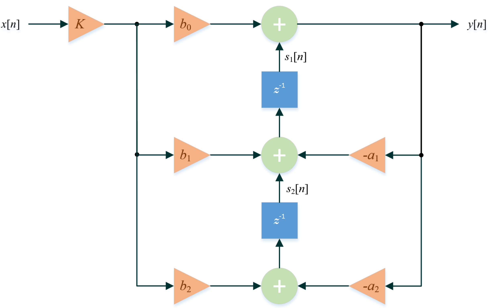
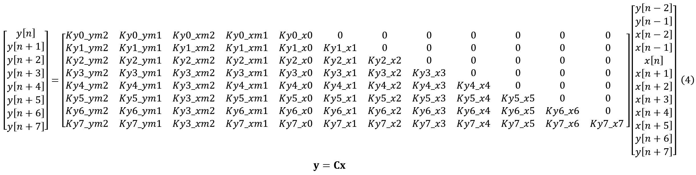

<table class="sphinxhide" width="100%">
 <tr width="100%">
    <td align="center"><h1>AI Engine Development</h1>
    <a href="https://www.xilinx.com/products/design-tools/vitis.html">See Vitis™ Development Environment on xilinx.com</br></a>
    <a href="https://www.xilinx.com/products/design-tools/vitis/vitis-ai.html">See Vitis-AI™ Development Environment on xilinx.com</a>
    </td>
 </tr>
</table>

# Implementing an IIR Filter on the AI Engine - Part 1a

## Preliminaries

We use the [transposed direct form II](https://www.dsprelated.com/freebooks/filters/Transposed_Direct_Forms.html) (TDF2) of an IIR filter for [numerical robustness](https://www.dsprelated.com/freebooks/filters/Numerical_Robustness_TDF_II.html) and focus on implementing a [biquad](https://en.wikipedia.org/wiki/Digital_biquad_filter) section to allow cascading multiple sections to form higher order IIR filters.

The block diagram for a TDF2 [IIR biquad filter](https://www.dsprelated.com/showarticle/1137.php) is shown below



and has the following difference equation:


Starting with the *first* 8 input samples (i.e., *x*[0], *x*[1],…, *x*[7]), the four previous states will be initialized to *x*[-1] = *x*[-2] = *y*[-1] = *y*[-2] = 0. Thus, the corresponding 8 outputs can be expressed as:


This system of equations may be solved sequentially or in parallel. To fully utilize the SIMD capabilities of the vector processor, we need to parallelize this system of equations [[2](https://raphlinus.github.io/audio/2019/02/14/parallel-iir.html)]. Note that we can express all the outputs in terms of the current inputs and the four previous states. For example, substituting the expression for *y*[*n* + 0] to solve for *y*[*n* + 1] in terms of the current inputs (*x*[*n*]~*x*[*n* + 1]) and the four states (*x*[*n*-1], *x*[*n*-2], *y*[*n*-1] and *y*[*n*-2]):


Using a symbolic solver like [wxMaxima](https://wxmaxima-developers.github.io/wxmaxima/index.html) or [Mathematica](https://www.wolfram.com/mathematica/), we find that:



where

```
*************************************
Ky0_ym2 = -a2;
Ky0_ym1 = -a1;
Ky0_xm2 = b2*K;
Ky0_xm1 = b1*K;
Ky0_x0 = b0*K;
*************************************
Ky1_ym2 = a1*a2;
Ky1_ym1 = a1^2 - a2;
Ky1_xm2 = -(a1*b2*K);
Ky1_xm1 = (-(a1*b1) + b2)*K;
Ky1_x0 = (-(a1*b0) + b1)*K;
Ky1_x1 = b0*K;
*************************************
Ky2_ym2 = a2*(-a1^2 + a2);
Ky2_ym1 = -a1^3 + 2*a1*a2;
Ky2_xm2 = (a1^2 - a2)*b2*K;
Ky2_xm1 = (a1^2*b1 - a2*b1 - a1*b2)*K;
Ky2_x0 = (a1^2*b0 - a2*b0 - a1*b1 + b2)*K;
Ky2_x1 = (-(a1*b0) + b1)*K;
Ky2_x2 = b0*K;
*************************************
Ky3_ym2 = a1*(a1^2 - 2*a2)*a2;
Ky3_ym1 = a1^4 - 3*a1^2*a2 + a2^2;
Ky3_xm2 = -(a1*(a1^2 - 2*a2)*b2*K);
Ky3_xm1 = (-(a1^3*b1) + 2*a1*a2*b1 + a1^2*b2 - a2*b2)*K;
Ky3_x0 = -((a1^3*b0 - a1^2*b1 + a2*b1 + a1*(-2*a2*b0 + b2))*K);
Ky3_x1 = (a1^2*b0 - a2*b0 - a1*b1 + b2)*K;
Ky3_x2 = (-(a1*b0) + b1)*K;
Ky3_x3 = b0*K;
*************************************
Ky4_ym2 = -(a2*(a1^4 - 3*a1^2*a2 + a2^2));
Ky4_ym1 = -(a1*(a1^4 - 4*a1^2*a2 + 3*a2^2));
Ky4_xm2 = (a1^4 - 3*a1^2*a2 + a2^2)*b2*K;
Ky4_xm1 = (a1^4*b1 - 3*a1^2*a2*b1 + a2^2*b1 - a1^3*b2 + 2*a1*a2*b2)*K;
Ky4_x0 = (a1^4*b0 - a1^3*b1 + 2*a1*a2*b1 + a2*(a2*b0 - b2) + a1^2*(-3*a2*b0 + b2))*K;
Ky4_x1 = -((a1^3*b0 - a1^2*b1 + a2*b1 + a1*(-2*a2*b0 + b2))*K);
Ky4_x2 = (a1^2*b0 - a2*b0 - a1*b1 + b2)*K;
Ky4_x3 = (-(a1*b0) + b1)*K;
Ky4_x4 = b0*K;
*************************************
Ky5_ym2 = a1*a2*(a1^4 - 4*a1^2*a2 + 3*a2^2);
Ky5_ym1 = a1^6 - 5*a1^4*a2 + 6*a1^2*a2^2 - a2^3;
Ky5_xm2 = -(a1*(a1^4 - 4*a1^2*a2 + 3*a2^2)*b2*K);
Ky5_xm1 = (-(a1^5*b1) + 4*a1^3*a2*b1 - 3*a1*a2^2*b1 + a1^4*b2 - 3*a1^2*a2*b2 + a2^2*b2)*K;
Ky5_x0 = (-(a1^5*b0) + a1^4*b1 - 3*a1^2*a2*b1 + a2^2*b1 + a1^3*(4*a2*b0 - b2) + a1*a2*(-3*a2*b0 + 2*b2))*K;
Ky5_x1 = (a1^4*b0 - a1^3*b1 + 2*a1*a2*b1 + a2*(a2*b0 - b2) + a1^2*(-3*a2*b0 + b2))*K;
Ky5_x2 = -((a1^3*b0 - a1^2*b1 + a2*b1 + a1*(-2*a2*b0 + b2))*K);
Ky5_x3 = (a1^2*b0 - a2*b0 - a1*b1 + b2)*K;
Ky5_x4 = (-(a1*b0) + b1)*K;
Ky5_x5 = b0*K;
*************************************
Ky6_ym2 = a2*(-a1^6 + 5*a1^4*a2 - 6*a1^2*a2^2 + a2^3);
Ky6_ym1 = -a1^7 + 6*a1^5*a2 - 10*a1^3*a2^2 + 4*a1*a2^3;
Ky6_xm2 = (a1^6 - 5*a1^4*a2 + 6*a1^2*a2^2 - a2^3)*b2*K;
Ky6_xm1 = (a1^6*b1 - 5*a1^4*a2*b1 + 6*a1^2*a2^2*b1 - a2^3*b1 - a1^5*b2 + 4*a1^3*a2*b2 - 3*a1*a2^2*b2)*K;
Ky6_x0 = (a1^6*b0 - a1^5*b1 + 4*a1^3*a2*b1 - 3*a1*a2^2*b1 + 3*a1^2*a2*(2*a2*b0 - b2) + a1^4*(-5*a2*b0 + b2) + a2^2*(-(a2*b0) + b2))*K;
Ky6_x1 = (-(a1^5*b0) + a1^4*b1 - 3*a1^2*a2*b1 + a2^2*b1 + a1^3*(4*a2*b0 - b2) + a1*a2*(-3*a2*b0 + 2*b2))*K;
Ky6_x2 = (a1^4*b0 - a1^3*b1 + 2*a1*a2*b1 + a2*(a2*b0 - b2) + a1^2*(-3*a2*b0 + b2))*K;
Ky6_x3 = -((a1^3*b0 - a1^2*b1 + a2*b1 + a1*(-2*a2*b0 + b2))*K);
Ky6_x4 = (a1^2*b0 - a2*b0 - a1*b1 + b2)*K;
Ky6_x5 = (-(a1*b0) + b1)*K;
Ky6_x6 = b0*K;
*************************************
Ky7_ym2 = a1*a2*(a1^6 - 6*a1^4*a2 + 10*a1^2*a2^2 - 4*a2^3);
Ky7_ym1 = a1^8 - 7*a1^6*a2 + 15*a1^4*a2^2 - 10*a1^2*a2^3 + a2^4;
Ky7_xm2 = -(a1*(a1^6 - 6*a1^4*a2 + 10*a1^2*a2^2 - 4*a2^3)*b2*K);
Ky7_xm1 = (-(a1^7*b1) + 6*a1^5*a2*b1 - 10*a1^3*a2^2*b1 + 4*a1*a2^3*b1 + a1^6*b2 - 5*a1^4*a2*b2 + 6*a1^2*a2^2*b2 - a2^3*b2)*K;
Ky7_x0 = -((a1^7*b0 - a1^6*b1 + 5*a1^4*a2*b1 - 6*a1^2*a2^2*b1 + a2^3*b1 + 2*a1^3*a2*(5*a2*b0 - 2*b2) + a1^5*(-6*a2*b0 + b2) + a1*a2^2*(-4*a2*b0 + 3*b2))*K);
Ky7_x1 = (a1^6*b0 - a1^5*b1 + 4*a1^3*a2*b1 - 3*a1*a2^2*b1 + 3*a1^2*a2*(2*a2*b0 - b2) + a1^4*(-5*a2*b0 + b2) + a2^2*(-(a2*b0) + b2))*K;
Ky7_x2 = (-(a1^5*b0) + a1^4*b1 - 3*a1^2*a2*b1 + a2^2*b1 + a1^3*(4*a2*b0 - b2) + a1*a2*(-3*a2*b0 + 2*b2))*K;
Ky7_x3 = (a1^4*b0 - a1^3*b1 + 2*a1*a2*b1 + a2*(a2*b0 - b2) + a1^2*(-3*a2*b0 + b2))*K;
Ky7_x4 = -((a1^3*b0 - a1^2*b1 + a2*b1 + a1*(-2*a2*b0 + b2))*K);
Ky7_x5 = (a1^2*b0 - a2*b0 - a1*b1 + b2)*K;
Ky7_x6 = (-(a1*b0) + b1)*K;
Ky7_x7 = b0*K;
*************************************
```

Note that the matrix of constants **C** in (4) has 8 rows and 12 columns.

`aie_iir_1a.jl` is a Julia script included in this tutorial which:

* defines the filter characteristics
* breaks down the filter into second order sections
* generates the SIMD coefficients for each stage

The vector processor on the AI engine can perform 8 multiply-accumulate operations on [binary32](https://en.wikipedia.org/wiki/Single-precision_floating-point_format) variables in *one cycle*. If there were 8 independent inputs to be processed simultaneously by 8 independent IIR biquad filters, then the kernel code would be straightforward, and from (1), those signals would be processed with an *ideal* latency of 5 cycles:

* cycle 1: y<sub>i</sub>[n]  = *K* * *b*<sub>0</sub> * *x*<sub>i</sub>[*n*]
* cycle 2: y<sub>i</sub>[n] += *K* * *b*<sub>1</sub> * *x*<sub>i</sub>[*n*-1]
* cycle 3: y<sub>i</sub>[n] += *K* * *b*<sub>2</sub> * *x*<sub>i</sub>[*n*-2]
* cycle 4: y<sub>i</sub>[n] +=      *-a*<sub>1</sub> * *y*<sub>i</sub>[*n*-1]
* cycle 5: y<sub>i</sub>[n] +=      *-a*<sub>2</sub> * *y*<sub>i</sub>[*n*-2]

An actual implementation would require populating the registers with data; performing the calculation; going through the pipeline; updating the internal states; extracting the data, etc.; thereby incurring more than 5 cycles for latency.

We can use (4) to calculate 8 sequential outputs for 1 input signal using *one* AI engine core. One way to visualize the calculation is to process one column of the matrix of constants **C** at every clock cycle. Since **C** has 12 columns, it would *ideally* take 12 cycles to generate 8 outputs.

## Kernel Code

The kernel code (using high-level intrinsics (HLI)) for one second order stage is shown below.

`kernel.hpp`

```C++
#ifndef __KERNEL_HPP__	// include guard to prevent multiple inclusion

	#define __KERNEL_HPP__

	#include <adf.h>			// Adaptive DataFlow header
	#include <aie_api/aie.hpp>	// header files for high-level intrinsics

	typedef aie::vector<float, 8> Vector8f;		// vector of 8 floating-point elements
	typedef aie::vector<float, 16> Vector16f;	// vector of 16 floating-point elements
	typedef aie::accum<accfloat, 8> VAcc8f;		// accumulator with 8 floating-point elements

	template<unsigned id>
	void SecondOrderSection(
	    input_window<float> *idata,		// 8 input samples per iteration
		output_window<float> *odata, 	// 8 output samples per iteration
		const float (&C)[96]			// run-time parameter: SIMD matrix of coefficients
	);

#endif // __KERNEL_HPP__
```

`kernel.cpp`

```C++
#include <aie_api/aie_adf.hpp>

// !!! Need to separate C++20 portions for kernel from C++14-processed files (e.g. graph.hpp and tb.cpp)
#include "kernel.hpp"

template<unsigned id>
void SecondOrderSection(
    input_window<float> *idata,		// 8 input samples per iteration
	output_window<float> *odata, 	// 8 output samples per iteration
	const float (&C)[96]			// SIMD matrix of coefficients
) {

	static Vector8f state_reg = aie::zeros<float, 8>();	// clear states

	Vector8f xreg_hi = window_readincr_v<8>(idata);		// fetch input samples
	Vector16f xreg = aie::concat(state_reg, xreg_hi);	// xreg[4]: ym2; xreg[5]: ym1; xreg[6]: xm2; xreg[7]: xm1; xreg[8:15]: x0:x7
	Vector8f coeff = aie::load_v<8>(&C[0]);
	VAcc8f acc = aie::mul(coeff, xreg[4]);				// do 1st multiplication instead of zeroing

	for (auto i = 1; i < 12; i++) {
		coeff = aie::load_v<8>(&C[8 * i]);
		acc = aie::mac(acc, coeff, xreg[i + 4]);
	}

	Vector8f yout = acc;

	// update states
	state_reg[4] = yout[6];
	state_reg[5] = yout[7];
	state_reg[6] = xreg_hi[6];
	state_reg[7] = xreg_hi[7];

	window_writeincr(odata, yout);

} // end SecondOrderSection()

```

Notes:

* The kernel code is compiled with a C++20-compliant compiler, while the rest of the code (i.e., `graph.hpp` and simulation testbench) is compiled with a C++14-compliant compiler. Since the kernel header will be included in `graph.hpp`, it cannot contain any C++20 constructs.
* The template parameter `id` will be used to instantiate multiple instances of the `SecondOrderSection()` function.
* The function will accept a "window" (i.e., a predetermined number of elements defined in `graph.hpp`) of input values and generate another "window" of output values.
* The filter coefficients will be passed as a 1-D array via the `C` argument.
* The filter states (`state_reg`) need to kept between function calls and thus are declared `static`.
* Instead of doing a regular matrix-vector multiplication as indicated by (4), each iteration of the `for` loop takes the *n<sup>th</sup>* row of the the **C** matrix, and multiplies all the elements of that row with the *n<sup>th</sup> element* of the **x** vector, i.e., a vector-scalar multiplication.

## Julia Script Notes

To check the functionality of the kernel code, we use use `aie_iir_1a.jl` to generate the coefficients for *one* second order section, as well as the impulse response. The script will also generate a [unit sample function](https://en.wikipedia.org/wiki/Kronecker_delta) as an input to the kernel.

Some of the user-settable parameters in the Julia script are shown below.

```julia
# --- begin user parameters

fp = 10.0e6             # passband frequency
fs = 100.0e6            # sampling frequency
p = 2                   # no. of poles
rp = 0.1                # passband ripple (dB)
rs = 80.0               # stopband attenuation (dB)
N = 256                 # no. of samples for impulse response
show_plots = true       # display plots?
write_cmatrix = true    # write C matrix to files?
write_impulse = true    # write impulse response?

# --- end user parameters
```

To run the script, start Julia, then run the following commands at the prompt.

```
julia> cd("path_to_aie_iir_1a.jl")
julia> include("aie_iir_1a.jl")
```

Notes:

* Replace `path_to_aie_iir_1a.jl` with the actual path to the `aie_iir_1a.jl` script.
* The path must be enclosed in double-quotes.
* The initial startup may seem slow as it loads several packages.
* This will generate 5 plots:
  * original filter's frequency response
  * original filter's impulse response
  * SOS frequency response
  * SOS impulse response
  * impulse response error
* The following files will also be generated:
  * `C1.h` - array of coefficients to be passed to kernel
  * `input.dat` - unit sample function to be used as an input signal for the kernel
  * `impresponse.dat` - calculated impulse response for comparison with kernel result
* Copy `C1.h` to the `src` directory, and `input.dat` to the `data` directory of the AI engine project (note: this has already been done in the attached project archive)

## Adaptive Dataflow Graph

The adaptive dataflow graph file looks something like this.

`graph.hpp`

```C++
#ifndef __GRAPH_H__			// include guard to prevent multiple inclusion

	#define __GRAPH_H__

	#include <adf.h>		// Adaptive DataFlow header
	#include "kernel.hpp"

	using namespace adf;

	// dataflow graph declaration
	class the_graph : public graph {	// inherit all properties of the adaptive     dataflow graph

		private:
			kernel section1;

		public:
			input_port in;		// input port for data to enter the kernel
			input_port cmtx1;	// input port for SIMD matrix coefficients
			output_port out;	// output port for data to leave the kernel

			// constructor
			the_graph() {

				// associate the kernel with the function to be executed
				section1 = kernel::create(SecondOrderSection<1>);

				const unsigned num_bytes = 8 * sizeof(float);

				// establish connections
				connect<window<num_bytes>> net0 (in, section1.in[0]);				// window size in bytes
				connect<parameter>(cmtx1, adf::async(section1.in[1]));
				connect<window<num_bytes>> net1 (section1.out[0], out);

				// specify which source code file contains the kernel function
				source(section1) = "kernel.cpp";

				// !!! temporary value: assumes this kernel dominates the AI engine tile !!!
				runtime<ratio>(section1) = 1.0;

			} // end the_graph()

	}; // end class the_graph

#endif // __GRAPH_H__
```

Notes:

* `section1 = kernel::create(SecondOrderSection<1>)` tells the tools that the AI engine kernel program will use the templated function `SecondOrderSection` with a template parameter of `1`.
* `connect<window<num_bytes>> net0 (in, section1.in[0])` tells the tools that 8 floating-point elements (32 bytes) need to be available before the kernel can start executing. This also tells the tool to reserve 64 bytes (ping-pong buffer) of memory for the input data.
* `connect<parameter>(cmtx1, adf::async(section1.in[1]))` tells the tools that an *asynchronous* run-time parameter is required for the *first* execution of the kernel. Subsequent executions will use the *latest* run-time parameter available, i.e., if the asynchronous parameter is only sent *once*, then that parameter will be reused for the remaining life of the kernel.
* `connect<window<num_bytes>> net1 (section1.out[0], out)` tells the tools that the kernel will place 8 floating-point elements (32 bytes) at its output. This also tells the tool to reserve 64 bytes (ping-pong buffer) of memory for the output data.
* `source(section1) = "kernel.cpp"` tells the tools where to find the source code for the kernel.
* `runtime<ratio>(section1) = 1.0` tells the tools that only this kernel can be placed in the AI engine. At this time, the actual execution time is unknown.

## Testbench Code

The testbench code looks something like this.

`tb.cpp`

```C++
#include "kernel.hpp"
#include "graph.hpp"
#include "C1.h"

using namespace std;
using namespace adf;

// the testbench requires a virtual platform for simulation
simulation::platform<1, 1> platform("data/input.dat", "output.dat");

// specify the DFG
the_graph my_graph;

// define connections between virtual platform and the DFG
connect<> net0 (platform.src[0], my_graph.in);
connect<> net1 (my_graph.out, platform.sink[0]);

const unsigned num_pts = 256;	// number of sample points in "input.dat"
const unsigned num_iterations = num_pts/8;	// number of iterations to run

// main simulation program
int main() {

	my_graph.init();				// load the DFG into the AI engine array, establish     connectivity, etc.

	my_graph.update(my_graph.cmtx1, C1, 96);
	my_graph.run(num_iterations);	// run the DFG for the specified number of iterations

	my_graph.end();					// housekeeping

	return (0);

} // end main()
```

Notes:

* `simulation::platform<1, 1> platform("data/input.dat", "output.dat")` tells the tools that the input to the kernel will come from the file `data/input.dat` and the output data should be written to the file `output.dat`.
* `my_graph.update(my_graph.cmtx1, C1, 96)` sends the 96 coefficients for the filter to the kernel
* `my_graph.run(num_iterations)` runs the kernel 256/8 = 32 times to allow comparison with the impulse response from the Julia script

## Build and Run the Program

* Since we are only interested in functional verification at this time, we use `Emulation-SW` to build and run the program.
* You may try building the program from scratch, or using the attached project archive.
* If the program builds and runs without errors, the output should be under `Emulation-SW/x86simulator_output/output.dat`
* Copy the generated `impresponse.dat` file to the `data` directory (note: this has already been done in the project archive)
* We can use Julia to verify the kernel output

```
julia> using PyPlot
julia> using DelimitedFiles
julia> ref = readdlm("{specify_directory}/impresponse.dat");
julia> dut = readdlm("{specify_directory}/output.dat");
julia> err = ref - dut;
julia> plot(err);
julia> grid("on");
julia> title("Impulse Response Error");
julia> xlabel("Sampling Index");
julia> ylabel("Error");
julia> eps(Float32)
1.1920929f-7
julia> maximum(abs.(err))
1.0517072768223557e-8
```

The resulting Julia plot of the impulse response error is shown below.


Since the maximum of the absolute error is less than the [machine epsilon](https://en.wikipedia.org/wiki/Machine_epsilon) for [binary32](https://en.wikipedia.org/wiki/Single-precision_floating-point_format) (`Float32` in Julia), we can conclude that the kernel code is working as expected.

The complete design is included in the `data` and `src` directories. Refer to the aie_exp/Part1 tutorial if you are unfamiliar with building a Vitis design from scratch.

## Conclusion

We provided a Julia script which generates the required coefficients for a second order section of an IIR filter and kernel code to implement it. We used `Emulation-SW` to verify the functionality of the design. The AI engine kernel code implementation shows negligible difference compared to the original filter.

In Part 1b, we show the process of creating the adaptive dataflow graph for an arbitrary number of cascaded second order sections.

## References

[1] Julius O. Smith III. "[Introduction to Digital Filters with Audio Applications](https://www.dsprelated.com/freebooks/filters/)"

[2] [IIR filters can be evaluated in parallel](https://raphlinus.github.io/audio/2019/02/14/parallel-iir.html)

# Support

GitHub issues will be used for tracking requests and bugs. For questions go to [forums.xilinx.com](http://forums.xilinx.com/).

# License

Licensed under the Apache License, Version 2.0 (the "License"); you may not use this file except in compliance with the License.

You may obtain a copy of the License at [http://www.apache.org/licenses/LICENSE-2.0]( http://www.apache.org/licenses/LICENSE-2.0 )


Unless required by applicable law or agreed to in writing, software distributed under the License is distributed on an "AS IS" BASIS, WITHOUT WARRANTIES OR CONDITIONS OF ANY KIND, either express or implied. See the License for the specific language governing permissions and limitations under the License.

<p align="center"><sup>XD108 | &copy; Copyright 2021 Xilinx, Inc.</sup></p>