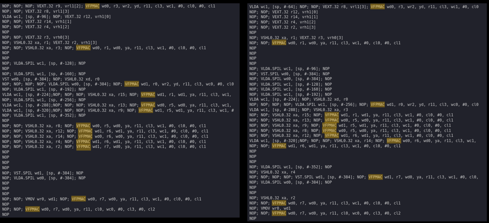

<table class="sphinxhide" width="100%">
 <tr width="100%">
    <td align="center"><h1>AI Engine Development</h1>
    <a href="https://www.xilinx.com/products/design-tools/vitis.html">See Vitis™ Development Environment on xilinx.com</br></a>
    <a href="https://www.xilinx.com/products/design-tools/vitis/vitis-ai.html">See Vitis-AI™ Development Environment on xilinx.com</a>
    </td>
 </tr>
</table>

# Implementing an IIR Filter on the AI Engine - Part 2b

***Version: Vitis 2023.1***

## Preliminaries

In Part 2a, we examined the generated assembler code and found a `NOP` (no operation) between the `VFPMAC` (vector floating-point multiply-accumulate) mnemonics. This `NOP` is unavoidable as a floating-point accumulation requires two cycles (see Fig. 26 of [AM009](https://www.xilinx.com/support/documentation/architecture-manuals/am009-versal-ai-engine.pdf)).

Two possible solutions exist to "squeeze out" the `NOPs` to allow a floating-point multiply-accumulate on each cycle.

* Split the matrix-vector multiplication into two separate multiply-accumulate operations to perform a floating-point accumulation on each cycle.
* Use fixed-point (which uses one cycle for accumulation).

We focus on splitting the floating-point matrix-vector multiplication in this section.

***Note:*** Instead of the "traditional" method of multiplying each row of the matrix by the column vector, we effectively scale each *column* of the matrix by the corresponding element in the vector with the multiply-accumulate API.


Thus, splitting the vector additions into even and odd parts allow us to perform independent multiply-accumulate operations:


Also, the AI Engine has two load units. The Julia program `aie_iir_2b.jl` is modified to split the matrix into even and odd columns and generate two separate header files.

We start by using the AI Engine APIs.

## Kernel Header
```C++
#ifndef __KERNEL_HPP__	// include guard to prevent multiple inclusion

	#define __KERNEL_HPP__

	#include <adf.h>			// Adaptive DataFlow header
	#include <aie_api/aie.hpp>	// header files for high-level intrinsics

	using Vector8f = aie::vector<float, 8>;		// vector of 8 floating-point elements
	using Vector16f = aie::vector<float, 16>;	// vector of 16 floating-point elements
	using VAcc8f = aie::accum<accfloat, 8>;		// accumulator with 8 floating-point elements

	define USE_API	// comment out to use low-level intrinsics

	const unsigned burst_cnt = 256;	// process burst_cnt * 8 samples per function invocation

	template<unsigned id>
	void SecondOrderSection(
		adf::input_buffer<float> & __restrict idata,	// 8 input samples per iteration
		adf::output_buffer<float> & __restrict odata,	// 8 output samples per iteration
		const float (&C_e)[48],		// run-time parameter: SIMD matrix of coefficients (even columns)
		const float (&C_o)[48]		// run-time parameter: SIMD matrix of coefficients (odd columns)
	);

#endif // __KERNEL_HPP__
```

## Kernel Code (AI Engine API)
```C++
#include <aie_api/aie_adf.hpp>

#include "kernel.hpp"

template<unsigned id>
void SecondOrderSection(
	adf::input_buffer<float> & __restrict idata,	// 8 input samples per iteration
	adf::output_buffer<float> & __restrict odata,	// 8 output samples per iteration
	const float (&C_e)[48],		// run-time parameter: SIMD matrix of coefficients (even columns)
	const float (&C_o)[48]		// run-time parameter: SIMD matrix of coefficients (odd columns)
) {
	static Vector8f state_reg = aie::zeros<float, 8>();	// clear states
	// input/output iterators
	auto inIter = aie::begin_vector<8>(idata);
	auto outIter = aie::begin_vector<8>(odata);
	for (auto i = 0; i < burst_cnt; i++) {
		Vector8f xreg_hi = *inIter++;		// fetch input samples
		Vector16f xreg = aie::concat(state_reg, xreg_hi);
		auto ecoeff_iter = aie::begin_vector<8>(&C_e[0]);
		auto ocoeff_iter = aie::begin_vector<8>(&C_o[0]);
		VAcc8f acc_e = aie::zeros<accfloat, 8>();	// even accumulator
		VAcc8f acc_o = aie::zeros<accfloat, 8>();	// odd accumulator
		for (auto j = 0; j < 6; j++) {
			acc_e = aie::mac(acc_e, xreg.get(2 * j + 4), *ecoeff_iter++);	// even columns
			acc_o = aie::mac(acc_o, xreg.get(2 * j + 5), *ocoeff_iter++);	// odd columns
		} // end for (auto j = 0; j < 6; j ++)
		acc_o = aie::add(acc_o, acc_e.to_vector());	// acc_o += acc_e
		Vector8f yout = acc_o.to_vector();
		// update states
		state_reg = xreg_hi;
		state_reg[4] = yout[6];
		state_reg[5] = yout[7];
		*outIter++ = yout;
	} // end for (auto i = 0; i < burst_cnt; i++)
} // end SecondOrderSection()

```
Note the two loops in the function:
```C++
for (auto i = 0; i < burst_cnt; i++) {	// process more samples to reduce overhead
	...
	for (auto j = 0; j < 6; j++) {	// matrix-vector multiplication
		...
	}
}
```

The outer `for` loop is added such that more samples can be processed during each function call, thereby reducing the ratio of function call cycles to processing cycles and improving throughput.

## Graph Code
```C++
#ifndef __GRAPH_H__			// include guard to prevent multiple inclusion

	#define __GRAPH_H__

	#include <adf.h>		// Adaptive DataFlow header

	#include "kernel.hpp"

	using namespace adf;

	// dataflow graph declaration
	class the_graph : public graph {	// inherit all properties of the adaptive     dataflow graph

		public:
			input_plio pl_in;
			output_plio pl_out;

			kernel section1;
			input_port cmtx_e;	// input port for SIMD matrix coefficients (even columns)
			input_port cmtx_o;	// input port for SIMD matrix coefficients (odd columns)

			// constructor
			the_graph() {

				// associate the kernel with the function to be executed
				section1 = kernel::create(SecondOrderSection<1>);

				pl_in = input_plio::create("Input", plio_32_bits, "data/input.dat");
				pl_out = output_plio::create("Output", plio_32_bits, "output.dat");

				const unsigned num_samples = 8 * burst_cnt;

				// declare buffer sizes
				dimensions(section1.in[0]) = {num_samples};
				dimensions(section1.out[0]) = {num_samples};

				// establish connections

				connect<parameter>(cmtx_e, adf::async(section1.in[1]));
				connect<parameter>(cmtx_o, adf::async(section1.in[2]));

				connect(pl_in.out[0], section1.in[0]);
				connect(section1.out[0], pl_out.in[0]);

				// specify which source code file contains the kernel function
				source(section1) = "kernel.cpp";

				// !!! temporary value: assumes this kernel dominates the AI engine tile !!!
				runtime<ratio>(section1) = 1.0;

			} // end the_graph()

	}; // end class the_graph

#endif // __GRAPH_H__
```

## Testbench Code
```C++
#include "kernel.hpp"
#include "graph.hpp"
#include "C1_e.h"
#include "C1_o.h"

using namespace std;

using namespace adf;

// specify the DFG
the_graph my_graph;

// main simulation program
int main() {

	my_graph.init();	// load the DFG into the AI engine array, establish connectivity, etc.

	my_graph.update(my_graph.cmtx_e, C1_e, 48);
	my_graph.update(my_graph.cmtx_o, C1_o, 48);

	my_graph.run(1);	// run the DFG for the specified number of iterations

	my_graph.end();		// housekeeping

	return (0);

} // end main()
```

## Analysis (using AI Engine API)
### Generated Code

There are 13 `VFPMAC`s in the generated assembly code: six for each even and odd column and another for summing the final accumulator results. The `VFPMAC` instructions are not as tightly packed. That is, some `VFPMAC`s have other instructions between them. There are two sections where the 13 `VFPMACs` occur, effectively halving the number of iterations in the outer loop.

### Throughput
The `burst_cnt` variable determines the number of samples processed during each function call. The inner loop processes eight samples per iteration, so the total number of processed samples is `burst_cnt` * 8.

The throughput is obtained as follows (see `api_thruput.xlsx`):

* Build and run the design.
* Open `aiesimulator_output/default.aierun_summary`.
* Get the `Total Function + Descendants Time (cycles)` for the `main` function (`num_cycles`).
* Throughput = `clk_freq` *(`burst_cnt`* 8)/num_cycles.

The throughput with a 1 GHz clock for different values of `burst_cnt` are as follows:

<b>IIR Throughput (with API)</b>
|                           |       |       |       |       |       |       |     |
|---------------------------|-------|-------|-------|-------|-------|-------|-------|
|burst_cnt					|1		|8		|16		|32		|64		|128	|256	|
|num_samples				|8		|64		|128	|256	|512	|1024	|2048	|
|num_cycles (API)			|187	|492	|940	|1836	|3628	|7212	|14379	|					
|API Throughput (Msa/sec)	|42.78	|130.08	|136.17	|139.43	|141.12	|141.99	|142.43	|

*clk_freq: 1 GHz

The AI Engine APIs are a header-only implementation that acts as a "buffer" between the user and the low-level intrinsics (LLI) to increase the level of abstraction.

We modify the kernel code to use low-level intrinsics (LLI).

## Kernel Code (LLI)
```C++
#include <aie_api/aie_adf.hpp>

#include "kernel.hpp"
template<unsigned id>
void SecondOrderSection(
	adf::input_buffer<float> & __restrict idata,	// 8 input samples per iteration
	adf::output_buffer<float> & __restrict odata,	// 8 output samples per iteration
	const float (&C_e)[48],		// run-time parameter: SIMD matrix of coefficients (even columns)
	const float (&C_o)[48]		// run-time parameter: SIMD matrix of coefficients (odd columns)
) {
	static v8float state_reg = null_v8float();
	// input/output iterators
	auto inIter = aie::begin_vector<8>(idata);
	auto outIter = aie::begin_vector<8>(odata);
	for (auto i = 0; i < burst_cnt; i++) {
		v8float xreg_hi = *inIter++;
		v16float xreg = concat(state_reg, xreg_hi);
		v8float acc_e = null_v8float();
		v8float acc_o = null_v8float();
		v8float *ptr_coeff_e = (v8float *)(&C_e[0]);
		v8float *ptr_coeff_o = (v8float *)(&C_o[0]);
		for (auto j = 0; j < 6; j++)
		chess_flatten_loop
		{
			acc_e = fpmac(acc_e, xreg, (2 * j + 4), 0, *ptr_coeff_e++, 0, 0x76543210);	// even columns
			acc_o = fpmac(acc_o, xreg, (2 * j + 5), 0, *ptr_coeff_o++, 0, 0x76543210);	// odd columns
		} // end for (auto j = 0; j < 6; j++)
		acc_o = fpadd(acc_o, acc_e);
		*outIter++ = acc_o;
		// update states
		state_reg = xreg_hi;
		state_reg = upd_elem(state_reg, 4, ext_elem(acc_o, 6));
		state_reg = upd_elem(state_reg, 5, ext_elem(acc_o, 7));
	} // end for (auto i = 0; i < burst_cnt; i++)
} // end SecondOrderSection()

```
***Note:***

* The use of the `chess_flatten_loop` pragma. This pragma unrolls the loop completely, eliminating the loop construct. Documentation on compiler pragmas can be found in the AI Engine Lounge.
* In the code provided, selecting between API and LLI is performed by defining or commenting out `USE_API` on line 17 of `kernel.hpp`.

The generated assembly code is as follows:

Note the tighter "spacing" between `VFPMAC`s. Also, the `SecondOrderSection<1>` function is "absorbed" into the main function, and there are *two* unrolled matrix-vector multiplication loops, effectively halving the number of iterations of the outer loop.

The measured throughput is as follows (see `lli_thruput.xlsx`):

<b>IIR Throughput (with LLI)</b>
|                           |       |       |       |       |       |       |     |
|---------------------------|-------|-------|-------|-------|-------|-------|-------|
|burst_cnt					|1		|8		|16		|32		|64		|128	|256	|
|num_samples				|8		|64		|128	|256	|512	|1024	|2048	|
|num_cycles (LLI)			|186	|250	|458	|874	|1706	|3370	|6698	|					
|LLI Throughput (Msa/sec)	|43.01	|256.00	|279.48	|292.91	|300.12	|303.86	|305.76	|

*clk_freq: 1GHz

Comparing the API and LLI throughput:


* LLI provides a better throughput than API for the same `burst_cnt`.
* The throughput "saturates" at around `burst_cnt` = 64.

## Conclusions
The AI Engine API is intended to improve productivity by increasing the level of abstraction relative to the low-level intrinsics.

We recommend using the AI Engine API and only low-level intrinsics to achieve more performance to meet target specifications.

Throughput may be improved using the following techniques:

* Reduce function call overhead by processing as many samples within the function as possible.
* For floating-point accumulation, use two accumulators with low-level intrinsics.

Can the throughput be improved even further?

* Floating-point allows 8 MACs per cycle. Using 32-bit fixed-point coefficients with 16-bit data allow 16 MACs per cycle, potentially doubling the throughput. 16-bit fixed-point coefficients with 16-bit data allow 32 MACs per cycle, potentially quadrupling the throughput. 16-bit fixed-point coefficients with 8-bit data allow 64 MACs per cycle, potentially improving the throughput by 8x.
* Assuming that we stick with a floating-point implementation, doubling the number of processed samples *and* the number of AI Engines (That is, two AI Engines, each processing eight samples from a 16-sample window) *may* double the throughput.

# Support

GitHub issues will be used for tracking requests and bugs. For questions go to [forums.xilinx.com](http://forums.xilinx.com/).

<p class="sphinxhide" align="center"><sub>Copyright © 2020–2023 Advanced Micro Devices, Inc</sub></p>

<p class="sphinxhide" align="center"><sup><a href="https://www.amd.com/en/corporate/copyright">Terms and Conditions</a></sup></p>