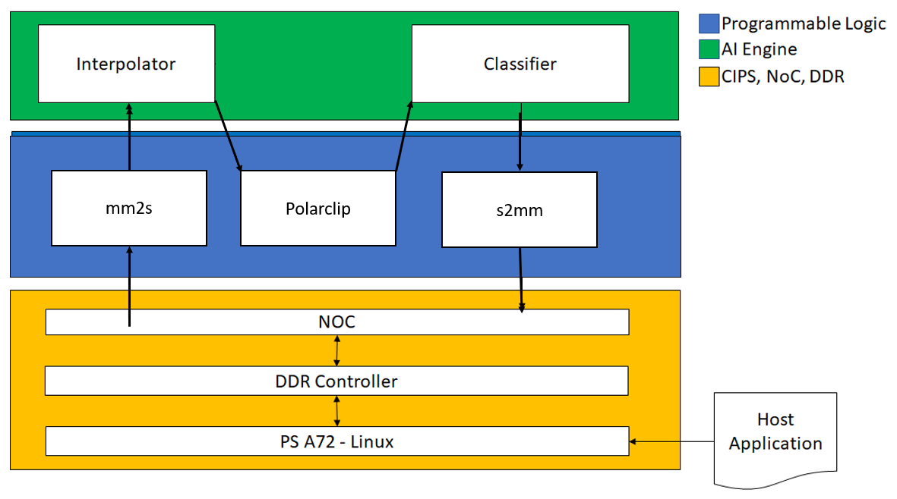
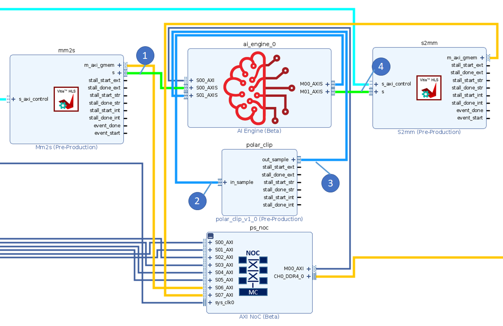

<table class="sphinxhide" width="100%">
 <tr width="100%">
    <td align="center"><h1>Versal® ACAP AI Engine Tutorials</h1>
    <a href="https://www.xilinx.com/products/design-tools/vitis.html">See Vitis™ Development Environment on xilinx.com</br></a>
    <a href="https://www.xilinx.com/products/design-tools/vitis/vitis-ai.html">See Vitis™ AI Development Environment on xilinx.com</a>
    </td>
 </tr>
</table>

# Using RTL IP with AI Engines

***Version: Vitis 2023.1***

## Introduction

This tutorial demonstrates the following two features of the Vitis™ unified software platform flow:

1. Ability to reuse any AXI-based IP you have created as an RTL IP.
2. The ability to control your platform, and convert your RTL IP to an RTL kernel allows for a more streamlined process for creating the design you need.

**IMPORTANT**: Before beginning the tutorial make sure you have installed the Vitis 2023.1 software.  The Vitis release includes all the embedded base platforms including the VCK190 base platform that is used in this tutorial. In addition, do ensure you have downloaded the Common Images for Embedded Vitis Platforms from this link 

https://www.xilinx.com/support/download/index.html/content/xilinx/en/downloadNav/embedded-platforms/2023-1.html

The 'common image' package contains a prebuilt Linux kernel and root file system that can be used with the Versal™ board for embedded design development using Vitis.
Before starting this tutorial run the following steps:

1. Goto the directory where you have unzipped the Versal Common Image package
2. In a Bash shell run the /Common Images Dir/xilinx-versal-common-v2023.1/environment-setup-cortexa72-cortexa53-xilinx-linux script. This script sets up the SDKTARGETSYSROOT and CXX variables. If the script is not present, you must run the /Common Images Dir/xilinx-versal-common-v2023.1/sdk.sh.
3. Set up your ROOTFS, and IMAGE to point to the rootfs.ext4 and Image files located in the /Common Images Dir/xilinx-versal-common-v2023.1 directory.
4. Set up your PLATFORM_REPO_PATHS environment variable to $XILINX_VITIS/lin64/Vitis/2023.1/base_platforms/xilinx_vck190_base_202310_1/xilinx_vck190_base_202310_1.xpfm

This tutorial targets VCK190 production board for 2023.1 version.

## Objectives

In this tutorial you will learn:

* How to create a custom RTL kernel (outside the ADF graph) to be used with the ADF graph.
* How to modify the ADF graph code to incorporate PLIO between AIE and RTL kernels.

## Tutorial Overview

**Step 1**: Create custom RTL kernels with the Vivado&trade; Design Suite.

**Step 2**: Create HLS kernels with Vitis&trade; compiler.

**Step 3**: Interface ADF graph to Programmable Logic.

**Step 4**: Build XCLBIN.

**Step 5**: Building Host Application.

**Step 6**: Package.

**Step 7**: Run Emulation.

The design that will be used is shown in the following figure:



|Kernel|Type|Comment|
|  ---  |  ---  |  ---  |
|MM2S|HLS|Memory Map to Stream HLS kernel to feed input data from DDR to AI Engine interpolator kernel via the PL DMA.|
|Interpolator |AI Engine| Half-band 2x up-sampling FIR filter with 16 coefficients. Its input and output are cint16 window interfaces and the input interface has a 16 sample margin. |
|Polar_clip|RTL Engine| Determines the magnitude of the complex input vector and clips the output magnitude if it is greater than a threshold. The polar_clip has a single input stream of complex 16-bit samples, and a single output stream whose underlying samples are also complex 16-bit elements.|
|Classifier |AI Engine| This kernel determines the quadrant of the complex input vector and outputs a single real value depending which quadrant. The input interface is a cint16 stream and the output is a int32 window.  |
|S2MM|HLS|Stream to Memory Map HLS kernel to feed output result data from AI Engine classifier kernel to DDR via the PL DMA.|


## Step 1 - Creating custom RTL kernels with the Vivado Design Suite

Package your RTL code as a Vivado IP and generate a Vitis RTL kernel.

1. Open the `polar_clip_rtl_kernel.tcl` file.
2. This Tcl script creates an IP following the Vivado IP Packaging flow as described in the [Creating and Packaging Custom IP User Guide (UG1118)](https://docs.xilinx.com/r/en-US/ug1118-vivado-creating-packaging-custom-ip/Creating-and-Packaging-Custom-IP).

    Note the following points:

    * The script creates a Vivado Design Suite project; this is required to create any IP because all source and constraint files need to be local to the IP.
    * Lines 40 and 41 are used to associate the correct clock pins to the interfaces. This is required for the Vitis compiler which links those interfaces to the platform clocking.

        ```tcl
        ipx::associate_bus_interfaces -busif in_sample -clock ap_clk [ipx::current_core]
        ipx::associate_bus_interfaces -busif out_sample -clock ap_clk [ipx::current_core]
        ```
    * On lines 44 and 45 the `FREQ_HZ` bus parameter is removed. This parameter is used in IP integrator, and is to make sure the associated clock of the interface is used correctly. However, the Vitis compiler sets this during the compilation process, and having it set in the IP will cause the compiler to incorrectly link the clocks.

        ```tcl
        ipx::remove_bus_parameter FREQ_HZ [ipx::get_bus_interfaces in_sample -of_objects [ipx::current_core]]
        ipx::remove_bus_parameter FREQ_HZ [ipx::get_bus_interfaces out_sample -of_objects [ipx::current_core]]
        ```

    * At the end of the script there is the `package_xo` command. This command analyzes the IP that was created to make sure proper AXI interfaces are used and other rule checks are followed. It then creates the XO file in the same location as the IP repository. A key function used in this command is the `-output_kernel_xml`. The `kernel.xml` file is key to the RTL kernel as it describes to the Vitis tool how the kernel should be controlled. You can find more information on RTL kernels and their requirements [here](https://docs.xilinx.com/r/en-US/ug1393-vitis-application-acceleration/Packaging-RTL-Kernels).

        ```tcl
        package_xo -kernel_name $kernelName \
            -ctrl_protocol ap_ctrl_none \
            -ip_directory [pwd]/ip_repo/$kernelName \
            -xo_path [pwd]/ip_repo/${kernelName}.xo \
            -force -output_kernel_xml [pwd]/ip_repo/kernel_${kernelName}_auto.xml
        ```

3. To complete this step run the following command:

    ```bash
    vivado -source polar_clip_rtl_kernel.tcl -mode batch
    ```

    or

    ```bash
    make polar_clip.xo
    ```

## Step 2 - Creating HLS kernels with Vitis compiler
The `mm2s` and `s2mm` kernels are HLS-based and use the Vitis compiler to compile them into XO files. 

To build these kernels run the following commands:

```bash
v++ -c --platform <path_to_platform/platform.xpfm> -g --save-temps -k mm2s pl_kernels/mm2s.cpp -o mm2s.xo
v++ -c --platform <path_to_platform/platform.xpfm> -g --save-temps -k mm2s pl_kernels/s2mm.cpp -o s2mm.xo
```

or

```bash
make kernels
```

## Step 3 - Interfacing ADF graph to Programmable Logic
To set up the ADF graph to interface with the `polar_clip` RTL kernel and the `mm2s` and `s2mm` HLS kernels, you must add connections to PLIOs that represent the respective PL kernels.

1. The following `graph.h` shows how to connect to the RTL kernel.

    ```cpp
      adf::source(interpolator) = "kernels/interpolators/hb27_2i.cc";
      adf::source(classify)    = "kernels/classifiers/classify.cc";
      
      //Input PLIO object that specifies the file containing input data
      in = adf::input_plio::create("DataIn1", adf::plio_32_bits,"data/input.txt");
      clip_out = adf::input_plio::create("clip_out", adf::plio_32_bits,"data/input2.txt");
      
      //Output PLIO object that specifies the file containing output data
      out = adf::output_plio::create("DataOut1",adf::plio_32_bits, "data/output.txt");
      clip_in = adf::output_plio::create("clip_in",adf::plio_32_bits, "data/output1.txt");

      connect(in.out[0], interpolator.in[0]);
      connect(interpolator.out[0], clip_in.in[0]);
      connect(clip_out.out[0], classify.in[0]);
      connect(classify.out[0],out.in[0]);

    ```

2. Note the following:
   * Two additional `PLIO` objects `clip_in` and `clip_out` are added. These are to hook up to the `polar_clip` RTL kernel.
   * There are additional net objects to hook up the RTL kernel to the rest of the platform object.

For more information on RTL kernels in the AI Engine see: [Design Flow Using RTL Programmable Logic](https://www.xilinx.com/cgi-bin/docs/rdoc?t=vitis+doc;v=2022.1;d=programmable_logic_integration.html;a=rdd1604332009149).

3. Compile the graph using the following command:

   ```bash
   aiecompiler --target=hw -include="$XILINX_VITIS/aietools/include" -include="./aie" -include="./data" -include="./aie/kernels" -include="./"  -workdir=./Work  aie/graph.cpp
   ```

   or

   ```bash
   make aie
   ```

## Step 4 - Building XCLBIN
Because there is no HLS kernel in the ADF graph, the `system.cfg` file, which is used to determine connectivity, needs to reflect the new AI Engine interfacing.

1. Open the `system.cfg` file and the `sc` options and note that there are two lines specific to the `polar_clip` kernel. Note that the name of the interfaces are the same as defined previously in the code snippet for the `graph.h` file where the first parameter of the PLIO object is instantiated.

    ```yaml
    [connectivity]
    sc=mm2s_1.s:ai_engine_0.DataIn1
    sc=ai_engine_0.clip_in:polar_clip_1.in_sample
    sc=polar_clip_1.out_sample:ai_engine_0.clip_out
    sc=ai_engine_0.DataOut1:s2mm_1.s
   ```
2. Close `system.cfg`.
3. Build the emulation design using the following command:

    ```bash
    v++ -l --platform <path_to_platform/platform.xpfm> s2mm.xo mm2s.xo polar_clip.xo libadf.a -t hw_emu --save-temps -g --config system.cfg -o tutorial.xsa
    ```

    or

   ```bash
   make xclbin
   ```

## Step 5 - Build Host Application
The user needs to make sure to use the appropriate `SYSROOT` path for the design.

Build the host application:

```bash
aarch64-linux-gnu-g++ -Wall -c -std=c++14 -Wno-int-to-pointer-cast \
    --sysroot=<path_to_sysroot/cortexa72-cortexa53-xilinx-linux>  \
    -I<path_to_sysroot/cortexa72-cortexa53-xilinx-linux/usr/include/xrt> \
    -I<path_to_sysroot/cortexa72-cortexa53-xilinx-linux/usr/include> \
    -o host.o host.cpp
aarch64-linux-gnu-g++ *.o -lxrt_coreutil \
    --sysroot=<path_to_sysroot/cortexa72-cortexa53-xilinx-linux> \
    -std=c++14 -o host.exe

or

```bash
make host
```

## Step 6 - Package
When packaging the design, make sure that the `rootfs`, `kernel_image`, and `platform` all point to the platform. If any of these items are not correct, packaging can throw an error, or, if it does package, then the emulation will malfunction.

To package the design run:

```bash
cd ./sw
v++ -p -t hw_emu \
    -f <path_to_platform/platform.xpfm> \
    --package.rootfs=<path_to_rootfs/rootfs.ext4> \
    --package.image_format=ext4 \
    --package.boot_mode=sd \
    --package.kernel_image=<path_to_platform_image/Image> \
    --package.defer_aie_run \
    --package.sd_file host.exe ../tutorial.xsa ../libadf.a
cd ..
```

or

```bash
make package
```

## Step 7 - Run Emulation
After packaging, everything is ready to run emulation or to run on hardware.

1. To run emulation use the following command:

    ```bash
    make run_emu
    ```

    or

    ```bash
    cd ./sw
    ./launch_hw_emu.sh
    cd ..
    ```

When launched, use the Linux prompt to run the design.

2. Execute the following command when the emulated Linux prompt displays:


    ```bash
    ./host.exe a.xclbin
    ```

You should see an output displaying **TEST PASSED**. When this is shown, run the keyboard command: `Ctrl+A x` to end the QEMU instance.

### To View Emulation Waveforms
The following image shows a debug waveform to show the data movement through the system. The general flow of data is as follows:

* Data goes from DDR memory to the AI Engine through the `mm2s` kernel.
* The ADF graph processes the data and sends data to the `polar_clip` kernel.
* The `polar_clip` kernel processes data and sends it back to the ADF graph.
* The AI Engine sends the resulting graph output to the `s2mm` kernel to store in DDR memory.




1. Launch the emulation from the `sw` directory with `./launch_hw_emu.sh -g` command. The `-g` option tells the script to launch the Vivado Simulator (`xsim`) Waveform GUI as shown in the preceding image.
2. When the GUI opens up, add waveforms to the waveform viewer or you can use the existing `.wcfg` file in the repo by selecting **File > Simulation Waveform > Open Configuration**, locate the `custom.wcfg`, and click **OK**.
3. Click **Run > Run All** or **F3**.

### Summary

This tutorial shows how to:
* Create a custom RTL kernel from a Vivado IP.
* Modify the ADF graph to handle more PLIO interfacing.
* Build and execute the design in emulation.


<p class="sphinxhide" align="center"><sub>Copyright © 2020–2023 Advanced Micro Devices, Inc</sub></p>

<p class="sphinxhide" align="center"><sup><a href="https://www.amd.com/en/corporate/copyright">Terms and Conditions</a></sup></p>
