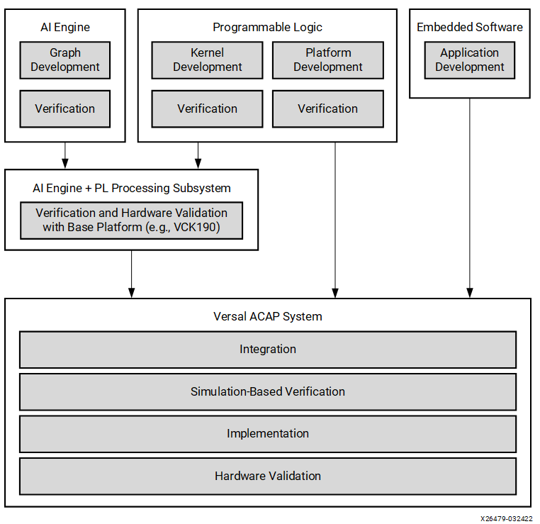

<table class="sphinxhide" width="100%">
 <tr width="100%">
    <td align="center"><h1>AI Engine Development</h1>
    <a href="https://www.xilinx.com/products/design-tools/vitis.html">See Vitis™ Development Environment on xilinx.com </a>
    <a href="https://www.xilinx.com/products/design-tools/vitis/vitis-ai.html">See Vitis™ AI Development Environment on xilinx.com</a>
    </td>
 </tr>
</table>

# AI Engine A-to-Z Flow for Linux

***Version: Vitis 2022.2***

## Introduction

The Vitis™ environment comprises tools, libraries, and IP that let you program, run, and debug the different elements of a Versal® ACAP application, including AI Engine kernels and graphs, programmable logic (PL) functions, and software applications running on the processing system (PS). The Vitis tools use a platform-based approach in which the system is conceptually divided into the following elements, which can be developed and tested in parallel:

* **Platform** - Platforms provide the foundational hardware IP blocks and software features upon which the adaptable subsystem and software application can be built and integrated.
* **Adaptable subsystem** - Adaptable subsystems perform well-defined functions, leveraging PL blocks and AI Engine graphs
* **Software application** - The software application runs on the PS and performs high-level application tasks while interacting with the adaptable subsystem.

This tutorial introduces you to this platform-based approach to develop the elements mentioned above individually and leverage the parallelism to develop and test the application. The adaptable subsystem that contains the PL kernels and AI Engine graph can be developed and tested on the Xilinx® standard base platform, while the custom platform that best suits your application is still under development. This tutorial also demonstrates how you can easily validate the design by means of hardware emulation or hardware using the base platform, and quickly switch to the custom platform with minimal changes.

### Methodology Overview
The following figure shows a high-level representation of the development methodology based on the Vitis environment design flow.

The Vitis environment development methodology reflects the heterogeneous nature of Versal® ACAP systems, which typically consist of PS, PL and AI Engine functionality. Using the Vitis tools, you can develop and verify these components independently and gradually integrate them to form the final system. 

The foundation of the Vitis environment design methodology is an iterative approach and parallel development. As a result, Xilinx strongly recommends the following best practices:

* Develop the adaptable subsystem and the custom platform in parallel.
* Debug and verify the AI Engine graph and each of the PL kernels individually before proceeding with integration.
* Use a standard Xilinx platform (such as the vck190) to integrate and verify the adaptable subsystem comprised of the AI Engine graph and PL kernels before targeting the custom platform and ensure performance goals are met at each stage of the flow..
  * Xilinx platforms are pre-verified and ready to be deployed on hardware. By using a Xilinx standard base platform, developers of AI Engine graphs and PL kernels can verify the adaptable subsystem using simulation or hardware boards without the uncertainties and the complexities of the custom platform.
* Develop and verify the custom platform.
* Integrate the subsystem with the custom platform and test the integration.
 

The steps in this tutorial are tightly coupled with the recommended best practices and introduce you to a complete end-to-end flow for a Linux-based host application for AI Engines and PL kernels using a base platform. You can then create a custom platform and re-target the design using the custom platform.

**IMPORTANT**: Before beginning the tutorial make sure you have read and followed the *Vitis Software Platform Release Notes* (v2022.2) for setting up software and installing the VCK190 base platform.

## Objectives

After completing this tutorial, you should be able to:

* Run the system design targeting the base platform.
* Create a custom platform.
* Re-target the design that was using the VCK190 base platform to now use the custom platform.
  The steps include:
  * Re-compiling ADF graphs targeting the custom platform
  * Re-compiling Programmable Logic (PL) kernels targeting the custom platform.
  * Exploring Vitis™ Analyzer for viewing the compilation and simulation summary reports. 
  * Re-linking and re-packaging the design to run hardware emulation and hardware.

## Tutorial
Run these three steps to complete this tutorial.
* Step 1: Run system design targeting the base platform
* Step 2: Create a custom platform
* Step 3: Run the system design targeting the custom platform

**Note**: Step 1 and Step 2 can be performed in any order.

## Step 1: Run system design targeting the base platform 

This step walks you through the complete flow of creating a system design running on the AI Engine, PS, and PL targeting the base platform. The base platforms are pre-verified, which provides a stable foundation to built upon, allowing you to focus on AI Engine graph and PL kernels. Xilinx highly recommends that you debug and address all performance issues, such as deadlocks, stalls, or bubbles, using a base platform before integrating the subsystem with the custom platform.

You will validate the design running on these heterogeneous domains by software emulation, hardware emulation and then running on actual hardware. 

1. Click the link below, and follow the step-by-step procedure to run the design targeting the base platform.

   **Note: The link redirects you to a different tutorial location.**

    [Running system design on AI Engine, PS, and PL using base platform](../05-AI-engine-versal-integration/README.md)

2. When you have completed the step-by-step procedure at the link above, return to this page and proceed to Step 2.

## Step 2: Create a custom platform 

In this step you will create a custom platform based on the VCK190 Evaluation board. 

1. Click the link below, and follow the step-by-step procedure to complete this step.

   **Note: The link below redirects you to the different tutorial location.**

   [Creating Custom Platfom based on VCK190 Evaluation board](../../../Getting_Started/Vitis_Platform/README.md)

   **Note**: You can either create custom embedded acceleration platforms by building from scratch, or modifing Xilinx embedded platforms. This module focuses on quickly creating a platform using a Versal ACAP extensible embedded platform example.
2. When you have completed the step-by-step procedure at the link above, return to this page and proceed to Step 3.

## Step 3: Run the system design targeting the custom platform

Next, you will re-target the design from Step 1 on the custom platform created in Step 2. 

1. Click the link below, and follow the step-by-step procedure to complete this step.

    [AI Engine Graph Integration and Validation using a Custom Linux Platform](steps_to_run_design_on_cust_plfm.md).

To read more about the AI Engine flow, see the *Versal ACAP AI Engine Programming Environment User Guide* ([UG1076](https://docs.xilinx.com/r/en-US/ug1076-ai-engine-environment)).

# Support

GitHub issues will be used for tracking requests and bugs. For questions go to [support.xilinx.com](https://support.xilinx.com/).

# License

Licensed under the Apache License, Version 2.0 (the "License"); you may not use this file except in compliance with the License.

You may obtain a copy of the License at [http://www.apache.org/licenses/LICENSE-2.0]( http://www.apache.org/licenses/LICENSE-2.0 )

Unless required by applicable law or agreed to in writing, software distributed under the License is distributed on an "AS IS" BASIS, WITHOUT WARRANTIES OR CONDITIONS OF ANY KIND, either express or implied. See the License for the specific language governing permissions and limitations under the License.

 XD145 | &copy; Copyright 2022 Xilinx, Inc.

