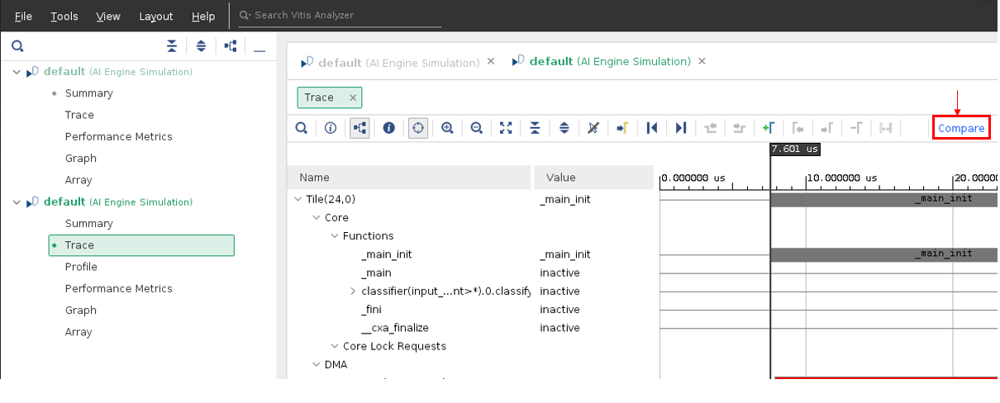
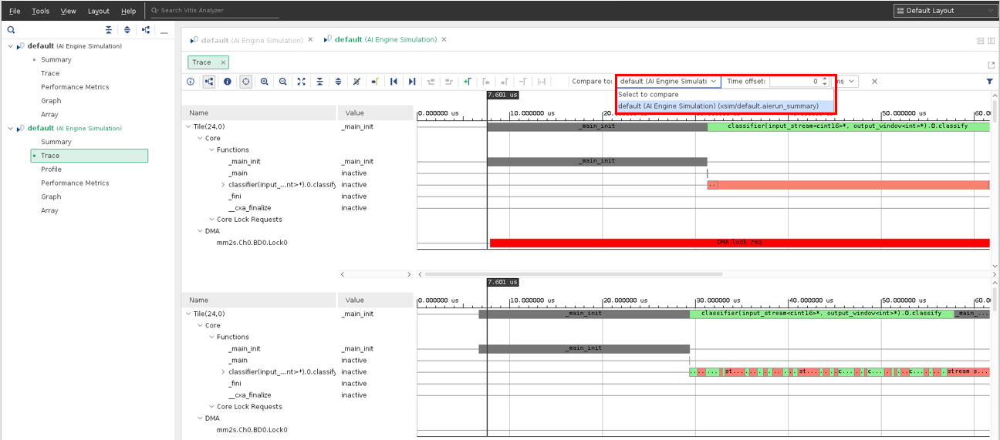

<table class="sphinxhide" width="100%">
 <tr width="100%">
    <td align="center"><h1>AI Engine Development</h1>
    <a href="https://www.xilinx.com/products/design-tools/vitis.html">See Vitis™ Development Environment on xilinx.com</br></a>
    <a href="https://www.xilinx.com/products/design-tools/vitis/vitis-ai.html">See Vitis™ AI Development Environment on xilinx.com</a>
    </td>
 </tr>
</table>

# AI Engine Graph Integration and Validation using a Custom Linux Platform

***Version: Vitis 2023.1***

In this tutorial, you will use the design sources that are used to run the system design on base platform in [Running system design on AI Engine, PS, and PL using base platform](../05-AI-engine-versal-integration/README.md). You will re-target the design to use the custom platform created in [Creating Custom Platfom based on VCK190 Evaluation board](../../../Getting_Started/Vitis_Platform/README.md).

To read more about the AI Engine flow, see the *Versal ACAP AI Engine Programming Environment User Guide* ([UG1076](https://docs.xilinx.com/r/en-US/ug1076-ai-engine-environment)).

## Prerequisites
 
As described in [AI Engine A-to-Z Flow for Linux](README.md), two steps (tutorials) must be run before running this tutorial.

*   **Run system design targeting the base platform**. Follow the step-by-step procedure in [Running system design on AI Engine, PS, and PL using base platform](../05-AI-engine-versal-integration/README.md) to complete this step.

*  **Create a custom platform**. Follow the step-by-step procedure in [Creating Custom Platfom based on VCK190 Evaluation board](../../../Getting_Started/Vitis_Platform/README.md) to complete this step.

After you complete these prerequisite tutorials, you are ready to run AI Engine graph integration and validation using a custom Linux platform. 

**IMPORTANT**: Before beginning the tutorial, make sure that you have read and followed the *Vitis Software Platform Release Notes* (v2023.1) for setting up software and installing the VCK190 base platform.


## Setting up the environment

First, set up the environment for integrating the subsystem with the custom platform and validating the design using the hardware emulation and hardware as follows:

1. Set up your `PLATFORM_REPO_PATHS` environment variable based upon where you created the custom platform during Step 2.
   For example, if the custom platform is created in the path `<vck190_custom_path>/export/vck190_custom/`, the `PLATFORM_REPO_PATHS `should be set accordingly.
2. Change the `BASE_PLATFORM` in the [Makefile](../05-AI-engine-versal-integration/Makefile) to point to the custom `.xpfm` file created in the `<vck190_custom_path>/export/vck190_custom/` directory. 

   For example: `BASE_PLATFORM = ${PLATFORM_REPO_PATHS}/vck190_custom.xpfm`

3. Make sure your `ROOTFS` and `IMAGE` are still pointing to the `xilinx-versal-common-v2023.1` directory. 
   
   **Note** : The `$PLATFORM_REPO_PATHS` now points to the custom platform and it does not contain the `rootfs.ext4` and `Image` files as pointed in the Makefile.
   
 Note that all other commands in the Makefile remain the same. Only the platform needs to be changed for re-targeting the design using custom platform.  

 ## Re-compiling ADF graph
 
After making the necessary environment changes, re-compile the ADF graph targeting the custom platform using the command below:

 ```bash
 make aie TARGET=hw
 ```

or

```bash
aiecompiler --target=hw --platform $PLATFORM_REPO_PATHS/vck190_custom.xpfm -include="$XILINX_VITIS/aietools/include" -include="./aie" -include="./data" -include="./aie/kernels" -include="./" -workdir=./Work aie/graph.cpp`
```

## Re-compiling Programmable Logic (PL) kernels targeting the custom platform
Re-compile the PL kernets targeting the custom platform using the command below:

 ```bash
 make kernels TARGET=hw
 ```

or

```bash
v++ -c --platform $PLATFORM_REPO_PATHS/vck190_custom.xpfm --save-temps -g -k s2mm pl_kernels/s2mm.cpp -o s2mm.xo
v++ -c --platform $PLATFORM_REPO_PATHS/vck190_custom.xpfm --save-temps -g -k mm2s pl_kernels/mm2s.cpp -o mm2s.xo
```

## Hardware Emulation

Next, rrun the Hardware Emulation targeting the custom platform as follows:

1. Link AI Engine & PL kernels with platform.

   ```bash
   make xsa TARGET=hw_emu
   ```

   or

   ```bash
   v++ -l --platform $PLATFORM_REPO_PATHS/vck190_custom.xpfm s2mm.xo mm2s.xo libadf.a -t hw_emu --save-temps -g --config system.cfg -o tutorial.xsad
   ```

2. Compile the A72 Host Application.

   ```bash
   make host
   ```  

   or

   ```bash
   cd ./sw

   aarch64-xilinx-linux-g++ -Wall -c -std=c++14 -Wno-int-to-pointer-cast --sysroot=$SDKTARGETSYSROOT -I$SDKTARGETSYSROOT/usr/include/xrt -I$SDKTARGETSYSROOT/usr/include -I./ -I../aie -I$XILINX_VITIS/aietools/include -I$XILINX_VITIS/include -o main.o .cpp

   aarch64-xilinx-linux-g++ main.o -lxrt_coreutil -L$SDKTARGETSYSROOT/usr/lib --sysroot=$SDKTARGETSYSROOT -L$XILINX_VITIS/aietools/lib/aarch64.o -o host.exe
   cd ..
   ```

3. Package the Design.

   ```bash
   make package TARGET=hw_emu
   ```

   or

   ```bash
   cd ./sw
   v++ --package -t hw_emu \
      -f $PLATFORM_REPO_PATHS/vck190_custom.xpfm \
      --package.rootfs=$ROOTFS \
      --package.image_format=ext4 \
      --package.boot_mode=sd \
      --package.kernel_image=$IMAGE \
      --package.defer_aie_run \
      --package.sd_file host.exe ../tutorial.xsa ../libadf.a
   cd ..
   ```

4. Run Hardware Emulation.

   ```bash
   make run_emu TARGET=hw_emu
   ```

   or

   ```bash
   cd ./sw
   ./launch_hw_emu.sh -aie-sim-options ../aiesimulator_output/aiesim_options.txt -add-env AIE_COMPILER_WORKDIR=../Work
   ```

5. Execute the following command when the emulated Linux prompt finally appears.

   ```bash
   cd /run/media/*1
   export XILINX_XRT=/usr
   dmesg -n 4 && echo "Hide DRM messages..."
   ```

6. Run the design using the following command.

   ```bash
   ./host.exe a.xclbin
   ```

7. You should see an output displaying TEST PASSED. When this is shown, run the keyboard command: `Ctrl+A x` to end the QEMU instance.

8. You can view the profiling and trace results of hardware emulation in an AMD Vitis™ Analyzer by running the following command:

**Note**: The Trace **Compare** feature is not available in the New Vitis IDE Analysis view. So, use the classic Vitis Analyzer for this.

```bash
vitis_analyzer --classic sw/sim/behav_waveform/default.aierun_summary
```

9. You can easily compare the results of the custom platform with the one generated using base platform. For example:

* Select **File > Open Summary** to open the summary file generated for the base platform target. 
* Once the summary file opens, click **Trace**  to open the VCD data which gives information about kernels, tiles and nets within the AI Engine. 
* Click the **Compare** option as shown in the following figure.



* From the drop down, select the trace output of other summary file as highlighted below. 



## Targeting Hardware

You can easily build for hardware by following the steps below.

**Note**: Because you already compiled the AI Engine graph and PL kernels for hardware emulation in the previous step, you do not need to re-compile them again for targeting the hardware. However, re-link and re-package for hardware run.

1. Link AI Engine and PL kernels with the platform:

   ```bash
   make xsa TARGET=hw
   ```

   or

   ```bash
   v++ -l --platform $PLATFORM_REPO_PATHS/vck190_custom.xpfm s2mm.xo mm2s.xo libadf.a -t hw --save-temps -g --config system.cfg -o   tutorial.xsa
   ```

2. Re-run the packaging step with:

   ```bash
   make package TARGET=hw
   ```

   or

   ```bash
   cd ./sw
   v++ --package -t hw \
      -f $PLATFORM_REPO_PATHS/vck190_custom.xpfm \
      --package.rootfs=$ROOTFS \
      --package.image_format=ext4 \
      --package.boot_mode=sd \
      --package.kernel_image=$IMAGE \
      --package.defer_aie_run \
      --package.sd_file host.exe ../tutorial.xsa ../libadf.a
   cd ..
   ```

   When you run on hardware, ensure that you have a supported SD card. Format the SD card with the `sw/sd_card.img` file. Then plug the SD card into the board and power it up.

3. When a Linux prompt appears, run the following commands:

   ```bash
   dmesg -n 4 && echo "Hide DRM messages..."
   cd /run/media/*1
   export XILINX_XRT=/usr
   ./host.exe a.xclbin
   ```

   You should see TEST PASSED. You have successfully run your design on hardware.
   
To read more about the AI Engine flow, see the *Versal ACAP AI Engine Programming Environment User Guide* ([UG1076](https://docs.xilinx.com/r/en-US/ug1076-ai-engine-environment)).

### Support

GitHub issues will be used for tracking requests and bugs. For questions go to [support.xilinx.com](https://support.xilinx.com/).


<p class="sphinxhide" align="center"><sub>Copyright © 2020–2023 Advanced Micro Devices, Inc</sub></p>

<p class="sphinxhide" align="center"><sup><a href="https://www.amd.com/en/corporate/copyright">Terms and Conditions</a></sup></p>
