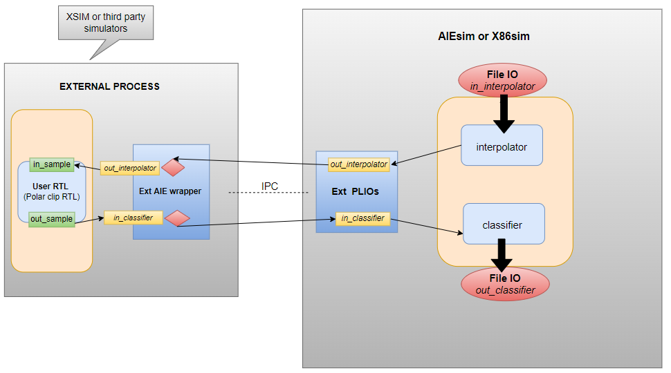
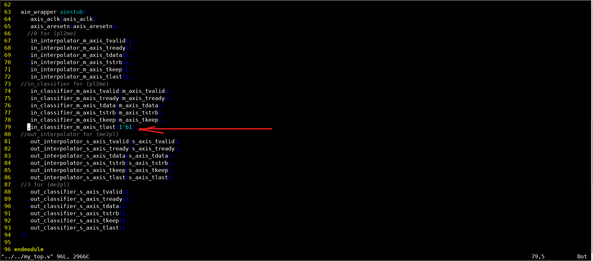
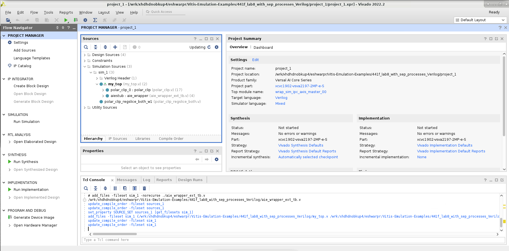
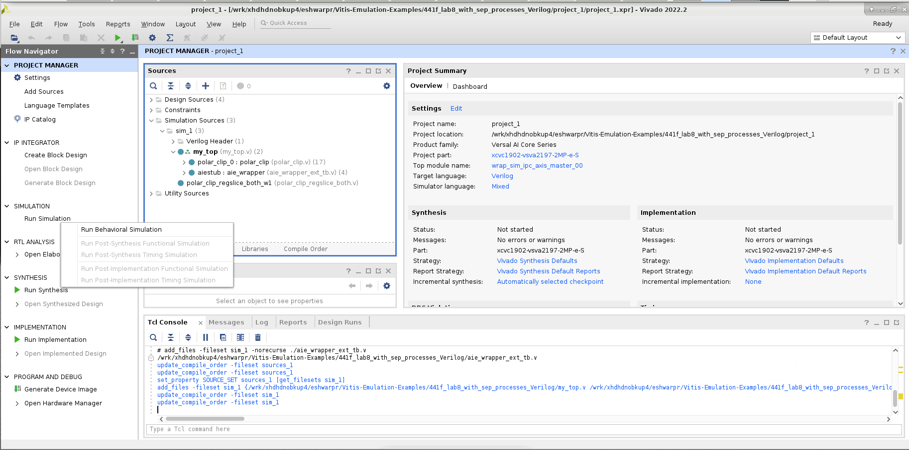
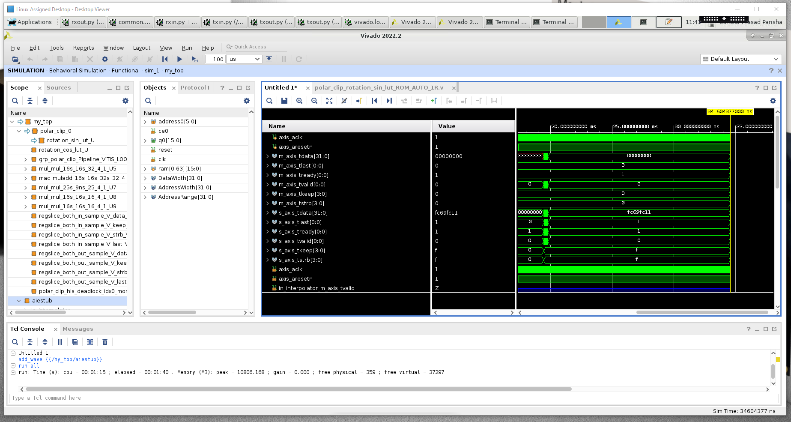

<table class="sphinxhide" width="100%">
 <tr width="100%">
    <td align="center"><h1>AI Engine Development</h1>
    <a href="https://www.xilinx.com/products/design-tools/vitis.html">See Vitis™ Development Environment on xilinx.com</br></a>
    <a href="https://www.xilinx.com/products/design-tools/vitis/vitis-ai.html">See Vitis™ AI Development Environment on xilinx.com</a>
    </td>
 </tr>
</table>

# Using Verilog traffic generators in AIE simulation

***Version: Vitis 2022.2***

## Table of Contents

* [Introduction](#introduction)

* [Objectives](#objectives)

* [Before You Begin](#before-you-begin)

* [Documentation](#documentation)

* [Tutorial Overview](#tutorial-overview)

* [Support](#support)

* [License](#license)

## Introduction

The Xilinx® Versal® adaptive compute acceleration platform (ACAP) is a fully software-programmable, heterogeneous compute platform that combines the processing system (PS) (Scalar Engines that include Arm® processors), Programmable Logic (PL) (Adaptable Engines that include the programmable logic), and AI Engines which belong in the Intelligent Engine category. 

## Objectives

After completing this tutorial, you should be able to: 

* Use Verilog or System Verilog modules to drive traffic in and out of an ADF graph running in the AIE Simulator.

* Create a setup for Verilog/SV based traffic generator running with AIEsim or x86sim process. 

* Integrate your own RTL running in external process with AIEsim or x86sim process. 

* Run the external Verilog/System Verilog based traffic generator with XSIM as well as other third party simulators. 

* Use python based automation to generate vivado TCL scripts and aie instantiable module for your external testbench.

* To learn about other traffic generators i.e C/Python based traffic generators in AIEsim/x86sim or HW Emulation/SW emulation flows. 

## Before You Begin 

1. Before beginning the tutorial make sure you have read and followed the *Vitis Software Platform Release Notes* (v2022.2) for setting up software and installing the VCK190 base platform.
2. You may refer [Vivado Design Suite User Guide: Logic Simulation (UG900)](https://docs.xilinx.com/r/en-US/ug900-vivado-logic-simulation/Simulating-with-Third-Party-Simulators) for third-party simulator setup.
3. Obtain licenses for the AI Engine tools
4. Go through the **Documentation** section below for more information on Installing the Tools, AI Engine flow and Traffic Generators.  

## Documentation

### Explore AI Engine Architecture

* [Versal ACAP AI Engines for Dummies](https://forums.xilinx.com/t5/Design-and-Debug-Techniques-Blog/Versal-ACAP-AI-Engines-for-Dummies/ba-p/1132493)

* [AM009 AI Engine Architecture Manual](https://docs.xilinx.com/r/en-US/am009-versal-ai-engine/AI-Engine-Architecture)

* [Building the AI Engine Graph](https://docs.xilinx.com/r/en-US/ug1076-ai-engine-environment/Building-the-AI-Engine-Graph)

### Traffic Generator

* [Generating Traffic for Simulation and Emulation](https://docs.xilinx.com/r/en-US/ug1076-ai-engine-environment/Generating-Traffic-for-Simulation-and-Emulation)

### Installing the Tools

* [AI Engine Tools lounge](https://www.xilinx.com/member/versal_ai_tools_ea.html)

* [UG1076 Versal ACAP AI Engine Programming Environment](https://www.xilinx.com/member/versal_ai_core_docs_ea.html)

## Tutorial Overview 

**Section 1**: Overview of the design that will be used in this tutorial. 

**Section 2**: How to integrate external RTL (Verilog/SV) based traffic generator with AIE.

**Section 3**: Launch the external process with AIEsim process

**Section 4**: External RTL simulation in XSIM and other third party simulator support 

**Section 5**: More on Traffic Generators 

## Section 1: Overview of the design that will be used in this tutorial. 

The following figure gives an overview of how the data will flow through this example design.



The below table gives a brief overview of all the functionalities involved -

Name    | Type           | Functionality 
---------------|-----------------------|-------------------------
Interpolator|AIE Kernel|Interpolate using 2 samples by taking in 128 cint16 samples block as input and producing 256 cint16 samples block as an output.
Polar Clip|User RTL|Performs threshold detection and clipping.
Classifier|AIE Kernel|Does some simple classification as per complex plane and produces plane numbers (from 0 to 3) based on the complex value.

As mentioned above, there are two AIE kernels communicating with the user RTL block. The AIE kernels have four PLIOs, two being file IOs i.e ```in_interpolator``` and ```out_classifier``` and the other two being external IOs i.e. ```out_interpolator``` and ```in_classifier``` responsible for propagating traffic in/out of the AIE kernels from the external process running the user RTL block. 

### Directory Structure

```
19-aie_external_io_sv
|- images
|- data
|- user_rtl
|-aie
|  - kernels
|-my_top.v
```

This example contains Verilog design (user RTL code) in the 'ext_rtl' folder. The external Verilog testbench is present at the top named as 'my_top.v'  


## Section 2: How to integrate external RTL (Verilog/SV) based traffic generator with AIE.

In order to establish the connection between the RTL and the AIE kernel's external PLIOs; the XTLM_IPC SystemC modules are required for the interface between an RTL and AIE kernel and these stubs are present inside external aie wrapper stub module which includes all the XTLM IPC modules and needs to be instantiated in the external testbench to establish the connection as mentioned in below figure. The axi_stream connections from the RTL kernel are made to the stub which transfers the data to AIE kernel and vice versa as seen in below figure: 

### Generating AIE wrapper stub module 

The AIE wrapper stubs will be generated based on the external PLIO declarations in the ADF graph. You need to follow below steps for generating these stubs for the AIE. 

1. Perform the ADF graph compilation to generate `scsim_config.json` file that resides in `Work/config/scsim_config.json` directory. This config file contains information on the PLIOs declared in the graph.

	```aiecompiler --aiearch=aie --platform=$(PLATFORM)  -v -log-level=3 --pl-freq=500 -include=./aie --dataflow --output=graph.json aie/graph.cpp```

2. Using this config file as argument to the ``gen_aie_wrapper.py`` script, you can autogenerate Verilog stub modules based on ext PLIO declared in ADF Graph. 

```bash 
python3 ${XILINX_VITIS}/data/emulation/scripts/gen_aie_wrapper.py -json Work/config/scsim_config.json --mode <wrapper/vivado> 
```

* Tip: The python script is available in the Vitis install area as mentioned in above path. There are two modes for the script i.e. ```wrapper``` and ```vivado``` mode. By default, the script runs in vivado mode. If run with ```wrapper``` mode, it only generates ```aie_wrapper_ext_tb.v```. 

The name of the instance stubs must be identical to the name of the corresponding external PLIOs in graph.h ("in_classifier" and "out_interpolator" as mentioned below) and these name of the instances in graph.h will be reflected in the generated ```aie_wrapper_ext_tb.v``` file. 
 
```bash
pl_in0 = adf::input_plio::create("in_classifier",adf::plio_32_bits);
out0 = adf::output_plio::create("out_interpolator",adf::plio_32_bits);
```
After step 2, you can see ```aie_wrapper_ext_tb.v``` is generated that has instances of sim_ipc_axis modules that can be directly instantiated in user's external testbench. 

### Adding user RTL and external testbench 

The design used in this tutorial has ```polar_clip``` user RTL located inside ```user_rtl/``` directory and the external testbench as ```my_top.v```. 

### Instantiating aie wrapper in the external testbench 

The aie wrapper module (aie_wrapper_ext_tb.v) needs to be instantiated in the external testbench (my_top.v or my_top.sv). You can open my_top.v and see the aie_wrapper instantiation.  

The aiesim expects data to be in beats instead of transaction. So you need to keep tlast at high (```1'b1```) all the time in my_top.v as shown below: 

 

* Note: You can add ```timescale``` directive as per your requirement in aie_wrapper_ext_tb.v.  


### Generating sim_ipc_axis IPs for vivado project

By default, the python script generates ```aie_wrapper_ext_tb_ip.tcl``` and ```aie_wrapper_ext_tb_proj.tcl``` alongwith the wrapper verilog file as mentioned in above section.

There are two ways to proceed based on the existence of the Vivado project. This tutorial can be run using ```aie_wrapper_ext_tb_proj.tcl``` if there is no available project already created using vivado. If you have your Vivado project, please use IP flow i.e ```aie_wrapper_ext_tb_ip.tcl```.   

* If you have already created a vivado project, this tcl script can be used for generating required sim_ipc_axis IPs. From within the existing vivado project, inside the tcl console source ```aie_wrapper_ext_tb_ip.tcl```. In the vivado tcl console run the following command: 

  ```source <absolute_path>/aie_wrapper_ext_tb_ip.tcl```

  

You need to ensure that project directory and aie_wrapper_ext_tb_ip.tcl directory are the same. If aie_wrapper_ext_tb_ip.tcl is in another directory, provide appropriate path while sourcing it. 
This tcl script is responsible for generating sim_ipc_axis IPs in vivado project.  

After sourcing the tcl file, you will see hierarchy created in sim_1 fileset under Simulation_sources 

      

You can add the required files and directories for your project as mentioned in below figure: 


You will see the updated hierarchy in vivado 

 

* If vivado project is not created, use ```aie_wrapper_ext_tb_proj.tcl```. You need to update ```aie_wrapper_ext_tb_proj.tcl``` for the choice of simulator you want to use. Set line no. 19 to the choice of simulator xsim/questa/VCS/xcelium/riviera. If SIMULATOR is set to "xsim", comment out line no. 21 to 38. For other third party simulators, you need to update the required paths for SIMULATOR_GCC_PATH, SIMULATOR_CLIBS_PATH and INSTALL_BIN_PATH. For more details on how to set the third party simulators, please refer [Vivado Design Suite User Guide: Logic Simulation (UG900)](https://docs.xilinx.com/r/en-US/ug900-vivado-logic-simulation/Simulating-with-Third-Party-Simulators). 

 

On the terminal run the following command: 

```bash
source vivado/vitis
vivado -mode batch -source aie_wrapper_ext_tb_proj.tcl
```
On sourcing aie_wrapper_ext_tb_proj.tcl, it will generate ```export_sim``` directory. The ```export_sim``` directory has sub-directories with scripts required for using with other simulators. This tcl script internally sources ```aie_wrapper_ext_tb_ip.tcl``` 
These scripts contains only sim_ipc_axis modules. So, it is the user's responsitbilty to add any extra required RTL modules and options in the scripts.

You can modify and directly include desired user RTL inside the aie_wrapper_ext_tb_proj.tcl as seen in the below figure: 


## Section 3: Launch the external process with AIEsim process

After completing section 2, once required scripts are generated, you can launch the external process as mentioned below: 

* If already inside the vivado project, once the project hierarchy is updated after adding the required sources as mentioned in section 2, you can run the simulation as below:  



Parallely you can run the aiesimulator on your linux terminal using below command. 

    ```aiesimulator --pkg-dir Work --profile``` 

Once both external process and AIEsim process are launched, you can start seeing traffic propagating to and from the user RTL as per below waveform: 



* If outside the vivado project, once export_sim directory is generated with required simulation scripts, you can traverse inside XSIM directory and run ```<top_module_name>.sh``` script to launch the RTL simulation. Also, parallely launch the AIEsimulator process as already mentioned. The name of the simulator script is based on the name of the top module which is aie_wrapper in this tutorial. The ```<top_module_name>.sh``` script is generated for every simulator that can be used to launch the simualation process. You can find the simulator scripts generated in below path.   

```export_sim/xsim/<top_module_name>.sh``` 

Update aie_wrapper.sh script line no. 72 to launch ```XSIM``` in GUI mode by adding ```--gui``` flag. 

Go inside the desired simulator directory and trigger the simulator script (aie_wrapper.sh) to launch the simulation.

Also, update the generated ```cmd.tcl``` file (line no. 11) to run the simulation for desired timestamp or ```run all``` so that traffic can be analysed. You can manually terminate the simulation once traffic is seen propagating between PL-AIE and you have analysed the same. 
 
Once simulation is launched you can see the traffic propagating to and from the user RTL. 

## Section 4: External RTL simulation in XSIM and other third party simulator support 

The external RTL simulation is supported for XSIM and all other third party simulators. You can find the respective simulator scripts generated inside the ```export_sim``` directory as per the below dir structure. 

```
export_sim/<simulator_name>/<top_module_name>.sh
```

Once you finish to analyse the traffic from PL to AIE and AIE to PL, AIE simulator and RTL simulation shall be manually terminated. No Pass/Fail check is done.

## Section 5: More on Traffic Generators 

This tutorial talks about Verilog/SV based traffic generators and users can also try C-based/Python based traffic generators with AIE. For more details, please refer the tutorial [16-external-traffic-generator-aie](https://gitenterprise.xilinx.com/swm/Vitis-Tutorials/tree/2022.2_next/AI_Engine_Development/Feature_Tutorials/16-external-traffic-generator-aie)

You can also integrate traffic generators with AIE flows i.e AIEsim/x86sim or emulation flows i.e. SW emulation or HW emulation. For more details refer [Adding-Traffic-Generators-to-Your-Design](https://docs.xilinx.com/r/en-US/ug1393-vitis-application-acceleration/Adding-Traffic-Generators-to-Your-Design) 

## Summary

In this tutorial, you learned how to drive traffic from external Verilog/System-Verilog traffic generators/testbenches to AIE simulator. For the same, the user needs to make the appropriate port connections between the AIE kernels, the aie wrapper stubs (for internally connecting XTLM IPC stubs) and the RTL kernel.

To read more about the use of Vitis in the AI Engine flow see: [UG1076: Versal ACAP AI Engine Programming Environment Chapter 14: Generating Traffic for Simulation and Emulation](https://docs.xilinx.com/r/en-US/ug1076-ai-engine-environment/Running-Hardware-Emulation).

* Note - Supported simulators are Xsim and all the third party simulators (Questa/Riviera/Xcelium/VCS).
* Note - The user must provide the simulator installer path, gcc path and clibs path in aie_wrapper_ext_tb_proj.tcl script based on the choice of third party simulator. 

## Support

GitHub issues will be used for tracking requests and bugs. For questions go to [forums.xilinx.com](http://forums.xilinx.com/).


<p class="sphinxhide" align="center"><sub>Copyright © 2020–2023 Advanced Micro Devices, Inc</sub></p>

<p class="sphinxhide" align="center"><sup><a href="https://www.amd.com/en/corporate/copyright">Terms and Conditions</a></sup></p>
