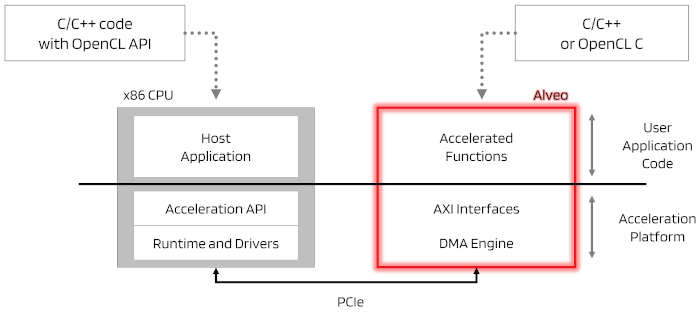

<table width="100%">
 <tr width="100%">
    <td align="center"><h1>2020.1 Vitis™ - Section 1 - Workflows</h1>
    <a href="https://www.xilinx.com/products/design-tools/vitis.html">See Vitis™ Development Environment on xilinx.com</a>
    </td>
 </tr>
</table>

> **_In this section...:_**  _Quick overview of the Vitis flow and description of the linear algebra algorithm chosen for the tutorial._

#### The Vitis Flow

To enable hardware acceleration, the code is split between the host and the kernel.  The host program, written in C/C++ uses API abstractions like OpenCL, runs on a host processor, an x86 server or an Arm processor for embedded platforms.  The hardware accelerated kernels run onto the programmable logic of a Xilinx device.

The API calls, processed by Xilinx runtime (XRT), manage process transactions between the host program and the hardware accelerators. Communication between the host and the kernel, including control and data transfers, occurs across the PCIe® bus or an AXI bus for embedded platforms.

In a typical application, the host first transfers data to be operated on by the kernel from host memory into global memory. The kernel subsequently operates on the data, storing results back to the global memory. Upon kernel completion, the host transfers the results back into the host memory. Data transfers between the host and global memory introduce latency, which can be costly to the overall application. To achieve acceleration in a real system, the benefits achieved by the hardware acceleration kernels must outweigh the added latency of the data transfers.

In the Vitis™ core development flow, an application program is split between a host application and hardware accelerated kernels.
- The host application is developed in C/C++ with OpenCL™ API calls
- The hardware kernels can be developed in C/C++, OpenCL C, or RTL.

#### Algorighm Description
This tutorial is based on a C++ kernel that we'll optimize for highest throughput. 

The algorithm to accelerate is a common linear algebra solver, the decomposition of a Hermitian, positive-definite matrix into the product of a lower triangular matrix and its conjugate transpose.  For this purpose we will use the Cholesky decomposition or Cholesky factorization (pronounced /ʃo-LESS-key/).  This solver is useful for several numerical problems, in particular for Monte Carlo simulations.

Note that this solver is included as part the official Vitis accelerated libraries, here is a link to its documentation: https://xilinx.github.io/Vitis_Libraries/solver/guide_L2/L2_api.html#potrf

For our purpose, we will start with a simple description implemented in C++ and explain how to adapt it for acceleration with an Alveo U50 card.

In the next [section](../Section_2-System_Setup), you'll learn how to prepare your environment to run the tutorial.
