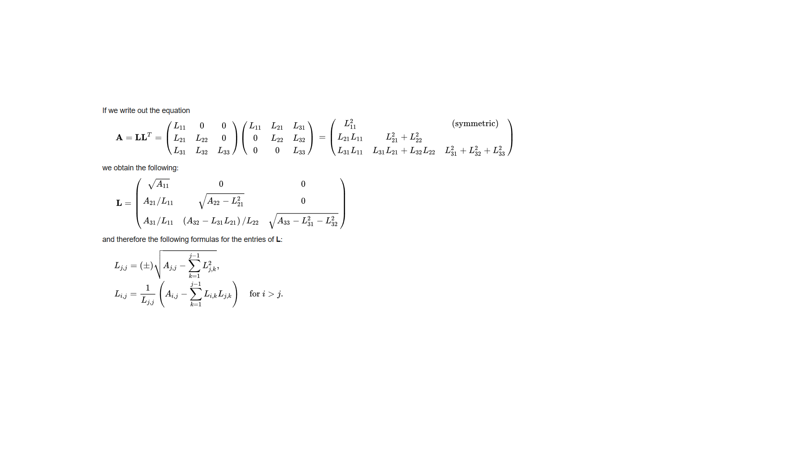

<table width="100%">
 <tr width="100%">
    <td align="center"><h1>2020.1 Vitis™ - Section 1 - Workflows</h1>
    <a href="https://www.xilinx.com/products/design-tools/vitis.html">See Vitis™ Development Environment on xilinx.com</a>
    </td>
 </tr>
</table>

In the Vitis™ core development flow, an application program is split between a host application and hardware accelerated kernels. The host application is developed in C/C++ with OpenCL™ API calls. The hardware kernels, on the other hand, can be developed in C/C++, OpenCL C, or RTL.

This tutorial is based on a C++ kernel that we'll optimize for highest throughput using the Xilinx high-level synthesis: Vitis HLS. 

The algorithm to accelerate is a common linear algebra solver, the decomposition of a Hermitian, positive-definite matrix into the product of a lower triangular matrix and its conjugate transpose.  For this purpose we will use the Cholesky decomposition or Cholesky factorization (pronounced /ʃo-LESS-key/).  This solver is useful for several numerical problems, in particular for Monte Carlo simulations.

This solver is included as part the official Vitis accelerated libraries, here is a link to its documentation: https://xilinx.github.io/Vitis_Libraries/solver/guide_L2/L2_api.html#potrf

For our purpose, we will start with a straightforward description implemented in C++.

The source code can be found here: ./src/reference.cpp
It can be run like so at the command line: g++ ....

Open the source code and get familiar with the algorithm.

Make a note of the performance numbers for different size of matrices: 16, 64, 256...
These numbers will become reference data points for later during this tutorial.
