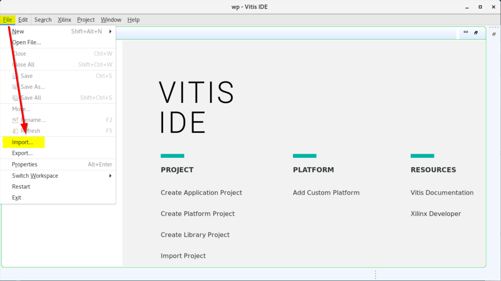

Code, files and instructions for **module 1**

## Organizing the C code
To enable hardware acceleration, we need to split the code between the host and the kernel.  The host code runs on the server using APIs we'll discuss below to manage the data and command operations for the kernel.

Take now a look at the host code and notice the several APIs that are used.
Notice how the data is tranferred back and forth to the kernel an back.

Take a look at the kernel code.  This code will be compiled inside the Vitis tools and transformed into an hardware description that the Vivado tool can implement onto Xilinx devices. As we'll the goal on that code is to make it as efficient as possible in regards to the available hardware.

You could either import this design as a pre-setup project in the Vitis GUI or run make.
## Build and execute for Vitis
The Vitis GUI is based on Eclipse and allows you to customize the design. [Import](../images/gui1_import.png)

  
Click to expand! (instructions for GUI)

  
    ### Using Vitis via the GUI
    1. Open a terminal
    2. Setup and launch Vitis
    3, "File" menu -> 
    4. Accept the default of the Vitis project exported zip file and click "Next"
    5. Click "Browse" on the next window and navigate to the ./docs/module1_baseline/project directory
    6. Select the vitis_export_archive.ide.zip and click "Okay"
    7. Next window click "Finish"
    
    ### Setting up the Platform
    1. On the center window pane of the GUI click the platform link (blue link xilinx_u50...)
    2. Navigate to specify the platform accessible on your system
    
    ### Running the design
    Notice the "Assistant" window pane with its 3 main flow steps
    1. Emulation-SW: to validate the design at the fucntional level
    2. Emulation-HW: compile the kernel into a cycle accurate representation to better gauge metrics
    3. Hardware: to launch the full compilation and generate a bitstream
 

  
Click to expand! (instructions for command line flow with <code>make</code>)

  
    ## Using **make**
    1. Open a terminal
    2. Setup Vitis
    3. Navigate to ./build
    4. Run make
       * make 
         * Without options, it will show the help
       * make build TARGET=sw_emu|hw_emu|hw
         * Builds for software or hardware emulation. The "hw" option runs the full compilation.
       * make run TARGET=sw_emu|hw_emu|hw
         * Executes for software or hardware emulation with "hw" running on the card after full compilation
	     * make clean
	       * delete files to start from a clean context
         

