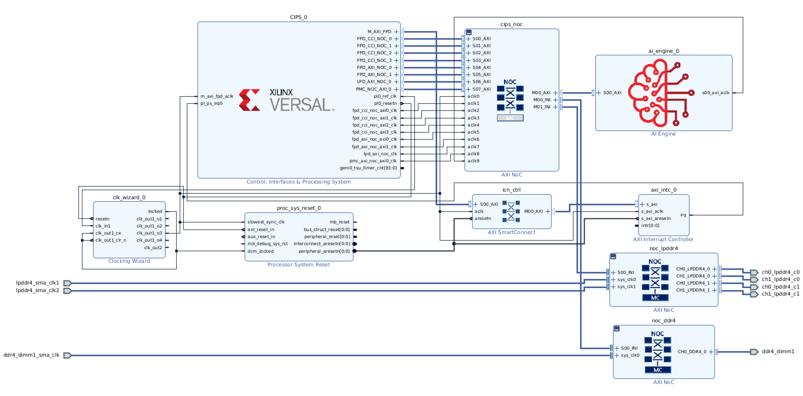

<table class="sphinxhide" width="100%">
 <tr width="100%">
    <td align="center"><h1>Vitis™ In-Depth Tutorials</h1>
    </td>
 </tr>
</table>


# Versal Custom Thin Platform Extensible System

***Version: Vitis 2023.1***

This tutorial describes an AMD Versal™ VCK190 System Example Design based on a thin custom platform (minimal clocks and AXI exposed to PL) including HLS/RTL kernels and an AI Engine kernel using a full Makefile build-flow for Vivado™/Petalinux/Yocto/Vitis 2023.1.


## Getting Started
### Build-flow
The Versal VCK190 System Example Design full Makefile build-flow builds the whole project in the following order:
```
  1.  version_check:   Checks if the Vivado, Petalinux and Vitis tools are setup and if the versions are 2023.1
  2.  vivado_platform: Building the thin platform xsa (only pre-synth) or using the pre-builds
  3.  vitis_platform:  Building the Vitis Platform or using the pre-builds
  4.  linux:           Building linux and sysroot (with Petalinux or Yocto) or using the pre-builds
  5.  dtg:             Building the device-tree when xsa and xpfm is build and using the linux pre-builds
  6.  bif:             Some necessary Copying of linux image-files to the vitis platform for a correct Vitis packaging
  7.  vitis_ip:        Building Ai Engine graph(s) towards libadf.a and compiling hls/rtl kernels to *.xo
  9.  full_impl:       Linking all kernels and AIE in the thin platform and fully implement it
  8.  ps_apps:         Building all XRT-based PS applications
 10.  package:         Packaging all necessary boot/run files
```
### Build-flow Dependencies
The following diagram explains the build-flow dependencies.

**Notes:**
 - The diagram should be read from right to left.
 - The diagram is for illustration only. The actual build-flow is more sequential.

 
### Build & Prerequisites
In the `[project-root]` you can start the full build with `make all` or `make all_targets` **after** taking following prerequisites into account:
  - **Before starting the build, please correctly setup the 2023.1 version of Vivado, Vitis and Petalinux/Yocto**
    - If the tools are not setup correctly the build will stop with an ERROR message telling you what is not correctly setup!
      - **Note**: The Yocto Tool setup is not verified!
      - **Note**: The Petalinux Tool and Version check is skipped when targetting Yocto!
  - Everything is in the GitHub repository; no extra files are needed. 
    - Although some are downloaded from GitHub; but that is handled by the Makefiles.
    - Exception: For building petalinux OFFLINE, you will need to download and extract some `tar.gz` files. This is explained in more detail below.
    - Exception: For building with Yocto-build, you will need to install Yocto. This is explained in more detail below.
  - All dependencies in every `Makefile` are setup in such a way that if you need to rebuild after a certain modification; then it **ONLY** rebuilds what is needed to be rebuild. 
    - Example: After already done a full build before, modify `[project-root]/vitis/ip/vadd_s/src/vadd_s.cpp`. Then, if you run `make all` from the `[project-root]`, it will **ONLY** rerun the `v++ --compile` (for the vadd_s), the `v++ --link`, and the `v++ --package`.
    - This is to showcase that **NO** full rebuild is required after every (small) modification once you builded before the platform and did not modify the platform.
    - Recommendation is to start `make all` or `make all_targets` always from the `[project-root]`, but of course you can run `make all` in every sub-module if for example you want to check if a sub-module is building correctly.
    - **Note**: You could remove the `${GRAPH_O}` dependency for the `v++ --link` step in the `[project-root]/vitis/Makefile`; but **ONLY** when you **FIX** your AIE I/O ports in **Vitis/Vivado** and do **NOT** do modifications anymore on the AIE I/O port definitions!
  - `[project-root]/Makefile` main `make` options:
      - `make all` to build everything for the specified `TARGET`.
      - `make clean` to clean everything for the specified `TARGET`.
      - `make clean_vitis` to clean everything (ip, ps_apps, vitis) after the (fixed) platform for the specified `TARGET`.
      - `make all_targets` to build everything for **ALL** `TARGETS`.
      - `make ultraclean` to clean everything for **ALL** `TARGETS`.
      - `make ultraclean_vitis` to clean everything (ip, ps_apps, vitis) after the (fixed) platform for **ALL** `TARGETS`.
  - `[project-root]/Makefile` export options to be changed if needed:
    - `TARGET`:
      - `export TARGET := hw` for targetting a VCK190 board (default).
      - `export TARGET := hw_emu` for targetting hardware emulation (change if needed).
      - The build flow supports both TARGETs in the same `[project-root]`; if you need both results at once, you can do `make all_targets` from the `[project-root]`!
      - Some generated directories are depending on the `TARGET` selection and are further shown as `[dir]_${TARGET}`.
    - `XPFM_PRE_BUILDS`:
      - `export XPFM_PRE_BUILDS := false` for building xpfm (default).
      - `export XPFM_PRE_BUILDS := true` for using the xpfm pre-builds.
        - Be sure that the environment `PLATFORM_REPO_PATHS` is set and pointing to the `internal_platforms` of the used version.
          - This should be set by sourcing Vivado `settingsXY.sh` and/or Vitis `settingsXY.sh`.
        - **Note**: `export TARGET := hw_emu` is NOT supported and will error out. 
    - `LINUX_PRE_BUILDS`:
      - `export LINUX_PRE_BUILDS := false` for building linux (default).
      - `export LINUX_PRE_BUILDS := true` for using the linux pre-builds.
        - Download the `xilinx-versal-common-v2023.1_10141622.tar.gz` from the Xilinx® Website and...
          - Extract it
          - `cd xilinx-versal-common-v2023.1`
          - `xilinx-versal-common-v2023.1 $ ./sdk.sh`
            - Enter target directory for Petalinux tools (default: `/opt/petalinux/2023.1`)
          - Make sure sourcing Vivado `settingsXY.sh` and/or Vitis `settingsXY.sh` first!
          - `xilinx-versal-common-v2023.1 $ unset LD_LIBRARY_PATH`
          - `xilinx-versal-common-v2023.1 $ source environment-setup-cortexa72-cortexa53-xilinx-linux`
          - **Note**: The latter 3 items must be executed each time you start in a new terminal or when changing versions!
      - **Note**: Following `LINUX_X_Y` exports are ignored and do not need setup when `export LINUX_PRE_BUILDS := true`.
      - **Note**: If `export XPFM_PRE_BUILDS := false` then a device-tree will be generated from the generated xsa. It could be - depending on the generated base platform (xsa) - that changes are needed in the `[project-root]/linux/dtg/src/system-user.dtsi` for a successfull build/boot. 
    - `ILA_EN`:
      - `export ILA_EN := 0` for disabling the ILA (default).
      - `export ILA_EN := 1` for enabling the ILA (change if needed).
      - **Note**: When building **vitis** with `export TARGET := hw_emu` ILA_EN will be forced to `ILA_EN = 0` (ILA Disabled) in the `[project-root]/vitis/Makefile`. There is **NO** issue to first build everything with `export TARGET := hw` and `export ILA_EN := 1` and afterwards ONLY rebuild vitis with `export TARGET := hw_emu`! **NO** need for a full rebuild in that respect!
      - More information on how to setup and use the ILA can be found in the [Notes](#notes)
    - `SW_BUILD_TOOL`:
      - `export SW_BUILD_TOOL := petalinux` to use Petalinux as linux build tool (default).
      - `export SW_BUILD_TOOL := yocto` to use Yocto as linux build tool (change if needed).
    - `LINUX_YOCTO_ROOT`: 
      - ONLY required to setup when `export SW_BUILD_TOOL := yocto`.
      - Defaults to `export LINUX_YOCTO_ROOT := ${HOME}/bin` so please change to your local Yocto install directory. 
      - More information on how to install/setup and build Yocto can be found [here](https://xilinx-wiki.atlassian.net/wiki/spaces/A/pages/18841862/Install+and+Build+with+Xilinx+Yocto).
    - `LINUX_TMP_DIR`:
      - Defaults to `export LINUX_TMP_DIR := /tmp/${USER}/${REQUIRED_VERSION}/${SW_BUILD_TOOL}`
        - Defaults to `/tmp/${USER}/2023.1/petalinux` when `export SW_BUILD_TOOL := petalinux`.
        - Defaults to `/tmp/${USER}/2023.1/yocto` when `export SW_BUILD_TOOL := yocto`.
      - So if you want to place it somewhere else; please replace it with your required location. 
      - Be aware that `LINUX_TMP_DIR` may **NOT** be located on an NFS mounted drive!
      - If your [project-root] is **NOT** on an NFS mounted drive; you can easily add it in your project with for example `export LINUX_TMP_DIR := $(shell pwd)/linux/tmp` 
    - `LINUX_BUILD_SOURCES`:
      - **ONLY** supported for `export SW_BUILD_TOOL := petalinux`!
      - `export LINUX_BUILD_SOURCES := network` for using online network build-sources (default).
      - `export LINUX_BUILD_SOURCES := local` for using offline **LOCALLY STORED** build-sources (change if needed).
      - Below described `LINUX_LOCAL_DOWNLOADS_DIR` AND `LINUX_LOCAL_SSTATE_DIR` **MUST** be setup!
      - **Note:** First petalinux sysroot build needs online build-sources! But it is handled by the Makefiles.
    - `LINUX_LOCAL_DOWNLOADS_DIR`:
      - **ONLY** used when `export SW_BUILD_TOOL := petalinux` and `export LINUX_BUILD_SOURCES := local`!
      - Defaults to `export LINUX_LOCAL_DOWNLOADS_DIR := /tmp/plnx-workspace/downloads`.
      - Change to the directory where you extracted the [downloads_2023.1.tar.gz](https://www.xilinx.com/support/download/index.html/content/xilinx/en/downloadNav/embedded-design-tools.html).
      - This can be shared amoungst different users.
    - `LINUX_LOCAL_SSTATE_DIR`:
      - **ONLY** used when `export SW_BUILD_TOOL := petalinux` and `export LINUX_BUILD_SOURCES := local`!
      - Defaults to `export LINUX_LOCAL_SSTATE_DIR := /tmp/plnx-workspace/sstate_aarch64_2023.1/aarch64`.
      - Change to the **WRITABLE** directory where you extracted the [sstate_aarch64_2023.1.tar.gz](https://www.xilinx.com/support/download/index.html/content/xilinx/en/downloadNav/embedded-design-tools.html).
      - This can be shared amoungst different users.
    - `LINUX_ETH_CONFIG`:
      - `export LINUX_ETH_CONFIG := DHCP` for Ethernet DHCP Configuration (default).
      - `export LINUX_ETH_CONFIG := STATIC` for Ethernet Static Configuration (change if needed).
        - Please setup your required Ethernet Static Configuration in `[project-root]/linux/src/recipes-bsp/init-ifupdown/interfaces`.
      - **Note**: When you like to have Ethernet connectivity (ssh/scp/...) during hardware emulation `export TARGET := hw_emu`:
        - The recommendation is to use `export LINUX_ETH_CONFIG := DHCP`.
        - Please read ["Networking in QEMU"](https://xilinx-wiki.atlassian.net/wiki/spaces/A/pages/862912682/Networking+in+QEMU#NetworkinginQEMU-SSHintoQEMU) carefully.
  - End result: 
    - `export TARGET := hw`: 
      - `[project-root]/package_linux_hw/sd_card/*` can be used to copy to a FAT-32 SD-card (partition)
        - **Note**: This cannot be used when `export LINUX_PRE_BUILDS := true` (due to only ext4 rootfs available)
      - `[project-root]/package_linux_hw/sd_card.img` can be used to be put on an SD-card with a Windows tool like `Win32 Disk Imager` 
    - `export TARGET := hw_emu`: 
      - `[project-root]/package_linux_hw_emu/launch_hw_emu.sh` can be used to launch the hardware emulation.

### Custom Thin Base Platform
The GENERATED Custom Thin Base Platform BD:


It exposes 5 clocks that can be used in the `[project-root]/vitis/src/system.cfg`:

  ```
  [clock]
  #id=0 -> clk_out1_o1 -> 500.00MHz
  id=0:subtractor_0,counter_0

  #id=1 -> clk_out1_o2 -> 250.00MHz
  id=1:vadd_mm_1

  #id=2 -> clk_out1_o3 -> 125.00MHz

  #id=3 -> clk_out1_o4 -> 62.50MHz

  #id=4 -> clk_out2 -> 333.33MHz
  id=4:vadd_s_1,mm2s_vadd_s_1,mm2s_vadd_s_2,s2mm_vadd_s_1
  ``` 

Vitis will nicely add and change all required ip and connections depending on the added kernels and their needed clocks/resets onto this GENERATED Custom Thin Base Platform.
 
## More In-Depth
The following explains the different sub-build steps. Click on each item for more detailed information.  
Each step is sequential (in the order listed - by the `[project-root]/Makefile`): 

<details>
 <summary> make version_check </summary>
 
 -  Checks if the Vivado, Petalinux (Only when `export SW_BUILD_TOOL := petalinux`) and Vitis tools are setup and if the versions are 2023.1.
 
</details>
<details>
 <summary> make vivado_platform </summary>
 
`[project-root]/vivado` Directory/file structure:
| Directory/file      | Description                                             
| --------------------|--------------------------------------------------------------
| Makefile            | The vivado platform Makefile                                  
| src/*               | The vivado platform sources

 - `export XPFM_PRE_BUILDS := false` 
   - Builds the output file needed for Petalinux/Yocto and Vitis software platform creation -> `[project-root]/vivado/build/xsa_platform/vck190_thin.xsa`.
   - After this step you could open the platform blockdesign in Vivado for review:
     - `[project-root]/vivado/build/vck190_thin_vivado` $ vivado `vck190_thin.xpr`
 - `export XPFM_PRE_BUILDS := true` 
   - Setup the project to use the pre-build xsa
   
</details>
<details>
 <summary> make vitis_platform </summary>
 
`[project-root]/vitis/platform` Directory/file structure:
| Directory/file      | Description                                             
| --------------------|--------------------------------------------------------------
| Makefile            | The vitis platform Makefile                                  
| src/*               | The vitis platform sources

 - `export XPFM_PRE_BUILDS := false` 
   - Builds the platform needed for ip and Vitis   -> `[project-root]/vitis/platform/build/vck190_thin/export/vck190_thin/vck190_thin.xpfm` 
   - Builds the software platform needed for Vitis -> `[project-root]/vitis/platform/build/vck190_thin/export/vck190_thin/sw/*`
 - `export XPFM_PRE_BUILDS := true` 
   - Setup the project to use the xpfm pre-builds
   
</details>
<details>
  <summary> make linux </summary>

`[project-root]/linux/src` Directory/file structure:
| Directory/file                                   | Description                                             
| -------------------------------------------------|-------------------------------------------------------------------------------------------
| recipes-bsp/device-tree/*                        | Linux-recipe and files needed for some device-tree changes needed for VCK190              
| recipes-bsp/init-ifupdown/*                      | Linux-recipe and configuration file that needs to be setup for builds with `export LINUX_ETH_CONFIG := STATIC`
| recipes-core/base-files/*                        | Linux-recipe needed to automount mmcblk0p1 for builds with `export SW_BUILD_TOOL := yocto`
| boot_custom.bif                                  | Bif file with \<placeholders\> needed to have the Vitis packager generating a correct BOOT.BIN
 
 `[project-root]/linux/petalinux` Directory/file structure:
| Directory/file      | Description                                             
| --------------------|--------------------------------------------------------------
| Makefile            | The Petalinux Makefile                                  
| src/config          | A script used to exchange/add Petalinux configuration items

 `[project-root]/linux/yocto` Directory/file structure:
| Directory/file      | Description                                             
| --------------------|--------------------------------------------------------------
| Makefile            | The Yocto Makefile                                  
| src/conf/auto.conf  | Yocto Build Configuration File
 
 - `export LINUX_PRE_BUILDS := false` 
   - Builds all required linux (Petalinux or Yocto) images which end up in `[project-root]/linux/vck190-versal/images/linux`.
   - It also builds a `sysroot` which ends up in `[project-root]/linux/sysroot`; needed for `[project-root]/ps_apps/linux` builds.
 - `export LINUX_PRE_BUILDS := true` 
   - Sets up the project to use the Linux pre-builds
   
</details>
<details>
  <summary> make dtg </summary>

`[project-root]/linux/dtg` Directory/file structure:
| Directory/file                                       | Description                                             
| -----------------------------------------------------|-------------------------------------------------------------------------------------------
| Makefile                                             | The device-tree generator Makefile              
| src/build_dts.tcl                                    | XSCT-tcl-script used to build the device-tree out of a generated xsa              
| src/system-user.dtsi                                 | Additional device-tree settings
 
 - Only used when `export XPFM_PRE_BUILDS := false` and `export LINUX_PRE_BUILDS := true`
   -  Builds the device-tree out of the generated xsa
   
</details>
<details>
  <summary> make bif </summary>

 - Some necessary Copying of linux image-files to the software platform for a correct Vitis packaging
 
</details>
<details>
  <summary> make vitis_ip </summary>
 
`[project-root]/vitis/ip` Directory/file structure:
| Directory/file      | Description                                             
| --------------------|--------------------------------------------------------------
| Makefile            | The ip generic Makefile; it automatically searches for sub-projects to build                             
| aie/*               | aie "datamover" kernel Makefile and sources
| counter/*           | free-running RTL "counter" kernel Makefile and sources that feeds the aie "datamover" kernel
| subtractor/*        | Managed RTL "subtractor" kernel Makefile and sources that measures the delay between the counter-input and the aie-output
| vadd_mm/*           | XRT-controlled HLS vadd memory mapped kernel Makefile and sources
| vadd_s/*            | XRT-controlled HLS vadd streaming kernel Makefile and sources
| mm2s_vadd_s/*       | XRT-controlled HLS memory-to-streaming kernel used with vadd_s Makefile and sources
| s2mm_vadd_s/*       | XRT-controlled HLS streaming-to-memory kernel used with vadd_s Makefile and sources

 - Builds the output files needed for Vitis linker -> `[project-root]/vitis/ip/aie/libadf.a` and `[project-root]/vitis/ip/xo_hw/*.xo`
 - Kernel structure/flow:
    - vadd_mm is a memory mapped kernel
    - mm2s_vadd_s -> vadd_s -> s2mm_vadd_s
    - counter -> aie "datamover" -> subtractor
    
</details>
<details>
  <summary> make full_impl </summary>

`[project-root]/vitis` Directory/file structure:
| Directory/file      | Description                                             
| --------------------|---------------------------------------------------------
| Makefile            | The Vitis generic Makefile for linker and packager
| src/system.cfg      | Vitis Linker Configuration: kernel-connections, clocks and memory-ports
| src/ila_0_bd.cfg    | ILA Vitis connection needed for Vitis linker when `export ILA_EN := 1`
| src/ila_0_def.tcl   | ILA Vitis tcl needed for Vitis linker when `export ILA_EN := 1`

 - Runs the Vitis packager
  - After this step you could open the full blockdesign (platform extended with all kernels) in Vivado for review:
   - `[project-root]/vitis/build_${TARGET}/_x/link/vivado/vpl/prj` $ vivado `prj.xpr`
 - Vitis will connect the memory-ports of the vadd_mm kernel to DDR4 as specified in the `[project-root]/vitis/src/system.cfg`
 - Vitis will connect the memory-ports of the mm2s_vadd_s, vadd_s and s2mm_vadd_s kernels to LPDDR4 as specified in the `[project-root]/vitis/src/system.cfg`
 
</details>
<details>
  <summary> make ps_apps </summary>

`[project-root]/ps_apps/linux` Directory/file structure:
| Directory/file      | Description                                             
| --------------------|---------------------------------------------------------
| Makefile            | The ps_apps generic Makefile; it automatically searches for sub-projects to build
| aie_dly_test/*      | PS XRT Application - using the native XRT API - Makefile and sources that measures the delay between counter-input and aie-output
| vadd_mm_cpp/*       | PS XRT Application - using the native XRT API - Makefile and sources that checks out the vadd_mm kernel
| vadd_mm_ocl/*       | PS XRT Application - using the opencl XRT API - Makefile and sources that checks out the vadd_mm kernel
| vadd_s/*            | PS XRT Application - using the native XRT API - Makefile and sources that checks out the mm2s_vadd_s -> vadd_s -> s2mm_vadd_s kernels

 - Builds the output files needed for vitis packager -> `[project-root]/ps_apps/linux/exe/*.exe`
 
</details>
<details>
  <summary> make package </summary>

`[project-root]/vitis` Directory/file structure:
| Directory/file      | Description                                             
| --------------------|---------------------------------------------------------
| Makefile            | The Vitis generic Makefile for linker and packager

 - Runs the Vitis packager
 - The output of the Vitis packager ends up in `[project-root]/package_linux_${TARGET}`
  
</details>

## Testing
### Running on a VCK190
  1. Prerequisite: Build was executed with `export TARGET := hw`
  2. Copy over the `[project-root]/package_linux_hw/sd_card/*` to an SD-card (**Note**: Only when `export LINUX_PRE_BUILDS := false`), or put the `[project-root]/package_linux_hw/sd_card.img` on an SD-card.
  3. Put the SD-card in the VCK190 Versal SD-card slot (VCK190 top SD-card slot closest to the bracket).
  4. Connect the included USB-cable between the VCK190 (Middle bottom of the bracket) and a computer:
     - Usually you will see 3 serial ports in your device manager:
       - One for the ZU04 system controller device.
       - Two for Versal; however only one of the Versal serial ports are in use.
       - To see the serial ports, the VCK190 does not need to be powered-ON, the physical USB connection should be enough!
     - Connect to the serial port(s) by using a terminal emulator like Putty (Windows) with the following settings:
       - 115200 baud
       - 8 data bits
       - 1 stop bit
       - Parity none
       - Flow control XON/XOFF
     - Maybe for the first time open all 3 serial ports to see which one is the correct Versal serial port where you can follow the Versal-boot and interact later on.
  5. Power-UP:
     - It will first boot-up up the ZU04, next it will start the Versal boot. 
     - Only one of the Versal serial ports will give you the Linux login prompt after booting.
  6. Continue to "Execution & Results".

### Running Hardware Emulation
  1. Prerequisite: Build was executed with `export TARGET := hw_emu`
  2. Execute `[project-root]/package_linux_hw_emu/`# `./launch_hw_emu.sh`
  3. The hardware emulation will start and boot-up the whole system and should give you the Linux login prompt.
     - This can take some time!
  4. Continue to "Execution & Results".

### Execution & Results
You will need to login with user `petalinux` and setup a new password (it is then also the `sudo` password):
  - **Note**: It could be that if you used the `export LINUX_PRE_BUILDS := true` that you get more messages displayed.

```
vck190-versal login: petalinux
You are required to change your password immediately (administrator enforced).
New password: 
Retype new password: 
vck190-versal:~$ sudo su

We trust you have received the usual lecture from the local System
Administrator. It usually boils down to these three things:

    #1) Respect the privacy of others.
    #2) Think before you type.
    #3) With great power comes great responsibility.

Password: 
vck190-versal:/home/petalinux#
vck190-versal:/home/petalinux# cd /run/media/mmcblk0p1/
vck190-versal:/run/media/mmcblk0p1#
```
 
Execute the following after you went though the previous explained login-step so you reached the `/run/media/mmcblk0p1` directory:
  - In the logging below you find all results/responses that you should get after every Linux command line input you should give.
  
```
vck190-versal:/run/media/mmcblk0p1# ./vadd_mm_cpp.exe a.xclbin 
PASSED:  auto my_device = xrt::device(0)
XAIEFAL: INFO: Resource group Avail is created.
XAIEFAL: INFO: Resource group Static is created.
XAIEFAL: INFO: Resource group Generic is created.
PASSED:  auto xclbin_uuid = my_device.load_xclbin(a.xclbin)
PASSED:  auto my_vadd = xrt::kernel(my_device, xclbin_uuid, "vadd_mm:{vadd_mm_1}")
PASSED:  auto my_vadd_i/oX = xrt::bo(my_device, VADD_BYTE_SIZE, XCL_BO_FLAGS_NONE, my_vadd.group_id(X) (=1))
PASSED:  auto my_vadd_i/oX_mapped = = my_vadd_i/oX.map<unsigned int*>()
PASSED:  my_vadd_inputX.sync(XCL_BO_SYNC_BO_TO_DEVICE, VADD_BYTE_SIZE, 0)
PASSED:  auto my_vadd_run = my_vadd(my_vadd_input0, my_vadd_input1, my_vadd_output, VADD_BYTE_SIZE)

INFO:    Waiting kernel to end...

PASSED:  my_vadd_output.sync(XCL_BO_SYNC_BO_FROM_DEVICE, VADD_BYTE_SIZE, 0)

PASSED:  ./vadd_mm_cpp.exe

vck190-versal:/run/media/mmcblk0p1# ./vadd_mm_ocl.exe a.xclbin 
Loading: 'a.xclbin'
XAIEFAL: INFO: Resource group Avail is created.
XAIEFAL: INFO: Resource group Static is created.
XAIEFAL: INFO: Resource group Generic is created.

PASSED:  ./vadd_mm_ocl.exe

vck190-versal:/run/media/mmcblk0p1# ./vadd_s.exe a.xclbin 
INFO:    samples = 256
INFO:    bsize   = 512
PASSED:  auto my_device = xrt::device(0)
XAIEFAL: INFO: Resource group Avail is created.
XAIEFAL: INFO: Resource group Static is created.
XAIEFAL: INFO: Resource group Generic is created.
PASSED:  auto xclbin_uuid = my_device.load_xclbin(a.xclbin)
PASSED:  auto in_0 = xrt::kernel(my_device, xclbin_uuid, "mm2s_vadd_s:{mm2s_vadd_s_1}")
PASSED:  auto in_1 = xrt::kernel(my_device, xclbin_uuid, "mm2s_vadd_s:{mm2s_vadd_s_2}")
PASSED:  auto in_01_bo = xrt::bo(my_device, bsize, XCL_BO_FLAGS_NONE, in_01.group_id(0) (=2))
PASSED:  auto in_01_bo_mapped = = in_01_bo.map<TYPE_DATA*>()
PASSED:  in_01_bo.sync(XCL_BO_SYNC_BO_TO_DEVICE)
PASSED:  auto in_01_run = in_01(in_01_bo, nullptr, 256)
PASSED:  auto out = xrt::kernel(my_device, xclbin_uuid, "s2mm_vadd_s:{s2mm_vadd_s_1}")
PASSED:  auto out_bo = xrt::bo(my_device, bsize, XCL_BO_FLAGS_NONE, out.group_id(0) (=2))
PASSED:  auto out_bo_mapped = out_bo.map<TYPE_DATA*>()
PASSED:  auto out_run = out(out_bo, nullptr, 256)
PASSED:  dut = xrt::kernel(my_device, xclbin_uuid, "vadd_s:{vadd_s_1}")
PASSED:  dut_run = dut(256, nullptr, nullptr, nullptr)

INFO:    Waiting for kernels to end...

PASSED:  in_0_run.wait()
PASSED:  in_1_run.wait()
PASSED:  dut_run.wait()
PASSED:  out_run.wait()
PASSED:  out_bo.sync(XCL_BO_SYNC_BO_FROM_DEVICE)

PASSED:  ./vadd_s.exe

vck190-versal:/run/media/mmcblk0p1# ./aie_dly_test.exe a.xclbin 
Initializing ADF API...
PASSED:  auto my_device = xrt::device(0)
XAIEFAL: INFO: Resource group Avail is created.
XAIEFAL: INFO: Resource group Static is created.
XAIEFAL: INFO: Resource group Generic is created.
PASSED:  auto xclbin_uuid = my_device.load_xclbin(a.xclbin)
PASSED:  auto my_rtl_ip = xrt::ip(my_device, xclbin_uuid, "subtractor:{subtractor_0}")
PASSED:  auto my_graph  = xrt::graph(my_device, xclbin_uuid, "mygraph_top")
PASSED:  my_graph.reset()
PASSED:  my_graph.run()
Poll subtractor register
  Value Reg0:  1d2
  Value Reg1:  15e
  Value Reg2:  157
  Value Reg3:  2e
Poll subtractor register
  Value Reg0:  1d2
  Value Reg1:  182
  Value Reg2:  179
  Value Reg3:  2e
Poll subtractor register
  Value Reg0:  1d2
  Value Reg1:  18a
  Value Reg2:  179
  Value Reg3:  2e
Poll subtractor register
  Value Reg0:  220
  Value Reg1:  192
  Value Reg2:  179
  Value Reg3:  2e
Poll subtractor register
  Value Reg0:  1d2
  Value Reg1:  192
  Value Reg2:  181
  Value Reg3:  2e
Poll subtractor register
  Value Reg0:  1e8
  Value Reg1:  18a
  Value Reg2:  179
  Value Reg3:  2e
Poll subtractor register
  Value Reg0:  220
  Value Reg1:  192
  Value Reg2:  179
  Value Reg3:  2e
Poll subtractor register
  Value Reg0:  1da
  Value Reg1:  192
  Value Reg2:  181
  Value Reg3:  2e
Poll subtractor register
  Value Reg0:  220
  Value Reg1:  18a
  Value Reg2:  17b
  Value Reg3:  2e
Poll subtractor register
  Value Reg0:  1d2
  Value Reg1:  18a
  Value Reg2:  179
  Value Reg3:  2e
Poll subtractor register
  Value Reg0:  220
  Value Reg1:  192
  Value Reg2:  179
  Value Reg3:  2e
Poll subtractor register
  Value Reg0:  1d2
  Value Reg1:  192
  Value Reg2:  179
  Value Reg3:  2e
Poll subtractor register
  Value Reg0:  202
  Value Reg1:  18a
  Value Reg2:  181
  Value Reg3:  2e
Poll subtractor register
  Value Reg0:  1d2
  Value Reg1:  18a
  Value Reg2:  179
  Value Reg3:  2e
Poll subtractor register
  Value Reg0:  204
  Value Reg1:  18a
  Value Reg2:  179
  Value Reg3:  2e
Poll subtractor register
  Value Reg0:  1d2
  Value Reg1:  18a
  Value Reg2:  179
  Value Reg3:  2e
Poll subtractor register
  Value Reg0:  206
  Value Reg1:  192
  Value Reg2:  179
  Value Reg3:  2e
Poll subtractor register
  Value Reg0:  1d2
  Value Reg1:  192
  Value Reg2:  179
  Value Reg3:  2e
Poll subtractor register
  Value Reg0:  208
  Value Reg1:  18e
  Value Reg2:  181
  Value Reg3:  2e
Poll subtractor register
  Value Reg0:  1d2
  Value Reg1:  18a
  Value Reg2:  17b
  Value Reg3:  2e
PASSED:  my_graph.end()

PASSED:  ./aie_dly_test.exe

vck190-versal:/run/media/mmcblk0p1# 
```

## Notes
  - Simulation is **NOT** part and **NOT** demonstrated in this Tutorial!
  - `xsa`: CIPS settings are added manually; configured in the bd-files.
  - The example design is fully FAT-32 
    - if you like to use ext4 rootfs instead: 
      - linux (Petalinux and Yocto) already generates it.
      - You will need to copy it to the Vitis platform in the `[project-root]/Makefile` in the `bif` section.
      - The `v++ -package` command line in `[project-root]/vitis/Makefile` will need adaptations to be able to use ext4 rootfs instead of FAT-32.
  - `export ILA_EN := 1`
    - The ILA core connectivity is set up during v++ linking process loading the cfg file `[project-root]/vitis/src/ila_0_bd.cfg` and further configuration of ILA properties is managed in tcl file `[project-root]/vitis/src/ila_0_def.tcl`.
    - Using the configuration file `[project-root]/vitis/src/ila_0_bd.cfg` allows the designer to mark AXI port for debug nets to and from the AIE engine for analysis. 
    - **AFTER** completing the vitis linking process execute the following:
      - `[project-root]/vitis/build_hw/_x/link/vivado/vpl/prj` $ vivado `prj.xpr`
      - Vivado: `Open Implemented Design`
      - Vivado: `Tcl Console`: write_debug_probes `probe_0.ltx`
      - Vivado: `Close`
      - `[project-root]/vitis` $ make update_ila
    - A quick use case would be to validate the values of subtractor registers. After the probing file is loaded and the ILA is armed, rerunning `./aie_dly_test.exe a.xclbin` will trigger the ILA capturing the signal values that should match those in the console.
  - `root` password is the one you have setup when using ssh/scp/... towards the VCK190 `export TARGET := hw` or hardware emulation `export TARGET := hw_emu`.
  
## Design Considerations
  Note: The **MUST**s in below explanations are due to how the generic Makefiles are setup, and is **NOT** an AMD tools requirement!
  - `[project-root]/ps_apps/linux`: PS applications can easily be added by adding a sub-project for each in `[project-root]/ps_apps/linux`.
    - Vitis will automatically package them and they will end up in `[project-root]/package_linux_${TARGET}`.
    - The `[PS Application].exe` (extension **MUST** be .exe) **MUST** end up in the `[project-root]/ps_apps/exe` dir.
  - `[project-root]/vitis/ip`: Kernels can be added by just adding a sub-project in `[project-root]/vitis/ip`.
    - **You will need to update the `[project-root]/vitis/src/system.cfg` file to setup the correct connections/clocks.**
    - A `[kernel].xo` file **MUST** end up in the `[project-root]/vitis/ip/xo_hw` dir
    - An extra aie graph **MUST** be added in the `[project-root]/vitis/ip/aie` dir, the `[project-root]/vitis/ip/aie/Makefile` will need adaptations.

## References
The following documents provide supplemental information for this tutorial.

### [AI Engine Documentation](https://docs.xilinx.com/r/en-US/ug1076-ai-engine-environment)
Contains sections on how to develop AI Engine graphs, how to use the AI Engine compiler, AI Engine simulation, and performance analysis.

### [Xilinx® Runtime (XRT) Architecture](https://xilinx.github.io/XRT/master/html/index.html)
The following are links to the XRT information used by this tutorial: 

* [XRT Documentation](https://xilinx.github.io/XRT/master/html/index.html): Explains general XRT API calls used in the PS Host Application. 

* [XRT Github Repo](https://github.com/Xilinx/XRT): Contains the XRT source code. 

* [XRT AIE API](https://github.com/Xilinx/XRT/blob/master/src/runtime_src/core/include/experimental/xrt_aie.h): Documents the AI Engine XRT API calls

### [Vitis Unified Software Development Platform 2023.1 Documentation](https://docs.xilinx.com/v/u/en-US/ug1416-vitis-documentation)
The following are links to Vitis related information referenced in this tutorial:

* [Vitis Unified Software Platform Documentation: Application Acceleration Development (UG1393)](https://docs.xilinx.com/r/en-US/ug1393-vitis-application-acceleration)

* [Vitis Application Acceleration Development Flow Tutorials](https://github.com/Xilinx/Vitis-Tutorials)

* [Vitis High-Level Synthesis User Guide (UG1399)](https://docs.xilinx.com/r/en-US/ug1399-vitis-hls)

## Revision History
Click on each item below to see the detailed Revision History:

 <details>
  <summary> May 2023 </summary>
  
 - AI Engine:
   - Replaced kernels and graphs to use AIE API and C++ Object Oriented Style with templates
 - HLS:
   - Replaced qdma_axis type with ap_axis type
 
 </details>
 

 <details>
  <summary> February 2023 </summary>
  
 - general:
   - Changing dir structure for the upcoming baremetal ps_apps and vitis export flow
 
 </details>
 
 <details>
  <summary> December 2022 </summary>
  
 - general:
   - Adding the option to use the xpfm and/or linux pre-builds
 
 </details>

 <details>
  <summary> June 2022 </summary>
  
 - general:
   - Updated tutoral to 2022.2
 
 </details>

 <details>
  <summary> April 2022 </summary>
  
 - platform/hw:
   - Added lpddr4 to the base platform
 - general:
   - Updated tutoral to 2022.1
 
 </details>
 
 <details>
   <summary> March 2022 </summary>
 
  - platform/hw:
    - Removed some ip and connections to end-up with the bare minimum base platform needed
      - Vitis nicely adds and changes IP and connections as required
    - Exposed 1 extra clock via BUFG (clk_out2) next to the 4 exisiting clocks via MBUFGCE (clk_out1_o1-4)
      - id=0 -> clk_out1_o1 -> 500MHz
      - id=1 -> clk_out1_o2 -> 250MHz
      - id=2 -> clk_out1_o3 -> 125MHz
      - id=3 -> clk_out1_o4 -> 62.5MHz
      - id=4 -> clk_out2    -> 333MHz
  - linux:
    - Added Yocto as alternative Linux build tool option with:
      - `[project-root]/Makefile` - `export LINUX_BUILD_TOOL := yocto` 
      - `[project-root]/Makefile` - `export LINUX_YOCTO_ROOT := ${HOME}/bin`
      - Added `[project-root]/linux/yocto`
    - Petalinux and/or Yocto TMP_DIR is now set and can be changed with `export LINUX_TMP_DIR := /tmp/linux/${LINUX_BUILD_TOOL}`
    - Moved `[project-root]/petalinux` to `[project-root]/linux/petalinux`
    - Moved `[project-root]/petalinux/src/boot_custom.bif` to `[project-root]/linux/src/boot_custom.bif`
    - Moved `[project-root]/petalinux/src/device-tree` to `[project-root]/linux/src/recipes-bsp/device-tree`
    - Moved `[project-root]/petalinux/init-ifupdown` to `[project-root]/linux/src/recipes-bsp/init-ifupdown`
    - Linux build for `export LINUX_BUILD_TOOL := petalinux` ends up in `[project-root]/linux/vck190-versal`
    - Linux build for `export LINUX_BUILD_TOOL := yocto` ends up in `[project-root]/linux/vck190-versal` and `[project-root]/linux/vck190-versal-meta`
    - Sysroot build for `export LINUX_BUILD_TOOL := petalinux` and `export LINUX_BUILD_TOOL := yocto` ends up in `[project-root]/linux/sysroot`
    - Updated `[project-root]/linux/src/device-tree/files/system-user.dtsi` for proper Ethernet PHY configuration
    - Added support for offline petalinux-build (Excluding sysroot build!) with:
      - `export LINUX_BUILD_SOURCES := local`
      - `export LINUX_LOCAL_DOWNLOADS_DIR := /tmp/plnx-workspace/downloads`
      - `export LINUX_LOCAL_SSTATE_DIR := /tmp/plnx-workspace/sstate_aarch64_2022.1/aarch64`
  - platform/sw
    - Updated `[project-root]/platform/sw/src/qemu/lnx/qemu_args.txt` for adding Ethernet connectivity support (ssh/scp/...) for hardware emulation `export TARGET := hw_emu`
    - Removed linux generated images dependencies; since **NOT** required
  - bif:
    - Added `[project-root]/linux/vck190-versal/images/linux/Image` and `[project-root]/linux/vck190-versal/images/linux/rootfs.cpio.gz.u-boot` copy to the software platform to keep proper naming when `export LINUX_BUILD_TOOL := yocto`
    - Added some dependencies so its only executed when needed
  - ip:
    - Added vadd streaming kernels: mm2s_vadd_s -> vadd_s -> s2mm_vadd_s
    - Renamed vadd to vadd_mm (vadd memory mapped kernel)
    - Removed dependency on `${TARGET}`; since **NOT** required
  - ps_apps:
    - Added vadd_s to check the vadd_s streaming kernels
    - Renamed vadd_cpp to vadd_mm_cpp to check the vadd memory mapped kernel
    - Renamed vadd_ocl to vadd_mm_ocl to check the vadd memory mapped kernel
    - Using explicit "kernel:{kernel_id}" for kernel selection
    - Streamline print out messages
    - Added dependencies on `${SYSROOT}` and on **ALL** source files from `./src/*`
  - vitis:
    - counter and subtractor kernels running @ 500MHz (id=0 -> clk_out1_o1) 
    - vadd_mm (vadd memory mapped kernel) running @ 250MHz (id=1 -> clk_out1_o2)
    - mm2s_vadd_s -> vadd_s -> s2mm_vadd_s (vadd_s streaming kernels) running @ 333MHz (id=4 -> clk_out2)
    - Disable ILA when building vitis with `export TARGET := hw_emu`
    - Added `${SYSTEM_CFG}` as dependency for the Vitis Linker
    - Added `${GRAPH_O}` as dependency for the vitis linker, since you need to perform extra steps to be able to remove this dependency
    - Added `${LINUX_IMAGE}` and `${LINUX_ROOTFS}` as dependencies for the vitis packager; and those are now taken from the software platform
  - general:
    - Improved dependencies in almost all `Makefile`s to **ONLY** rebuild what is needed to be rebuild after a modification
    - Added following `[project-root]/Makefile` commands:
      - `make clean_vitis` to clean everything (ip, ps_apps, vitis) after the (fixed) platform for the specified `TARGET`.
      - `make all_targets` to build everything for **ALL** `TARGETS`.
      - `make ultraclean` to clean everything for **ALL** `TARGETS`.
      - `make ultraclean_vitis` to clean everything (ip, ps_apps, vitis) after the (fixed) platform for **ALL** `TARGETS`.
    - `[project-root]/README.md` updated with all new features
       - `make all` to build everything for the specified `TARGET`.
      - `make clean` to clean everything for the specified `TARGET`.
 
</details>

<details>
  <summary> February 2022 </summary>

 - petalinux:
    - Added the option LINUX_ETH_CONFIG to setup static Ethernet Configuration
  - ip:
    - Bugfix for the v++ linker to fail in TARGET=hw_emu when other HLS-kernels (like mm2s) are added later on to the design
  - general:
    - Adding the option to build for TARGET=hw_emu
 
</details>

<details>
  <summary> October 2021 </summary>

 - petalinux:
    - Improved petalinux version check
  - ip/aie: 
    - Optimized AI Engine Datamovers
  - general: 
    - Added more clarifications in the README.md
 
</details>

<details>
  <summary> September 2021 - Initial Release </summary>
 
 </details>


<p class="sphinxhide" align="center"><sub>Copyright © 2020–2023 Advanced Micro Devices, Inc</sub></p>

<p class="sphinxhide" align="center"><sup><a href="https://www.amd.com/en/corporate/copyright">Terms and Conditions</a></sup></p>
