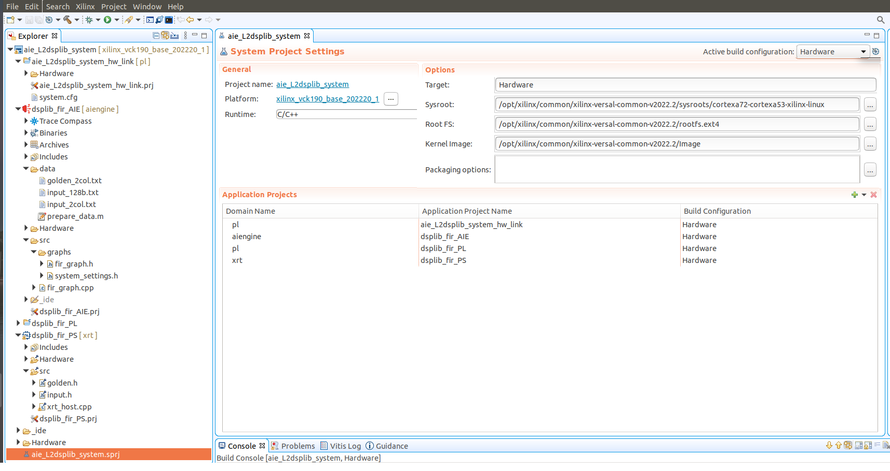
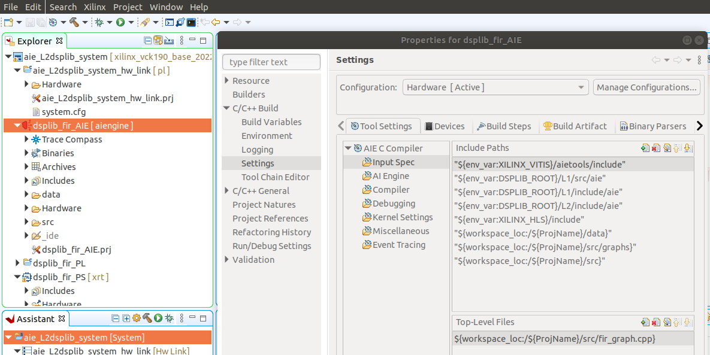
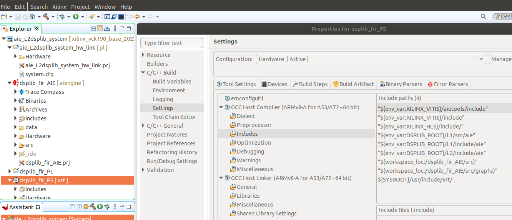

<!--

Copyright (C) 2022-2023, Advanced Micro Devices, Inc. All rights reserved.
SPDX-License-Identifier: MIT

-->

<table class="sphinxhide" width="100%">
 <tr width="100%">
    <td align="center"><h1>Vitis™ In-Depth Tutorials</h1>
    </td>
 </tr>
</table>

# DSP Design on AI Engine Technology with GUI and Makefile Flows

- Version: Vitis 2022.2
- Board: VCK190 production
- Last update: 01 March 2023

## Table of Contents

[1.0 Introduction](#1-introduction)

[2.0 Project Setup](#2-project-setup)

[3.0 Decimation FIR Filter DSP Design](#3-decimation-fir-filter-dsp-design)

[4.0 Using the Thin Platform](#4-using-the-thin-platform)

[References](#references)

[Support](#support)

[License](#license)

## 1 Introduction

Developing a DSP algorithm with the AI Engine technology is only one part of the design flow and not necessarily the most complicated one. At the end of the day the DSP kernels implemented into the AI Engine array have to be connected with the Programmable Logic (PL) datamover kernels and with the ARM A72 CPU host Programmable Subsystem (PS): the PL kernels require Vitis HLS as design flow, the PS application requires C/C++ programming with either XRT or OpenCL APIs to manage the kernels at runtime execution on the target board within the Petalinux OS.

Building from scratch a system like this is not trivial and it would be better to have a good starting point that could be adapted with few changes, a sort of "system design template" or "toolbox" to use some improper terminology.

This tutorial explains how to design a DSP algorithm and implement it into the AI Engine domain of the Versal&trade; device, using the production [VCK190](https://www.xilinx.com/products/boards-and-kits/vck190.html) target board and the [Vitis 2022.2 Unified software platform](https://www.xilinx.com/products/design-tools/vitis/vitis-platform.html) design tools.

The DSP algorithm is a decimation FIR filter taken from the [Vitis DSP Libraries (for AI Engine)](https://github.com/Xilinx/Vitis_Libraries/tree/master/dsp).

You will build a system running on the VCK190 board having:

- A DSP kernel implemented on AI Engine domain (the decimation FIR filter);
- Two PL datamover kernels, designed with [HLS](https://www.xilinx.com/support/documentation-navigation/design-hubs/dh0090-vitis-hls-hub.html);
- Software application for the ARM host processor using the [XRT](https://www.xilinx.com/products/design-tools/vitis/xrt.html) APIs;
- An SD-card with Petalinux OS for booting.

As you use this document, it is assumed you have named this tutorial repository ``02-AIE_DSP_with_Makefile_and_GUI`` and placed it into a certain working directory ``${WRK_DIR}``. For example, in my case:
`export WRK_DIR=/media/danieleb/DATA/2022.2/Vitis-Tutorials-2022.2/Developer_Contributed`.

Here is illustrated how the organization of the folders tree of this tutorial (with emphasis on the folder related to AI Engine, otherwise the tree would explode):

```
/media/danieleb/DATA/2022.2
    |
    ├── Vitis_Libraries
    │   ├── dsp
    │   │   ├── docs
    │   │   ├── ext
    │   │   ├── L1
    │   │   └── L2
    │   │       ├── benchmarks
    │   │       ├── examples
    │   │       ├── include
    │   │       ├── meta
    │   │       └── tests/aie

    ├── Vitis-Tutorials-2022.2
    │   ├── AI_Engine_Development
    │   │   ├── Design_Tutorials
    │   │   ├── Feature_Tutorials
    │   │   └── Introduction
    │   ├── Developer_Contributed                   # the ${WRK_DIR}
    │   │   └── 01-Versal_Custom_Thin_Platform_Extensible_System
    │   │   └── 03-HLS_Code_Optimization    
    │   │   └── 02-AIE_DSP_with_Makefile_and_GUI    # this tutorial
    │   │   |   └── files                           # current directory

```


## 2 Project Setup

### 2.1 Warnings

1. Everything shown in this project used an Ubuntu 18.04 Desktop with related Vitis 2022.2 release (with or without updates).

2. It is recommended to write the SD-card that boots the VCK190 board with the Windows OS utility called [Win32 Disk Imager 1.0](https://sourceforge.net/projects/win32diskimager/).

3. Some figures are screenshots related to earlier release of Vitis and there might be few differences, although very minimal, with the current one.

4. It is recommended that you set correctly the environment before running any script, as described in details in next subsection 2.3.6. The [set_proj_env_2022v2_vck190.sh](files/scripts/set_proj_env_2022v2_vck190.sh) script contains a template to be adapted for your needs, based on the AMD Ubuntu desktop settings adopted in developing this tutorial.  

5. The [run_all.sh](files/run_all.sh) must always be launched **only after** all the variables of previous script have been set at least once, and **only from** the [files](files) folder, which has to be your current directory.

6. Read carefully and entirely this README.md document before launching any script or Makefile.

### 2.2 Dos-to-Unix Conversion

In case you might get some strange errors during the execution of the scripts, you must pre-process -just once- all the``*.sh``, ``*.cpp``, ``*.h`` files with the [dos2unix](http://archive.ubuntu.com/ubuntu/pool/universe/d/dos2unix/dos2unix_6.0.4.orig.tar.gz) utility.
In that case run the following commands from your Ubuntu host PC:

```bash
#sudo apt-get install dos2unix
cd <WRK_DIR> #your working directory
cd 02-AIE_DSP_with_Makefile_and_GUI/files # current directory
source scripts/dos2unix_all.sh
```

### 2.3 Environment Setup

#### 2.3.1 Archives Download

You need the following archives from either AMD/Xilinx Download or GitHub websites, in particular:

- from [Vitis (SW Developer) Downloads](https://www.xilinx.com/support/download/index.html/content/xilinx/en/downloadNav/vitis.html) area take the **2022.2 Vitis Installer** (it makes the Vitis install process much easier) and the **2022.2 Vitis Update**;

- from [Vitis Embedded Platforms](https://www.xilinx.com/support/download/index.html/content/xilinx/en/downloadNav/embedded-platforms.html) are take the **Common Images for Embedded Vitis Platforms 2022.2**;

- from [Petalinux](https://www.xilinx.com/support/download/index.html/content/xilinx/en/downloadNav/embedded-design-tools.html) area take the **2022.2 Petalinux Tools Installer**;

- go to the bottom of [Petalinux 2022.2 - Product Update Release Notes and Known Issues](https://support.xilinx.com/s/article/000034483?language=en_US) and take **2022.2_PetaLinux_Package_List.xlsx** file which contains all the packages needed by Petalinux into your Ubuntu OS computer (you must install all of them before installing Petalinux);

- go to the [Xilinx GitHub page](www.github.com/Xilinx) and zip both the [Vitis Libraries](https://github.com/Xilinx/Vitis_Libraries) and [Vitis Tutorials](https://github.com/Xilinx/Vitis-Tutorials);

- go to the [Alveo&trade; Packages](https://www.xilinx.com/support/download/index.html/content/xilinx/en/downloadNav/alveo.html) area, select release 2022.2 and Ubuntu 18.04 OS and then  take the **Xilinx Run Time (XRT)** archive;

At the end you should have the following files:

```text
(permissions)   (#bytes)  (archive name)
-rwxrwxrwx     284181282  Xilinx_Unified_2022.2_1014_8888_Lin64.bin
-rwxrwxrwx    9290713165  Xilinx_Vivado_Vitis_Update_2022.2.1_1208_2036.tar.gz
-rwxrwxrwx    1092218036  xilinx-versal-common-v2022.2_10141622.tar.gz
-rwxrwxrwx     370827814  Vitis_Libraries-main.zip
-rwxrwxrwx     452453624  Vitis-Tutorials-2022.2.zip
-rwxrwxrwx      15410706  xrt_202220.2.14.354_18.04-amd64-xrt.deb
```

First install the basic version of Vitis 2022.2 via the installer `Xilinx_Unified_2022.2_1014_8888_Lin64.bin`,  then add the update `Xilinx_Vivado_Vitis_Update_2022.2.1_1208_2036.tar.gz`. I placed everything in the folder `/tools/Xilinx/`.

#### 2.3.2 Sudo or not Sudo?

You **might** need ``sudo`` privilege to install the tools on these folders, primarily ``/tools`` and ``/opt``, unless you do not change accordingly the ownership and group of those folders.

In fact, if you created the ``/tools`` directory as super-user (or ``root``, or with ``sudo``), whatever you wish to write/install there can be done only by the ``root`` super-user.
This is basic Linux OS behavior. But nobody prevents you to change the group and owner so that you -as normal user – can do what you like there too, as if you were in your ``$HOME`` directory.

So, if you run the following commands (and you must need ``sudo``):

```shell
sudo su
mkdir /tools
mkdir /opt
# -R stays for recursively on each subfolder
chown  -R your_user_name  /tools
chgrp  -R your_user_name  /tools
chown  -R your_user_name  /opt
chgrp  -R your_user_name  /opt
exit
```

Then, you can install all the above tools and archives without ``sudo`` privilege, just as a normal user.

As a last crosscheck, if you installed the tools as normal user, you will see the hidden folder ``.Xilinx`` inside your ``$HOME`` directory, otherwise if you installed them as super-user, you should see
the hidden folder ``.Xilinx`` inside your ``/root`` directory.

In case of install done with the ``sudo`` privilege, there seems to be only a small issue with on line in the script ``installLibs.sh``:

```shell
su - $user -c "touch $logFile; chmod 777 $logFile"
```

The ``touch`` and ``chmod`` commands cannot be executed because the logfile is located below the ``/root`` directory and the shell was switched to a normal user without root privileges.
This means that the script assumes that the installation was done without root privileges. That line in the script could be replaced by following commands:

```shell
sudo touch $logFile
sudo chmod 777 $logFile
```

In conclusion: either the installation had root privileges (``sudo``) and the ``installLibs.sh`` needs to be changed, or the installation was done as a normal user.

#### 2.3.3 Install Versal Common

You have to install this archive ``xilinx-versal-common-v2022.2_10141622.tar.gz`` in the folder  ``/opt/xilinx/common/`` (which has to be into an ``ext4`` file system, not on a ``NTFS`` one), as reported here:

```text
$ ls -l /opt/xilinx/common/
drwxr-xr-x 3 root  root  4096 gen 29 15:01 xilinx-versal-common-v2022.2
```

Then, you have to execute the following commands to build the sdk folders, as a normal user, according to what discussed in the previous sub-section:

```shell
cd /opt/xilinx/common/xilinx-versal-common-v2022.2/
chmod 777 ./sdk.sh # if needed
./sdk.sh -p -y -d .
```

Check if you must decompress the file ``rootfs.ext4.gz`` directly or not.
You can then remove the ``sdk.sh`` file to save storage space.

#### 2.3.4 Install XRT

The easiest way to download XRT was from the [Alveo Packages ](https://www.xilinx.com/support/download/index.html/content/xilinx/en/downloadNav/alveo.html) site. As already said, select the Alveo U200 card and then the Ubuntu 18.04 OS to get the ``xrt_202220.2.14.354_18.04-amd64-xrt.deb`` file.

Then install the archive via the following command:

```shell
sudo apt install --reinstall ./xrt_<version>.deb
```

To set ``xrt`` into your terminal, you need the following command:

```shell
source /opt/xilinx/xrt/settings.sh
```

which is also in the ``set_proj_env_2022v2_*.sh`` script.

#### 2.3.5 Install Petalinux

> **WARNING: You cannot install Petalinux into a NFS driver, otherwise the install process will end with a not-predictable error message**

Before installing ``petalinux`` you  should check in the Excel foil ``2022.2_PetaLinux_Package_List.xlsx`` what are all the packages that ``petalinux`` requires and eventually install the missing ones.

```
#create the destination folder   
sudo mkdir /tools/Xilinx/PetaLinux/2022.2
#change permissions

$ chmod 777 ~/Downloads/petalinux-v2022.2-10141622-installer.run  
$ ~/Downloads/petalinux-v2022.2-10141622-installer.run -d /tools/Xilinx/PetaLinux/2022.2

...

INFO: Installing PetaLinux...
INFO: Checking PetaLinux installer integrity...
INFO: Installing PetaLinux SDK to "/tools/Xilinx/PetaLinux/2022.2/."
INFO: Installing buildtools in /tools/Xilinx/PetaLinux/2022.2/./components/yocto/buildtools
INFO: Installing buildtools-extended in /petalinux_2022.2/./components/yocto/buildtools_extended
INFO: PetaLinux SDK has been installed to /tools/Xilinx/PetaLinux/2022.2/.
```

To set ``petalinux`` into your terminal you need the following command:

```shell
source /tools/Xilinx/PetaLinux/2022.2/settings.sh
```

which is also in the ``set_proj_env_2022v2_*.sh`` script.

#### 2.3.6 Set Environmental Variables

The script [set_proj_env_2022v2_vck190.sh](files/scripts/set_proj_env_2022v2_vck190.sh) contains a template to be adapted by the user, to set the tools environment
for designing an embedded system on VCK190 target board.

Once done that, you must call such script with the command:

```shell
cd <WRK_DIR>  #your working directory
cd 02-AIE_DSP_with_Makefile_and_GUI/files # current directory
source ./scripts/set_proj_env_2022v2_vck190.sh
```

## 3 Decimation FIR Filter DSP Design

In this section you will build the decimation FIR filter DSP system using the Vitis GUI. The PS application will apply XRT APIs. The OS will be petalinux.

### 3.1 GUI-based Flow

Now, launch the commands:

```shell
cd <WRK_DIR> #your working directory
cd 02-AIE_DSP_with_Makefile_and_GUI/files # current dir
source ./scripts/set_proj_env_2022v2_vck190.sh
cd gui-flow/fir-dsplib_prj
vitis --workspace ./xrt_wrk
```

Follow the following steps:

1. Select ``File -> New -> Application Project -> Next`` from the GUI and then select the ``xilinx_vck190_base_202220_1`` platform for your project.

1. Click ``Next`` and give a name to your application project and your system project, for example respectively ``dsplib_fir_AIE`` and ``aie_L2dsplib_system``.

1. Select ``aie_engine`` as target processor and click ``Next`` two times.

1. Select an ``Empty application`` template and click ``Finish``. So far (with steps 1,2,3, 4) you have created the folder for the AI Engine subsystem.

1. Select ``File -> New -> HW Kernel Project -> Next`` from the GUI and then select again and then select the ``xilinx_vck190_base_202210_1`` platform for your project.

1. Give a name to your PL HW kernel project, for example ``dsplib_fir_PL`` and make sure you are still using the  ``aie_L2dsplib_system``. Click ``Finish``. So far (with steps 5, 6)  you have created the folder for the PL subsystem.

1. Select ``File -> New -> Application Project -> Next`` from the GUI and then select the ``xilinx_vck190_base_202220_1`` platform for your project.

1. Click ``Next`` and give a name to your application project  and make sure you are still using the  ``aie_L2dsplib_system``.

1. Select ``cortexA72`` as target processor and click ``Next``. Then select the ``xrt domain``.

1. You have also to set the path names for the  ``Sysroot, Root FS, Kernel Image`` of the embedded OS. Then click ``Next``. Here are my environment settings for your reference:

    ```text
    - /opt/xilinx/common/xilinx-versal-common-v2022.2/sysroots/cortexa72-cortexa53-xilinx-linux  #Sysroot path
    - /opt/xilinx/common/xilinx-versal-common-v2022.2/rootfs.ext4  #Root FS
    - /opt/xilinx/common/xilinx-versal-common-v2022.2/Image        #Kernel Image
    ```

1. Select an ``Empty application`` template and click ``Finish``. So far (with steps 7, 8, 9, 10, 11) you have created the folder for the PS subsystem. Now it is time to import all the source files into the Vitis project (still empty at the moment).

1. From Vitis GUI, mouse right click on the ``dsplib_fir_AIE [aiengine]`` folder, select ``Import Sources`` and take all the source files from ``files/src/ip/aie/src`` and put them into ``dsplib_fir_AIE/src``, copy the entire subfolder ``files/src/ip/aie/src/graphs`` into ``dsplib_fir_AIE/src/``. Do the same action also for all the data files from ``files/src/ip/aie/data`` to ``dsplib_fir_AIE/data``.

1. From Vitis GUI, mouse right click on the ``dsplib_fir_PL`` folder, select ``Import Sources`` and take all the source files from the two folders ``files/src/ip/mm2s_aie/src`` and ``files/src/ip/s2mm_aie/src`` and put them into ``dsplib_fir_PL/src``.

1. From Vitis GUI, mouse right click on the ``dsplib_fir_PS [xrt]`` folder, select ``Import Sources`` and take all the source files from ``files/src/ps_apps/aie_test/src`` and put them into ``dsplib_fir_PS/src``.

1. From Vitis GUI, mouse right click on the ``aie_L2dsplib_system_hw_link [pl]``, select ``Import Sources`` and take the ``files/src/vitis/src/system.cfg`` file and put it into ``aie_L2dsplib_system_hw_link [pl]`` itself.  Now that all the source files have been imported, you should see something like in Figure 3.1-1. It is time to set all the settings to finally build the entire project.

1. Select the ``dsplib_fir_AIE.prj`` file and select the ``Top-Level File`` file named ``fir_graph.cpp``.

1. From Vitis GUI, mouse right click on the ``dsplib_fir_AIE [aiengine]`` domain and select ``C/C++ Build Settings``. Make sure to have selected ``Configuration [All Configurations]``. Add the following further includes to the default ones in ``Input Spec``, then click ``Apply and Close``. You should see something like in Figure 3.1-2.

    ```text
    ${env_var:XILINX_VITIS}/aietools/include
    ${env_var:DSPLIB_ROOT}/L1/src/aie
    ${env_var:DSPLIB_ROOT}/L1/include/aie
    ${env_var:DSPLIB_ROOT}/L2/include/aie
    ${env_var:XILINX_HLS}/include
    ${workspace_loc:/${ProjName}/src}
    ${workspace_loc:/${ProjName}/src/graphs}
    ${workspace_loc:/${ProjName}/data}
    ```

1. You have to click on ``aie_L2dsplib_system_hw_link.prj`` file, right click on ``binary_container_1`` then select ``Edit V++ Options settings`` and add ``--config=../system.cfg`` as illustrated into Figure 3.1-3.

1. The ``system.cfg`` file for ``aie_L2dsplib_system_hw_link [pl]`` domain is set as in the following (see Figure 3.1-4):

   ```text
   [connectivity]
   stream_connect=mm2s_1.s:ai_engine_0.DataIn1
   stream_connect=ai_engine_0.DataOut1:s2mm_1.s
   ```

1. Click on the ``dsplib_fir_PL.prj`` file push the ``Add the HW functions`` button and select the ``mm2s`` and ``s2mm`` functions, as illustrated in figure 3.1.5.

1. From Vitis GUI, mouse right click on the ``dsplib_fir_PS [xrt]`` domain and select ``C/C++ Build Settings``. Make sure to have selected ``Configuration [All Configurations]``.

   - As illustrated in Figure 3.1-6,  for the GCC host compiler the other dialect flag has to be set to

     ```
     -std=c++14
     ```

     Then, click ``Apply and Close``.

   - As illustrated in  Figure 3.1-7, add the following library search paths (``-L`` flag):

     ```text
     ${env_var:XILINX_VITIS)/aietools/lib/aarch64.o
     ${SYSROOT}/usr/lib
     ```

   - and libraries (``-l`` flag):

     ```text
     xilinxopencl
     xaiengine
     adf_api_xrt
     xrt_core
     xrt_coreutil
     ```

   - As illustrated in Figure 3.1.8, add the following further includes to the default ones in ``Include``, then click ``Apply and Close``.

     ```text
     ${env_var:XILINX_VITIS}/aietools/include
     ${env_var:XILINX_VITIS}/include
     ${env_var:XILINX_HLS}/include
     ${env_var:DSPLIB_ROOT}/L1/src/aie
     ${env_var:DSPLIB_ROOT}/L1/include/aie
     ${env_var:DSPLIB_ROOT}/L2/include/aie
     ${workspace_loc:/dsplib_fir_AIE/src}
     ${workspace_loc:/dsplib_fir_AIE/src/graphs}
     ${SYSROOT}/usr/include/xrt
     ```



*(Figure 3.1-1) Setting OS paths to compile the host software subsystem.*



*(Figure 3.1-2) Vitis GUI-based flow: C/C++ Build Settings for the AIE subsystem.*


*(Figure 3.1-3) Vitis GUI-based flow: assigning the system.cfg file to the binary container.*


*(Figure 3.1-4) Vitis GUI-based flow: system.cfg configuration file in details.*


*(Figure 3.1-5) Vitis GUI-based flow: project settings for the kernels of PL subsystem.*


*(Figure 3.1-6) Vitis GUI-based flow: settings the C++ dialect to compile the host software subsystem.*


*(Figure 3.1-7) Setting the libraries and related paths to compile the host software subsystem.*



*(Figure 3.1-8) Setting the include paths to compile the host software subsystem.*

### 3.2 Makefile-based Flow

Alternatively, to the GUI-based flow, you can use Vitis from command line with the proper Makefile by typing the following:

```shell
cd <WRK_DIR> #your working directory
cd 02-AIE_DSP_with_Makefile_and_GUI/files #cur dir
#source ./run_all.sh
cd make-flow
make all
```

The makefiles here adopted were automatically generated by Vitis (Eclipse) GUI in the previous section and then manually modified to use the environmental variables and avoid absolute path names.

### 3.3 Test on VCK190 Target Board

Whatever flow you have adopted - based on either GUI or Makefile - once you have written the generated sd-card, you can boot the VCk190 board.

At the prompt you can launch the following commands:

```
mount /dev/mmcblk0p1 /mnt
cd /mnt
./dsplib_fir_PS binary_container_1.xclbin
```

The runtime execution on VCK190 works correctly:

```text
Initializing ADF API...
INFO:    iterations    = 0
INFO:    words SizeIn  = 8192
INFO:    words SizeOut = 4096
INFO:    bytes SizeIn  = 32768
INFO:    bytes SizeOut = 16384
PASSED:  auto my_device = xrt::device(0)
XAIEFAL: INFO: Resource group Avail is created.
XAIEFAL: INFO: Resource group Static is created.
XAIEFAL: INFO: Resource group Generic is created.
PASSED:  auto xclbin_uuid = my_device.load_xclbin(binary_container_1.xclbin)
PASSED:  auto in_0 = xrt::kernel(my_device, xclbin_uuid, "mm2s:{mm2s_1}")
PASSED:  auto in_0_bo = xrt::bo(my_device, bSizeIn, XCL_BO_FLAGS_NONE, in_0.group_id(0) (=1))
PASSED:  auto in_0_bo_mapped = = in_0_bo.map<TYPE_DATA*>()
PASSED:  memcpy(in_0_bo_mapped, cint16input, bSizeIn)
PASSED:  in_0_bo.sync(XCL_BO_SYNC_BO_TO_DEVICE)
PASSED:  auto in_0_run = in_0(in_0_bo, nullptr, 32768)
PASSED:  auto out_0 = xrt::kernel(my_device, xclbin_uuid, "s2mm:{s2mm_1}")
PASSED:  auto out_0_bo = xrt::bo(my_device, bSizeOut, XCL_BO_FLAGS_NONE, out.group_id(0) (=1))
PASSED:  auto out_0_bo_mapped = out_0_bo.map<TYPE_DATA*>()
PASSED:  auto out_0_run = out(out_0_bo, nullptr, 16384)
PASSED:  auto my_graph  = xrt::graph(my_device, xclbin_uuid, "filter")
PASSED:  my_graph.reset()
PASSED:  my_graph.run(0)

INFO:    Waiting for kernels to end...

PASSED:  in_0_run.wait()
PASSED:  out_0_run.wait()
PASSED:  out_0_bo.sync(XCL_BO_SYNC_BO_FROM_DEVICE)

INFO:    Veryfing output data vs. golden ones

PASSED:  ./dsplib_fir_PS
```

## 4 Using the Thin Platform

### 4.1 Get the Thin Platform

The [Versal Custom Thin Platform Extensible System](https://github.com/Xilinx/Vitis-Tutorials/tree/2022.1/Developer_Contributed/01-Versal_Custom_Thin_Platform_Extensible_System) tutorial has the following aspects to consider:

- it is always well maintained and promptly updated along the various Vitis releases;
- by default it generates a ``sd_card.img`` file with ``petalinux`` file system on it and the SD-card has only one partition (FAT32);
- it applies a hierarchy of ``Makefiles`` that should enable an "easier" customization of the system to be designed, without touching or modifying the directories structure and the Makefile themselves too.

Few notes to be mentioned besides what already reported in its related [README.md](https://github.com/Xilinx/Vitis-Tutorials/blob/2022.1/Developer_Contributed/01-Versal_Custom_Thin_Platform_Extensible_System/README.md) file:

1. Do not use the ``sd_card.img`` file generated in the ``package_output_hw``. On the contrary, just format the SD card with a Windows OS utility like [SD Card Formatter (5.0.2 developed by Tuxera Inc)](https://www.sdcard.org/cms/wp-content/uploads/2020/11/SD_Card-Formatter_Press_Release.pdf) in FAT32 format to a size of more than 2GB (at least). Then you can copy directly on it the files from the ``package_output_hw/sd_card`` folder. The reason for this action is that with the ``sd_card.img`` file the VCK190 sometimes does not boot for this particular design.

2. At the prompt on UART terminal digit the ``petalinux`` username and the choose a password (for example ``root``).

### 4.2 Integrate the FIR Filter in the Thin Platform

As already stated in previous subsection, the Thin Platform has a lot of advantages, being based on makefile flow, including ease of use and fast compilation time, so in this separate section you will design the same project of section [3 Decimation FIR Filter DSP Design](#3-decimation-fir-filter-dsp-design),
that is, a decimation-by-2 FIR filter taken from the Vitis DSP Library for AI Engine.
This time, you will implement such design into the Thin Platform makefile based template as an alternative of using the two flows described in subsection 3.1 (GUI-based flow) and 3.2 (Makefile-based flow).

The [prepare_files.sh](files/scripts/prepare_files.sh) script -called from within [run_all.sh](files/run_all.sh) script- copies the Thin Platform folder and rename it into ``thin-plat``, then it removes some folders (``ip/counter``, ``ip/mm2s_vadd_s``, ``ip/s2mm_vadd_s``, ``ip/subtractor``) not needed for the purpose of this FIR filter design, then it changes other files, as explained in the next section.

```shell
cd <WRK_DIR> #your working directory
cd 02-AIE_DSP_with_Makefile_and_GUI/files #current dir
#set the environment
source ./scripts/set_proj_env_2022v2.sh
# source run_all.#
source ./scripts/prepare_files.sh
```

#### 4.2.1 What To Change in the Thin Platform

The [prepare_files.sh](files/scripts/prepare_files.sh) script  changes the content of the following sub-folders, by adding the source code files requested by this project and then changing some lines in the related make files that were inherited from the original Thin Platform:

```
thin-plat
|
├── ip                
│   ├── aie           # AI Engine graph and kernels
│   │   ├── data
│   │   └── src
│   │       └── graph
│   |
│   ├── mm2s_aie      # HLS kernel
│   │   └── src
│   ├── s2mm_aie      # HLS kernel
│      └── src
|
├── ps_apps         
│   ├── aie_test    # PS code for AI Engine with XRT APIs
│       └── src
|
└── vitis
   └── src
       └── system.cfg
```

Without the [prepare_files.sh](files/scripts/prepare_files.sh) script, you should have to do manually the following changes:

1. Add your AI Engine graph and kernels code into the ``ip/aie`` folder and adapt the related ``ip/aie/Makefile`` to your case;
1. Add your HLS kernels code into the ``ip`` folder, one HLS kernel in each subfolder, for example: ``ip/mm2s_aie`` and ``ip/s2mm_aie``; then check/adapt the related ``ip/mm2s_aie/Makefile`` and ``ip/s2mm_aie/Makefile``;  
1. Add your PS code into the ``ps_apps`` folder, for example: ``ps_apps/aie_test``, then check/adapt the related ``ps_apps/aie_test/Makefile``;
1. Adapt the ``vitis/src/system.cfg`` configuration file for the Vitis Linker according to your connectivity (in this specific case it is the same of the original Thin Platform repository, so no changes at all);
1. Leave untouched the ``ip/Makefiles``, since it orchestrates all the Makefiles of the various subfolders; all the rest will be managed "automatically" by the other Makefiles of the Thin Platform project.

To make your life easier, all the steps above are already done by the [prepare_files.sh](files/scripts/prepare_files.sh) script and the Makefiles were already changed and available in this repository.

Run the following commands:

```shell
cd <WRK_DIR> #your working directory
cd 02-AIE_DSP_with_Makefile_and_GUI/files #curr dir
##set the environment
#source ./scripts/set_proj_env_2022v2.sh
#prepare the Thin Platform folder
source ./scripts/prepare_files.sh
```

Now you can build the SD card with the following commands:

```shell
cd <WRK_DIR> #your working directory
cd 02-AIE_DSP_with_Makefile_and_GUI/files
##set the environment
#source ./scripts/set_proj_env_2022v2.sh
cd thin-plat
make all TARGET=hw
```

As already mentioned in previous subsection, do not use directly the ``sd_card.img`` file generated in the ``package_output_hw``. On the contrary, just format the SD card with a Windows OS utility like [SD Card Formatter (5.0.2 developed by Tuxera Inc)](https://www.sdcard.org/cms/wp-content/uploads/2020/11/SD_Card-Formatter_Press_Release.pdf) in FAT32 to a size of more than 2GB (at least) as illustrated in Figure 4.2.1-1. Then you can copy directly on it the files from the ``package_output_hw/sd_card`` folder, as illustrated in Figure 4.2.1-2.


*(Figure 4.2.1-1) FAT32 formatting to prepare the SD card for VCK190.*


*(Figure 4.2.1-2) Copy the files on SD card to boot the VCK190.*

### 4.3 Run on VCK190 Target Board

At the prompt on UART terminal digit the ``petalinux`` username and the choose a password -for example ``root``- to login, as reported in Figure 4.3-1, then you can launch the application. Here are the commands:

```shell
sudo su
cd /run/media/mmcblk0p1/
source ./init.sh
./aie_test.exe a.clbin
```

Figure 4.3-2 shows the runtime execution of the FIR decimation filter application


*(Figure 4.3-1) Set the username and password at the VCK190 runtime prompt.*


*(Figure 4.3-2) Log of the FIR decimation filter runtime execution on the VCK190.*

## References

### [AI Engine Documentation](https://docs.xilinx.com/search/all?filters=Document_ID~%2522UG1076%2522_%2522UG1079%2522&content-lang=en-US)

Contains sections on how to develop AI Engine graphs, how to use the AI Engine compiler, and AI Engine simulation, and performance analysis.

### Vitis DSP Libraries

- [Vitis DSP Libraries Comprehensive Documentation](https://xilinx.github.io/Vitis_Libraries/dsp/2022.1/)

### Xilinx Runtime (XRT) Architecture

Below are links to the XRT information used by this tutorial:

- [XRT Documentation](https://xilinx.github.io/XRT/master/html/index.html): Explains general XRT API calls used in the PS Host Application.

- [XRT Github Repo](https://github.com/Xilinx/XRT): Contains the XRT source code.

- [XRT AI Engine API](https://github.com/Xilinx/XRT/blob/master/src/runtime_src/core/include/experimental/xrt_aie.h): Documents the AI Engine XRT API calls

- [XRT Release Notes](https://docs.xilinx.com/r/en-US/ug1451-xrt-release-notes)

### Vitis Unified Software Development Platform 2022.1 Documentation

Below are links to Vitis related information referenced in this tutorial:

- [Vitis Application Acceleration Development Flow Documentation](https://docs.xilinx.com/r/en-US/ug1393-vitis-application-acceleration)

- [Vitis Application Acceleration Development Flow Tutorials](https://github.com/Xilinx/Vitis-Tutorials)

- [Vitis HLS](https://docs.xilinx.com/r/en-US/ug1399-vitis-hls)

### Vitis Model Composer

- [Vitis Model Composer examples](https://github.com/Xilinx/Vitis_Model_Composer)

- [Vitis Model Composer Tutorial](https://docs.xilinx.com/v/u/2022.2-English/ug1498-model-composer-sys-gen-tutorial)

#### Support

GitHub issues will be used for tracking requests and bugs. For questions go to [support.xilinx.com](https://support.xilinx.com/).

#### License

The MIT License (MIT)

Copyright (c) 2023 Advanced Micro Devices, Inc.

Permission is hereby granted, free of charge, to any person obtaining a copy
of this software and associated documentation files (the "Software"), to deal
in the Software without restriction, including without limitation the rights
to use, copy, modify, merge, publish, distribute, sublicense, and/or sell
copies of the Software, and to permit persons to whom the Software is
furnished to do so, subject to the following conditions:

The above copyright notice and this permission notice shall be included in all
copies or substantial portions of the Software.

THE SOFTWARE IS PROVIDED "AS IS", WITHOUT WARRANTY OF ANY KIND, EXPRESS OR
IMPLIED, INCLUDING BUT NOT LIMITED TO THE WARRANTIES OF MERCHANTABILITY,
FITNESS FOR A PARTICULAR PURPOSE AND NONINFRINGEMENT. IN NO EVENT SHALL THE
AUTHORS OR COPYRIGHT HOLDERS BE LIABLE FOR ANY CLAIM, DAMAGES OR OTHER
LIABILITY, WHETHER IN AN ACTION OF CONTRACT, TORT OR OTHERWISE, ARISING FROM,
OUT OF OR IN CONNECTION WITH THE SOFTWARE OR THE USE OR OTHER DEALINGS IN THE
SOFTWARE.

<p class="sphinxhide" align="center">&copy; Copyright 2023 Advanced Micro Devices, Inc.</p>
