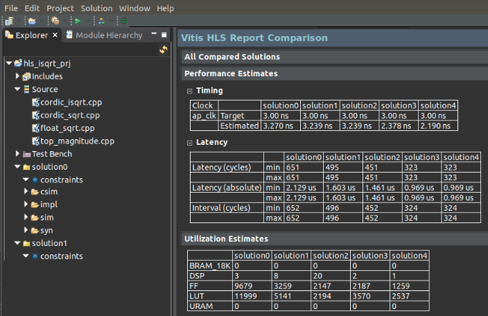
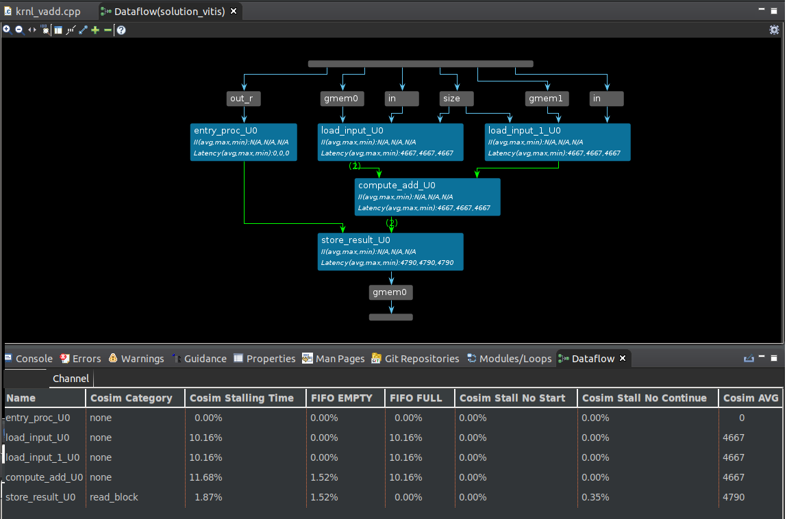
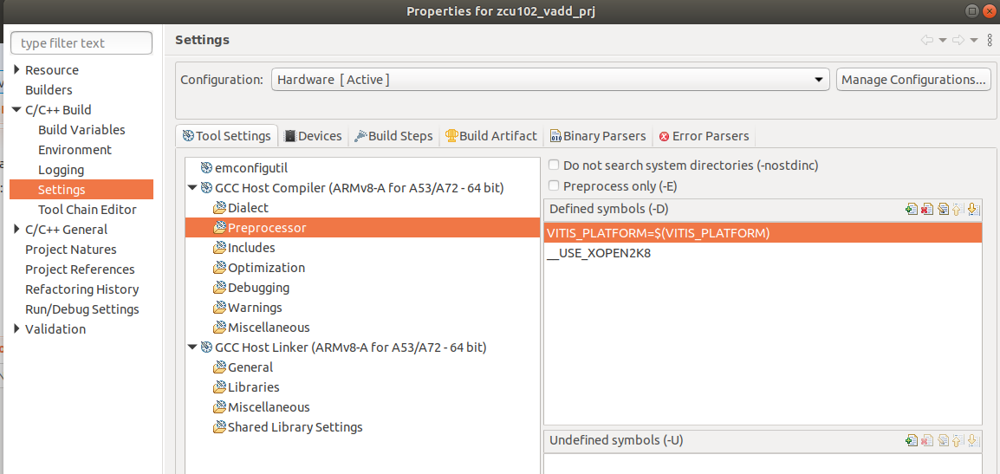

<!--

Copyright © 2023 Advanced Micro Devices, Inc. All rights reserved.
SPDX-License-Identifier: MIT

Author: Daniele Bagni, Xilinx Inc
-->


<table class="sphinxhide" width="100%">
 <tr width="100%">
    <td align="center"><h1>Vitis™ In-Depth Tutorials</h1>
    </td>
 </tr>
</table>

# Optimization Techniques for Vitis HLS and HW Acceleration on Embedded Boards

***Version: Vitis 2023.1***
- Target boards: ZCU102 and VCK190
- Last update: 26 May 2023

## Table of Contents

[Introduction](#introduction)

[0 Project Setup](#0-project-setup)

[1 Fixed Point FIR Filter](#1-fixed-point-fir-filter)

[2 Floating Point FIR Filter](#2-floating-point-fir-filter)

[3 Median Filter for Image Processing](#3-median-filter-for-image-processing)

[4 Compute the Histogram of an Image](#4-compute-the-histogram-of-an-image)

[5 Image Histogram Equalization](#5-image-histogram-equalization)

[6 Square Root](#6-square-root)

[7 Atan2](#7-atan2)

[8 Vector Addition](#8-vector-addition)

[9 Floating Point Matrix Multiplication](#9-floating-point-matrix-multiplication)

[10 Two Examples with Vitis Acceleration Flow Running on HW](#10-two-examples-with-vitis-acceleration-flow-running-on-hw)

[Appendix](#appendix)

[References](#references)

[Support](#support)

[License](#license)

## Introduction

This tutorial explains how to properly optimize C/C++ code suitable for DSP designs and algorithms to get the maximum performance in terms of **lowest latency with maximum throughput** with the AMD  Vitis&trade; HLS design flow.

You will also see how to create an embedded system running on either [ZCU102](https://www.xilinx.com/products/boards-and-kits/ek-u1-zcu102-g.html) or [VCK190](https://www.xilinx.com/products/boards-and-kits/vck190.html) embedded board, which includes one of the IP cores (acknowledged as "kernel") designed with Vitis HLS, by applying the so called [Vitis Acceleration Flow](https://www.xilinx.com/support/documentation-navigation/design-hubs/dh0088-vitis-acceleration.html) with either makefile- or GUI-based flow.

Within a "simplified" HLS terminology:

- **Latency** is the amount of clock cycles estimated by the Vitis HLS scheduler among the first input and the last output of a certain function.
- **Initialization_Interval** (shortly **II**) is the amount of clock cycles between two events (either two subsequent calls to the same function or two following iterations in the same loop) and it is intimately related to the **throughput**, which is given by **Estimated_Clock_Frequency/Initialization_Interval**.

In some cases, the maximum performance can be obtained just with Vitis HLS compiler directives without touching the code. In other cases, this might also require some code change to "help" the compiler do a better job. There is not a single solution that fits for all possible applications as each application is a world in itself. But the examples illustrated here cover a large variety of cases seen in recent years across the globe, as the most representative to illustrate "good" coding style for HLS.

In the following document, it is assumed you have named this tutorial repository ``03-HLS_Code_Optimization`` and placed it in a certain working directory ``${WRK_DIR}`` (for example, in this case, ``export WRK_DIR=/media/danieleb/DATA/2023.1/Vitis-Tutorials-2023.1/Developer_Contributed``).

The organization of the folders tree of this tutorial is illustrated here:

```
${WRK_DIR}
|
└── 03-HLS_Code_Optimization
    |
    ├── README.md
    ├── run_all.sh
    ├── files
    |    ├── docs
    |    ├── examples
    |    |     ├── 1_fix_fir_filter
    |    |     ├── 2_float_fir_filter
    |    |     ├── 3_img_median_filter
    |    |     ├── 4_dependency
    |    |     ├── 5_img_histEq
    |    |     ├── 6_sqrt
    |    |     ├── 7_atan2
    |    |     ├── 8_vector_add
    |    |     |   ├── make-flow (zcu102 only)
    |    |     ├── 9_matrix_mult
    |    |     |   ├── make-flow
    |    |     |   |   ├── zcu102
    |    |     |   |   ├── vck190
    |    |
    |    ├── images
    |    ├── log
    |    ├── scripts
```

The shell script named [run_all.sh](files/run_all.sh) contains the commands to launch the Vitis HLS flow on all the applications placed in the [examples](files/examples) folder.
Once you have setup the environment properly, according to what is described in the next section, you can run the script with the command:

```shell
cd /${WRK_DIR}/03-HLS_Code_Optimization/files
#source ./scripts/<YOUR_OWN>_sample_env_setup.sh
source ./run_all.sh
```

Note that the Vitis HLS flow adopted in this tutorial is composed of three major steps:

- Functional C Simulation (known as **csim** in HLS terminology)
- Synthesis from C/C++ to RTL (known as **syn**)
- Cycle accurate C/RTL Simulation (known as **sim**)

The fourth step, known as Implementation (known as **imp**), is applied transparently by the Vitis Acceleration flow as described in section [10 Two Examples with Vitis Acceleration Flow Running on HW](#10-two-examples-with-vitis-acceleration-flow-running-on-hw), by applying either makefile-based flow or Vitis GUI-based flow.

### Warnings

1. Everything shown in this project used an Ubuntu 18.04 Desktop with related Vitis 2023.1 release (with or without updates).

2. It is recommended to write the SD card that boots the VCK190 board with the Windows OS utility called [Win32 Disk Imager 1.0](https://sourceforge.net/projects/win32diskimager/).

3. Some figures are screenshots related to the earlier release of Vitis and there might be a few differences, although minimal, with the current one.

4. It is recommended that you set up the environment correctly before running any script, as described in details in the next subsection. The ``*_sample_env_seytup.sh`` [scripts](files/scripts) contain a template to be adopted by the user, based on the AMD desktop settings adopted to develop this tutorial.  

5. The [run_all.sh](files/run_all.sh) must always be launched **only after** all the variables of previous script have been set at least once, and **only from** the [files](files) folder, which has to be your current directory.

6. Read the entire README.md document carefully before launching any script or Makefile.

### Dos-to-Unix Conversion

In case you experience some unexpected errors during the execution of the scripts, once pre-process all the``*.sh``, ``*.cpp``, ``*.h`` files with the [dos2unix](http://archive.ubuntu.com/ubuntu/pool/universe/d/dos2unix/dos2unix_6.0.4.orig.tar.gz) utility.
In that case, run the following commands from your Ubuntu host PC:

```bash
#sudo apt-get install dos2unix
cd <WRK_DIR> #your working directory
for file in $(find . -name "*.sh" );     do dos2unix ${file}; done
for file in $(find . -name "*.tcl");     do dos2unix ${file}; done
for file in $(find . -name "*.h"  );     do dos2unix ${file}; done
for file in $(find . -name "config" );   do dos2unix ${file}; done
for file in $(find . -name "*.c*" );     do dos2unix ${file}; done
for file in $(find . -name "*akefile" ); do dos2unix ${file}; done
```

## Project Setup

### 0.1 Archives Download

You need the following archives, in particular:

- From [Vitis (SW Developer) Downloads](https://www.xilinx.com/support/download/index.html/content/xilinx/en/downloadNav/vitis.html) area, take the **2023.1 Vitis Installer** (it makes the Vitis install process easy) and the **2023.1 Vitis Update**.

- From [Vitis Embedded Platforms](https://www.xilinx.com/support/download/index.html/content/xilinx/en/downloadNav/embedded-platforms.html) area, take the **Common Images for Embedded Vitis Platforms 2023.1**.

- From [PetaLinux](https://www.xilinx.com/support/download/index.html/content/xilinx/en/downloadNav/embedded-design-tools.html) area, take the **2023.1 PetaLinux Tools Installer**.

- Go to the bottom of [PetaLinux 2023.1 - Product Update Release Notes and Known Issues](https://support.xilinx.com/s/article/000034483?language=en_US) and take **2023.1_PetaLinux_Package_List.xlsx** file, which contains all the packages needed by PetaLinux into your Ubuntu OS computer (install all of them before installing PetaLinux).

- Go to the [Xilinx GitHub page](www.github,com/Xilinx) and zip both the [Vitis Libraries](https://github.com/Xilinx/Vitis_Libraries) and [Vitis Tutorials](https://github.com/Xilinx/Vitis-Tutorials).

- Go to the [AMD Alveo™ Packages](https://www.xilinx.com/support/download/index.html/content/xilinx/en/downloadNav/alveo.html) area, select release 2023.1 and Ubuntu 18.04 OS, and then  take the **Xilinx Runtime (XRT)** archive.


At the end, you should have the following files:

```text
Xilinx_Unified_2023.1_*_Lin64.bin
Xilinx_Vivado_Vitis_Update_2023.1_*.tar.gz
xilinx-versal-common-v2023.1_*.tar.gz
Vitis_Libraries-main.zip
Vitis-Tutorials-2023.1.zip
xrt_202310.*_18.04-amd64-xrt.deb
```

First, install the basic version of Vitis 2023.1 via its installer ``Xilinx_Unified_2023.1_*_Lin64.bin``, and then its update ``Xilinx_Vivado_Vitis_Update_2023.1_*.tar.gz``.
Everything is placed in the  ``/tools/Xilinx/`` folder.

### 0.2 Sudo or not Sudo?

You **might** need ``sudo`` privilege to install the tools on these folders, primarily ``/tools`` and ``/opt``, unless you change the ownership and group of those folders accordingly.

In fact, if you created the ``/tools`` directory as a super-user (or ``root``, or with ``sudo``), whatever you wish to write/install there can only be done by the ``root`` super-user.
This is a basic Linux OS behavior. However, you can change the group and owner so that you can do what you like as a normal user, the way you do it in your ``$HOME`` directory.

So, if you run the following commands (and you  need ``sudo``):

```shell
sudo su
mkdir /tools
mkdir /opt
# -R stays for recursively on each subfolder
chown  -R you_user_name  /tools
chgrp  -R you_user_name  /tools
chown  -R you_user_name  /opt
chgrp  -R you_user_name  /opt
exit
```
you can install  the above tools and archives without ``sudo`` privilege, just as a normal user.
This means installation with user rights works as well: some people in some forums mentioned that this is not possible, but perhaps they do not know these Linux OS concepts.

As a last cross-check, if you installed the tools as a normal user, you should see the hidden folder ``.Xilinx`` inside your ``$HOME`` directory. If you installed them as a super-user, you should see the hidden folder ``.Xilinx`` inside your ``/root`` directory.

In case of installation done with the ``sudo`` privilege, there seems to be only a small issue with one line in the ``installLibs.sh`` script:

```shell
su - $user -c "touch $logFile; chmod 777 $logFile"
```

The ``touch`` and ``chmod`` commands cannot be executed because the logfile is located below the ``/root`` directory and the shell was switched to a normal user without root privileges.
This means that the script assumes that the installation was done without root privileges. That line in the script could be replaced by following commands:

```shell
sudo touch $logFile
sudo chmod 777 $logFile
```

In conclusion, either the installation is done with root privileges (``sudo``), then the ``installLibs.sh`` needs to be changed or the installation is done as a normal user.

### 0.3  Installing Common for Target Boards

Install the two archives ``xilinx-*-common-v2023.1_*.tar.gz`` in the ``/opt/xilinx/common/`` folder.

Then execute the following commands as a normal user, according to what discussed is in the previous sub-section:

```shell
cd /opt/xilinx/common/xilinx-versal-common-v2023.1/
chmod 777 sdk.h # only if needed
./sdk.sh -p -y -d .
cd /opt/xilinx/common/xilinx-zynqmp-common-v2023.1/
chmod 777 sdk.h # only if needed
./sdk.sh -p -y -d .
```

Check that ``rootfs.ext4`` is not compressed as ``rootfs.ext4.gz``; otherwise, you have to manually decompress it.
If you want to save storage space, you can remove both ``sdk.sh`` files as they are large.

### 0.4 Install XRT

The easiest way to download XRT is from the [ALVEO](https://www.xilinx.com/support/download/index.html/content/xilinx/en/downloadNav/alveo.html) site.
Select the ALVEO U200 card and then the Ubuntu 18 OS to arrive at this [link](https://www.xilinx.com/bin/public/openDownload?filename=xrt_202220.2.14.354_18.04-amd64-xrt.deb).

Then install the archive via the following command:

```shell
sudo apt install --reinstall ./xrt_<version>.deb
```

To set ``xrt`` into your terminal, you need the following command:

```shell
source /opt/xilinx/xrt/settings.sh
```

which was also put in the scripts  ``*_sample_env_setup.sh``.

### 0.5 Petalinux

> **IMPORTANT!**: You cannot install PetaLinux into an NFS driver; otherwise, the install process ends with a non-predictable error message.

Before installing ``petalinux``, check in the Excel foil ``2023.1_PetaLinux_Package_List.xlsx`` what all packages ``petalinux`` requires. Once done, install the missing ones.

```
#create the destination folder   
sudo mkdir /petalinux_2023.1
#change permissions
$ chmod 777 ~/Downloads/petalinux-v2023.1-*-installer.run
$ ~/Downloads/petalinux-v2023.1-*-installer.run  -d /petalinux_2023.1

. . .

INFO: Installing PetaLinux...
INFO: Checking PetaLinux installer integrity...
INFO: Installing PetaLinux to "/petalinux_2023.1/."
INFO: Installing buildtools in /petalinux_2023.1/./components/yocto/buildtools
INFO: Installing buildtools-extended in /petalinux_2023.1/./components/yocto/buildtools_extended
INFO: PetaLinux has been installed to /petalinux_2023.1/.
```

To set ``petalinux`` into your terminal, you need the following command:

```shell
source /petalinux_2023.1/settings.sh
```

which was also placed in the script  ``*_sample_env_setup.sh``.

### 0.6 Setup the Environment

The ``*_sample_env_setup.sh`` [scripts](files/scripts) create the proper environmental variables for either the ZCU102 or the VCK190 target boards respectively on the Ubuntu Desktop. Ensure that they are executable by setting their permissions correctly. Note that they are mutually exclusive  and must be launched at least once in the shell window you are using, before doing anything else:

```shell
cd /${WRK_DIR}/03-HLS_Code_Optimization/files
# make both scripts executable
chmod a+x scripts/*_sample_env_setup.sh
# select one of the next two lines
source scripts/*_zcu102_sample_env_setup.sh  ## valid for ZCU102 only
source scripts/*_vck190_sample_env_setup.sh  ## valid for VCK190 only
# to build all the design examples
#source ./run_all.sh
```

### 0.7 Makefiles and TCL scripts

Each of the nine [examples](files/example) illustrated in this tutorial comes with their own ``*_script.tcl`` and ``Makefile`` and you can use one of them alternatively to run the three HLS design flow steps (cism, syn, sim), with commands like these:
`vitis_hls *_script.tcl` (if you want to use TCL scripts) or ``make all`` if you want to apply the related makefiles.
It is recommended that you read the source code of these files carefully to understand their applications.

Note that running ``make clean`` from the ``files/examples`` folder cleans all the nine HLS designs and the three Vitis embedded designs.


## 1 Fixed Point FIR Filter

In this section, you will analyze a single rate FIR filter design and apply a step-by-step approach through the most important HLS directives to increase the performance - lower latency and higher throughput (happening when **II=1**). The FIR filter has 16 coefficients (or "taps").

The code in this subsection applies [fractional arbitrary precision data types](https://docs.xilinx.com/r/en-US/ug1399-vitis-hls/Using-Arbitrary-Precision-Data-Types) from the ``ap_fixed.h`` library. The Vitis HLS project ``vhls_fix_fir_prj`` has eight solutions to illustrate the different usage of some HLS compiler directives. More information can be found in the related HLS TCL script named ``fix_fir_filter.tcl``.

Once you have setup the Vitis HLS environment, launch the following shell commands (they are already included in the [run_all.sh](files/run_all.sh) script):

```bash
cd /${WRK_DIR}/03-HLS_Code_Optimization/files/examples
cd 1_fix_fir_filter
vitis_hls fix_fir_script.tcl
```

Alternatively, you can execute the following commands:

```bash
cd /${WRK_DIR}/03-HLS_Code_Optimization/files/examples
make hls_kernels
```

Note that ``make hls_kernels`` processes all nine HLS design examples by launching their appropriate TCL scripts.

Figure 1-1 illustrates the estimated performance of the different solutions in terms of **Latency**, **Initialization_Interval** and FPGA resources (**LUT**, **FF**, **RAM**, **DSP**), in particular:

- ``sol1_baseline`` shows what you get from HLS compiler without any optimization. Note the ``set_directive_pipeline -off "fir_filter/Shift_Accum_Loop"`` in the file ``directives1.tcl`` to "force" the HLS compiler doing no optimizations.

- ``sol2_LoopPipeline`` shows what you get by pipelining the internal loop with ``set_directive_pipeline "fir_filter/Shift_Accum_Loop"`` in the file ``directives2.tcl``. As expected, the latency is reduced to a significant level because of this HLS directive.

- ``sol3_shiftregPartition`` is like the previous solution plus the ``set_directive_array_partition -dim 1 -type complete "fir_filter" shift_reg``, in the file ``directives3.tcl``,  to map the array ``shift_reg`` (which models the tapped delay line of the FIR filter)  into a set of 16 standalone registers, which help the compiler to schedule better the operations and reduce further latency.

- ``sol4_loopUnroll`` is like the previous solution plus ``set_directive_unroll -factor 16 "fir_filter/Shift_Accum_Loop"``, in the file ``directives4.tcl``; now the loop is fully unrolled and you can see that the DSP resources utilized to implement the MAC (multiply-and-accumulate) operation are now 16 instead of 1 of the previous solution. Also, this directive allows for further latency reduction.

- ``sol5_coeffPartition`` is like the previous solution plus ``set_directive_array_partition -dim 1 -type complete "fir_filter" c``, in the file ``directives5.tcl``. Now, even the input array of coefficients (variable ``c``) is partitioned in a set of registers, and you can see this by looking at the interfaces reported in the file ``fir_filter_csynth.rpt`` changed from:

```
+-----------+-----+-----+------------+--------------+--------------+
| RTL Ports | Dir | Bits|  Protocol  | Source Object|    C Type    |
+-----------+-----+-----+------------+--------------+--------------+
|c_address0  |  out|    4|   ap_memory|             c|         array|
|c_ce0       |  out|    1|   ap_memory|             c|         array|
|c_q0        |   in|   18|   ap_memory|             c|         array|
|c_address1  |  out|    4|   ap_memory|             c|         array|
|c_ce1       |  out|    1|   ap_memory|             c|         array|
|c_q1        |   in|   18|   ap_memory|             c|         array|
```

in solution 4 to

```
+-----------+-----+-----+------------+--------------+--------------+
| RTL Ports | Dir | Bits|  Protocol  | Source Object|    C Type    |
+-----------+-----+-----+------------+--------------+--------------+
|c_0        |   in|   18|     ap_none|           c_0|       pointer|
. . .
|c_15       |   in|   18|     ap_none|          c_15|       pointer|
+-----------+-----+-----+------------+--------------+--------------+
```

in solution 5;

- ``sol6_II1_top`` is like the previous solution plus ``set_directive_pipeline -II 1 "fir_filter"``, in the file ``directives6.tcl``. Now you have achieved II=1 for the top function. Note that the effective data rate is now equal to the estimated clock frequency because of II=1. Note  that this solution has the lowest latency among the previous ones.

- ``sol6b_II1_top`` generates the same performance of  ``sol6_II1_top`` with only three directives in the file ``directives6b.tcl``. This was done to illustrate that pipelining a function at the top level (``set_directive_pipeline -II 1 "fir_filter"``) is quite aggressive but it could also be risky as it forces **unrolling of all internal loops**, which could make the resources utilization to grow too much. Note that you need the ``set_directive_array_partition -dim 1 -type complete "fir_filter" c`` to partition the input array of coefficients, as this array is an I/O parameter ("out of the top function", using an improper terminology). So, I strongly recommend to apply one directive at a time, as done from solution 1 to 6, instead of starting to pipeline the function at top level;

- In ``sol7_II2_8DSP``, ``sol7_II4_4DSP`` and ``sol7_II8_2DSP`` you can see how using jointly  ``set_directive_pipeline -II X "fir_filter"`` and ``set_directive_allocation -limit Y -type operation "fir_filter" mul``
to use the DSP slices (for the MAC operations) in Time-Division-Multiplexing.
Note that ``X`` and ``Y`` stay in the equation ``Y = 16 / X``. In fact if you have 16 taps, you need 16 MAC operations. If you limit them to be only ``Y=8`` - to make an example, the ``II`` becomes ``16/Y`` and the data rate changes accordingly. Note that this behavior is the effect of the two directives applied together.

- ``sol8_integers`` applies the same directives of ``sol6_II1_top`` and it was compiled with ``-DHLS_FIXED_POINT`` to replace the ``signed int`` ANSI-C data types with  ``ap_fixed<18,2>`` HLS proprietary fixed point data. Now the latency is only 1 clock cycle.


*[Figure 1-1] Fixed-Point FIR Filter designed with Vitis HLS: estimated performance of the various solutions from 1 to 8.*

## 2 Floating Point FIR Filter

The Vitis HLS project ``vhls_float_fir_prj``  applies the same code of previous section with the same directives, but with 32-bit floating point data types.

Once you have setup the Vitis HLS environment, launch the following shell commands (they are already included in the [run_all.sh](files/run_all.sh) script):

```bash
cd /${WRK_DIR}/03-HLS_Code_Optimization/files
#source ./run_all.sh
cd examples/2_float_fir_filter
vitis_hls float_fir_script.tcl
```

Alternatively, you can execute the following commands:

```bash
cd /${WRK_DIR}/03-HLS_Code_Optimization/files/examples
make hls_kernels
```

Note that ``make hls_kernels`` processes all nine HLS design examples by launching their appropriate TCL scripts.

This section shows how the directive ``set_directive_bind_op`` can force the adoption of a certain AMD Vivado&trade; floating point IP core (illustrated in Figure 2-1), which influences the estimated performance in terms of Latency, Initialization_Interval, and FPGA resources.

Figure 2-2 shows how trading ``LUT`` vs. ``DSP`` FPGA resources with the ``BIND_OP`` directive with floating point operators and the related variables.

Note that there are four possible cores to implement a 32-bit floating point multiplication, ``fabric`` (using no DSP slices), ``meddsp`` (using 1 DSP slice), ``fulldsp`` (using 2 DSP slices), and ``maxdsp`` (using 3 DSP slices).
There are two     possible cores to implement a 32-bit floating point addition, ``fabric`` (using no DSP slices) and ``fulldsp`` (using 2 DSP slices).

More information can be found in the HLS TCL script named ``float_fir_filter.tcl``.

From ``sol0`` to ``sol3``, the floating point operation is progressively bound to more and more DSP slices. Note that ``sol4`` is there only to illustrate how to get a II=1 from a floating point design like this (based on ``sol3``). You get 80 DSP slices because the loop is fully unrolled and there are 16 MAC operations, each using 5 DSP slices.  


*[Figure 2-1] Vitis HLS BIND_OP directive to bind a C/C++ variable (i.e., "mult") to an FPGA operator (i.e., "fmul_maxdsp").*


*[Figure 2-2] Floating-Point FIR Filter designed with Vitis HLS: estimated performance of the various solutions from 0 to 3 (sol4 is like sol3 but with II=1).*

## 3 Median Filter for Image Processing

[This article](https://issuu.com/xcelljournal/docs/xcell_journal_issue_86/20) describes a 2D median filter for image processing based on a sorting network, it was public in year 2014 but it is still a good example of how to improve the performance of a naively-written code (in this case a median filter) by changing the code to directly model local memory as if it was in a real hardware implementation. This code change dramatically helps the HLS compiler achieve better performance, in terms of both higher throughput and shorter latency.

Note that when you achieve **II=1** in the innermost loop, your design is effectively working at pixel rate. So the entire latency to process the whole image is basically slightly larger than the image size (in estimated clock cycles). This happens because the IP core you create works on the entire image.

Once you have setup the Vitis HLS environment, launch the following shell commands (they are already included in the [run_all.sh](files/run_all.sh) script):

```bash
cd /${WRK_DIR}/03-HLS_Code_Optimization/files
#source ./run_all.sh
cd examples/3_img_median_filter
vitis_hls run_median_script.tcl
```

Alternatively, you can execute the following commands:

```bash
cd /${WRK_DIR}/03-HLS_Code_Optimization/files/examples
make hls_kernels
```

Note that ``make hls_kernels`` processes all nine HLS design examples, by launching their appropriate TCL scripts.

### 3.1 Naive Implementation

This code is named "naive" as it assumes that all the pixels of the image (with size 1920x1080) are accessed from an external memory independently on each other, which is impossible because in reality, all the pixels flow in a stream from top-left corner to bottom-right corner of the 2D array composing the image (the so called "raster-scan" order). Due to this, the HLS compiler achieves only an **II=5** in the inner loop, thus generating a huge latency for filtering the entire image.  Figure 3-1 reports the II=5 in red color from the ``hls_naive_median3x3_prj`` Vitis HLS project.


*[Figure 3-1] Vitis HLS Synthesis Estimation of a 2D naive median filter code. Note that II=5 (in red color).*

### 3.2 Implementation with Local Memory

Respect to the naive case, this code is much more optimized as it contains N local memories called **Line Buffers**, which are more typical of hardware designs than of software designs. Each Line-Buffer stores an entire horizontal line of the 2D image. If the filter kernel size is NxN, you need N Line Buffers. In this design case, N can assume the values of either 3 or 5 or 7.
Furthermore, the NxN **sliding window** is also modeled in the code, thus shifting from left to right for an efficient implementation of the 2D filter behavior.

Sorting the data to generate the median value is applied via a **sorting network** algorithm, which allows for better performance by exploiting the inner parallel resources in the FPGA when N is not a large number (the sorting network resources increase linearly with N).

Note that the HLS compiler uses only N-1 ``BRAM_18K`` (memory resources) instead of N (with N=3,5,7) because it considers that the current incoming line does not need to be stored locally. The larger the N, the larger the amount of FF and LUT to implement the sliding window and sorting network (both have an NxN size).

Figure 3-2 illustrates the HLS Synthesis Estimation of a median filter with three examples of 2D window size (from the ``hls_median_prj`` project), 3x3, 5x5 and 7x7. They all work at a pixel rate. The following figure indicates the easiness of the architectural exploration job with a tool like HLS.


*[Figure 3-2] Vitis HLS Synthesis Estimation of a 2D optimized median filter based on Line-Buffers directly coded with sliding window sizes of 3x3 (left) 5x5 (central) and 7x7.*

## 4 Compute the Histogram of an Image

In this section, you compute the histogram of an image.
This HLS example applies the ``set_directive_dependence`` directive on an array mapped to a **True Dual Port RAM** by the ``#pragma HLS BIND_STORAGE variable=hist type=ram_t2p impl=bram``.

Once you have setup the Vitis HLS environment, launch the following shell commands (they are already included in the [run_all.sh](files/run_all.sh) script):

```bash
cd /${WRK_DIR}/03-HLS_Code_Optimization/files
#source ./run_all.sh
cd examples/4_dependency
vitis_hls run_dependence_script.tcl
```

Alternatively, you can execute the following commands:

```bash
cd /${WRK_DIR}/03-HLS_Code_Optimization/files/examples
make hls_kernels
```

Note that ``make hls_kernels`` processes all nine HLS design examples by launching their appropriate TCL scripts.

The ``dependence directive`` is an advanced HLS concept. Therefore, it is suggested to read  [Managing-Pipeline-Dependencies](https://docs.xilinx.com/r/en-US/ug1399-vitis-hls/Managing-Pipeline-Dependencies) from UG 1399 carefully to understand the argument better.

The code to illustrate how to use this directive is just one statement as ``hist[val] = hist[val]+1``. It is normally applied when computing the  histogram of an image.

The Vitis HLS compiler maps the ``hist[]`` array into a Dual Port Block RAM of the FPGA with the ``#pragma HLS BIND_STORAGE variable=hist type=ram_t2p impl=bram`` directive.

At runtime execution, it might happen that while storing the n-th sample at address ``val``, the n+1 sample is read again at address ``val``. This behavior is managed by assuming a **Read After Write** policy (shortly RAW) between the two ports of the same BRAM in the hardware world.
To avoid possible issues, the HLS compiler in most cases schedules the code in a way to get II=2. In fact, in a perfectly pipelined design with II=1,  if for any reason the HLS compiler has scheduled two writes at the same address, then at runtime execution, there will be a collision. Also, the RAW policy generates a not-valid output, which is captured **ONLY** by the cycles accurate simulation **sim**, whereas the simple functional C simulation **csim** generates no errors.

This scenario happens in ``sol1_orig_depINTER_RAW`` solution of the ``hls_dep_prj`` project if you use the
``set_directive_dependence -dependent false -direction RAW -type inter -variable hist "top_histogram"``
and here is what you see in the cycle accurate simulation:

```text
$finish called at time : 21942500 ps : File "/media/danieleb/DATA/2023.1/Vitis-Tutorials-2023.1/Developer_contributed/03-HLS_Code_Optimization/files/examples/4_dependency/hls_dep_prj/sol1_orig_depINTER_RAW/sim/verilog/top_histogram.autotb.v" Line 389
## quit
INFO: [Common 17-206] Exiting xsim at Mon Sep 26 17:28:01 2022...
got    23 expected    24
got    22 expected    23
got    21 expected    22
got    17 expected    18
got    18 expected    19
got    15 expected    16
got    19 expected    20
got    18 expected    19
got    17 expected    18
got    11 expected    12

TEST FAILED: 10 wrong values
INFO: [COSIM-1000] *** C/RTL co-simulation finished: FAIL ***
```

In all other situations, you have a perfect match between functional and cycle accurate simulations. It is summarized in the following table:


| solution        | II          | latency       | Cycle Accurate Sim |
| :---            |    :----:   |          ---: | :---               |
| sol0: default   | 1           |  4362         | PASS               |
| sol1: inter WAR | 1           |  4362         | PASS               |
| sol1: inter RAW | 1           |  4362         | FAIL               |
| sol1: intra RAW | 2           |  8457         | PASS               |
| sol2: default   | 2           |  8458         | PASS               |
| sol3: inter RAW | 2           |  8458         | PASS               |
| sol3: inter WAR | 2           |  8458         | PASS               |
| sol3: intra RAW | 1           |  4362         | PASS               |


Figure 4-1 illustrates the various solutions of ``hls_dep_prj`` project.

In ``sol0_orig_default``, the compiler works without any directive from the user and achieves II=1 and a maximum latency of 4362 cycles. This is the same result that can be achieved by the user in ``sol1_orig_depINTER_WAR`` with
``set_directive_dependence -dependent false -direction WAR -type inter -variable hist "top_histogram"``, which explains what the HLS compiler made by default.

If you try to use the ``set_directive_dependence -dependent false -direction RAW -type inter -variable hist "top_histogram"`` as in ``sol1_orig_depINTER_RAW``, you get the same maximum latency and II, but the cycle accurate simulation now fails.

On the other hand, if you try to adopt the
``set_directive_dependence -dependent false -direction RAW -type intra  -variable hist "top_histogram"`` as in the ``sol1_orig_depINTRA``, the HLS compiler schedules code with II=2 and so you get twice the latency of previous cases.

The simple code

```
L1:for (int i=0; i<n_Of_Samples; i++)
{
  val = din[i];
  hist[val]=hist[val]+1;
}
```

adopted so far can be replaced by more sophisticated code as

```
old = 0;
L1:for (int i=0; i<n_Of_Samples; i++)
{
  val = din[i];
  if (old==val)
    acc++;
  else
  {
    hist[old]=acc;
    acc=hist[val]+1;
  }
  old = val;
}
hist[old]=acc;
```

and this code should avoid any possible runtime bad behavior since it directly removes any dependency by using variables ``old`` and ``val`` that cannot have the same value at the same time of Read and Write. In fact, ``old`` variable works like a cache for the ``val`` variable.

The cycle accurate simulation does not fail independently if you set
``inter`` or ``intra`` type of dependence (see ``sol2_cache_default``, ``sol3_cache_depINTER_RAW``, ``sol3_cache_depINTER_WAR``, ``sol3_cache_depINTRA_RAW``), but it always schedules the internal loop with II=2. The only way to force it to generate II=1 is by setting  
``set_directive_dependence -dependent false -direction RAW -type intra  -variable hist "top_histogram"``.  


*[Figure 4-1] Vitis HLS Synthesis Estimation solutions with different usage of dependence directive for the histogram computation case study.*

## 5 Image Histogram Equalization  

In this section, you use the histogram computed in the previous section to equalize an image (procedure called "histogram equalization"). This is a "not trivial" example of  ``set_directive_dataflow`` usage.

Once you have setup the Vitis HLS environment, launch the following shell commands (they are already included in the [run_all.sh](files/run_all.sh) script):

```bash
cd /${WRK_DIR}/03-HLS_Code_Optimization/files
#source ./run_all.sh
cd examples/5_img_histEq
vitis_hls run_src3_hls_script.tcl
vitis_hls run_src4_hls_script.tcl
```

Alternatively, you can execute the following commands:

```bash
cd /${WRK_DIR}/03-HLS_Code_Optimization/files/examples
make hls_kernels
```

Note that ``make hls_kernels`` processes all nine HLS design examples by launching their appropriate TCL scripts.

From an algorithm point of view, to equalize the current image I(n), apply the histogram computed for the previous image I(n-1). In this mode, you get the minimum processing delay. Otherwise, you would need to read twice the same current image, first time to compute its histogram and second time to equalize it. By doing this, there would be one frame of processing delay and the current image has to be stored into the external DDR memory (the FPGA does not have enough memory).

Here is the code of the top function:

```
void top_histogram_equaliz( uint11_t width, uint11_t height,
			    uint25_t cdf[GRAY_LEVELS],
			    uint8_t inp_R[MAX_WIDTH*MAX_HEIGHT],
			    uint8_t inp_G[MAX_WIDTH*MAX_HEIGHT],
			    uint8_t inp_B[MAX_WIDTH*MAX_HEIGHT],
			    uint8_t out_R[MAX_WIDTH*MAX_HEIGHT],
			    uint8_t out_G[MAX_WIDTH*MAX_HEIGHT],
			    uint8_t out_B[MAX_WIDTH*MAX_HEIGHT])
{
#pragma HLS INTERFACE mode=ap_fifo depth=IMG_DEPTH port=inp_G
#pragma HLS INTERFACE mode=ap_fifo depth=IMG_DEPTH port=inp_B
#pragma HLS INTERFACE mode=ap_fifo depth=IMG_DEPTH port=out_R
#pragma HLS INTERFACE mode=ap_fifo depth=IMG_DEPTH port=out_G
#pragma HLS INTERFACE mode=ap_fifo depth=IMG_DEPTH port=out_B
#pragma HLS INTERFACE mode=ap_fifo depth=CDF_DEPTH port=cdf

  //NOTE: in HW this is a big chunk of memory
  uint8_t yuv_R[MAX_WIDTH*MAX_HEIGHT];
  uint8_t yuv_G[MAX_WIDTH*MAX_HEIGHT];
  uint8_t yuv_B[MAX_WIDTH*MAX_HEIGHT];
  uint8_t yeq_R[MAX_WIDTH*MAX_HEIGHT];
  uint8_t yeq_G[MAX_WIDTH*MAX_HEIGHT];
  uint8_t yeq_B[MAX_WIDTH*MAX_HEIGHT];

  // RGB to YUV conversion of current image I(n)
  rgb2yuv(width, height, inp_R,inp_G,inp_B, yuv_R,yuv_G,yuv_B);

  // equalize the current image I(n) and compute its histogram for next image I(n+1)
  img_hist_equaliz(width, height, cdf, yuv_R,yuv_G,yuv_B, yeq_R,yeq_G,yeq_B);

  // YUV to RGB conversion of current image I(n)
  yuv2rgb(width, height, yeq_R,yeq_G,yeq_B, out_R,out_G,out_B);

}
```

Note the ``#pragma HLS INTERFACE mode=ap_fifo`` for each input/output array.

The three subroutines have a perfect producer-consumer relationship so they could ideally be put in **dataflow** mode and become concurrent processes instead of the standalone processes executed sequentially one after the other.

Note that each subroutine has an II=1 in its innermost loop (scanning each column of the same row of the image), thus working at the nominal data rate. Therefore, the total latency of the subroutine is around the image size in clock cycles, due to the outermost loop (scanning each row of the image), that is, 2M cycles (the image size is 1920x1080).

Figure 5-1 illustrates the various cases from ``vhls_hist_src3_prj`` project:

- ``solution1`` is the baseline, with the default behavior of HLS compiler generating a maximum latency of about 6M clock cycles, which is the total of the latency of each subroutine standalone (each one needs 2M cycles). Note the 6097 BRAM_18K, which are much beyond the FPGA capability. They are due to storing the local array variables ``yuv_*`` and ``yeq_*``;

- In ``solution2``, you apply the ``set_directive_dataflow "top_histogram_equaliz"`` with the target to reduce the clock cycles from 6M to 2M only, but this does not happen. The latency remains 6M cycles and the BRAM_18K doubles in size.
  The reason is that the default configuration of HLS compiler assumes ping-pong buffers in a dataflow communication. Therefore, even if the three functions are executed in parallel (and no more sequentially), their double ping pong buffering consumes a lot of cycles due to the read/write operations.  

- ``solution3`` is like ``solution2`` plus the ``config_dataflow -default_channel fifo`` in the ``script.tcl``. This is a global directive to force the HLS compiler adopting FIFO in dataflow channels communication. You can see that now the maximum latency is indeed 2M clock cycles, which means the dataflow directive finally works as expected. Although there are still 6097 BRAM_18K to store the local arrays in the FIFOs.

- ``solution4`` is like ``solution3`` plus the
    ``set_directive_stream -depth 2 -type fifo`` applied to all the local array variables. In that way, they are transformed into streams (C++ objects), which are then mapped into FPGA FIFOs with depth 2. Now  BRAM_18K are no more wasted.

You can try to manually merge the code of the three subroutines and in this case, you do not need the dataflow directive anymore. This trial was done in the new ``vhls_hist_src4_prj`` project as reported in Fig 5-2, but all this effort generates results aligned with the ``solution4`` of ``vhls_hist_src3_prj`` project.


*[Figure 5-1] Vitis HLS Synthesis Estimation solutions for the histogram image equalization case study with dataflow and streams directives.*


*[Figure 5-2] Vitis HLS Synthesis Estimation solution for the histogram image equalization case study with subroutines manually merged.*

## 6 Square Root  

In this section, you will see how **ANSI-C double** (64-bit) and **single** (32-bit) precision **floating point** datatype can be used to implement a math function like ``sqrt(x^2+x^2)`` and how to improve performance with an alternative algorithm (which is iterative) named [CORDIC](https://en.wikipedia.org/wiki/CORDIC) making use of Vitis HLS [arbitrary precision integer data types](https://docs.xilinx.com/r/en-US/ug1399-vitis-hls/Using-Arbitrary-Precision-Data-Types).

Once you have setup the Vitis HLS environment, launch the following shell commands (they are already included in the [run_all.sh](files/run_all.sh) script):

```bash
cd /${WRK_DIR}/03-HLS_Code_Optimization/files
#source ./run_all.sh
cd examples/6_sqrt
vitis_hls run_sqrt_script.tcl
```

Alternatively, you can execute the following commands:

```bash
cd /${WRK_DIR}/03-HLS_Code_Optimization/files/examples
make hls_kernels
```

Note that ``make hls_kernels``  processes all nine HLS design examples, by launching their appropriate TCL scripts.

The ``sqrt(x^2 + y^2)`` function is usually applied to compute either the magnitude of a complex number or the Euclidean distance between two points in a 2D space.

Figure 6-1 illustrates the various cases from ``vhls_isqrt_prj`` project:

- ``solution1`` shows the resources occupation in case of 64-bit floating point (``double``) data types and sqrt() function (by calling ``sqrt`` from ``math.h`` which is ``double``).

- ``solution2`` shows the resources occupation in case of 32-bit floating point (``float``) data type and sqrt() function (by calling ``sqrtf`` from ``math.h`` which is ``float``) when applied on 32-bit integer data types.

- ``solution3`` shows the resources occupation in case of 32-bit floating point data types and sqrt() function call ((by calling ``sqrtf`` from ``math.h``).

- ``solution4`` shows the resources occupation when sqrt() function from ``math.h`` is replaced by the iterative CORDIC algorithm from file ``cordic_isqrt.cpp``, the data types are now 16-bit (``short``) integers.

- ``solution5`` is like ``solution4`` but the data types are now 10-bit integers from HLS ``ap_int.h``. See file ``cordic_sqrt.cpp``.

It is evident that the latency, as well as the resources occupation, reduces by lowering the width in bits of the data.



*[Figure 6-1] Vitis HLS Synthesis Estimation solution for sqrt() case study.*

## 7 Atan2

Similar to the previous section, you now implement a math function like [atan2(y,x)](https://en.wikipedia.org/wiki/Atan2), which computes the angle between the positive x axis and the ray from the origin to the point (x,y).

Once you have setup the Vitis HLS environment, launch the following shell commands (they are already included in the [run_all.sh](files/run_all.sh) script):

```bash
cd /${WRK_DIR}/03-HLS_Code_Optimization/files
#source ./run_all.sh
cd examples/6_sqrt
vitis_hls run_atan2_script.tcl
```

Alternatively, you can execute the following commands:

```bash
cd /${WRK_DIR}/03-HLS_Code_Optimization/files/examples
make hls_kernels
```

Note that ``make hls_kernels`` processes all nine HLS design examples by launching their appropriate TCL scripts.

Figure 7-1 illustrates the various cases from ``vhls_atan2_prj`` project:

- ``solution1_double`` shows the resources occupation in case of 64-bit floating point (``double``) data types and atan2() function (by calling ``atan2`` from ``math.h`` which is ``double``).

- ``solution1_single`` shows the resources occupation in case of 32-bit floating point (``float``) data types and sqrt() function (by calling ``atan2f`` from ``math.h`` which is ``float``).

- ``solution1_cordic`` shows the resources occupation in case of 18-bit integers  data types from HLS ``<ap_fixed.h>`` using a cordic implementation of atan2(). See file ``cordic_atan2.cpp``.

- ``solution1_cordic_bitaccurate`` is like the previous solution. It is just more optimized for less resources occupation.

It is evident that the latency, as well as the resources occupation, reduces by lowering the width in bits of the data.


*[Figure 7-1] Vitis HLS Synthesis Estimation solution for atan2() case study.*

## 8 Vector Addition

This example applies the **load/compute/store coding style**, which is generally the most efficient for implementing kernels when using HLS:

1. The load and store functions are responsible for moving data in and out of the kernel as efficiently as possible.

2. The core functionality is decomposed across one or more compute functions.

3. Whenever possible, the compute function should pass data through **HLS stream objects** and should contain a single set of nested loops.

4. HLS stream objects are used to pass data between producer and consumer functions. Stream read and write operations have a blocking behavior, which allows consumers and producers to synchronize with each other automatically.

5. The **dataflow pragma** instructs the compiler to enable task-level pipelining so that all subroutines run in parallel (as a concurrent process in VHDL).

This is required to load/compute/store functions to execute in a parallel
and pipelined manner. Here the kernel loads, computes, and stores ``size`` integer values per clock cycle and is implemented below (see [hls_krnl_vadd.cpp](files/examples/8_vect_add/src/hls_krnl_vadd.cpp) file):

```text
/*
    Vector Addition Kernel
    Arguments:
        in1  (input)  --> Input vector 1
        in2  (input)  --> Input vector 2
        out  (output) --> Output vector
        size (input)  --> Number of elements in vector
*/

void krnl_vadd(uint32_t* in1, uint32_t* in2, uint32_t* out, int size)
{
#pragma HLS INTERFACE m_axi port = in1 bundle = gmem0
#pragma HLS INTERFACE m_axi port = in2 bundle = gmem1
#pragma HLS INTERFACE m_axi port = out bundle = gmem0

    static hls::stream<uint32_t> in1_stream("input_stream_1");
    static hls::stream<uint32_t> in2_stream("input_stream_2");
    static hls::stream<uint32_t> out_stream("output_stream");

#pragma HLS dataflow //to run following routines as parallel tasks
    load_input(in1, in1_stream, size);
    load_input(in2, in2_stream, size);
    compute_add(in1_stream, in2_stream, out_stream, size);
    store_result(out, out_stream, size);
}
```

Once you have setup the Vitis HLS environment, launch the following shell commands (they are already included in the [run_all.sh](files/run_all.sh) script):

```bash
cd /${WRK_DIR}/03-HLS_Code_Optimization/files
#source ./run_all.sh
cd examples/8_vect_add
vitis_hls run_vect_add_script.tcl
```

Alternatively, you can execute the following commands:

```bash
cd /${WRK_DIR}/03-HLS_Code_Optimization/files/examples
make hls_kernels
```

Note that ``make hls_kernels`` processes all nine HLS design examples by launching their appropriate TCL scripts.

Figures 8-1 and 8-2 show the HLS Synthesis Estimation and the Dataflow View respectively related to the ``solution_vitis`` solution targeting the Vitis flow.


*[Figure 8-1] Vitis HLS Synthesis Estimation of Vector Addition case study (Vitis flow solution).*



*[Figure 8-2] Dataflow View of Vector Addition case study (Vitis flow solution).*

## 9 Floating Point Matrix Multiplication

In this section, you will deal with the matrix multiplier (matrix size 32x32, 32-bit floating point data) described in [XAPP1170: A Zynq Accelerator for Floating Point Matrix Multiplication Designed with Vivado HLS](https://www.xilinx.com/support/documentation/application_notes/xapp1170-zynq-hls.pdf) v2.0 of 21 Jan 2016, which was designed with Vivado 2015.4 System Edition released at that time.

Similar to what is done in the previous section, this example also applies to the load/compute/store coding style.

Furthermore, note that this HLS design makes use of **C++ templates** and **unions data types** to model the AXI4-Stream interfaces, as shown in the following code fragment taken from [mmult.h](files/examples/9_matrix_mult_z/src/mmult.h) header file:

```
// functions to insert and extract elements from an axi stream
// includes conversion to correct data type
template <typename T, int U, int TI, int TD>
T pop_stream(hls::stream< ap_axis<sizeof(T)*8,U,TI,TD>> &inp_stream)
{
	ap_axis<sizeof(T)*8,U,TI,TD> e;
	inp_stream.read(e);
	union
	{
		int ival;
		T oval;
	} converter;
	converter.ival = e.data;
	T ret = converter.oval;

	ap_uint<sizeof(T)> strb = e.strb;
	ap_uint<sizeof(T)> keep = e.keep;
	ap_uint<U> user = e.user;
	ap_uint<1> last = e.last;
	return ret;
}
```

Once you have setup the Vitis HLS environment, launch the following shell commands (they are already included in the [run_all.sh](files/run_all.sh) script):

```bash
cd /${WRK_DIR}/03-HLS_Code_Optimization/files
#source ./run_all.sh
cd examples/9_matrix_ mult
vitis_hls run_matrix_mult_script.tcl
```

Alternatively, you can execute the following commands:

```bash
cd /${WRK_DIR}/03-HLS_Code_Optimization/files/examples
make hls_kernels
```

Note that ``make hls_kernels`` processes all nine HLS design examples by launching their appropriate TCL scripts.

Two HLS projects are then created:

- ``hls_mmult_prj``, which contains the standalone matrix multiplier core from the baseline ``solution1`` to the most optimized ``solution3``;

- ``hls_wrapped_mmult_prj``, which contains the previous core of ``solution3`` wrapped with some C++ functions to model the AXI4-Stream interfaces and local memory buffers. This is the real accelerator that becomes part of the embedded system.

Open these projects with the following commands (they are valid in both Windows and Linus OS):

```
cd ..
vitis_hls -p hls_mmult_prj
vitis_hls -p hls_wrapped_mmult_prj
```

and use the HLS GUI to visualize the following reports:


*[Figure 9-1] Comparison of HLS Synthesis solutions for the ``hls_mmult_prj`` project.*


*[Figure 9-2] HLS Synthesis report for the ``hls_wrapped_mmult_prj`` project.*

Looking at Figure 9-1, you can note that the calculation of a 32-bit Floating Point real matrix of size 32x32 has a latency of 1354 clock cycles at 300MHz on the ZCU102 target board in the most optimized ``solution3`` of project ``hls_mmult_prj``, whereas it takes  about 12 times more clock cycles in the unoptimized baseline ``solution1``. The design does not consume any BRAM_18K, which means that all the 32x32 matrix elements are not stored in the core itself. Finally, the number of DSP slices increases as soon as you optimize the design to decrease its latency from 10 slices in ``solution1`` to 160 slices in ``solution3``.

In the  ``hls_wrapped_mmult_prj`` design, the two input matrices ``A`` and ``B`` and the output matrix ``C`` are stored locally in the core itself (see C++ function ``wrapped_mmult_hw()`` in file [mmult.h](files/examples/9_matrix_mult_z/src/mmult.h)). The data is first read from the external world with 32-bit HLS stream objects (``hls::stream`` and ``axis<32,2,5,6>`` HLS proprietary data types) through the AXI4-Stream interfaces (which takes 2x 1024 clock cycles), then the real matrix multiplication starts (taking about 1354 clock cycles), and finally, the output matrix is written to the external world (in other 1024 clock cycles). The overall core latency is 4443 clock cycles as reported in the HLS synthesis report of Figure 9-2.

## 10 Two Examples with Vitis Acceleration Flow Running on HW

So far, you have seen different examples of how to design a high-performance DSP IP core with HLS. Now you will learn to use DSP IP core and run it on the target board in a real embedded system.

In this section, you will use the [Vitis Acceleration Flow (UG1393)](https://docs.xilinx.com/r/en-US/ug1393-vitis-application-acceleration/Data-Center-Application-Acceleration-Development-Flow) to build an embedded system that includes:

- One kernel, designed with HLS, placed in the Programmable Logic (PL).

- The software application running on the ARM host CPU Programmable System (PS), making use of either OpenCL or [XRT](https://www.xilinx.com/products/design-tools/vitis/xrt.html) host APIs.

- Either the AMD Zynq&trade; Ultrascale&trade; MPSoC [ZCU102](https://www.hackster.io/xilinx/products/zynq-ultrascale-mpsoc-zcu102?ref=project-fa8bc8) or the AMD Versal&trade; [VCK190](https://www.xilinx.com/products/boards-and-kits/vck190.html) target board.

- The PetaLinux OS to boot the target board from an SD card.

Then you will run your example on target board (which is what it is meant for "HW").

### 10.1 Build Example 8 for ZCU102

Note that the code running on the ARM host CPU of ZCU102 board applies XRT APIs enabled with the ``#define DB_USE_XRT`` from [vadd_include.h](files/examples/8_vect_add/src/vadd_include.h) header file (if you comment that line, OpenCL Host API is used).

#### 10.1.1 GUI-based Flow

You can open the Vitis GUI with the commands:

```bash
cd /${WRK_DIR}/03-HLS_Code_Optimization/files
#source ./run_all.sh
cd examples/8_vect_add
vitis -workspace ./wrk
```

Note the  following screenshots of Figures 10.1-1, 10.1-2, 10.1-3, 10.1-4, 10.1-5, 10.1-6, and 10.1-7. They highlight the project settings you need to add to the GUI-based environment if you ever developed the project from scratch.

If you import the zip archive directly in Vitis, all you have to do is **changing these three environmental variables** (``Sysroot path``, ``Root File System``, ``Kernel Image``):

```text
    - /opt/xilinx/common/xilinx-zynqmp-common-v2023.1/sysroots/cortexa72-cortexa53-xilinx-linux  #Sysroot path
    - /opt/xilinx/common/xilinx-zynqmp-common-v2023.1/rootfs.ext4  #Root FS
    - /opt/xilinx/common/xilinx-zynqmp-common-v2023.1/Image        #Kernel Image
```

The various detailed project settings are shown here for your reference:

1. in the ``zcu102_vadd_prj [xrt]`` PS domain

   - note the following lines created by Vitis:

   ```text
   -include="${env_var:XILINX_HLS}/include
   -include="${workspace_loc:/${ProjName}/src}"
   -include=${SYSROOT}/usr/include/xrt/
   ```

   - and note the following library search paths (``-L`` flag) created by Vitis:

   ```text
     -L"${SYSROOT}/usr/lib/"
   ```

   - and libraries (``-l`` flag) added manually by the user:

   ```text
     xilinxopencl
     xrt_core
     xrt_coreutil
   ```

   - for the GCC host compiler the **dialect flag** is set  (by default) as:

   ```text
   -std=c++11
   ```

1. Note that the ``Hardware/binary_container_1-link.cfg`` file (created by Vitis) for ``*_system_hw_link [pl]`` PL domain has the following line:

   ```text
     [connectivity]
     nk=krnl_vadd:1:krnl_vadd_1
   ```


*[Figure 10.1-1] Setting OS paths to compile the host software subsystem.*


*[Figure 10.1-2] Setting C++ dialect  to compile the host software subsystem.*


*[Figure 10.1-3] Setting the libraries and related paths to compile the host software subsystem ("-l" and "-L" linker flags).*


*[Figure 10.1-4] Setting the include paths to compile the host software subsystem ("-I" C-preprocessor flag).*



*[Figure 10.1-5]  Setting C-Preprocessor symbols to compile the host software subsystem ("-D" C-preprocessor flag).*


*[Figure 10.1-6] Vitis Linker Settings.*  


*[Figure 10.1-7] Setting the HLS kernels of PL subsystem.*

#### 10.1.2 Makefile-based Flow

Alternatively, to the GUI-based flow, you can use Vitis from command line with the proper makefile by typing the following:

```bash
cd /${WRK_DIR}/03-HLS_Code_Optimization/files
#source ./run_all.sh
cd examples/8_vect_add
make zcu102_clean zcu102_all
```

The makefiles here adopted were automatically generated by Vitis (Eclipse) GUI and then manually modified to use the environmental variables and avoid absolute path names.  

#### 10.1.3 Run the Application on ZCU102 Board

At the end of the Vitis build process, you will find the ``sd_card.img`` file (~4.2GB size) to boot the ZCU102 board in the folder ``wrk/zcu102_vadd_system/Hardware/package``.

Once you have booted the ZCU102 board, at the prompt, launch the following commands:

```
mount /dev/mmcblk0p1 /mnt
cd /mnt
./zcu102_vadd_prj ./binary_container_1.xclbin
```

The runtime execution on ZCU102  works correctly:

```text
root@zynqmp-common-20221:~# mount /dev/mmcblk0p1 /mnt
root@zynqmp-common-20221:~# cd /mnt
root@zynqmp-common-20221:/mnt# ls -l
total 75655
-rwxrwx--- 1 root disk 28251160 Jan  1  2015 BOOT.BIN
-rwxrwx--- 1 root disk 22401536 Jan  1  2015 Image
drwxrwx--- 2 root disk      512 Oct 13  2022 System Volume Information
-rwxrwx--- 1 root disk 26543585 Jan  1  2015 binary_container_1.xclbin
-rwxrwx--- 1 root disk     2777 Jan  1  2015 boot.scr
-rwxrwx--- 1 root disk   269672 Jan  1  2015 zcu102_vadd_prj

root@zynqmp-common-20221:/mnt# ./zcu102_vadd_prj ./binary_container_1.xclbin
INFO:    DATA size in words  = 4096
INFO:    DATA size in bytes  = 16384
PASSED:  auto my_device = xrt::device(0)
PASSED:  auto xclbin_uuid = my_device.load_xclbin(./binary_container_1.xclbin)
PASSED:  auto krnl = xrt::kernel(my_device, xclbin_uuid, "krnl_vadd:{krnl_vadd_1}")
INFO:    Allocate Buffers in Global Memory
PASSED:  auto bo0 = xrt::bo(my_device, size_in_bytes, XCL_BO_FLAGS_NONE, krnl.group_id(0) (=4))
PASSED:  auto bo1 = xrt::bo(my_device, size_in_bytes, XCL_BO_FLAGS_NONE, krnl.group_id(1) (=4))
PASSED:  auto bo2 = xrt::bo(my_device, size_in_bytes, XCL_BO_FLAGS_NONE, krnl.group_id(2) (=4))
PASSED:  auto bo0_map = bo0.map<TYPE_DATA*>()
PASSED:  auto bo1_map = bo1.map<TYPE_DATA*>()
PASSED:  auto bo2_map = bo2_map<TYPE_DATA*>()
INFO:    Creating random input data
INFO:    synchronize input buffer data to device global memory
PASSED:  bo0.sync(XCL_BO_SYNC_BO_TO_DEVICE)
PASSED:  bo1.sync(XCL_BO_SYNC_BO_TO_DEVICE)
INFO:    Execution of the kernel
INFO:    Waiting for kernels to end...
PASSED:  run.wait()
PASSED:  bo2.sync(XCL_BO_SYNC_BO_FROM_DEVICE)
INFO:    Checking the results
TEST PASSED

root@zynqmp-common-20221:/mnt# ls -l
total 75832
-rwxrwx--- 1 root disk 28251160 Jan  1  2015 BOOT.BIN
-rwxrwx--- 1 root disk 22401536 Jan  1  2015 Image
drwxrwx--- 2 root disk      512 Oct 13  2022 System Volume Information
-rwxrwx--- 1 root disk 26543585 Jan  1  2015 binary_container_1.xclbin
-rwxrwx--- 1 root disk     2777 Jan  1  2015 boot.scr
-rwxrwx--- 1 root disk     1115 Oct 13 08:27 vadd_zcu102_logfile.txt
-rwxrwx--- 1 root disk    90112 Oct 13 08:27 vector_inputs.txt
-rwxrwx--- 1 root disk    90112 Oct 13 08:27 vector_out.txt
-rwxrwx--- 1 root disk   269672 Jan  1  2015 zcu102_vadd_prj
```

The files generated during the runtime execution, ``vector_*.txt`` can then be further checked with the Matlab script ``check_res.m``.

### 10.2 Build Example 9 on Both ZCU102 and VCK190

If you want to use the matrix multiplier accelerator (``HLS_accel``) code as it is, add two more kernels in the PL, ``mm2s`` and ``s2mm`` from [mm2s.cpp](files/examples/9_matrix_mult/vitis_src/mm2s.cpp) and [s2mm.cpp](files/examples/9_matrix_mult_z/vitis_src/s2mm.cpp) files respectively, as illustrated in Figure 10.2-1. They implement DMAs to transfer data either from the main memory (for example, the external DDR) with a streaming communication to the matrix multiplier kernel, which is the case of ``mm2s`` kernel,  or from the matrix multiplier kernel to the main memory, which is the case of ``s2mm`` kernel.

Because of these two further kernels, you have to expose their connectivity to the Vitis linker with the file [system.cfg](files/examples/9_matrix_mult_z/vitis_src/system.cfg). It is  reported below:

```text
[connectivity]
sc=mm2s_1.s:HLS_accel_1.INPUT_STREAM
sc=HLS_accel_1.OUTPUT_STREAM:s2mm_1.s
```

The ARM host application using XRT APIs is written in the file [xrt_mmult_test.cpp](files/examples/9_matrix_mult_z/vitis_src/xrt_mmult_test.cpp).

These last four files are placed in the  [9_matrix_mult_z/vitis_src](files/examples/9_matrix_mult_z/vitis_src) folder. They are needed to complete the Vitis design, besides the matrix multiplier standalone HLS project, located in [9_matrix_mult_z/src](files/examples/9_matrix_mult-z/src) folder.


*[Figure 10.2-1] Matrix multiplier HLS implementation architecture.*

Note the following screenshots of Figures 10.2-2, 10.2-3, 10.2-4, 10.2-5, 10.2-6, 10.2-7, and 10.2-8. They highlight the ZCU102 target board project settings you need to add to the GUI-based environment if you ever developed the project from scratch.
These settings are the same independently on the target board, that is, they are valid for both ZCU102 and VCK190 targets.

They are shown below for your reference:

1. In the application for PS domain (either ``zcu102_mmult_prj [xrt]`` for ZCU102 or ``vck190_mmult_prj [xrt]`` for VCK190)

   - note the following lines created by Vitis:

     ```text
     -include="${env_var:XILINX_HLS}/include
     -include="${workspace_loc:/${ProjName}/src}"
     -include=${SYSROOT}/usr/include/xrt/
     ```

   - and note the following library search paths (``-L`` flag) created by Vitis:

     ```text
       -L"${SYSROOT}/usr/lib/"
     ```

   - and libraries (``-l`` flag) added manually by the user:

     ```text
      xilinxopencl
      xrt_core
      xrt_coreutil
     ```

   - for the GCC host compiler the **dialect flag** is set (by default) as:

     ```text
     -std=c++11
     ```

2. Note that the ``mmult_system_hw_link/system.cfg`` file (created by the user) for the PL domain has the following lines:

   ```text
       [connectivity]
       sc=mm2s_1.s:HLS_accel_1.INPUT_STREAM
       sc=HLS_accel_1.OUTPUT_STREAM:s2mm_1.s
    ```

The project settings that are different for each target board are related to ``Sysroot path``, ``Root File System`` and ``Kernel Image`` path names, as shown in the next two subsections.


*[Figure 10.2-2] Matrix Multiplier on ZCU102: Setting OS paths to compile the host software subsystem.*


*[Figure 10.2-3] Matrix Multiplier on ZCU102: Setting C++ dialect  to compile the host software subsystem.*


*[Figure 10.2-4] Matrix Multiplier on ZCU102: Setting the libraries and related paths to compile the host software subsystem ("-l" and "-L" linker flags).*


*[Figure 10.2-5] Matrix Multiplier on ZCU102: Setting the include paths to compile the host software subsystem ("-I" C-preprocessor flag).*


*[Figure 10.2-6]  Matrix Multiplier on ZCU102: Setting C-Preprocessor symbols to compile the host software subsystem ("-D" C-preprocessor flag).*


*[Figure 10.2-7] Matrix Multiplier on ZCU102: Vitis Linker Settings.*  


*[Figure 10.2-8] Matrix Multiplier on ZCU102: Setting the HLS kernels of PL subsystem.*

#### 10.2.1 Targeting ZCU102

##### 10.2.1.1  GUI-based Flow

You can open the Vitis GUI with the commands:

```bash
cd /${WRK_DIR}/03-HLS_Code_Optimization/files
#source ./run_all.sh
cd examples/9_matrix_mult_z
vitis -workspace ./wrk
```

Make sure to check these three environmental variables (``Sysroot path``, ``Root File System``, ``Kernel Image``). See the following case:

```text
    - /opt/xilinx/common/xilinx-zynqmp-common-v2023.1/sysroots/cortexa72-cortexa53-xilinx-linux  #Sysroot path
    - /opt/xilinx/common/xilinx-zynqmp-common-v2023.1/rootfs.ext4  #Root FS
    - /opt/xilinx/common/xilinx-zynqmp-common-v2023.1/Image        #Kernel Image
```

##### 10.2.1.2  Makefile-based Flow

Alternatively, to the GUI-based flow, you can use Vitis from command line with the proper makefile by typing the following:

```bash
cd /${WRK_DIR}/03-HLS_Code_Optimization/files/examples
cd 9_matrix_mult_z
make zcu102_clean zcu102_all
```

The makefiles here adopted were automatically generated by Vitis (Eclipse) GUI and then manually modified to use the environmental variables and avoid absolute path names.  

##### 10.2.1.3  Run the Application on ZCU102 Board

At the end of the Vitis build process, you will find the ``sd_card.img`` file (~4.2GB size) to boot the ZCU102 board in the folder ``wrk/zcu102_mmult_system/Hardware/package``.

Once you have booted the ZCU102 board, at the prompt, launch the following commands:

```
mount /dev/mmcblk0p1 /mnt
cd /mnt
./mtrx_mult ./binary_container_1.xclbin
```

The runtime execution on ZCU102  works correctly:

```text
INFO:    wSizeIn    = 2048
INFO:    wSizeOut   = 1024
INFO:    bSizeIn    = 8192
INFO:    bSizeOut   = 4096
PASSED:  auto my_device = xrt::device(0)
PASSED:  auto xclbin_uuid = my_device.load_xclbin(binary_container_1.xclbin)
INFO:    Opening the Input mm2s Kernel...
PASSED:  auto in_0 = xrt::kernel(my_device, xclbin_uuid, "mm2s:{mm2s_1}")
PASSED:  auto in_0_bo = xrt::bo(my_device, bSizeIn, XCL_BO_FLAGS_NONE, in_0.group_id(0) (=4))
PASSED:  auto in_0_bo_mapped = in_0_bo.map<TYPE_DATA*>()
INFO:    Setting Input Data
PASSED:  in_0_bo_mapped[i] = t
INFO:    Compute Golden Result
INFO:    Sync Input Buffer...
PASSED:  in_0_bo.sync(XCL_BO_SYNC_BO_TO_DEVICE)
INFO:    Starting Input mm2s Kernel...
PASSED:  auto in_0_run = in_0(in_0_bo, nullptr, 2048)
INFO:    Opening Output s2mm Kernel...
PASSED:  auto out_0 = xrt::kernel(my_device, xclbin_uuid, "s2mm:{s2mm_1}")
PASSED:  auto out_0_bo = xrt::bo(my_device, bsize, XCL_BO_FLAGS_NONE, out.group_id(0) (=4))
PASSED:  auto out_0_bo_mapped = out_0_bo.map<TYPE_DATA*>()
INFO:    Starting Output s2mm Kernel...
PASSED:  auto out_0_run = out(out_0_bo, nullptr, 1024)
INFO:    Opening and Starting HLS Accel kernel
PASSED:  auto my_krnl  = xrt::kernel(my_device, xclbin_uuid, "HLS_accel")
PASSED:  my_krnl_run
INFO:    Waiting for kernels to end...
PASSED:  in_0_run.wait()
PASSED:  my_krnl_run.wait()
PASSED:  out_0_run.wait()
INFO:    Sync Output Buffer...
PASSED:  out_0_bo.sync(XCL_BO_SYNC_BO_FROM_DEVICE)
INFO:    Verifying output data vs. golden ones
PASSED:  ./mtrx_mult
```

#### 10.2.2 Targeting VCK190

##### 10.2.2.1 GUI-based Flow

You can open the Vitis GUI with the commands:

```bash
cd /${WRK_DIR}/03-HLS_Code_Optimization/files
#source ./run_all.sh
cd examples/9_matrix_mult_v
vitis -workspace ./vck190_wrk
```

Make sure to check these three environmental variables (``Sysroot path``, ``Root File System``, ``Kernel Image``). See the following case:

```text
- /opt/xilinx/common/xilinx-versal-common-v2023.1/sysroots/cortexa72-cortexa53-xilinx-linux  #Sysroot path
- /opt/xilinx/common/xilinx-versal-common-v2023.1/rootfs.ext4  #Root FS
- /opt/xilinx/common/xilinx-versal-common-v2023.1/Image        #Kernel Image
```

##### 10.2.2.2  Makefile-based Flow

Alternatively, to the GUI-based flow, you can use Vitis from command line with the proper makefile by typing the following:

  ```bash
  cd /${WRK_DIR}/03-HLS_Code_Optimization/files/examples
  cd 9_matrix_mult_v
  make vck190_clean vck190_all
  ```

The makefiles here adopted were automatically generated by Vitis (Eclipse) GUI and then manually modified to use the environmental variables and avoid absolute path names.  

##### 10.2.2.3  Run the Application on VCK190 Board

At the end of the Vitis build process, you will find the ``sd_card.img`` file (~4.2GB size) to boot the VCK190 board in the folder ``vck190_wrk/vck190_mmult_system/Hardware/package``.


At the prompt on UART terminal digit, insert the ``petalinux`` username and the choose a password to login. For example, ``root``. See the following:

```text
versal-rootfs-common-20231 login: petalinux
You are required to change your password immediately (administrator enforced).
New password:
Retype new password:

versal-rootfs-common-20231:~$ sudo su

We trust you have received the usual lecture from the local System
Administrator. It usually boils down to these three things:
    #1) Respect the privacy of others.
    #2) Think before you type.
    #3) With great power comes great responsibility.
Password:
```

You can now launch the following commands:

```shell
sudo su
mount /dev/mmcblk0p1 /mnt
cd /mnt
./xrt_mmult_app ./binary_container_1.xclbin
```

The runtime execution on VCK190 works correctly and you should see something like this:

```text
versal-rootfs-common-20231:/mnt# ./mmult ./binary_container_1.xclbin
INFO:    wSizeIn    = 2048
INFO:    wSizeOut   = 1024
INFO:    bSizeIn    = 8192
INFO:    bSizeOut   = 4096
PASSED:  auto xclbin_uuid = my_device.load_xclbin(./binary_container_1.xclbin)
INFO:    Opening the Input mm2s Kernel...
INFO:    Compute Golden Result
. . .
INFO:    Sync Input Buffer...
INFO:    Opening Output s2mm Kernel...
INFO:    Opening HLS Accel kernel
. . .
INFO:    Starting Input mm2s Kernel...
INFO:    Starting Output s2mm Kernel...
INFO:    starting HLS Accel kernel
PASSED:  my_krnl_run
INFO:    Waiting for kernels to end...
. . .
PASSED:  in_0_run.wait()
PASSED:  my_krnl_run.wait()
PASSED:  out_0_run.wait()
INFO:    Sync Output Buffer...
PASSED:  out_0_bo.sync(XCL_BO_SYNC_BO_FROM_DEVICE)

INFO:    Verifying output data vs. golden ones

PASSED:  ./mmult

versal-rootfs-common-20231:/mnt#
```

## Appendix

### A1 ZCU102 Setup

#### A1.1 SW6 Switch for SD Boot Mode

From the [ZCU102](https://www.xilinx.com/products/boards-and-kits/ek-u1-zcu102-g.html) web page, read its user guide ([ug1182-zcu102-eval-bd.pdf](https://docs.xilinx.com/v/u/en-US/ug1182-zcu102-eval-bd)) and make sure that you have followed what is described in **Table 2-4: Switch SW6 Configuration Option Settings** to enable the SD boot mode via the SW6 switch pins (3:0) set as  ``1110``, as illustrated in
Figures A1-1 and A1-2.


*[Figure A1-1] ZCU102 SW6 switch setting for SD boot mode (Table 2-4 of UG1182).*


*[Figure A1-2] Picture of SW6 switch from my ZCU102 board.*


#### A1.2 TeraTerm UART from Windows10 PC

If you use a Windows10 PC, install ``TeraTerm VT`` utility (I have ``version 4.106(SVN# 9298)``).

Then, from the [CP210x USB to UART Bridge VCP Drivers](https://www.silabs.com/developers/usb-to-uart-bridge-vcp-drivers) website, download and install the ``CP210x Universal Windows Driver``. Also, see what is described in this forum [about ZCU102 UART ports](https://support.xilinx.com/s/question/0D52E00006hplYdSAI/zcu102-uart-ports-doesnt-show-up-in-device-manager?language=en_US).

Now turn on the ZCU102 board with the USB cable connected from J83 micro USB connector to the PC, as illustrated in Figure A1-3. Open ``TeraTerm VT`` and configure the proper COMX port for the Silicon Labs Quad CP2108 USB to UART Bridge (in my case X=7) as illustrated in Figures A1-4. You have to set the following parameters in the GUI, speed 115200, data 8bit, parity none, stop bits 1 bit, and flow control none, as illustrated in figure A1-5 (note that it should be COM7 and not COM3 as wrongly reported in the figure).
If you save it into a ``zcu102_board.ini`` setup file, as illustrated in Figure A1-6, restore the board settings from there. Finally, you can launch your application on the ZCU102, as illustrated in Figure A1-7.


*[Figure A1-3] My ZCU102 board connected to my Windows PC.*


*[Figure A1-4] Select the proper COM port for the USB to UART Bridge in TeraTerm.*


*[Figure A1-5] Serial port setup.*


*[Figure A1-6] Save your ZCU102 configuration for future restore.*


*[Figure A1-7] Launching the application on ZCU102 from TeraTerm.*

#### A1.3 Putty UART from Linux PC

If you use an Ubuntu PC, install ``PuTTY`` utility with the command ``sudo apt install -y putty``. Then you can call it with command line (you have to be ``sudo`` user) ``sudo putty``, as illustrated in Figures A1-8 and A1-9.


*[Figure A1-8] Setting PuTTY utility for the UART communication with ZCU102 from a Linux PC.*


*[Figure A1-9] Launching an application on ZCu102 from PuTTY terminal.*

## References

### Vitis DSP Libraries

- [Vitis DSP Libraries Comprehensive Documentation](https://xilinx.github.io/Vitis_Libraries/dsp/2023.1/)

### Vitis Unified Software Development Platform 2023.1 Documentation

Below are links to Vitis related information referenced in this tutorial:

- [Vitis Application Acceleration Development Flow Documentation](https://docs.xilinx.com/r/en-US/ug1393-vitis-application-acceleration)

- [Vitis Application Acceleration Development Flow Tutorials](https://github.com/Xilinx/Vitis-Tutorials)

- [Vitis Acceleration Flow UG1393](https://docs.xilinx.com/r/en-US/ug1393-vitis-application-acceleration/Data-Center-Application-Acceleration-Development-Flow)

- [Vitis HLS](https://docs.xilinx.com/r/en-US/ug1399-vitis-hls)

### Support

GitHub issues will be used for tracking requests and bugs. For questions, go to [forums.xilinx.com](http://forums.xilinx.com/).


### License

The MIT License (MIT)

Copyright © 2023 Advanced Micro Devices, Inc. All rights reserved.

Permission is hereby granted, free of charge, to any person obtaining a copy
of this software and associated documentation files (the "Software"), to deal
in the Software without restriction, including without limitation the rights
to use, copy, modify, merge, publish, distribute, sublicense, and/or sell
copies of the Software, and to permit persons to whom the Software is
furnished to do so, subject to the following conditions:

The above copyright notice and this permission notice shall be included in all
copies or substantial portions of the Software.

THE SOFTWARE IS PROVIDED "AS IS", WITHOUT WARRANTY OF ANY KIND, EXPRESS OR
IMPLIED, INCLUDING BUT NOT LIMITED TO THE WARRANTIES OF MERCHANTABILITY,
FITNESS FOR A PARTICULAR PURPOSE AND NONINFRINGEMENT. IN NO EVENT SHALL THE
AUTHORS OR COPYRIGHT HOLDERS BE LIABLE FOR ANY CLAIM, DAMAGES OR OTHER
LIABILITY, WHETHER IN AN ACTION OF CONTRACT, TORT OR OTHERWISE, ARISING FROM,
OUT OF OR IN CONNECTION WITH THE SOFTWARE OR THE USE OR OTHER DEALINGS IN THE
SOFTWARE.


<p class="sphinxhide" align="center">  &copy; Copyright 2021–2023 Xilinx, Inc.</p>
