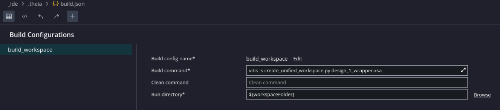

<table class="sphinxhide" width="100%">
 <tr width="100%">
    <td align="center"><h1>Vitis™ Embedded Software Tutorials</h1>
    <a href="https://www.xilinx.com/products/design-tools/vitis.html">See Vitis™ Development Environment on xilinx.com</a> </td>
 </tr>
</table>

***Version: Vitis 2023.2***

## User Managed Mode in Vitis Unified IDE

This is a new feature with the Vitis Unified Embedded IDE, where users can add a makefile and argument that can be used to create custom builds. This allows the user more control over their project builds instead of letting the tools generate the components. 

The big advantages of user managed mode are

1. Allowing user to quickly rebuild a Vitis Unified Workspace in the GUI
2. Allowing user to quickly call makefile actions

In this tutorial, we shall discuss three use cases on how the **User Managed Mode** can be used

# Use Case 1 - Regenerate a previously created Vitis Unified Workspace using a Python Script

## Lets get started

Launch Vitis 2023.2 and select open_workspace and navigate to the <i>Vitis-Tutorials/Embedded_Software/Feature_Tutorials/01-user_managed_mode</i> directory

Select the User Managed Mode


## Generating Build Configuration

In this use case, we shall be using the Python script introduced in the <i>04-vitis_scripting_flows</i> to build a workspace and with a simple Hello World application template. However, users can also utilize the Python script **logs/builder.py** that gets generated for every Vitis Unified IDE workspace.

Right click in the **Explorer** view, and select **Edit Build Configurations** and **New Build Configurations** and set as shown below:



## Running a Build Configuration

To launch the build configuration, right click on the **Explorer** view, and select **Build**. 

**Note:** If there is only a single build configuration, then this will launch automatically. If there are more than one build configurations, then the user will be presented with a list to choose from. 

This will generate the Vitis Unified IDE workspace based on the XSA.

## Deploying the application on the target

Next, we can create a **Launch Configuration** to test the application created above on our hardware target.

Right click in the **Explorer** view, and select **Edit Launch Configurations** and **New Launch Configurations** and select **Baremetal** and browse to your XSA file used to create the workspace above.


Here, we can add the FSBL (as this is for a Zynq Ultrascale Device)


Users can select on the + icon and add the ELF as shown below


Once the launch configuration is complete, users can select the **debug** icon to deploy and debug the hello world application


The Debug view will be launched and users can debug as normal


# Use Case 2 - Running Platform Creation tutorials

In this use case, we can build the example given here [here](https://github.com/Xilinx/Vitis-Tutorials/tree/2023.2/Vitis_Platform_Creation/Design_Tutorials). In particular, we will build the **Edge-AI-ZCU104** Platform.

## Lets get started

Launch Vitis 2023.2 and select open_workspace and navigate to the <i>Vitis-Tutorials/Vitis_Embedded_Flows/Embedded_Flows/Next_Steps_Embedded/User_Managed_Mode</i> directory


Select the User Managed Mode


## Generating Build Configuration

In this use case, copy the **Makefile**, **export_xsa.tcl** and the **system_step1.tcl** from The Git repository above into the workspace.

Right click in the **Explorer** view, and select **Edit Build Configurations** and **New Build Configurations** and set as shown below:


## Running a Build Configuration

To launch the build configuration, right click on the **Explorer** view, and select **Build**. 

**Note:** If there is only a single build configuration, then this will launch automatically. If there are more than one build configurations, then the user will be presented with a list to choose from. 

This will generate the XSA into the **Build** folder.

Users can target these newly generated XSA filed in Vitis Unified IDE. Users can switch views **View** → **Vitis Components**, and target the platform for their development.


# Use Case 3 - Generate and deploy u-boot from Git sources

In this demo I have a simple makefile to generate and deploy u-boot using the metadata extracted from the XSA file. The script will do the following

* Download Git sources
* Generate the Platform (with FSBL)
* Generate the device tree files
* Compile device-tree
* Compile ARM Trusted Firmware
* Compile U-boot
* Generate JTAG boot script

Each section above can be built independantly. For example, if users want to make a change to the device-tree, then only the DT needs to be compiled and re-deployed on the board. This allows the users to speed up any u-boot debug or testing. 

## Lets get started

Launch Vitis 2023.2 and select open_workspace and navigate to the <i>Vitis-Tutorials/Vitis_Embedded_Flows/Embedded_Flows/Next_Steps_Embedded/User_Managed_Mode</i> directory


Select the User Managed Mode


## Creating a Build Configuration

If users want to create a Build Configuration, then right click in Explorer view -> Edit Build Configurations, and select the + icon. Users will be presented with an empty Build Configuration. For example, if we wanted to created a build configuration to run the boot script in XSCT

```
jtag_boot:
	vitis -s ./boot_script.py
``` 

Create the build configuration as follows


## Running a Build Configuration

To run a build configuration, right click in Explorer View and select <i>Build</i> and select your build configuration from the list


## Running a Clean Configuration

Similarly, to run a clean configuration, right click in Explorer View and select <i>Clean</i> and select your Clean configuration from the list


# Sharing Build Configurations.

If users are using Git to maintain their work, then users may want to maintain or share the build configurations. This metadata is stored in the **_ide/.theia/build.json** file

# Summary

The examples above should act as an introduction to how to utilise the User Managed Mode for different design flows. However, Wether the users preference is to use the GUI or Command Line to build and maintain their Embedded System, they can still avail of all the debug features within Vitis Unified IDE with ease. 

<p class="sphinxhide" align="center"><sub>Copyright © 2020–2024 Advanced Micro Devices, Inc</sub></p>

<p class="sphinxhide" align="center"><sup><a href="https://www.amd.com/en/corporate/copyright">Terms and Conditions</a></sup></p>


