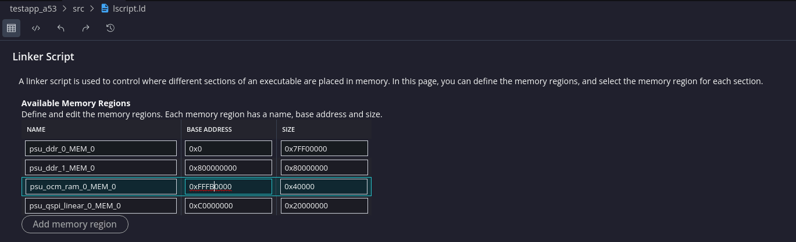
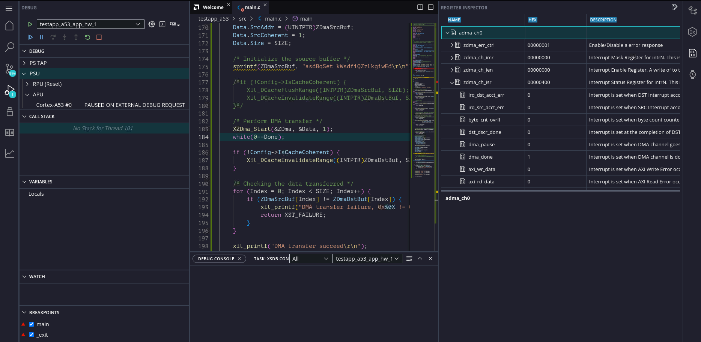

<table class="sphinxhide" width="100%">
 <tr width="100%">
    <td align="center"><h1>Vitis™ Embedded Software Tutorials</h1>
    <a href="https://www.xilinx.com/products/design-tools/vitis.html">See Vitis™ Development Environment on xilinx.com</a> </td>
 </tr>
</table>

# Debugging Bare-Metal Applications

***Version: Vitis 2024.1***

This section showcases the different debugging features available within the AMD Vitis™ embedded software development flow for bare-metal applications. Using an example application project with intentional bugs, the debug guide goes through each issue and leverages the different windows and features available in the application debug session to highlight the potential usage of debug features in a real world scenario.

## Getting Started

### Example Design

The example design targets the Xilinx® ZCU102 evaluation platform and implements a simple string manipulation example. A predefined string is loaded into a memory buffer, copied into a different memory buffer using a DMA engine, and finally transformed to lower case. As mentioned previously, the example design includes some intentional bugs and missing statements. Consequently, running the example does not generate the ideal result, but this is by design. 

### Build Instructions

## Build XSA

Launch AMD Vivado™ 2024.1 and source run the following command from the TCL console:

```
cd scripts
source create_xsa.tcl
```

This creates a **design_1_wrapper.xsa** file in ../zcu102 directory

## Build Vitis Unified Workspace

Enter the ``scripts`` directory, and run the following command from the command line:

```
cd scripts
vitis -s unified_workspace.py ../zcu102/design_1_wrapper.xsa
```

The Vitis workspace is created in the top-level directory in a folder named `unified_workspace`. Launch the Vitis Classic IDE and select the workspace to open the working directory.

## Error 1: Error Launching Program

Create a [debug launch session](https://docs.amd.com/access/sources/dita/topic?isLatest=true&ft:locale=en-US&url=ug1400-vitis-embedded&resourceid=tvc1565072991613.html) for the ``testapp_a53`` application and launch the debug session with the default settings. The process will be interrupted with an error message.


To debug an application, a launch configuration must be created with the desired settings. These settings generate a Xilinx System Debugger (XSDB) script that is executed to download the applications to the device. The debug launch process is transparent to the user, and the expected outcome is for the application to stop at the ``main`` function, so you can start debugging the code from there.

In some cases, however, this under-the-hood script may not execute successfully, generating error or warning messages that lead to a cancelled debug session. These scenarios are most likely on board bring-up processes, due to either incorrect hardware configurations in AMD Vivado™ or hardware-related issues. The issue usually manifests as an error message stating that the initialization process (FSBL execution) did not succeed, or as an error message pointing that launching the program did not succeed. An incorrect linker script that places code on non-initialized or invalid memory addresses might also display similar symptoms.

When an error occurs in the program launching process, the best debugging approach is to replicate the process manually. The Vitis IDE prints the auto-generated XSDB script in the Vitis Log window. This means that you can easily reuse the script to create a custom modified script or to execute the commands in the XSDB window manually. As well as being helpful for debugging, you can also use these scripts to create command line debug sessions, regression testing scripts, and so on. 


Open the XSDB window in the Vitis IDE and execute each command line in the script manually until you reach the command that generates the error.


Running each command one by one lets you to see that the issue in this particular test case is in the download process of the ``testapp_a53`` application to memory. See the [dow](https://docs.amd.com/r/en-US/ug1400-vitis-embedded/dow) command for more information.

In this case, the error message has already pointed out the root cause of the issue. There is a memory write error at 0xFFFB0000 that does not belong to a memory region according to the _Zynq Ultrascale+ MPSoC Technical Reference Manual_ ([UG1085](https://www.xilinx.com/support/documentation/user_guides/ug1085-zynq-ultrascale-trm.pdf#G12.407191)). Checking the linker script in the Vitis IDE confirms that there is a mistake in the OCM memory region description because the base address is not correct.



Open the linker script in a text editor and modify the base address of the OCM memory region to match with the correct address.


Build the application and launch your previously created debug session again. Finally, the launch process succeeds and the test application is stopped at the ``main`` function breakpoint.


## Error 2: Unfinished DMA Operation

Resume the execution of the application and wait to see if the application reaches the end. The application keeps running. Pausing the execution shows that the DMA operation has not been finished, so the program execution is looping forever.


The DMA operation is monitored by an interrupt handler that has not been executed for some reason. The [Registers view](https://docs.amd.com/r/en-US/ug1400-vitis-embedded/Viewing-Target-Registers) in the Vitis IDE can be used in these cases to inspect the peripheral/controller status as well as the processor status for debugging purposes. This window is context aware, which means that the registers shown in the window are based on the target selected in the Debug window.

Select the PSU target in the Debug window and check the ADMA_CH0 controller (the channel used for the data transfer) registers. The DMA_DONE bit within the ZDMA_CH_ISR register shows that the transfer is completed and the interrupt signal in the controller is also triggered.



Select the **Cortex-A53#0** target in the Debug window and check that the interrupt for the LPD DMA CH0 is not enabled in the corresponding GICD_ISENABLER# register. The interrupt signal is consequently created in the DMA controller but is not handled in the interrupt controller, which prevents the handler from being executed and the loop from finishing in the application code. Review of the code can confirm that the interrupt is not enabled in the GIC using the ``XScuGic_Enable`` function.


Open ``main.c`` in the file editor and correctly add the ADMA_CH0 interrupt ID. 

```
	Status = XSetupInterruptSystem(&ZDma, &XZDma_IntrHandler,
				       Config->IntrId, Config->IntrParent,
				       XINTERRUPT_DEFAULT_PRIORITY);
```


Build the application and launch the initially created debug session again. This time, the application is executed completely and the exit point is reached, confirming that the DMA transfer is completed.


## Error 3: Unexpected DMA Transfer Result

Despite the successful DMA transfer, the serial output of the application shows that there is an unexpected result, because the destination buffer does not match with the source buffer.


Launch the debug session and place a breakpoint in the ``return XST_FAILURE`` line for the DMA transfer, so that the execution is halted when the transfer failure is detected and the memory is inspected for further analysis.


The Vitis IDE provides the following main methods of inspecting the memory content:

- **Memory tab:** Displays the memory content based on memory addresses.
- **Variables tab:** Displays all the variables in the context of a function.
- **Expressions tab:** Displays any valid symbol in the context of the application.

These tabs are all context aware, meaning that they display content based on the context target selected in the Debug session window (APU, R5#0, or A53#0). The Variables and Expressions tabs are therefore only valid for the targets where the application is running. Additionally, processor targets display the cache value rather than the content in the physical memory.

The index variable value indicates that the first element of the destination array does not match with the first element on the source buffer. Because both the ZDmaSrcBuf and ZDmaDstBuf variables are static, they are not displayed in the **Variable** window, so you can use the **Expressions** window to inspect them. Select the **Expressions** tab and add both buffers to the list. The displayed expressions confirm that the destination buffer is populated with the default values.


When a processor core accesses cacheable memory, the read value may not be the value in the physical memory. You can use the Vitis IDE to access the same memory address from a different target not subject to the cache. Targets such as the APU cluster or PSU are not subject to the cache, but they do not have an associated symbol file either, so the Variables and Expressions tables do not apply.


Use the memory window and add the address of both ZDmaSrcBuf (0xB180) and ZDmaDstBuf (0xB1C0). Check the values on ZDmaDstBuf to verify that the DMA transfer is performed properly and the destination buffer is identical to the source buffer.


The process of accessing the memory from the APU generates cache maintenance operations, so the A53#0 core is able to get the correct values from the destination buffer moving forward. Select the A53#0 core again, and right-click in the **Expressions** tab to refresh the values. The values in the destination buffer now match the sources.


The debugging effort detailed above confirms that there is a cache maintenance operation missing in the application; specifically, cache invalidation prior to reading back the destination buffer after the DMA operation is performed. This operation would ensure that the physical memory is read instead of whatever the cache might have.

Open ``main.c`` in the file editor and add `Xil_DCacheInvalidateRange((INTPTR)ZDmaDstBuf, SIZE);` after the DMA transfer is performed and prior to reading the destination buffer.


Build the application and launch the initially created debug session again. This time the execution does not end at the exit point, but serial output confirms that the DMA transfer is successful.


## Error 4: Assertion

With the latest changes in the code, the application still does not succeed executing the whole application. Stopping the core in the debugger shows that it is looping forever in the ``Xil_Assert`` function.


AMD provides an [assertion API](https://www.xilinx.com/support/documentation/sw_manuals/xilinx2021_1/oslib_rm.pdf#page=12) in the standalone API that can be used to check whether a condition is met at particular times in the execution. This API is commonly used within the AMD BSP drivers as well as in your application code. To check how a processor ends up on a certain point in the code, the call stack or backtrace feature within the IDE can be helpful.

Select the lowercase function line in the backtrace of the Cortex-A53#0 target in the **Debug** window to check which line actually calls the assertion function.


Reviewing the code line originating the assertion, you can see that the conditional statement has not been met, and that there is a bug in the code (the comparison should be lower than or equal to ``SIZE``). Modify the line to use the corret assertion statement:

```
Xil_AssertNonvoid(size <= SIZE);
```

Build the application and launch the debug session again. This time, the application is executed completely and the exit point is reached.

## Error 5: Non-Lowercased Characters

In the previous step, the execution flow of the example application reached the end, but the result of the string lowercase conversion did not succeed because the 'Z' character is not lowercased.


Because the lowercase conversion is performed in a "while" loop without any exit point on failure, the only way to check the execution flow for the mentioned element in the array with a breakpoint is by actually stepping through the loop until you reach the appropriate index. Adding a watchpoint can help you to avoid this approach, setting a conditional breakpoint to stop when the element 'Z' in the buffer is read.

Add a watchpoint triggered by a read operation on element 16 of ZDmaDstBuf.


Launch the debug session and run through the code until the execution is stopped.


Stepping through the code confirms that the lowercase conversion has not been not performed for the 'Z' character. A review of the ``if`` statement shows that the upper limit has been set incorrectly: the lower and upper limit should be >= 65 and <= 90, according to the ASCII table specification.

Modify the comparison statement to include the correct boundaries for uppercase ASCII characters as shown in the following example:

 ```
 if((bufptr[idx] >= 65) && (bufptr[idx] <= 90)) {
 ```

Build the application and launch the debug session again. This time, the application is executed completely, and the original string is lowercased properly in the destination buffer.


<p class="sphinxhide" align="center"><sub>Copyright © 2020–2024 Advanced Micro Devices, Inc</sub></p>

<p class="sphinxhide" align="center"><sup><a href="https://www.amd.com/en/corporate/copyright">Terms and Conditions</a></sup></p>
