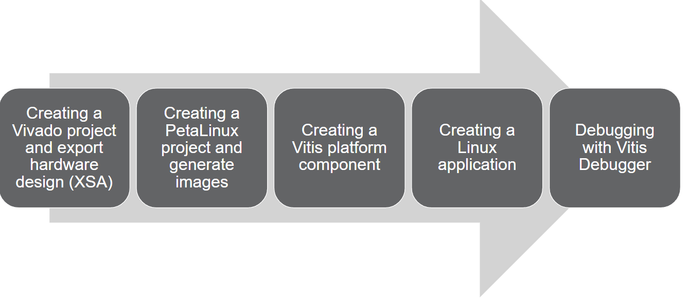
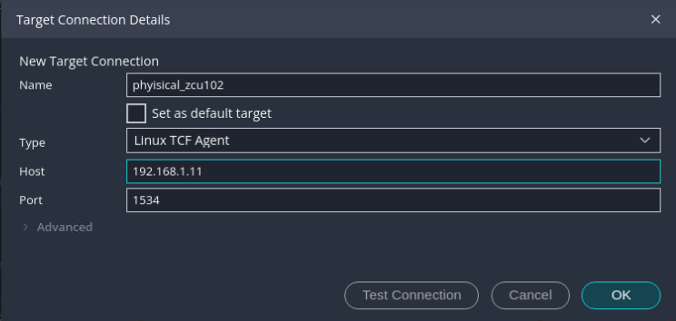
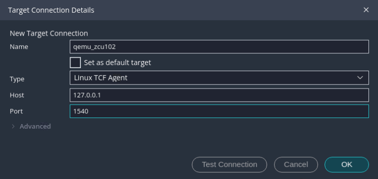
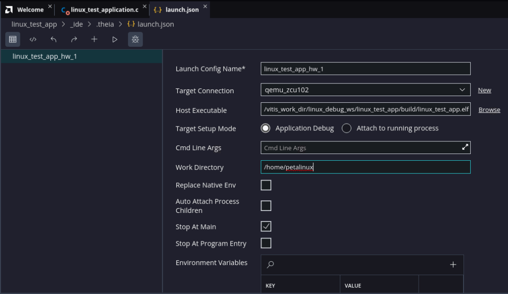
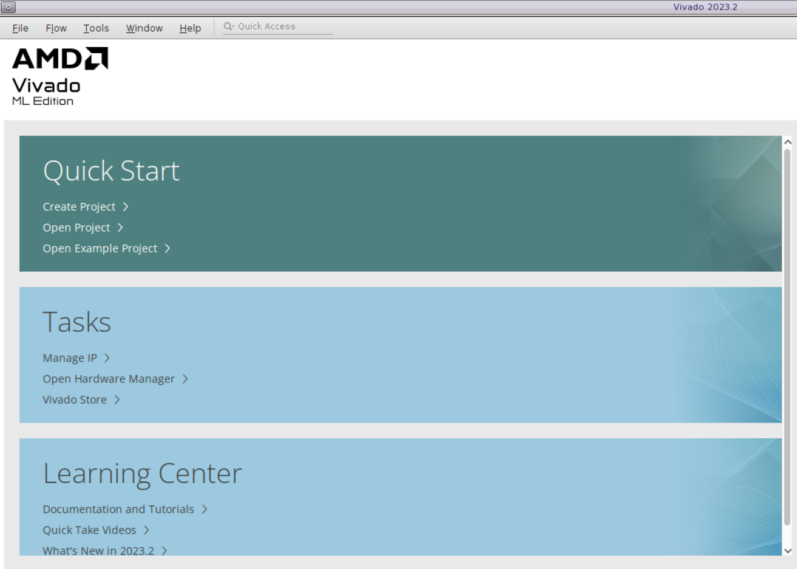
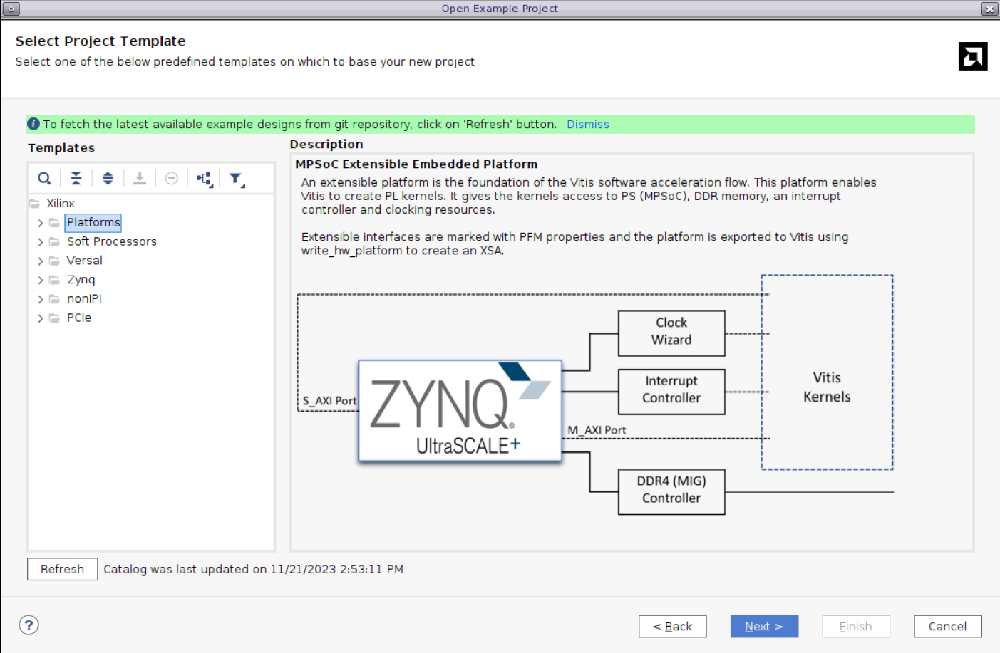
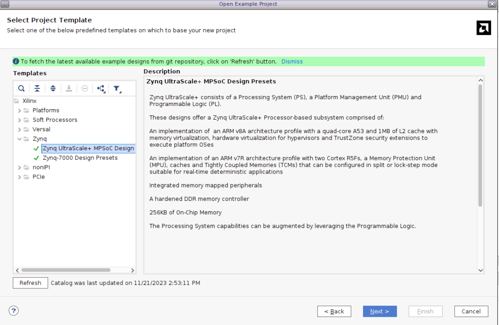
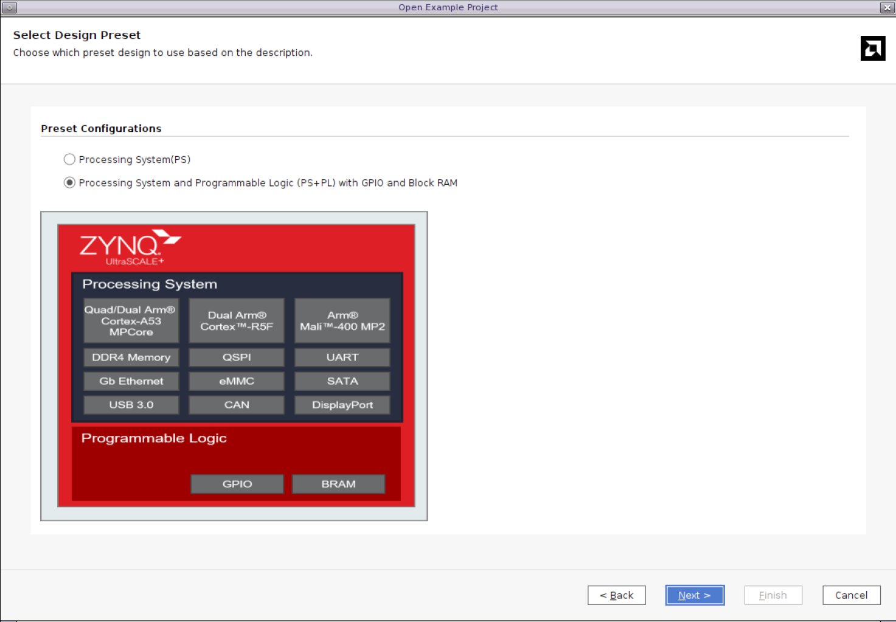
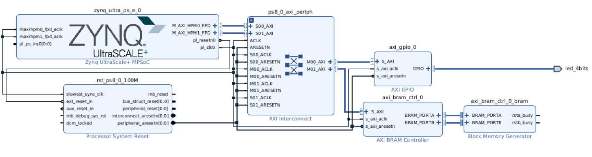
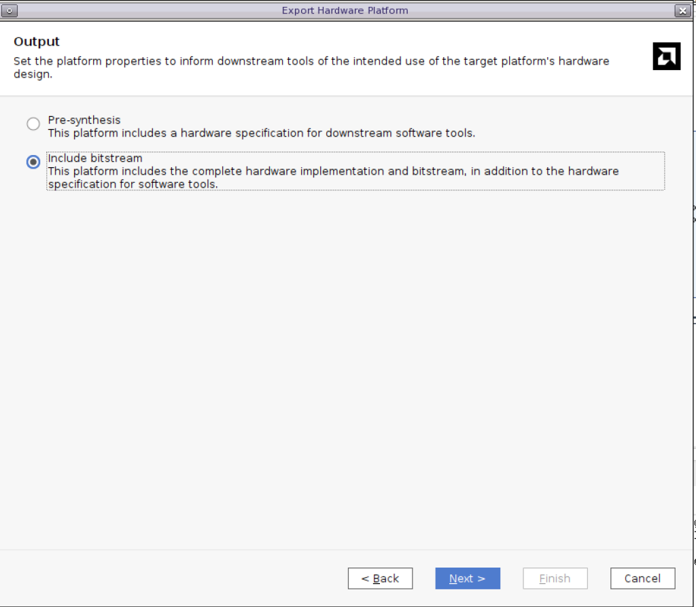

<table class="sphinxhide" width="100%">
 <tr width="100%">
    <td align="center"><h1>Vitis™ Embedded Software Tutorials</h1>
    <a href="https://www.xilinx.com/products/design-tools/vitis.html">See Vitis™ Development Environment on xilinx.com</a> </td>
 </tr>
</table>

# Debugging Linux Applications

***Version: Vitis 2024.1***

The AMD Vitis™ IDE provides a familiar environment for debugging Linux applications for a target platform. This section covers the following Linux application debug features:

- Setting breakpoints
- Stepping through program execution
- Viewing program variables, memory contents, and the stack 

The following diagram illustrates the general Linux application debug flow. The Vitis Debugger an integrated debugger supporting AMD Zynq™ 7000 SoC, AMD Zynq™ UltraScale+™ MPSoC, and MicroBlaze™ and AMD Versal™ processors.



 
## Limitations

Xen aware and OS aware debugging is not supported in Vitis Unified IDE 2024.1. If you require this feature, then it is recommended that you use Vitis Classic 2023.2.

## Getting Started

Linux debug setup is a mandatory step. Setup allows you to create platform and application projects in the Vitis IDE. There is a script attached to this tutorial that users can use to generate a demo XSA, Sysroots and Vitis Workspace.

1. Open a terminal and navigate to the script’s directory, and source the Petalinux tool.
2. Run the command *make all*. This will take some time.
3. Launch the Vitis IDE **vitis_unified** workspace. 

**Note:** The scripts above will generate the HW and SW images automatically for a ZCU102 board. However, users can refer to the [Appendix](#appendix) section for supplementary information about creating a hardware design and building software boot images manually.

## Error 1: Failed in Validating the test connection


1. In the Vitis workspace under `FLOW`, select the `Build` and click the `Open Settings` icon to open the `Launch Configurations`.
2. Select `Debug` icon


   

### Setting Up the Ethernet Connection

Select the settings based on your connection

## Connecting to Physical Board


- Set your host machine's Ethernet address to a static IP (suggested: 192.168.1.10).
- Using the serial terminal, configure the board's IP address to 192.168.1.11:

  ```
  ifconfig eth0 192.168.1.11
  ```
  **Note:** This can be any address other than the one that the host is configured to on the same Subnet LAN.

- Ping the host machine using the terminal to verify connectivity.

  ```
  ping 192.168.1.10 –c 1
  ```
## Connecting to QEMU

Petalinux supports the Quick EMUlation (QEMU) emulator. This is useful if users do not have access to Physical board. Users can use the following steps to boot Linux on QEMU. Users can pass `qemu-args` to pass the network information. The hardware used in this tutorial is for a ZCU102 which has the GEM enabled at GEM3. This command will look slightly different if a different GEM is used.

The hostfwd definitions along with user network arguments, that is ,   `-net nic -net nic -net nic -net nic,vlan=1 -net user,vlan=1) hostfwd=tcp:<host address>:<host port used for forwarding>-<guest address>:<guest port>`

```
petalinux-boot --qemu --kernel --qemu-args "-net nic -net nic -net nic -net nic,netdev=gem3 -netdev user,id=gem3,hostfwd=tcp:127.0.0.1:1540-10.0.2.15:1534"
```
**Tip** The Login is *petalinux* by default.

**Note** Use Ctrl A + x to exit the QEMU

### Setting Up the TCF Agent


## Physical Board Linux Agent

- **Vitis -> Target Connections**.
- Right click on **Linux TCF Agent** option and select **New Target**.
- Change the host IP address to localhost or 127.0.0.1. 
- change the Port to 1540
- Click **OK**.



## QEMU Linux Agent

- **Vitis -> Target Connections**.
- Right click on **Linux TCF Agent** option and select **New Target**.
- Change the host IP address to 192.168.1.11. 
- Click **OK**.



## Error 2: Multithread Application Debug

Enable the `_ERROR5_` macro in the application source file `linux_test_application.c` and disable `_ERROR3_` and `_ERROR6_` as shown below.

```
//#define _ERROR3_
#define _ERROR5_
//#define _ERROR6_
```

The goal of multithread application debugging is to make the application thread-safe. You need to debug the application and identify the locations to protect read/write operations.

2. Under `FLOW`, highlight the `linux_test_app`, and Build.
3. Under `FLOW`, highlight the `linux_test_app`, and Debug to launch a Launch Configuration. 
4. Select, the Target Connection; either `physical_zcu102`, or `qemu_zcu102` and the Work Directory to /home/petalinux`



4. The code stops at the program entry. There are various debugging techniques such as breakpoints, stepping, and so on to identify the data that must be protected. This example will use the breakpoint inside thread function.
5. Put a breakpoint at below two lines.

    ```
    printf("\n Job %d started\n", counter);
    .......
    .......
    printf("\n Job %d finished\n", counter);
    ```
5. Click **Resume** and check the Job ID printed in the console. Here, the job to be done is not thread-safe.
6. Open the **Variables** view to track the counter variable value.
7. Use a synchronization mechanism (mutex, for example) to ensure that two or more concurrent threads do not simultaneously execute read/writes.

8. Uncomment the mutex code lines listed below from the application to make it thread-safe.

    ```
    ............................
    ............................

    #ifdef _ERROR5_
    void* doSomeThing(void *arg)
    {
      //  pthread_mutex_lock(&lock);
      .................
      .................
      // pthread_mutex_unlock(&lock);
      .................
    }
    #endif
    ............................
    ............................
    #ifdef _ERROR5_
    /* if (pthread_mutex_init(&lock, NULL) != 0)
        {
            printf("\n mutex init failed\n");
            return 1;
        }
    */
    ...............
    ...............
    ...............
    //    pthread_mutex_destroy(&lock);
    ```
9. Rebuild the application.
10. Relaunch the `Launch Configuration`
11. Observe the output.


## Error 3 : Dynamic Memory Allocation

Enable the `_ERROR6_` macro in the application source file `linux_test_application.c` and disable `_ERROR3_` and `_ERROR5_` as shown below.

```
//#define _ERROR3_
//#define _ERROR5_
#define _ERROR6_
```
The goal of dynamic memory allocation debugging is to understand memory management.

1. Under `FLOW`, highlight the `linux_test_app`, and Build.
2. Under `FLOW`, highlight the `linux_test_app`, and Debug to launch a Launch Configuration. 
3. Select, the Target Connection; either `physical_zcu102`, or `qemu_zcu102` and the Work Directory to /home/petalinux`


4. The code stops at the program entry.
5. Use debugging techniques such as the Variables view, step over, breakpoints, and so on to identify the incorrect memory assignment.
6. Place a breakpoint at the following lines.

    ```
    *ptr = i + 1;
    ptr++;
    ```         
7. Click **Resume** and let the tool stop at the breakpoint.
8. Open **Variables** view to check the **ptr** value. Observe that a value is not correctly assigned to a pointer.
9. Comment out the following code lines:

    ```
    #ifdef _ERROR6_
    ................
    ................
    ................
    //ptr = i + 1;
    //ptr++;
    ................
    ```

10. Uncomment the following line of code to make the appropriate pointer assignment.

    ```
    #ifdef _ERROR6_
    ................
    ................
    ................
    ................
    ptr[i] = i + 1;
    ................
    ```

11. Rebuild the application.
12. Relaunch the `Launch Configuration`
13. Observe the output.

## Appendix

[Vivado Design](#Vivado-Design) explains how to use a Vivado example design to create a Vivado project. This set of steps gives you the XSA file from Vivado to export. You can skip the manual steps and use this Tcl script to create an XSA directly.

[PetaLinux Build](#petalinux-build) explains how to create a PetaLinux project, and how to configure and build boot images. 

### Vivado Design

**Note**: You can skip these steps by running the [automation steps](#automation-steps) instead. 

#### Creating the Block Design

The first step is to create a block design. You can create this according to your specific requirements, but here you will create a Zynq UltraScale+ MPSoC based example project using a template, as explained below.

1. On the Welcome screen, navigate to **Quick Start** and click **Open Example Project**.

   

2. The Create Example Project wizard will be launched. Click **Next**.

3. In the Select Project Template window, click **Refresh** to install templates.

   
 
4. You will now be able to see the **Zynq UltraScale+ MPSoC Design Presets** template. Select the template and click **Next**.

   

6. Update the Project Name to "zcu102" and update the path.

7. In the next window, select **Zynq UltraScale+ MPSoC ZCU102 Evaluation Board** and click **Next**. Here, you can see two preset designs. Select the second option (**Processing System and Programmable Logic (PS+PL) with GPIO and Block RAM**) and click **Finish**.

   

  The block design you have created for the example project is shown in the following figure.

  

#### Generating the Bitstream
The preset example creates an HDL wrapper and also generates output products. You can directly perform synthesis and implementation, and you can generate a bitstream. To generate a bitstream, click **Generate Bitstream**. 

#### Exporting the XSA

After successful bitstream generation, navigate to **File > Export > Export Hardware** to launch the Export Hardware Platform wizard. 
Click **Next** and export the hardware with the **Include bitstream** option. Enter the desired XSA name and complete the wizard.




#### Automation Steps

Launch the Vivado Tcl console. Source `scripts/create_xsa.tcl`. 

### PetaLinux Build

It is required to configure the PetaLinux project to support Linux application debug. Run the following commands for each step listed below. You can use the BSP for their board. However, the steps below uses ZynqMP template, and the MACHINE_NAME is updated. This would be a more generic flow

1. Create the PetaLinux project:

    ```
    petalinux-create project --template zynqMP -n ./xilinx-zcu102-v2024.1 --tmpdir /tmp/${USER}/zcu102/petalinux
    ```

2. Configure the hardware description:

    ```
    cd xilinx-zcu102-2024.1
    petalinux-config --get-hw-description <path to XSA>
    ```

3. Configure the DTG Options 


    - Select `DTG Options`: 

        ```
        (zcu102-rev1.0) MACHINE_NAME
        ```

3. Configure the root file system to enable TCF agent:

    ```
    petalinux-config -c rootfs
    ```

    - Select `Filesystem Packages`: 

        ```
        Filesystem Packages ---> 
        ```

    - Scroll down to select `misc`.

        ```
        misc --->
        ```

    - Scroll down to select `tcf-agent`. Ensure that the `tcf-agent` is enabled.

        ```
        [*] tcf-agent 
        [ ] tcf-agent-dev 
        [ ] tcf-agent-dbg
        ```

4. Go back to the `Filesystem Packages` menu and click **console**.

    ```
    console --->
    ```

5. Navigate to `network`.

    ```
    network --->
    ```

6. Click into the `dropbear` submenu and make sure that `dropbear` is enabled:

    ```
    [*] dropbear
    ```

7. Go back to the previous menu to select OpenSSH and ensure that `openssh-sftp-server` is enabled.

    ```
    [ ] openssh 
    [ ] openssh-ssh 
    [ ] openssh-sftp 
    [*] openssh-sftp-server 
    [ ] openssh-keygen 
    [ ] openssh-dbg 
    [ ] openssh-dev 
    [ ] openssh-misc 
    [ ] openssh-sshd 
    [ ] openssh-scp
    ```

8. Save the configuration and exit. 

9. Build: 

    ```
    petalinux-build
    ```

10. Sysroot:

    ```
    petalinux-package --boot --u-boot
    petalinux-build --sdk
    petalinux-package --sysroot
    ```
**Note:** You can skip all the above steps by using the `make sysroots` script to build the Linux images. 


<p class="sphinxhide" align="center"><sub>Copyright © 2020–2024 Advanced Micro Devices, Inc</sub></p>

<p class="sphinxhide" align="center"><sup><a href="https://www.amd.com/en/corporate/copyright">Terms and Conditions</a></sup></p>
