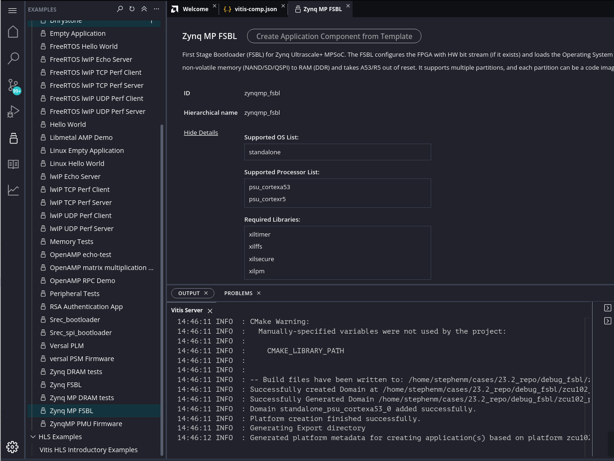
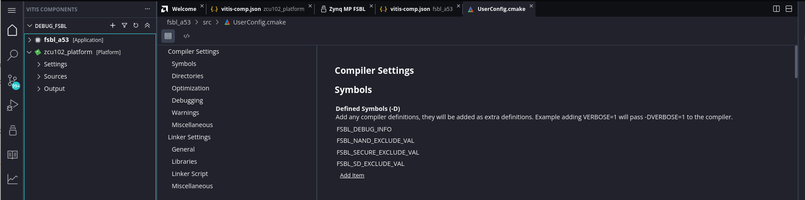
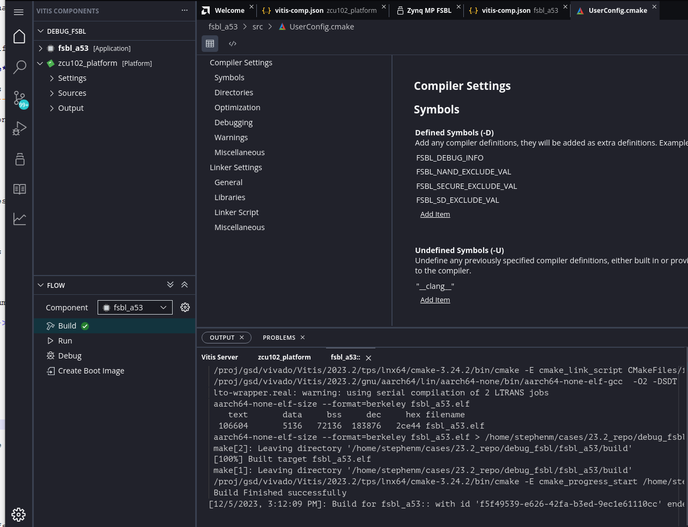
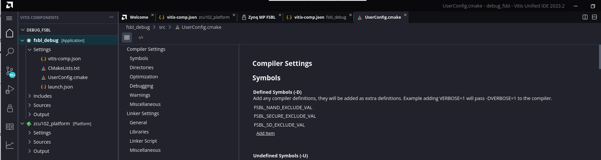

<table class="sphinxhide" width="100%">
 <tr width="100%">
    <td align="center"><h1>Vitis™ Embedded Software Tutorials</h1>
    <a href="https://www.xilinx.com/products/design-tools/vitis.html">See Vitis™ Development Environment on xilinx.com</a> </td>
 </tr>
</table>

# Creating a Debuggable First Stage Boot Loader

***Version: Vitis 2024.1***

First Stage Boot Loader (FSBL) can initialize the SoC device, load the required application or data to memory, and launch applications on the target the CPU core. FSBL is optimized for size because it must fit in the OCM, which has limited space on the device. Size based optimization introduces some trouble, if you want to debug FSBL when you add customized code into FSBL. This chapter explains how you can use AMD Vitis™ Unified IDE to debug FSBL step by step.

## Where is the FSBL built

You can create the FSBL automatically if you select the **Generate Boot Artifacts** when creating the platform in either the Vitis Classic IDE or the Vitis Unified IDE. You can also generate the FSBL manually using the application template available in the Vitis IDE. The FSBL source code supports the enabling of debug metadata in the `xfsbl_debug.h` file. You can directly add a #define to enable the debug, or you can pass this through a symbol in the C/C++ build settings. In this tutorial, the FSBL is created manually, and not by enabling the boot components/artifacts during the platform creation. 

If you desire more detailed information during the boot process but are not planning to modify the FSBL source code, you can set FSBL to print more information - but it is not necessary to run FSBL in the Vitis debugger. In this example, you create an FSBL image targeted for ARM™ Cortex-A53 core 0 and update its properties to enable detailed print info. 

By default, the FSBL is configured to show basic print messages. For a list of the possible debug options for FSBL, refer to the `src/xfsbl_debug.h` file.

Medium level verbose printing is good for most designs. Enable `FSBL_DEBUG_INFO` by performing the following steps:

```C
#if defined (FSBL_DEBUG_DETAILED)
#define XFsblDbgCurrentTypes ((DEBUG_DETAILED) | (DEBUG_INFO) | (DEBUG_GENERAL) | (DEBUG_PRINT_ALWAYS))
#elif defined (FSBL_DEBUG_INFO)
#define XFsblDbgCurrentTypes ((DEBUG_INFO) | (DEBUG_GENERAL) | (DEBUG_PRINT_ALWAYS))
#elif defined (FSBL_DEBUG)
#define XFsblDbgCurrentTypes ((DEBUG_GENERAL) | (DEBUG_PRINT_ALWAYS))
#elif defined (FSBL_PRINT)
#define XFsblDbgCurrentTypes (DEBUG_PRINT_ALWAYS)
#else
#define XFsblDbgCurrentTypes (0U)
#endif
```

## Enabling Detailed Prints in FSBL in Vitis Unified IDE


1. Launch Vitis Unified IDE, if it is not already open.

2. Set the Vitis workspace. For example, `C:\edt\fsbl_debug_info`.
   
3. Select **File → New Component → Platform**
  

   | Screen                        | System Properties                         | Settings                   |
   | ---------------------------   | ----------------------------------------- | -------------------------- |
   | Name and Location             | Component Name                            | zcu102_platform            |
   |                               | Component location                        | default                    |
   | Select Platform Creation Flow |                                           | Hardware Design            |
   |                               | Browse to XSA                             | Select XSA                 |
   | Select Platform Creation Flow | Operating System                          | standalone                 |
   |                               | Processor                                 | psu_cortexa53_0            |
   |                               | Generate boot Artifacts                   | Uncheck                    |

4. The platform generates a default BSP (Domain) called "standalone_psu_cortexa53_0". However, this domain does not have the required libraries needed for the AMD Zynq™ MP FSBL. You can create the Zynq MP FSBL from the application template and allow the tools to generate the domain.

5. Select **Zynq MP FSBL** from the **Examples**.

**Note:** If the **Examples** icon is not enabled, then enable this in **View -> Examples**.

 

**Note:** Here, you can see the required libraries; xilffs, xilsecure and xilpm
 
6. Select **Create Application Component from Template** and follow the steps below

   | Screen                        | System Properties                         | Settings                   |
   | ---------------------------   | ----------------------------------------- | -------------------------- |
   | Name and Location             | Component Name                            | fsbl_a53                 |
   |                               | Component location                        | default                    |
   | Select Platform               | Name                                      | zcu102_platform            |
   | Select Domain                 |                                           |                            |
   | + create new ...              | Name                                      | fsbl_domain                |
   |                               | Display Name                   		   | fsbl_domain                |
   |                               | OS                   		               | standalone                 |
   |                               | Processor                   		       | psu_cortexa53_0            |
   
7. Click **Next** and **Finish**. The Vitis IDE creates the FSBL application component. This uses the zynqmp_fsbl domain template that includes the required libraries.


## Modifying the FSBL BSP 

The FSBL application is capable of performing numerous tasks. The tasks it executes are based on the user definition in header files. Some functions are not executed by default. GCC includes these functions into the compiled executable by default. Since the OCM only has a capacity of 128 KB and the FSBL runs on the OCM, unused functions must be stripped out to make FSBL fit into the OCM. Fortunately, the **zynqmp_fsbl** application template available in the Vitis Unified IDE uses compiler option `-Os -flto -ffat-lto-objects` by default. You do not need to take any action here.
 

8. Select the zcu102_platform under **FLOW and Build**

Next, set the verbose level in the FSBL. Medium level verbose printing is good for most designs. Enable `FSBL_DEBUG_INFO` by performing the following steps:

1. In the **Vitis Components** view, select the fsbl_a53 -> Settings -> vitis_comp.json.

2. Select **UserConfig.cmake**.

3. Select **Symbols** > **Defined Symbols**.

4. Click the **Add Item** link.

5. Enter `FSBL_DEBUG_INFO`.




## Building the Project

Select the fsbl_a53 under FLOW and Build. 



The FSBL executable is now saved as ``fsbl_a53/debug/fsbl_a53.elf``. In this tutorial, the application name ``fsbl_a53`` is to identify that the FSBL is targeted for the APU (the Arm Cortex-A53 core).

**Note:** If the system design demands, you can target the FSBL to run on the RPU.

## Debugging FSBL Using the Vitis Debugger

Sometimes, you need to modify the FSBL source code to add more custom features. To debug these features, run FSBL in the Vitis debugger. This example guides you through the steps to run FSBL in Vitis debugger.

FSBL is built with size optimization and link time optimization flags (such as `-Os`). These optimizations reduce the memory footprint of FSBL but can make debugging difficult. Removing optimizations can lead to increased code size, which can result in FBSL build failure (because FSBL needs to run on the 128 KB OCM). Instead, these optimizations should be disabled for debugging purposes. To do this, some FSBL features should be disabled in the ``xfsbl_config.h`` file of the FSBL if they are not required.


### Creating and Modifying FSBL in Vitis Unified IDE

1. Launch Vitis Unified IDE, if it is not already open.

2. Set the Vitis workspace. For example, `C:\edt\fsbl_debug_info`.
   
3. Select **File → New Component → Platform**
  

   | Screen                        | System Properties                         | Settings                   |
   | ---------------------------   | ----------------------------------------- | -------------------------- |
   | Name and Location             | Component Name                            | zcu102_platform            |
   |                               | Component location                        | default                    |
   | Select Platform Creation Flow |                                           | Hardware Design            |
   |                               | Browse to XSA                             | Select XSA                 |
   | Select Platform Creation Flow | Operating System                          | standalone                 |
   |                               | Processor                                 | psu_cortexa53_0            |
   |                               | Generate boot Artifacts                   | Uncheck                    |

4. The platform generates a default BSP (Domain) called "standalone_psu_cortexa53_0". However, this domain does not have the required libraries needed for the AMD Zynq™ MP FSBL. You can create the Zynq MP FSBL from the application template and allow the tools to generate the domain.

5. Select **Zynq MP FSBL** from the **Examples**.

**Note:** If the **Examples** icon is not enabled, then enable this in **View -> Examples**.

 

**Note:** Here, you can see the required libraries; xilffs, xilsecure and xilpm
 
6. Select **Create Application Component from Template** and follow the steps below

   | Screen                        | System Properties                         | Settings                   |
   | ---------------------------   | ----------------------------------------- | -------------------------- |
   | Name and Location             | Component Name                            | fsbl_a53                   |
   |                               | Component location                        | default                    |
   | Select Platform               | Name                                      | zcu102_platform            |
   | Select Domain                 |                                           |                            |
   | + create new ...              | Name                                      | fsbl_domain                |
   |                               | Display Name                   		   | fsbl_domain                |
   |                               | OS                   		               | standalone                 |
   |                               | Processor                   		       | psu_cortexa53_0            |
   
7. Click **Next** and **Finish**. The Vitis IDE creates the FSBL application component. This uses the zynqmp_fsbl domain template which includes the required libraries.


### Disabling Optimizations


1. Under the Vitis Components, select the zcu102_platform -> Settings -> vitis_comp.json.
2. Then select zcu102_platform -> psu_cortexa53_0 -> standalone_psu_cortexa53_0 -> Board support package.
3. Edit **proc_extra_compiler_flags** to ensure **extra compiler** only has this value `-g -Wall -Wextra -Os` as shown below.
4. Regenerate BSP


The next step is to remove unused functions to save code space. To do this, follow the steps below:
1. In the Vitis Components view, select the fsbl_a53 -> Settings -> vitis_comp.json.
2. Click **UserConfig.cmake**.
3. Select **Symbols -> Defined Symbols**.
4. Click the **Add Item** link.
5. Enter
`FSBL_NAND_EXCLUDE_VAL`
`FSBL_SECURE_EXCLUDE_VAL`
`FSBL_SD_EXCLUDE_VAL`

 

At this point, FSBL is ready to be debugged.

You can either debug the FSBL like any other standalone application, or debug FSBL as a part of a boot image by using the **Attach to running target** mode in System Debugger.


------

<p class="sphinxhide" align="center"><sub>Copyright © 2020–2024, Advanced Micro Devices, Inc. All rights reserved. SPDX-License-Identifier: X11</sub></p>

<p class="sphinxhide" align="center"><sup><a href="https://www.amd.com/en/corporate/copyright">Terms and Conditions</a></sup></p>
