<table class="sphinxhide" style="width:100%;">
  <tr>
    <td align="center">
      <picture>
        <source media="(prefers-color-scheme: dark)" srcset="https://raw.githubusercontent.com/Xilinx/Image-Collateral/main/logo-white-text.png">
        
      </picture>
      <h1>AMD Vitis™ Embedded Software Tutorials</h1>
      <a href="https://www.amd.com/en/products/software/adaptive-socs-and-fpgas/vitis.html">See Vitis™ Development Environment on amd.com</a>
    </td>
  </tr>
</table>

# Cross Triggering in Vitis Unified Embedded IDE

***Version: Vitis 2025.2***

Embedded systems can be complex, that may contain multiple processors. You can also debug across software and hardware domains and can use PS-PL cross triggering. However, In this simple tutorial, you learn how we can debug over multiple processors using cross triggering.

### Building the HW 

There is a script delivered with this tutorial to build the the HW from scratch, or use the prebuilt hardware (default). To do this use the command below

```
cd scripts
make build_hw
```
## Processor to Processor Cross Triggering

In this Lab, we will learn how we can Cross Trigger across two processors. To build use the command below

```
cd scripts
make build_sw LAB=1
```

This will create two **hello world** applications for the cortexa53_0 and cortexa53_1 respectively. These applications will also be added to a system project which we will use for creating the launch configuration. The **hello world** running on the cortexa53_1 has a while loop for demo purposes

```
int main()
{
    init_platform();

    while(1) {
        print("Hello World from #1\n\r");
    }
    cleanup_platform();
    return 0;
}
```

The ***hello world*** application targeting the cortexa53_0 is shown below

```
int main()
{
    init_platform();

    print("Hello World from #0\n\r");
    cleanup_platform();
    return 0;
}
```

Launch AMD Vitis™ Unified embedded tool in 2025.2 and open the **lab1** workspace.

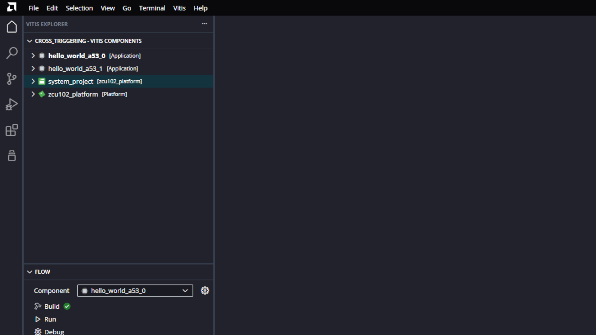

### Setup Cross Triggering in Launch Configuration

1. Highlight the System Project, and under ***FLOW***, select ***Debug*** and ***Open Settings***. Then select ***New Launch Configuration***
2. Select the ***Enable Cross Triggering*** as shown below
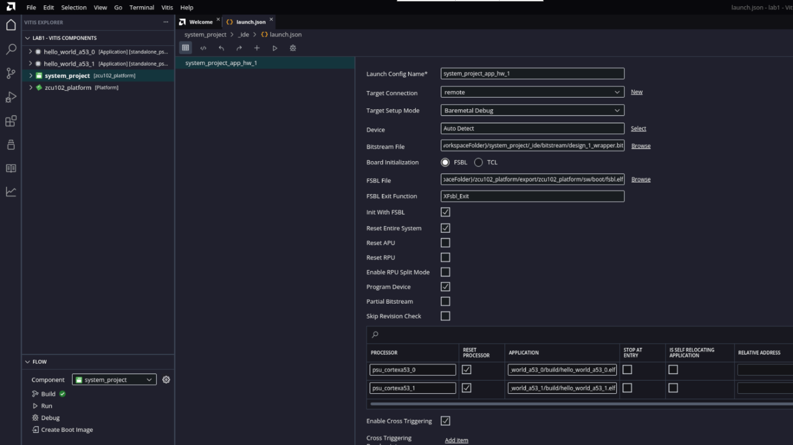
3. Select ***Cross Triggering Breakpoints***, and ***Add Item*** and configurate as shown below. For example, here we want to trigger the Cortex a53 #1 when there is a breakpoint on Cortex a53 #0
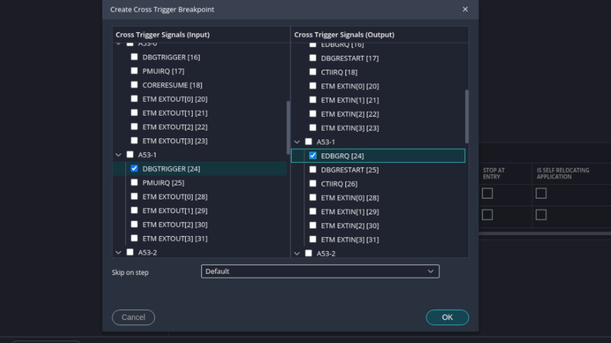
4. Select the ***Debug*** icon to launch the debug
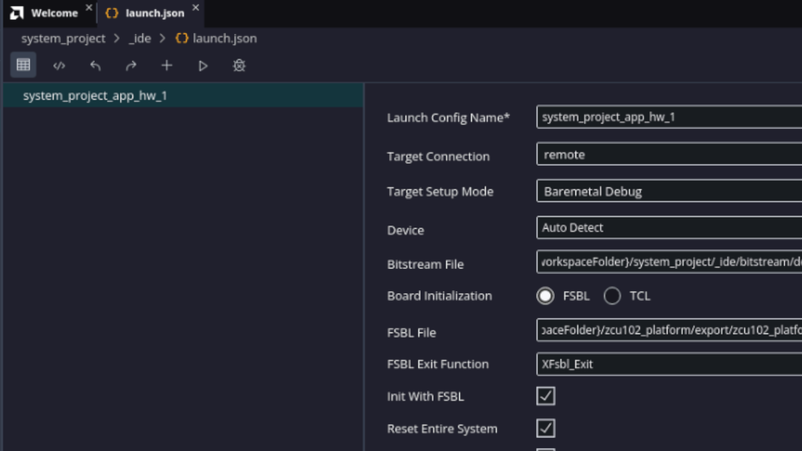
5. In the Debug View, highlight the ***Cortex-A53 #1*** and select Continue (play icon). This will result in the hello world is a loop
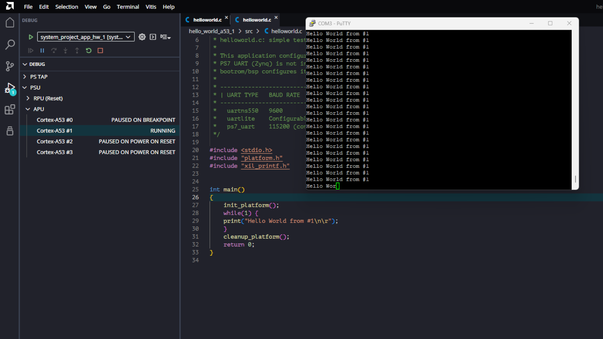
6. Highlight the ***Cortex-A53 #0*** and add a breakpoint at line 29
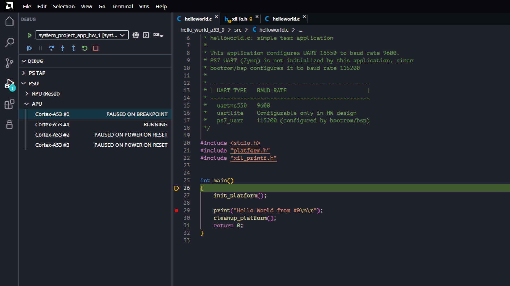
7. Select Continue (play icon), and this should result in the breakpoint hit on the ***Cortex-a53 #1***. Here, you can see that when the breakpoint hit on the first processor, it halted the second processor.
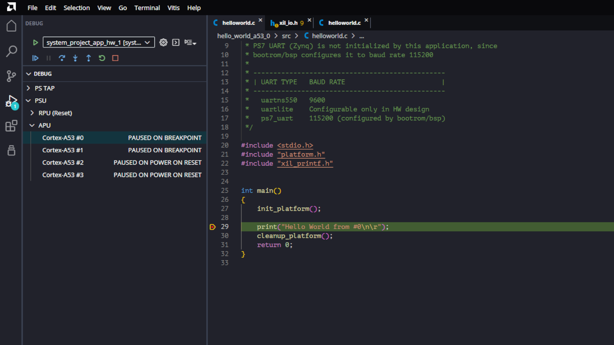

## PL to Processor Cross Triggering

Another very useful feature is the ability to debug between the hardware and software domains. To build use the command below

```
cd scripts
make build_sw LAB=2
```

This will create a **gpio_test** application for the cortexa53_0. The application has a while loop, that will just wait on data on the AXI GPIO

```
int main(void)
{
	int Status;
	//volatile int Delay;

	/* Initialize the GPIO driver */
#ifndef SDT
	Status = XGpio_Initialize(&Gpio, GPIO_EXAMPLE_DEVICE_ID);
#else
	Status = XGpio_Initialize(&Gpio, XGPIO_AXI_BASEADDRESS);
#endif
	if (Status != XST_SUCCESS) {
		xil_printf("Gpio Initialization Failed\r\n");
		return XST_FAILURE;
	}

	/* Set the direction for all signals as input */
	XGpio_SetDataDirection(&Gpio, 1, 0xFFFFFFFF);
	
	Xil_DCacheDisable();

	while (1) {
		XGpio_DiscreteRead(&Gpio, 1);
	}

}
```

Open the lab2 workspace in Vitis, and follow the steps below

1. Highlight the **gpio_test**, and under ***FLOW***, select ***Debug*** and ***Open Settings***. Then select ***New Launch Configuration***
2. Select the ***Enable Cross Triggering*** as shown below
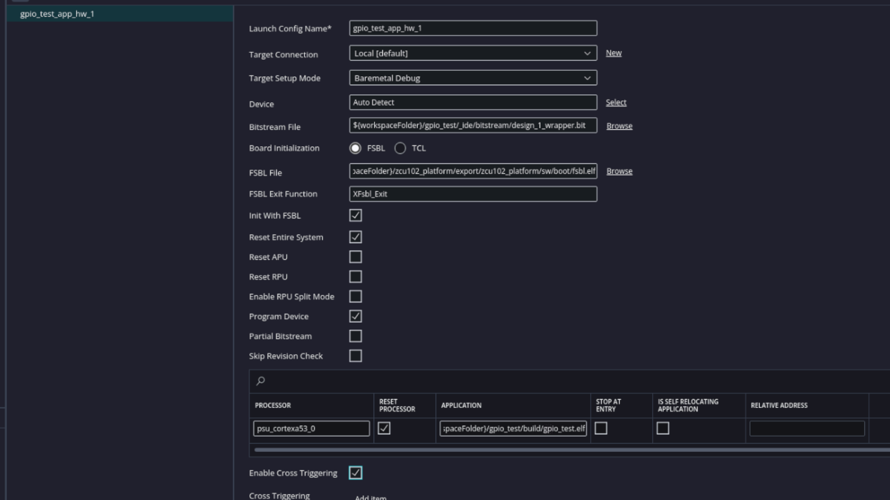
3. Select ***Cross Triggering Breakpoints***, and ***Add Item*** and configurate as shown below. For example, here we want to trigger the Cortex a53 #0 when there is a trigger on the ILA
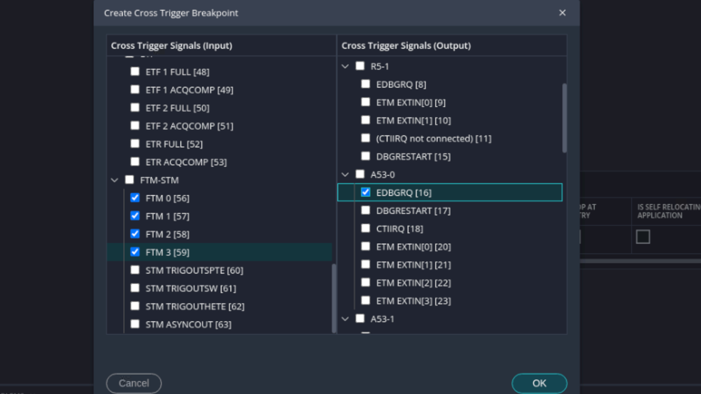
4. Select the ***Debug*** icon to launch the debug
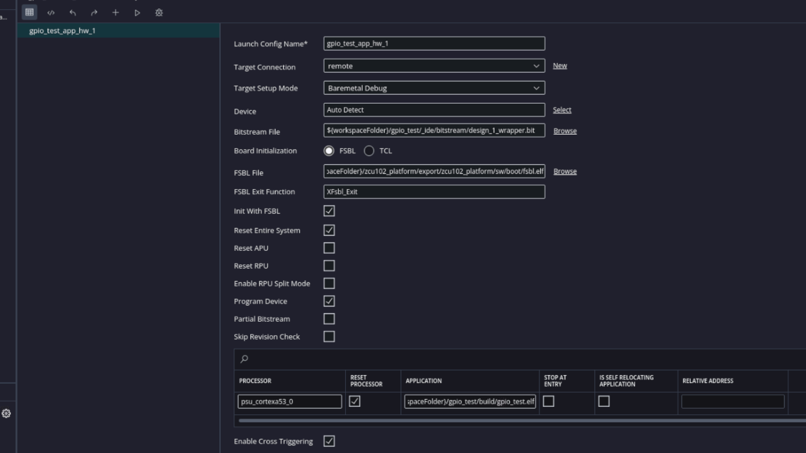
5. Launch Vivado Hardware Manager, and connect to your target 
Note: If you are using the prebuilt XSA, then import the ltx file manually.
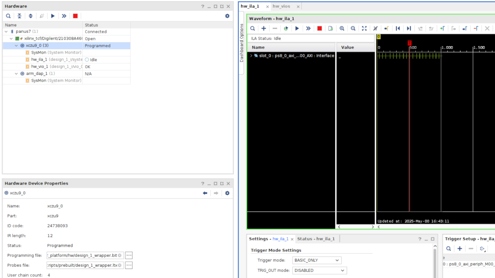
6. Add the trigger condition. For example, here I added a trigger on the RDATA as shown below
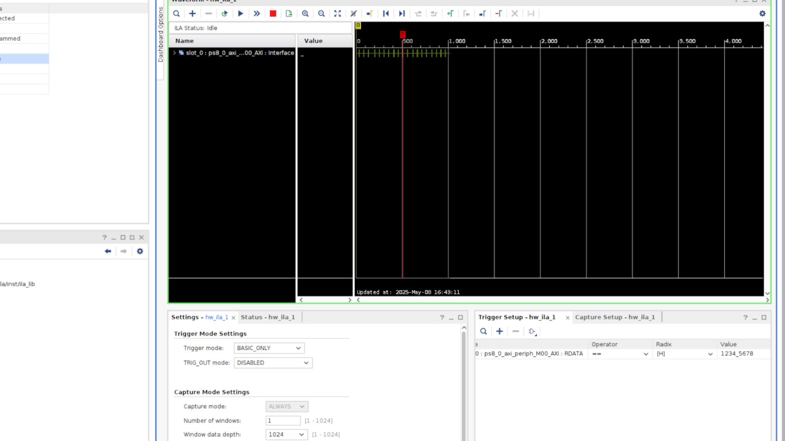
7. Return to Vitis, and In the Debug View, highlight the Cortex-A53 #0 and select Continue (play icon). This will loop on the XGpio_DiscreteRead(&Gpio, 1) line.
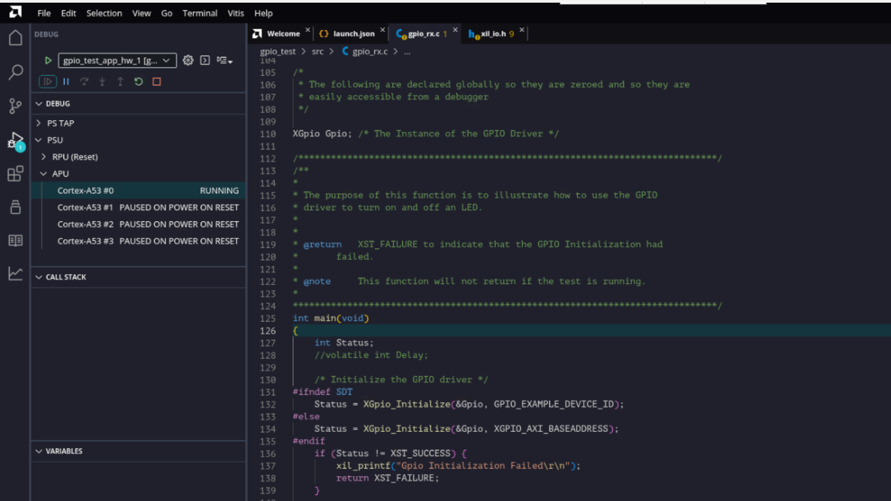
8. There is a VIO connected to the GPIO input and output pins. We can use the VIO to for an AXI transaction.
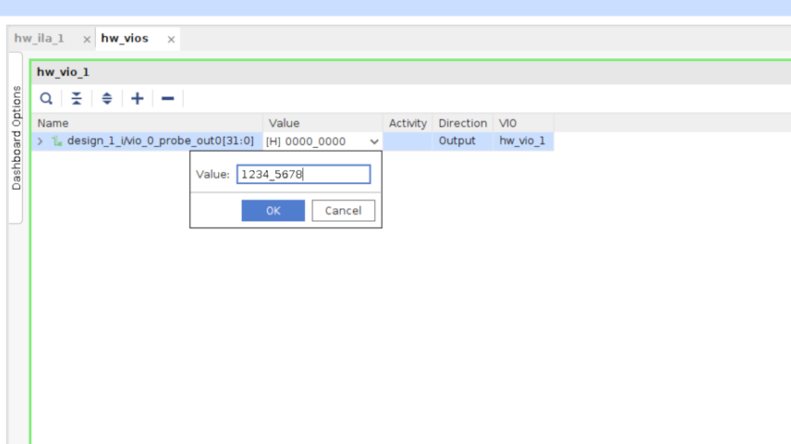
9. This will cause a breakpoint to occur on the Cortex-A53 #0 as shown below
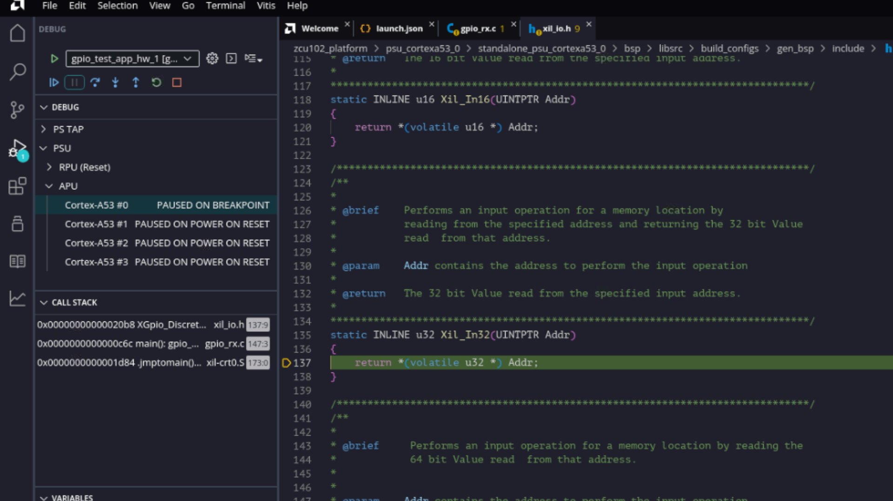

## Processor to PL Cross Triggering

Alternatively, users can setup the cross triggering to trigger the System ILA when the processor is suspended. This is useful to validate a hardware functionality in the PL by stepping through a software application in Vitis Unified IDE and view the corresponding PL transaction.

For example, I used the same hardware design as above. However, I updated the software application to write to the AXI GPIO. To build use the command below

```
cd scripts
make build_sw LAB=3
```

```
int main(void)
{
	int Status;
	//volatile int Delay;

	/* Initialize the GPIO driver */
#ifndef SDT
	Status = XGpio_Initialize(&Gpio, GPIO_EXAMPLE_DEVICE_ID);
#else
	Status = XGpio_Initialize(&Gpio, XGPIO_AXI_BASEADDRESS);
#endif
	if (Status != XST_SUCCESS) {
		xil_printf("Gpio Initialization Failed\r\n");
		return XST_FAILURE;
	}

	/* Set the direction for all signals as output */
	XGpio_SetDataDirection(&Gpio, 1, 0x0);
	
	Xil_DCacheDisable();

	while (1) {
		XGpio_DiscreteWrite(&Gpio, 1, 0x12345678);
	}

}
```

Open the lab3 workspace in Vitis, and follow the steps below

1. Highlight the **gpio_test** application component, and under **FLOW**, select **Debug** and **Open Settings**. Then select **New Launch Configurations**.
2. Select the **Enable Cross Triggering** as shown below

3. Select **Cross Triggering Breakpoints**, and **Add Items** and configurate as shown below. For example, here we want to trigger the ILA when there is a breakpoint on Cortex a53 #0
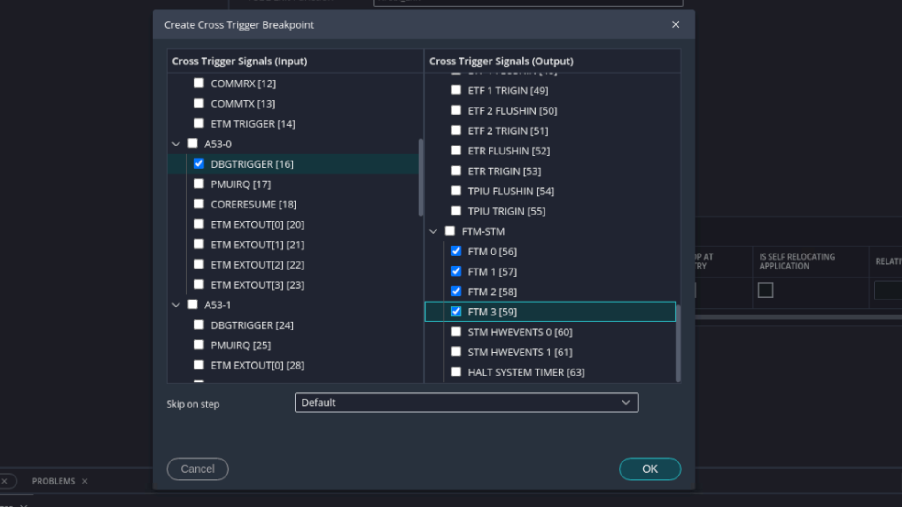
4. Select the Debug icon to launch the debug
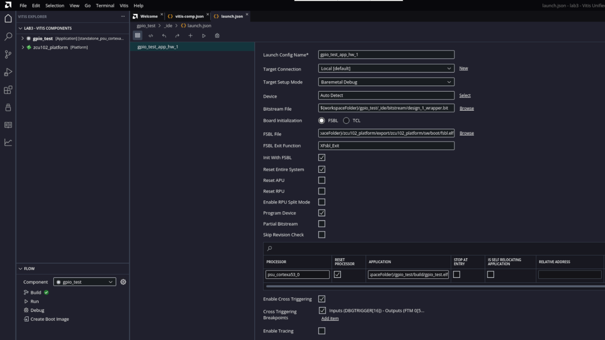
5. Launch Vivado Hardware Manager, and connect to your target Note: If you are using the prebuilt XSA, then import the ltx file manually.

6. Here, I am just waiting on any Trigger.
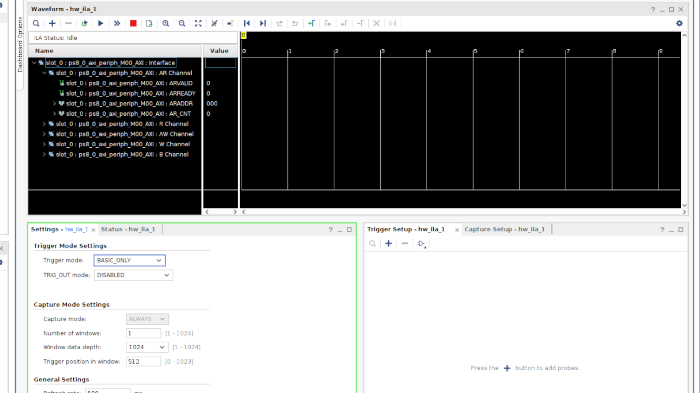
7. Return to Vitis, and In the Debug View, highlight the Cortex-A53 #0 and Add a breakpoint on the XGpio_DiscreteWrite(&Gpio, 1) function.
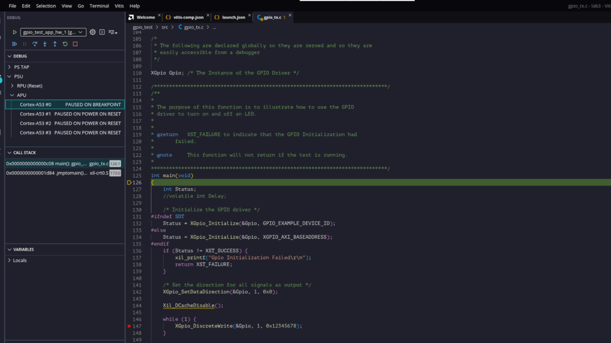
8.Select Continue (play icon) to trigger the ILA. Users can just re-arm the ILA again and Continue (play icon) in Vitis Debug View as there is a while loop.
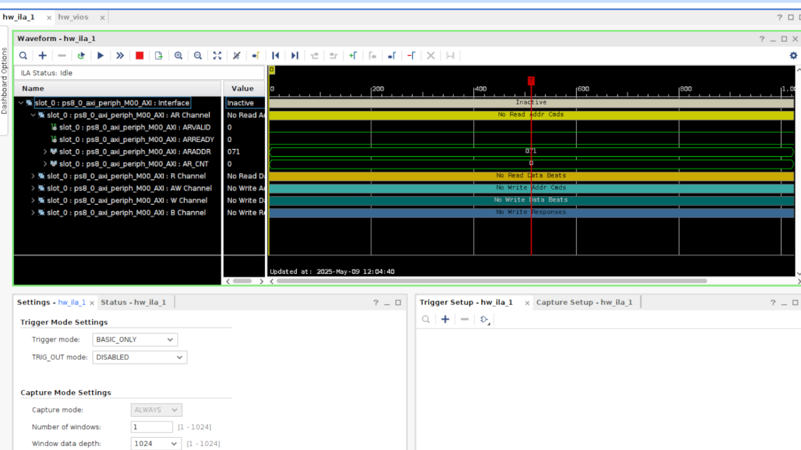

## Summary

In the brief tutorial above, we explore the power debug feature available in the Vitis Unified IDE that allows users to cross probe across different processors and even across software and hardware domains.


<p class="sphinxhide" align="center"><sub>Copyright © 2020–2025 Advanced Micro Devices, Inc.</sub></p>

<p class="sphinxhide" align="center"><sup><a href="https://www.amd.com/en/corporate/copyright">Terms and Conditions</a></sup></p>


