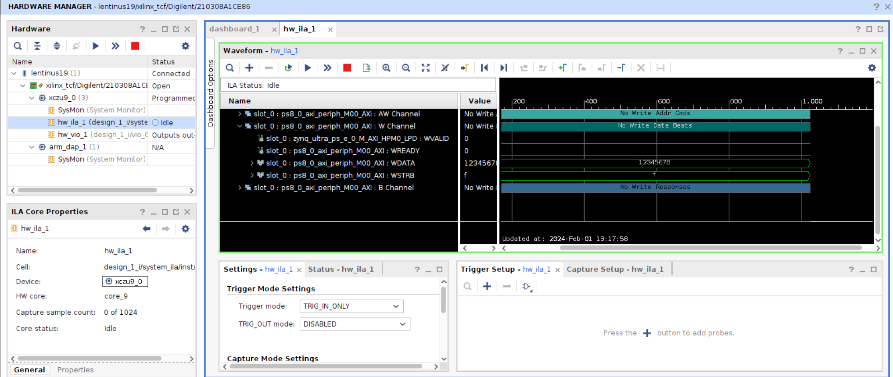

# Cross Triggering in Vitis Unified Embedded IDE

***Version: Vitis 2023.2***

Embedded systems can be complex, that may contain multiple processors. You can also debug across software and hardware domains and can use PS-PL cross triggering. However, In this simple tutorial, you learn how we can debug over multiple processors using cross triggering.

## Processor to Processor Cross Triggering

Launch AMD Vitis™ unified embedded tool in 2023.2, and create your platform. In this tutorial, you create two `Hello World` applications both on different processors.

**Note:** Refer to the Getting Started Embedded tutorial for information on creating a new application.


### System Project Creation

While a system project is not a requirement for cross probing, it is useful to keep all the applicaiton components maintained in a system project. You can create a system project that has the two hello world applications. To create a system project, select File -> New Component -> System Project


Select your platform


Select your components


<details>
  <summary>Additional Notes</summary>

You should place both applications into different sections in the DDR via the linker script or in different memories to avoid overlapping.
</details>

### Setup Cross Triggering in Launch Configuration

Set up the launch configurations, and scroll down to enable the Cross Triggering


Select **Add Item** under the Cross Triggering Breakpoints to setup the cross trigger signals.  For example, here we want to trigger the cortex a53 #1 when there is a breakpoint on cortex a53 #0
<details>
  <summary>Additional Notes</summary>

Refer to [UG1400](https://docs.amd.com/r/en-US/ug1400-vitis-embedded/Cross-Triggering-in-Zynq-Devices) for more information on the cross triggering signals
</details>


<details>
  <summary>Additional Notes</summary>

The hello world print in a while loop for demo purposes is available here
</details>


You can then set a breakpoint on the first processor (on line 29 below)


Here, you can see that when the breakpoint hit on the first processor, it halted the second processor


## PL to Processor Cross Triggering

Another very useful feature is the ability to debug between the hardware and software domains. To demostrate this, I created a very simple hardware design in Vivado 2023.2 with an AXI GPIO and System ILA with Slot0 on the AXI Interface. I will enable the cross triggering between an System ILA in the PL that will cause a breakpoint on my processor.

### Hardware Design

I used the trivial hardware design below


### Setup Cross Triggering in Launch Configuration

Set up the launch configurations, and scroll down to enable the Cross Triggering


Setup the cross trigger signals by selecting Add Item under the Cross Triggering Breakpoints.  For example, here we want to trigger the cortex a53 #0 when there is a trigger on the PS/PL interface.
<details>
  <summary>Additional Notes</summary>

Users should refer to [UG1400](https://docs.amd.com/r/en-US/ug1400-vitis-embedded/Cross-Triggering-in-Zynq-Devices) For more information on the cross triggering signals
</details>


Users can click on the debug icon, and the device will configure and stop at the automatic breakpoint placed at &main. Users then need to setup the trigger in the ILA

### Setup the Trigger in ILA 

Open the hardware manager, and add the trigger condition. For example, here I added a trigger on the RDATA as shown below


Arm the trigger, and now return to Vitis Unified IDE, and resume. I have a while loop that will read the AXI GPIO

```
	/* Set the direction for all signals as input */
	XGpio_SetDataDirection(&Gpio, 1, 0xFFFFFFFF);
	
	Xil_DCacheDisable();

	while (1) {
		Data = XGpio_DiscreteRead(&Gpio, 1);
	}
```

I used the VIO to write to the DATA register of the AXI GPIO


This will cause the ILA to trigger and this trigger will cause the processor (Cortex A53 #0) to suspend on a breakpoint


## Processor to PL Cross Triggering

Alternatively, users can setup the cross triggering to trigger the System ILA when the processor is suspended. This is useful to validate a hardware fuctionality in the PL by stepping through a software application in Vitis Unified IDE and view the corresponding PL transaction.

For example, I used the same hardware design as above. However, I updated the software application to write to the AXI GPIO

```
	/* Set the direction for all signals as output */
	XGpio_SetDataDirection(&Gpio, 1, 0x0);
	
	Xil_DCacheDisable();

	while (1) {
		XGpio_DiscreteRead(&Gpio, 1, 0x12345678);
	}
```

The Cross Trigger configuration in the Launch Configuration can be seen below


### Setup the Trigger in ILA 

Open the hardware manager and add the trigger condition. Here, I am just waiting on any Trigger. 


Arm the trigger, and now return to Vitis Unified IDE, I have added a breakpoint at XGpio_DiscreteRead(). Once this is hit, the ILA will trigger.

Users can also Re-Arm the ILA and step through the code. This will trigger the ILA. 



## Summary

In the brief tutorial above, we explore the power debug feature avaialable in the Vitis Unified IDE that allows users to cross probe across different processors and even across software and hardware domains.


<p class="sphinxhide" align="center"><sub>Copyright © 2020–2024 Advanced Micro Devices, Inc</sub></p>

<p class="sphinxhide" align="center"><sup><a href="https://www.amd.com/en/corporate/copyright">Terms and Conditions</a></sup></p>


