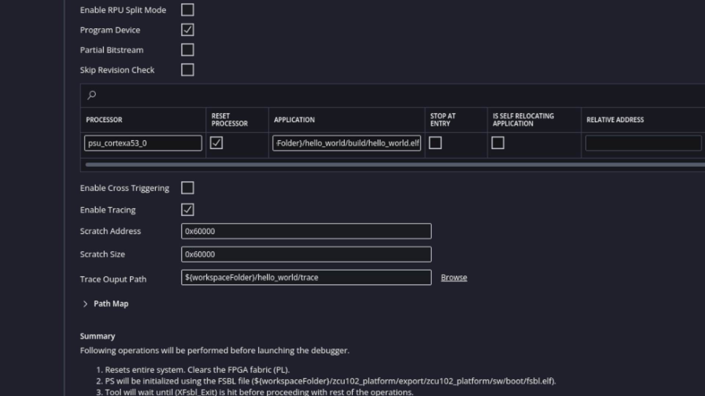
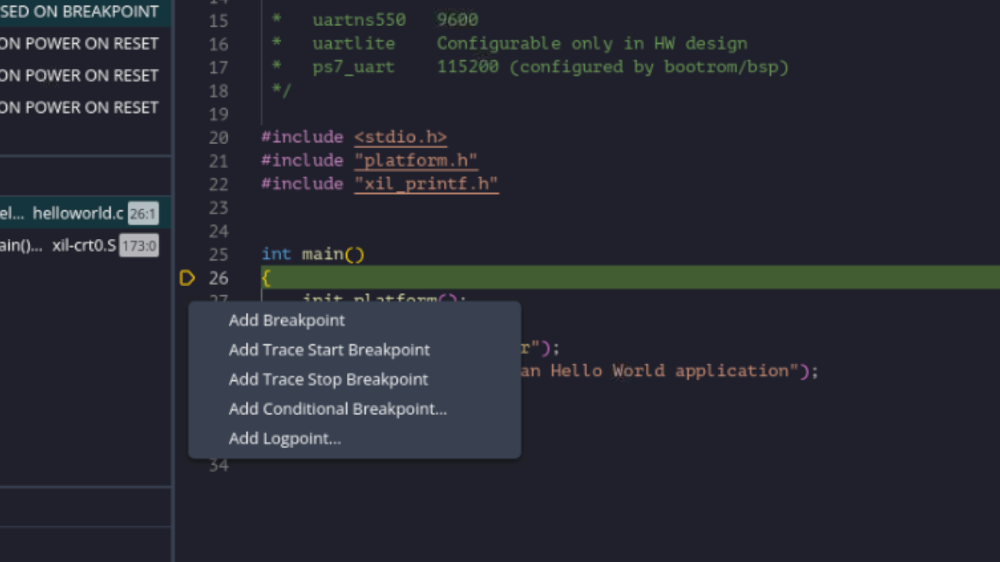
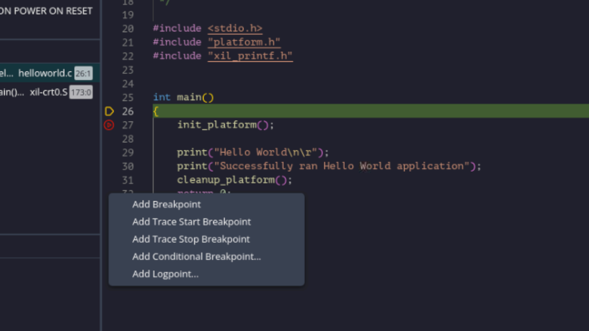
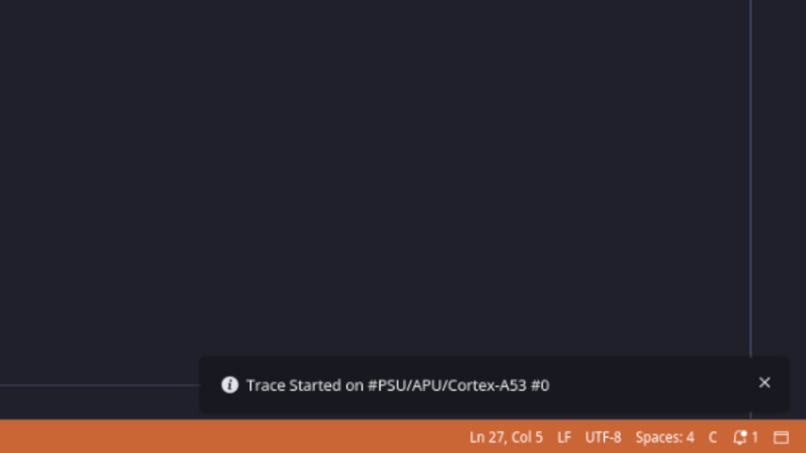
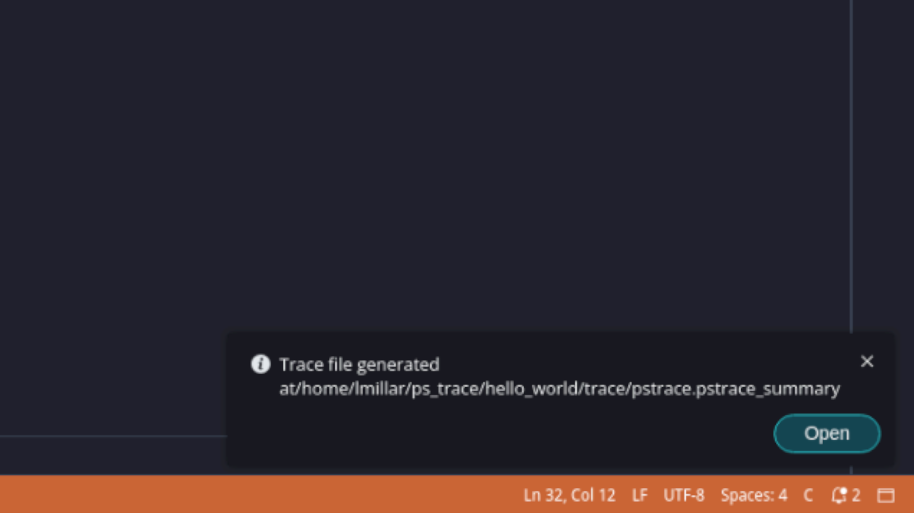
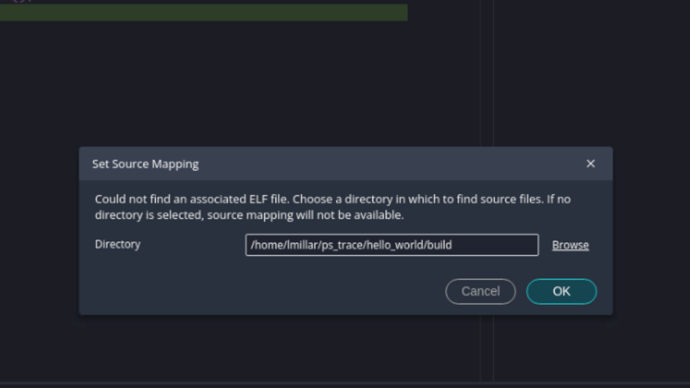
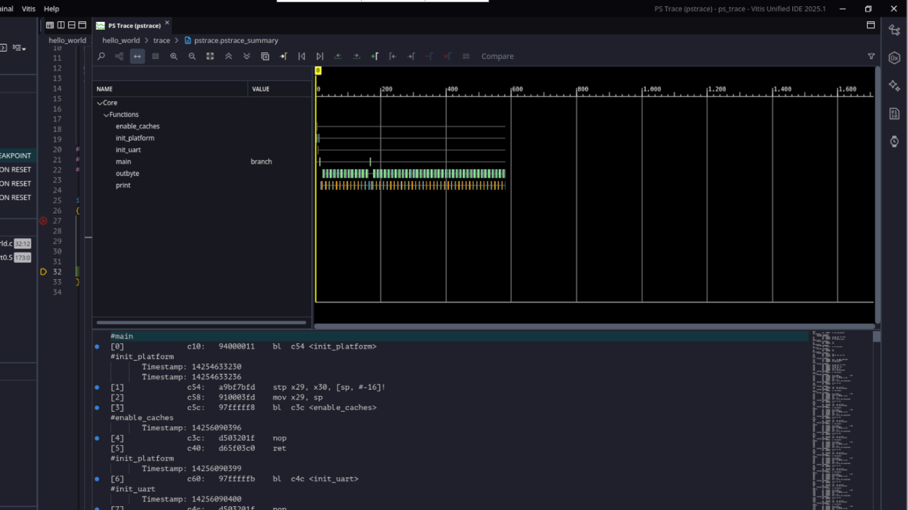

<table class="sphinxhide" width="100%">
 <tr width="100%">
    <td align="center"><h1>Vitis™ Embedded Software Tutorials</h1>
    <a href="https://www.xilinx.com/products/design-tools/vitis.html">See Vitis™ Development Environment on xilinx.com</a> </td>
 </tr>
</table>

# Debugging with PS Trace in Vitis

***Version: Vitis 2025.2***

## Overview

This tutorial introduces PS Trace, a hardware-accelerated instruction tracing feature in the Vitis Unified IDE. You will learn how to install and configure the OpenCSD library required to decode trace data, how to capture and analyse a PS Trace of a Hello World application running on a ZCU102 board, and how to interpret the resulting assembly-level trace output. Once you have completed this introduction, the follow-on chapter walks through using PS Trace to diagnose real baremetal system crashes on a VCK190 board.

## Background Reading

- <a href="https://docs.amd.com/r/en-US/ug1400-vitis-embedded/PS-Trace">UG1400 — Vitis Unified IDE User Guide: PS Trace</a>
- <a href="https://developer.arm.com/documentation/101385/0100/Debug-descriptions/Embedded-Trace-Macrocell">Arm Developer: Embedded Trace Macrocell (ETM) Architecture</a>
- <a href="https://github.com/Linaro/OpenCSD">OpenCSD GitHub Repository — CoreSight Trace Decode Library</a>

## What is PS Trace?

PS Trace is a new feature (previously a pre-release feature) in the Vitis Unified IDE that allows developers to monitor every assembly instruction executed by the CPU, providing users with insights for online diagnosis, performance debugging, and post-run data analysis. PS Trace leverages the **ARM Embedded Trace Macrocell (ETM)** enabling embedded developers to perform **non-intrusive, hardware-accelerated instruction tracing** with unprecedented visibility into processor execution flow.

The PS Trace feature is a long term project. In the 2025.2 release, the PS Trace extension enables users to view and analyze trace data from a single trace source on an Arm processor. More ease-of-use enhancements and more processor types will be added in the future. In this release users could configure the trace during runtime and visualize the trace file after trace is stopped.

### Key Capabilities

- **Full instruction trace**: Captures every instruction executed, including branches, function calls, and exceptions
- **Timestamp correlation**: Precise timing information for each instruction
- **Circular buffer**: Continuous tracing with automatic wrap-around
- **Cross-Probing**: Correlates trace data with source code and symbols

## How can Embedded Developers benefit from PS Trace

PS Trace offers granular insight into code execution. During Vitis debug sessions, developers can see exactly what the CPU is doing instruction by instruction, not just what the source code says. This helps identify issues such as unexpected branches or loops, problematic side effects of compiler optimisation at the assembly level, and changes to instruction flows caused by interrupts. Furthermore, bugs like race conditions can be harder to spot when using breakpoints and watch expressions. In these situations, PS Trace can be used to capture the exact instruction path before and after a fault.

Another benefit is that developers can utilise PS Trace to identify the frequently executed instructions in their application, which can be useful for analysing loop unrolling, function inlining effects or cache impact visibility. Also, the ability to configure PS Trace at runtime empowers developers to focus their trace capture around specific code regions and selectively log the trace output without excessive data overload. PS Trace is a non-intrusive feature meaning you get the visibility without side effects, which is crucial for real time or interrupt driven code.

## OpenCSD Library and Dependency Setup

OpenCSD is an open source CoreSight Trace Decode library. This library provides an API that facilitate the decode of ARM CoreSight trace streams. The PS Trace functionality in Vitis utilizes the OpenCSD library to decode the CoreSight trace data that comes from the ARM processor. To access the trace file, you must first install OpenCSD to employ its library for decoding the trace binary into a human-readable format file. Follow the steps below to install the OpenCSD library:

1. Set 'INSTALL_PATH' environment variable for specifying the path to install the compiled OpenCSD files.

```
export INSTALL_PATH="/path/to/install/"
```

2. Clone the OpenCSD github repository to your local host.

```
git clone https://github.com/Linaro/OpenCSD.git
```

3. Install OpenCSD.

```
cd OpenCSD/decoder/build/linux/
make install PREFIX=$INSTALL_PATH
```

4. Finally, we need to set the OpenCSD environment variable for the Vitis tool to utilize the OpenCSD library. To do this use the following command before launching Vitis:

```
export OPENCSD_PATH=$INSTALL_PATH
```

## Walkthrough Example: Hello World 

### Overview of example

In this example we will debug an example Standalone Hello World application running on the A53 processor of a zcu102 board. This application has four main functions being called which are outlined below:

| Function                                           | Purpose                                          |
| ---------------------------------------------------|--------------------------------------------------|
| init_platform()                                    | initalise the uart and enable to caches          |
| print('Hello World)                                | print 'Hello World'                              |   
| print('Successfully ran Hello World application')  | print 'Successfully ran Hello World application' |
| cleanup_platform()                                 | Disable caches                                   |

The goal here is to use the PS Trace functionality to capture the assembly output of each function and then analyse the PS trace file after to see those functions being executed in assembly. In order to do this we will add our trace start breakpoint at the 'init_platform' function and our trace stop breakpoint at the 'cleanup_platform' function.

### Stage 1: Workspace Creation

1. Load the **Vitis Unified IDE**
2. In the Vitis IDE, select **File -> New Component -> Platform** to open the platform creation wizard and use the below configuration options

| Property                  | Input                |
| --------------------------| ---------------------|
| Platform Name             | zcu102_platform      |
| Hardware Design           | pre-built zcu102.xsa |   
| Operating System          | standalone           |
| Processor                 | psu_cortexa53_0      |
| Architecture              | 64 bit               |
| Generate Boot Artifacts   | check                |

3. In the Vitis IDE, select **File -> New Example -> Hello World** to open the application creation wizard and use the below configuration options

| Property                  | Input                      |
| --------------------------| ---------------------------|
| Application Name          | hello_world                |
| Domain                    | standalone_psu_cortexa53_0 |   

### Stage 2: Debug Setup

1. In the Vitis IDE, select **Vitis -> Target Connections -> Add New Target Connection** to open the Target Connection Details window and use the below configuration options
2. Open the **launch.json** file within **hello_world -> Settings** to open the launch configuration for the Hello World application.
3. Select 'Enable Tracing'
4. Input the Scratch Address, Scratch Size and Trace Output Path.

#### What is a Ring Buffer?

A ring buffer is a **FIFO (First-In-First-Out) data structure**. The **ring buffer** (also called **circular buffer**) is a **fixed-size memory region** that operates in a **continuous loop**, overwriting the oldest data when full. This is the fundamental storage mechanism for PS Trace.

| Parameter                 | Description                                                                    |
| --------------------------| -------------------------------------------------------------------------------|
| Scratch Address           | This is the base address in DDR memory where the ring buffer for trace         |
|                           | storage begins. This is the physical address where DMA writes compressed trace |
|                           | data. You must choose an address that doesn't conflict with application memory.|
| Scratch Size              | The **total byte count** allocated for the ring buffer. This determines how    |
|                           | much execution history can be captured before the buffer wraps. The bigger the |  
|                           | scratch size the bigger the trace history.                                     | 
| Trace Output Path         | The **filesystem location** where Vitis saves the extracted trace data and     |
|                           | trace summary file.                                                            |




### Stage 3: Debug Session

1. Select the debug icon in the launch.json file
2. Once the debug session has fully loaded then we want to add our trace breakpoints. So add the trace start breakpoint to line 27 by right-clicking line 27 and selecting 'Add Trace Start Breakpoint'.



3. Similarly to add a trace stop breakpoint at line 31 then right-click line 31 and select 'Add Trace Stop Breakpoint'



4. Click 'continue' in the debug view. Once the trace start breakpoint is reached wait until the 'Trace Started' notification appears in the bottom right hand corner of the IDE. Once you see this notification then you can select 'continue' again in the debug view.



5. Then once execution reaches the trace stop breakpoint similarly you need to wait until a 'Trace file generated' notification appears in the bottom right hand corner of the IDE. When you see this notification select 'Open' to view the trace file.



Note: You can view the trace file at any point by navigating to **Vitis -> PS Trace -> Open PS Trace**

6. Now you will be prompted to select the ELF file for source code probing. Here you need to click **Browse** and select the '/hello_world/build' folder which is where the ELF file is located.



7. Click 'OK' and the trace file should appear like below.



### Stage 4: PS Trace file analysis

Now that we have generated the trace file, lets analyse it but first of all we should familiarise ourselves with the assembly syntax. For example lets take the below assembly code and disect it. 

```
#enable_caches
       Timestamp: 3823343195
[4]              c3c:	d503201f 	nop
[5]              c40:	d65f03c0 	ret
```
| Function        | Timestamp  | Instruction Address | Instruction Hex Representation  | Instruction |
|-----------------|------------|---------------------|---------------------------------|-------------|
| enable_caches() | 3823343195 | c3c                 | d503201f                        | nop         |
|                 |            | c40                 | d65f03c0                        | ret         |

#### init_platform()

So first of all we can see that we start in 'main()' and then branch and link execution to the 'init_platform' function. 

```
#main
[0]              c10:	94000011 	bl	c54 <init_platform>
```
If we right click on the 'init_paltform()' function in the 'helloworld.c' and click 'Go to Definition' then this will take you to the defintion of the 'init_platform' function were you can see that both 'enable_caches()' and 'init_uart()' are called by this function. This is refelcted in the below assembly were we enter 'init_platform' and branch and link to 'enable_caches' 

```
#init_platform
       Timestamp: 14254633230
       Timestamp: 14254633236
[1]              c54:	a9bf7bfd 	stp	x29, x30, [sp, #-16]!
[2]              c58:	910003fd 	mov	x29, sp
[3]              c5c:	97fffff8 	bl	c3c <enable_caches>
```

```
#enable_caches
       Timestamp: 14256090396
[4]              c3c:	d503201f 	nop
[5]              c40:	d65f03c0 	ret
```

Then once 'enable_caches()' is done executing we jump back to 'init_platform' and branch and link to 'init_uart'.

```
#init_platform
       Timestamp: 14256090399
[6]              c60:	97fffffb 	bl	c4c <init_uart>
#init_uart
       Timestamp: 14256090400
[7]              c4c:	d503201f 	nop
[8]              c50:	d65f03c0 	ret

```

After 'init_platform()' is wrapped up then we return to 'main()' and branch and link to the first 'print()' function

```
#init_platform
       Timestamp: 14256090401
[9]              c64:	d503201f 	nop
[10]             c68:	a8c17bfd 	ldp	x29, x30, [sp], #16
[11]             c6c:	d65f03c0 	ret
#main
       Timestamp: 14256090402
[12]             c14:	d0000000 	adrp	x0, 2000 <_HEAP_SIZE>
[13]             c18:	913e0000 	add	x0, x0, #0xf80
[14]             c1c:	9400001d 	bl	c90 <print>
```

### print()

After we enter the first 'print()' function we can see the following assembly code. Here we are executing the first print function which prints 'Hello World'. From line 15 to 21 we can see the initial setup and first iteration of the 'print()' function

```
#print
       Timestamp: 3823343202
[15]             c90:	a9be7bfd 	stp	x29, x30, [sp, #-32]!
[16]             c94:	910003fd 	mov	x29, sp
[17]             c98:	f9000bf3 	str	x19, [sp, #16]
[18]             c9c:	aa0003f3 	mov	x19, x0
[19]             ca0:	39400000 	ldrb	w0, [x0]
[20]             ca4:	34000080 	cbz	w0, cb4 <print+0x24>
       Timestamp: 3823343308
[21]             ca8:	940000a6 	bl	f40 <outbyte>
```

Now the 'outbyte()' function executes to send the first character 'H' over UART.

```
#outbyte
       Timestamp: 3823343309
[22]             f40:	d2800582 	mov	x2, #0x2c                  	// #44
[23]             f44:	12001c00 	and	w0, w0, #0xff
[24]             f48:	f2bfe002 	movk	x2, #0xff00, lsl #16
[25]             f4c:	d503201f 	nop
[26]             f50:	b9400041 	ldr	w1, [x2]
[27]             f54:	3727ffe1 	tbnz	w1, #4, f50 <outbyte+0x10>
       Timestamp: 3823343433
[28]             f58:	b9000440 	str	w0, [x2, #4]
[29]             f5c:	d65f03c0 	ret
```

## Summary 

In this tutorial we learnt about the basics of how to set up and use PS Trace. We used some simple C code to generate an assembly file and compared the assembly code to our source code to see what was being executed under the hood. Next we will look at how to use PS Trace in a an actual debugging scenario. 

## Next Steps

[Debugging Baremetal System Crashes](./debugging_system_crashes_with_ps_trace/README.md)

<p class="sphinxhide" align="center"><sub>Copyright © 2020–2026 Advanced Micro Devices, Inc.</sub></p>

<p class="sphinxhide" align="center"><sup><a href="https://www.amd.com/en/corporate/copyright">Terms and Conditions</a></sup></p>


