<table class="sphinxhide" width="100%">
 <tr width="100%">
    <td align="center"><h1>Vitis™ Embedded Software Tutorials</h1>
    <a href="https://www.xilinx.com/products/design-tools/vitis.html">See Vitis™ Development Environment on xilinx.com</a> </td>
 </tr>
</table>

# Debugging Baremetal System Crashes with PS Trace

***Version: Vitis 2025.2***

## Blinking LEDs on VCK190 via GPIO

The system used in this tutorial is a minimal baremetal design targetting the VCK190 Evaluation Board. The block design here configures the Versal Processing System (CIPS) with a full DDR4 memory controller connected through AXI NoC and two AXI GPIO instances in the programmable logic that drive the four LEDs (DS3-DS6). The baremetal C application runs directly on the Arm Cortex-A72 core. This application initialises one of the AXI GPIO blocks and repeatedly toggles the LEDs in two diagnonal patterns for 10 cycles while printing status messages over the UART.

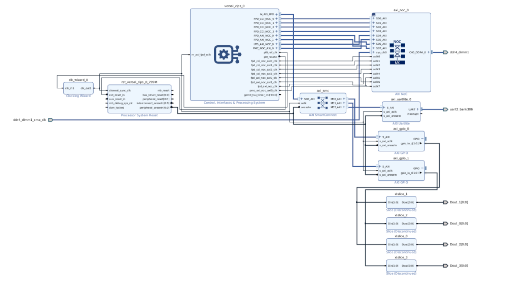

To clarify, for the purposes of this tutorial we have injected two bugs into source code. The source code contains a NULL pointer and an incorrect XPAR_AXI_GPIO_1_BASEADDR so that we can simulate some errors that can be solved with PS Trace.

### System Setup

Firstly we need to build the hardware and software.

```
cd scripts 
make all
```

Once the build completes:
1. Open the Vitis workspace created by the Makefile
2. Create a new target connection for your VCK190 board:
   - **Host**: localhost (or remote host if applicable)
   - **Port**: 3121 (default)
3. Create a standard debug configuration for the `gpio_led_blink` application:

### Issue 1: System Crash During GPIO Initialization

Run the **gpio_led_blink** application 

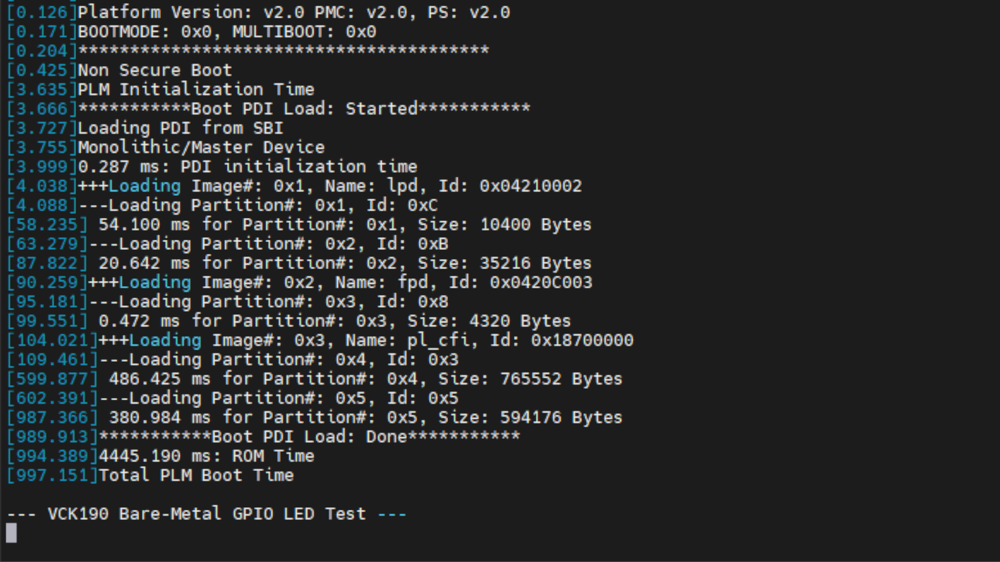

From the serial output we can see execution of the application has stopped after the first print message. No further output appears, LEDS remain off (never blink) and it seems the CPU is hanging and has stopped executing instructions. Now we must reset the system.

#### Step 1: Initial Debug

This time launch a debug session and set a breakpoint at line 23 were the AXI GPIO is initialised. When you reach the breakpoint at line 23 continue execution.

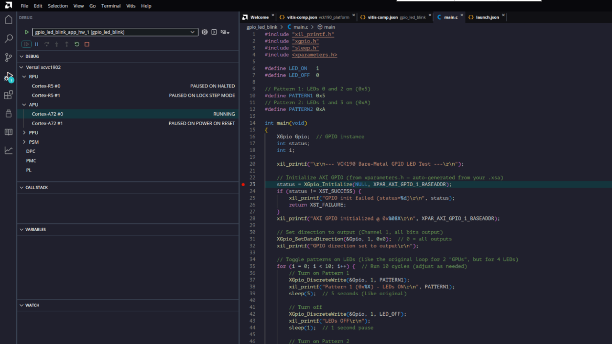

You will notice that this is were the CPU hangs and stops executing the program. Now pause execution and you will see that the CPU has entered an infinite while loop inside the xil_assert.c file.

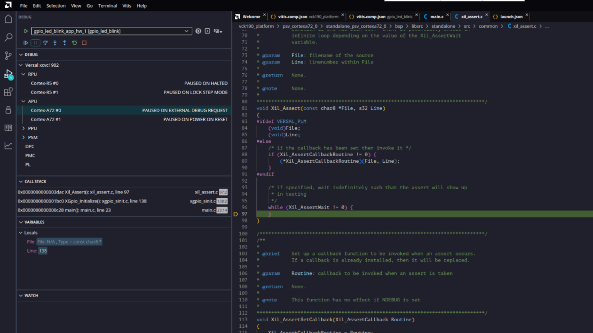

The xil_assert.c file is part of the error handling functionality within the AMD Standalone BSP and assertions such as Xil_AssertVoid() or Xil_AssertNonvoid() are sprinkled throughout your applications library code. So when your application reaches a condition it may branch into something like Xil_Assert.

So this tells us that the GPIO driver detected an invalid condition during initialization and rather than continuing with corrupted state, it triggered an assertion. The assertion handler enters a `while(1)` loop to halt execution safely. Now are next step is to figure out what condition triggered the assertion.

#### Step 2: Initial Trace

1. Load your launch configuration file, select 'Enable Tracing' and configure trace with the below inputs

| Field                     | Input                                    |
|---------------------------|------------------------------------------|
| Scratch Address           | 0xfffc0000                               |
| Scratch Size              | 0x40000                                  |
| Trace Output Path         | ${workspaceFolder}/gpio_led_blink/trace  |

2. We want to trace the instructions being executed during the 'XGpio_Initialize' function, therefore set your trace start breakpoint at line 20 and your trace stop breakpoint at line 24.

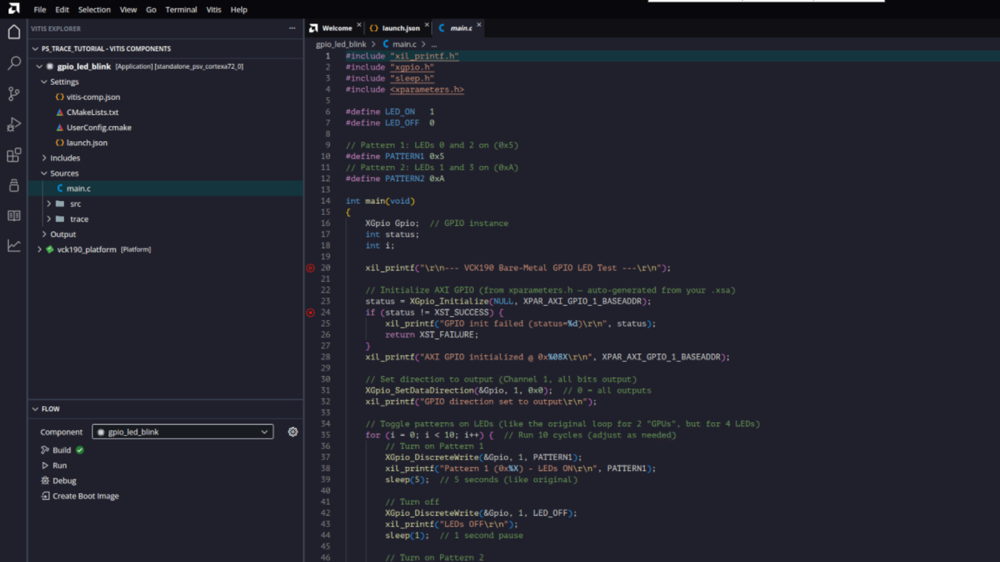

3. Launch the debug session and continue execution until it hits the first trace breakpoint. When it hits the first trace breakpoint, wait until the 'Trace Enabled' message is printed in the XSDB console and then continue execution again.

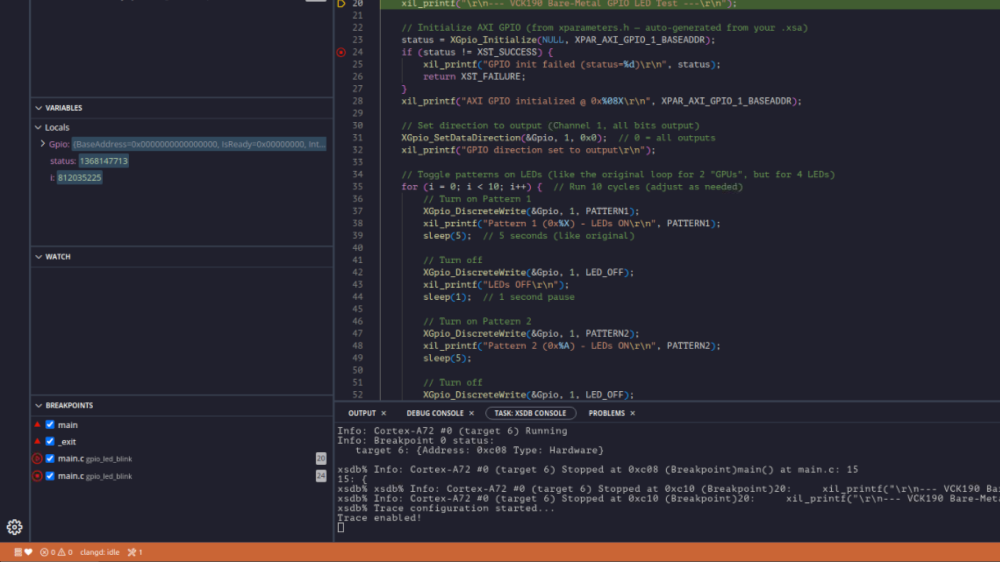

4. Now the problem is that we have entered the part of the application were the CPU is hanging and therefore we wont be able to reach the second trace breakpoint. Hence, in this case we need to use manual input to dump the trace binary files. In order to dump the trace binary execute the following command in the XSDB terminal:

```
write_trace_output "Cortex-A72 #0" "0xfffc0000" "0x40000" "${workspaceFolder}/gpio_led_blink/trace"
```

**Command Parameter Breakdown:**
- `"Cortex-A72 #0"`: Target CPU core identifier
  - For multi-core systems, specify which core to extract trace from
  - Core numbering: #0, #1, #2, #3 for quad-core Versal
- `"0xfffc0000"`: Physical DDR address where trace buffer starts
  - Must match the Scratch Address in trace configuration
- `"0x40000"`: Size of trace buffer in bytes (256KB)
  - Must match the Scratch Size in trace configuration
- `"${workspaceFolder}/gpio_led_blink/trace"`: Output directory
  - XSDB will write `.ppl` (trace data) and `.ini` (metadata) files

After executing this command you will see in the XSDB console that the ETM Trace Data has been extracted from the buffer. You can see that the trace binary files have been extracted to the 'trace' folder specified in the command above. Also if you look at the XSDB console you will see this warning message.

```
warning: the circular buffer is full and wrapped around, only the latest 0x40000 bytes of trace info will be generated
```

This means the trace buffer completely filled during execution, the oldest instructions were overwritten by newest instructions and so we can only see the most recent 256KB of execution. Earlier instructions that were executed (function entry, parameter setup) may be lost.

**Why This Happened?**
The infinite loop in `xil_assert.c` executed thousands of iterations. If we say that each loop iteration generates ~10-20 instructions a 1 byte/instruction compression, then the loop quickly fills the buffer. Furthermore, the loop's branch instruction (`b 3dac`) repeated continuously.

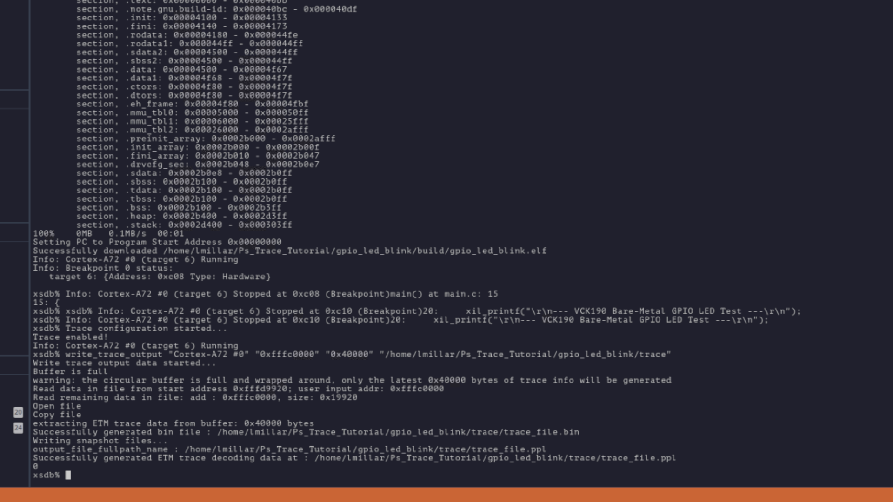

5. Now because we had to manually dump the trace binary files, we also need to manually generate the PS Trace Summary File. Go to **PS Trace -> Generate PS Trace**.

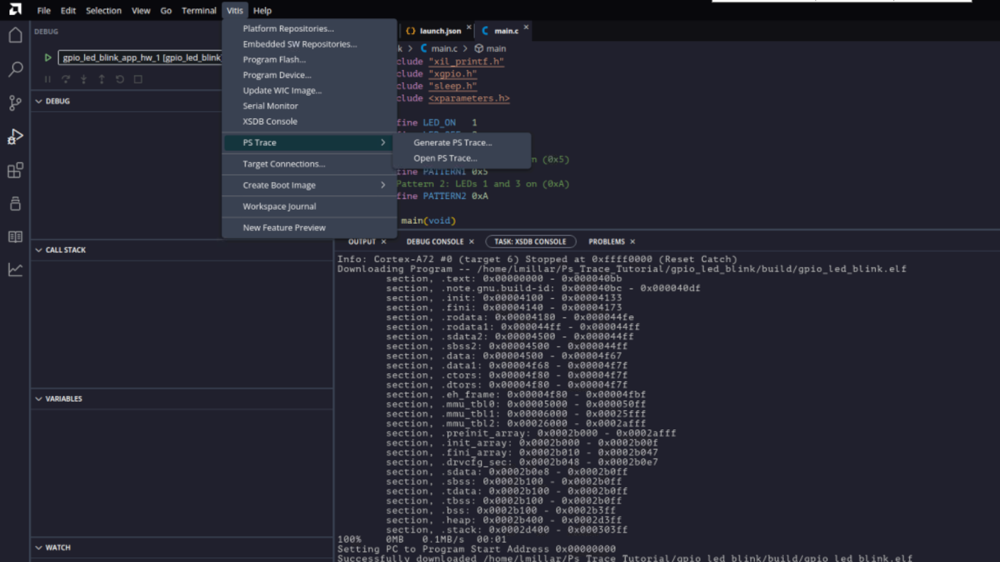

6. A wizard will appear called **PS Trace Report Generator**. In this wizard you will need to provide the path to the follwowing files. 

| File Type                 | File Name                               |
| --------------------------| ----------------------------------------|
| Elf File Path             | gpio_led_blink.elf                      |
| Trace Decoded File        | trace_file.ppl                          |   
| Snapshot File             | snapshot.ini                            |
| Output Folder Path        | ${workspaceFolder}/gpio_led_blink/trace |

All of the above files can be found in the 'trace' folder.

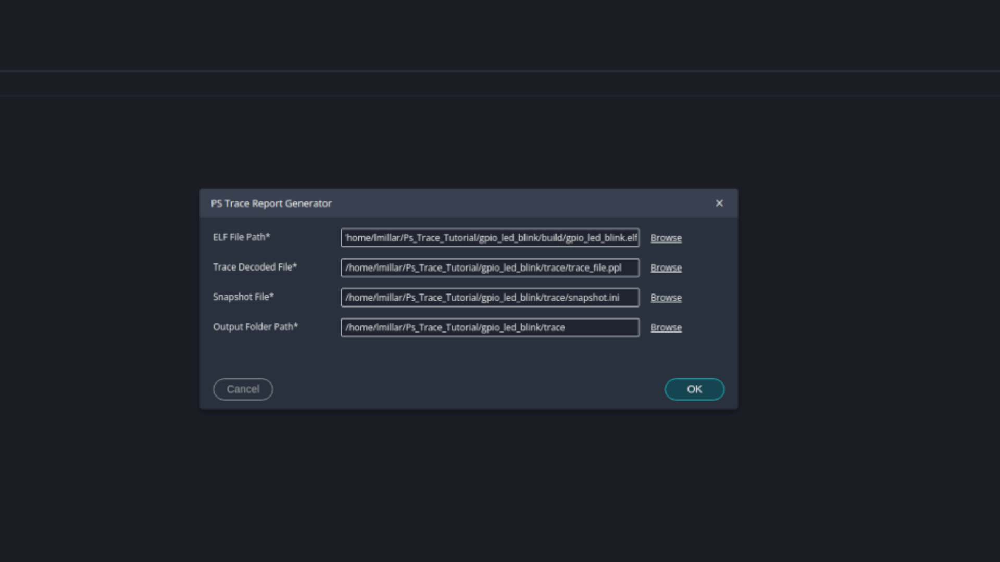

7. Go to **PS Trace -> Generate PS Trace** and select the PS Trace Summary file you just created. Then you are brought to the **Set Source Mapping** wizard were you need to provide the path to the build folder for the **gpio_led_blink** application. 

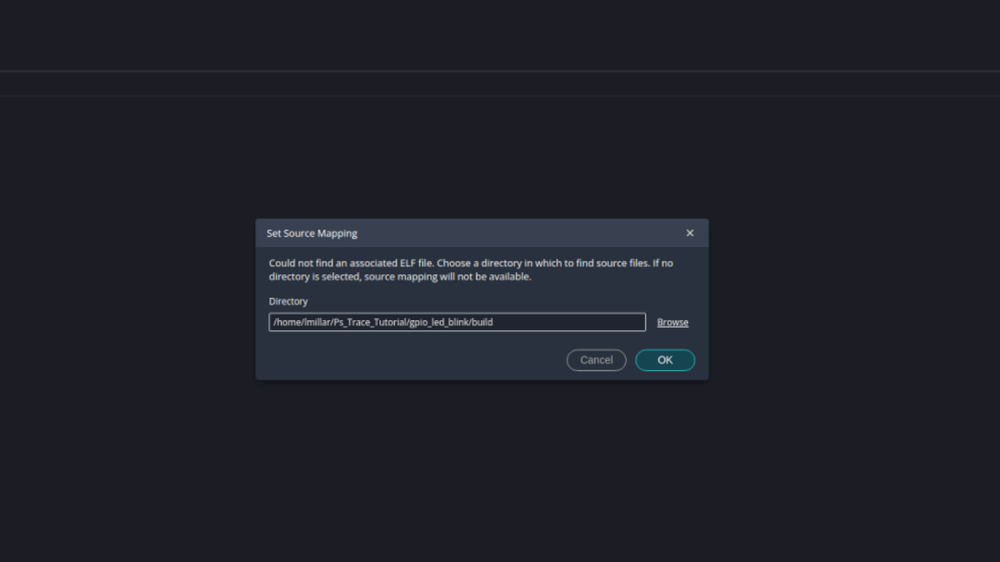

After clicking **OK**, the Vitis Unified IDE will open the PS Trace Summary file in the GUI.

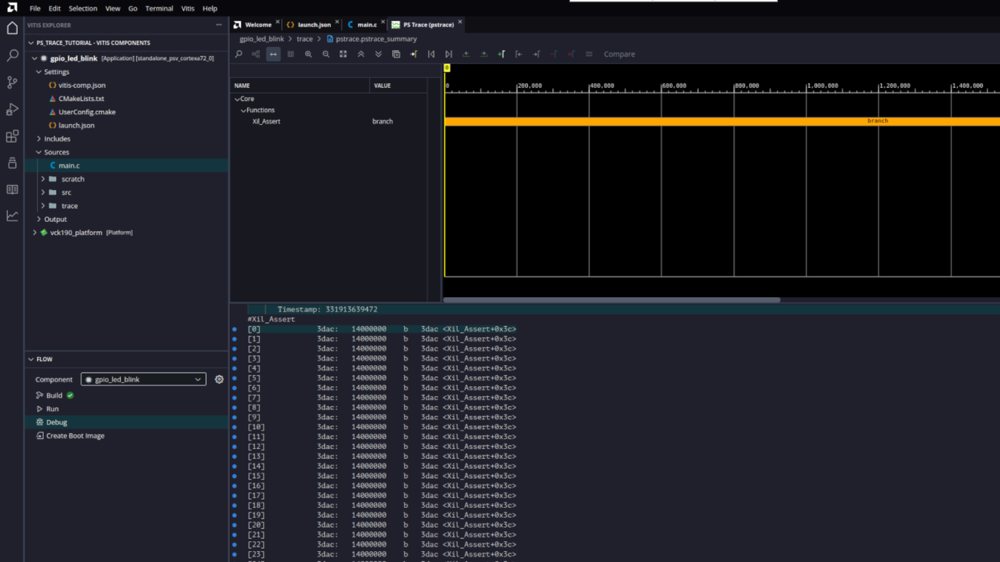

If we look here at the bottom tab we can see that the trace output is filled only with the below instruction.

```
3dac: 140000000 b 3dac <Xil_Assert+0x3c>
```

| Armv8 Syntax              | Explanation                                         |
| --------------------------| ----------------------------------------------------|
| `3dac`                    | Program Counter (PC) address                        |
| `14000000`                | ARM64 instruction encoding for unconditional branch |   
| `b 3dac`                  | Branch to address '0x3dac'                          |
| `<Xil_Assert+0x3c>`       | 'Xil_Assert' Function                               |

**What This Tells Us**
The instruction branches to **itself** (PC = 0x3dac, target = 0x3dac) thereby creating a deliberate infinite loop. This results in the CPU executing the same instruction repeatedly which explains why the trace buffer wrapped around.

It is important to note here that this is not a bug, it is actually intentional behavior in the Standalone BSP's assertion handler. The `while(1)` loop in `xil_assert.c` compiles to this branch-to-self instruction.

8. Cross probe to the equivalent c code by clicking the blue dot beside the above line of assembly code. 

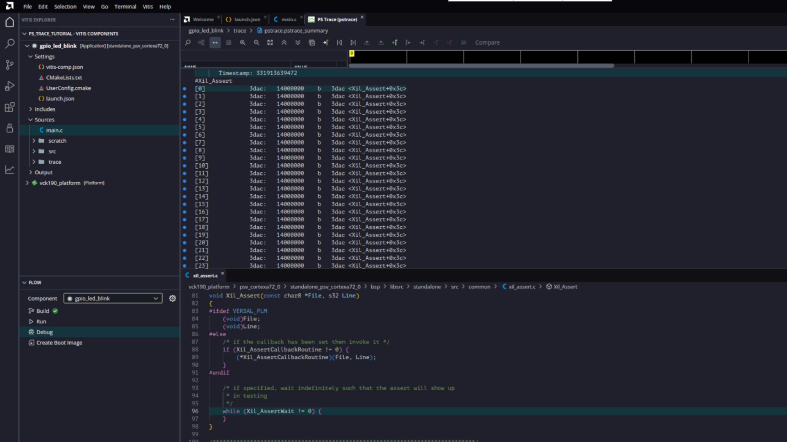

Here we can see that this has brought us to the xil_assert.c file and the program is stuck in the while loop at line 96 which would explain why the trace buffer has been overwritten with these instructions, the application has entered an infinite loop in the exception handler. We can see we're in an infinite loop which is still useful but we cannot see the root cause that triggered the assertion therefore we have limited visibility. This means we need to prevent the infinite loop to preserve earlier trace.

#### Step 3: Modifying the BSP

So our trace output is overwritten with calls to 'Xil_Assert', however we want to see the last executed CPU instructions before it entered the exception handler so that we can understand the true root cause. One way in which we can do this is by editing the Board Support Package and its exception handlers.

Instead of fixing the bug, we can temporarily **disable assertions** in the GPIO driver to allow execution to continue. This way, the trace will capture the last executed instruction before it enters the infinite loop.

**Important Note**
This is a debugging technique, not a permanent fix! In production code, you should:
1. Fix the root cause of the assertion
2. Keep assertions enabled for safety

1. Go to **vck190_platform/psv_cortexa72_0/standalone_psv_cortexa72_0/bsp/libsrc/gpio/src** and open the **xgpio.c** file.
2. Comment out the below line in the 'XGpio_CfgInitialize' function.

```
Xil_AssertNonvoid(InstancePtr != NULL);
```
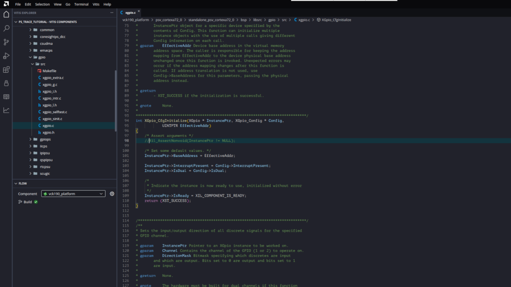

3. Also, go to **vck190_platform/psv_cortexa72_0/standalone_psv_cortexa72_0/bsp/libsrc/gpio/src** and open the **xgpio_sinit.c** file.
4. Comment out the same line as above in the 'XGpio_Initialize' function.

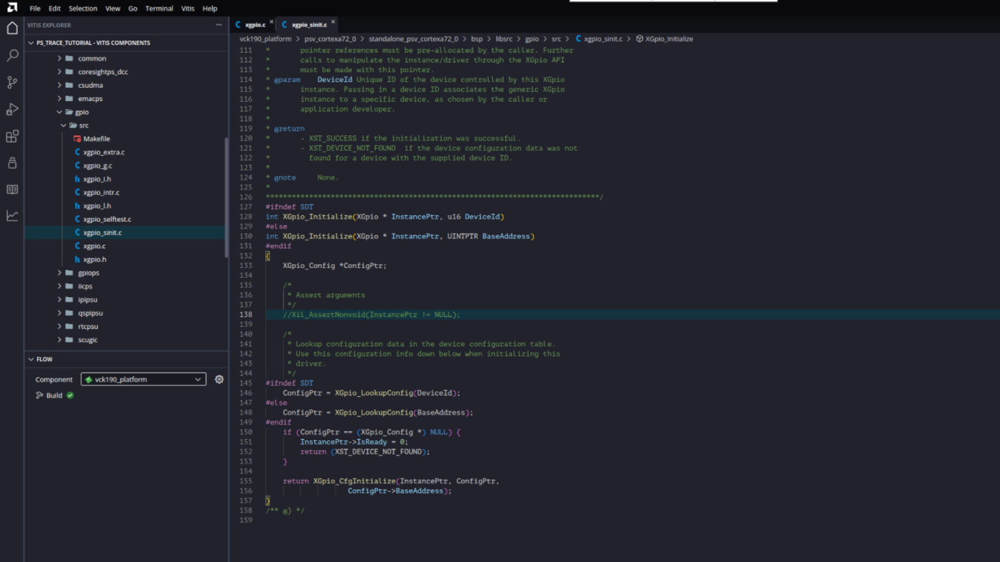

After making changes to the BSP, you will need to rebuild the platform and the application.

5. Re-launch the debug session keeping the exact same trace configurations as before. Continue execution to the first trace marker and then once trace is enabled continue execution again. 

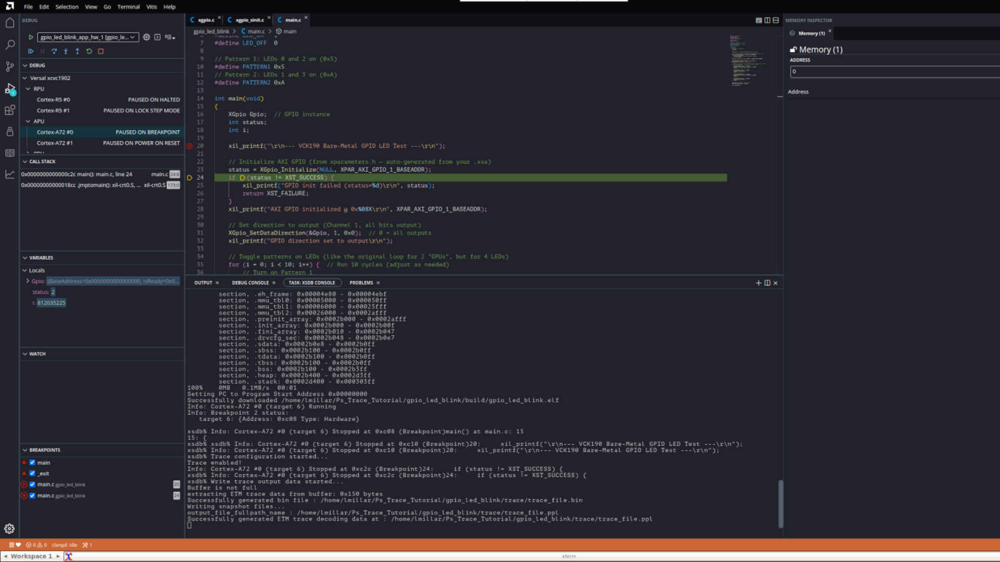

This time you can see that we reached the second trace marker and the trace was successful which we can see if we look at output in XSDB. So What Changed? Without the assertion loop, execution continued past the error, the trace buffer captured the actual error condition and the trace stop breakpoint was reached normally. This means we dont need to dump the trace binary manually and the buffer is not overwritten with calls to Xil_Assert.

#### Step 4: Dealing with Compiler Inlining

Compiler optimizations can make trace analysis challenging by eliminating function calls entirely.

1. Load the new trace file

2. If we look at the trace summary file below we can see theres a problem, we can see some functions, but we cant see the xgpio related functions we are interested in such as 'XGpio_Initialize'. 

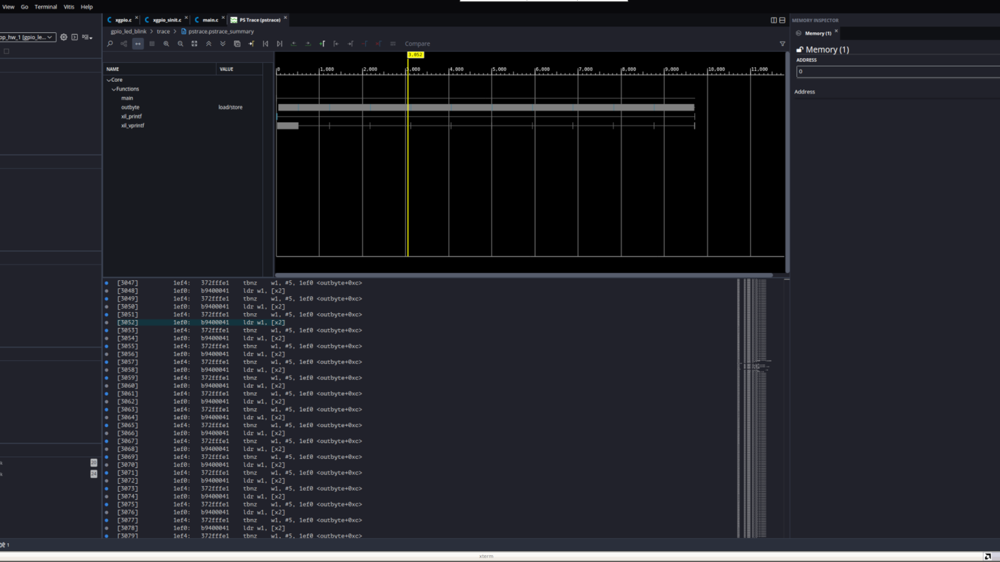

This is due to **compiler inlining** which is an optimisation technique that replaces a function call site with the body of the called function. One thing to be aware of is that due to compiler optimisation the entire call to 'XGpio_Initialize' is inlined into main therefore ETM does not record the function call. If we look at the 'XGpio_Initialize' function it is only around 10 lines of code therefore the compiler may inline this function because it is small and therefore the overhead of the function call is significant relative to the actual work done by the function. So we need a way to force the instructions of the 'XGpio_Initialize' function to appear in the trace file.

3. One way we can do this is by adding a debug print statement at the beginning of the 'XGpio_Initialize' function. Go back and open the xgpio_sinit.c file. Include the  'xil_printf.h' library and a print statement to the begining of the 'XGpio_Initialize' function like below. 

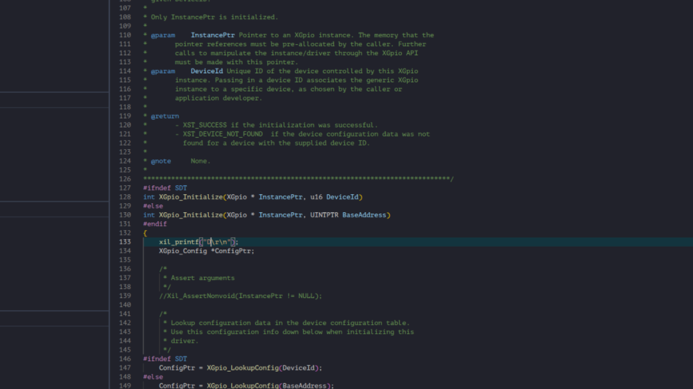

**Why This Works:**
The print function call (`xil_printf`) cannot be inlined as it is too complex. Therefore, if the compiler inlines `XGpio_Initialize`, it must also inline `xil_printf` which is too large to inline. So instead, the compiler keeps `XGpio_Initialize` as a separate function which forces ETM to record the function call in the trace.

4. Rebuild platform and application. 

5. Carry out the same steps for tracing as before with the same configurations and breakpoints. 

6. Open the new trace file

Now we can see 'XGpio_Initialize' in the functions section of the trace summary file. 

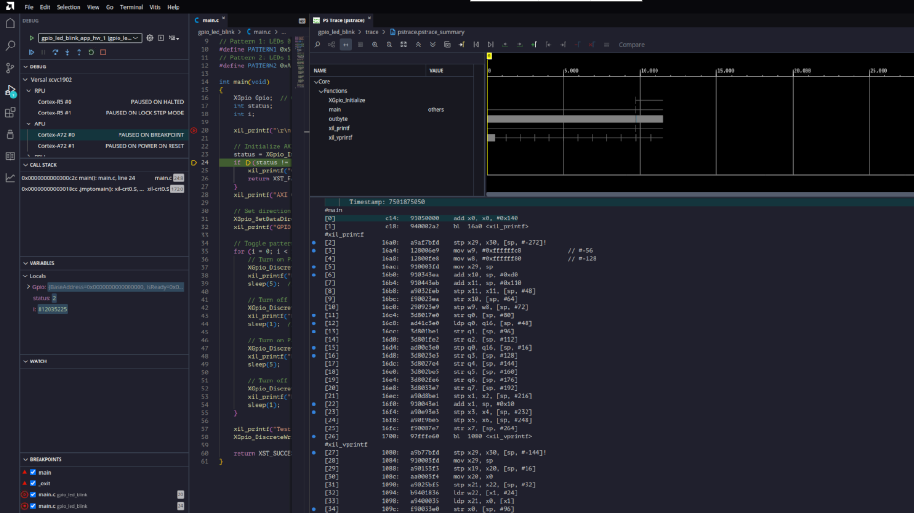

7. The majority of these instructions are from the print functions and outbyte therefore we need to zoom in untill the instruction markers are in intervels of 100.

When you reach instruction number 9700 you will notice the ps trace file shows some activity at the main and XGpio_Initialize functions which is what we were looking for. This should be were main branches of to 'XGpio_Initialize'.

8. Scroll your marker to that point. 

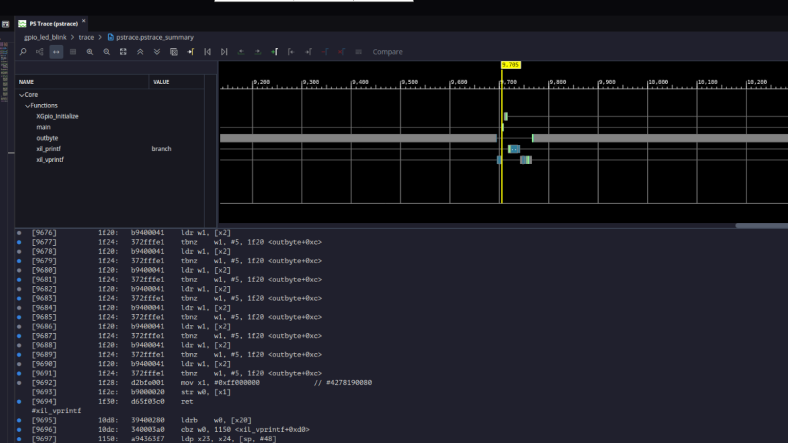

9. Zoom in for more granularity. Now here we can see the the moment were main branches of to XGpio_Initialize.

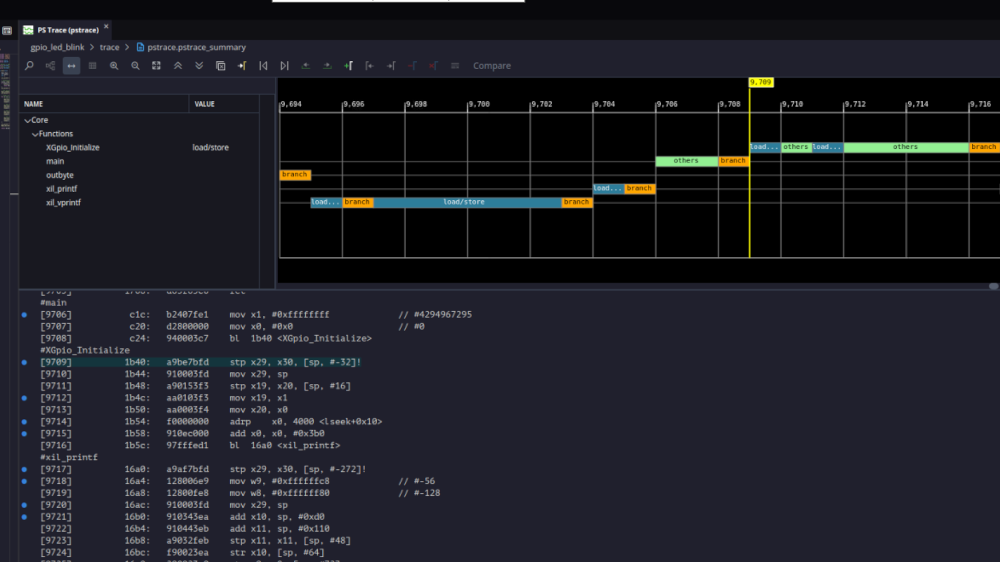

This is what the assembly says 

```
#main

[9706]           c1c:	b2407fe1 	mov	x1, #0xffffffff            	// #4294967295
[9707]           c20:	d2800000 	mov	x0, #0x0                   	// #0
[9708]           c24:	940003c7 	bl	1b40 <XGpio_Initialize>

#XGpio_Initialize

[9709]          1b40:	a9be7bfd 	stp	x29, x30, [sp, #-32]!
[9710]          1b44:	910003fd 	mov	x29, sp
[9711]          1b48:	a90153f3 	stp	x19, x20, [sp, #16]
[9712]          1b4c:	aa0103f3 	mov	x19, x1
[9713]          1b50:	aa0003f4 	mov	x20, x0
[9714]          1b54:	f0000000 	adrp	x0, 4000 <lseek+0x10>
[9715]          1b58:	910ec000 	add	x0, x0, #0x3b0
[9716]          1b5c:	97fffed1 	bl	16a0 <xil_printf>
```
10. Click the blue dots inside '#main' to cross-probe the instructions inside main.

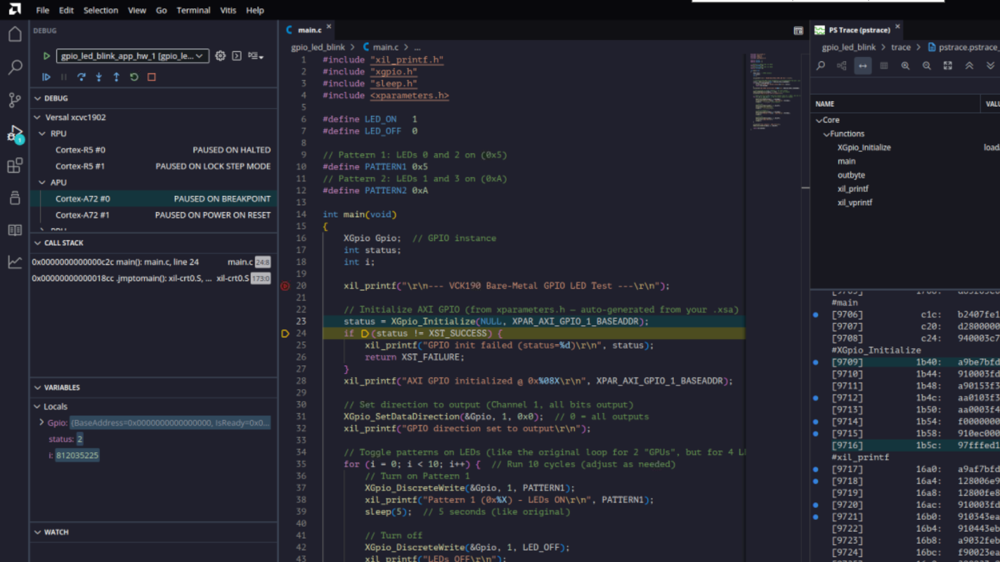

11. Click the blue dots inside '#XGpio_Initialize' to cross-probe the instructions inside XGpio_Initialize.

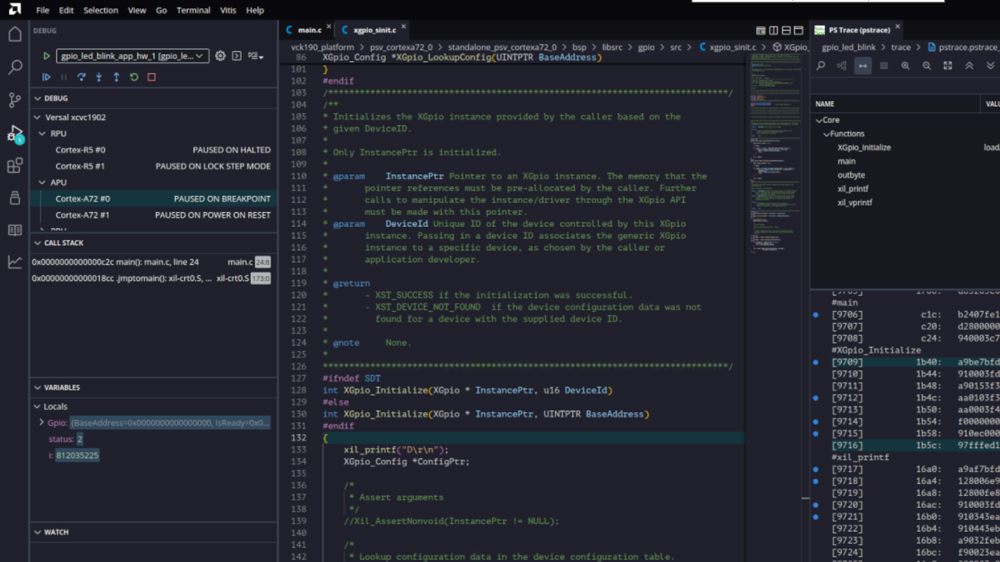

We are interested in the assembly code that shows main branching of to 'XGpio_Initialize'. If we look at the below
instruction we can see that the source is '0x0'. In C programming '0x0' can be used to represent NULL.

```
[9707]           c20:	d2800000 	mov	x0, #0x0                   	// #0
```

If we go back and look at c code, we can see we have passed null into the function call rather than the Gpio instance. This shows us why defensive assertions in BSP exist. This is exactly why defensive assertions exist in driver code. The below assertion:

```
Xil_AssertNonvoid(InstancePtr != NULL);
```

Would have caught this error immediately with a clear error message, instead of causing a mysterious crash later.

12. Change this NULL to Gpio.

```
status = XGpio_Initialize(&Gpio, XPAR_AXI_GPIO_1_BASEADDR);
```

13. Go back and uncomment the 'Xil_AssertNonvoid' function calls in the BSP and you can also remove the debug print statement. The print statement was only needed to prevent inlining and can be removed now that debugging is complete or you can just comment it out for future debugging. 

14. Rebuild the platform and application 

### Issue 2: Bad Base Address

1. Run the application again and this time you will see an error message.

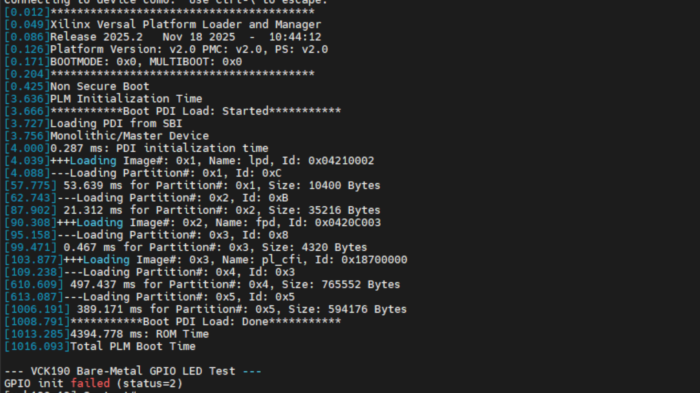

This time it wasnt a system crash, instead it was graceful error handling in the if statement in main. This means the GPIO device lookup failed but its not clear why, everything looks ok.

2. Do the same trace as before, launch the trace file and move your cursor back to point where main branches to XGpio_Initialize.

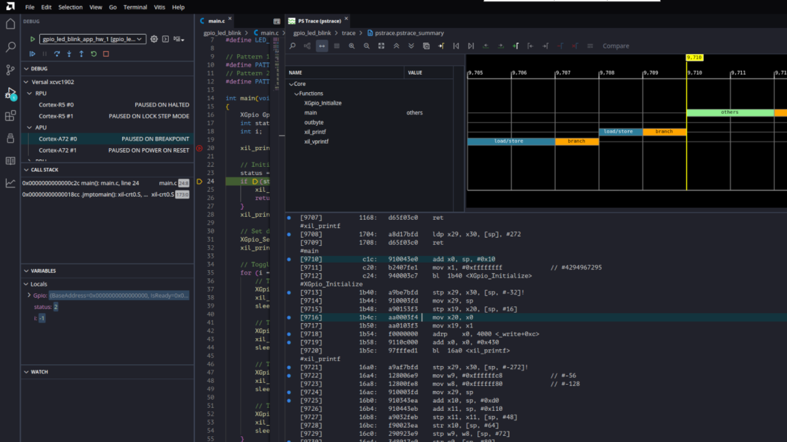

lets look at the assembly code

```
#main

[9710]           c1c:	910043e0 	add	x0, sp, #0x10
[9711]           c20:	b2407fe1 	mov	x1, #0xffffffff            	// #4294967295
[9712]           c24:	940003c7 	bl	1b40 <XGpio_Initialize>
```

Here we can see whenever we setup the function call to 'XGpio_Initialize' the first instruction is now no longer passing NULL and instead we are setting up the address of the local `Gpio` variable on the stack. However, the second instruction tries to set the BASE_ADDRESS to #0xffffffff. This is wrong as the 'XPAR_AXI_GPIO_1_BASEADDR' should actually be equal to 0xa4010000.

However if we cross-probe to the c code and look at the function call in main we actually pass the 'XPAR_AXI_GPIO_1_BASEADDR' macro which is correct. 

```
status = XGpio_Initialize(&Gpio, XPAR_AXI_GPIO_1_BASEADDR);
```

3. We need to check the macro definition in the xparameters.h file. Go to **vck190_platform/psv_cortexa72_0/standalone_psv_cortexa72_0/bsp/include/** and open the 'xparameters.h' file.
4. Search for 'XPAR_AXI_GPIO_1_BASEADDR', a simple 'ctrl + f' is the easiest method.

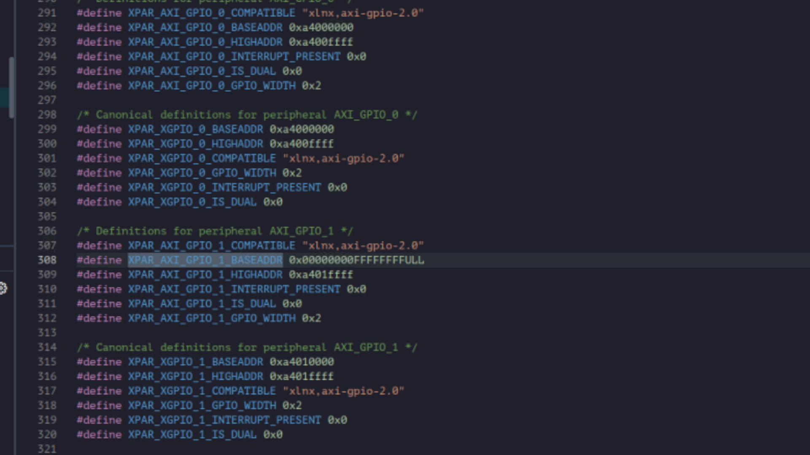

Here we can see that the 'XPAR_AXI_GPIO_1_BASEADDR' has been set hard coded to '0x00000000FFFFFFFFULL' instead of '0xa4010000'. 

5. Reset XPAR_AXI_GPIO_1_BASEADDR to '0xa4010000'

6. Rebuild your platform and application and run the application again.

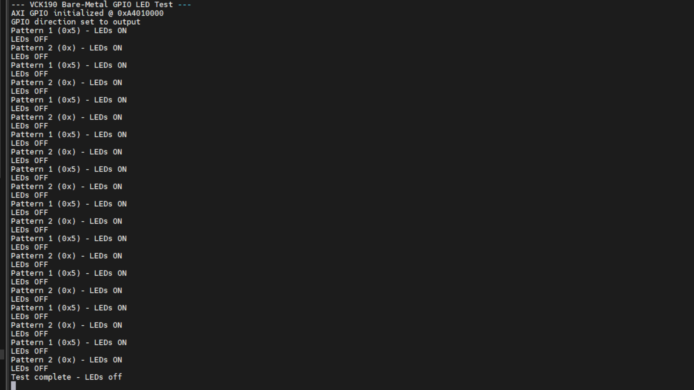

This time the LED test runs and finishes. The issue was a bad XPAR_AXI_GPIO_1_BASEADDR.

## Key Takeaways

In this tutorial we covered a typical PS Trace debugging workflow for a baremetal system crash. Key techniques covered include:

- **Strategically setting trace breakpoints** around the section of C code you want to investigate (trace start before the suspected problem area and trace stop after expected completion)
- **Manually dumping the trace buffer** when the trace stop breakpoint is unreachable due to a hang or infinite loop
- **Analysing the circular buffer wrap-around** when debugging infinite loops
- **Navigating large traces** using the timeline zoom, focusing on function call boundaries and parameter setup
- **Cross-probing between assembly and C code** to identify root causes
- **Handling compiler optimisations** such as function inlining to improve root cause visibility

<p class="sphinxhide" align="center"><sub>Copyright © 2026 Advanced Micro Devices, Inc.</sub></p>

<p class="sphinxhide" align="center"><sup><a href="https://www.amd.com/en/corporate/copyright">Terms and Conditions</a></sup></p>


