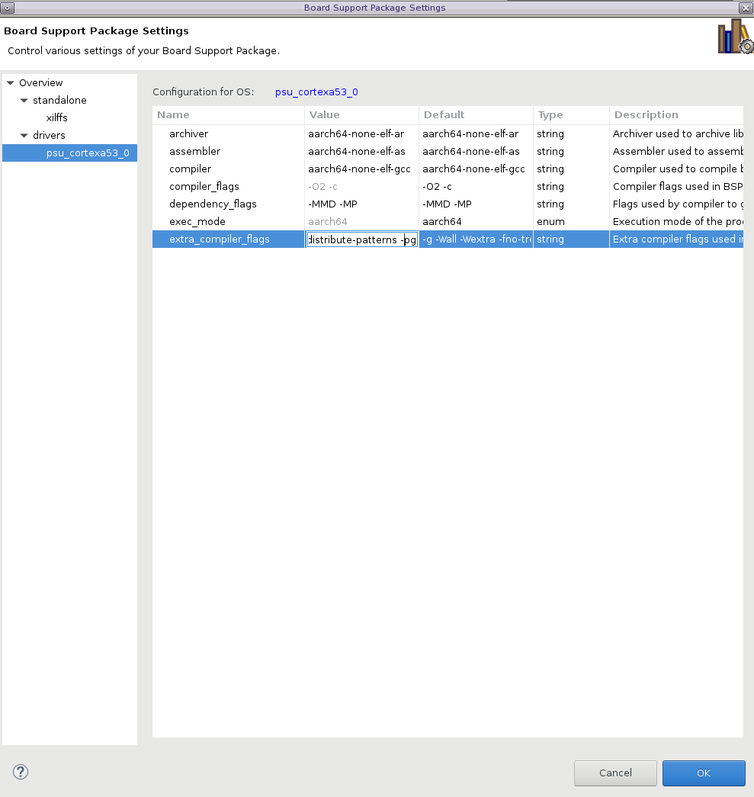

<table class="sphinxhide" width="100%">
 <tr width="100%">
    <td align="center"><h1>Vitis™ In-Depth Tutorials</h1>
    </td>
 </tr>
</table>

***Version: Vitis 2023.2***

# Vitis Classic to Unified Project Migration

The methodology to pass the metadata from hardware from Vivado to Vitis IDE has changed. However, these changes will not affect the users as the AMD baremetal drivers, standalone bsp and libraries have been fully ported to this new methodology.

While this tutorial take an indepth look at the changes in the filesets and metadata transfer methodology, there is a migration script (discussed below), that users can (and should) use to port their Classic Vitis IDE workspaces to Unified Vitis IDE workspace. 

## Migration Script from Vitis Classic IDE to Vitis Unified IDE

There is also a migration utility in the Vitis Classic that users can use to port the workspace from Vitis Classic IDE to Vitis Unified IDE.  Users can port their workspace to Classic Vitis IDE 2013.2, and then <i>Vitis ->  Export Workspace to Unified IDE</i>. The migration script will generate a script that will rebuild the workspace in the unified Vitis IDE using the Vitis Python API. Users can launch the Unified Vitis IDE and source this script <i>vitis -s script_name.py</i>. Click [here](#Vitis-Classic-workspace-to-Unified-workspace-Migration-Demo) for a demo on how to migrate from Vitis Classic to Unified IDE

### Migration Script Limitations

* Only Classic Vitis IDE 2023.2 to Unified Vitis IDE support
* External repositories will not be reflected. Meaning if you have a custom driver in an external repo, then this driver will not be ported
* Modification made to BSP will not be reflected
* Build Configurations are not copied over to Unified. Users will need to generate this via the launnch configuration GUI

## Metadata transfer Methodology change from Hardware to Software

As mentionend above, the methodology to pass the metadata from hardware from Vivado to Vitis IDE has changed. The sections below detail these changes. However, these changes will not affect the users as the AMD baremetal drivers, standalone bsp and libraries have been fully ported to this new methodology. 

Before we proceed to the project migration. There are a few differences in Vitis Unified IDE in how the hardware metadata is extracted and processed. For example, Let's take the BSP (or Domain). This is a collection of drivers and libraries and processor specific files that are tailored to a users hardware specification based on the XSA file. In Classic Vitis the hardware metadata was extracted from the XSA using HSI (Hardware Software Interface) API and cross checked against the MLD in embeddedsw repository, and if found then the driver source files are added. Each driver has a driver_name_g.c. This file initization file is dynamically generated in the TCL file in the drivers data folder. This is used to initialize the driver struct. In Vitis unified flow, this is a little different. The XSA and HSI is still used. However, the HSI is used to create the SDT (System Device Tree), and then lopper uses the SDT to extract the metadata and cross checks the node (or IP) compatility string against the driver YAML file embeddedsw repository. The driver/library naming will still be the same. However, instead of an MLD/MDD (library/driver) there is a YAML file. Users can also reference the porting guide ug1647 [here](https://docs.xilinx.com/r/en-US/ug1647-porting-embeddedsw-components/Introduction) 

### System Device Tree (SDT)

As discussed above, The SDT (System Device Tree) is a new concept in Vitis unified flow. Previously, in Vitis Classic the HW metadata was extracted directly from the XSA using HSI API in an "AD Hoc" manner when needed by the Vitis tools; such as extracting processors for platform creation or extracting IP for BSP creation. In Vitis Unified flow, we now create a SDT when we generate the platform and this is used to provide the hardware metadata to Vitis via the Lopper utility. Similar to the device tree concept used in Linux. However, as the name sugests the SDT is a System level device tree where all the CPU clusters (with their respective address map) and system level memory whereas a typical linux device tree is specific to the address map of a target processor such as the Cortex A53 #0. All components are derived from the SDT such as the Platform, Application, Domain, ect. The SDT will be used to create a processor targeted device tree too. It is also used to derive system level metadata such as the IP in an address map, and processors.

### Lopper

Lopper is a Python based framework that is used to extract system metadata from the System Device Tree, such as the processors and IP on a processors address map. Currently, the Lopper Framework API are not exposed to the user via Vitis. Instead Vitis Python API such as Platform, Domain, system project and Application components creation would utilize the underlying Lopper Framework API. The Lopper framework is also used to generated the xparameters.h, linker scripts, and the driver and library initialization files too.

### CMake

The CMake framework is now used in all baremetal drivers, libraries and application templates. The embeddedsw repo has been ported over to this framework. If users are generating a custom driver, library or application template for Vitis Unified IDE, then they will need to provide a CMakeLists.txt file in the src directory.

### Domain (BSP) metadata

To repeat, a BSP (or Domain) is a collection of drivers, libraries and processor specific configuration that users can use to base their application project upon. In Vitis Classic, the non-default BSP settings where contained in a MSS (Microprocessor Software Specification) file such as the OS settings, drivers, and (or) libraries. As mentioned above, the non-default settings are contained in the MSS file. The metadata was compiled from a few different source files. For example, the OS settings where populated from the standalone bsp MDD file, and any non-default settings (ie user settings in GUI) where contained in the MSS under the OS section. The same flow was used in the driver, where each driver had its parameters maintained in the MDD file, and if user changed these from default it would be stored in the MSS file. Same for the Libraries. In Vitis Unified IDE, the MSS/MDD/MLD are no longer used. Instead of the MSS the bsp.yaml created by the Lopper framework using the SDT will contain this information. The bsp.yaml will contain the os_info, os_config, proc, proc_config, drv_info, library_info, library_config. The metadata here is used to populate BSP GUI in Vitis Unified GUI. Any changes made to the bsp.yaml will be reflected in the GUI.

In Vitis Unified the parameters are all CMake driven. So, intead of the MSS/MDD/MLD each standalone bsp, driver or library will have a CMake file with cache variables and their options. Vitis Unified IDE is using those CMake cache data to populate the bsp.yaml. The bsp.yaml will be dynamically generated every time the Domain is built. Any modifications to the bsp.yaml will be overwritten.

## How is Hardware Metadata passed to baremetal driver

Let's take the AXI GPIO baremetal driver as reference. 

### Vitis Classic MDD file

Below is the MDD file for the AXI GPIO driver. The <i>supported_peripherals</i> parameter is cross checked agaisnt the IP (or cells) found in an XSA file using the HSI API

Below HSI is used to extract all cells with IP_NAME that matches the supported_peripherals parameter in the driver. If matched, the driver is added to the MSS file.
```
xsct% hsi::open_hw_design design_1_wrapper.xsa
xsct% hsi::get_cells -hierarchical -filter {IP_NAME==axi_gpio}
axi_gpio_0
```


```
OPTION psf_version = 2.1;

BEGIN driver gpio

  OPTION supported_peripherals = (axi_gpio);
  OPTION driver_state = ACTIVE;
  OPTION copyfiles = all;
  OPTION VERSION = 4.9;
  OPTION NAME = gpio;

END driver
``` 
The driver init file is generated using the TCL file in the data folder

```
::hsi::utils::define_config_file $drv_handle "xgpio_g.c" "XGpio"  "DEVICE_ID" "C_BASEADDR" "C_INTERRUPT_PRESENT" "C_IS_DUAL"
```
In the example above, the xgpio_g.c file is generated at the XGpio struct is initialised with the "DEVICE_ID" "C_BASEADDR" "C_INTERRUPT_PRESENT" and "C_IS_DUAL" parameters that are populated in the xparameter.h file. 


### Vitis YAML file

In the Vitis Unified IDE, the driver MDD is replaced by YAML file. 

```
properties:
  compatible:
    OneOf:
      - items:
        - enum:
          - xlnx,xps-gpio-1.00.a
          - xlnx,axi-gpio-2.0
```

Instead of using the supported_peripherals parameter, it uses the compatible parameter, and cross checks the SDT nodes using the Lopper framework. For example, users can see the SDT snippet below. In this case, the AXI GPIO driver would be populated in the Domain as the compatibility string matches. If matched, the driver is added to the bsp.yaml (a domain specific file) 

```
	amba_pl: amba_pl {
		ranges;
		compatible = "simple-bus";
		#address-cells = <2>;
		#size-cells = <2>;
		firmware-name = "design_1_wrapper.bit.bin";
		axi_gpio_0: axi_gpio@a0000000 {
			xlnx,gpio-board-interface = "led_8bits";
			compatible = "xlnx,axi-gpio-2.0" , "xlnx,xps-gpio-1.00.a";
			xlnx,all-outputs = <1>;
			xlnx,gpio-width = <8>;
      ...
```

Similarly, each driver has it own initializion file. This is populated using the metadata in the driver YAML file too. This describes the elements that will show up in the driver config structure (XGpio_Config in case below). The driver_name_g.c will be updated based on the required params here. 

<b>Note:</b> The order mentioned under the "required" section must be same as that the driver config structure.

```
config:
    - XGpio_Config

required:
    - compatible
    - reg
    - xlnx,interrupt-present
    - xlnx,is-dual
    - interrupts
    - interrupt-parent
    - xlnx,gpio-width
```

<b>Note:</b> Users needs to be aware that the DEVICE_ID is no longer populated into the driver config struct. Instead the BASEADDR is used to identify the driver instance. The DEVICE_ID will also not be populated in the xparameters.h file. This means that code developed in Vitis Classic will need to be changed to reflect this. All the example driver code has been updated to reflect this

```
#ifndef SDT
#define GPIO_EXAMPLE_DEVICE_ID  XPAR_GPIO_0_DEVICE_ID
#else
#define	XGPIO_AXI_BASEADDRESS	XPAR_XGPIO_0_BASEADDR
#endif
```

## Validating the AXI GPIO in the Domain

Users can validate if the metadata was populated into the config file in the domain generated in the Platform in the Vitis IDE workspace. For example, below is the xgpio_g.c file from the compiled <i>platform</i> with a <i>led_domain</i> at <i>platform/psu_cortexa53_0/led_domain/bsp/libsrc/gpio/src</i>. This config file is generated using the Lopper framework using the <i>required</i> parameters in the drivers YAML file to create the XGpio_Config as specified in the driver YAML file too.

```
#include "xgpio.h"

XGpio_Config XGpio_ConfigTable[] __attribute__ ((section (".drvcfg_sec"))) = {

	{
		"xlnx,axi-gpio-2.0", /* compatible */
		0xa0000000, /* reg */
		0x0, /* xlnx,interrupt-present */
		0x0, /* xlnx,is-dual */
		0xffff, /* interrupts */
		0xffff, /* interrupt-parent */
		0x8 /* xlnx,gpio-width */
	},
	 {
		 NULL
	}
};
```

Users can see this metadata passed ot the XGpio struct used in the application in the Vitis Debugger


## How is Metadata passed to baremetal libraries

As discussed above, the MLD (Microprocessor Library Definition) file no longer exists in Vitis Unified IDE. Instead each library has its own yaml file and a CMake to hande the parameters. Let's take the lwIP library for reference. In Vitis Classic, the user parameters were defined in the MLD file. If users made any changes to the default, then these were added to the MSS file. The lwipopts.h was dynamically generated via the TCL file in the same data folder as the MLD. In Vitis Unified, the MLD and MSS are no longer used. Instead, the YAML file and thr CMake are used. 

### Library YAML file

The YAML file for the LwIP is shown below

```
type: library

version: 1.0

description: |-
  lwip213 library lwIP (light weight IP) is an open source TCP/IP stack configured for AMD hard and soft Ethernet MACs.
properties:
  reg:
    description: Physical base address and size of the controller register map
  interrupts:
    description: Interrupt property of the controller
  xlnx,txcsum:
    description: Ethernet controller transmit checksum mode (Full, Partial and None)
  xlnx,rxcsum:
    description: Ethernet controller receive checksum mode (Full, Partial and None)
  axistream-connected:
    description: Connected Stream IP Type (1-AXI_FIFO 2-AXI_DMA 3-AXI_MCDMA)
  phy-handle:
    description: Child phy-node phandle property

supported_processors:
  - psxl_cortexa78
  - psxl_cortexr52
  - psu_cortexa53
  - psu_cortexr5
  - psv_cortexa72
  - psv_cortexr5
  - ps7_cortexa9
  - psu_pmu
  - psv_pmc
  - psv_psm
  - microblaze

supported_os:
  - standalone
  - freertos10_xilinx

depends:
    emaclite:
        - reg
        - interrupts
    axiethernet:
        - reg
        - interrupts
        - xlnx,txcsum
        - xlnx,rxcsum
        - axistream-connected
    emacps:
        - reg
        - interrupts
        - phy-handle
```

The <i>properties</i> keyword is used to extract Hardware metadata using Lopper Framework and is populated in an <library>Example.cmake. For example, the phy-handle property. The Lopper Framework will read the System Device Tree to extract this node property and if found will populate this in the cmake file above. 

To test this, users can update the ethernet node in the SDT (pcw.dtsi) to add the phy-handle node property. I added the <i>xlnx,phy-type</i> node property

```
phy-handle = <&phy0>;
	mdio: mdio {
	#address-cells = <1>;
	#size-cells = <0>;
	phy0: ethernet-phy@c {
		xlnx,phy-type = <0x4>;
	};
};
```
Users can see the lopper code [here](https://github.com/devicetree-org/lopper/blob/master/lopper/assists/bmcmake_metadata_xlnx.py#L195). If I now Re-Generate the BSP and view the lwip232Example.cmake

```
set(EMACPS0_PROP_LIST "0xff0e0000;0x403f;0x4")
```
The <i>Supported_Processors</i> is used to guide the tools on the supported processors determined by Lopper, and warn the user if a unsupported processor is used. 

Similarily, the <i>depends</i> is used to help the tools to make sure that the supported hardware is found in the SDT to support the functionality of the library. 
	
In Vitis Classic, the bsp parameters were populated for the MLD and MSS file. In Vitis Unified, these files no longer exist. Instead the CMake file (library_name.cmake) in the src directory of the library is used to populate the GUI and bsp.yaml. Again, using the lwip as an example

```
cmake_minimum_required(VERSION 3.3)

find_package(common)
set(lwip213_api_mode RAW_API CACHE STRING "Mode of operation for lwIP (RAW API/Sockets API)")
set_property(CACHE lwip213_api_mode PROPERTY STRINGS RAW_API SOCKET_API)
option(lwip213_no_sys_no_timers "Drops support for sys_timeout when NO_SYS==1" ON)
set(lwip213_socket_mode_thread_prio 2 CACHE STRING "Priority of threads in socket mode")
option(lwip213_tcp_keepalive "Enable keepalive processing with default interval" OFF)
set(sgmii_fixed_link 0 CACHE STRING "Enable fixed link for GEM SGMII at 1Gbps")
set_property(CACHE sgmii_fixed_link PROPERTY STRINGS 0 1)
...
```

This metadata is used to create the lwipopts.h with the #defines used by the library during pre-compilation to configurate the library. 

```
configure_file(${CMAKE_CURRENT_SOURCE_DIR}/contrib/ports/xilinx/include/lwipopts.h.in ${CMAKE_BINARY_DIR}/include/lwipopts.h)
```
	
### Modifiying the Library metadata

Another popular question is how to make changes to a Library delivered in Vitis Unified IDE. If users make changes to the local sources in the library in the BSP, then these will be lost upon a regeneration of the BSP. To maintain the modifications in the Library, then user will need to make a local copy of the library in the Vitis install to a local drive and point to this in the <i>Vitis -> Embedded SW Repositories..</i>.

In the example below, I added a local copy of the LwIP library to the folder structure repo/ThirdParty/sw_services/lwip213_v1_1, and added this to the Local Repositories in Embedded SW repositories


Note: The folder hierarchy is important here.

The tools will search for a BSP/Library or Driver in the Local Repository. If a component is found here and it is greater or the same version as the one found in the install, then this component will be used. 

I updated the yaml file description to hightlight, that this is a customer version of the library

```
description: |-
  Custom lwip213 library lwIP (light weight IP) is an open source TCP/IP stack configured for AMD hard and soft Ethernet MACs.
```

This can be seen in the Board Support settings


Users can see the existing Configuration options for the Libary below


If users want to add custom options, then create the cmake CACHE variable first in the lwip213.cmake. For example, here I added a <i>ENABLE_DNS</i> config option.

```
set(lwip213_enable_dns 0 CACHE STRING "Enable DNS")
set_property(CACHE lwip213_enable_dns PROPERTY STRINGS 0 1)
...
if (${lwip213_enable_dns})
    set(ENABLE_DNS 1)
endif()
```

Next, users need to add that in lwipopts.h.in file with the defined cmake variable.

```
#cmakedefine01 ENABLE_DNS 		@ENABLE_DNS@
```

If users do a Regenerate BSP and review the library Configuration options, then the new <i>lwip213_enable_dns</i> option should be added.


If i set this from 0 to 1 then this will now be added in the lwipopts.h file


## Vitis Classic workspace to Unified workspace Migration Demo

There is a script supplied in this tutorial that will build a Vitis Classic Workspace. Follow the steps below to generate this workspace

Launch XSCT, and use the command below

```
cd scripts
source ./vitis_classic.tcl
```

This will create the **classic_workspace** workspace. Launch Vitis Classic, and navigate to the workspace created above.

The script above will set the app C/C++ build settings with an **EXAMPLE_SYMBOL**.


To test the BSP settings, the script will update the **extra_compiler_option** in the BSP to append the "-pg" option.




I also added the **xilffs** library to the BSP. 


**Note:** These are just for demonstration purposes.

Follow the steps below to migrate this Classic workspace to Unified workspace.

Vitis -> Export Workspace to Unified IDE


Choose the Vitis Unified workspace location.


This will generate a **migration.py** python script that can be opened in the Vitis Unified IDE. First, close Vitis Classic IDE and follow the steps below.

```
cd path/to/unified_workspace
vitis -s migration.py
```

Once the script is complete, launch the Vitis Unified IDE and set the workspace to the newly generate **unified_workspace**.

Open the **UserConfig.cmake** as shown below to verify that the symbol has been migrated.


Open the **Vitis-comp.json** as shown below to verify that the xilfss driver is migrated.


Open the **Vitis-comp.json** as drop the psu_cortexa53_0 and verify that the **proc_extra_compiler_flags** is appended as expected with "-pg".


## Summary

As we can see above, we migrated successfully from a Vitis Classic IDE 2023.2 to Vitis Unified IDE 2023.2 workspace using the Migration Utility available in the Vitis Classic IDE. It is recommended that users fully evaluate the migrated workspace to make sure everything was ported correctly. Users should make themselves aware of the limitations discussed at the top of this tutorial.

<p class="sphinxhide" align="center"><sub>Copyright © 2020–2024 Advanced Micro Devices, Inc</sub></p>

<p class="sphinxhide" align="center"><sup><a href="https://www.amd.com/en/corporate/copyright">Terms and Conditions</a></sup></p>