<table class="sphinxhide" width="100%">
 <tr width="100%">
    <td align="center"><h1>Vitis™ Embedded Software Tutorials</h1>
    <a href="https://www.xilinx.com/products/design-tools/vitis.html">See Vitis™ Development Environment on xilinx.com</a> </td>
 </tr>
</table>

# Version Control in Vitis Unified IDE

***Version: Vitis 2025.2***

This guide is designed to help you understand and efficently use the built-in version control tools integrated within the Vitis Unified IDE. Version control among different teams is a key concept and therefore this tutorial will guide you through the essential workflows to streamline the development process within your own team. We will look at three different version control techniques within the Vitis Unified IDE

1. [Using Version Control in the Vitis Unified IDE](#example-1-using-version-control-in-the-vitis-unified-ide)
2. [Using the '.gitignore' File](#example-2-using-the-gitignore-file)
3. [Version Control Scripting](#example-3-version-control-scripting)
4. [Using the Import/Export features](#example-4-using-the-importexport-features)

## Files Required for Version Control

### Platform Component

| Index    | File               | Content                | Source                         | Required?       |
| -------- | ------------------ | -----------------------| -------------------------------| ----------------| 
| 1        | vitis-comp.json    | Component json file    | Generated by tool, set by user | Required        |
| 2        | hw                 | XSA                    | Provided by user               | Required        |
| 3        | psu_cortexa53_0    | Standalone BSP Sources | Generated by tool              | Optional        |
| 4        | resources          | QEMU related           | Generated by tool              | Optional        |
| 5        | zynqmp_fsbl        | FSBL sources           | Generated by tool              | Optional        |
| 6        | export             | XPFM                   | Build by tool                  | Optional        |

### AIE Component

| Index    | File                 | Content                        | Source                         | Required?    |
| -------- | ---------------------| -------------------------------| -------------------------------| -------------| 
| 1        | vitis-comp.json      | Component json file            | Generated by tool, set by user | Required     |
| 2        | aiecompiler.cfg      | AIE compiler setting file      | Generated by tool, set by user | Required     |
| 3        | CMakeList.txt        | Cmakefile                      | Generated by tool, set by user | Required     |
| 4        | data                 | Data for input and emulation   | Generated by tool, set by user | Required     |
| 5        | src                  | Source code                    | Generated by tool, set by user | Required     |
| 6        | _ide                 | Run and debug launch Json file | Generated by tool, set by user | Required     |
| 7        | compile_commands.json| Compile command                | Generated by tool              | Optional     |
| 8        | build                | Build output folder            | Built by tool                  | Optional     |

### HLS Component

| Index    | File                 | Content                        | Source                         | Required?    |
| -------- | ---------------------| -------------------------------| -------------------------------| -------------| 
| 1        | vitis-comp.json      | Component json file            | Generated by tool, set by user | Required     |
| 2        | hlscfg.cfg           | HLS compiler setting file      | Generated by tool, set by user | Required     |
| 3        | src                  | Sources                        | Provided by user               | Required     |
| 4        | build                | Output                         | Generated by tool              | Optional     |
| 5        | compile_commands.json| Compile command                | Generated by tool              | Optional     |

### Application Component

| Index    | File                  | Content                          | Source                         | Required?    |
|----------|-----------------------| ---------------------------------| -------------------------------| -------------| 
| 1        | vitis-comp.json       | Component json file              | Generated by tool, set by user | Required     |
| 2        | UserConfig.cmake      | Application compiler setting file| Generated by tool, set by user | Required     |
| 3        | CMakeList.txt         | Cmakefile                        | Generated by tool              | Required     |
| 4        | src                   | Source Code                      | Provided  by user              | Required     |
| 5        | _ide                  | Run and debug launch json file   | Generated by tool, set by user | Required     |
| 6        | compile_commands.json | Compile Command                  | Generated by tool              | Optional     |
| 7        | build                 | Build output folder              | Build by tool                  |              |

### System Project

| Index    | File                 | Content                        | Source                         | Required?    |
| -------- | ---------------------| -------------------------------| -------------------------------| -------------| 
| 1        | vitis-comp.json      | Component json file            | Generated by tool, set by user | Required     |
| 2        | hw_link              | Kernel linker setting file     | Generated by tool, set by user | Required     |
| 3        | CMakeList.txt        | Cmakefile                      | Generated by tool              | Required     |
| 4        | data                 | Emulation Data for AIE         | Provided  by user              | Required     |
| 5        | _ide                 | Run and debug launch JSON file | Generated by tool, set by user | Required     |
| 6        | package              | Package setting                | Generated by tool, set by user | Required     |
| 7        | project_host         | XRT runtime setting            | Generated by tool, set by user | Required     |
| 8        | build                | Build output folder            | Built by tool                  | Optional     |


## Workspace Setup

First of all you need to clone this repository to your local machine and run the 'create_design' target within the Makefile to setup your vitis workspace. 

```
cd scripts 
make create_design
```

Also make sure you have setup a new empty Git repository.

## Example 1: Using Version Control in the Vitis Unified IDE

The Git integrated version control features offer a streamlined software development flow that allow developers to collaborate among many different teams. Developers can use this feature to track changes, review the code of others and revert to previous versions of code. The **Source Control** view in the IDE supports the standard git workflow (stage changes, commit, push) along with a range of other rich git functionalities which can be seen the image below. 

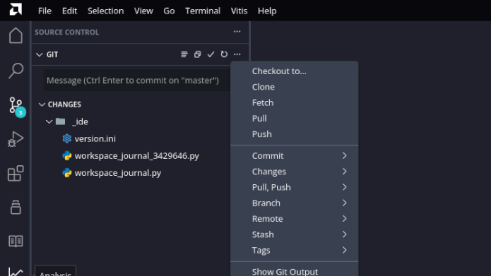

Note: You can see what git commands are being executed under the hood by selecting the 'Show Git Output' option. 


### Step 1: Initialising the Git Repository

Launch Vitis 2025.2, select **open workspace**, and select the workspace we have just created. Then we will need to intialise our workspace as a Git workspace. So once the workspace has loaded select **Terminal** -> **New Terminal** 

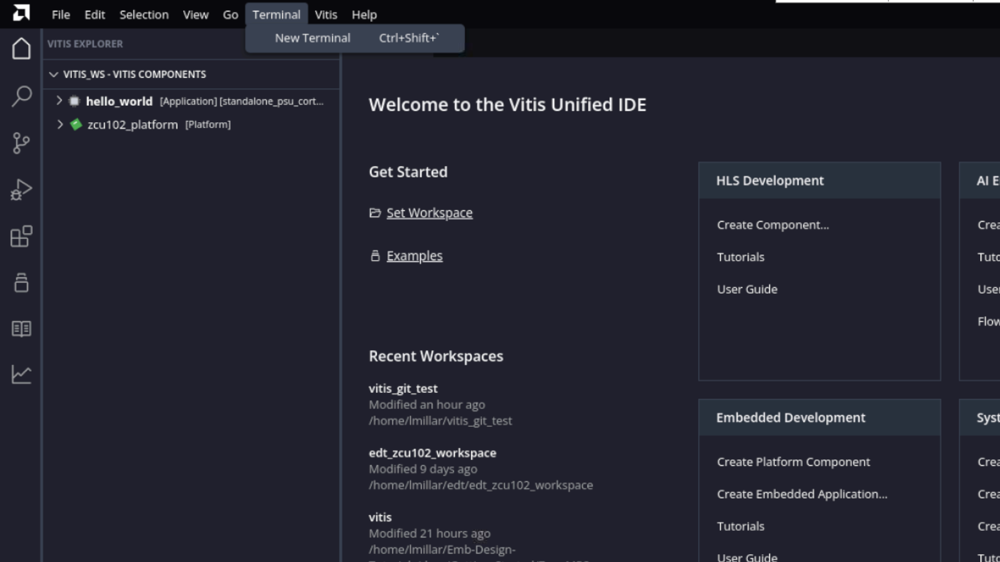

Then run the following command:

```
git init
```

This should return a message such as: Initialized empty Git repository in /test/temp/workVADD/.git/.

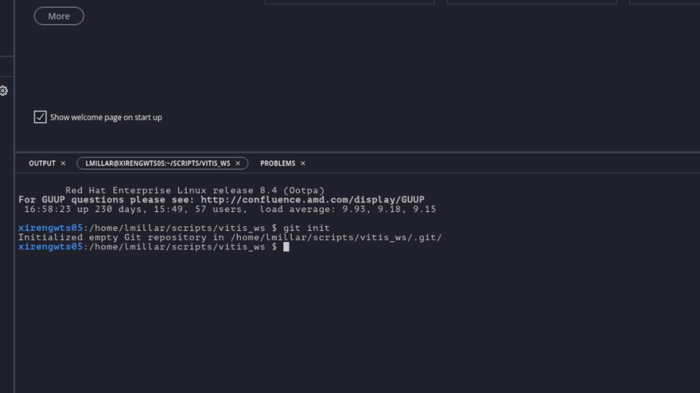

### Step 2: Staging Changes

If you select the version control icon on the left toolbar this will display your interface to git. Here we can see any unstaged and staged changes. 

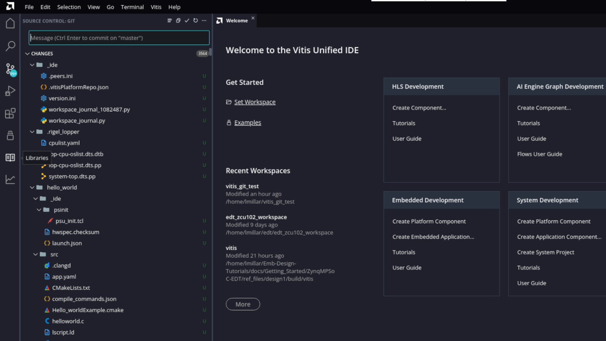

To stage all the changes then go ahead and click **stage all changes**. After this you should see the changes section of the source control panel is empty. 

#### Stage single file

If for any reason you dont want to stage all of your changes and you only want to commit certain files to git the source control functionality within Vitis will allow you to do this. To stage a specific file simply right click on that file and select **Stage Changes**.

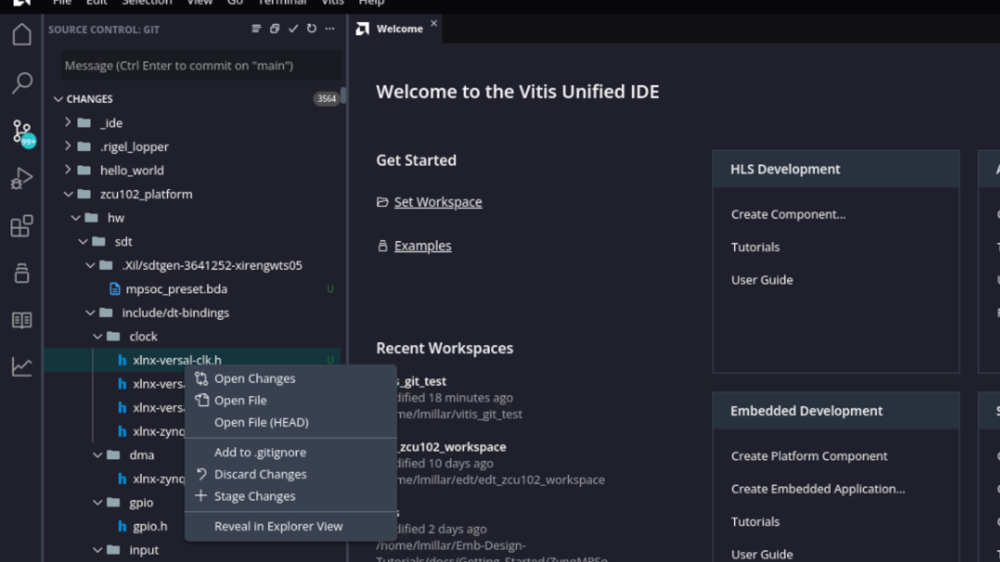

The equivalent git command for this is:

```
git add <file name>
```

#### Stage Component

If it is a speciic Vitis component that you want to stage changes for then first of all select **View as Tree** in the source control panel. Then right click the component you want to stage changes for and select **Stage Changes**. This action will add all the files for this component for source control.

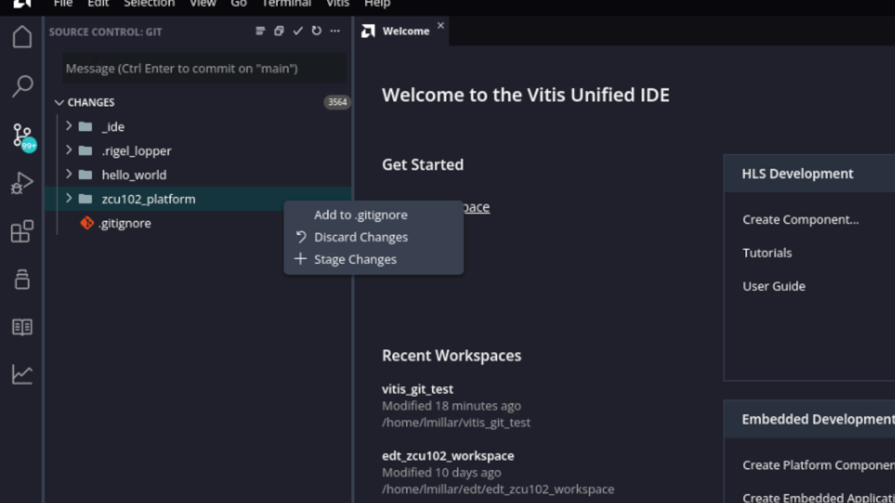

The equivalent git command for this is:

```
git add platform/
```

### Step 3: Commiting Changes

Now to commit our changes first we must enter a commit message in the message textbox within the source control panel. Once you have entered your commit message click the **commit** button at the top of the source control panel.

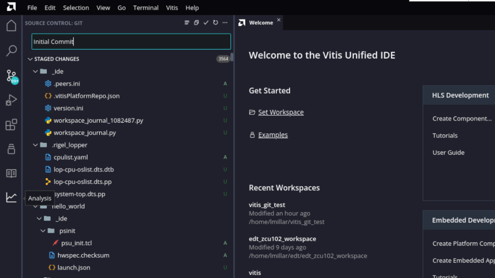

Note: Any commit messages that start with '#' or any empty commit messages will be ignored

These GUI actions are equivalent to this CLI command:

```
git commit -m <commit message>
```

### Step 4: Pushing Changes

Now it is time to push our changes. 

1. Select the three dots beside Git in the source control panel and select **Remote** -> **Add Remote**.

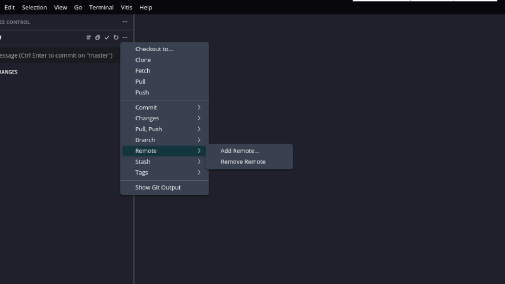

You will then be prompted for the URL of the remote git repository followed by your Git credentials.

2. Select the three dots beside Git in the source control panel and select **Push**.

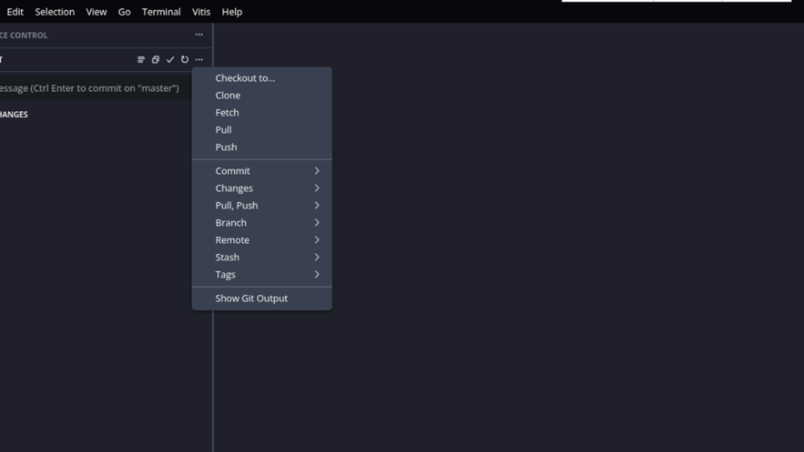

Again you will be prompted for your Git credentials. Upon providing your credentials check your remote repository to ensure it has been updated with the latest changes. 

To push your project in the CLI enter the below command in the vitis terminal:

```
git push --set-upstream <remote_url> <branch>
```

You will then be prompted at the top of the screen for your git username and password. Upon providing your credentials you should see the successful output in the terminal.

### Step 5: Checkout Workspace to Different Location

Now that we have created a project and pushed it to Git we can clone that repository from another location.

1. Create a new workspace and load Vitis.
2. Initialise your repository.

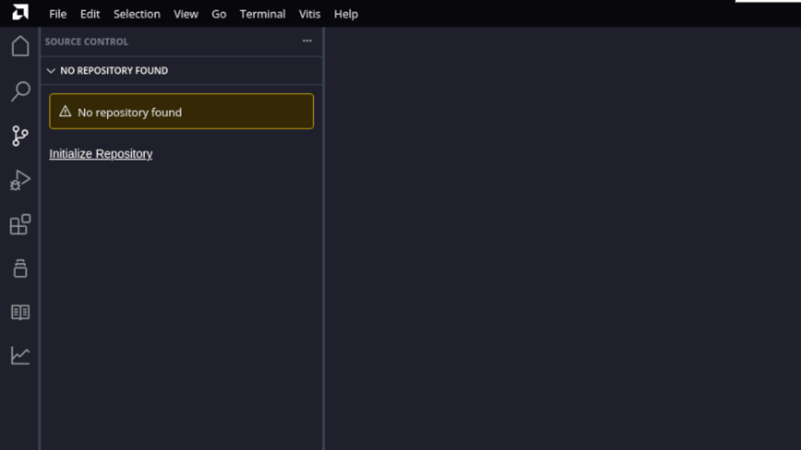

3. Select the version control icon on the left side, select the three dots beside Git and select **clone**.

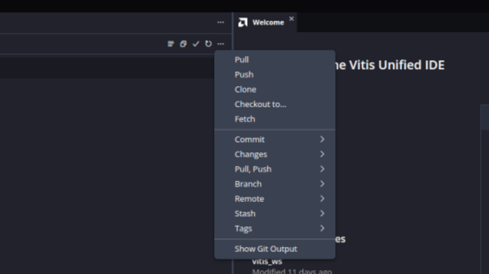

4. You will be prompted to enter the URL of your remote repository.
5. After entering the URL you will be prompted to enter your Git credentials./
6. Finally, after the cloning process has completed you will be asked if you would like to open the clone repository. Select 'Open' and rebuild the components in the new workspace. 

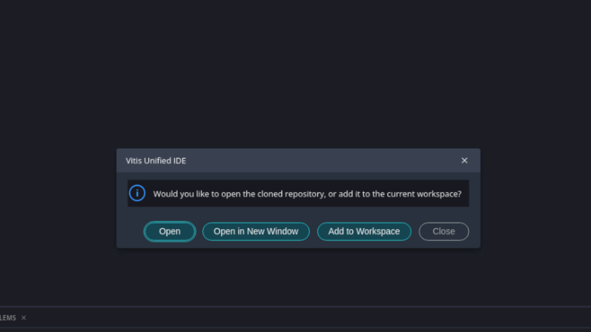

## Example 2: Using the '.gitignore' File

The '.gitignore' file allows the user to define which file to ignore when staging, commiting and pushing to their remote repo. In Vitis there is a '.gitignore' file for each component (platform, application, hls etc). The user can edit this file in the ide to specifcy which files should be ignored when pushing to git.

### Step 1: Selecting files to ignore

1. Go through the 'Workspace Setup' stage again. The 'clean' target will remove what you currently have a give us a fresh workspace.
2. Then run the following command in the terminal:

```
git init
```

3. Open the 'Source Control' view in the IDE which will display each components and all of the files avalible for staging. In this example we will use the **hello_world** application component as an example. Lets say we dont want to commit the 'launch.json' file and the 'psinit' folder.

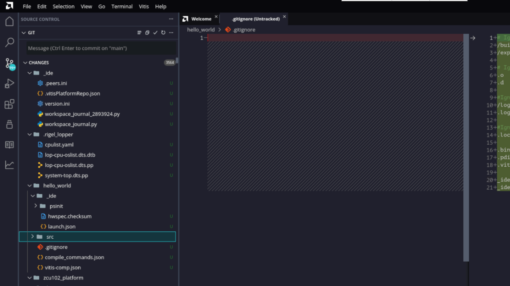

4. Select the '.gitignore' file from the 'hello_world' component and it will be displayed like so.

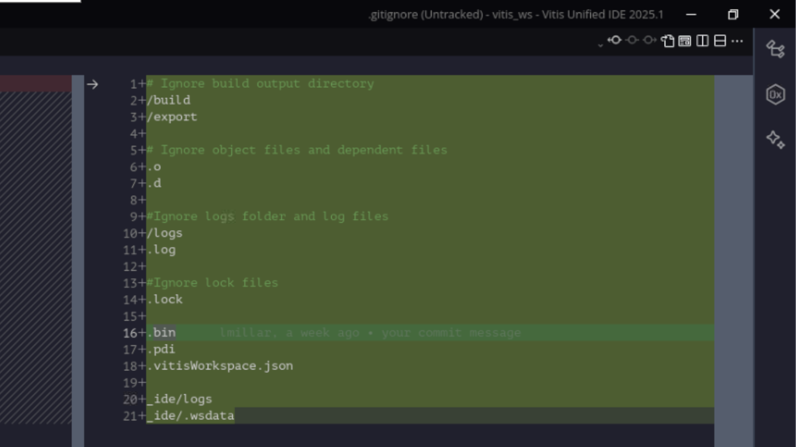

5. Edit the file so that it includes the 'launch.json' file and the 'psinit' folder.

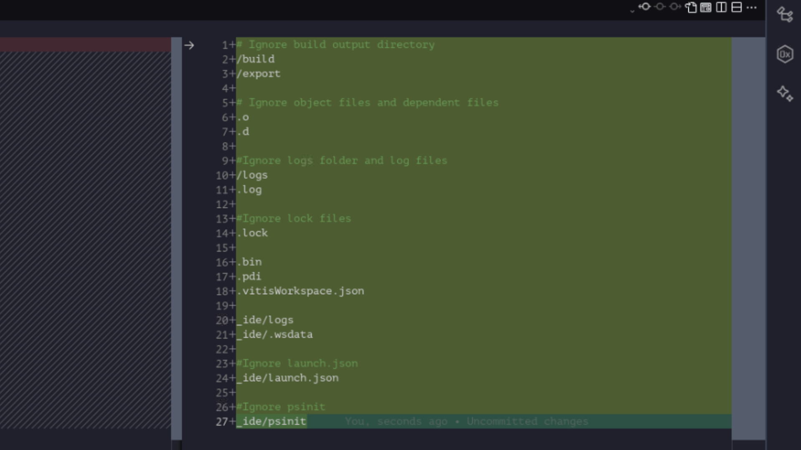

You will notice that once we edit this file we can see that the source control view has been updated and both the 'launch.json' file and 'psinit' folder have been removed from the hello_world component.

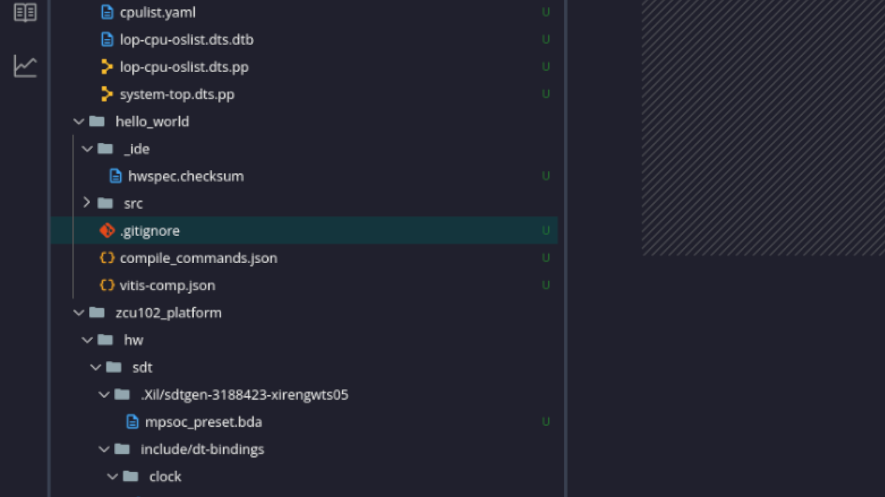

### Step 2: Stage, Commit and Push

1. Not stage, commit and push like the last example.
2. Check your remote repository to ensure the 'launch.json' file and the 'psinit' folder have not been pushed. 

## Example 3: Version Control Scripting

One advantage of the Vitis Unified IDE is the **Workspace Journal** file. This is a python file that reflects project managment actions taken in the GUI using the Vitis Python API. This acts as other way for users to share there workspaces. This technique is slightly similar to the Import/Export features except rather than be given the workspace, you are given the equivalent python code used to create the workspace allowing you to make your own modifications to it. After creating a Vitis workspace the user can send this file to a teammate and they can use it to rebuild the same workspace.  

In this example we will look at how you can use python and bash scripting to create your workspace and manage it in Git. For ease of use we will take the already built **workspace_journal.py** from the '_ide' folder in your project and add version control functionality to it. In this instance we will execute Git commands in python using the 'subprocess' module.

1. Load the **workspace_journal.py** file
Here we can see the code used to build the Vitis workspace. 

```
import vitis

client = vitis.create_client()
client.set_workspace(path="vitis_ws")

platform = client.create_platform_component(name = "zcu102_platform",hw_design = "$COMPONENT_LOCATION/../../zcu102/design_1_wrapper.xsa",os = "standalone",cpu = "psu_cortexa53_0",domain_name = "standalone_psu_cortexa53_0",generate_dtb = True)

platform = client.get_component(name="zcu102_platform")
status = platform.build()

comp = client.create_app_component(name="hello_world",platform = "$COMPONENT_LOCATION/../zcu102_platform/export/zcu102_platform/zcu102_platform.xpfm",domain = "standalone_psu_cortexa53_0",template = "hello_world")

comp = client.get_component(name="hello_world")
comp.build()
```
Now we want to add some code to handle the version control part.

2. We can use the following bash commands to upload the workspace to git.

```
git add .

git commit -m "Initial Commit"

git push $git_repo_path master
```

So we build the workspace with the python script and then push it with git commands.

One way that we can automate this in the one script is through the use of the make build automation tool. Make builds are configured through the use of a Makefile. The Makefile in the **scripts** folder of this tutorial shows how we can create a design and then push that workspace to a remote repository. The script walks through the full git flow from initialising a git repository then creating the working repo, build the workspace, commiting and pushing to the main git repo and then cloning that repo to another location. 

```
make all
```

Note: The Makefile provided does not setup and use a remote github repo that is hosted on the github website as obviously it is not viable to pass user credentials into this tutorial. Therefore instead this script initialises a local git repo which requires no credentials and works entirely locally but behaves like a real Git workflow (git init, add, commit, push clone). However you can use this file as a reference and make edits to it so that you can use it in your own remote flow. 

## Example 4: Using the Import/Export features

Another form of version control that the Vitis Unified IDE offers is the **Import** and **Export** features. These features provide another way to manage projects when git may not be a feasible option. Projects can be 'Exported' and 'Imported' to a new location. Software development teams can utilise these features when Git is not available. 

The objective of this example is to build a workspace within Vitis and export it to be used at a later time. 

### Step 1: Exporting the project

1. Select **File** -> **Export**. This will load the **Export Workspace** wizard as shown below.

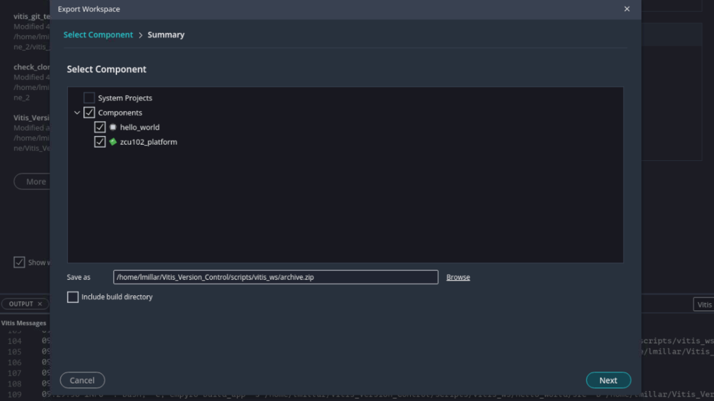

2. Select **Components** to export all components.
3. Provide a suitable file path for the **archive.zip** file to be saved.
4. Click **Finish**


### Step 2: Importing the project

1. Create a new workspace and launch it in Vitis.
2. Select **File** -> **Import**. This will load the **Import Workspace** wizard as shown below.

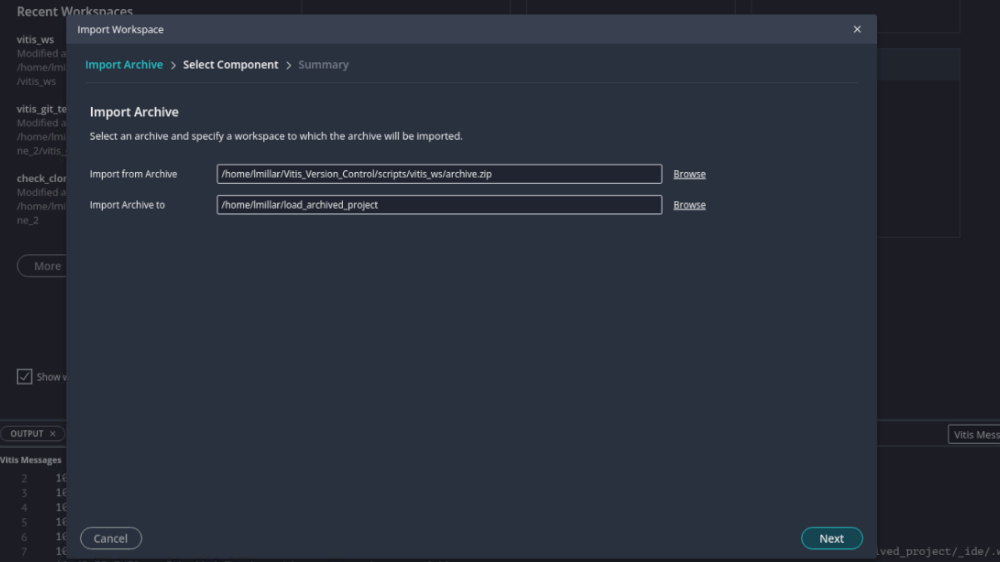

3. Browse and select the **archive.zip** to be imported and click **Next**.
4. Select **Components** to import all components.

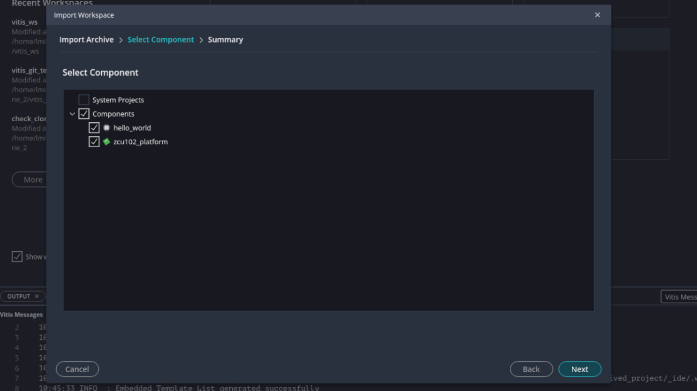

5. Click **Finish**
6. Build your components.

## Summary 

The tutorial above should act as the perfect getting started guide for integrating your vitis projects with git either through the GUI or CLI. Furthermore, the import and export features are handy tools for when version control methods may not be feasible. Learn more about version control techniques within Vitis <a href="https://docs.amd.com/r/en-US/ug1400-vitis-embedded/Source-Control?tocId=az1NCfoBb9_ob5Yqe8LFSw">here</a>

<p class="sphinxhide" align="center"><sub>Copyright © 2025 Advanced Micro Devices, Inc.</sub></p>

<p class="sphinxhide" align="center"><sup><a href="https://www.amd.com/en/corporate/copyright">Terms and Conditions</a></sup></p>

