<table class="sphinxhide" style="width:100%;">
  <tr>
    <td align="center">
      <picture>
        <source media="(prefers-color-scheme: dark)" srcset="https://raw.githubusercontent.com/Xilinx/Image-Collateral/main/logo-white-text.png">
        
      </picture>
      <h1>AMD Vitis™ Embedded Software Tutorials</h1>
      <a href="https://www.amd.com/en/products/software/adaptive-socs-and-fpgas/vitis.html">See Vitis™ Development Environment on amd.com</a>
    </td>
  </tr>
</table>


# Getting Started in Vitis Unified Embedded IDE

***Version: 2025.2***

This tutorial should act as the start point, or a refresher to the AMD Vitis™ Unified Embedded flows. The concepts will be kept simple to allow the user to navigate through the IDE with minimal steps to get started. We will accomplish the following tasks in this tutorial:

* Create the platform
* Create a hello world application on ARM processor
* Setup the target connections and deploy on our target board.

**Note**

The example design in this tutorial is based on ZCU102 evaluation board, which uses MPSoC UltraScale+. The concept can apply to all SoC devices such as ZYNQ-7000 and Versal. You can also carry out this tutorial for versal boards such as:

* vck190
* vek280
* vek385

Furthermore, you can also automate the workspace build (HW and SW) by using the Makefile included in this tutorial.

```
make <board_name>
```
## Board Setup

Documentation on preparing the hardware for each board can be found here:

* <a href="https://docs.amd.com/r/en-US/ug1209-embedded-design-tutorial/Setting-Up-the-ZCU102-Board">ZCU102</a>
* <a href="https://docs.amd.com/r/en-US/ug1366-vck190-eval-bd">VCK190</a>
* <a href="https://docs.amd.com/r/en-US/ug1612-vek280-eval-bd/Introduction">VEK280</a>
* <a href="https://docs.amd.com/r/en-US/ug1304-versal-acap-ssdg/Boot-and-Configuration">VEK385</a>

## Get Started

Launch Vitis IDE, and we will create our first Vitis Embedded project.

* On Windows, click Windows start menu, go to Xilinx Design Tools, launch Vitis.
* On Linux, open a terminal, `source <VITIS_Install_Path>/settings64.sh`, then launch `vitis` from the terminal.

Based on your installation type, you may see different welcome page. This tutorial can run on both Vitis embedded software development installation or Vitis full installation.

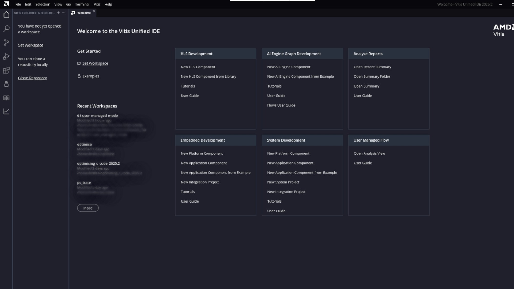

## Setup Workspace

Vitis Unified IDE allows user to do some actions without specifying workspace initially, such as read bulit-in documents, read analysis reports, etc. But it's recommended to specify a workspace before your start to develop applications. 

A workspace is a folder that Vitis IDE stores metadata for your project. 

Click "Set Workspace" on the Welcome page, specify an empty folder and click OK.

## Create Platform

In the classic Vitis IDE, the platform was generated automatically when the XSA was input by the user. However, for Vitis Unified IDE, the user will need to manually create it. This is by design, to allow for a clean workspace. 

For embedded designs, the platform will contain the system device tree (SDT). Any domains (BSP), and/or boot components will be placed in the platform.

From the Welcome Screen, users can select the Create Platform Component under Embedded Development.  Or from the File menu, under New Component, Platform.


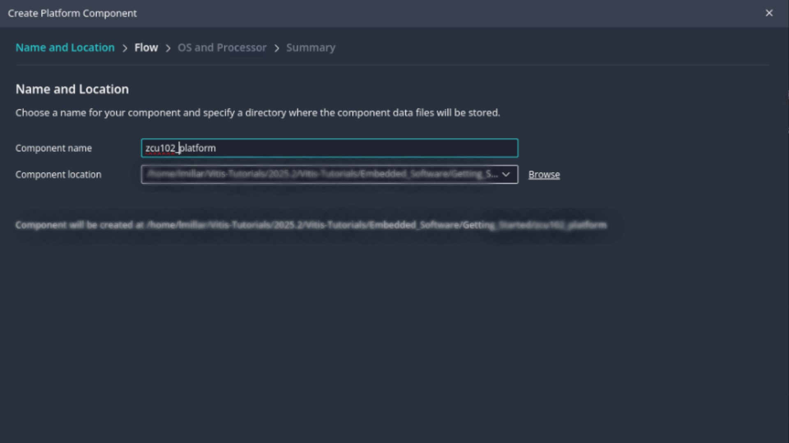


Before we proceed, let’s discuss what we actually need to both boot and deploy our user application on the development board.

For example, let’s take the Zynq UltraScale. This device consists of a Processor Subsystem Unit (PSU) and Programmable Logic (PL). When users exported the hardware in Vivado, this created an XSA file. This XSA file is a container file that contains (amongst other files) the PSU config files; `psu_init.c` and `.h` files that are generated when you generate the Output Products in Vivado. These files are used by the First Stage BootLoader (FSBL) to config the PSU. There may also be a bitstream (if included when exporting the hardware), this is used to config the PL. There is also the metadata about our block design, IP enabled in the PSU, IP in the PL and how each of these IP are configured called cell properties. This metadata can be extracted by the Vitis Unified tool to tailor a software system that is based on the hardware created in Vivado. In summary, to boot (either in JTAG, SD card or otherwise) we need to program the PSU. The PSU is programmed via the FSBL. If the PL needs to be programmed (optional), this is done via the bitstream. In the Vitis Unified tool, users can create these files by using the Create Platform Component.

For Versal, the Platform Loader Manager (PLM) is created in Vivado and is packaged into a Programmable Definition Image (PDI) in Vivado and this PDI is added to the XSA file. So, users do not need to build boot artifacts in the Vitis IDE

Users have two options: create a new platform using the XSA exported from Vivado or use an existing platform.  We will create a new platform from an existing XSA.

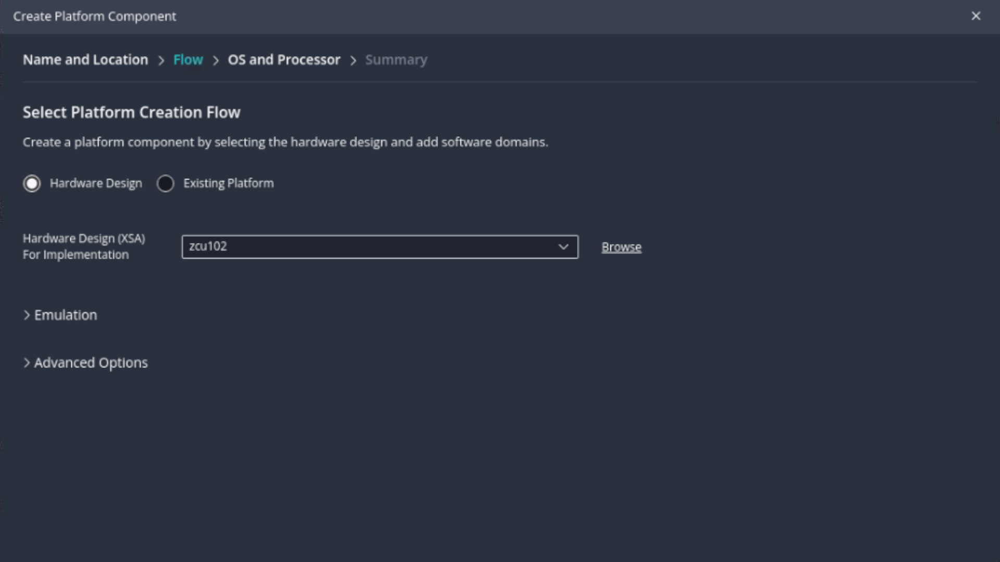

The SDT (System Device Tree) is a new concept in Vitis Unified flow. Previously, in the classic Vitis IDE, the hardware metadata was extracted directly from the XSA using HSI API in an "AD Hoc" manner when needed by the Vitis tools; such as extracting processors for platform creation or extracting IP for BSP creation. In Vitis unified flow, the tools will create a SDT (System Device Tree) when users generate the platform, and this is used to provide the hardware metadata to Vitis via the lopper utility.

<details>
  <summary>Click here to expand details of System Device Tree in Vitis workflow</summary>
**Note**:

- The diagram should be read from top to bottom.
- The diagram is for illustration only.

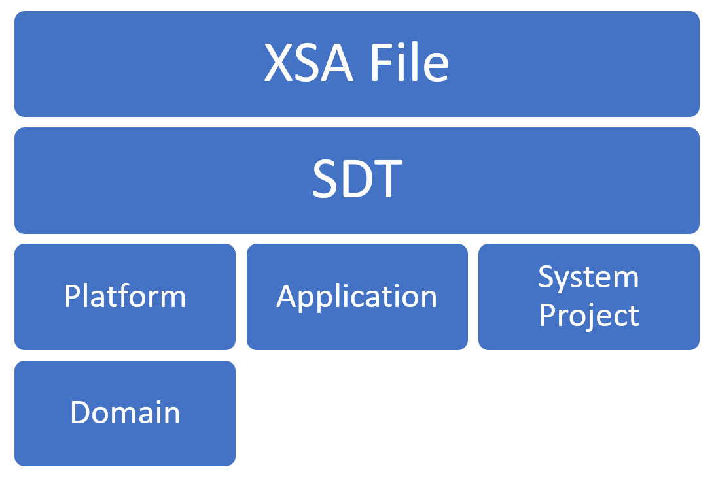


Users will now be presented with a drop down box to select the operating system and the processor will be auto-populated from the SDT. Tick the Generate boot artifacts box and proceed

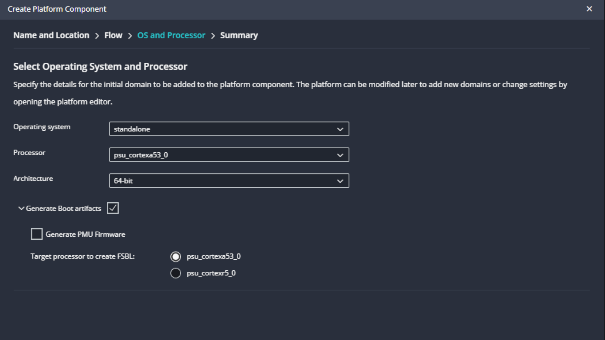

Users will now be presented with the view below. The explorer view is on the top left, the flow view is the bottom left. The platform is not built by default, users can do this by select the build icon in the flow view. This will build the platform, which consists of our domains. The platform will begin building in the background and we can move on to Create Application.

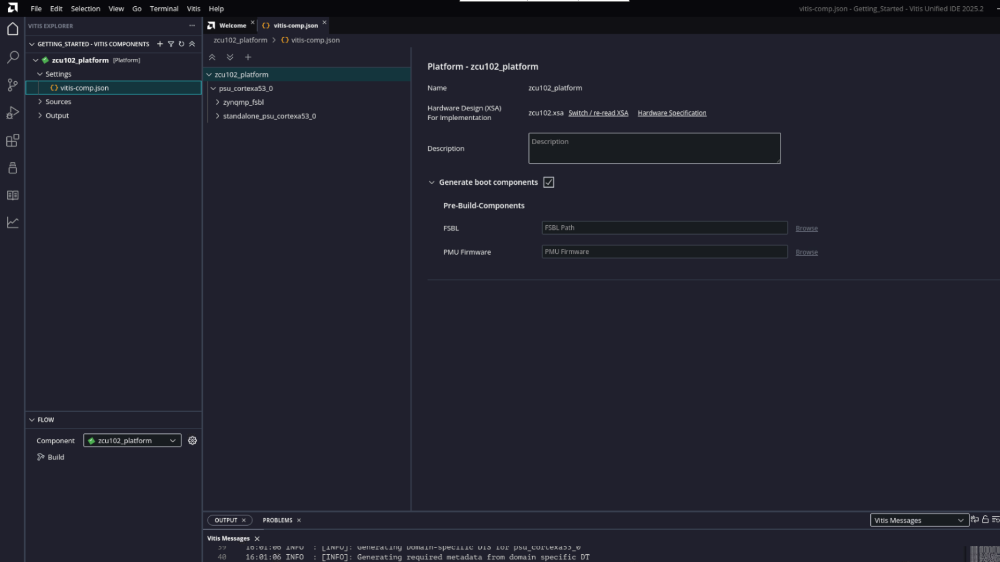


## Create Application

There are application templates that the user can user can use to get started.  The user can view the available examples by selecting the examples in the Tool Bar on the left or from the Top menu by selecting View and Examples.  This will show a list of available examples in the explorer view.  We can select the Hello World example as shown below:

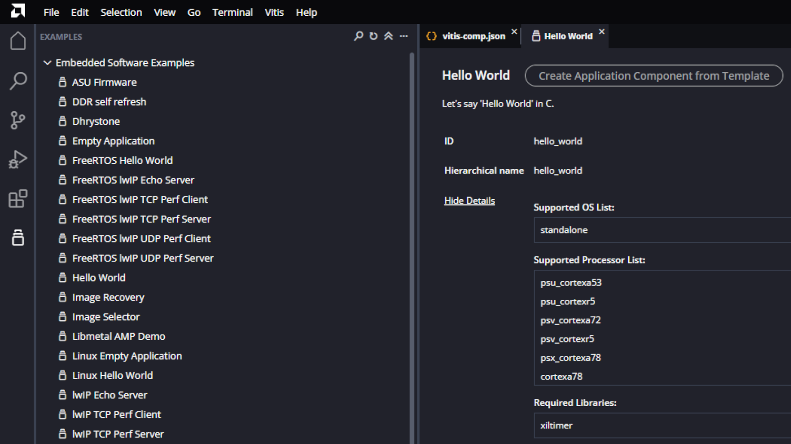

Select the target that was created and built above

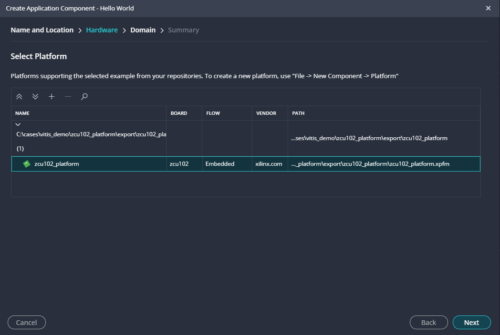

Choose the existing domain that was created in the platform

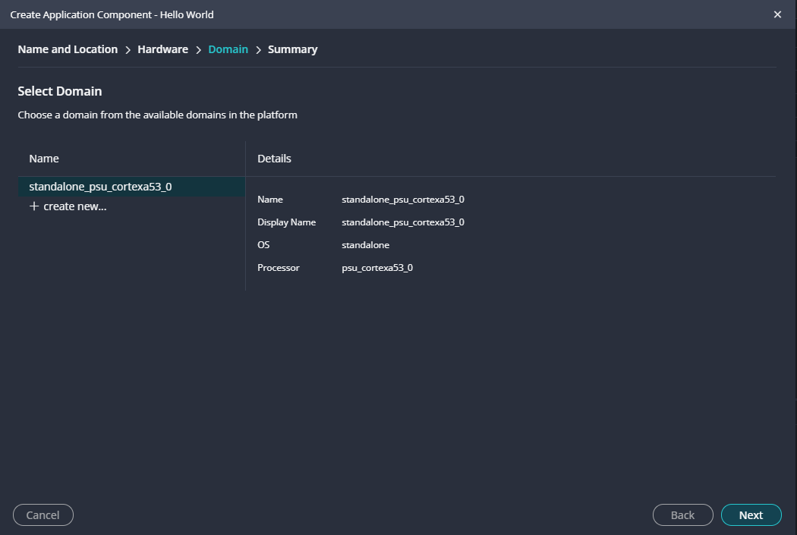

## View Domain settings


The Vitis Unified flow has a utility called Lopper that is used to extract the hardware metadata from a SDT (System Device Tree) to software components. This Lopper framework is not isolated to embedded flows and is used across all flows in Vitis. Lopper is used here to populate the domain with the hardware metadata data such as the available UARTs used for sdtin/out.


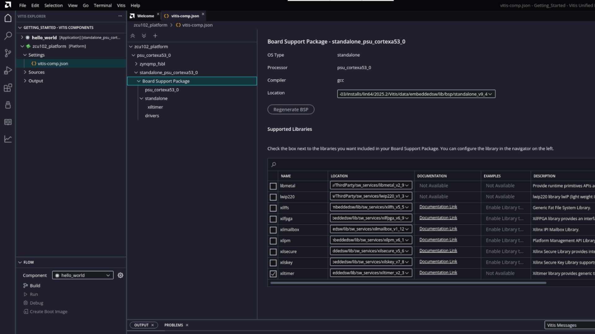

## Set Up target Connection

The target connection will be set to the localhost by default. This means if you have the board directly connected to the same machine as Vitis is hosted, then the default connection will work for you. However, If connecting to a remote board, Linux, or QEMU, then users can set up the target connection.

Select **Vitis** -> **Target Connections**

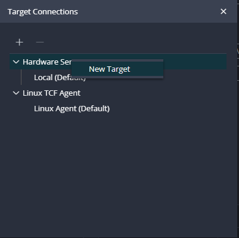

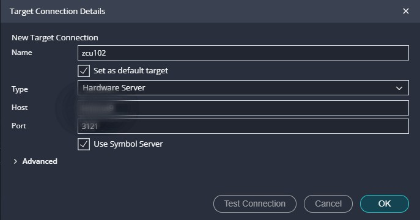

Use the test connect to verify that the connection to the hardware server was successful.

## Build Application and Deploy on Target

We are now ready to build our application. To do this, select the Build icon in the Flow view.

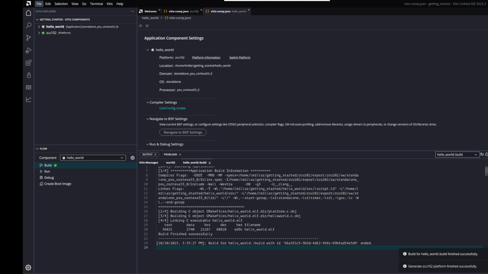

You will be prompted with the below build options to choose from:

1. Always build platform with application
- Platform build will always take place automatically before application build

2. Only build application (manually build platform if needed)
- Platform build wont take place automatically before application build

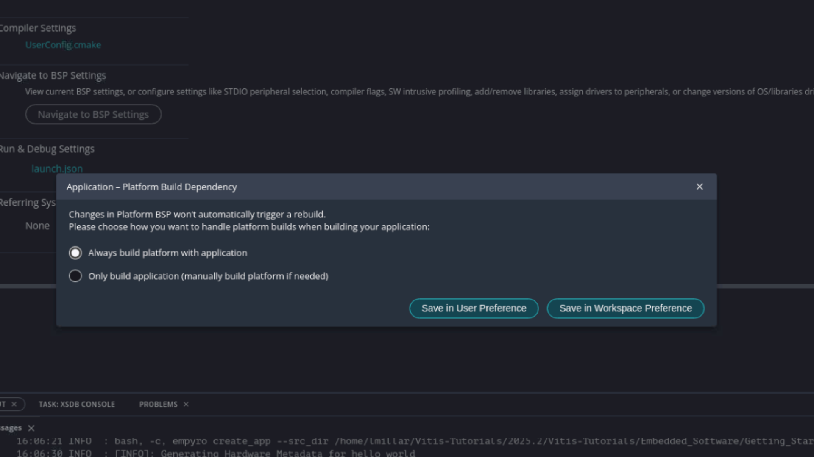

Select Debug in the Flow view, and user will be prompted to create a new configuration (if one does not previously exist).

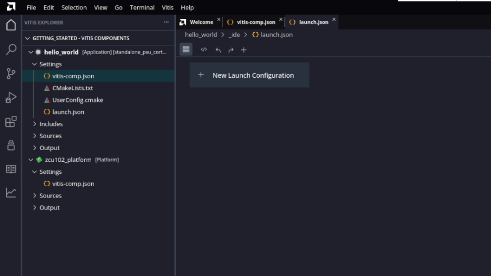

Select New Launch Configuration. The Launch configuration will be auto-populated with the boot artifact components in the platform.

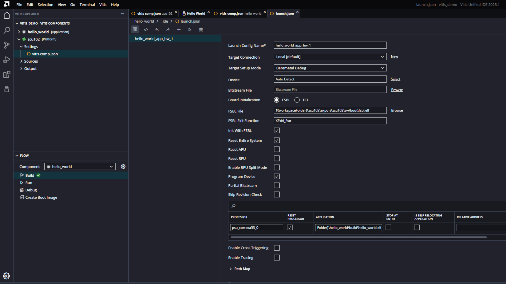

If using a remote target connection, then this should be used here. Then, select debug icon to debug on the target.

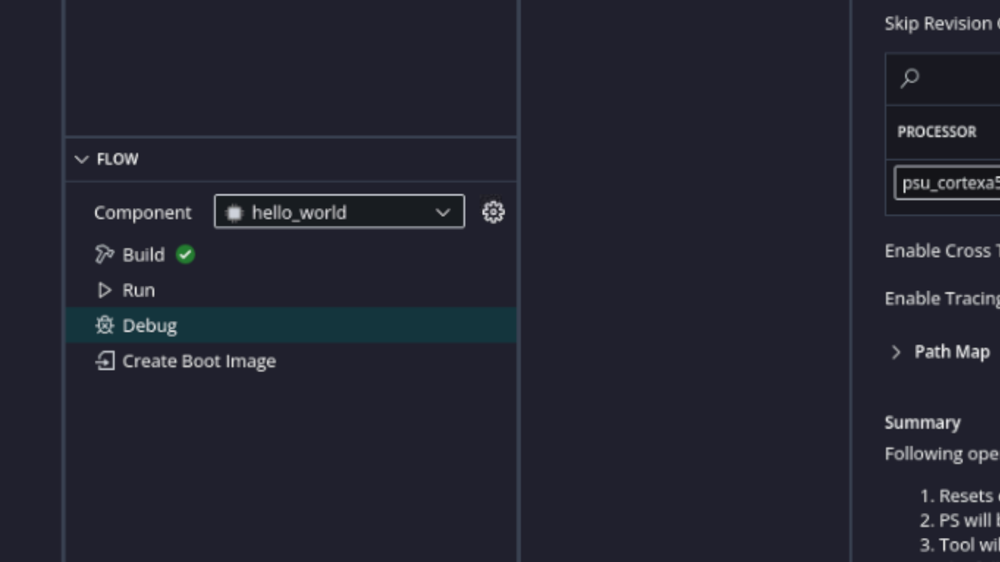

This will launch the Debug view.

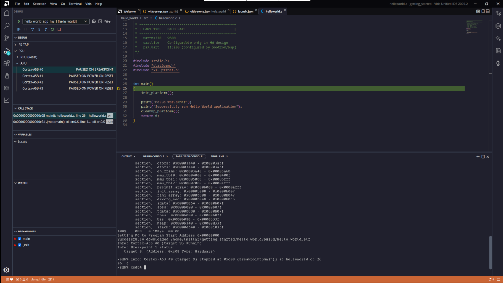

Users can then use the debug options such as continue, step into/over, and so forth.

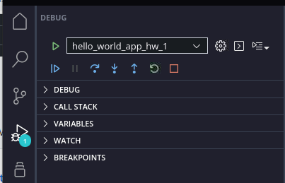

## Viewing all Vitis IDE CLI commands

The Vitis IDE  will keep a log of all the Vitis Python CLI commands that users can use to rebuild the workspace via the Vitis CommandLine Interface (CLI). This python file can be found in `_ide/worksapce_journal.py` or it can be viewed within the IDE by selecting **Vitis** -> **Workspace Journal**.


## Program Flash

Once users have validated their code, then users may want to populate the QSPI with their boot file.

To create the boot Image, select **Vitis** -> **Create Boot Image** and select your architecture here (such as Zynq, Zynq UltraScale, or Versal).

For Zynq UltraScale, the bootloader needs to be loaded. This is the FSBL. I then added the Hello World application created above too

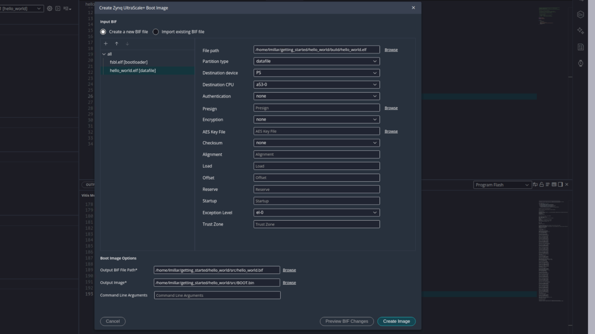

Next, use the Program Flash (Vitis -> Program Flash) utility to place the `boot.bin` generated above onto our QSPI

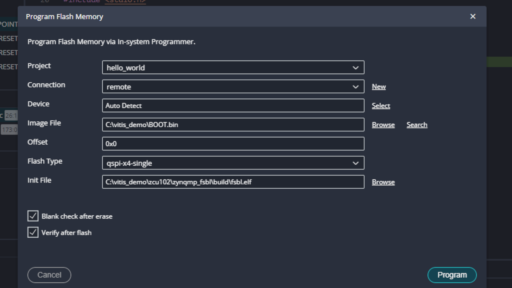

Make sure that the Program Flash is successful. We can verify, by setting the bootmode to QSPI on our board


## Rebuilding Vitis Workspace from CommandLine

The Vitis Unified IDE will capture all the Vitis Python API used to create or modify the Vitis workspace in a python file in the logs folder. This can be then source in the Vitis CLI to rebuild the workspace. For example, the script that was generated in Vitis using the steps above is attached to this git repository with minimal changes to set the PWD.

```
vitis -s build_workspace.py -b zcu102
```

<p class="sphinxhide" align="center"><sub>Copyright © 2020–2023 Advanced Micro Devices, Inc.</sub></p>

<p class="sphinxhide" align="center"><sup><a href="https://www.amd.com/en/corporate/copyright">Terms and Conditions</a></sup></p>

