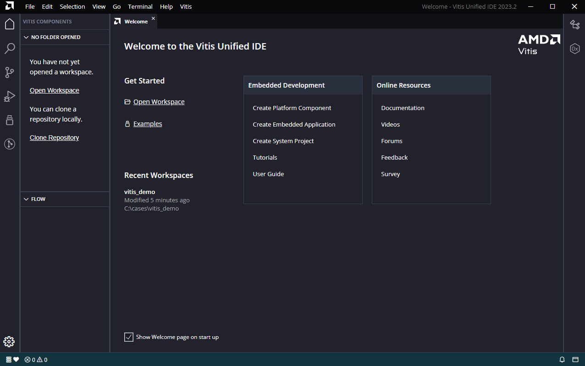
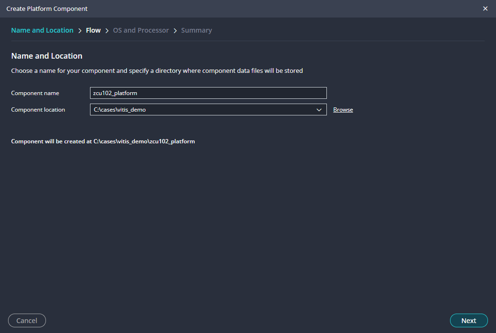

<table class="sphinxhide" width="100%">
 <tr width="100%">
    <td align="center"><h1>Vitis™ In-Depth Tutorials</h1>
    </td>
 </tr>
</table>


## Getting Started in Vitis Unified Embedded IDE

***Version: 2023.2***

This tutorial should act as the start point, or a refresher to the Vitis Unified Embedded flows. The concepts will be kept simple to allow the user to navigate through the IDE with minimal steps to get started. We will create the platform, hello world application, setup the target connections and deploy on our target board.

**Notes:**
 - The diagram should be read from top to bottom.
 - The diagram is for illustration only.


## How Metadata is passed betweeen Vivado and Vitis

How the hardware metadata has passed between Vivado and Vitis has changed in the Vitis Unified flow. In Vitis Classic, the Hardware Software Interface (HSI) API suite was used in an "Ad-Hoc" manner depending on where this was needed in the Vitis IDE. In Vitis Unified IDE, the System Device Tree (SDT) is created during the Platform creation. The SDT is similar to the device tree used in Linux. However, the SDT is system level aware. Whereas a device tree in Linux would be specific to a processor and its address map. Then all hardware metadata is extracted from the SDT nodes using the Lopper framework. The Lopper framework is a Python based utility that extracts the metadata from the SDT. All components; platform, application and system project use the Lopper framework utility to extract the desired metadata from the SDT. The Domains are all maintained within the platform. If users add an application component, then the platform must be built first.


## Lets get started

Launch Vitis unified embedded tool in 2023.2, and we will create out first Vitis Embedded project. 



## Create Platform

<details>
  <summary>Additional Notes</summary>
In the Vitis Classic flows, the platform was generated automatically when the XSA was input by the user. However, Vitis Unified IDE the user will need to manually created. This is by design, to allow for a clean workspace. In the embedded flow, the platform will contain the SDT. Any domains, and/or boot components will be placed in the platform. 

From the Welcome Screen, users can select the Create Platform Component under Embedded Development.  Or from the File menu, under New Component, Platform.
</details>



<details>
  <summary>Additional Notes</summary>

Before we proceed, lets discuss what we actually need to both boot and deploy our user application on the development board. 

For example, lets take the Zynq Ultrascale. This device consists of a Processor Subsystem Unit (PSU) and Programmable Logic (PL). When users exported the hardware in Vivado, this created an XSA file. This XSA file is a container file that contains (amongst other files) the PSU config files; psu_init.c and .h files that are generated when you generate the Output Products in Vivado. These files are used by the First Stage BootLoader (FSBL) to config the PSU. There may also a bitstream (if included when exporting the hardware), this is used to config the PL. There is also the metadata about our block design, IP enabled in the PSU, IP in the PL and how each of these IP are configured called cell properties. This metadata can be extracted by the Vitis Unified tool to tailor a software system that is based on the hardware created in Vivado. In summary, to boot (either in JTAG, SD card or otherwise) we need to program the PSU. The PSU is programmed via the FSBL. If the PL needs to be programmed (optional), this is done via the bitstream. In the Vitis Unified tool, users can create these files by using the Create Platform Component.

For Versal, the Platform Loader Manager (PLM) is created in Vivado and is packaged into a Programmable Definition Image (PDI) in Vivado and this PDI is added to the XSA file. So, users do not need to build boot artifacts in the Vitis IDE
</details>

Users have two options; create a new platform using the XSA exported from Vivado, or use an existing platform.  We will create a new platform from an existing XSA.›


<details>
  <summary>Additional Notes</summary>

The SDT (System Device Tree) is a new concept in Vitis™ Unified flow. Previously, in Vitis™ Classic the hardware metadata was extracted directly from the XSA using HSI API in an "AD Hoc" manner when needed by the Vitis™ tools; such as extracting processors for platform creation or extracting IP for BSP creation. In Vitis unified flow, the tools will create a SDT (System Device Tree) when users generate the platform and this is used to provide the hardware metadata to Vitis™ via the lopper utility.
</details>

Users will now be presented with a drop down box to select the operating system and the processor will be auto-populated from the SDT. Tick the Generate boot artifacts box and proceed


Users will now be presented with the view below. The explorer view is on the top left, the flow view is the bottom left. The platform is not built by default, users can do this by select the build icon in the flow view. This will build the platform, which consists of our domains.  The platform will begin building in the back ground and we can move on to Create Appliation.


## Create Application

There are application templates that the user can user can use to get started.  The user can view the available examples by selecging the examples in the Tool Bar on the left or from the Top menu by selecting View and Examples.  This will show a list of available exampels in the explorer view.  We can select the Hello World example as shown below:


Select the target that was created and built above


Choose the existing doamin that was created in the platform


## View Domain settings

<details>
  <summary>Additional Notes</summary>
The Vitis Unified flow has a utility called Lopper that is used to extract the hardware metadata from a SDT (System Device Tree) to software components. This Lopper framework is not isolated to embedded flows and is used across all flows in Vitis. Lopper is used here to populate the domain with the hardware metadata data such as the available UARTs used for sdtin/out. 
</details>


## Set Up target Connection

The target connection will be set to the localhost by default. This means if you have the board directly connected to the same machine as Vitis is hosted, then the default connection will work for you. However, If connecting to a remote board, Linux, or QEMU, then users can set up the target connection. 

Select Vitis -> Target Connections...


Use the test conect to verify that the connection to the hardware server was successful.

## Build Application and Deploy on Target

We are now ready to build our application. To do this, select the Build icon in the Flow view


Select Debug in the Flow view, and user will be prompted to create a new configuration (if one doesnt previously exist)


Select New Launch Configuration


The Launch configuration will be auto-populated with the boot artifact components in the platform. 


If using a remote target connection, then this should be used here. Then just select debug icon to debug on the target


This will launch the Debug view


Users can then use the debug options such as continue, step into/over, ect 


## Viewing all Vitis IDE CLI commands

The Vitis IDE  will keep a log of all the Vitis Python CLI commands that users can use to rebuild the workspace via the Vitis CommandLine Interface (CLI). This log file can be found in the logs/builder.py 


## Program Flash

Once users have validated their code, then users may want to populate the QSPI with their boot file. 

To create the boot Image, select Vitis -> Create Boot Image and select your architure here wether it be Zynq, Zynq Ultrascale or Versal.

For Zynq Ultrascale, the bootloader needs to be loaded. This is the FSBL. I then added the Hello World application created above too


Next, use the Program Flash (Vitis -> Program Flash) utility to place the the boot.bin gnerated above onto our QSPI


Make sure that the Program Flash is successful. We can verify, by setting the bootmode to QSPI on our board


## Rebuilding Vitis Workspace from CommandLine

The Vitis Unified IDE will capture all the Vitis Python API used to create, or modifiy the Vitis workspace in a python file in the logs folder. This can be then source in the Vitis CLI to rebuild the workspace. For example, the script that was generated in Vitis using the steps above is attached to this git repository with minimal changes to set the PWD.

```
vitis -s build_workspace.py
```

<p class="sphinxhide" align="center"><sub>Copyright © 2020–2023 Advanced Micro Devices, Inc</sub></p>

<p class="sphinxhide" align="center"><sup><a href="https://www.amd.com/en/corporate/copyright">Terms and Conditions</a></sup></p>

