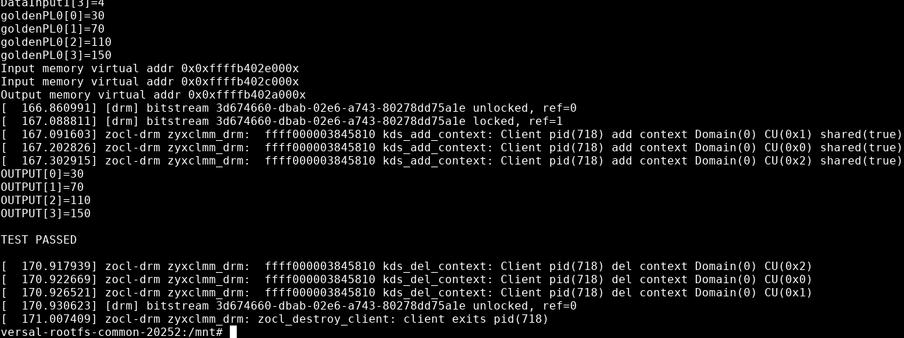

<table class="sphinxhide" style="width:100%;">
  <tr>
    <td align="center">
      <picture>
        <source media="(prefers-color-scheme: dark)" srcset="https://raw.githubusercontent.com/Xilinx/Image-Collateral/main/logo-white-text.png">
        
      </picture>
      <h1>AMD Vitis™ Getting Started Tutorials</h1>
      <a href="https://www.amd.com/en/products/software/adaptive-socs-and-fpgas/vitis.html">See Vitis™ Development Environment on amd.com</a>
    </td>
  </tr>
</table>


# Hardware Run

To run the design on hardware, please ensure the design was run with the following command:

```
make all TARGET=hw
```

The above command will generate `pack_out_dir`, containing all the file required for the hardware run.

## Steps to run the design on Hardware

### 1. Connect the VCK190 board and set the SD boot mode

Refer to [UG1366](https://docs.amd.com/r/en-US/ug1366-vck190-eval-bd) to get more details on VCK190 board.

### 2.  Flash the SD Card

Use the balenaEtcher/similar tools to flash the SD card. Plugin the SD card to the VCK190 board to initate the boot.

### 3.  Running the design and application on the VCK190

After the Linux boot is complete, use the below commands to run the `host.exe` and `a.xclbin`
`versal-rootfs-common-20252:/mnt#`

```
sudo su
cd /run/media/mmcblk0p1
./host.exe a.xclbin
```

- Check the results

```
OUTPUT[0]=30
OUTPUT[1]=70
OUTPUT[2]=110
OUTPUT[3]=150
TEST PASSED
```



With the above results on the hardware run, we have reached to the end of this tutorial.


<hr class="sphinxhide"></hr>

<p class="sphinxhide" align="center"><sub>Copyright © 2020–2025 Advanced Micro Devices, Inc.</sub></p>

<p class="sphinxhide" align="center"><sup><a href="https://www.amd.com/en/legal/copyright.html">Terms and Conditions</a></sup></p>
