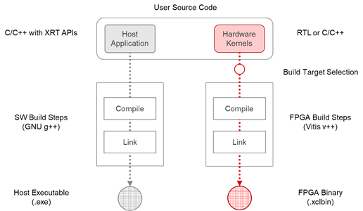

<table class="sphinxhide" width="100%">
 <tr>
   <td align="center"><h1>Vitis™ Application Acceleration Development Flow Tutorials</h1>
   </td>
 </tr>
 <tr>
 <td>
 </td>
 </tr>
</table>

# Vitis Flow 101 – Part 1: Essential Concepts

The Vitis unified software platform provides a framework for developing and delivering FPGA accelerated applications using standard programming languages. Vitis offers all of the features of a standard software development environment, including:

* Compiler or cross-compiler for host applications running on x86 or Arm® processors

* Cross-compilers for building the FPGA binary

* Debugging environment to help identify and resolve issues in the code

* Performance profilers to identify bottlenecks and help you optimize the application

## Understanding the Vitis Programming and Execution Model

A Vitis accelerated application consists of two distinct components: a software program and an FPGA binary containing hardware accelerated kernels.

* The software program is written in C/C++ and runs on a conventional CPU. The software program uses user-space APIs implemented by the XRT to interact with the acceleration kernel in the FPGA device.

* The hardware accelerated kernels can be written in C/C++ or RTL (Verilog or VHDL) and run within the programmable logic part of the FPGA device. The kernels are integrated with the Vitis hardware platform using standard AXI interfaces.

  

Vitis accelerated applications can execute on either data center or embedded acceleration platforms:

* On data center platforms, the software program runs on an x86 server, and the kernels run in the FPGA on a PCIe®-attached acceleration card.

* On embedded platforms, the software program runs on an Arm processor of an AMD MPSoC device, and the kernels run within the same device.

Because the software and hardware components of a Vitis application use standardized interfaces (XRT APIs and AXI protocols) to interact with each other, the user’s source code remains mostly agnostic of platform-specific details and can be easily ported across different acceleration platforms.

There are multiple ways by which the software program can interact with the hardware kernels. The simplest method can be decomposed into the following steps:

1. The host program writes the data needed by a kernel into the global memory of FPGA device.
2. The host program sets up the input parameters of the kernel.
3. The host program triggers the execution of the kernel.
4. The kernel performs the required computation, accessing global memory to read or write data, as necessary. Kernels can also use streaming connections to communicate with other kernels.
5. The kernel notifies the host that it has completed its task.
6. The host program can transfer the data from global memory to host memory or can give ownership of the data to another kernel.

## Understanding the Vitis Build Process

The Vitis build process follows a standard compilation and linking process for both the host program and the kernel code:

* The host program is built using the GNU C++ compiler (g++) for data-center applications or the GNU C++ Arm cross-compiler for AMD MPSoC devices.

* The FPGA binary is built using the Vitis compiler. First the kernels are compiled into a Xilinx object (.xo) file. Then, the .xo files are linked with the hardware platform to generate the FPGA binary (.xclbin) file. The Vitis compiler and linker accepts a wide range of options to tailor and optimize the results.

  

## Understanding Vitis Build Targets

The Vitis compiler provides three different build targets: two emulation targets used for debug and validation purposes, and the default hardware target used to generate the actual FPGA binary:

* Software Emulation: The kernel code is compiled to run on the host processor. This allows iterative algorithm refinement through fast build-and-run loops. This target is useful for identifying syntax errors, performing source-level debugging of the kernel code running together with application, and verifying the behavior of the system.

* Hardware Emulation: The kernel code is compiled into a hardware model (RTL), which is run in a dedicated simulator. This build-and-run loop takes longer but provides a detailed, cycle-accurate view of kernel activity. This target is useful for testing the functionality of the logic that will go in the FPGA and getting initial performance estimates.

* Hardware: The kernel code is compiled into a hardware model (RTL) and then implemented on the FPGA, resulting in a binary that will run on the actual FPGA.

## Next Step

Theory is useful, but nothing beats practice! Proceed to [**Part 2**](./Part2.md) to install the Vitis tools before starting your first example project.

Copyright © 2020–2023 Advanced Micro Devices, Inc

<a href="https://www.amd.com/en/corporate/copyright">Terms and Conditions</a>

