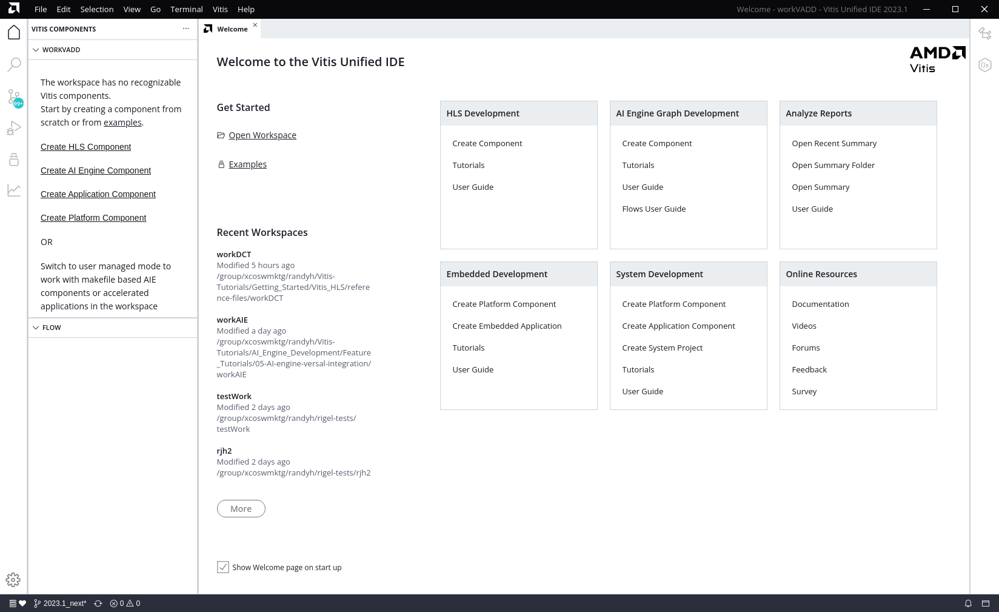
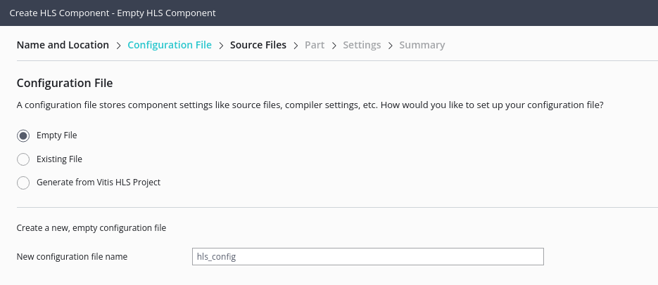
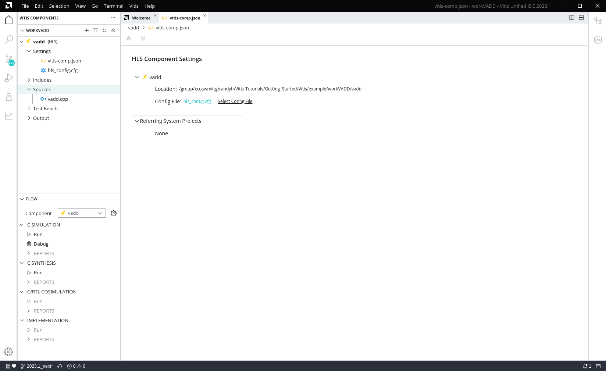
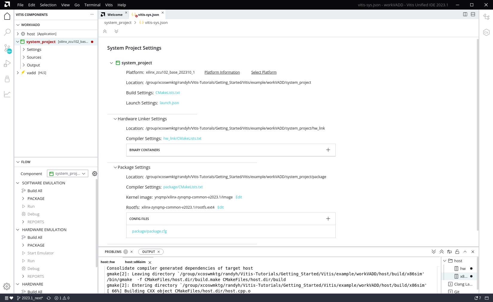
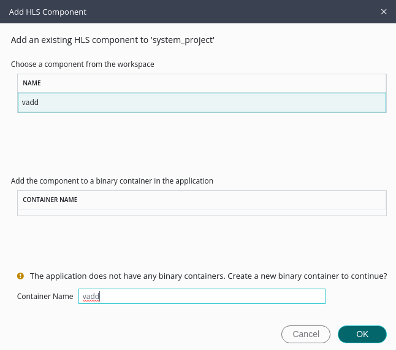
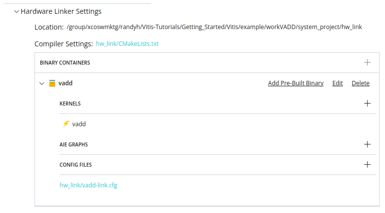
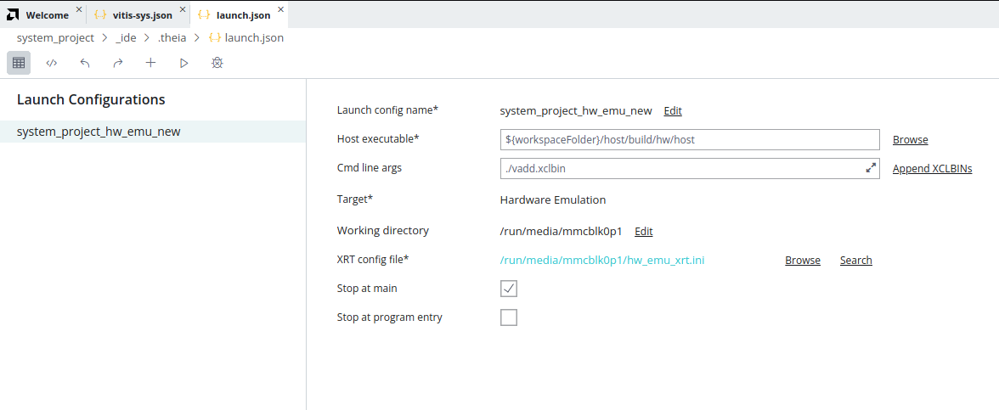
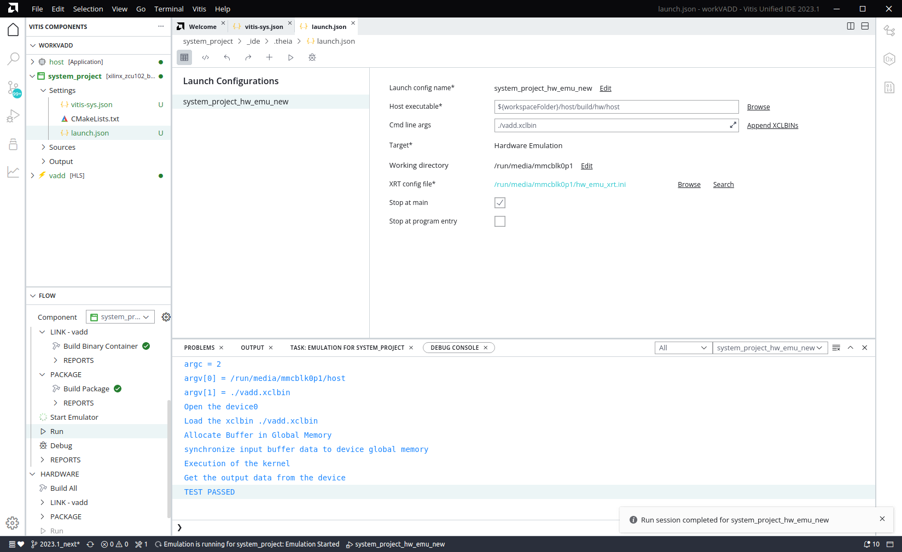

<table class="sphinxhide" width="100%">
 <tr>
   <td align="center"><h1>Vitis™ Application Acceleration Development Flow Tutorials</h1>
   </td>
 </tr>
 <tr>
 <td>
 </td>
 </tr>
</table>

# Vitis Getting Started Tutorial

## Part 4: Build and Run with the new Vitis unified IDE

This lab introduces the new Vitis unified IDE as described in [Introduction to Vitis unified IDE](https://docs.xilinx.com/r/en-US/ug1553-vitis-ide/Introduction). The unified IDE provides a single tool for end-to-end application development, without the need to jump between multiple tools for design, debug, integration and analysis. 

**NOTE:** The following text assumes you have setup the environment as instructed in [Part 2: Installation and Configuration](./Part2.md).

### Launch the Vitis unified IDE

The first step is to create a workspace for your project, and to launch the Vitis unified IDE using the following steps: 

1. Create a workspace: `mkdir <tutorial_path>/Getting_Started/Vitis/example/workVADD`
2. Launch the Vitis unified IDE: `vitis -new -w workVADD`

The workspace is a folder for holding the various components and projects of a design. 

**TIP:** The workspace is simply the place where you will store the files related to creating and building your project, or multiple projects. However, file watcher limitations can occur if you create a project with too many files as described in the [*Limitations and Known Issues*](https://docs.xilinx.com/r/en-US/ug1553-vitis-ide/Limitations-and-Known-Issues). 

The Vitis Unified IDE opens displaying the Welcome page. 

 

### Creating the HLS Component 

Use the **File > New Component > HLS** to create a new HLS component. This opens the Create HLS Component wizard to the *Name and Location* page. 

1. For the **Component name** field specify `vadd`
2. For the **Component location** specify the workspace (default value)
3. Click Next to open the *Configuration File* page

The *Configuration File* lets you specify commands for building and running the HLS component as described in [*v++ Mode HLS*](https://docs.xilinx.com/r/en-US/ug1553-vitis-ide/v-Mode-HLS). You can specify a new empty file, an existing config file, or generate a config file from an existing HLS project as described in [*Creating an HLS Component*](https://docs.xilinx.com/r/en-US/ug1553-vitis-ide/Creating-an-HLS-Component).

 

4.  Select **Empty File** and click **Next**. 

This opens the *Source Files* page. 

5.  Select the **Add Files** icon to open a file browser, navigate to `<tutorial_path>/Getting_Started/Vitis/example/src/vadd.cpp` and select **Open** to add the file. 

After adding the file you can see fields for adding CFLAGS and CSIMFLAGS for all source files, or specific to each file. Add these to your design if needed.

6.  Under the Top Function browse and select the `vadd` function and click **OK**.  

**TIP:** There are no Test bench files for the `vadd` kernel, but you will test the kernel later using the software emulation flow of the System project. 

7. Click **Next** to open the the *Select Part* page.
10. Set the radio button to Platform, select the `xilinx_zcu102_base_202310_1` platform and click **Next** to open the *Settings* page. 

8.  On the *Settings* page select the `Vitis Kernel Flow` and enable the check box to `Run Additional Packing Step to create .xo output`. 
9.  Under the Clock settings specify `8ns` for the Period, and `12%` for the Uncertainty to override the default values. 

The default clock uncertainty, when it is not specified, is 27% of the clock period. For more information, refer to [Specifying the Clock Frequency](https://docs.xilinx.com/r/en-US/ug1399-vitis-hls/Specifying-the-Clock-Frequency)

10. Click **Next** to open the *Summary* page. Review the *Summary* page and click **Finish** to create the defined HLS component.

The HLS component is created and opened as shown in the figure below.

 

 In the Vitis Components Explorer you can see the `vadd` component created, with the `vitis-comp.json` file opened in the center editor. You can see the `hls-config.cfg` file which is where the build directives will be placed to control the simulation and synthesis process. 

The Flow Navigator displays the `vadd` component as the active component, and shows the flow for designing the HLS component including C Simulation, C Synthesis, C/RTL Co-simuation, and Implementation.

One advantage of the unified Vitis IDE is the ability to work from the bottom-up, building your HLS or AIE components and then integrating them into a higher-level system project. 

### Creating the Application Component

The Application component is an application that runs on the processor, Arm or x86, that loads and runs the device binary (`.xclbin`) which you will build later. The Vitis unified IDE automatically detects whether the Application component uses XRT native API or OpenCL and compiles the code as needed. Create the Application component using the following steps: 

1.  From the main menu select **File > New Component > Application**

This opens the Create Application Component wizard on the *Name and Location* page. 

2.  Enter the **Component name** as `host`, enter the **Component location** as the workspace (default), and click **Next**. 

This opens the *Select Platform* page. 

3.  On the *Select Platform* page select the `xilinx_zcu102_base_202310_1` platform and click **Next** to open the *Select Domain* page. 

On the *Select Domain* page you will select from the available processor domains and OS. In this case there is only one choice. 

4.  Select the `xrt` domain and click **Next** to open the *Sysroot* page. 

On the *Sysroot* page you will provide a path to the sysroot as part of the common images for the selected platform. You can find more information on this at [*Installing Embedded Platforms*](https://docs.xilinx.com/r/en-US/ug1393-vitis-application-acceleration/Installing-Embedded-Platforms?tocId=9o7rpHmLluJkAdxzCI_2yA).

Enter the path to the Sysroot for the selected platform and click **Next** to open the *Summary* page. 

5.  Review the *Summary* page and click **Finish** to create the defined Application component. 
 
The Application component `vitis-comp.json` file is opened in the center editor, and the component is added to the Component Explorer. When creating the Application component you do not specify source files so you must add the required source files after the component is created. 

In the Vitis Components Explorer view expand the `host` component, right-click the `Sources` folder and **Import > Files** to import the following source file: `<tutorial_path>/Getting_Started/Vitis/example/src/host.cpp`

After adding it, you can select the `host.cpp` file in the Vitis Components Explorer to open it in the Code Editor in the central editor window. This example shows the simplest way of using XRT API to interact with the hardware accelerator.
 
Having added the source code to the component, you are now ready to compile the code. Looking at the Flow Navigator with the Application component the active component, you can see there are Build commands under X86 Simulation and Hardware. For Data Center applications, these two are essentially the same as the Application component runs on the X86 processor for both Hardware and Emulation. However, for Embedded Processor-based platforms, these are two different build configurations. For software emulation, even though the platform uses an embedded processor, emulation is run on the x86 processor as described in [*Embedded Processor Emulation Using PS on x86*](https://docs.xilinx.com/r/en-US/ug1393-vitis-application-acceleration/Embedded-Processor-Emulation-Using-PS-on-x86). For hardware emulation, or to run on hardware, the Application component must be compiled for the embedded processor domain. These Build choices reflect that requirement. 

6. After the `host.cpp` is imported, click the **Build** command under the HARDWARE heading to build the application. 

### Creating the System Project

The System project is where the different components that you have built so far are integrated into a single system as described in [*Creating a System Project for Heterogeneous Computing*](https://docs.xilinx.com/r/en-US/ug1553-vitis-ide/Creating-a-System-Project-for-Heterogeneous-Computing). The HLS component and the Application component are integrated into the system project using the following steps. 

1.  From the main menu select **File > New Component > System Project**

This opens the Create System Project wizard on the *Name and Location* page. 

2.  Enter the **Component name** as `system_project` (default), enter the **Component location** as the workspace (default), and click **Next**. 

This opens the *Select Platform* page. 

3.  On the Select Part page select the `xilinx_zcu102_base_202310_1` platform and click **Next** to open the Embedded Component Paths page. 

The Embedded Component Paths page lets you specify the path to the Sysroot, RootFS, and Image for the embedded processor platform as described at [*Installing Embedded Platforms*](https://docs.xilinx.com/r/en-US/ug1393-vitis-application-acceleration/Installing-Embedded-Platforms?tocId=9o7rpHmLluJkAdxzCI_2yA). Enter the following choices and click **Next** to proceed: 

```
Kernel Image: <path-to-common-files>/Image
Root FS: <path-to-common-files>/rootfs.ext4
Sysroot: <path-to-common-files>/sysroots/cortexa72-cortexa53-xilinx-linux
```
**TIP:** You can enable the `Update Workspace Preference` checkbox to add the settings to any component or project that uses the specified platform as explained in [*Embedded Component Paths*](https://docs.xilinx.com/r/en-US/ug1553-vitis-ide/Embedded-Component-Paths).

4.  Review the Summary page and click **Finish** to create the defined System project. 
 
The System project `vitis-sys.json` file is opened in the center editor, and the project is added to the Vitis Components Explorer.  



After creating the System project, you need to configure it. You must define which of the components in the current workspace should be added to the System. Then you can define the hardware linking options used by the `v++ --link` command, and the packaging options used by the `v++ --package` command to build the system. Take a moment to examine the different sections of the System, Hardware Linker Settings, Package Settings, and Components. These are described in greater detail in [*Creating a System Project*](https://docs.xilinx.com/r/en-US/ug1553-vitis-ide/Creating-a-System-Project).

5.  Scroll down in the `vitis-sys.json` to the Components section at the bottom, and select the **Add Existing Component** link to add the HLS component to the System. 



In this project there is only one HLS component, so it is preselected (as shown with a blue shaded box). The HLS component is added to a binary container that contains the elements of the system that will be linked together in the xclbin file. 

6.  Edit the **Container Name** field to change it to `vadd`. This will produce a device binary called `vadd.xclbin`, which is what the host application is programmed to use. 

7.  Click **OK** to continue. 

**Tip:** The tool checks to ensure the various elements added to the System project are compatible. It will not add elements designated for use on different platforms into a single system. 

8.  Repeat these steps to add the Application component. Again, it is preselected so click **OK** to continue. Note that the Application component is added to the System project, but not to a binary container. 

In the Hardware Linker Settings section, there is also a command to *Add Pre-Built Binary* in the Binary Containers section that lets you add a previously built `kernel.xo` file such as from an RTL kernel, or a `libadf.a` of an existing AI Engine graph application to the System project. 



For now, expand the `vadd` entry in the binary containers table and at the bottom of the `vadd` 

9.  Select the `hw_link/vadd-link.cfg` to open the Config File for the binary container. 

These are commands that determine how the device binary will be generated. The Config File Editor opens and displays the *V++ linker settings*. The config file commands are described in [v++ Command](https://docs.xilinx.com/r/en-US/ug1393-vitis-application-acceleration/v-Command). Look through the available settings. In the lower half of the Config File Editor is a *Kernel Data* section that lets you specify the number of CUs for each kernels, or the naming convention applied. You can also enable profiling options for when the device is run. 

10.  In the Config File Editor select the **Source Editor** command to see the text form of the Config File Editor. Using the text form you can edit the config file directly. 

11. Close the Config File Editor and return to the System project. 

12. Click the `package/package.cfg` link to open the Package Settings config file. The packaging process creates the packaged SD card directory and contains everything needed to boot Linux and run your generated application and device binary.

13. Examine the settings and close the file when you are finished. 

### Building and Running the System Project

With the System Project as the active element in the Flow Navigator, you can see there are three different build targets as described below: 
* Software Emulation: The kernel code and host application are compiled to run on the X86 processor rather than the embedded processor of the platform. The new Vitis unified IDE uses the PS on X86 emulation flow as previously discussed. The software emulation target allows quick iterative algorithm refinement through fast build-and-run loops. This target is useful for identifying syntax errors, performing source-level debugging of the kernel code running together with application, and verifying the behavior of the system. 
* Hardware Emulation: The kernel code is compiled into a hardware model (RTL), which is run in the Vivado logic simulator. The host application runs on an emulation environment (QEMU) version of the embedded processor. This build-and-run loop takes longer but provides a detailed, cycle-accurate view of kernel activity. This target is useful for testing the functionality of the logic that will go into the Programmable Logic (PL) region of the device and getting initial performance estimates. 
* Hardware: The kernel code is compiled into a hardware model (RTL) and then implemented on the device, resulting in a binary that will run on the actual hardware. In the Embedded Processor platform, the host application, xclbin, and required support files are written to an SD card (for instance) and then used to boot and configure the system.

Here, you will walk through the Hardware Emulation build as an exercise in building and running the system.  

14. From the Flow Navigator, select the **Build All** command under the Hardware Emulation header. 

**TIP:** You can run the *Build All* command as two separate commands to *Build Binary Container* and *Build Package*. This could be useful when debugging build errors. 

The tool will alert you if some components have not been built, and ask if you like to build them. Enable the checkbox for any components that have not been built, or select them all if you prefer. After the build is complete you can review the **Reports** under the Link and Package headings. The reports offer a summary view as well as additional details of the build process. 

After building, you will need to create a launch configuration for the *Run* or *Debug* commands. 

15. From the Vitis Components Explorer open the `launch.json` under the **Settings** folder of the System Project.

16. Create a Hardware Emulation launch config by clicking on the **+ New Launch Configuration** command, and select *Hardware Emulation* as the type. 



This will create a new launch configuration with the default name of `System_project_hw_emu_new`. You might need to setup the arguments for the launch configuration as described in [*Launching Run or Debug of the System Project*](https://docs.xilinx.com/r/en-US/ug1553-vitis-ide/Launching-Run-or-Debug-of-the-System-Project).  You can rename the launch configuration by using the **Edit** command link next to the *Launch config name* field. Use the **Append XCLBINs** which will copy `./vadd.xclbin` to the *Cmd line args* field. You can specify other command line arguments as required by your application.  

17. In the Flow Navigator click **Start Emulator** to configure and run the QEMU environment for the specified platform.  

**TIP:** Wait until the QEMU environment prompt shows up before starting the **Run** command. You should see something similar to `zynqmp-common-20231:/mnt#` in the Output window before proceeding. 

18. With the Emulator running, click **Run** under HARDWARE EMULATION header to start the system project running in the QEMU environment. You can alternatively select **Debug** to use the QEMU environment to debug the System project.  

You will see a result like the following screen when the emulation run has finished. 



After running or debugging the system you will need to stop the emulator by hovering your mouse over the **Start Emulator** command in the Flow Navigator and clicking the `X`. 

## Next Step

**TIP:**  With the Vitis unified IDE already open, you do not need to open the `vitis_analyzer` tool in the next tutorial, or import the summary files. You can just switch to the Analysis view and examine the available reports. 

  **Click here to [Visualizing Results and Viewing Reports](./Part5.md)**

<p class="sphinxhide" align="center"><sub>Copyright © 2020–2023 Advanced Micro Devices, Inc</sub></p>

<p class="sphinxhide" align="center"><sup><a href="https://www.amd.com/en/corporate/copyright">Terms and Conditions</a></sup></p>
