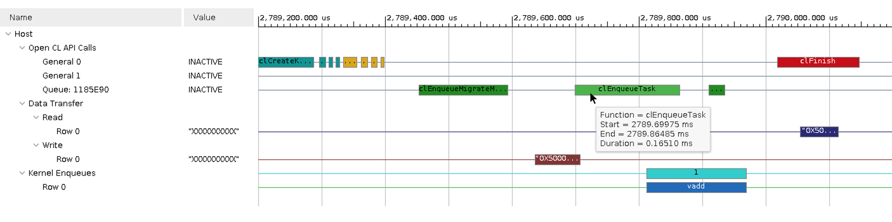

<table class="sphinxhide" width="100%">
 <tr>
   <td align="center"><h1>Vitis™ Application Acceleration Development Flow Tutorials</h1>
   </td>
 </tr>
 <tr>
 <td>
 </td>
 </tr>
</table>

# Vitis Getting Started Tutorial

## Part 5 : Visualizing Results and Analyzing Reports

Now that you have successfully built and run the vector-add example, now you can look at the results and reports generated along the way. This example is configured to generate build and run summaries for all three build targets (software emulation, hardware emulation, and hardware). Any of these summary reports can be viewed and analyzed using the Vitis analyzer tool as described in [Using the Vitis Analyzer](https://docs.xilinx.com/r/en-US/ug1393-vitis-application-acceleration/Using-the-Vitis-Analyzer).

The results will be different depending on the summary or report you open. The hardware run is fully accurate, hardware emulation is a cycle-approximate simulation, and software emulation should only be used for functional considerations. Also, because the U200 and ZCU102 cards have different characteristics, the results will be different between these two targets. View the results from the platform and build target that you want to analyze:

* `u250/sw_emu`
* `u250/hw_emu`
* `u250/hw`
* `zcu102/sw_emu`
* `zcu102/hw_emu`
* `zcu102/hw`

For this lab, you will be opening and viewing results from the `u250/hw_emu` build and run.

## Locating the Reports and Summaries

If you look into the directory where you ran the application, you will notice that a few files were generated by the run:

* `vadd.xo.compile_summary`: A summary report of the compiled kernel.
* `vadd.xclbin.info`: A text report of the device binary.
* `vadd.xclbin.link_summary`: A summary report of the linked device binary.
* `xrt.run_summary`: A summary report of the events of the application runtime.

>**IMPORTANT:** If you targeted the ZCU102 hardware, these files are stored on the SD card and must be copied back to your workstation to continue this lab. Refer to [Running Emulation on an Embedded Processor Platform](https://docs.xilinx.com/r/en-US/ug1393-vitis-application-acceleration/Running-Emulation-on-an-Embedded-Processor-Platform) for more information.

The generation of these files and reports is controlled by runtime options located in the `xrt.ini` file.  This tutorial contains a pre-existing `xrt.ini` file which enables the generation a timeline of execution, and the profile summary data, with the following content:

```bash
[Debug]
native_xrt_trace=true
```

## Opening the Run Summary with Vitis Analyzer

Use the following command to open the summary in Vitis Analyzer:

```bash
vitis_analyzer ./vadd.xclbin.link_summary
```

>**NOTE:** In the 2023.1 release, this command opens the Analysis view of the new Vitis Unified IDE, and loads the run summary as described in [Working with the Analysis View](https://docs.xilinx.com/r/en-US/ug1393-vitis-application-acceleration/Working-with-the-Analysis-View). You can navigate to the various reports using the left pane of the Analysis view or by clicking on the links provided in the summary report.

* Open the Link Summary.
  * The Link Smmary shows the `v++ --link` command and provides a System Estimate of performance.
  * Notice the Estimated Resources information displayed next to the `vadd` kernel.
  * The Guidance report flags issues and potential issues in your application and kernel, and provides actionable feedback on how to improve it.
  * This simple example is not fully optimized and Guidance reports several warnings. Inspect each of these warnings to learn more about optimization opportunities and design best practices.
  * What can you learn about the width of the kernel ports?

The `link_summary` also includes the `compile_summary`. Take a look at the various elements of the `compile_summary` report by selecting them in the Vitis Analyzer tool.

Now, open the Run Summary.

* Open the Profile Summary report.
  * The Profile Summary provides annotated details regarding the overall application performance. All data generated during the execution of the application is grouped into categories.
  * Use the left pane of the report to navigate through the various categories, and explore all the metrics reported in the Profile Summary.
* Open the Timeline Trace.
  * The Timeline Trace collects displays host and kernel events on a common timeline to help visualize the overall health and performance of your system. The graphical representation is very useful to see issues regarding kernel synchronization and efficient concurrent execution.
  * Zoom in and scroll to the far right of the timeline trace to visualize the point where the host program transfers the buffers and executes of the kernel.
  * Hover over the various activity events to get more details about each of them.
  * Can you relate the timeline activity to the sequence of API calls in the `host.cpp` file?

  

When you are done exploring the various reports in Vitis Analyzer, you can close the tool.

## Homework

Now that you have learned the basics of the Vitis flow, you can try some experiments on your own. A good place to start is to try making changes to the host program. If you only change the `host.cpp` file, then you do not need to rebuild the FPGA binary, which makes for very quick build-and-run iterations.

* In the host program, the size of the vectors is hardcoded to 4096 elements (through the DATA_SIZE macro).
  * What happens if you increase this size to a much larger value?
  * What do you see in Vitis Analyzer?
* The host program only calls the accelerator once.
  * What happens if you put a loop around Step 4 in `host.cpp` to iterate a few more times?
  * How does the Timeline Trace look now?
  * Can you make it so that the host program sends different vectors to the kernel each time the host calls it?

## Wrap-Up and Next Steps

Congratulations for completing the **Vitis Flow 101** tutorial. You should now have an understanding of all the essential concepts of the Vitis programming and execution model, including coding considerations and how to build, run and visualize reports.

The vector-add example is as simple as it gets, yet it offers a lot to learn and it is a very good sandbox to dig deeper into key aspects of the flow. The [Get Moving with Alveo tutorial](https://developer.xilinx.com/en/articles/acceleration-basics.html) leverages the same vector-add example and takes it several steps further by illustrating common optimization techniques. Be sure to check it out.

Return to the [Vitis Tutorials](https://github.com/Xilinx/Vitis-Tutorials) home page.

<p class="sphinxhide" align="center"><sub>Copyright © 2020–2023 Advanced Micro Devices, Inc</sub></p>

<p class="sphinxhide" align="center"><sup><a href="https://www.amd.com/en/corporate/copyright">Terms and Conditions</a></sup></p>
