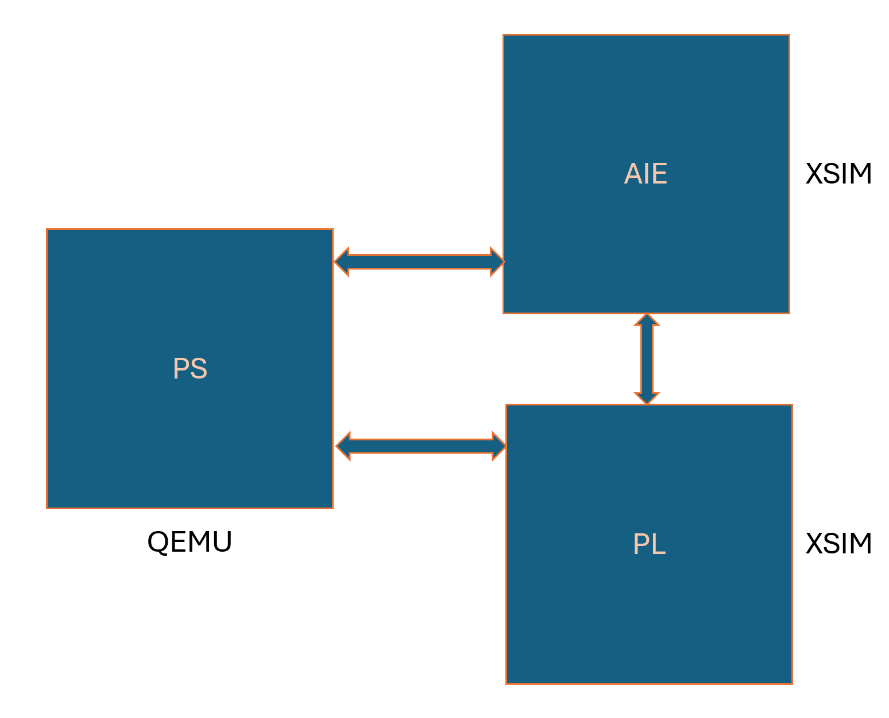

<table class="sphinxhide" width="100%">
 <tr width="100%">
    <td align="center"><h1>AI Engine Development</h1>
    <a href="https://www.xilinx.com/products/design-tools/vitis.html">See Vitis™ Development Environment on xilinx.com</br></a>
    <a href="https://www.xilinx.com/products/design-tools/vitis/vitis-ai.html">See Vitis™ AI Development Environment on xilinx.com</a>
    </td>
 </tr>
</table>

# Hardware Emulation

Hardware Emulation helps to validate the Processing Subsystem (PS), AI Engine (AIE) and Programmable Logic (PL) by mimicking the hardware as closely as possible by using cycle-approximate models.
The Vitis tools take care of stitching all three component and generate a script (launch_hw_emu.sh) to launch the Hardware Emulation.

<p align="center">

</p>

The simulation of full system by using QEMU and RTL Simulator. The host application runs on the QEMU and AI Engine and PL logic is run on the RTL simulator.

To run the hardware emulation of the design, please ensure the design was run with below command
```
make all TARGET=hw_emu
```

### Steps to run the Hardware Emulation

In previous chapters, we used the Vitis Linker and Packager to generate the "emulation" directory conntaining the launch_hw_emu.sh script and necessary files to run the Hardware Emulation. In this chapter, we will use these files to launch the Hardware Emulation and verify the results:

- Launch the Hardware Emulation using launch_hw_emu.sh script

```
cd pack_out_dir
./launch_hw_emu.sh -g
```
**-g** options helps to launch the XSIM in GUI mode.

The above command should result in some prints in the terminal and to invoke the XSIM GUI. Once the simulate starts, please navigate to Vivado Tcl console and run the simulation
```
run all
```
- Run the host.exe

Once the Linux boot is complete, use the below commands to run the host.exe and a.xclbin
versal-rootfs-common-20242:/mnt# 

```
sudo su
cd /run/media/mmcblk0p1
./host.exe a.xclbin
```

- Check the results

```
OUTPUT[0]=30
OUTPUT[1]=70
OUTPUT[2]=110
OUTPUT[3]=150
TEST PASSED

```

Next Chapter: [Running the design on Hardware](./Hardware_Run.md)


<hr class="sphinxhide"></hr>

<p class="sphinxhide" align="center"><sub>Copyright © 2020–2025 Advanced Micro Devices, Inc.</sub></p>

<p class="sphinxhide" align="center"><sup><a href="https://www.amd.com/en/corporate/copyright">Terms and Conditions</a></sup></p>
